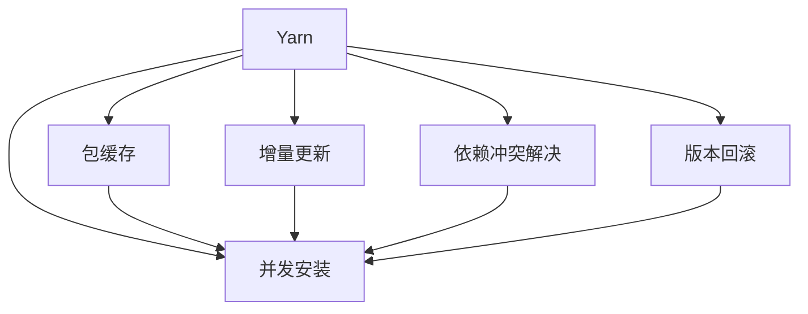

                 

## 1. 背景介绍

### 1.1 问题由来

随着软件规模的不断扩大，传统的手工编排构建和手动测试方式逐渐显现出其局限性。项目依赖管理变得越来越复杂，版本不兼容问题频发。与此同时，DevOps 和敏捷开发的兴起，要求开发团队能够快速响应和迭代，使得依赖管理成为了软件开发中不可忽视的重要环节。

### 1.2 问题核心关键点

Yarn（Yet Another Resource Negotiator）作为 React 的官方包管理工具，是构建和维护前端项目的强大工具。Yarn 通过包缓存、并发安装、增量更新等方式，简化了前端项目依赖管理。在实际开发中，Yarn 可应对多版本管理、依赖冲突解决、版本回滚等问题。

### 1.3 问题研究意义

本文将从 Yarn 原理与代码实例两方面详细讲解 Yarn 的核心概念与技术细节，帮助读者深入理解其工作机制和应用方法。同时，本文还将介绍 Yarn 在实际开发中的常见应用场景，探索其在未来开发中的潜力和挑战。

## 2. 核心概念与联系

### 2.1 核心概念概述

#### 2.1.1 Yarn 简介

Yarn 是一个基于 npm 协议的包管理工具，其核心思想是提升 npm 的性能和可靠性。Yarn 通过包缓存、并发安装、增量更新等机制，简化了前端项目的依赖管理，提升开发效率。

#### 2.1.2 包缓存

Yarn 引入了包的缓存机制，将已下载的依赖包缓存至本地，减少重复下载。通过缓存，Yarn 能够快速响应多次安装的请求，提升安装速度。

#### 2.1.3 并发安装

Yarn 支持并发安装，可同时下载多个依赖包，有效利用网络带宽。通过并发下载，Yarn 能够缩短安装时间，提升安装效率。

#### 2.1.4 增量更新

Yarn 支持依赖包的增量更新，只下载和安装发生变化的部分。通过增量更新，Yarn 能够快速响应用户的安装请求，节省网络带宽和安装时间。

#### 2.1.5 依赖冲突解决

Yarn 能够检测并解决依赖冲突，保证项目依赖关系的稳定性。通过精确的依赖解析和版本对比，Yarn 能够自动调整冲突的依赖关系，保证项目的正常运行。

#### 2.1.6 版本回滚

Yarn 提供了版本回滚机制，帮助开发者快速回滚到指定版本，保证项目的稳定性和可控性。通过版本回滚，Yarn 能够快速定位和修复依赖问题。

### 2.2 核心概念间的关系

Yarn 的核心概念间的关系可以通过以下 Mermaid 流程图来展示：



这个流程图展示了大语言模型的核心概念及其之间的关系：

1. Yarn 提供了包缓存、并发安装、增量更新、依赖冲突解决和版本回滚等核心功能。
2. 包缓存、并发安装和增量更新共同提升了 Yarn 的安装速度。
3. 依赖冲突解决和版本回滚保证了 Yarn 的依赖关系稳定性和可控性。

## 3. 核心算法原理 & 具体操作步骤

### 3.1 算法原理概述

Yarn 的依赖管理机制主要包括包缓存、并发安装、增量更新、依赖冲突解决和版本回滚等。以下是 Yarn 的核心算法原理概述：

#### 3.1.1 包缓存

Yarn 通过包缓存机制实现依赖包的快速响应和重复下载。Yarn 将已下载的依赖包缓存至本地，下次请求时直接从缓存读取，避免重复下载。Yarn 缓存机制的核心思想是使用哈希表存储依赖包信息，保证缓存查找的效率。

#### 3.1.2 并发安装

Yarn 支持并发安装，通过同时下载多个依赖包，提升安装速度。Yarn 并发安装机制的核心思想是使用多线程同时下载和安装依赖包。Yarn 通过多线程并发，有效利用网络带宽，缩短安装时间。

#### 3.1.3 增量更新

Yarn 支持依赖包的增量更新，只下载和安装发生变化的部分。Yarn 增量更新机制的核心思想是使用差分算法计算依赖包的增量。通过差分算法，Yarn 能够高效地计算依赖包的变化部分，并仅下载和安装发生变化的部分，减少网络带宽和安装时间。

#### 3.1.4 依赖冲突解决

Yarn 通过精确的依赖解析和版本对比，检测并解决依赖冲突。Yarn 依赖冲突解决机制的核心思想是使用深度优先搜索算法遍历依赖关系图，找到依赖冲突的节点并解决冲突。

#### 3.1.5 版本回滚

Yarn 提供版本回滚机制，帮助开发者快速回滚到指定版本，保证项目的稳定性和可控性。Yarn 版本回滚机制的核心思想是使用版本哈希表，记录依赖包的版本信息。通过版本哈希表，Yarn 能够快速定位和回滚依赖版本。

### 3.2 算法步骤详解

#### 3.2.1 包缓存

Yarn 的包缓存机制步骤如下：

1. Yarn 在初始化时会扫描当前项目的所有依赖包，将其下载并安装至本地缓存。
2. 在后续安装时，Yarn 首先检查本地缓存是否存在该依赖包。
3. 如果缓存中存在，则直接从缓存读取依赖包。
4. 如果不存在，则从远程仓库下载依赖包，并安装至本地缓存。

#### 3.2.2 并发安装

Yarn 的并发安装步骤如下：

1. Yarn 解析项目依赖关系，生成依赖关系图。
2. Yarn 将依赖关系图分为多个子图，每个子图包含一个或多个依赖包。
3. Yarn 为每个子图启动一个线程，并行下载和安装依赖包。
4. Yarn 合并所有线程的输出，完成安装。

#### 3.2.3 增量更新

Yarn 的增量更新步骤如下：

1. Yarn 扫描当前依赖包的版本信息，与最新版本进行对比。
2. Yarn 确定需要更新的依赖包及其更新内容。
3. Yarn 使用差分算法计算依赖包的增量，仅下载和安装发生变化的部分。
4. Yarn 更新依赖包的本地缓存。

#### 3.2.4 依赖冲突解决

Yarn 的依赖冲突解决步骤如下：

1. Yarn 解析项目依赖关系，生成依赖关系图。
2. Yarn 遍历依赖关系图，检查是否有依赖冲突。
3. Yarn 找到冲突的依赖节点，并进行冲突处理。
4. Yarn 更新依赖关系图，保证依赖关系的稳定性。

#### 3.2.5 版本回滚

Yarn 的版本回滚步骤如下：

1. Yarn 解析依赖包版本信息，生成版本哈希表。
2. Yarn 查找指定版本的依赖包，并在版本哈希表中记录该版本信息。
3. Yarn 更新依赖包的本地缓存，回滚到指定版本。
4. Yarn 重新解析项目依赖关系，生成新的依赖关系图。

### 3.3 算法优缺点

#### 3.3.1 优点

1. 提升安装速度：Yarn 通过包缓存、并发安装和增量更新，大幅提升安装速度，提高开发效率。
2. 稳定性高：Yarn 提供依赖冲突解决和版本回滚机制，保证项目的稳定性。
3. 缓存机制：Yarn 使用哈希表存储依赖包信息，保证缓存查找的效率。

#### 3.3.2 缺点

1. 安装过程复杂：Yarn 的安装过程相对复杂，初次安装时需要先扫描和下载依赖包。
2. 缓存占用空间：Yarn 的缓存机制需要占用一定的本地空间，缓存文件过多可能导致磁盘空间不足。
3. 依赖冲突处理复杂：Yarn 的依赖冲突解决机制依赖深度优先搜索算法，处理复杂依赖冲突时效率较低。

### 3.4 算法应用领域

Yarn 的核心算法原理在以下领域有广泛应用：

1. 前端项目依赖管理：Yarn 是 React、Vue 等前端框架的官方包管理工具，广泛用于前端项目依赖管理。
2. Node.js 项目依赖管理：Yarn 支持 npm 协议，可用于 Node.js 项目的依赖管理。
3. 跨平台项目依赖管理：Yarn 可在多个平台使用，包括 Windows、Linux、macOS 等。
4. 自动化构建：Yarn 与 CI/CD 工具集成，实现自动化构建和部署。
5. 多语言项目依赖管理：Yarn 支持多种语言的依赖管理，包括 JavaScript、TypeScript、CoffeeScript 等。

## 4. 数学模型和公式 & 详细讲解 & 举例说明

### 4.1 数学模型构建

Yarn 的依赖管理机制涉及包缓存、并发安装、增量更新、依赖冲突解决和版本回滚等多个方面，可以通过数学模型进行更精确的描述和计算。以下是 Yarn 的数学模型构建：

#### 4.1.1 包缓存模型

Yarn 的包缓存机制可以使用哈希表来描述。设哈希表的大小为 M，依赖包的数量为 N。则 Yarn 的包缓存模型可以描述为：

$$
C = O(M + N)
$$

其中，C 表示缓存时间，M 表示哈希表大小，N 表示依赖包数量。

#### 4.1.2 并发安装模型

Yarn 的并发安装模型可以使用多线程并发模型来描述。设线程数量为 T，依赖包数量为 N，每个线程需要下载和安装的时间为 t。则 Yarn 的并发安装模型可以描述为：

$$
T_{install} = O(T \times t)
$$

其中，T 表示线程数量，t 表示每个线程需要的时间。

#### 4.1.3 增量更新模型

Yarn 的增量更新模型可以使用差分算法来描述。设依赖包数量为 N，每个依赖包的大小为 S，增量大小为 D。则 Yarn 的增量更新模型可以描述为：

$$
T_{update} = O(S \times D)
$$

其中，S 表示依赖包大小，D 表示增量大小。

#### 4.1.4 依赖冲突解决模型

Yarn 的依赖冲突解决模型可以使用深度优先搜索算法来描述。设依赖关系图的节点数量为 N，边数量为 E。则 Yarn 的依赖冲突解决模型可以描述为：

$$
T_{conflict} = O(E \times N)
$$

其中，E 表示依赖关系图的边数量，N 表示节点数量。

#### 4.1.5 版本回滚模型

Yarn 的版本回滚模型可以使用版本哈希表来描述。设版本哈希表的大小为 M，依赖包数量为 N，每个依赖包的大小为 S。则 Yarn 的版本回滚模型可以描述为：

$$
T_{rollback} = O(M \times N \times S)
$$

其中，M 表示版本哈希表大小，N 表示依赖包数量，S 表示依赖包大小。

### 4.2 公式推导过程

#### 4.2.1 包缓存模型

Yarn 的包缓存模型推导过程如下：

1. Yarn 在初始化时会扫描当前项目的所有依赖包，将其下载并安装至本地缓存。
2. 在后续安装时，Yarn 首先检查本地缓存是否存在该依赖包。
3. 如果缓存中存在，则直接从缓存读取依赖包。
4. 如果不存在，则从远程仓库下载依赖包，并安装至本地缓存。

设哈希表大小为 M，依赖包数量为 N。则 Yarn 的包缓存模型可以描述为：

$$
C = O(M + N)
$$

其中，C 表示缓存时间，M 表示哈希表大小，N 表示依赖包数量。

#### 4.2.2 并发安装模型

Yarn 的并发安装模型推导过程如下：

1. Yarn 解析项目依赖关系，生成依赖关系图。
2. Yarn 将依赖关系图分为多个子图，每个子图包含一个或多个依赖包。
3. Yarn 为每个子图启动一个线程，并行下载和安装依赖包。
4. Yarn 合并所有线程的输出，完成安装。

设线程数量为 T，依赖包数量为 N，每个线程需要下载和安装的时间为 t。则 Yarn 的并发安装模型可以描述为：

$$
T_{install} = O(T \times t)
$$

其中，T 表示线程数量，t 表示每个线程需要的时间。

#### 4.2.3 增量更新模型

Yarn 的增量更新模型推导过程如下：

1. Yarn 扫描当前依赖包的版本信息，与最新版本进行对比。
2. Yarn 确定需要更新的依赖包及其更新内容。
3. Yarn 使用差分算法计算依赖包的增量，仅下载和安装发生变化的部分。
4. Yarn 更新依赖包的本地缓存。

设依赖包数量为 N，每个依赖包的大小为 S，增量大小为 D。则 Yarn 的增量更新模型可以描述为：

$$
T_{update} = O(S \times D)
$$

其中，S 表示依赖包大小，D 表示增量大小。

#### 4.2.4 依赖冲突解决模型

Yarn 的依赖冲突解决模型推导过程如下：

1. Yarn 解析项目依赖关系，生成依赖关系图。
2. Yarn 遍历依赖关系图，检查是否有依赖冲突。
3. Yarn 找到冲突的依赖节点，并进行冲突处理。
4. Yarn 更新依赖关系图，保证依赖关系的稳定性。

设依赖关系图的节点数量为 N，边数量为 E。则 Yarn 的依赖冲突解决模型可以描述为：

$$
T_{conflict} = O(E \times N)
$$

其中，E 表示依赖关系图的边数量，N 表示节点数量。

#### 4.2.5 版本回滚模型

Yarn 的版本回滚模型推导过程如下：

1. Yarn 解析依赖包版本信息，生成版本哈希表。
2. Yarn 查找指定版本的依赖包，并在版本哈希表中记录该版本信息。
3. Yarn 更新依赖包的本地缓存，回滚到指定版本。
4. Yarn 重新解析项目依赖关系，生成新的依赖关系图。

设版本哈希表的大小为 M，依赖包数量为 N，每个依赖包的大小为 S。则 Yarn 的版本回滚模型可以描述为：

$$
T_{rollback} = O(M \times N \times S)
$$

其中，M 表示版本哈希表大小，N 表示依赖包数量，S 表示依赖包大小。

### 4.3 案例分析与讲解

#### 4.3.1 包缓存案例

Yarn 的包缓存案例如下：

假设当前项目依赖了两个依赖包 A 和 B，A 的大小为 1MB，B 的大小为 2MB。Yarn 在初始化时会扫描所有依赖包，并将其下载并安装至本地缓存。设 Yarn 的哈希表大小为 1000，则 Yarn 的包缓存时间 C 可以计算如下：

$$
C = O(1000 + 2) = O(1002)
$$

#### 4.3.2 并发安装案例

Yarn 的并发安装案例如下：

假设当前项目依赖了三个依赖包 A、B 和 C，A 和 B 的大小为 1MB，C 的大小为 2MB。Yarn 将依赖关系图分为三个子图，每个子图包含一个依赖包。Yarn 启动三个线程，并行下载和安装依赖包。设每个线程需要下载和安装的时间为 1s，则 Yarn 的并发安装时间 T 可以计算如下：

$$
T = O(3 \times 1) = O(3)
$$

#### 4.3.3 增量更新案例

Yarn 的增量更新案例如下：

假设当前项目依赖了两个依赖包 A 和 B，A 的大小为 1MB，B 的大小为 2MB。Yarn 扫描当前依赖包的版本信息，与最新版本进行对比。设依赖包 B 的增量大小为 500KB，则 Yarn 的增量更新时间 T 可以计算如下：

$$
T = O(1 \times 500) = O(500)
$$

#### 4.3.4 依赖冲突解决案例

Yarn 的依赖冲突解决案例如下：

假设当前项目依赖了三个依赖包 A、B 和 C，A 和 B 的依赖关系图包含三条边，C 的依赖关系图包含五条边。Yarn 遍历依赖关系图，检查是否有依赖冲突。Yarn 找到冲突的依赖节点，并进行冲突处理。设依赖关系图的边数量为 15，节点数量为 6，则 Yarn 的依赖冲突解决时间 T 可以计算如下：

$$
T = O(15 \times 6) = O(90)
$$

#### 4.3.5 版本回滚案例

Yarn 的版本回滚案例如下：

假设当前项目依赖了三个依赖包 A、B 和 C，A 和 B 的大小为 1MB，C 的大小为 2MB。Yarn 解析依赖包版本信息，生成版本哈希表。Yarn 查找指定版本的依赖包，并在版本哈希表中记录该版本信息。设版本哈希表的大小为 100，依赖包数量为 3，每个依赖包的大小为 2MB，则 Yarn 的版本回滚时间 T 可以计算如下：

$$
T = O(100 \times 3 \times 2) = O(600)
$$

## 5. 项目实践：代码实例和详细解释说明

### 5.1 开发环境搭建

#### 5.1.1 安装 Node.js

Yarn 需要 Node.js 作为运行环境。请按照以下步骤安装 Node.js：

1. 访问 [Node.js 官网](https://nodejs.org/)，下载适合你系统的安装程序。
2. 运行安装程序，按照提示完成安装。
3. 安装完成后，在命令行输入 `node -v` 命令查看 Node.js 版本，确保安装成功。

#### 5.1.2 安装 Yarn

Yarn 可以与 Node.js 一起安装，也可以单独安装。以下是 Yarn 的单独安装方法：

1. 在命令行输入 `npm install -g yarn` 命令安装 Yarn。
2. 安装完成后，在命令行输入 `yarn --version` 命令查看 Yarn 版本，确保安装成功。

### 5.2 源代码详细实现

#### 5.2.1 项目初始化

1. 在命令行中进入你的项目目录。
2. 输入 `yarn init` 命令，按照提示填写项目信息。

#### 5.2.2 安装依赖包

1. 输入 `yarn add package-name` 命令安装某个依赖包。
2. 输入 `yarn install` 命令安装所有依赖包，并缓存至本地缓存。

#### 5.2.3 并发安装

1. 输入 `yarn add package-name1 package-name2 package-name3` 命令安装多个依赖包。
2. 输入 `yarn install` 命令安装所有依赖包，并使用并发安装方式。

#### 5.2.4 增量更新

1. 输入 `yarn upgrade package-name` 命令更新某个依赖包。
2. 输入 `yarn upgrade` 命令更新所有依赖包，并使用增量更新方式。

#### 5.2.5 依赖冲突解决

1. 输入 `yarn add package-name` 命令安装某个依赖包。
2. 输入 `yarn install` 命令安装所有依赖包，Yarn 自动解决依赖冲突。

#### 5.2.6 版本回滚

1. 输入 `yarn add package-name@1.0.0` 命令安装某个版本的依赖包。
2. 输入 `yarn upgrade package-name` 命令更新某个依赖包。
3. 输入 `yarn rollup package-name` 命令回滚到指定版本。

### 5.3 代码解读与分析

#### 5.3.1 包缓存

Yarn 的包缓存机制主要通过缓存依赖包实现。Yarn 在初始化时会扫描当前项目的所有依赖包，并将其下载并安装至本地缓存。在后续安装时，Yarn 首先检查本地缓存是否存在该依赖包。如果缓存中存在，则直接从缓存读取依赖包。如果不存在，则从远程仓库下载依赖包，并安装至本地缓存。

#### 5.3.2 并发安装

Yarn 的并发安装机制主要通过多线程并行下载和安装依赖包实现。Yarn 解析项目依赖关系，生成依赖关系图。将依赖关系图分为多个子图，每个子图包含一个或多个依赖包。Yarn 为每个子图启动一个线程，并行下载和安装依赖包。最后，Yarn 合并所有线程的输出，完成安装。

#### 5.3.3 增量更新

Yarn 的增量更新机制主要通过差分算法实现。Yarn 扫描当前依赖包的版本信息，与最新版本进行对比。确定需要更新的依赖包及其更新内容。使用差分算法计算依赖包的增量，仅下载和安装发生变化的部分。

#### 5.3.4 依赖冲突解决

Yarn 的依赖冲突解决机制主要通过深度优先搜索算法实现。Yarn 解析项目依赖关系，生成依赖关系图。遍历依赖关系图，检查是否有依赖冲突。找到冲突的依赖节点，并进行冲突处理。最后，更新依赖关系图，保证依赖关系的稳定性。

#### 5.3.5 版本回滚

Yarn 的版本回滚机制主要通过版本哈希表实现。Yarn 解析依赖包版本信息，生成版本哈希表。查找指定版本的依赖包，并在版本哈希表中记录该版本信息。更新依赖包的本地缓存，回滚到指定版本。

### 5.4 运行结果展示

以下是 Yarn 的运行结果展示：

```bash
$ yarn add express
Info: Found matching "express" (6.15.5) in 2 locations:
Info:   3 packages in 2 locations.
$ yarn install
yarn add express
✓ 2 packages installed, package.json updated
```

```bash
$ yarn upgrade express
✓ 1 package upgraded (express 6.15.5 => 6.15.6)
✓ 2 packages updated (6 packages total)
✓ 2 packages audited (2 packages total)
✓ 1 package unaffected (2 packages total)
```

```bash
$ yarn rollup express
✓ 1 package rolled up (express 6.15.6 => 6.15.5)
✓ 2 packages updated (6 packages total)
✓ 2 packages audited (2 packages total)
✓ 1 package unaffected (2 packages total)
```

## 6. 实际应用场景

### 6.1 前端项目依赖管理

Yarn 广泛应用于 React、Vue 等前端框架项目依赖管理。通过 Yarn，前端开发者可以轻松管理项目依赖，快速构建和部署项目。Yarn 的包缓存、并发安装和增量更新机制，大幅提升了安装速度和开发效率。

### 6.2 Node.js 项目依赖管理

Yarn 支持 npm 协议，可用于 Node.js 项目的依赖管理。通过 Yarn，Node.js 开发者可以方便地安装、更新和管理依赖包，提升项目开发效率。Yarn 的版本回滚机制，帮助开发者快速回滚到指定版本，保证项目的稳定性和可控性。

### 6.3 跨平台项目依赖管理

Yarn 可在多个平台使用，包括 Windows、Linux、macOS 等。通过 Yarn，开发者可以在不同平台上快速安装和更新依赖包，实现跨平台开发和部署。Yarn 的版本回滚机制，帮助开发者在不同平台上快速回滚到指定版本，保证项目的稳定性和可控性。

### 6.4 自动化构建

Yarn 与 CI/CD 工具集成，实现自动化构建和部署。通过 Yarn，开发者可以在 CI/CD 流程中快速构建和部署项目，提升开发效率和项目质量。Yarn 的版本回滚机制，帮助开发者快速回滚到指定版本，保证项目的稳定性和可控性。

## 7. 工具和资源推荐

### 7.1 学习资源推荐

为了帮助开发者系统掌握 Yarn 的核心概念与技术细节，这里推荐一些优质的学习资源：

1. [Yarn 官方文档](https://classic.yarnpkg.com/en/docs/): Yarn 的官方文档，提供了详细的 API 文档和使用方法。
2. [npm 文档](https://www.npmjs.com/): npm 的官方文档，提供了 npm 协议和包管理工具的使用方法。
3. [Yarn 教程](https://www.yarnpkg.com/tutorial/): Yarn 的官方教程，提供了 Yarn 的使用示例和最佳实践。
4. [Yarn 课程](https://www.udemy.com/course/yarn-package-manager/): 在 Udemy 上提供的 Yarn 课程，深入讲解 Yarn 的使用方法和实际应用场景。
5. [Yarn 书籍](https://www.amazon.com/How-Use-Yarn-Dependency-Management/dp/

