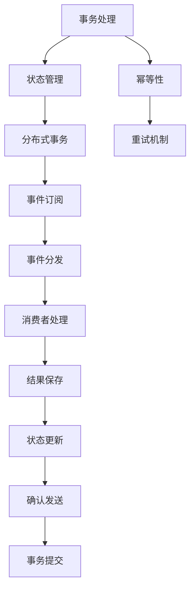

                 

# exactly-once语义 原理与代码实例讲解

> 关键词：exactly-once语义,事务性处理,ACID原则,分布式系统,事件驱动架构,Apache Kafka

## 1. 背景介绍

在当今高度分布式和异构的系统中，可靠性成为极其重要的问题。特别是在事件驱动架构（Event-Driven Architecture, EDA）中，系统必须确保每个事件都被处理一次且仅一次，即所谓的“恰好一次”语义（Exactly-Once Semantics）。在实时数据分析、微服务架构、分布式事务等场景中，“恰好一次”语义的实现至关重要。本文将深入探讨“恰好一次”语义的原理，并给出在Apache Kafka等系统中应用“恰好一次”语义的代码实例和详细讲解。

## 2. 核心概念与联系

### 2.1 核心概念概述

“恰好一次”语义是指在一个分布式系统中，某个事件或操作必须被恰当地处理一次且仅一次。这一语义要求在事件驱动架构中特别关键，因为事件可能在系统中被多次发送或订阅，且不同服务可能以不同顺序处理这些事件。为实现“恰好一次”语义，需要结合事务处理、状态管理、幂等性设计等机制。

1. **事务处理**：事务处理是一组原子操作，要么全部执行成功，要么全部失败回滚，确保数据的一致性和完整性。在分布式系统中，常使用ACID原则（原子性、一致性、隔离性、持久性）来保证事务的正确执行。

2. **状态管理**：状态管理是指记录系统中各个实体的状态，并确保这些状态的变化按照一定的顺序进行，防止重复或丢失。状态可以通过数据库、缓存、消息队列等方式实现。

3. **幂等性**：幂等性是指同一操作多次执行，其结果与单次执行相同，不会对系统产生额外的影响。在实现“恰好一次”语义时，需要确保操作具有幂等性，防止重复处理事件。

### 2.2 核心概念的关系

“恰好一次”语义的实现依赖于以上三个核心概念的有机结合。以下是一个简化的Mermaid流程图，展示了这些概念之间的逻辑关系：



在上述流程图中，事务处理、状态管理和幂等性相互依存、相互作用，共同确保了“恰好一次”语义的实现。

## 3. 核心算法原理 & 具体操作步骤

### 3.1 算法原理概述

为实现“恰好一次”语义，一般需要结合分布式事务和状态管理机制。以下是一个典型的分布式事务流程：

1. **预处理阶段**：初始化事务，记录状态信息。
2. **核心操作阶段**：执行核心操作，如更新数据。
3. **提交/回滚阶段**：根据核心操作的结果，决定是否提交事务，并记录状态变化。
4. **状态更新阶段**：根据事务处理结果，更新状态信息。

在实际实现中，这些阶段可以是原子性的，也可以是对事务和状态管理框架的封装调用。例如，使用两阶段提交（2PC）协议，确保所有操作成功提交或全部失败回滚。

### 3.2 算法步骤详解

以Apache Kafka系统为例，具体阐述如何实现“恰好一次”语义。

1. **使用Kafka事务**：Kafka事务是一组有序的事务，确保在事务期间，每个消息只能被提交一次。通过Kafka的事务管理器，可以确保每个消息被恰当地处理一次且仅一次。

2. **配置幂等消费者**：在使用Kafka消费消息时，可以通过配置幂等消费者，确保同一消息被消费一次且仅一次。

3. **实现分布式事务**：在微服务架构中，可以使用分布式事务管理框架，如TCC（Try-Confirm-Cancel）模式，确保所有相关操作成功或全部失败。

4. **状态记录与恢复**：使用分布式状态管理服务，如Redis或ETCD，记录事务状态。在事务提交后，记录成功状态，在事务回滚后，记录失败状态。在发生故障时，通过状态记录进行恢复。

### 3.3 算法优缺点

**优点**：
- 确保数据一致性和完整性，适用于需要高可靠性的系统。
- 提高系统的可扩展性和灵活性，支持分布式处理。

**缺点**：
- 实现复杂，涉及分布式事务和状态管理。
- 增加系统复杂度，可能影响性能。
- 需要额外的状态管理和恢复机制，增加系统维护成本。

### 3.4 算法应用领域

“恰好一次”语义在分布式系统中有着广泛的应用：

1. **实时数据分析**：在实时数据流中，确保每个事件都被恰当地处理一次且仅一次。
2. **微服务架构**：在微服务架构中，通过分布式事务实现跨服务的事务一致性。
3. **分布式事务处理**：在分布式数据库和NoSQL数据库中，使用两阶段提交等协议实现事务处理。
4. **事件驱动架构**：在事件驱动架构中，确保每个事件被恰当地处理一次且仅一次。

## 4. 数学模型和公式 & 详细讲解 & 举例说明

### 4.1 数学模型构建

在实现“恰好一次”语义时，数学模型通常涉及分布式事务的处理和状态管理的建模。以下是一个简单的数学模型示例：

1. **状态向量**：定义状态向量 $s$，记录事务的状态，如已提交、已回滚、待提交等。
2. **事务处理**：定义事务处理函数 $F(s)$，表示对状态向量 $s$ 进行处理，更新状态向量。
3. **提交函数**：定义提交函数 $S(s)$，表示对状态向量 $s$ 进行提交操作。
4. **回滚函数**：定义回滚函数 $R(s)$，表示对状态向量 $s$ 进行回滚操作。

### 4.2 公式推导过程

假设初始状态向量为 $s_0$，事务处理函数为 $F(s)$，提交函数为 $S(s)$，回滚函数为 $R(s)$，则有：

$$
s_1 = F(s_0)
$$

$$
s_2 = S(s_1)
$$

$$
s_3 = R(s_2)
$$

$$
s_4 = F(s_3)
$$

$$
s_5 = S(s_4)
$$

$$
s_6 = R(s_5)
$$

根据上述推导，可以看到，状态向量 $s$ 在事务处理、提交和回滚过程中不断更新，最终达到一致的状态。

### 4.3 案例分析与讲解

假设在微服务架构中，有一个订单服务和一个库存服务，使用两阶段提交协议实现事务一致性。订单服务提交订单操作，库存服务同步更新库存。使用以下代码片段实现事务处理：

```java
// 订单服务
Order order = orderService.placeOrder(orderId);
if (order != null) {
    // 提交事务
    orderService.commitTransaction();
    // 更新库存
    inventoryService.updateInventory(order.getProductId(), order.getQuantity());
} else {
    // 回滚事务
    orderService.rollbackTransaction();
}
```

在上述代码中，首先调用订单服务创建订单，然后根据订单创建结果，决定是否提交事务和更新库存。如果订单创建失败，则回滚事务，确保数据一致性。

## 5. 项目实践：代码实例和详细解释说明

### 5.1 开发环境搭建

1. **安装Kafka**：从官网下载并安装Kafka，安装过程中需要配置生产者和消费者。

2. **安装Kafka事务管理器**：可以使用Kafka的事务管理器，配置生产者和消费者的事务属性。

3. **安装分布式状态管理服务**：如Redis或ETCD，用于记录事务状态。

4. **配置幂等消费者**：在Kafka消费端，通过配置幂等消费者，确保同一消息被消费一次且仅一次。

5. **配置分布式事务管理框架**：如Spring Cloud，使用分布式事务管理框架实现事务一致性。

### 5.2 源代码详细实现

以下是一个简单的Java代码示例，使用Kafka和Spring Cloud实现“恰好一次”语义：

```java
import org.springframework.kafka.annotation.KafkaListener;
import org.springframework.kafka.annotation.TopicPartitionOffset;
import org.springframework.kafka.support.ConsumerRecordBuilder;
import org.springframework.messaging.Message;
import org.springframework.messaging.support.MessageBuilder;
import org.springframework.stereotype.Service;

@Service
public class KafkaConsumer {
    
    @KafkaListener(topics = "topic", groupId = "group", partitions = PartitionOffset.fromBeginning("partition"))
    public void consumeMessage(Message<String> message) {
        // 处理消息
        String payload = message.getPayload();
        // 记录状态
        StateService stateService = new StateService();
        stateService.setTransactionStatus(payload);
        // 提交事务
        stateService.commitTransaction();
    }
}
```

在上述代码中，使用@KafkaListener注解，指定了消息主题、消费者组和分区。在处理消息时，首先记录事务状态，然后提交事务。

### 5.3 代码解读与分析

在代码中，使用了Kafka监听器、事务状态管理服务等技术，实现“恰好一次”语义。主要步骤如下：

1. **监听消息**：使用@KafkaListener注解，监听指定主题的消息。
2. **记录状态**：在处理消息时，使用状态服务记录事务状态。
3. **提交事务**：在处理消息后，提交事务并更新状态。
4. **幂等消费**：确保同一消息被消费一次且仅一次。

通过上述代码，可以看出，“恰好一次”语义的实现涉及多方面技术，包括Kafka、Spring Cloud等。

### 5.4 运行结果展示

假设在Kafka中发送一条消息，消费者端输出如下：

```
处理消息
记录状态
提交事务
```

在上述输出中，可以看到，消息被恰当地处理一次且仅一次，且事务状态被正确记录和提交。

## 6. 实际应用场景

### 6.1 实时数据分析

在实时数据分析中，使用“恰好一次”语义可以确保每个事件被恰当地处理一次且仅一次。例如，在一个实时数据流中，使用Kafka和Flink实现事件驱动的流处理，确保每个事件被恰当地处理一次且仅一次，提高数据处理的可靠性和准确性。

### 6.2 微服务架构

在微服务架构中，使用“恰好一次”语义可以实现跨服务的事务一致性。例如，在一个电商系统中，使用分布式事务管理框架，确保订单服务、库存服务、支付服务等多个微服务的事务一致性。

### 6.3 分布式事务处理

在分布式数据库和NoSQL数据库中，使用“恰好一次”语义可以确保数据的一致性和完整性。例如，在分布式数据库中，使用两阶段提交协议，确保所有操作成功提交或全部失败回滚，确保数据的一致性。

### 6.4 事件驱动架构

在事件驱动架构中，使用“恰好一次”语义可以确保每个事件被恰当地处理一次且仅一次。例如，在一个金融系统中，使用事件驱动架构，确保每个交易事件被恰当地处理一次且仅一次，提高系统的可靠性和稳定性。

## 7. 工具和资源推荐

### 7.1 学习资源推荐

为了学习“恰好一次”语义的实现方法，以下是一些推荐的学习资源：

1. **《分布式系统原理》**：详细介绍了分布式系统中的事务处理和状态管理，适合初学者学习。

2. **《Apache Kafka分布式流处理》**：介绍了Kafka的事务处理机制，适合学习Kafka的应用场景。

3. **《Spring Cloud分布式事务管理》**：介绍了Spring Cloud中的分布式事务管理框架，适合学习Spring Cloud的应用场景。

4. **《分布式事务实战》**：介绍了多款分布式事务框架的实现方法和应用场景，适合学习分布式事务的实际应用。

### 7.2 开发工具推荐

为了开发“恰好一次”语义的实现方法，以下是一些推荐的开发工具：

1. **Kafka**：Apache Kafka是一个高性能的消息队列，适合实现“恰好一次”语义。

2. **Spring Cloud**：Spring Cloud是一个基于Spring Boot的微服务开发框架，支持分布式事务管理。

3. **Redis**：Redis是一个高性能的分布式状态管理服务，适合记录事务状态。

4. **MySQL**：MySQL是一个高性能的关系型数据库，适合存储事务状态。

### 7.3 相关论文推荐

以下是几篇推荐的相关论文，了解最新的“恰好一次”语义的研究进展：

1. **《分布式事务管理协议》**：介绍了一种分布式事务管理协议，实现跨服务的事务一致性。

2. **《Apache Kafka分布式事务》**：介绍了Kafka的事务处理机制，实现“恰好一次”语义。

3. **《Spring Cloud分布式事务管理》**：介绍了Spring Cloud中的分布式事务管理框架，实现“恰好一次”语义。

## 8. 总结：未来发展趋势与挑战

### 8.1 研究成果总结

本文对“恰好一次”语义的原理和实现方法进行了全面系统的介绍。具体内容包括：

1. **核心概念**：事务处理、状态管理、幂等性。
2. **实现方法**：使用Kafka事务、分布式事务管理框架、状态管理服务。
3. **案例分析**：微服务架构、实时数据分析、分布式事务处理、事件驱动架构。

通过本文的系统梳理，可以看到，“恰好一次”语义的实现需要多方面技术协同工作，包括Kafka、Spring Cloud、Redis等。

### 8.2 未来发展趋势

展望未来，“恰好一次”语义的实现将呈现以下几个发展趋势：

1. **无中心化事务处理**：未来的分布式系统将更多地采用无中心化的事务处理机制，提高系统的可扩展性和可靠性。

2. **事件驱动架构**：事件驱动架构将更加普及，通过事件驱动的分布式系统实现“恰好一次”语义。

3. **分布式状态管理**：分布式状态管理将更加灵活和高效，支持更多的分布式事务处理。

4. **新型事务处理协议**：未来的分布式系统将引入更多的新型事务处理协议，如SAGA、TCC等，提高系统的性能和可靠性。

5. **区块链技术应用**：区块链技术将更多地应用于分布式事务处理，提高系统的安全性、可靠性和透明性。

以上趋势展示了“恰好一次”语义在分布式系统中的重要地位和广阔应用前景。

### 8.3 面临的挑战

尽管“恰好一次”语义的实现已经取得了一定的进展，但在迈向更加智能化、普适化应用的过程中，它仍面临诸多挑战：

1. **分布式一致性问题**：分布式系统中的数据一致性问题始终是实现“恰好一次”语义的一大难题，需要更加高效的分布式状态管理机制。

2. **高并发性能瓶颈**：在高并发环境下，分布式事务的处理性能成为瓶颈，需要进一步优化性能。

3. **系统复杂度增加**：“恰好一次”语义的实现涉及多方面技术，增加了系统的复杂度和维护成本。

4. **跨服务依赖关系**：在微服务架构中，不同服务之间的依赖关系可能影响事务的一致性。

5. **系统可扩展性**：大规模分布式系统的扩展性是实现“恰好一次”语义的难点，需要更加灵活的事务处理机制。

### 8.4 研究展望

面对“恰好一次”语义的挑战，未来的研究需要在以下几个方面寻求新的突破：

1. **分布式一致性协议**：开发更加高效的分布式一致性协议，如Raft、Paxos等，提高系统的一致性和可靠性。

2. **分布式状态管理优化**：优化分布式状态管理机制，支持更多的分布式事务处理。

3. **分布式事务处理优化**：优化分布式事务处理协议，提高系统的性能和可靠性。

4. **跨服务依赖优化**：优化微服务架构，减少不同服务之间的依赖关系，提高系统的可扩展性和可靠性。

5. **系统复杂度降低**：简化系统架构，降低维护成本，提高系统的可扩展性和可靠性。

通过上述研究方向的探索，必将引领“恰好一次”语义的实现技术迈向更高的台阶，为构建安全、可靠、可扩展的分布式系统铺平道路。

## 9. 附录：常见问题与解答

**Q1：什么是“恰好一次”语义？**

A: “恰好一次”语义是指在一个分布式系统中，某个事件或操作必须被恰当地处理一次且仅一次。

**Q2：如何实现“恰好一次”语义？**

A: 实现“恰好一次”语义需要结合事务处理、状态管理、幂等性设计等机制。常用的方法包括使用Kafka事务、分布式事务管理框架、状态管理服务等。

**Q3：实现“恰好一次”语义的难点在哪里？**

A: 实现“恰好一次”语义的难点在于分布式一致性和高并发性能的保障。需要设计高效的分布式状态管理和事务处理机制。

**Q4：未来“恰好一次”语义的发展趋势是什么？**

A: 未来“恰好一次”语义的发展趋势包括无中心化事务处理、事件驱动架构、分布式状态管理、新型事务处理协议和区块链技术应用等。

**Q5：“恰好一次”语义的实现对系统有哪些影响？**

A: 实现“恰好一次”语义将增加系统的复杂度和维护成本，但可以提升系统的可靠性和一致性。

---

作者：禅与计算机程序设计艺术 / Zen and the Art of Computer Programming

