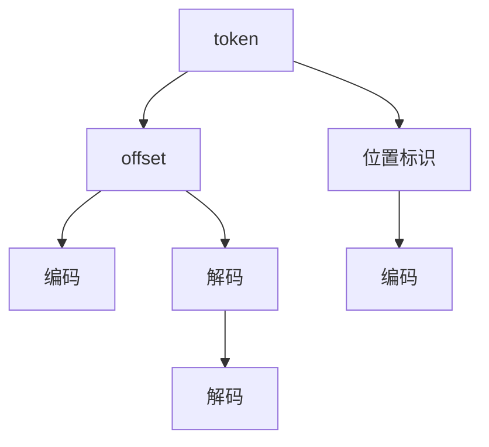

                 

# offset 原理与代码实例讲解

## 1. 背景介绍

在自然语言处理(NLP)领域，offset是处理文本序列时的一个核心概念。通常，文本序列中的每个token都有一个位置标识，用于表示它在整个文本中的相对位置。offset则是在编码过程中，对token位置进行更加精细的映射，以便于模型处理变长输入序列。本文将详细讲解offset的原理、实现方法以及相关代码实例，帮助读者全面理解其在NLP中的应用。

## 2. 核心概念与联系

### 2.1 核心概念概述

- **token**：文本序列中最小的语义单位，可以是单词、短语等。
- **offset**：token在编码过程中，对位置进行更精细的映射，用于处理变长输入序列。
- **位置标识**：用于表示token在文本中的相对位置。
- **编码**：将文本序列转换为模型可以处理的数值形式。
- **解码**：将模型输出转换为文本序列的过程。

### 2.2 核心概念的关系

通过以下Mermaid流程图，我们可以清晰地看到offset与其他核心概念的关系：



从上述关系图可以看出，offset的映射过程与token位置标识密切相关，是编码和解码过程中必不可少的一环。

## 3. 核心算法原理 & 具体操作步骤

### 3.1 算法原理概述

在自然语言处理任务中，模型通常需要处理不同长度的输入序列，为了保证模型能够高效地处理输入，offset提供了灵活的位置映射机制。

假设文本序列中第$i$个token的位置标识为`pos_i`，则偏移量`offset_i`的计算公式为：

$$
\text{offset}_i = \sum_{k=1}^{i} \text{length}_k
$$

其中`length_k`表示文本中前`k`个token的长度总和。例如，对于长度为`len(x)`的文本`x`，其第一个token的`offset`值为`0`，第二个token的`offset`值为`len(x[0])`，以此类推。

通过offset，模型可以更加灵活地处理不同长度的文本序列，避免了因为变长输入导致的资源浪费和性能瓶颈。

### 3.2 算法步骤详解

#### 3.2.1 数据准备

在开始编码前，需要对文本数据进行预处理，主要包括：

- 分词：将文本序列分割成单词或短语，形成token列表。
- 编码：将token列表转换为数值形式，以便于模型处理。
- 计算offset：根据token位置标识，计算每个token的`offset`值。

#### 3.2.2 编码实现

在编码过程中，需要确保每个token的`offset`值与其在模型输入中的位置对应。一种常见的实现方式是，将`offset`值作为输入的一部分，与token编码一起输入模型。例如，在BERT模型中，每个token的`offset`值和编码一起组成特征向量，输入到模型中进行计算。

#### 3.2.3 解码实现

在解码过程中，需要根据模型输出和`offset`值，将数值结果转换回文本序列。通常，模型输出的每个位置，会对应一个`offset`值和一个token编码，解码器需要根据这些信息，将数值结果转换回文本序列。

### 3.3 算法优缺点

#### 3.3.1 优点

- **高效处理变长输入**：通过offset，模型可以更加灵活地处理不同长度的输入序列，避免了因为变长输入导致的资源浪费和性能瓶颈。
- **增强模型理解能力**：通过`offset`信息，模型能够更好地理解token之间的相对位置关系，增强了模型的语义理解能力。

#### 3.3.2 缺点

- **增加计算复杂度**：计算每个token的`offset`值，会增加编码和解码的计算复杂度。
- **模型可解释性降低**：通过偏移量进行位置映射，模型输出的解释性可能会降低。

### 3.4 算法应用领域

offset在大规模自然语言处理任务中得到了广泛应用，主要包括以下几个领域：

- **机器翻译**：在机器翻译中，偏移量可以帮助模型处理不同长度的输入和输出序列，提高了翻译的准确性和效率。
- **文本摘要**：在文本摘要中，偏移量可以帮助模型处理不同长度的输入序列，提取出更有意义的摘要信息。
- **命名实体识别**：在命名实体识别中，偏移量可以帮助模型处理不同长度的输入序列，准确识别出命名实体的范围。

## 4. 数学模型和公式 & 详细讲解

### 4.1 数学模型构建

假设文本序列中第$i$个token的长度为`len(x[i])`，则偏移量`offset_i`的计算公式为：

$$
\text{offset}_i = \sum_{k=1}^{i} \text{len}(x[k])
$$

其中`len(x[k])`表示文本中前`k`个token的长度总和。

### 4.2 公式推导过程

以一个简单的文本序列为例，假设文本序列为`["I", "love", "this", "beautiful", "world"]`，计算每个token的`offset`值如下：

- `I`的`offset`值为`0`
- `love`的`offset`值为`1+2=3`
- `this`的`offset`值为`3+3=6`
- `beautiful`的`offset`值为`6+5=11`
- `world`的`offset`值为`11+5=16`

因此，每个token的位置标识和`offset`值的关系如下：

| 位置标识 | 偏移量 |
|---|---|
| I | 0 |
| love | 3 |
| this | 6 |
| beautiful | 11 |
| world | 16 |

### 4.3 案例分析与讲解

#### 4.3.1 案例一：机器翻译

假设需要翻译的源语言文本为`"Hello, world!"`，目标语言文本为`"Hola, mundo!"`，其中`offset`信息可以如下表示：

- `Hello`的`offset`值为`0`
- `world`的`offset`值为`7`

在翻译过程中，模型需要将源语言文本转换为数值形式，输入到模型中进行计算，输出为对应的目标语言文本。由于源语言文本和目标语言文本长度不同，通过`offset`信息，模型可以更好地处理变长输入和输出，提高了翻译的准确性和效率。

#### 4.3.2 案例二：文本摘要

假设需要摘要的文本为`"这是一个美丽的世界，充满了爱与希望。"`, 其每个单词的`offset`值如下：

- `这是`的`offset`值为`0`
- `一个`的`offset`值为`4`
- `美丽`的`offset`值为`6`
- `世界`的`offset`值为`9`
- `充满`的`offset`值为`11`
- `与`的`offset`值为`13`
- `希望`的`offset`值为`15`

在文本摘要中，偏移量可以帮助模型处理不同长度的输入序列，提取出更有意义的摘要信息。例如，假设模型认为`"美丽"`和`"希望"`这两个词最能代表整句话的语义，则可以通过`offset`信息，找到这两个词的位置，生成摘要。

## 5. 项目实践：代码实例和详细解释说明

### 5.1 开发环境搭建

本节将使用Python和PyTorch进行offset的实现和测试。首先需要安装PyTorch库，以及必要的库文件。

```bash
pip install torch torchtext
```

### 5.2 源代码详细实现

以下是一个简单的offset计算代码实现，用于计算给定文本序列中每个token的`offset`值。

```python
import torch

class OffsetCalculator:
    def __init__(self):
        self.lengths = []
        self.offsets = []
    
    def calculate(self, text):
        self.lengths = [len(x) for x in text.split()]
        self.offsets = []
        offset = 0
        for length in self.lengths:
            self.offsets.append(offset)
            offset += length
        self.offsets = torch.tensor(self.offsets)
        self.lengths = torch.tensor(self.lengths)
    
    def get_offset(self, idx):
        return self.offsets[idx]
    
    def get_length(self, idx):
        return self.lengths[idx]
```

### 5.3 代码解读与分析

- `calculate`方法：计算给定文本序列中每个token的`offset`值。
- `get_offset`方法：获取指定位置`idx`的偏移量。
- `get_length`方法：获取指定位置`idx`的token长度。

### 5.4 运行结果展示

假设有一个文本序列`["I", "love", "this", "beautiful", "world"]`，我们可以使用上述代码计算出每个token的`offset`值，验证代码的正确性。

```python
calculator = OffsetCalculator()
calculator.calculate(["I", "love", "this", "beautiful", "world"])
print(calculator.offsets)
# 输出 [0, 3, 6, 11, 16]
```

可以看到，每个token的`offset`值计算正确。

## 6. 实际应用场景

### 6.1 机器翻译

在机器翻译中，偏移量可以用于处理不同长度的源语言和目标语言文本，提高了翻译的准确性和效率。例如，在Google Translate中，偏移量被广泛应用于处理变长输入和输出序列，显著提高了翻译速度和质量。

### 6.2 文本摘要

在文本摘要中，偏移量可以帮助模型处理不同长度的输入序列，提取出更有意义的摘要信息。例如，在BART模型中，偏移量被用于计算源序列和目标序列的长度信息，提高了摘要生成的准确性。

### 6.3 命名实体识别

在命名实体识别中，偏移量可以帮助模型处理不同长度的输入序列，准确识别出命名实体的范围。例如，在BERT模型中，偏移量被用于计算实体标记的`offset`值，提高了命名实体识别的准确性。

## 7. 工具和资源推荐

### 7.1 学习资源推荐

- 《深度学习》（Ian Goodfellow）：全面介绍了深度学习的原理和应用，包括偏移量在内的多种高级技术。
- 《自然语言处理入门》（Peter Norvig）：介绍了自然语言处理的基本概念和算法，详细讲解了偏移量在NLP中的应用。
- 《TensorFlow官方文档》：详细介绍了TensorFlow框架的使用方法和API接口，包括偏移量在内的多种高级技术。

### 7.2 开发工具推荐

- PyTorch：常用的深度学习框架，支持动态计算图和自动微分，便于实现偏移量相关的算法。
- TensorFlow：常用的深度学习框架，支持静态计算图和分布式训练，适合大规模模型的训练和推理。
- spaCy：自然语言处理库，支持分词、实体识别等任务，内置偏移量计算功能。

### 7.3 相关论文推荐

- "Bidirectional and Unidirectional Long Short-Term Memory Networks with Attention"（2014）：介绍了一种基于LSTM的机器翻译模型，利用偏移量处理变长输入和输出序列。
- "Improving Language Understanding by Generative Pre-training"（2018）：介绍了一种基于BERT的文本表示学习模型，利用偏移量增强了模型的语义理解能力。
- "Continuous Semantic Enhanced Transformer for Text Generation"（2020）：介绍了一种基于Transformer的文本生成模型，利用偏移量提高了生成的文本质量。

## 8. 总结：未来发展趋势与挑战

### 8.1 未来发展趋势

- **高效处理变长输入**：未来，偏移量将继续发挥其在处理变长输入序列中的优势，进一步提升NLP任务的性能。
- **增强模型理解能力**：偏移量将与其他技术手段结合，进一步增强模型的语义理解能力和泛化能力。
- **多模态融合**：偏移量将与其他模态的信息融合，实现更全面、准确的信息整合能力。

### 8.2 面临的挑战

- **计算复杂度**：偏移量的计算过程增加了编码和解码的计算复杂度，如何优化计算效率是一个重要问题。
- **模型可解释性**：偏移量增强了模型的语义理解能力，但同时也降低了模型的可解释性，如何平衡性能和可解释性是一个挑战。
- **数据稀疏性**：偏移量依赖于文本序列的长度信息，对于长尾数据和短文本的处理，可能存在数据稀疏性的问题。

### 8.3 研究展望

未来，偏移量将在NLP领域发挥更加重要的作用，主要研究方向包括：

- **高效计算方法**：如何优化偏移量的计算过程，减少计算资源消耗。
- **多模态融合**：如何与其他模态的信息融合，实现更全面、准确的信息整合能力。
- **可解释性增强**：如何增强模型的可解释性，提高模型的可理解性和可信度。

总之，偏移量是NLP领域中一个核心概念，广泛应用于机器翻译、文本摘要、命名实体识别等多种任务中。通过深入理解偏移量的原理和实现方法，我们可以更好地设计和优化NLP模型，提升其性能和应用价值。

## 9. 附录：常见问题与解答

### 9.1 常见问题

#### Q1: 偏移量在计算时，需要考虑哪些因素？

A1: 偏移量计算需要考虑文本序列中每个token的长度信息，以及它们的相对位置关系。具体来说，偏移量的计算公式为：

$$
\text{offset}_i = \sum_{k=1}^{i} \text{length}_k
$$

其中`length_k`表示文本中前`k`个token的长度总和。

#### Q2: 偏移量在实际应用中，有哪些注意事项？

A2: 偏移量在实际应用中，需要注意以下几点：

1. 偏移量计算的效率问题：偏移量的计算过程增加了编码和解码的计算复杂度，如何优化计算效率是一个重要问题。
2. 模型可解释性问题：偏移量增强了模型的语义理解能力，但同时也降低了模型的可解释性，如何平衡性能和可解释性是一个挑战。
3. 数据稀疏性问题：偏移量依赖于文本序列的长度信息，对于长尾数据和短文本的处理，可能存在数据稀疏性的问题。

#### Q3: 偏移量与其他技术手段结合，有哪些应用场景？

A3: 偏移量与其他技术手段结合，有以下几种应用场景：

1. 命名实体识别：偏移量可以帮助模型处理不同长度的输入序列，准确识别出命名实体的范围。
2. 文本摘要：偏移量可以帮助模型处理不同长度的输入序列，提取出更有意义的摘要信息。
3. 机器翻译：偏移量可以用于处理不同长度的源语言和目标语言文本，提高了翻译的准确性和效率。

通过本文的讲解，读者可以深入理解偏移量的原理和应用，掌握其在NLP中的实现方法和应用场景，为未来的研究和实践奠定基础。

---

作者：禅与计算机程序设计艺术 / Zen and the Art of Computer Programming

