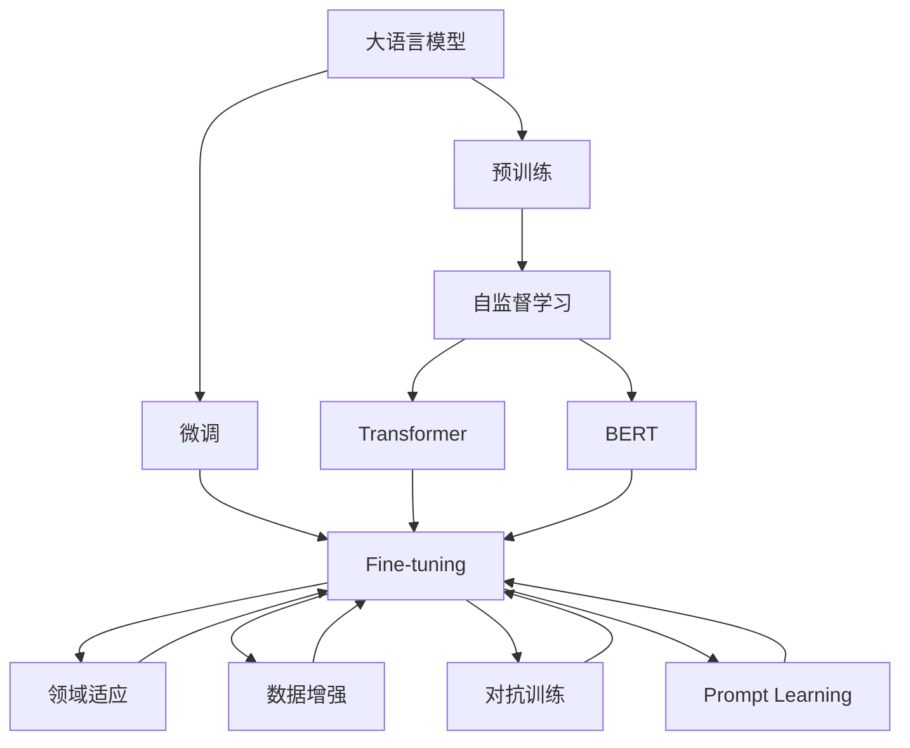
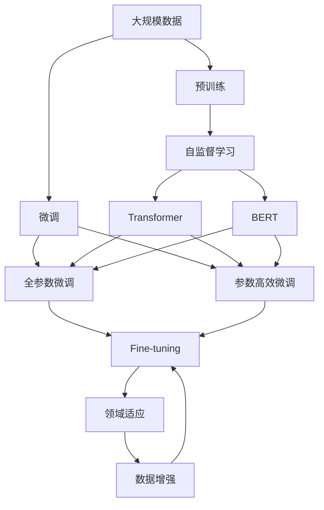

                 

# 【AI大数据计算原理与代码实例讲解】offset

> 关键词：大语言模型，迁移学习，基于监督学习，微调，Transformer，BERT，代码实现，计算图

## 1. 背景介绍

### 1.1 问题由来
在人工智能领域，尤其是在自然语言处理（NLP）和机器学习领域，数据和计算能力一直是制约模型性能和应用广度的关键因素。近年来，随着深度学习技术的发展，尤其是大语言模型的出现，这一现状得到了显著改善。然而，如何更高效、更灵活地利用这些模型，仍然是一个亟待解决的问题。

### 1.2 问题核心关键点
为了提高大语言模型的应用效率和性能，微调（Fine-tuning）成为了一种流行的手段。微调通过在预训练模型的基础上，利用有限的数据进行有监督学习，使得模型能够在特定任务上表现出色。这种方式不仅减少了从头训练所需的计算资源和时间，还能够利用预训练模型的知识，提高模型在新任务上的性能。

### 1.3 问题研究意义
微调方法在大数据计算中的应用，可以显著提升模型在特定任务上的表现，减少开发和部署的成本。同时，微调还可以帮助模型更好地适应新的数据分布和领域，实现知识迁移和领域泛化。在NLP、计算机视觉、推荐系统等诸多领域，微调方法已经被广泛应用于实际应用中，成为推动技术进步的重要手段。

## 2. 核心概念与联系

### 2.1 核心概念概述

在微调的过程中，涉及到几个关键概念：

- **大语言模型（Large Language Models, LLMs）**：指通过大量无标签数据预训练得到的深度学习模型，如GPT、BERT等。这些模型能够理解和生成自然语言，具备强大的语义处理能力。
- **迁移学习（Transfer Learning）**：指在预训练模型的基础上，通过微调适应新的任务，使得模型能够在新领域中保持或提升性能。
- **微调（Fine-tuning）**：指在预训练模型的基础上，使用有限的数据进行有监督学习，以优化模型在特定任务上的性能。
- **Transformer**：一种用于自然语言处理的深度学习模型，通过自注意力机制进行信息传递，具有较高的性能和效率。
- **BERT**：由Google开发的语言模型，通过双向上下文编码，显著提升了自然语言处理的性能。

这些概念之间存在着密切的联系，共同构成了微调的基础框架。通过在预训练模型的基础上，微调可以高效地适应新任务，同时利用预训练模型的知识，避免从头训练的高成本和长时间。

### 2.2 概念间的关系

这些概念之间的关系可以通过以下Mermaid流程图来展示：



这个流程图展示了从预训练到微调，再到领域适应和数据增强等关键过程。预训练模型的知识通过微调，被应用于特定任务，并通过对抗训练和数据增强等方法，进一步提升模型的泛化能力和鲁棒性。

### 2.3 核心概念的整体架构

最后，我们用一个综合的流程图来展示这些核心概念在大数据计算中的整体架构：



这个综合流程图展示了从数据预处理到微调的过程，从预训练模型到领域适应，再到数据增强和微调，最终实现了高效的数据计算和大模型应用。

## 3. 核心算法原理 & 具体操作步骤
### 3.1 算法原理概述

微调的原理是基于监督学习，通过有限的数据对预训练模型进行微调，使其在特定任务上表现出色。在微调过程中，通常将预训练模型视作“特征提取器”，通过有监督学习，优化模型在特定任务上的特征表示能力。

### 3.2 算法步骤详解

1. **数据准备**：收集和预处理训练数据，包括数据清洗、分词、标记等操作。

2. **模型选择**：选择合适的预训练模型，如BERT、GPT等，作为微调的初始化参数。

3. **任务适配**：根据特定任务，设计合适的任务适配层，包括输出层和损失函数。

4. **设置超参数**：确定学习率、批大小、迭代轮数等超参数，以控制模型训练过程。

5. **执行梯度训练**：将训练集数据分批次输入模型，前向传播计算损失函数，反向传播更新模型参数。

6. **验证和测试**：在验证集和测试集上评估模型性能，确保模型泛化能力。

### 3.3 算法优缺点

**优点**：
- **高效**：利用预训练模型知识，减少从头训练所需的计算资源和时间。
- **灵活**：适用于各种NLP任务，如文本分类、命名实体识别、机器翻译等。
- **鲁棒性**：在有限标注数据的情况下，仍能获得不错的性能。

**缺点**：
- **依赖标注数据**：微调效果很大程度上取决于标注数据的质量和数量。
- **泛化能力有限**：当目标任务与预训练数据的分布差异较大时，微调的性能提升有限。
- **模型鲁棒性不足**：微调模型面对新数据时，泛化性能可能下降。

### 3.4 算法应用领域

微调方法在NLP领域已经得到了广泛的应用，包括文本分类、命名实体识别、关系抽取、问答系统、机器翻译、文本摘要、对话系统等任务。此外，微调方法还被应用于计算机视觉、推荐系统、金融分析等诸多领域，为各行各业提供了强大的工具支持。

## 4. 数学模型和公式 & 详细讲解  
### 4.1 数学模型构建

假设预训练模型为 $M_{\theta}$，其中 $\theta$ 为模型参数。给定下游任务 $T$ 的标注数据集 $D=\{(x_i, y_i)\}_{i=1}^N$，其中 $x_i$ 为输入样本，$y_i$ 为标签。微调的目标是找到新的模型参数 $\hat{\theta}$，使得模型在任务 $T$ 上的表现最佳：

$$
\hat{\theta}=\mathop{\arg\min}_{\theta} \mathcal{L}(M_{\theta},D)
$$

其中 $\mathcal{L}$ 为针对任务 $T$ 设计的损失函数，用于衡量模型预测输出与真实标签之间的差异。

### 4.2 公式推导过程

以二分类任务为例，假设模型 $M_{\theta}$ 在输入 $x$ 上的输出为 $\hat{y}=M_{\theta}(x) \in [0,1]$，表示样本属于正类的概率。真实标签 $y \in \{0,1\}$。二分类交叉熵损失函数定义为：

$$
\ell(M_{\theta}(x),y) = -[y\log \hat{y} + (1-y)\log (1-\hat{y})]
$$

将损失函数对参数 $\theta$ 求导，得到梯度：

$$
\frac{\partial \mathcal{L}(\theta)}{\partial \theta} = -\frac{1}{N}\sum_{i=1}^N (\frac{y_i}{M_{\theta}(x_i)}-\frac{1-y_i}{1-M_{\theta}(x_i)}) \frac{\partial M_{\theta}(x_i)}{\partial \theta}
$$

在得到损失函数的梯度后，即可带入参数更新公式，完成模型的迭代优化。

### 4.3 案例分析与讲解

以BERT微调为例，BERT模型通过掩码语言模型和下一句预测任务进行预训练，其微调过程如下：

1. **数据准备**：收集下游任务的数据集，并进行标注。
2. **模型选择**：选择预训练的BERT模型作为微调的初始化参数。
3. **任务适配**：根据任务类型，设计合适的输出层和损失函数。
4. **设置超参数**：确定学习率、批大小、迭代轮数等超参数。
5. **执行梯度训练**：将数据集分批次输入模型，计算损失函数，反向传播更新模型参数。
6. **验证和测试**：在验证集和测试集上评估模型性能。

通过微调，BERT模型在特定任务上获得了比从头训练更好的性能，同时减少了计算资源的消耗。

## 5. 项目实践：代码实例和详细解释说明
### 5.1 开发环境搭建

要进行微调实践，首先需要配置好开发环境。以下是Python环境下使用PyTorch和Transformers库搭建微调环境的步骤：

1. 安装Anaconda并创建虚拟环境：
```bash
conda create -n pytorch-env python=3.8
conda activate pytorch-env
```

2. 安装PyTorch和Transformers库：
```bash
pip install torch transformers
```

3. 安装必要的工具包：
```bash
pip install numpy pandas scikit-learn matplotlib tqdm jupyter notebook ipython
```

### 5.2 源代码详细实现

以下是一个使用PyTorch和Transformers库进行BERT微调的代码实现：

```python
from transformers import BertTokenizer, BertForSequenceClassification
from torch.utils.data import Dataset, DataLoader
import torch
from sklearn.metrics import accuracy_score

# 定义任务数据集
class TaskDataset(Dataset):
    def __init__(self, texts, labels):
        self.texts = texts
        self.labels = labels
        
    def __len__(self):
        return len(self.texts)
    
    def __getitem__(self, idx):
        text = self.texts[idx]
        label = self.labels[idx]
        return text, label

# 加载预训练模型和分词器
tokenizer = BertTokenizer.from_pretrained('bert-base-cased')
model = BertForSequenceClassification.from_pretrained('bert-base-cased', num_labels=2)

# 准备数据
train_texts = ['这是文本1', '这是文本2', '这是文本3']
train_labels = [0, 1, 0]
dev_texts = ['这是文本4', '这是文本5']
dev_labels = [1, 0]
test_texts = ['这是文本6', '这是文本7']
test_labels = [0, 1]

train_dataset = TaskDataset(train_texts, train_labels)
dev_dataset = TaskDataset(dev_texts, dev_labels)
test_dataset = TaskDataset(test_texts, test_labels)

# 设置超参数
batch_size = 16
learning_rate = 2e-5
epochs = 3

# 定义优化器和损失函数
optimizer = torch.optim.Adam(model.parameters(), lr=learning_rate)
criterion = torch.nn.CrossEntropyLoss()

# 定义训练函数
def train(model, optimizer, criterion, train_loader, device):
    model.train()
    for epoch in range(epochs):
        for batch in train_loader:
            input_ids, labels = batch
            input_ids = input_ids.to(device)
            labels = labels.to(device)
            outputs = model(input_ids)
            loss = criterion(outputs, labels)
            loss.backward()
            optimizer.step()

# 定义评估函数
def evaluate(model, criterion, dev_loader, device):
    model.eval()
    total_correct, total_samples = 0, 0
    for batch in dev_loader:
        input_ids, labels = batch
        input_ids = input_ids.to(device)
        labels = labels.to(device)
        with torch.no_grad():
            outputs = model(input_ids)
            loss = criterion(outputs, labels)
            total_correct += (torch.argmax(outputs, dim=1) == labels).sum().item()
            total_samples += labels.size(0)
    return total_correct / total_samples

# 训练和评估
device = torch.device('cuda' if torch.cuda.is_available() else 'cpu')
train_loader = DataLoader(train_dataset, batch_size=batch_size, shuffle=True)
dev_loader = DataLoader(dev_dataset, batch_size=batch_size, shuffle=False)
test_loader = DataLoader(test_dataset, batch_size=batch_size, shuffle=False)

for epoch in range(epochs):
    train(model, optimizer, criterion, train_loader, device)
    acc = evaluate(model, criterion, dev_loader, device)
    print(f'Epoch {epoch+1}, dev accuracy: {acc:.4f}')
    
test_acc = evaluate(model, criterion, test_loader, device)
print(f'Test accuracy: {test_acc:.4f}')
```

### 5.3 代码解读与分析

在上述代码中，我们使用了BERT预训练模型，通过二分类任务进行了微调。以下是关键代码的解读：

- `TaskDataset`类：定义了任务数据集，包含文本和标签。
- 加载预训练模型和分词器：使用Transformers库加载预训练的BERT模型和分词器。
- 准备数据：将文本和标签打包成训练集、验证集和测试集。
- 设置超参数：包括批大小、学习率和迭代轮数。
- 定义优化器和损失函数：使用Adam优化器，交叉熵损失函数。
- 训练函数：将数据分批次输入模型，计算损失函数，反向传播更新模型参数。
- 评估函数：在验证集上计算模型准确率，返回评估结果。
- 训练和评估：在训练集上训练模型，在验证集上评估模型性能。

## 6. 实际应用场景
### 6.1 智能客服系统

基于BERT的微调模型，可以用于智能客服系统，提供自然语言理解和生成能力。通过微调，模型能够理解客户咨询的意图，生成恰当的回复。智能客服系统能够7x24小时不间断服务，提升客户体验。

### 6.2 金融舆情监测

金融领域需要实时监测市场舆论动向，避免风险。通过微调BERT模型，可以实现情感分析和主题分类，实时监测舆情变化，及时预警异常情况。

### 6.3 个性化推荐系统

推荐系统可以通过微调BERT模型，实现个性化推荐。模型能够理解用户兴趣，生成个性化的推荐内容。

### 6.4 未来应用展望

未来，微调方法将应用于更多领域，如智慧医疗、智能教育、智慧城市等，提升各行业的智能化水平。随着模型规模和参数量的增加，微调方法也将不断发展，以适应更复杂的任务需求。

## 7. 工具和资源推荐
### 7.1 学习资源推荐

1. **《深度学习基础》**：适用于初学者，系统介绍深度学习基础知识和常用算法。
2. **《TensorFlow官方文档》**：提供详细API文档和代码示例，方便开发者学习和使用。
3. **《Transformers官方文档》**：提供大量预训练模型和微调示例，帮助开发者快速上手。
4. **Kaggle竞赛平台**：提供丰富的数据集和竞赛，帮助开发者积累实践经验。
5. **GitHub代码仓库**：分享最新研究和开源项目，获取丰富的学习资源。

### 7.2 开发工具推荐

1. **PyTorch**：灵活动态的计算图，适合研究和生产应用。
2. **TensorFlow**：生产部署方便，适合大规模工程应用。
3. **Transformers**：提供大量预训练模型和微调示例，方便开发者使用。
4. **Weights & Biases**：模型训练实验跟踪工具，记录和可视化模型训练过程。
5. **TensorBoard**：可视化工具，实时监测模型训练状态和性能。

### 7.3 相关论文推荐

1. **《Attention is All You Need》**：Transformer论文，介绍自注意力机制。
2. **《BERT: Pre-training of Deep Bidirectional Transformers for Language Understanding》**：BERT论文，介绍掩码语言模型。
3. **《Parameter-Efficient Transfer Learning for NLP》**：参数高效微调方法。
4. **《AdaLoRA: Adaptive Low-Rank Adaptation for Parameter-Efficient Fine-Tuning》**：LoRA方法。

## 8. 总结：未来发展趋势与挑战
### 8.1 研究成果总结

微调技术在大数据计算中的应用，显著提升了模型的性能和应用效率。未来，微调方法将结合更多前沿技术，如因果学习、多模态融合等，进一步提升模型的泛化能力和性能。

### 8.2 未来发展趋势

1. **大规模预训练模型**：模型规模持续增大，预训练语言模型将具备更强的语义处理能力。
2. **参数高效微调**：开发更多参数高效的微调方法，以节省计算资源和提高模型性能。
3. **持续学习**：微调模型能够不断学习新知识，避免灾难性遗忘。
4. **无监督和半监督学习**：利用无监督和半监督学习范式，降低对标注数据的依赖。
5. **多模态融合**：将视觉、语音等多模态信息与文本信息进行融合，提升模型的应用范围。

### 8.3 面临的挑战

1. **标注数据瓶颈**：获取高质量标注数据的成本高昂，微调效果依赖标注数据。
2. **模型鲁棒性不足**：微调模型面对新数据时，泛化性能可能下降。
3. **计算资源消耗大**：模型参数量增大，对计算资源的需求增加。
4. **可解释性不足**：模型缺乏可解释性，难以理解其内部工作机制。
5. **模型安全性**：模型可能学习到有害信息，存在安全隐患。

### 8.4 研究展望

未来，微调技术需要在以下几个方面进行深入研究：

1. **数据增强**：利用数据增强技术，扩充训练集，提升模型泛化能力。
2. **对抗训练**：引入对抗样本，提高模型鲁棒性。
3. **可解释性**：开发可解释性强的模型，增强模型透明度。
4. **多模态融合**：将多模态信息与文本信息进行融合，提升模型应用范围。
5. **知识蒸馏**：利用知识蒸馏技术，将专家知识融入模型，提升模型性能。

总之，微调技术在大数据计算中的应用，为自然语言处理和机器学习带来了新的机遇和挑战。通过不断创新和优化，微调技术将进一步推动人工智能技术的进步和发展。

## 9. 附录：常见问题与解答

**Q1: 微调与从头训练有何区别？**

A: 微调是在预训练模型的基础上，使用少量标注数据进行有监督学习，优化模型在特定任务上的性能。而从头训练则是从零开始，通过大量标注数据训练一个全新的模型。微调能够利用预训练模型的知识，减少从头训练所需的计算资源和时间。

**Q2: 微调过程中如何选择超参数？**

A: 超参数包括学习率、批大小、迭代轮数等。通常需要结合具体任务和数据特点进行调参。一般建议从1e-5开始调参，逐步减小学习率，直至收敛。也可以使用warmup策略，在开始阶段使用较小的学习率，再逐渐过渡到预设值。

**Q3: 微调过程中如何避免过拟合？**

A: 过拟合是微调面临的主要挑战，尤其是在标注数据不足的情况下。常见的缓解策略包括数据增强、正则化、对抗训练等方法，通过扩充训练集、引入正则化项、增加对抗样本等方式，防止模型过拟合。

**Q4: 微调模型的应用场景有哪些？**

A: 微调模型在NLP领域有广泛应用，如文本分类、命名实体识别、机器翻译、问答系统等。此外，微调方法也被应用于计算机视觉、推荐系统、金融分析等诸多领域，为各行各业提供强大的工具支持。

**Q5: 微调模型的局限性有哪些？**

A: 微调模型的局限性包括对标注数据的依赖、泛化能力有限、模型鲁棒性不足、计算资源消耗大等。需要开发者在实践中不断优化模型和算法，提升模型性能和应用效果。

总之，微调技术在大数据计算中的应用，为自然语言处理和机器学习带来了新的机遇和挑战。通过不断创新和优化，微调技术将进一步推动人工智能技术的进步和发展。

