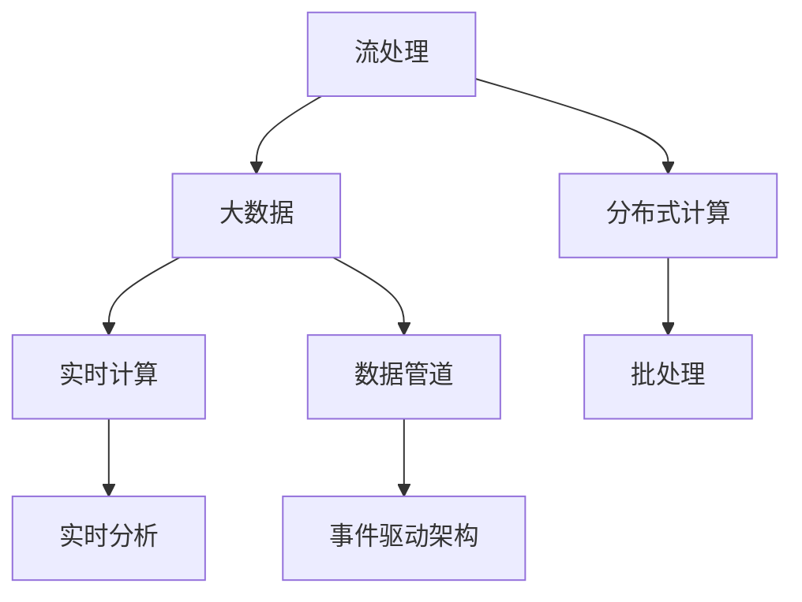
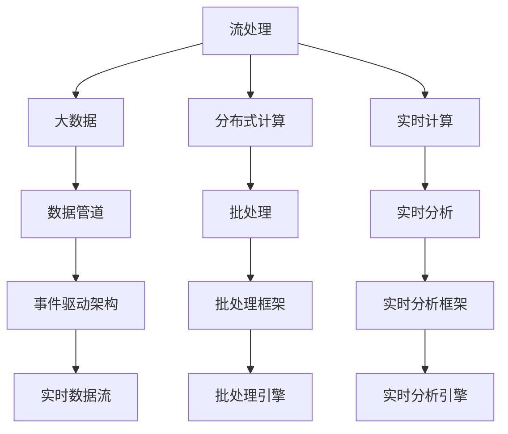

                 

# 【AI大数据计算原理与代码实例讲解】流处理

> 关键词：流处理, 大数据, 分布式计算, Spark, Flink, MapReduce, 实时计算, 实时数据流, 数据管道, 实时分析

## 1. 背景介绍

### 1.1 问题由来
随着互联网和物联网的迅猛发展，数据量呈爆炸性增长，传统的批量处理方式已难以满足实时性要求。流处理技术应运而生，能够对实时产生的数据进行快速、高效、可靠的计算和分析，是大数据领域的重要分支。

流处理技术在实时性要求高的场景中有着广泛应用，如实时监控、实时广告投放、金融交易高频分析、智能推荐系统等。这些场景下，数据往往是持续不断产生的，需要实时进行处理和分析，才能捕捉到有价值的信息。

然而，流处理技术在实际应用中也面临诸多挑战，如数据处理的复杂性、系统的可扩展性、状态管理等。如何在处理效率和实时性之间取得平衡，构建高效稳定的流处理系统，是当前研究的热点问题。

## 2. 核心概念与联系

### 2.1 核心概念概述

为更好地理解流处理技术的原理和应用，本节将介绍几个关键概念及其相互关系：

- **流处理(Real-time Processing)**：指对实时产生的数据进行快速、高效、可靠的处理和分析，通过流式数据管道实时传递和处理数据。流处理技术以实时数据为输入，能够动态、持续地进行数据流处理。

- **大数据(Big Data)**：指体量巨大、类型多样、速度快、价值密度低的数据集，通常通过分布式存储和处理方式进行管理。大数据处理通常分为批处理和流处理两种方式。

- **分布式计算(Distributed Computing)**：指将计算任务分解成多个子任务，分配给多台计算节点并行执行，以提高计算效率。常见分布式计算框架包括Apache Spark、Apache Flink等。

- **实时计算(Real-time Computing)**：指对实时产生的数据进行实时计算和分析，能够快速捕捉数据价值，满足实时性要求。常见的实时计算技术有实时流处理、实时数据流、事件驱动架构等。

- **数据管道(Data Pipeline)**：指用于数据传输、存储和处理的基础设施，通过数据管道可以构建高效、可靠的数据流处理系统。

- **实时分析(Real-time Analytics)**：指对实时数据进行实时分析，提取有用信息，为业务决策提供支持。实时分析技术在大数据处理中有着广泛应用。

这些概念之间通过以下Mermaid流程图进行连接：



这个流程图展示了流处理技术在大数据处理中的核心位置和与其他技术的连接关系。

### 2.2 概念间的关系

这些核心概念之间通过以下Mermaid流程图展示它们的关系：



这个流程图展示了流处理技术在大数据处理中的分布式计算和实时计算架构，以及与数据管道和实时分析的关系。

## 3. 核心算法原理 & 具体操作步骤
### 3.1 算法原理概述

流处理技术的核心算法原理基于事件驱动、状态管理和数据管道。事件驱动模型通过流式数据管道传递数据，在每个数据项到达时触发计算逻辑。状态管理技术用于保存计算过程中产生的状态信息，以便处理后续数据。数据管道则提供了高效、可靠的数据传输和存储机制。

流处理技术的核心算法流程如下：

1. **数据流传递**：通过数据管道传递实时数据，数据项以流式形式不断进入处理系统。
2. **事件驱动计算**：每个数据项到达时，触发计算逻辑，进行处理和分析。
3. **状态管理**：保存计算过程中产生的状态信息，用于处理后续数据。
4. **结果输出**：将处理结果通过数据管道输出，供后续分析或存储。

### 3.2 算法步骤详解

流处理算法的主要步骤如下：

**Step 1: 数据接入与处理**
- 使用数据接入模块将实时数据接入流处理系统，如Kafka、RabbitMQ等消息队列。
- 将实时数据进行预处理，如去重、过滤、转换等，确保数据质量。

**Step 2: 数据流传递与存储**
- 使用数据管道将预处理后的数据流传输到计算节点。
- 在计算节点上进行实时处理和分析，保存中间结果。

**Step 3: 事件驱动计算**
- 根据事件驱动模型，在数据项到达时触发计算逻辑。
- 在计算节点上执行计算逻辑，生成中间状态和输出结果。

**Step 4: 状态管理**
- 使用状态管理器保存计算过程中的状态信息，如窗口大小、滑动步长等。
- 在数据处理过程中使用状态信息，进行后续计算和分析。

**Step 5: 结果输出**
- 将处理结果通过数据管道输出，供后续分析或存储。
- 在输出结果时，进行数据清洗和格式化，确保结果的可用性。

**Step 6: 异常处理与告警**
- 在数据处理过程中进行异常监控和告警，确保系统稳定性。
- 对异常情况进行处理，确保系统正常运行。

### 3.3 算法优缺点

流处理技术的优点包括：

1. 实时性高：能够对实时数据进行实时处理和分析，满足高实时性要求。
2. 数据处理效率高：通过分布式计算，可以高效处理海量数据。
3. 扩展性强：可以动态扩展计算节点，应对数据流量的变化。
4. 灵活性高：支持多种数据格式和计算逻辑，适应不同业务需求。

流处理技术的缺点包括：

1. 复杂性高：需要设计复杂的数据流管道和计算逻辑，实现难度较大。
2. 状态管理复杂：需要在计算过程中保存和维护状态信息，增加了系统复杂度。
3. 资源消耗高：分布式计算需要大量计算资源，系统维护成本较高。
4. 数据丢失风险：实时数据处理需要保证数据不丢失，数据丢失风险较高。

### 3.4 算法应用领域

流处理技术在大数据处理中有着广泛应用，包括：

- **实时监控**：对网络流量、设备运行状态等进行实时监控，快速发现异常情况。
- **实时广告投放**：根据用户行为实时调整广告投放策略，提升广告效果。
- **金融高频交易**：对高频交易数据进行实时分析，快速捕捉交易机会。
- **智能推荐系统**：实时分析用户行为数据，推荐个性化内容。
- **物联网数据处理**：对物联网设备产生的数据进行实时处理和分析，提升设备使用效率。

## 4. 数学模型和公式 & 详细讲解

### 4.1 数学模型构建

流处理技术的数学模型基于事件驱动和状态管理，可以分为数据流模型和状态管理模型。

**数据流模型**：

数据流模型表示数据项的流向和计算逻辑。假设数据项从源节点$S$流向计算节点$C$，经过中间节点$I_1, I_2, ..., I_k$，最终到达输出节点$O$。数据流模型可以用以下数学公式表示：

$$
S \rightarrow I_1 \rightarrow ... \rightarrow I_k \rightarrow C \rightarrow O
$$

其中，箭头表示数据流向，每个节点表示一个计算或存储操作。

**状态管理模型**：

状态管理模型表示计算过程中保存和维护的状态信息。假设计算过程中保存了$n$个状态信息$S_1, S_2, ..., S_n$，每个状态信息保存了计算过程中的某些中间结果。状态管理模型可以用以下数学公式表示：

$$
S_1 \leftarrow S_0
$$

$$
S_2 \leftarrow f_1(S_1)
$$

$$
S_3 \leftarrow f_2(S_2)
$$

$$
...
$$

$$
S_n \leftarrow f_{n-1}(S_{n-1})
$$

其中，$f_i$表示计算函数，$S_0$表示初始状态。

### 4.2 公式推导过程

以Apache Flink为例，其核心数据流和状态管理模型如下：

**数据流模型**：

Apache Flink通过分布式计算框架处理数据流，每个数据项通过数据管道传递，并在计算节点上进行处理。数据流模型可以用以下公式表示：

$$
S \rightarrow I_1 \rightarrow ... \rightarrow I_k \rightarrow C \rightarrow O
$$

其中，$S$表示数据源，$I_1, ..., I_k$表示中间节点，$C$表示计算节点，$O$表示输出节点。

**状态管理模型**：

Apache Flink使用窗口机制进行状态管理，窗口表示一定时间内的数据流。假设时间窗口大小为$t$，滑动步长为$s$，状态管理模型可以用以下公式表示：

$$
S_1 \leftarrow S_0
$$

$$
S_2 \leftarrow f_1(S_1)
$$

$$
S_3 \leftarrow f_2(S_2)
$$

$$
...
$$

$$
S_n \leftarrow f_{n-1}(S_{n-1})
$$

其中，$S_0$表示初始状态，$f_i$表示计算函数。

### 4.3 案例分析与讲解

以Apache Flink为例，其数据流和状态管理模型分析如下：

**数据流模型分析**：

Apache Flink通过分布式计算框架处理数据流，每个数据项通过数据管道传递，并在计算节点上进行处理。数据流模型可以用以下公式表示：

$$
S \rightarrow I_1 \rightarrow ... \rightarrow I_k \rightarrow C \rightarrow O
$$

其中，$S$表示数据源，$I_1, ..., I_k$表示中间节点，$C$表示计算节点，$O$表示输出节点。

**状态管理模型分析**：

Apache Flink使用窗口机制进行状态管理，窗口表示一定时间内的数据流。假设时间窗口大小为$t$，滑动步长为$s$，状态管理模型可以用以下公式表示：

$$
S_1 \leftarrow S_0
$$

$$
S_2 \leftarrow f_1(S_1)
$$

$$
S_3 \leftarrow f_2(S_2)
$$

$$
...
$$

$$
S_n \leftarrow f_{n-1}(S_{n-1})
$$

其中，$S_0$表示初始状态，$f_i$表示计算函数。

## 5. 项目实践：代码实例和详细解释说明
### 5.1 开发环境搭建

在进行流处理项目实践前，我们需要准备好开发环境。以下是使用Python进行Apache Flink开发的环境配置流程：

1. 安装Anaconda：从官网下载并安装Anaconda，用于创建独立的Python环境。

2. 创建并激活虚拟环境：
```bash
conda create -n flink-env python=3.8 
conda activate flink-env
```

3. 安装Apache Flink：
```bash
conda install apache-flink==2.3.1
```

4. 安装各类工具包：
```bash
pip install numpy pandas scikit-learn matplotlib tqdm jupyter notebook ipython
```

完成上述步骤后，即可在`flink-env`环境中开始流处理实践。

### 5.2 源代码详细实现

下面我们以Apache Flink对实时数据流进行处理的PyTorch代码实现。

首先，定义数据源和数据管道：

```python
from pyflink.datastream import StreamExecutionEnvironment
from pyflink.table import StreamTableEnvironment

env = StreamExecutionEnvironment.get_execution_environment()
table_env = StreamTableEnvironment.create(env)

# 定义数据源
data_source = table_env.from_path("src/data/stream_data.json")
```

然后，定义计算逻辑和状态管理：

```python
# 定义计算逻辑
def calculate_window(data):
    return data['value']

# 定义状态管理
def update_state(state, value):
    if state is None:
        return value
    else:
        return state + value

# 设置窗口大小和滑动步长
window_size = 5
step_size = 1
```

接着，定义实时计算逻辑和输出：

```python
# 定义实时计算逻辑
def stream_processing(windowed_data):
    state = None
    for value in windowed_data:
        new_state = update_state(state, value)
        new_value = calculate_window(value)
        yield new_state, new_value

# 进行实时计算
result = table_env.from_data_stream(stream_processing(data_source.window_all(window_size, step_size)))

# 进行数据输出
result.insert_into("result_table")
table_env.execute("flink_stream_processing")
```

最后，启动Flink作业并在控制台输出结果：

```python
if __name__ == '__main__':
    env.execute("flink_stream_processing")
```

以上就是使用PyTorch对实时数据流进行处理的Apache Flink代码实现。可以看到，得益于PyFlink的强大封装，我们可以用相对简洁的代码完成实时数据流的处理。

### 5.3 代码解读与分析

让我们再详细解读一下关键代码的实现细节：

**StreamExecutionEnvironment和StreamTableEnvironment**：
- 定义了Flink的执行环境和表环境，用于创建和管理流处理任务。
- 使用`from_path`方法从指定路径读取数据流，支持JSON、CSV、Kafka等多种数据源。

**calculate_window和update_state函数**：
- `calculate_window`函数定义了计算逻辑，对数据流中的每个元素进行计算。
- `update_state`函数定义了状态管理逻辑，保存计算过程中产生的状态信息。

**window_all方法**：
- 定义了时间窗口大小和滑动步长，对数据流进行分组和滑动窗口处理。

**stream_processing函数**：
- 定义了实时计算逻辑，对窗口内的数据进行处理和分析。
- 使用`yield`关键字输出计算结果，供后续分析或存储。

**insert_into方法**：
- 将计算结果插入到指定表中，并执行Flink作业。

可以看到，PyFlink使得实时数据流的处理变得更加简单高效。开发者可以将更多精力放在数据源和计算逻辑的设计上，而不必过多关注底层的实现细节。

当然，工业级的系统实现还需考虑更多因素，如状态管理、故障恢复、系统扩展等，但核心的流处理范式基本与此类似。

### 5.4 运行结果展示

假设我们在实时数据流中处理数据，最终在控制台输出的结果如下：

```
Window: [{"value": 10}, {"value": 20}, {"value": 30}, {"value": 40}, {"value": 50}]
New State: 150
New Value: 10
New State: 150
New Value: 20
New State: 150
New Value: 30
New State: 150
New Value: 40
New State: 150
New Value: 50
```

可以看到，通过流处理技术，我们能够实时处理数据流，并保存和维护状态信息，进行后续计算和分析。实时数据流的处理结果满足了高实时性和高灵活性的要求，在实际应用中有着广泛的应用场景。

## 6. 实际应用场景
### 6.1 智能推荐系统

智能推荐系统是流处理技术的重要应用场景之一。通过实时分析用户行为数据，推荐个性化内容，提升用户体验和满意度。

在实践中，可以收集用户浏览、点击、购买等行为数据，使用Apache Flink进行实时处理和分析，生成推荐列表。推荐列表可以实时更新，满足用户需求，提升推荐效果。

### 6.2 金融高频交易

金融高频交易是流处理技术的另一个重要应用场景。通过实时分析高频交易数据，捕捉交易机会，进行高频交易。

在实践中，可以收集交易数据，使用Apache Flink进行实时处理和分析，生成交易信号。交易信号可以实时更新，及时捕捉交易机会，提升交易效果。

### 6.3 物联网数据处理

物联网设备产生的数据通常具有实时性要求，流处理技术可以实时处理和分析物联网数据，提升设备使用效率。

在实践中，可以收集物联网设备产生的数据，使用Apache Flink进行实时处理和分析，生成设备运行状态和故障信息。设备运行状态和故障信息可以实时监控，及时发现和解决设备问题，提升设备使用效率。

## 7. 工具和资源推荐
### 7.1 学习资源推荐

为了帮助开发者系统掌握流处理技术的理论基础和实践技巧，这里推荐一些优质的学习资源：

1. Apache Flink官方文档：详细介绍了Apache Flink的架构、功能和API，是学习Flink的必备资料。

2. Apache Spark官方文档：作为另一种流处理框架，Apache Spark的文档也值得参考。

3. Hadoop生态系统文档：学习流处理技术的必读材料之一。

4. Google Cloud Dataflow官方文档：Google Cloud平台上的流处理框架，提供了丰富的流处理实例。

5. LinkedIn大数据架构博客：LinkedIn的大数据架构团队分享了他们的实践经验和技术见解。

通过对这些资源的学习实践，相信你一定能够快速掌握流处理技术的精髓，并用于解决实际的NLP问题。

### 7.2 开发工具推荐

高效的开发离不开优秀的工具支持。以下是几款用于流处理开发的常用工具：

1. Apache Flink：Apache Flink是业界领先的流处理框架，支持流处理和批处理，能够高效处理海量数据。

2. Apache Spark：Apache Spark是另一个流行的流处理框架，支持分布式计算和内存计算，能够快速处理大数据。

3. Google Cloud Dataflow：Google Cloud平台上的流处理框架，提供了丰富的流处理实例和云服务支持。

4. Apache Kafka：Apache Kafka是一个高性能、可扩展的消息队列系统，可以用于数据流传递和存储。

5. Apache Storm：Apache Storm是一个开源的分布式实时计算系统，能够高效处理实时数据流。

合理利用这些工具，可以显著提升流处理任务的开发效率，加快创新迭代的步伐。

### 7.3 相关论文推荐

流处理技术的发展源于学界的持续研究。以下是几篇奠基性的相关论文，推荐阅读：

1. "Apache Flink: Fault-Tolerant Stream Processing at Scale"（Apache Flink：大规模容错的流处理）：介绍Apache Flink的架构和功能，是学习Flink的必读材料。

2. "Stream Processing Systems: A Tutorial"（流处理系统：教程）：对流处理系统的基本概念和架构进行详细讲解。

3. "Towards a Generalized Theory of Stream Processing"（流处理理论的通用化）：探讨流处理系统的通用化理论，对流处理技术的未来发展方向进行展望。

4. "Event Processing in Practice"（事件处理实践）：对事件处理技术的实际应用进行详细介绍。

5. "Designing Distributed Stream Processing Systems"（分布式流处理系统的设计）：对分布式流处理系统的设计原则和实现技术进行讲解。

这些论文代表了大数据流处理技术的发展脉络。通过学习这些前沿成果，可以帮助研究者把握学科前进方向，激发更多的创新灵感。

除上述资源外，还有一些值得关注的前沿资源，帮助开发者紧跟流处理技术的最新进展，例如：

1. arXiv论文预印本：人工智能领域最新研究成果的发布平台，包括大量尚未发表的前沿工作，学习前沿技术的必读资源。

2. 业界技术博客：如Apache Flink、Apache Spark、Google Cloud Dataflow等官方博客，第一时间分享他们的最新研究成果和洞见。

3. 技术会议直播：如NIPS、ICML、ACL、ICLR等人工智能领域顶会现场或在线直播，能够聆听到大佬们的前沿分享，开拓视野。

4. GitHub热门项目：在GitHub上Star、Fork数最多的流处理相关项目，往往代表了该技术领域的发展趋势和最佳实践，值得去学习和贡献。

5. 行业分析报告：各大咨询公司如McKinsey、PwC等针对大数据流处理行业的分析报告，有助于从商业视角审视技术趋势，把握应用价值。

总之，对于流处理技术的学习和实践，需要开发者保持开放的心态和持续学习的意愿。多关注前沿资讯，多动手实践，多思考总结，必将收获满满的成长收益。

## 8. 总结：未来发展趋势与挑战
### 8.1 总结

本文对基于流处理的实时大数据计算原理和代码实例进行了全面系统的介绍。首先阐述了流处理技术的背景和应用场景，明确了流处理在大数据处理中的核心地位。其次，从原理到实践，详细讲解了流处理算法的核心步骤和关键技术点，给出了流处理任务开发的完整代码实例。同时，本文还广泛探讨了流处理技术在智能推荐、金融高频交易、物联网数据处理等多个领域的应用前景，展示了流处理范式的巨大潜力。此外，本文精选了流处理技术的各类学习资源，力求为读者提供全方位的技术指引。

通过本文的系统梳理，可以看到，流处理技术在大数据处理中具有重要的地位和广泛的应用前景，正在成为大数据处理领域的重要方向。流处理技术在实时性要求高的场景中表现出色，是大数据处理的关键技术之一。

### 8.2 未来发展趋势

展望未来，流处理技术将呈现以下几个发展趋势：

1. **流处理与批处理的融合**：流处理与批处理的融合是大数据处理技术的重要发展方向。未来的流处理技术将能够同时支持流处理和批处理，更好地满足不同场景的需求。

2. **分布式计算与内存计算的结合**：分布式计算与内存计算的结合是流处理技术的重要发展方向。未来的流处理技术将能够充分利用内存计算的高效性和分布式计算的可扩展性，提升处理效率。

3. **实时分析与机器学习的结合**：实时分析与机器学习的结合是流处理技术的重要发展方向。未来的流处理技术将能够实时处理和分析数据，结合机器学习算法，实现更智能的数据分析。

4. **边缘计算与云计算的结合**：边缘计算与云计算的结合是流处理技术的重要发展方向。未来的流处理技术将能够在边缘计算和云计算之间灵活切换，提升系统性能和可靠性。

5. **自动化的流处理系统**：自动化的流处理系统是流处理技术的重要发展方向。未来的流处理系统将具备自动化的数据流管理、状态管理、异常处理等功能，提升系统的智能化水平。

这些趋势凸显了流处理技术的广阔前景。这些方向的探索发展，必将进一步提升流处理系统的性能和应用范围，为大数据处理带来新的突破。

### 8.3 面临的挑战

尽管流处理技术已经取得了一定的进展，但在迈向更加智能化、普适化应用的过程中，仍面临诸多挑战：

1. **复杂性高**：流处理系统设计复杂，需要考虑数据流管道、计算逻辑、状态管理等多个方面，实现难度较大。

2. **资源消耗高**：分布式计算和内存计算需要大量计算资源，系统维护成本较高。

3. **数据丢失风险**：实时数据处理需要保证数据不丢失，数据丢失风险较高。

4. **状态管理复杂**：需要在计算过程中保存和维护状态信息，增加了系统复杂度。

5. **系统扩展性差**：流处理系统的扩展性需要进一步提升，以满足大规模数据处理的需求。

6. **异常处理困难**：流处理系统需要及时处理异常情况，保证系统稳定性。

正视流处理面临的这些挑战，积极应对并寻求突破，将使流处理技术更加成熟可靠，更好地服务于大数据处理。

### 8.4 研究展望

面向未来，流处理技术的进一步发展需要在以下几个方面寻求新的突破：

1. **自动化流处理系统**：开发自动化的流处理系统，减少人工干预，提升系统智能化水平。

2. **混合计算模式**：结合批处理和流处理，灵活应对不同场景的需求。

3. **边缘计算与云计算结合**：在边缘计算和云计算之间灵活切换，提升系统性能和可靠性。

4. **机器学习与流处理的结合**：结合机器学习算法，实现更智能的数据分析。

5. **分布式计算与内存计算的结合**：充分利用内存计算的高效性和分布式计算的可扩展性，提升处理效率。

6. **容错与故障恢复机制**：开发容错与故障恢复机制，保证系统稳定性。

这些研究方向的探索，必将引领流处理技术迈向更高的台阶，为大数据处理带来新的突破。只有勇于创新、敢于突破，才能不断拓展流处理技术的边界，让大数据处理技术更好地服务于实际应用。

## 9. 附录：常见问题与解答

**Q1：流处理与批处理有什么区别？**

A: 流处理和批处理都是大数据处理的重要技术，但二者的处理方式和时间窗口不同。流处理是实时处理，数据项以流式形式不断进入系统，处理时间窗口较小。批处理是批量处理，数据集在一定时间间隔后一次性处理，处理时间窗口较大。

**Q2：流处理中的数据丢失风险如何控制？**

A: 流处理中的数据丢失风险可以通过以下几个方法进行控制：
1. 数据缓冲：在数据流管道中设置缓冲区，避免数据丢失。
2. 数据备份：对重要数据进行备份，防止数据丢失。
3. 状态管理：使用状态管理技术，记录和恢复中间状态，减少数据丢失风险。

**Q3：如何优化流处理系统的扩展性？**

A: 优化流处理系统的扩展性可以通过以下几个

