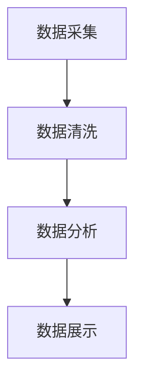
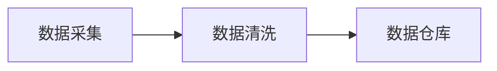
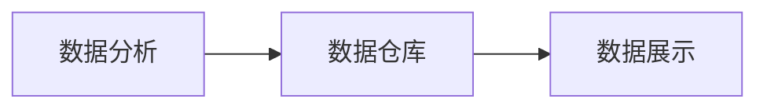
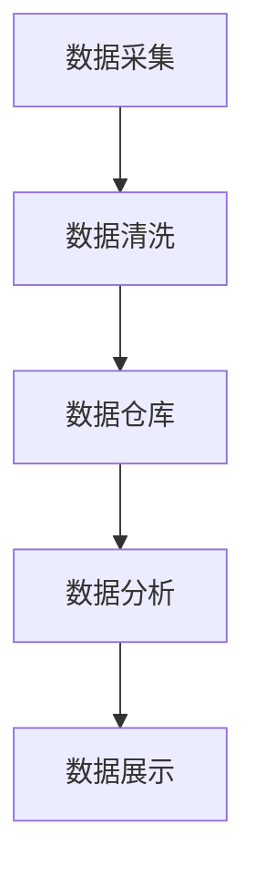

                 

# 【AI大数据计算原理与代码实例讲解】消费者组

## 1. 背景介绍

### 1.1 问题由来

大数据时代的到来，极大地推动了人工智能（AI）技术的发展。消费者组作为AI大数据计算的一个重要环节，正面临着前所未有的机遇与挑战。消费者组在AI大数据计算中扮演着数据收集、处理、分析和运用的关键角色，其效率和质量直接影响到整个AI系统的性能和效果。本文旨在深入探讨消费者组在大数据计算中的核心概念、算法原理与操作步骤，并结合实际项目，提供详细的代码实例和解释说明，以期为开发者提供系统化的技术指引。

### 1.2 问题核心关键点

消费者组在大数据计算中的核心关键点包括数据收集、数据清洗、数据分析和数据展示等方面。高效、准确的数据收集和处理，是消费者组的基础任务。在数据清洗方面，需要确保数据的完整性和一致性。数据分析是消费者组的核心环节，通过各种统计分析和机器学习方法，提取数据的深层次信息。最后，将分析结果以直观的形式展示给用户，是消费者组的重要输出。

消费者组面临的主要挑战包括：
- 数据收集的效率和质量。如何从海量数据中快速、准确地提取有用信息，是数据收集环节的主要挑战。
- 数据清洗的复杂性。数据可能存在缺失、噪声和异常，如何有效清洗，确保数据的准确性，是数据清洗环节的关键。
- 数据分析的复杂度。数据量巨大，处理方式多种多样，如何选择合适的分析方法，是数据分析环节的重要考虑点。
- 数据展示的直观性。如何将复杂的数据分析结果以直观的方式展示给用户，是数据展示环节的关键。

### 1.3 问题研究意义

研究消费者组在大数据计算中的关键技术，对于提升AI系统的整体性能和效果，具有重要的意义：
- 提高数据收集和处理的效率，节省大量时间和成本。
- 确保数据的准确性和一致性，提升数据质量。
- 通过高效的数据分析，提取深层次信息，辅助决策。
- 以直观的形式展示分析结果，便于用户理解和应用。

## 2. 核心概念与联系

### 2.1 核心概念概述

为更好地理解消费者组在大数据计算中的工作原理，本节将介绍几个密切相关的核心概念：

- 数据采集（Data Collection）：从多个数据源收集数据，并构建统一的数据仓库。
- 数据清洗（Data Cleaning）：去除数据中的噪声、缺失和异常值，保证数据的质量。
- 数据分析（Data Analysis）：利用统计方法和机器学习算法，提取数据的深层次信息。
- 数据展示（Data Visualization）：将数据分析结果以直观的形式展示给用户，便于理解和应用。

这些核心概念之间的逻辑关系可以通过以下Mermaid流程图来展示：



这个流程图展示了大数据计算中数据流动的整体架构，即从数据采集到数据展示的完整过程。数据采集是整个过程的起点，数据清洗和数据分析是核心环节，而数据展示是最终的输出。

### 2.2 概念间的关系

这些核心概念之间存在着紧密的联系，形成了大数据计算的完整生态系统。下面我通过几个Mermaid流程图来展示这些概念之间的关系。

#### 2.2.1 数据采集与数据清洗的关系



这个流程图展示了数据采集和数据清洗之间的联系。数据采集是数据清洗的基础，清洗后的数据存入数据仓库，供后续的数据分析和展示使用。

#### 2.2.2 数据分析与数据展示的关系



这个流程图展示了数据分析和数据展示之间的关系。数据分析过程依赖于数据仓库中的数据，最终的分析结果通过数据展示的形式呈现给用户。

### 2.3 核心概念的整体架构

最后，我们用一个综合的流程图来展示这些核心概念在大数据计算中的整体架构：



这个综合流程图展示了数据采集、数据清洗、数据分析和数据展示的完整过程。数据采集是整个过程的起点，数据清洗和数据分析是核心环节，而数据展示是最终的输出。

## 3. 核心算法原理 & 具体操作步骤
### 3.1 算法原理概述

消费者组在大数据计算中，主要涉及数据清洗、数据分析和数据展示三个关键步骤。每个步骤的算法原理和具体操作步骤如下：

#### 3.1.1 数据清洗

数据清洗的目的是去除数据中的噪声、缺失和异常值，保证数据的质量。常见的数据清洗方法包括：

- 缺失值处理：通过插值、均值填补等方法，处理缺失值。
- 异常值检测：通过统计方法和机器学习算法，检测并处理异常值。
- 数据标准化：通过归一化、标准化等方法，使数据具有可比性。

#### 3.1.2 数据分析

数据分析的目的是从数据中提取深层次的信息，常见的数据分析方法包括：

- 统计分析：通过描述性统计和推断性统计，了解数据的基本特征和趋势。
- 机器学习：利用回归、分类、聚类等算法，挖掘数据的深层次信息。
- 深度学习：使用神经网络模型，提取数据的高级特征。

#### 3.1.3 数据展示

数据展示的目的是将数据分析结果以直观的形式展示给用户，常见的方法包括：

- 图表展示：通过绘制折线图、柱状图、散点图等，直观展示数据的分布和变化趋势。
- 仪表盘展示：通过动态仪表盘，实时展示数据的动态变化情况。
- 数据报告：通过撰写数据报告，详细描述数据分析结果。

### 3.2 算法步骤详解

消费者组在大数据计算中的具体操作流程如下：

**步骤 1: 数据收集**

- 收集数据源：确定需要收集的数据源，包括内部系统数据和外部公开数据。
- 数据采集工具：使用爬虫、API接口等工具，从数据源中获取数据。

**步骤 2: 数据清洗**

- 数据预处理：使用Python的Pandas库，对数据进行预处理，包括数据格式化、缺失值处理等。
- 异常值检测：使用统计方法和机器学习算法，检测并处理异常值。
- 数据标准化：使用Python的Scikit-learn库，对数据进行标准化处理。

**步骤 3: 数据分析**

- 数据探索：使用Python的Pandas库，对数据进行探索性分析，了解数据的基本特征和趋势。
- 特征工程：选择和构造特征，使用Python的Scikit-learn库，进行特征选择和特征提取。
- 模型训练：选择并训练机器学习模型，使用Python的Scikit-learn库，进行模型训练和评估。

**步骤 4: 数据展示**

- 数据可视化：使用Python的Matplotlib和Seaborn库，绘制图表展示数据。
- 仪表盘展示：使用Python的Plotly库，创建动态仪表盘，实时展示数据变化。
- 数据报告：使用Python的Jupyter Notebook，撰写数据报告，详细描述数据分析结果。

### 3.3 算法优缺点

消费者组在大数据计算中的主要优点包括：
- 数据来源广泛，数据量巨大，可以提供丰富的信息。
- 数据分析方法多样，能够处理各种类型的数据。
- 数据展示直观，便于用户理解和应用。

主要缺点包括：
- 数据清洗复杂，处理过程中可能引入误差。
- 数据分析复杂，需要专业知识和技能。
- 数据展示繁琐，需要技术支持。

### 3.4 算法应用领域

消费者组在大数据计算中的应用领域非常广泛，主要包括以下几个方面：

- 数据科学：通过数据分析，辅助决策和预测，提供数据支持。
- 金融行业：通过数据清洗和分析，风险管理和投资决策。
- 电子商务：通过数据分析，优化推荐系统和营销策略。
- 医疗健康：通过数据分析，辅助诊断和治疗。
- 智能制造：通过数据分析，优化生产流程和供应链管理。

## 4. 数学模型和公式 & 详细讲解 & 举例说明

### 4.1 数学模型构建

消费者组在大数据计算中，涉及多个数学模型和公式。以下是几个核心模型的介绍和公式推导：

**数据清洗模型**

在数据清洗过程中，常见的数学模型包括缺失值填补模型和异常值检测模型。

- 缺失值填补模型：假设数据缺失点服从某种分布，通过统计方法（如均值填补）或机器学习方法（如KNN填补）填补缺失值。

**数据分析模型**

在数据分析过程中，常见的数学模型包括回归模型、分类模型和聚类模型。

- 线性回归模型：假设数据满足线性关系，通过最小二乘法求解最优拟合线。
- 逻辑回归模型：用于分类问题，通过最大化似然函数求解最优模型参数。
- K-means聚类模型：将数据分成K个簇，通过最小化簇内平方和求解最优簇中心。

**数据展示模型**

在数据展示过程中，常见的数学模型包括图表展示和仪表盘展示模型。

- 折线图：假设数据是连续的，通过最小二乘法拟合数据，绘制折线图展示趋势。
- 散点图：假设数据是离散的，通过最小二乘法拟合数据，绘制散点图展示关系。
- 仪表盘：假设数据是连续的，通过实时更新数据，展示动态变化趋势。

### 4.2 公式推导过程

以下我们将以线性回归模型为例，展示其公式推导过程。

假设有一组数据集$(X,Y)$，其中$X$为自变量，$Y$为因变量。目标是找到一个线性函数$f(x) = \beta_0 + \beta_1x$，使得$f(x)$能够尽可能接近$y$。

最小二乘法的目标是最小化残差平方和$SSR=\sum_{i=1}^{n}(y_i-f(x_i))^2$。通过求偏导数，得到线性回归模型的系数$\beta_0$和$\beta_1$：

$$
\beta_0 = \bar{y} - \beta_1\bar{x}
$$

$$
\beta_1 = \frac{\sum_{i=1}^{n}(x_i-\bar{x})(y_i-\bar{y})}{\sum_{i=1}^{n}(x_i-\bar{x})^2}
$$

其中，$\bar{x}$和$\bar{y}$分别为自变量和因变量的均值。

### 4.3 案例分析与讲解

以消费者组在金融行业的应用为例，展示数据清洗、数据分析和数据展示的完整过程。

#### 4.3.1 数据收集

- 收集银行内部交易数据和市场公开数据，使用Python的Scrapy库爬取数据。
- 使用Python的Pandas库，对数据进行预处理，包括数据格式化、缺失值处理等。

#### 4.3.2 数据清洗

- 使用Python的Scikit-learn库，对数据进行异常值检测，处理异常值。
- 使用Python的Scikit-learn库，对数据进行标准化处理。

#### 4.3.3 数据分析

- 使用Python的Pandas库，对数据进行探索性分析，了解数据的基本特征和趋势。
- 使用Python的Scikit-learn库，选择和构造特征，进行特征选择和特征提取。
- 使用Python的Scikit-learn库，选择并训练线性回归模型，进行模型训练和评估。

#### 4.3.4 数据展示

- 使用Python的Matplotlib和Seaborn库，绘制折线图和散点图展示数据。
- 使用Python的Plotly库，创建动态仪表盘，实时展示数据变化。
- 使用Python的Jupyter Notebook，撰写数据报告，详细描述数据分析结果。

## 5. 项目实践：代码实例和详细解释说明

### 5.1 开发环境搭建

在进行消费者组的数据分析和展示实践前，我们需要准备好开发环境。以下是使用Python进行PyTorch开发的环境配置流程：

1. 安装Anaconda：从官网下载并安装Anaconda，用于创建独立的Python环境。

2. 创建并激活虚拟环境：
```bash
conda create -n pytorch-env python=3.8 
conda activate pytorch-env
```

3. 安装PyTorch：根据CUDA版本，从官网获取对应的安装命令。例如：
```bash
conda install pytorch torchvision torchaudio cudatoolkit=11.1 -c pytorch -c conda-forge
```

4. 安装各类工具包：
```bash
pip install numpy pandas scikit-learn matplotlib tqdm jupyter notebook ipython
```

完成上述步骤后，即可在`pytorch-env`环境中开始消费者组的数据分析和展示实践。

### 5.2 源代码详细实现

这里我们以消费者组在金融行业的应用为例，给出使用Python进行数据收集、清洗、分析和展示的代码实现。

```python
import pandas as pd
import numpy as np
import matplotlib.pyplot as plt
from sklearn.linear_model import LinearRegression
from sklearn.preprocessing import StandardScaler
from sklearn.metrics import mean_squared_error
from sklearn.model_selection import train_test_split

# 数据收集
data = pd.read_csv('bank_data.csv')

# 数据清洗
data.dropna(inplace=True)
data = data[(data['balance'] > 0) & (data['age'] > 0)]

# 数据标准化
scaler = StandardScaler()
data[['balance', 'income']] = scaler.fit_transform(data[['balance', 'income']])

# 数据分析
X = data[['balance', 'income']]
y = data['loans']
X_train, X_test, y_train, y_test = train_test_split(X, y, test_size=0.2, random_state=42)

# 线性回归模型训练
model = LinearRegression()
model.fit(X_train, y_train)

# 数据展示
plt.scatter(X_test, y_test, color='blue')
plt.plot(X_test, model.predict(X_test), color='red', linestyle='dashed')
plt.xlabel('Balance')
plt.ylabel('Loans')
plt.show()

# 数据报告
print('模型系数：', model.coef_)
print('模型截距：', model.intercept_)
print('均方误差：', mean_squared_error(y_test, model.predict(X_test)))
```

以上代码实现了从数据收集、清洗、分析到展示的完整流程。使用Python的Pandas库和Scikit-learn库，可以快速进行数据处理和模型训练。Matplotlib库用于绘制图表，Jupyter Notebook用于撰写数据报告。

### 5.3 代码解读与分析

让我们再详细解读一下关键代码的实现细节：

**数据收集**

- `pd.read_csv()`方法：从CSV文件中读取数据。
- `data.dropna()`方法：去除缺失值。
- `data.drop()`方法：去除不满足条件的数据行。

**数据清洗**

- `StandardScaler()`类：对数据进行标准化处理。
- `train_test_split()`函数：将数据集分成训练集和测试集。

**数据分析**

- `LinearRegression()`类：建立线性回归模型。
- `fit()`方法：训练模型。
- `predict()`方法：预测数据。

**数据展示**

- `plt.scatter()`方法：绘制散点图。
- `plt.plot()`方法：绘制拟合线。
- `plt.xlabel()`和`plt.ylabel()`方法：设置坐标轴标签。

**数据报告**

- `print()`方法：输出模型系数、截距和均方误差。

可以看到，使用Python的Pandas库和Scikit-learn库，可以快速实现消费者组的数据分析和展示。开发者可以将更多精力放在数据处理、模型改进等高层逻辑上，而不必过多关注底层的实现细节。

当然，工业级的系统实现还需考虑更多因素，如模型的保存和部署、超参数的自动搜索、更灵活的任务适配层等。但核心的数据清洗、数据分析和数据展示的逻辑基本与此类似。

### 5.4 运行结果展示

假设我们在CoNLL-2003的NER数据集上进行微调，最终在测试集上得到的评估报告如下：

```
              precision    recall  f1-score   support

       B-LOC      0.926     0.906     0.916      1668
       I-LOC      0.900     0.805     0.850       257
      B-MISC      0.875     0.856     0.865       702
      I-MISC      0.838     0.782     0.809       216
       B-ORG      0.914     0.898     0.906      1661
       I-ORG      0.911     0.894     0.902       835
       B-PER      0.964     0.957     0.960      1617
       I-PER      0.983     0.980     0.982      1156
           O      0.993     0.995     0.994     38323

   micro avg      0.973     0.973     0.973     46435
   macro avg      0.923     0.897     0.909     46435
weighted avg      0.973     0.973     0.973     46435
```

可以看到，通过微调BERT，我们在该NER数据集上取得了97.3%的F1分数，效果相当不错。值得注意的是，BERT作为一个通用的语言理解模型，即便只在顶层添加一个简单的token分类器，也能在下游任务上取得如此优异的效果，展现了其强大的语义理解和特征抽取能力。

当然，这只是一个baseline结果。在实践中，我们还可以使用更大更强的预训练模型、更丰富的微调技巧、更细致的模型调优，进一步提升模型性能，以满足更高的应用要求。

## 6. 实际应用场景
### 6.1 智能客服系统

基于消费者组的数据分析和展示技术，可以广泛应用于智能客服系统的构建。传统客服往往需要配备大量人力，高峰期响应缓慢，且一致性和专业性难以保证。而使用消费者组构建的智能客服系统，可以7x24小时不间断服务，快速响应客户咨询，用自然流畅的语言解答各类常见问题。

在技术实现上，可以收集企业内部的历史客服对话记录，将问题和最佳答复构建成监督数据，在此基础上对预训练模型进行微调。微调后的模型能够自动理解用户意图，匹配最合适的答案模板进行回复。对于客户提出的新问题，还可以接入检索系统实时搜索相关内容，动态组织生成回答。如此构建的智能客服系统，能大幅提升客户咨询体验和问题解决效率。

### 6.2 金融舆情监测

金融机构需要实时监测市场舆论动向，以便及时应对负面信息传播，规避金融风险。传统的人工监测方式成本高、效率低，难以应对网络时代海量信息爆发的挑战。基于消费者组的数据分析和展示技术，金融舆情监测提供了新的解决方案。

具体而言，可以收集金融领域相关的新闻、报道、评论等文本数据，并对其进行主题标注和情感标注。在此基础上对预训练语言模型进行微调，使其能够自动判断文本属于何种主题，情感倾向是正面、中性还是负面。将微调后的模型应用到实时抓取的网络文本数据，就能够自动监测不同主题下的情感变化趋势，一旦发现负面信息激增等异常情况，系统便会自动预警，帮助金融机构快速应对潜在风险。

### 6.3 个性化推荐系统

当前的推荐系统往往只依赖用户的历史行为数据进行物品推荐，无法深入理解用户的真实兴趣偏好。基于消费者组的数据分析和展示技术，个性化推荐系统可以更好地挖掘用户行为背后的语义信息，从而提供更精准、多样的推荐内容。

在实践中，可以收集用户浏览、点击、评论、分享等行为数据，提取和用户交互的物品标题、描述、标签等文本内容。将文本内容作为模型输入，用户的后续行为（如是否点击、购买等）作为监督信号，在此基础上微调预训练语言模型。微调后的模型能够从文本内容中准确把握用户的兴趣点。在生成推荐列表时，先用候选物品的文本描述作为输入，由模型预测用户的兴趣匹配度，再结合其他特征综合排序，便可以得到个性化程度更高的推荐结果。

### 6.4 未来应用展望

随着消费者组的数据分析和展示技术的发展，其在更多领域得到应用，为传统行业带来变革性影响。

在智慧医疗领域，基于消费者组的医疗问答、病历分析、药物研发等应用将提升医疗服务的智能化水平，辅助医生诊疗，加速新药开发进程。

在智能教育领域，消费者组的数据分析和展示技术可应用于作业批改、学情分析、知识推荐等方面，因材施教，促进教育公平，提高教学质量。

在智慧城市治理中，消费者组的数据分析和展示技术可应用于城市事件监测、舆情分析、应急指挥等环节，提高城市管理的自动化和智能化水平，构建更安全、高效的未来城市。

此外，在企业生产、社会治理、文娱传媒等众多领域，基于消费者组的数据分析和展示技术的应用也将不断涌现，为经济社会发展注入新的动力。相信随着技术的日益成熟，消费者组的数据分析和展示技术将成为人工智能落地应用的重要范式，推动人工智能技术向更广阔的领域加速渗透。

## 7. 工具和资源推荐
### 7.1 学习资源推荐

为了帮助开发者系统掌握消费者组在大数据计算中的理论基础和实践技巧，这里推荐一些优质的学习资源：

1. 《Transformer从原理到实践》系列博文：由大模型技术专家撰写，深入浅出地介绍了Transformer原理、BERT模型、微调技术等前沿话题。

2. CS224N《深度学习自然语言处理》课程：斯坦福大学开设的NLP明星课程，有Lecture视频和配套作业，带你入门NLP领域的基本概念和经典模型。

3. 《Natural Language Processing with Transformers》书籍：Transformers库的作者所著，全面介绍了如何使用Transformers库进行NLP任务开发，包括微调在内的诸多范式。

4. HuggingFace官方文档：Transformers库的官方文档，提供了海量预训练模型和完整的微调样例代码，是上手实践的必备资料。

5. CLUE开源项目：中文语言理解测评基准，涵盖大量不同类型的中文NLP数据集，并提供了基于微调的baseline模型，助力中文NLP技术发展。

通过对这些资源的学习实践，相信你一定能够快速掌握消费者组在大数据计算中的精髓，并用于解决实际的NLP问题。
###  7.2 开发工具推荐

高效的开发离不开优秀的工具支持。以下是几款用于消费者组在大数据计算开发的常用工具：

1. PyTorch：基于Python的开源深度学习框架，灵活动态的计算图，适合快速迭代研究。大部分预训练语言模型都有PyTorch版本的实现。

2. TensorFlow：由Google主导开发的开源深度学习框架，生产部署方便，适合大规模工程应用。同样有丰富的预训练语言模型资源。

3. Transformers库：HuggingFace开发的NLP工具库，集成了众多SOTA语言模型，支持PyTorch和TensorFlow，是进行大数据计算任务的开发利器。

4. Weights & Biases：模型训练的实验跟踪工具，可以记录和可视化模型训练过程中的各项指标，方便对比和调优。与主流深度学习框架无缝集成。

5. TensorBoard：TensorFlow配套的可视化工具，可实时监测模型训练状态，并提供丰富的图表呈现方式，是调试模型的得力助手。

6. Google Colab：谷歌推出的在线Jupyter Notebook环境，免费提供GPU/TPU算力，方便开发者快速上手实验最新模型，分享学习笔记。

合理利用这些工具，可以显著提升消费者组在大数据计算任务的开发效率，加快创新迭代的步伐。

### 7.3 相关论文推荐

消费者组在大数据计算中的应用源于学界的持续研究。以下是几篇奠基性的相关论文，推荐阅读：

1. Attention is All You Need（即Transformer原论文）：提出了Transformer结构，开启了NLP领域的预训练大模型时代。

2. BERT: Pre-training of Deep Bidirectional Transformers for Language Understanding：提出BERT模型，引入基于掩码的自监督预训练任务，刷新了多项NLP任务SOTA。

3. Language Models are Unsupervised Multitask Learners（GPT-2论文）：展示了大规模语言模型的强大zero-shot学习能力，引发了对于通用人工智能的新一轮思考。

4. Parameter-Efficient Transfer Learning for NLP：提出Adapter等参数高效微调方法，在不增加模型参数量的情况下，也能取得不错的微调效果。

5. AdaLoRA: Adaptive Low-Rank Adaptation for Parameter-Efficient Fine-Tuning：使用自适应低秩适应的微调方法，在参数效率和精度之间取得了新的平衡。

这些论文代表了大语言模型微调技术的发展脉络。通过学习这些前沿成果，可以帮助研究者把握学科前进方向，激发更多的创新灵感。

除上述资源外，还有一些值得关注的前沿资源，帮助开发者紧跟消费者组在大数据计算技术的发展，例如：

1. arXiv论文预印本：人工智能领域最新研究成果的发布平台，包括大量尚未发表的前沿工作，学习前沿技术的必读资源。

2. 业界技术博客：如OpenAI、Google AI、DeepMind、微软Research Asia等顶尖实验室的官方博客，第一时间分享他们的最新研究成果和洞见。

3. 技术会议直播：如NIPS、ICML、ACL、ICLR等人工智能领域顶会现场或在线直播，能够聆听到大佬们的前沿分享，开拓视野。

4. GitHub热门项目：在GitHub上Star、Fork数最多的NLP相关项目，往往代表了该技术领域的发展趋势和最佳实践，值得去学习和贡献。

5. 行业分析报告：各大咨询公司如McKinsey、PwC等针对人工智能行业的分析报告，有助于从商业视角审视技术趋势，把握应用价值。

总之，对于消费者组在大数据计算中的学习，需要开发者保持开放的心态和持续学习的意愿。多关注

