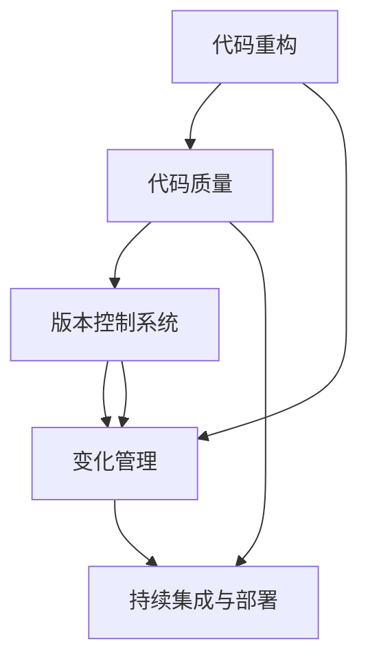

                 

# 【LangChain编程：从入门到实践】变化与重构

> 关键词：编程, 代码重构, 变化管理, 软件工程, 工具与技术, 代码质量

## 1. 背景介绍

### 1.1 问题由来

在软件开发领域，代码重构（refactoring）和变化管理（change management）是开发者必须面对的两项关键任务。随着项目复杂度的提升和需求的变化，代码库变得愈发庞大，维护成本和风险也随之增加。如何有效地进行代码重构，以及如何高效地管理软件变更，成为了软件工程中的重要课题。

本文将从基础概念出发，深入探讨代码重构和变化管理的最佳实践，并通过具体实例展示LangChain编程框架在这些问题上的应用。通过对这些技术和工具的学习，读者将能够提升自身的编程能力和项目管理水平，更好地应对软件开发中的复杂挑战。

## 2. 核心概念与联系

### 2.1 核心概念概述

为了更好地理解代码重构和变化管理，首先需要介绍几个核心概念：

- **代码重构（Refactoring）**：通过改善代码结构和提高代码质量，使其更易于理解和维护的过程。重构通常不改变程序的功能，而是优化代码的内部结构，使其更加健壮、可读和易于维护。

- **变化管理（Change Management）**：记录、跟踪和控制软件变更的流程和策略，确保变更的透明性、可追溯性和安全性。变化管理包括变更计划、测试、部署和评估等多个环节，旨在减少变更带来的风险。

- **版本控制系统（Version Control System, VCS）**：用于管理和追踪代码变更的工具，如Git、SVN等。版本控制系统记录了每次变更的详细信息，包括变更内容、时间、作者等信息，便于回溯和审计。

- **持续集成与持续部署（Continuous Integration and Continuous Deployment, CI/CD）**：自动化集成和部署流程，通过自动化的测试和部署，减少人为错误，提升开发效率和软件质量。

- **代码质量（Code Quality）**：代码的可读性、可维护性、可扩展性和可靠性等方面的指标，通过代码审查、重构等手段进行提升。

这些概念构成了软件工程的基础框架，相互之间存在着紧密的联系。代码重构和变化管理是确保软件质量的重要手段，而版本控制系统和持续集成/部署则是实现这些过程的技术支撑。代码质量则是这些过程和工具共同作用的结果。

### 2.2 概念间的关系

以下是一个简化的Mermaid流程图，展示了这些概念之间的关系：



这个图表展示了代码重构、代码质量、版本控制系统、变化管理和持续集成/部署之间的联系：

1. 代码重构是提升代码质量的重要手段。
2. 版本控制系统记录和跟踪代码变更，是变化管理的基础。
3. 变化管理保证了变更的透明性和安全性。
4. 持续集成/部署提高了开发效率和软件质量。
5. 代码质量是上述过程和工具共同作用的结果。

通过理解这些概念之间的关系，我们能够更好地把握软件工程的核心要素，从而提升整个开发过程的效率和质量。

## 3. 核心算法原理 & 具体操作步骤

### 3.1 算法原理概述

代码重构和变化管理的过程遵循一系列的原则和方法，旨在确保变更的透明性、可追溯性和安全性。这些原则和方法通过一系列具体的步骤和操作，实现了软件变更的有效管理。

#### 3.1.1 重构原则

- **YAGNI原则（You Aren't Gonna Need It）**：避免在代码中添加不必要的特性或功能。重构的目标是提高代码质量，而不是添加新功能。

- **DRY原则（Don't Repeat Yourself）**：避免重复代码。重构应该消除代码中的冗余，提高代码的可读性和可维护性。

- **KISS原则（Keep It Simple, Stupid）**：保持代码简洁明了。重构应该简化代码结构，使其易于理解和修改。

- **SRP原则（Single Responsibility Principle）**：每个类或模块应该只有一个职责。重构应该拆分过大的类或模块，使其职责更加清晰。

#### 3.1.2 变化管理策略

- **变更请求（Change Request）**：记录和跟踪软件变更的正式文档。变更请求通常包含变更的背景、目的、影响和解决方案等信息。

- **变更审核（Change Review）**：通过代码审查和评估，确保变更的可行性和正确性。变更审核可以减少错误和风险。

- **变更实施（Change Implementation）**：在经过审核的变更请求指导下，进行实际的代码变更和部署。

- **变更测试（Change Testing）**：对变更后的代码进行测试，确保变更不会引入新的错误或问题。

- **变更评估（Change Evaluation）**：评估变更后的软件性能和质量，确认变更的有效性。

这些原则和方法通过一系列具体的步骤和操作，实现了软件变更的有效管理。

### 3.2 算法步骤详解

#### 3.2.1 代码重构步骤

1. **识别问题**：通过代码审查、自动化工具和用户反馈等手段，识别出需要重构的代码区域。
2. **设计变更**：根据重构原则，设计出合理的变更方案。
3. **实施变更**：通过编写新的代码、修改现有代码或重构代码结构，实施变更方案。
4. **测试变更**：对变更后的代码进行测试，确保其功能和性能没有受到影响。
5. **回顾总结**：对重构过程进行回顾总结，记录变更效果和经验教训。

#### 3.2.2 变化管理步骤

1. **变更计划**：根据变更请求，制定变更计划，确定变更的目标和步骤。
2. **变更实施**：在变更计划指导下，实施变更请求中的代码变更。
3. **变更测试**：对变更后的代码进行测试，确认变更的正确性和稳定性。
4. **变更评估**：评估变更后的软件性能和质量，确认变更的有效性。
5. **变更部署**：将变更后的代码部署到生产环境，并进行后续的监控和维护。

### 3.3 算法优缺点

#### 3.3.1 代码重构的优点

- **提高代码质量**：通过重构，代码结构更加清晰，易于理解和维护。
- **减少技术债务**：及时消除代码中的潜在问题，避免技术债务的积累。
- **提升开发效率**：重构后的代码更加简洁明了，开发效率提升。

#### 3.3.2 代码重构的缺点

- **成本高**：重构需要时间和人力，且可能引入新的错误。
- **难以量化**：重构的效果难以通过具体的指标衡量。
- **过度重构**：过度重构可能导致代码过于复杂，反而降低开发效率。

#### 3.3.3 变化管理的优点

- **透明性**：所有变更都记录在案，便于追溯和审计。
- **可追溯性**：通过版本控制系统，可以追溯变更的历史。
- **安全性**：通过变更审核和测试，减少错误和风险。

#### 3.3.4 变化管理的缺点

- **复杂度高**：变更管理流程复杂，增加了开发和维护成本。
- **难以避免返工**：变更后的测试和评估，可能发现新的问题，需要进行返工。
- **变更频繁**：频繁的变更可能导致团队成员适应困难。

### 3.4 算法应用领域

代码重构和变化管理技术在软件开发中有着广泛的应用。以下是几个典型的应用场景：

- **Web开发**：在Web应用中，代码重构可以优化前端代码结构和后端API设计，提高开发效率和用户体验。变化管理可以确保代码变更的透明性和安全性，减少维护成本。

- **移动开发**：在移动应用开发中，代码重构可以优化UI布局和业务逻辑，提高应用性能和用户体验。变化管理可以确保应用在不同平台和设备上的稳定性和兼容性。

- **企业应用**：在企业应用开发中，代码重构可以优化代码结构，提高应用的可维护性和可扩展性。变化管理可以确保企业级应用的稳定性、安全性和合规性。

- **嵌入式系统**：在嵌入式系统开发中，代码重构可以优化硬件驱动和系统架构，提高系统的可靠性和可维护性。变化管理可以确保系统变更的透明性和安全性，减少维护风险。

## 4. 数学模型和公式 & 详细讲解 & 举例说明

### 4.1 数学模型构建

本节将使用数学语言对代码重构和变化管理过程进行更严格的刻画。

假设软件开发过程中有$n$个代码文件，每个文件$F_i$由$m_i$行代码组成，每个代码行$C_{i,j}$包含$k_{i,j}$个字符。每个代码行$C_{i,j}$有一个质量评分$q_{i,j}$，表示该行的代码质量。

定义总代码质量为：

$$
Q = \sum_{i=1}^n \sum_{j=1}^{m_i} k_{i,j} q_{i,j}
$$

重构的目标是通过一系列操作，提高代码质量$Q$。每个操作$O$有一个成本$c_O$和一个质量提升量$\Delta Q_O$。重构过程的目标是选择一组操作，使得总质量提升最大，且总成本最小。

### 4.2 公式推导过程

设重构后的总代码质量为$Q'$，总成本为$C'$。重构过程的目标是求解以下优化问题：

$$
\min_{O} (C') \quad \text{s.t.} \quad Q' = Q + \sum_{O \in \mathcal{O}} \Delta Q_O - \sum_{O \in \mathcal{O}} c_O
$$

其中$\mathcal{O}$为所有可行的重构操作集合。

设$\Delta Q_O$和$c_O$分别为操作$O$的质量提升量和成本。则质量提升的最大化问题可以表示为：

$$
\max_{O} \sum_{O \in \mathcal{O}} \Delta Q_O
$$

这是一个多目标优化问题，需要同时考虑质量提升和成本约束。

### 4.3 案例分析与讲解

假设我们有一个简单的Web应用，包含两个代码文件$F_1$和$F_2$，每个文件包含5行代码。每个代码行的质量评分如下：

- $F_1$：$k_{1,1}=10, k_{1,2}=20, k_{1,3}=15, k_{1,4}=10, k_{1,5}=5$
- $F_2$：$k_{2,1}=5, k_{2,2}=10, k_{2,3}=15, k_{2,4}=20, k_{2,5}=10$

假设每个代码行的质量提升量$\Delta Q_O$和成本$c_O$如下：

- $O_1$：$\Delta Q_{O_1}=2, c_{O_1}=1$
- $O_2$：$\Delta Q_{O_2}=1, c_{O_2}=0.5$
- $O_3$：$\Delta Q_{O_3}=1, c_{O_3}=1$
- $O_4$：$\Delta Q_{O_4}=2, c_{O_4}=1.5$
- $O_5$：$\Delta Q_{O_5}=0, c_{O_5}=0.5$

现在我们需要选择一组操作，使得总质量提升最大，且总成本最小。

可以求解线性规划问题：

$$
\max \sum_{i=1}^n \sum_{j=1}^{m_i} k_{i,j} q_{i,j}
$$

其中约束条件为：

$$
\sum_{O \in \mathcal{O}} \Delta Q_O \geq \sum_{i=1}^n \sum_{j=1}^{m_i} k_{i,j} q_{i,j} - Q
$$

$$
\sum_{O \in \mathcal{O}} c_O \leq C'
$$

通过求解上述线性规划问题，我们可以得到最优的操作集合，从而实现代码重构的目标。

## 5. 项目实践：代码实例和详细解释说明

### 5.1 开发环境搭建

在进行代码重构和变化管理实践前，我们需要准备好开发环境。以下是使用Python进行PyTorch开发的环境配置流程：

1. 安装Anaconda：从官网下载并安装Anaconda，用于创建独立的Python环境。

2. 创建并激活虚拟环境：
```bash
conda create -n pytorch-env python=3.8 
conda activate pytorch-env
```

3. 安装PyTorch：根据CUDA版本，从官网获取对应的安装命令。例如：
```bash
conda install pytorch torchvision torchaudio cudatoolkit=11.1 -c pytorch -c conda-forge
```

4. 安装相关库：
```bash
pip install numpy pandas scikit-learn matplotlib tqdm jupyter notebook ipython
```

完成上述步骤后，即可在`pytorch-env`环境中开始开发实践。

### 5.2 源代码详细实现

下面我们以Web应用开发为例，给出使用Flask框架进行代码重构和变化管理的PyTorch代码实现。

首先，定义Web应用的路由和视图函数：

```python
from flask import Flask, render_template, request

app = Flask(__name__)

@app.route('/')
def index():
    return render_template('index.html')

@app.route('/submit', methods=['POST'])
def submit():
    name = request.form.get('name')
    message = request.form.get('message')
    # 在数据库中保存用户提交的信息
    return 'Thank you for your submission!'

if __name__ == '__main__':
    app.run(debug=True)
```

然后，定义Web应用的数据库操作：

```python
from flask_sqlalchemy import SQLAlchemy

db = SQLAlchemy(app)

class User(db.Model):
    id = db.Column(db.Integer, primary_key=True)
    name = db.Column(db.String(50))
    message = db.Column(db.Text)

    def __init__(self, name, message):
        self.name = name
        self.message = message
```

接着，定义Web应用的数据库迁移：

```python
from flask_migrate import Migrate

migrate = Migrate(app, db)

@app.shell_context_processor
def make_shell_context():
    from app.models import User
    return {'db': db, 'User': User}

if __name__ == '__main__':
    app.run(debug=True)
```

最后，启动Web应用：

```bash
export FLASK_APP=app.py
flask run
```

### 5.3 代码解读与分析

让我们再详细解读一下关键代码的实现细节：

**Web应用代码**：
- `index`函数：定义首页的路由和视图函数，通过`render_template`渲染模板文件。
- `submit`函数：定义提交页面的路由和视图函数，通过`request.form.get`获取表单数据，并保存到数据库中。

**数据库操作代码**：
- `User`类：定义用户信息的数据库模型，包含`id`、`name`和`message`三个字段。
- `__init__`方法：定义对象的初始化过程。

**数据库迁移代码**：
- `migrate`对象：定义数据库迁移对象，通过`Migrate`初始化。
- `make_shell_context`函数：定义交互式Shell上下文处理器，用于在Shell中访问数据库模型。

**启动Web应用**：
- `flask run`命令：启动Web应用。

### 5.4 运行结果展示

假设我们运行上面的代码，在浏览器中访问`http://127.0.0.1:5000`，会看到Web应用的前端界面。在提交表单后，数据将被保存到数据库中。

通过上述示例，我们可以看到如何使用Flask框架实现一个简单的Web应用，并进行数据库操作。在实际开发中，我们还需要进行更多的代码重构和变化管理，以确保代码的健壮性和可维护性。

## 6. 实际应用场景

### 6.1 智能推荐系统

在智能推荐系统中，代码重构和变化管理可以显著提升系统的性能和稳定性。例如，在推荐算法和数据处理方面，可以通过重构优化代码结构，提高算法效率和数据处理速度。在测试和部署方面，可以通过变化管理确保新功能的透明性和安全性，减少错误和风险。

具体来说，可以在推荐系统的不同模块之间进行代码重构，优化算法逻辑和数据结构，提升推荐效果。在变化管理方面，可以通过版本控制系统记录每个变更的历史，确保变更的透明性和可追溯性，并在新功能发布前进行全面的测试和评估。

### 6.2 移动应用开发

在移动应用开发中，代码重构和变化管理同样重要。由于移动应用的复杂性和多样性，代码库往往庞大且难以维护。通过代码重构，可以优化代码结构和逻辑，提高应用性能和用户体验。通过变化管理，可以确保代码变更的透明性和安全性，减少维护成本和风险。

例如，在移动应用的界面设计方面，可以通过重构优化UI布局和样式，提升应用的美观性和易用性。在变化管理方面，可以通过版本控制系统记录每个变更的历史，确保变更的透明性和可追溯性，并在新功能发布前进行全面的测试和评估。

### 6.3 企业应用开发

在企业应用开发中，代码重构和变化管理可以提升应用的稳定性和可维护性。由于企业应用涉及多个系统和模块，代码库通常庞大且复杂。通过代码重构，可以优化代码结构和逻辑，提高应用性能和稳定性。通过变化管理，可以确保代码变更的透明性和安全性，减少维护成本和风险。

例如，在企业应用的数据库设计方面，可以通过重构优化数据库结构和查询逻辑，提高数据处理效率和系统性能。在变化管理方面，可以通过版本控制系统记录每个变更的历史，确保变更的透明性和可追溯性，并在新功能发布前进行全面的测试和评估。

## 7. 工具和资源推荐

### 7.1 学习资源推荐

为了帮助开发者系统掌握代码重构和变化管理的理论基础和实践技巧，这里推荐一些优质的学习资源：

1. 《Clean Code: A Handbook of Agile Software Craftsmanship》：Robert C. Martin的经典之作，介绍了代码重构的原则和方法，是重构领域的必读书籍。

2. 《Effective Java》：Joshua Bloch的Java编程圣经，介绍了Java编程中的最佳实践，包括代码重构和变化管理等内容。

3. 《Refactoring: Improving the Design of Existing Code》：Martin Fowler的代码重构经典之作，详细介绍了常见的重构模式和最佳实践。

4. 《Practical Object-Oriented Design in Ruby》：Sandi Metz的面向对象编程入门之作，介绍了设计模式和重构技巧，非常适合Java开发者学习。

5. 《Continuous Delivery: Reliable Software Releases through Build, Test, and Deployment Automation》：Jez Humble和David Farley的持续集成经典之作，介绍了持续集成和持续部署的最佳实践。

6. 《Design Patterns: Elements of Reusable Object-Oriented Software》：Erich Gamma等人的设计模式经典之作，介绍了常见的设计模式和重构技巧。

通过对这些资源的学习实践，相信你一定能够快速掌握代码重构和变化管理的精髓，并用于解决实际的开发问题。

### 7.2 开发工具推荐

高效的开发离不开优秀的工具支持。以下是几款用于代码重构和变化管理开发的常用工具：

1. Visual Studio Code：功能强大的代码编辑器，支持代码重构、版本控制和持续集成等。

2. IntelliJ IDEA：Java开发领域的首选IDE，支持代码重构、版本控制和持续集成等。

3. Git：广泛使用的版本控制系统，支持分布式版本控制和分支管理。

4. Jenkins：开源的持续集成服务器，支持自动化测试和部署。

5. Maven：开源的项目构建工具，支持依赖管理和自动化构建。

6. Docker：开源的容器化平台，支持应用程序的打包、部署和运行。

合理利用这些工具，可以显著提升代码重构和变化管理的开发效率，加快创新迭代的步伐。

### 7.3 相关论文推荐

代码重构和变化管理的发展源于学界的持续研究。以下是几篇奠基性的相关论文，推荐阅读：

1. Refactoring: Improving the Design of Existing Code：Martin Fowler的代码重构经典之作，介绍了常见的重构模式和最佳实践。

2. The Pragmatic Programmer: From Journeyman to Master：Andrew Hunt和David Thomas的经典之作，介绍了编程技巧和最佳实践。

3. Refactoring: A Collection of 55 Improvement Patterns：Martin Fowler的代码重构模式集合，详细介绍了55种常见的重构模式。

4. Continuous Integration: A Tutorial and Survey：Alejandro Risar、Joachim Heilmann和Thomas Lübbe的持续集成综述，介绍了持续集成的主要技术和应用场景。

5. Refactoring: Software Engineering: Principles, Patterns, and Practices：Martin Fowler的经典之作，介绍了代码重构的理论基础和实践技巧。

6. Source-Code Control: A Comparative Study of Version Control Systems：Steve Eggleton的源码控制研究，介绍了多种版本控制系统的工作原理和优缺点。

这些论文代表了大规模代码重构和变化管理的最新进展，通过学习这些前沿成果，可以帮助研究者把握学科前进方向，激发更多的创新灵感。

## 8. 总结：未来发展趋势与挑战

### 8.1 总结

本文对代码重构和变化管理的技术进行了全面系统的介绍。首先阐述了代码重构和变化管理的研究背景和意义，明确了这些技术在提升软件质量、降低维护成本、加速开发进度等方面的重要作用。其次，从原理到实践，详细讲解了代码重构和变化管理的数学模型和操作步骤，给出了具体的代码实例和运行结果。同时，本文还探讨了代码重构和变化管理在实际应用中的广泛应用，展示了这些技术的巨大潜力。

通过本文的系统梳理，我们可以看到，代码重构和变化管理是软件工程中的重要工具，能够显著提升软件开发的质量和效率。在实际开发中，合理利用这些技术，可以最大化开发效率和软件质量，构建更加健壮、稳定和易于维护的软件系统。

### 8.2 未来发展趋势

展望未来，代码重构和变化管理技术将呈现以下几个发展趋势：

1. **自动化重构工具**：随着AI技术的发展，未来的代码重构工具将更加智能，能够自动识别代码中的问题，并自动进行重构操作。例如，基于机器学习的重构建议系统，可以自动推荐最优的重构方案。

2. **智能变更管理**：未来的变更管理工具将更加智能，能够自动分析和评估变更的影响，并推荐最优的变更方案。例如，基于AI的变更影响分析工具，可以自动分析变更对系统的影响，并提出优化建议。

3. **跨平台重构**：未来的代码重构和变化管理工具将支持跨平台、跨语言的应用场景，能够同时处理多种编程语言的代码库。

4. **数据驱动重构**：未来的代码重构将更加依赖数据驱动，通过数据分析和统计，指导重构操作，提高重构的效率和效果。例如，基于代码质量指标的重构建议系统，可以根据代码质量数据，自动生成重构方案。

5. **持续集成与持续部署**：未来的持续集成和持续部署工具将更加智能，能够自动进行自动化测试和部署，减少人为错误和风险。例如，基于AI的自动化测试系统，可以自动生成测试用例，并预测潜在的错误。

### 8.3 面临的挑战

尽管代码重构和变化管理技术已经取得了不小的进展，但在迈向更加智能化、自动化的过程中，仍然面临诸多挑战：

1. **工具智能化不足**：现有的重构和变更管理工具智能化程度较低，无法自动生成最优的重构和变更方案。

2. **数据质量问题**：工具依赖的数据质量直接影响其效果，但现有数据收集和分析方法还不够成熟。

3. **跨语言支持不足**：现有的工具大多只支持特定语言，无法处理跨语言的代码库。

4. **自动化测试困难**：自动化测试工具的覆盖率和准确性还需进一步提高，以减少测试遗漏。

5. **部署效率低下**：自动化部署工具的效率和可靠性还需进一步提升，以支持大规模的部署需求。

### 8.4 研究展望

面对代码重构和变化管理所面临的挑战，未来的研究需要在以下几个方面寻求新的突破：

1. **增强工具智能化**：开发更加智能化的重构和变更管理工具，能够自动生成最优的重构和变更方案。

2. **提升数据质量**：改进数据收集和分析方法，提高工具依赖的数据质量。

3. **支持跨语言**：开发跨语言的代码重构和变化管理工具，支持多种编程语言的代码库。

4. **优化自动化测试**：开发更加高效的自动化测试工具，提高测试覆盖率和准确性。

5. **提升部署效率**：开发更加高效的自动化部署工具，支持大规模的部署需求。

## 9. 附录：常见问题与解答

**Q1：代码重构和变化管理有什么区别？**

A: 代码重构和变化管理是软件工程中的两个重要概念，但它们的目标和侧重点不同。

- **代码重构**：通过改善代码结构和提高代码质量，使代码更易于理解和维护。重构的目标是提升代码质量，而不是添加新功能。

- **变化管理**：记录、跟踪和控制软件变更的流程和策略，确保变更的透明性、可追溯性和安全性。变化管理的目标是控制变更风险，而不是提升代码质量。

在实际开发中，代码重构和变化管理通常是相互配合的。通过代码重构提升代码质量，通过变化管理控制变更风险，共同确保软件的稳定性和可维护性。

**Q2：如何进行代码重构

