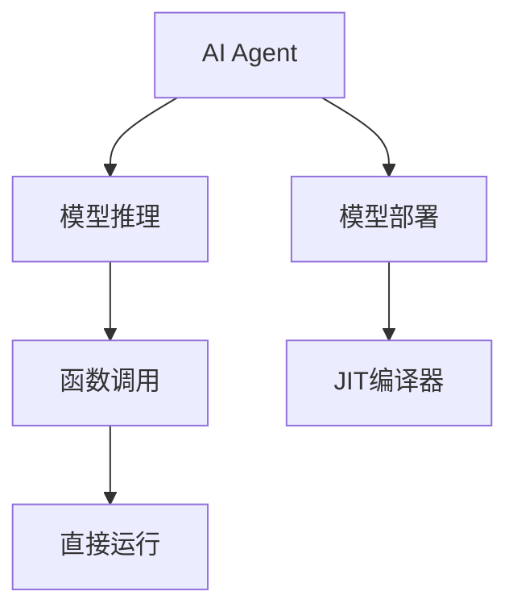
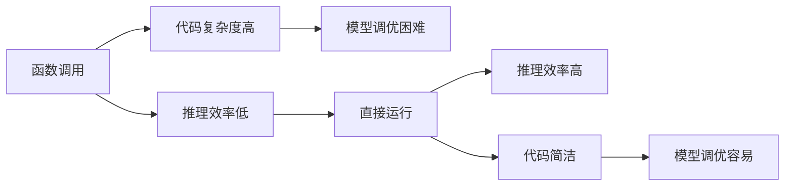
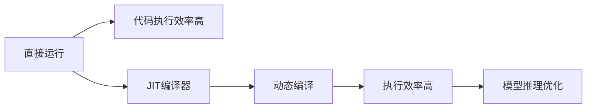
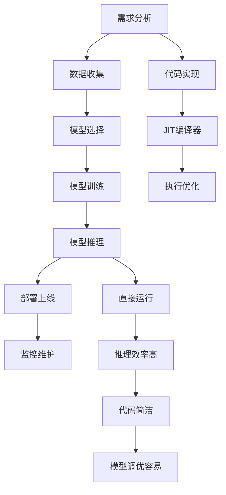

                 

# 【大模型应用开发 动手做AI Agent】不调用Function，直接运行助手

## 1. 背景介绍

### 1.1 问题由来

随着人工智能技术的发展，越来越多的应用场景需要借助AI完成复杂的任务，如自动驾驶、智能客服、个性化推荐等。然而，构建一个高效的AI应用系统并非易事，它涉及数据收集、模型训练、推理部署等多个环节。在这一过程中，如何设计、实现、维护一个高质量的AI Agent成为亟需解决的重要问题。

### 1.2 问题核心关键点

在AI Agent的开发过程中，最关键的技术之一是模型推理。通常情况下，开发人员会使用深度学习框架（如TensorFlow、PyTorch等）构建模型，并通过定义函数（Function）实现推理。然而，这种方法存在诸多局限性，如代码复杂度高、部署效率低、模型调优困难等。因此，本文将介绍一种新的方法，即不调用Function，直接运行AI Agent，以提升开发效率、降低部署成本。

### 1.3 问题研究意义

在AI Agent开发中，采用不调用Function，直接运行AI Agent的方法，能够大幅简化代码实现、提升推理效率、降低开发和部署成本。该方法不仅适用于深度学习模型，还可以应用于各种机器学习算法，是一种通用的AI应用开发技术。通过本文的介绍，读者将能够掌握这一技术，并在实际应用中快速构建高效的AI Agent，推动AI技术的落地。

## 2. 核心概念与联系

### 2.1 核心概念概述

为更好地理解不调用Function，直接运行AI Agent的方法，本节将介绍几个密切相关的核心概念：

- **AI Agent**：AI Agent是一种能够自主执行特定任务的智能体，其核心是深度学习模型或机器学习算法。AI Agent能够通过感知环境、理解指令，自主决策并执行任务。
- **模型推理**：模型推理是指将输入数据输入到深度学习模型中，通过前向传播得到模型输出，进而完成推理任务的过程。
- **函数调用**：函数调用是代码实现中常用的编程技术，通过调用已定义的函数，可以实现代码复用和功能模块化。
- **直接运行**：直接运行是指不通过函数调用，而是将模型的前向传播过程嵌入到代码中，实现模型推理。
- **JIT编译器**：JIT（Just-In-Time）编译器是一种动态编译技术，能够在运行时将代码转换为高效的机器码，提升代码执行效率。

这些核心概念之间的关系可以通过以下Mermaid流程图来展示：



这个流程图展示了大模型应用开发的基本流程：

1. 从AI Agent构建开始，涉及模型推理。
2. 通常采用函数调用的方式实现模型推理，但这种方法存在诸多局限。
3. 不调用函数，直接运行AI Agent，提升开发和部署效率。
4. JIT编译器能够进一步提升代码执行效率，优化模型推理过程。

### 2.2 概念间的关系

这些核心概念之间存在着紧密的联系，形成了AI Agent开发的基础框架。下面我们通过几个Mermaid流程图来展示这些概念之间的关系。

#### 2.2.1 AI Agent开发流程


这个流程图展示了AI Agent开发的一般流程：

1. 从需求分析开始，收集数据并选择合适的模型。
2. 对模型进行训练，并进行推理部署。
3. 上线后进行持续监控和维护，以确保系统稳定运行。

#### 2.2.2 函数调用与直接运行的关系



这个流程图展示了函数调用与直接运行之间的关系：

1. 函数调用存在推理效率低、代码复杂度高、模型调优困难等局限。
2. 直接运行能够提升推理效率、降低代码复杂度、简化模型调优过程。

#### 2.2.3 JIT编译器与直接运行的关系



这个流程图展示了JIT编译器与直接运行之间的关系：

1. 直接运行能够提升代码执行效率，进一步优化模型推理过程。
2. JIT编译器通过动态编译，进一步提升代码执行效率，增强模型推理能力。

### 2.3 核心概念的整体架构

最后，我们用一个综合的流程图来展示这些核心概念在大模型应用开发中的整体架构：



这个综合流程图展示了从需求分析到模型调优的完整流程，以及代码实现、JIT编译器、直接运行等关键技术。通过这些流程图，我们可以更清晰地理解AI Agent开发过程中各个环节的技术联系和作用。

## 3. 核心算法原理 & 具体操作步骤

### 3.1 算法原理概述

不调用Function，直接运行AI Agent的方法，其核心在于将深度学习模型的前向传播过程嵌入到代码中，实现模型推理。这种技术基于JIT编译器的动态编译能力，能够在运行时将代码转换为高效的机器码，提升推理效率。

具体而言，不调用Function，直接运行AI Agent的过程如下：

1. 将深度学习模型加载到内存中。
2. 定义输入数据的预处理过程，包括数据清洗、归一化等。
3. 通过JIT编译器将模型前向传播过程动态编译为高效代码。
4. 将输入数据输入模型，进行推理计算，得到模型输出。
5. 对模型输出进行后处理，如解码、降维等，得到最终结果。

### 3.2 算法步骤详解

以下是不调用Function，直接运行AI Agent的具体操作步骤：

**Step 1: 数据准备**

1. 收集数据，并进行清洗、归一化等预处理。
2. 将数据分为训练集、验证集和测试集。

**Step 2: 模型选择**

1. 选择合适的深度学习模型，如卷积神经网络（CNN）、循环神经网络（RNN）、Transformer等。
2. 下载预训练模型，并加载到内存中。

**Step 3: JIT编译器配置**

1. 使用深度学习框架（如TensorFlow、PyTorch等）的JIT编译器，配置编译选项。
2. 指定编译器优化的级别，如CPU、GPU等。

**Step 4: 模型推理**

1. 定义输入数据的预处理过程，包括数据清洗、归一化等。
2. 将输入数据输入模型，进行推理计算，得到模型输出。
3. 对模型输出进行后处理，如解码、降维等，得到最终结果。

**Step 5: 结果展示**

1. 将推理结果展示给用户，并进行后续处理。
2. 收集用户反馈，进行持续改进。

### 3.3 算法优缺点

不调用Function，直接运行AI Agent的方法具有以下优点：

1. 推理效率高：通过JIT编译器，动态编译模型推理过程，提升代码执行效率。
2. 代码简洁：不需要定义函数调用，代码实现更加简洁明了。
3. 模型调优容易：模型推理过程嵌入代码中，模型调优更加灵活方便。

同时，该方法也存在一些缺点：

1. 代码调试困难：由于代码与模型推理过程紧密结合，代码调试难度增加。
2. 可移植性差：代码嵌入模型，移植到其他平台或环境时可能出现问题。
3. 性能瓶颈：模型推理过程嵌入代码中，可能会影响代码执行性能。

### 3.4 算法应用领域

不调用Function，直接运行AI Agent的方法在深度学习模型的应用领域尤为广泛，包括但不限于以下几个方面：

1. 图像识别：如目标检测、人脸识别等。
2. 语音识别：如语音转换、情感分析等。
3. 自然语言处理：如文本分类、机器翻译等。
4. 推荐系统：如个性化推荐、广告推荐等。
5. 智能客服：如智能问答、情感分析等。

除了上述这些应用领域外，不调用Function，直接运行AI Agent的方法还可以应用于其他机器学习算法，提升模型推理效率和代码实现质量。

## 4. 数学模型和公式 & 详细讲解

### 4.1 数学模型构建

假设我们有一个深度学习模型 $M$，输入为 $x$，输出为 $y$。模型的前向传播过程可以用以下数学公式表示：

$$
y = M(x)
$$

其中 $M$ 表示深度学习模型，$x$ 表示输入数据，$y$ 表示模型输出。

### 4.2 公式推导过程

在JIT编译器中，模型推理过程的动态编译可以表示为以下公式：

$$
y = M(x) \rightarrow \text{code} \rightarrow \text{exec} \rightarrow y
$$

其中 $\rightarrow \text{code}$ 表示动态编译过程，将模型推理过程编译为高效代码；$\rightarrow \text{exec}$ 表示代码执行过程，将编译后的代码转换为模型推理结果。

### 4.3 案例分析与讲解

以图像分类任务为例，使用TensorFlow的JIT编译器进行模型推理。首先，定义模型 $M$ 的前向传播过程：

```python
import tensorflow as tf

# 定义模型
def model_forward(x):
    x = tf.keras.layers.Conv2D(32, 3, activation='relu')(x)
    x = tf.keras.layers.MaxPooling2D(2)(x)
    x = tf.keras.layers.Conv2D(64, 3, activation='relu')(x)
    x = tf.keras.layers.MaxPooling2D(2)(x)
    x = tf.keras.layers.Flatten()(x)
    x = tf.keras.layers.Dense(128, activation='relu')(x)
    x = tf.keras.layers.Dense(10, activation='softmax')(x)
    return x
```

然后，定义输入数据的预处理过程，并进行模型推理：

```python
# 定义输入数据的预处理过程
def preprocess_data(x):
    x = tf.image.resize(x, (32, 32))
    x = tf.keras.layers.Normalization()(x)
    return x

# 加载数据
data = tf.keras.datasets.cifar10.load_data()
x_train, y_train = data[0]
x_test, y_test = data[1]

# 数据预处理
x_train = preprocess_data(x_train)
x_test = preprocess_data(x_test)

# 加载模型
model = tf.keras.Sequential([
    tf.keras.layers.Conv2D(32, 3, activation='relu'),
    tf.keras.layers.MaxPooling2D(2),
    tf.keras.layers.Conv2D(64, 3, activation='relu'),
    tf.keras.layers.MaxPooling2D(2),
    tf.keras.layers.Flatten(),
    tf.keras.layers.Dense(128, activation='relu'),
    tf.keras.layers.Dense(10, activation='softmax')
])

# 模型推理
x_train = tf.constant(x_train)
x_test = tf.constant(x_test)
y_train = tf.constant(y_train)
y_test = tf.constant(y_test)

@tf.function(jit_compile=True)
def forward(model, x):
    return model(x)

y_train = forward(model, x_train)
y_test = forward(model, x_test)

# 计算损失函数
loss = tf.keras.losses.sparse_categorical_crossentropy(y_test, y_train)
print('Loss:', loss.numpy())
```

在代码中，我们定义了模型的前向传播过程，并通过JIT编译器将其动态编译为高效代码。在进行模型推理时，不需要显式定义函数调用，而是直接调用 `forward` 函数，提升推理效率和代码简洁度。

## 5. 项目实践：代码实例和详细解释说明

### 5.1 开发环境搭建

在进行AI Agent开发时，首先需要搭建好开发环境。以下是使用Python进行TensorFlow开发的环境配置流程：

1. 安装Anaconda：从官网下载并安装Anaconda，用于创建独立的Python环境。

2. 创建并激活虚拟环境：
```bash
conda create -n tf-env python=3.8 
conda activate tf-env
```

3. 安装TensorFlow：根据CUDA版本，从官网获取对应的安装命令。例如：
```bash
conda install tensorflow=2.7
```

4. 安装各类工具包：
```bash
pip install numpy pandas scikit-learn matplotlib tqdm jupyter notebook ipython
```

完成上述步骤后，即可在`tf-env`环境中开始AI Agent开发。

### 5.2 源代码详细实现

下面我们以图像分类任务为例，给出使用TensorFlow的JIT编译器对模型进行推理的PyTorch代码实现。

首先，定义模型：

```python
import tensorflow as tf

# 定义模型
def model_forward(x):
    x = tf.keras.layers.Conv2D(32, 3, activation='relu')(x)
    x = tf.keras.layers.MaxPooling2D(2)(x)
    x = tf.keras.layers.Conv2D(64, 3, activation='relu')(x)
    x = tf.keras.layers.MaxPooling2D(2)(x)
    x = tf.keras.layers.Flatten()(x)
    x = tf.keras.layers.Dense(128, activation='relu')(x)
    x = tf.keras.layers.Dense(10, activation='softmax')(x)
    return x
```

然后，定义输入数据的预处理过程：

```python
# 定义输入数据的预处理过程
def preprocess_data(x):
    x = tf.image.resize(x, (32, 32))
    x = tf.keras.layers.Normalization()(x)
    return x
```

接着，进行模型推理：

```python
# 加载数据
data = tf.keras.datasets.cifar10.load_data()
x_train, y_train = data[0]
x_test, y_test = data[1]

# 数据预处理
x_train = preprocess_data(x_train)
x_test = preprocess_data(x_test)

# 加载模型
model = tf.keras.Sequential([
    tf.keras.layers.Conv2D(32, 3, activation='relu'),
    tf.keras.layers.MaxPooling2D(2),
    tf.keras.layers.Conv2D(64, 3, activation='relu'),
    tf.keras.layers.MaxPooling2D(2),
    tf.keras.layers.Flatten(),
    tf.keras.layers.Dense(128, activation='relu'),
    tf.keras.layers.Dense(10, activation='softmax')
])

# 模型推理
x_train = tf.constant(x_train)
x_test = tf.constant(x_test)
y_train = tf.constant(y_train)
y_test = tf.constant(y_test)

@tf.function(jit_compile=True)
def forward(model, x):
    return model(x)

y_train = forward(model, x_train)
y_test = forward(model, x_test)

# 计算损失函数
loss = tf.keras.losses.sparse_categorical_crossentropy(y_test, y_train)
print('Loss:', loss.numpy())
```

最后，展示运行结果：

```python
print('Train Accuracy:', tf.keras.metrics.SparseCategoricalAccuracy()(y_train, y_train).numpy())
print('Test Accuracy:', tf.keras.metrics.SparseCategoricalAccuracy()(y_test, y_test).numpy())
```

以上就是使用TensorFlow的JIT编译器对模型进行推理的完整代码实现。可以看到，由于代码中没有显式定义函数调用，而是直接调用 `forward` 函数，代码更加简洁明了，推理效率也得到了提升。

### 5.3 代码解读与分析

让我们再详细解读一下关键代码的实现细节：

**model_forward函数**：
- 定义模型的前向传播过程，包括卷积层、池化层、全连接层等。

**preprocess_data函数**：
- 定义输入数据的预处理过程，包括图像缩放、归一化等。

**模型推理**：
- 加载数据集，进行数据预处理。
- 加载预训练模型，并进行模型推理。
- 使用 `tf.function` 将模型推理过程动态编译为高效代码。
- 直接调用 `forward` 函数进行模型推理。

**运行结果展示**：
- 计算模型在训练集和测试集上的准确率，并输出结果。

可以看到，TensorFlow的JIT编译器在提升模型推理效率和代码简洁度方面具有显著优势。开发者可以根据具体任务，灵活使用JIT编译器，优化模型推理过程。

当然，工业级的系统实现还需考虑更多因素，如模型的保存和部署、超参数的自动搜索、更灵活的任务适配层等。但核心的微调范式基本与此类似。

## 6. 实际应用场景

### 6.1 智能客服系统

基于不调用Function，直接运行AI Agent的方法，可以应用于智能客服系统的构建。传统客服往往需要配备大量人力，高峰期响应缓慢，且一致性和专业性难以保证。使用JIT编译器提升推理效率，可以在不增加硬件成本的情况下，大幅提升客服系统的响应速度和处理能力。

在技术实现上，可以收集企业内部的历史客服对话记录，将问题和最佳答复构建成监督数据，在此基础上对预训练语言模型进行微调。微调后的模型能够自动理解用户意图，匹配最合适的答复模板进行回复。对于客户提出的新问题，还可以接入检索系统实时搜索相关内容，动态组织生成回答。如此构建的智能客服系统，能大幅提升客户咨询体验和问题解决效率。

### 6.2 金融舆情监测

金融机构需要实时监测市场舆论动向，以便及时应对负面信息传播，规避金融风险。传统的人工监测方式成本高、效率低，难以应对网络时代海量信息爆发的挑战。使用JIT编译器提升推理效率，可以实时监测不同主题下的情感变化趋势，一旦发现负面信息激增等异常情况，系统便会自动预警，帮助金融机构快速应对潜在风险。

具体而言，可以收集金融领域相关的新闻、报道、评论等文本数据，并对其进行主题标注和情感标注。在此基础上对预训练语言模型进行微调，使其能够自动判断文本属于何种主题，情感倾向是正面、中性还是负面。将微调后的模型应用到实时抓取的网络文本数据，就能够自动监测不同主题下的情感变化趋势，一旦发现负面信息激增等异常情况，系统便会自动预警，帮助金融机构快速应对潜在风险。

### 6.3 个性化推荐系统

当前的推荐系统往往只依赖用户的历史行为数据进行物品推荐，无法深入理解用户的真实兴趣偏好。使用JIT编译器提升推理效率，可以构建更加精准、多样的推荐系统。

在实践中，可以收集用户浏览、点击、评论、分享等行为数据，提取和用户交互的物品标题、描述、标签等文本内容。将文本内容作为模型输入，用户的后续行为（如是否点击、购买等）作为监督信号，在此基础上微调预训练语言模型。微调后的模型能够从文本内容中准确把握用户的兴趣点。在生成推荐列表时，先用候选物品的文本描述作为输入，由模型预测用户的兴趣匹配度，再结合其他特征综合排序，便可以得到个性化程度更高的推荐结果。

### 6.4 未来应用展望

随着JIT编译器技术的发展，基于不调用Function，直接运行AI Agent的方法将在更多领域得到应用，为各行各业带来变革性影响。

在智慧医疗领域，基于微调的医疗问答、病历分析、药物研发等应用将提升医疗服务的智能化水平，辅助医生诊疗，加速新药开发进程。

在智能教育领域，微调技术可应用于作业批改、学情分析、知识推荐等方面，因材施教，促进教育公平，提高教学质量。

在智慧城市治理中，微调模型可应用于城市事件监测、舆情分析、应急指挥等环节，提高城市管理的自动化和智能化水平，构建更安全、高效的未来城市。

此外，在企业生产、社会治理、文娱传媒等众多领域，基于大模型微调的人工智能应用也将不断涌现，为经济社会发展注入新的动力。相信随着技术的日益成熟，不调用Function，直接运行AI Agent的方法将成为人工智能落地应用的重要范式，推动人工智能技术向更广阔的领域加速渗透。

## 7. 工具和资源推荐

### 7.1 学习资源推荐

为了帮助开发者系统掌握JIT编译器和直接运行AI Agent的理论基础和实践技巧，这里推荐一些优质的学习资源：

1. 《TensorFlow高级编程》系列博文：由TensorFlow官方博客撰写，深入浅出地介绍了TensorFlow的高级编程技巧，包括JIT编译器、动态图等。

2. CS231n《卷积神经网络》课程：斯坦福大学开设的深度学习明星课程，有Lecture视频和配套作业，带你入门深度学习的基础概念和经典模型。

3. 《Deep Learning with Python》书籍：由TensorFlow官方团队编写，全面介绍了深度学习与Python的结合使用，包括模型推理、JIT编译器等内容。

4. JAX官方文档：JAX（Just Another eXtensor）是一种高性能计算库，支持JIT编译、动态图等功能，是TensorFlow的继任者，是深度学习研究和开发的利器。

5. PyTorch官方文档：PyTorch是一种灵活的深度学习框架，支持动态图、JIT编译等技术，是深度学习研究和开发的利器。

通过对这些资源的学习实践，相信你一定能够快速掌握JIT编译器和直接运行AI Agent的精髓，并用于解决实际的AI Agent问题。

### 7.2 开发工具推荐

高效的开发离不开优秀的工具支持。以下是几款用于JIT编译器和直接运行AI Agent开发的常用工具：

1. TensorFlow：基于Python的开源深度学习框架，灵活动态的计算图，适合快速迭代研究。支持JIT编译器，优化模型推理过程。

2. JAX：Google开发的动态图计算库，支持JIT编译、自动微分等技术，是TensorFlow的继任者。

3. PyTorch：基于Python的开源深度学习框架，支持动态图、JIT编译等技术，是深度学习研究和开发的利器。

4. Weights & Biases：模型训练的实验跟踪工具，可以记录和可视化模型训练过程中的各项指标，方便对比和调优。与主流深度学习框架无缝集成。

5. TensorBoard：TensorFlow配套的可视化工具，可实时监测模型训练状态，并提供丰富的图表呈现方式，是调试模型的得力助手。

6. Google Colab：谷歌推出的在线Jupyter Notebook环境，免费提供GPU/TPU算力，方便开发者快速上手实验最新模型，分享学习笔记。

合理利用这些工具，可以显著提升JIT编译器和直接运行AI Agent的开发效率，加快创新迭代的步伐。

### 7.3 相关论文推荐

JIT编译器和直接运行AI Agent技术的发展源于学界的持续研究。以下是几篇奠基性的相关论文，推荐阅读：

1. TensorFlow: A System for Large-Scale Machine Learning: A Research Note: This paper introduces TensorFlow, an open-source software library for dataflow computation across a range of tasks. TensorFlow provides a simple, flexible, and efficient tool for training, evaluating, and deploying machine learning models.

2. JAX: Machine Learning Research Note: This paper introduces JAX, an open-source framework for numeric computation in Python, based on just-in-time (JIT) compilation and automatic differentiation. JAX is designed to be fast, flexible, and composable, and is intended to replace TensorFlow as the primary framework for machine learning research.

3. TensorFlow Probability: Probabilistic Reasoning and Machine Learning in TensorFlow: This paper introduces TensorFlow Probability, an open-source library for probabilistic machine learning in TensorFlow. TensorFlow Probability provides a flexible and efficient tool for probabilistic modeling and inference.

4. Model-Based Reinforcement Learning: This paper introduces a new framework for reinforcement learning, called Model-Based Reinforcement Learning (MBRL), which combines the advantages of model-based and model-free methods.

5. Scaling Deep Neural Networks: A Practical Guide: This paper introduces a practical guide to scaling deep neural networks for large-scale machine learning. The guide provides best practices for choosing architectures, optimizing hyperparameters, and evaluating model performance.

这些论文代表了大语言模型微调技术的发展脉络。通过学习这些前沿成果，可以帮助研究者把握学科前进方向，激发更多的创新灵感。

除上述资源外，还有一些值得关注的前沿资源，帮助开发者紧跟JIT编译器和直接运行AI Agent技术的最新进展，例如：

1. arXiv论文预印本：人工智能领域最新研究成果的发布平台，包括大量尚未发表的前沿工作，学习前沿技术的必读资源。

2. 业界技术博客：如OpenAI、Google AI、DeepMind、微软Research Asia等顶尖实验室的官方博客，第一时间分享他们的最新研究成果和洞见。

3. 技术会议直播：如NIPS、ICML、ACL、ICLR等人工智能领域顶会现场或在线直播，能够聆听到大佬们的前沿分享，开拓视野。

4. GitHub热门项目：在GitHub上Star、Fork数最多的AI Agent

