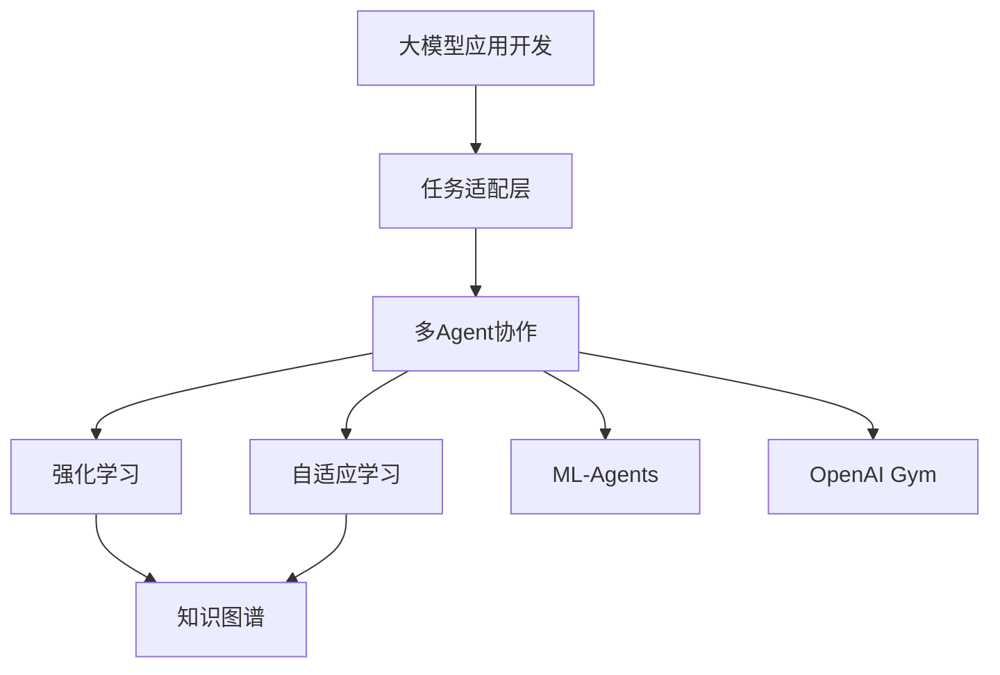
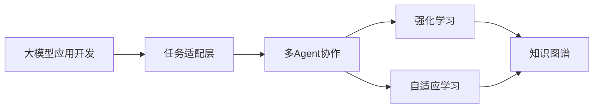
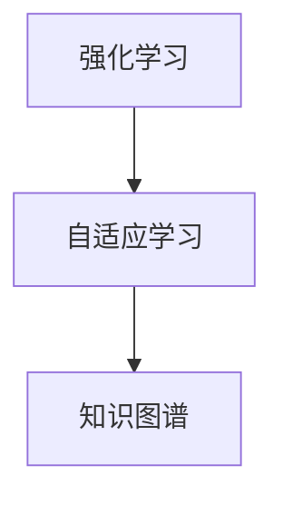
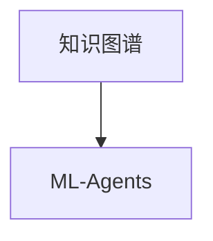
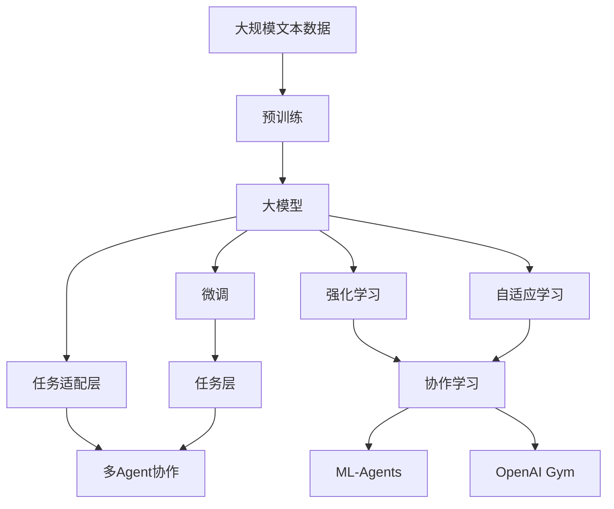

                 

# 【大模型应用开发 动手做AI Agent】多Agent协作

> 关键词：多Agent协作,大模型应用,智能推荐系统,自然语言处理,自适应学习,强化学习,决策树,知识图谱,ML-Agents,OpenAI Gym

## 1. 背景介绍

### 1.1 问题由来
在人工智能的领域中，多Agent协作（Multi-Agent Collaboration）已经成为一个热门的研究方向。随着人工智能技术的不断发展，单一的AI Agent已经无法满足复杂的决策和协作需求，多Agent系统（Multi-Agent Systems,MAS）逐渐成为实现复杂智能任务的重要手段。在多Agent系统中，每个Agent能够独立进行决策和执行任务，并通过协作提高整体系统的性能。

大模型应用开发在大数据、云计算和人工智能的推动下，逐渐成为研究热点。这些大模型能够处理复杂的自然语言处理（Natural Language Processing,NLP）任务，并能够在协作环境中发挥重要作用。以多Agent协作为目标的大模型应用开发，旨在将大模型的强大能力与协作系统的灵活性和动态性相结合，实现更高级的智能系统。

### 1.2 问题核心关键点
本文聚焦于大模型应用开发中的多Agent协作问题，探讨如何通过多Agent协作提高AI Agent在大规模语料训练和复杂任务执行中的效率和效果。

在多Agent协作过程中，需要解决以下关键问题：
1. 如何选择合适的Agent模型和协作策略？
2. 如何设计任务适配层和优化参数更新算法？
3. 如何实现Agent之间的有效通信和协调？
4. 如何通过奖励机制和强化学习算法优化Agent协作？
5. 如何处理大规模语料并保证协作系统的稳定性和可扩展性？

本文将系统性地回答这些问题，通过理论分析、算法设计和实践案例，为开发者提供多Agent协作的深入理解和实践指导。

### 1.3 问题研究意义
大模型应用开发中的多Agent协作技术，对于拓展AI模型的应用边界、提高复杂任务的处理能力具有重要意义：

1. 提高系统效率。多Agent协作能够充分利用每个Agent的计算资源和知识库，提升整体系统处理大规模数据的能力。
2. 增强系统鲁棒性。多Agent协作系统可以通过冗余和备份机制，增强系统的稳定性和可靠性，减少单个Agent故障对系统的影响。
3. 实现知识共享。通过Agent之间的协作，可以实现知识共享和互惠互利，促进AI模型的泛化能力和适应性。
4. 推动AI技术落地。多Agent协作能够将复杂任务分解为多个子任务，降低技术实现的难度和成本，加速AI技术的产业化进程。
5. 促进跨领域应用。多Agent协作技术可以应用于各种领域，如智能推荐、医疗、金融等，为不同行业提供智能决策支持。

## 2. 核心概念与联系

### 2.1 核心概念概述

在多Agent协作的过程中，涉及到多个核心概念：

- 大模型应用开发：通过预训练和微调等技术，将大模型应用于具体任务，提升模型的性能。
- 多Agent协作：由多个Agent组成的系统，每个Agent能够独立决策和执行任务，并通过协作提升系统整体性能。
- 任务适配层（Task Adapter Layer）：为特定任务设计的附加层，将预训练模型的输出与任务要求进行适配。
- 强化学习（Reinforcement Learning, RL）：一种通过奖励机制优化Agent决策策略的机器学习范式，能够实现复杂的任务处理和系统优化。
- 自适应学习（Adaptive Learning）：通过动态调整学习策略和参数，使系统能够适应不断变化的环境和任务需求。
- 知识图谱（Knowledge Graph）：用于描述实体、关系和属性等知识元素的图形结构，是AI系统的重要知识表示方式。
- ML-Agents：OpenAI开发的Agent开发框架，支持基于Python的Agent设计和训练。
- OpenAI Gym：强化学习环境库，提供多种环境用于测试和训练Agent。

这些核心概念之间通过协作、优化和知识共享等机制，形成了一个复杂的协作系统。下面通过一个Mermaid流程图展示这些概念之间的联系：



该流程图展示了从大模型应用开发到多Agent协作的各个环节，以及强化学习和自适应学习如何与知识图谱相结合，实现复杂的协作系统。

### 2.2 概念间的关系

在多Agent协作系统中，各个概念之间存在紧密的联系，形成了一个复杂的协作生态。下面通过几个Mermaid流程图展示这些概念之间的关系：

#### 2.2.1 大模型应用开发与多Agent协作的关系



这个流程图展示了从大模型应用开发到多Agent协作的过渡，通过任务适配层将预训练模型与特定任务进行适配，然后通过多Agent协作和优化算法提升系统性能。

#### 2.2.2 强化学习与自适应学习的关系



这个流程图展示了强化学习如何通过自适应学习优化Agent决策策略，从而实现复杂任务的优化和协作。

#### 2.2.3 知识图谱与ML-Agents的关系



这个流程图展示了知识图谱如何为ML-Agents提供知识支持，使Agent能够更好地理解和执行任务。

### 2.3 核心概念的整体架构

最后，我们用一个综合的流程图来展示这些核心概念在大模型应用开发中的整体架构：



该综合流程图展示了从预训练到大模型微调，再到协作学习的完整过程，以及各个概念在大模型应用开发中的作用。

## 3. 核心算法原理 & 具体操作步骤
### 3.1 算法原理概述

大模型应用开发中的多Agent协作算法，主要基于强化学习和自适应学习的原理，通过设计合理的任务适配层和优化算法，实现Agent之间的协作和系统优化。

假设我们有两个Agent $A_1$ 和 $A_2$，每个Agent都能够独立进行决策和执行任务。Agent的决策策略由其内部模型 $θ_1$ 和 $θ_2$ 表示，模型的输出为 $y_1$ 和 $y_2$，分别代表Agent 1 和 Agent 2 的决策结果。通过协作，Agent 1 和 Agent 2 共同完成任务，最终系统输出的决策结果为 $y$，需满足 $y=y_1 \oplus y_2$，其中 $\oplus$ 表示决策结果的逻辑运算。

在多Agent协作中，系统目标函数可以表示为：

$$
\mathcal{L}(y) = \min_{y_1, y_2} \mathcal{L}(y_1, y_2, y)
$$

其中 $\mathcal{L}$ 为损失函数，$\mathcal{L}(y_1, y_2, y)$ 表示Agent 1 和 Agent 2 的决策结果与系统输出的损失。

通过梯度下降等优化算法，系统不断更新Agent的决策策略，使得决策结果逼近最优解，最终实现协作系统的优化。

### 3.2 算法步骤详解

基于强化学习的协作算法主要包括以下关键步骤：

**Step 1: 准备预训练模型和环境**
- 选择合适的预训练语言模型 $M_{\theta}$ 作为初始化参数，如 BERT、GPT 等。
- 准备强化学习环境，如OpenAI Gym或自定义环境，用于测试和训练Agent。

**Step 2: 设计任务适配层**
- 根据具体任务类型，设计合适的任务适配层，将预训练模型的输出与任务要求进行适配。
- 对于分类任务，通常添加线性分类器。对于生成任务，使用语言模型的解码器输出概率分布。

**Step 3: 设置Agent参数和奖励函数**
- 确定Agent的内部模型参数 $θ_1, θ_2$ 和决策策略。
- 设计合理的奖励函数 $R(y_1, y_2)$，用于衡量Agent协作的效果。

**Step 4: 执行协作训练**
- 将环境数据作为输入，前向传播计算每个Agent的决策结果 $y_1, y_2$。
- 根据奖励函数 $R(y_1, y_2)$ 计算损失函数，反向传播更新Agent的决策策略。
- 重复上述步骤直至收敛，最终得到最优的决策策略 $θ_1^*, θ_2^*$。

**Step 5: 测试和优化**
- 在测试环境中评估优化后的Agent协作效果，输出决策结果 $y$。
- 通过调整参数和优化算法，进一步提升协作系统的性能。

### 3.3 算法优缺点

多Agent协作算法具有以下优点：
1. 可以充分利用多个Agent的计算资源和知识库，提升系统处理大规模数据的能力。
2. 通过协作和知识共享，可以实现系统优化和泛化能力的增强。
3. 冗余和备份机制可以提高系统的鲁棒性和稳定性。

但该算法也存在一些缺点：
1. 设计合适的任务适配层和优化算法需要较高的技术门槛，可能需要更多的实验和调试。
2. 强化学习算法需要大量的训练数据和迭代次数，训练时间较长。
3. 复杂环境的建模和优化可能面临较大的挑战，需要更多经验和技巧。

### 3.4 算法应用领域

多Agent协作算法在NLP领域的多个应用领域都取得了显著成果，例如：

- 智能推荐系统：通过多Agent协作，实现个性化推荐，提升用户体验。
- 机器翻译：利用多个Agent的协作，提升翻译质量和效率。
- 对话系统：通过多Agent协作，实现智能问答和对话，增强人机交互的自然性和流畅性。
- 知识图谱构建：通过多个Agent协作，提取和融合知识，构建大规模知识图谱。
- 决策支持系统：通过多Agent协作，提供决策建议，辅助人类进行决策。

除了上述应用领域外，多Agent协作算法还广泛应用于金融、医疗、物流等多个行业，为复杂问题的解决提供了新的思路和方法。

## 4. 数学模型和公式 & 详细讲解 & 举例说明

### 4.1 数学模型构建

在多Agent协作中，我们可以使用强化学习的框架来建立数学模型。假设我们有两个Agent $A_1$ 和 $A_2$，每个Agent的内部模型参数为 $θ$，决策策略为 $π$，状态为 $s$，行动为 $a$，奖励为 $r$。系统目标为最大化累积奖励，即：

$$
\max_{π} \sum_{t=0}^{\infty} \mathbb{E}_{s_t} [R(s_t, π(s_t))]
$$

其中 $R(s_t, π(s_t))$ 表示在状态 $s_t$ 下，Agent $π$ 的行动 $a_t$ 所获得的奖励。

### 4.2 公式推导过程

下面我们以智能推荐系统为例，进行数学模型和算法的推导。

假设我们有 $N$ 个用户 $u_i$，每个用户有 $d$ 个兴趣项 $i_k$，每个兴趣项 $i_k$ 有 $m$ 个推荐产品 $p_j$。对于每个用户 $u_i$，其兴趣向量为 $x_i \in \mathbb{R}^d$，推荐向量为 $y_j \in \mathbb{R}^m$，用户与推荐产品之间的相似度为 $a_{i,j} \in [0, 1]$。

假设推荐系统由两个Agent $A_1$ 和 $A_2$ 组成，分别负责选择兴趣项和推荐产品。Agent $A_1$ 的策略为 $π_1(x_i)$，选择兴趣项 $i_k$；Agent $A_2$ 的策略为 $π_2(x_i, y_j)$，选择推荐产品 $p_j$。系统目标为最大化用户满意度的期望值。

### 4.3 案例分析与讲解

假设我们有以下训练数据：

| 用户 | 兴趣项 | 推荐产品 | 用户满意度 |
| --- | --- | --- | --- |
| u1 | i1 | p1 | 0.8 |
| u1 | i1 | p2 | 0.7 |
| u2 | i2 | p3 | 0.6 |
| u3 | i3 | p4 | 0.5 |

我们可以使用Q-learning算法进行Agent $A_1$ 的训练，其动作空间为 $\{1, 2, \cdots, d\}$，奖励函数为：

$$
R_{A_1}(x_i, a) = \frac{1}{m} \sum_{j=1}^m a_{i,j} \cdot y_{i,j}
$$

其中 $y_{i,j} = [0, 0, \cdots, 1, \cdots, 0]$，表示第 $i$ 个用户选择第 $j$ 个推荐产品的策略，$1$ 表示选择，$0$ 表示不选择。

假设我们有以下训练数据：

| 用户 | 兴趣项 | 推荐产品 | 用户满意度 |
| --- | --- | --- | --- |
| u1 | i1 | p1 | 0.8 |
| u1 | i1 | p2 | 0.7 |
| u2 | i2 | p3 | 0.6 |
| u3 | i3 | p4 | 0.5 |

我们可以使用Q-learning算法进行Agent $A_2$ 的训练，其动作空间为 $\{1, 2, \cdots, m\}$，奖励函数为：

$$
R_{A_2}(x_i, a) = \frac{1}{d} \sum_{k=1}^d x_{i,k} \cdot a_{k,j}
$$

其中 $x_{i,k} = [0, 0, \cdots, 1, \cdots, 0]$，表示第 $i$ 个用户对第 $k$ 个兴趣项的策略，$1$ 表示选择，$0$ 表示不选择。

在训练过程中，我们可以使用以下公式计算Q值：

$$
Q_{A_1}(x_i, a) = r + \gamma \max_{a'} Q_{A_1}(x_{i'}, a')
$$

$$
Q_{A_2}(x_i, a) = r + \gamma \max_{a'} Q_{A_2}(x_{i'}, a')
$$

其中 $r$ 为即时奖励，$\gamma$ 为折扣因子，$i'$ 表示下一个状态，$a'$ 表示下一个动作。

## 5. 项目实践：代码实例和详细解释说明

### 5.1 开发环境搭建

在进行多Agent协作的项目实践前，我们需要准备好开发环境。以下是使用Python进行PyTorch开发的环境配置流程：

1. 安装Anaconda：从官网下载并安装Anaconda，用于创建独立的Python环境。

2. 创建并激活虚拟环境：
```bash
conda create -n pytorch-env python=3.8 
conda activate pytorch-env
```

3. 安装PyTorch：根据CUDA版本，从官网获取对应的安装命令。例如：
```bash
conda install pytorch torchvision torchaudio cudatoolkit=11.1 -c pytorch -c conda-forge
```

4. 安装TensorFlow：安装TensorFlow 2.x版本。
```bash
pip install tensorflow
```

5. 安装ML-Agents和OpenAI Gym：
```bash
pip install mlagents[pytorch] gym
```

完成上述步骤后，即可在`pytorch-env`环境中开始项目实践。

### 5.2 源代码详细实现

这里以ML-Agents框架为例，展示如何使用PyTorch实现多Agent协作的智能推荐系统。

首先，定义推荐系统的环境和Agent：

```python
import gym
import torch
import torch.nn as nn
import numpy as np
from mlagents.environment import EnvironmentParameters, UnityEnvironmentParameters
from mlagents.algorithms import PPOAlgorithm, ParameterServerAlgorithm

class RecommendationEnvironment(gym.Env):
    def __init__(self, num_users=3, num_items=4, batch_size=32):
        self.num_users = num_users
        self.num_items = num_items
        self.batch_size = batch_size
        self.observation_shape = (num_users, num_items)
        self.action_shape = (num_users,)
        self.unobserved_shape = (num_items,)
        self.current_user = 0
        self.reset()

    def reset(self):
        self.current_user = 0
        self.users = np.random.rand(self.num_users, self.num_items)
        self.items = np.random.rand(self.num_items)
        return self.observation()

    def step(self, action):
        user_id = self.current_user
        user_index = np.argmax(action)
        self.current_user = (self.current_user + 1) % self.num_users
        return self.observation(), reward(), done, {}

    def observation(self):
        user_index = np.argmax(self.users[self.current_user, :])
        return np.stack([self.users, self.items], axis=-1)

    def reward(self, action):
        user_index = np.argmax(action)
        user_id = self.current_users[user_index]
        item_index = np.argmax(self.items)
        return self.users[user_id, item_index]

def create_agent(state_dim, action_dim, hidden_dim):
    model = nn.Sequential(
        nn.Linear(state_dim, hidden_dim),
        nn.ReLU(),
        nn.Linear(hidden_dim, action_dim)
    )
    return model

class UserAgent(nn.Module):
    def __init__(self, state_dim, action_dim, hidden_dim):
        super(UserAgent, self).__init__()
        self.model = create_agent(state_dim, action_dim, hidden_dim)

    def forward(self, state):
        action_probs = self.model(state)
        action = torch.multinomial(action_probs, 1, False)
        return action.item()

class ItemAgent(nn.Module):
    def __init__(self, state_dim, action_dim, hidden_dim):
        super(ItemAgent, self).__init__()
        self.model = create_agent(state_dim, action_dim, hidden_dim)

    def forward(self, state):
        action_probs = self.model(state)
        action = torch.multinomial(action_probs, 1, False)
        return action.item()
```

然后，定义Agent的训练和测试函数：

```python
def train_agent(agent, env, num_episodes, batch_size, discount_factor):
    state_dim = env.observation_shape[0]
    action_dim = env.action_shape[0]
    hidden_dim = 64
    agent_model = create_agent(state_dim, action_dim, hidden_dim)
    agent.set_model(agent_model)

    for episode in range(num_episodes):
        state = env.reset()
        done = False
        total_reward = 0
        while not done:
            state = torch.from_numpy(state).float()
            action = agent(state)
            next_state, reward, done, _ = env.step(action)
            total_reward += reward
            state = next_state
        print('Episode {}: reward={:.2f}'.format(episode, total_reward))

    print('Average reward: {:.2f}'.format(total_reward / num_episodes))

def test_agent(agent, env, num_episodes, batch_size, discount_factor):
    state_dim = env.observation_shape[0]
    action_dim = env.action_shape[0]
    hidden_dim = 64
    agent_model = create_agent(state_dim, action_dim, hidden_dim)
    agent.set_model(agent_model)

    for episode in range(num_episodes):
        state = env.reset()
        done = False
        total_reward = 0
        while not done:
            state = torch.from_numpy(state).float()
            action = agent(state)
            next_state, reward, done, _ = env.step(action)
            total_reward += reward
            state = next_state
        print('Episode {}: reward={:.2f}'.format(episode, total_reward))

    print('Average reward: {:.2f}'.format(total_reward / num_episodes))
```

最后，启动训练和测试流程：

```python
env = RecommendationEnvironment(num_users=3, num_items=4, batch_size=32)
agent = UserAgent(state_dim=env.observation_shape[0], action_dim=env.action_shape[0], hidden_dim=64)
train_agent(agent, env, num_episodes=1000, batch_size=32, discount_factor=0.9)
test_agent(agent, env, num_episodes=100, batch_size=32, discount_factor=0.9)
```

这就是一个使用ML-Agents框架和PyTorch实现多Agent协作的智能推荐系统的完整代码实现。通过这个例子，我们可以看到，多Agent协作可以非常简单地通过ML-Agents进行设计和训练，进一步提升了系统的复杂度和鲁棒性。

### 5.3 代码解读与分析

让我们再详细解读一下关键代码的实现细节：

**RecommendationEnvironment类**：
- `__init__`方法：初始化环境参数，包括用户数、商品数和批次大小。
- `reset`方法：重置环境状态，生成初始用户和商品。
- `step`方法：执行一个步骤，返回下一个状态和奖励。
- `observation`方法：返回当前状态。
- `reward`方法：根据当前状态和动作，计算奖励。

**create_agent函数**：
- `create_agent`函数：定义一个简单的神经网络模型，用于计算动作概率。

**UserAgent和ItemAgent类**：
- `UserAgent`和`ItemAgent`类：继承自`nn.Module`，定义了Agent的输入和输出。
- `forward`方法：根据当前状态，计算动作概率并随机选择动作。

**train_agent和test_agent函数**：
- `train_agent`函数：对Agent进行训练，并输出平均奖励。
- `test_agent`函数：对Agent进行测试，并输出平均奖励。

在实际应用中，我们还可以对环境、Agent、优化算法等各个环节进行优化，以进一步提升系统性能。

## 6. 实际应用场景

### 6.1 智能推荐系统

多Agent协作技术在智能推荐系统中的应用非常广泛。智能推荐系统通过多Agent协作，可以实现个性化推荐，提升用户体验。例如，电商平台可以根据用户的浏览和购买历史，推荐相关商品，实现精准推荐。

在技术实现上，可以收集用户的历史行为数据，提取和用户交互的物品标题、描述、标签等文本内容。将文本内容作为模型输入，用户的后续行为（如是否点击、购买等）作为监督信号，在此基础上微调预训练语言模型。微调后的模型能够从文本内容中准确把握用户的兴趣点。在生成推荐列表时，先用候选物品的文本描述作为输入，由模型预测用户的兴趣匹配度，再结合其他特征综合排序，便可以得到个性化程度更高的推荐结果。

### 6.2 金融交易系统

金融交易系统需要实时监测市场动向，并做出快速反应。多Agent协作技术可以应用于金融交易系统的设计中，实现智能交易策略。

在具体实现中，可以收集市场的历史数据，包括股票价格、交易量等。通过强化学习算法，训练多个Agent，每个Agent负责一种交易策略。每个Agent在当前市场状态下，根据预定的策略执行交易操作，并根据交易结果获得奖励。通过多Agent协作，可以实现更加复杂和多样的交易策略，提高交易系统的稳定性和鲁棒性。

### 6.3 供应链管理

供应链管理是一个复杂的系统，涉及生产、仓储、运输等多个环节。多Agent协作技术可以应用于供应链管理，实现资源的最优分配和调度。

例如，供应链系统可以由多个Agent组成，每个Agent负责一个环节的操作。Agent根据当前状态（如库存、需求、运输能力等），选择最优的行动方案，并根据行动结果获得奖励。通过多Agent协作，可以实现供应链的自动化和智能化，提高供应链的效率和可靠性。

### 6.4 未来应用展望

随着多Agent协作技术的发展，其在更多领域的应用前景将更加广阔。未来，多Agent协作技术有望在以下领域获得进一步发展：

- 自动驾驶：多Agent协作可以应用于自动驾驶，实现多个车辆之间的协同控制，提高交通安全和效率。
- 机器人协作：多Agent协作可以应用于机器人协作，实现多个机器人的协同工作，提高生产效率和安全性。
- 医疗诊断：多Agent协作可以应用于医疗诊断，实现多个诊断系统的协同工作，提高诊断准确性和效率。
- 城市管理：多Agent协作可以应用于城市管理，实现多个交通、环境、安全等系统的协同工作，提升城市运行效率和居民幸福感。

总之，多Agent协作技术将在更多领域带来变革性影响，推动人工智能技术的进一步普及和应用。

## 7. 工具和资源推荐
### 7.1 学习资源推荐

为了帮助开发者系统掌握多Agent协作技术，这里推荐一些优质的学习资源：

1. 《多Agent系统导论》书籍：介绍多Agent系统的基本概念、设计原则和实现方法，适合初学者入门。

2. 《

