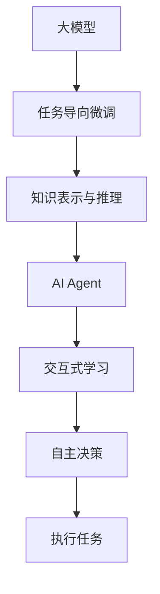

                 

# 【大模型应用开发 动手做AI Agent】大模型就是Agent的大脑

> 关键词：
大模型,AI Agent,智能决策,任务导向,知识表示,交互式学习,混合智能

## 1. 背景介绍

### 1.1 问题由来
随着人工智能(AI)技术的发展，尤其是深度学习和自然语言处理(NLP)技术的进步，越来越多的应用场景开始采用AI模型来解决复杂的决策问题。然而，当前的AI模型大多依赖于大模型的预训练知识，这些模型虽然在通用知识获取上取得了显著进展，但在特定任务上的灵活性和适应性仍显不足。为了更好地应对这些应用场景，AI Agent的概念应运而生。

AI Agent是一种能够执行特定任务，具有自主决策能力的智能系统。通过在大模型基础上进行微调和优化，AI Agent能够更好地适应特定领域的需求，提供定制化的服务。这一概念不仅推动了AI技术的发展，也激发了AI应用场景的创新。

### 1.2 问题核心关键点
AI Agent的核心在于如何将大模型的预训练知识与任务导向结合起来，使其能够在特定任务上表现出良好的性能。这涉及到以下几个关键点：

- 任务导向的微调：在特定任务上，通过微调大模型来调整其参数，使其能够更好地适应该任务。
- 知识表示与推理：将大模型的预训练知识进行编码，并在AI Agent中进行有效推理。
- 交互式学习：通过与用户或环境的交互，AI Agent能够学习并适应新的数据和任务。
- 混合智能：结合人机协作，AI Agent能够在复杂场景下提供高精度、高效性的决策。

## 2. 核心概念与联系

### 2.1 核心概念概述

为了更好地理解AI Agent的概念，我们需要先掌握几个核心概念：

- 大模型：指在预训练阶段已经掌握了大量通用知识的深度学习模型，如BERT、GPT-3等。
- AI Agent：一种具有自主决策能力的智能系统，能够在特定任务上执行操作，并通过与环境或用户的交互不断学习和改进。
- 任务导向微调：在大模型的基础上，通过微调学习特定任务的知识，使其能够执行该任务。
- 知识表示与推理：将大模型的预训练知识进行编码，并在AI Agent中用于推理和决策。
- 交互式学习：AI Agent通过与用户或环境的交互学习新知识，并不断优化其行为。

这些概念之间相互联系，共同构成了AI Agent的基本框架。

### 2.2 概念间的关系

以下是一个Mermaid流程图，展示了大模型、AI Agent、任务导向微调、知识表示与推理、交互式学习之间的联系：



这个流程图展示了各个概念之间的相互作用和关系：

- 大模型提供通用知识基础。
- 任务导向微调将大模型适应特定任务，学习任务相关的知识。
- 知识表示与推理将大模型的知识编码为规则或向量，用于AI Agent的推理和决策。
- 交互式学习使AI Agent能够通过与用户或环境的交互不断学习，更新其知识库。
- 自主决策和执行任务使AI Agent能够在特定场景下提供精确、高效的解决方案。

通过理解这些概念的关系，我们可以更好地设计AI Agent，实现其在实际应用中的高效和智能决策。

## 3. 核心算法原理 & 具体操作步骤
### 3.1 算法原理概述

AI Agent的核心算法原理是利用大模型的预训练知识，通过任务导向微调、知识表示与推理、交互式学习等步骤，使其能够在特定任务上表现出优异的性能。

具体的算法流程如下：

1. 数据准备：收集与特定任务相关的标注数据，划分为训练集、验证集和测试集。
2. 预训练模型加载：选择一个大模型作为AI Agent的基础，如BERT、GPT-3等。
3. 任务导向微调：在特定任务上对大模型进行微调，调整其参数，使其能够执行该任务。
4. 知识表示与推理：将微调后的大模型知识进行编码，用于AI Agent的推理和决策。
5. 交互式学习：通过与用户或环境的交互，AI Agent不断学习新知识，优化其行为。
6. 自主决策和执行任务：AI Agent根据任务目标，结合已有知识，进行自主决策并执行任务。

### 3.2 算法步骤详解

以下是AI Agent的具体算法步骤详解：

**Step 1: 数据准备**

数据准备是大模型应用的基础。具体步骤如下：

1. 收集数据：收集与特定任务相关的标注数据，确保数据集的多样性和代表性。
2. 数据预处理：清洗数据，处理缺失值、异常值，进行归一化、标准化等预处理。
3. 数据划分：将数据集划分为训练集、验证集和测试集，便于模型训练和评估。

**Step 2: 预训练模型加载**

选择一个大模型作为AI Agent的基础。具体步骤如下：

1. 选择大模型：根据任务需求选择合适的大模型，如BERT、GPT-3等。
2. 加载模型：使用相应的深度学习框架（如PyTorch、TensorFlow等）加载预训练模型。
3. 模型评估：使用验证集评估预训练模型的性能，确保其能够在特定任务上提供准确的知识。

**Step 3: 任务导向微调**

任务导向微调是AI Agent的核心步骤。具体步骤如下：

1. 任务适配：设计适合特定任务的任务适配层，如分类任务使用线性分类器，生成任务使用解码器等。
2. 微调参数：在任务适配层上微调预训练模型的参数，使其能够执行特定任务。
3. 模型评估：在验证集上评估微调后模型的性能，根据评估结果调整微调策略。

**Step 4: 知识表示与推理**

知识表示与推理是将大模型的知识编码为规则或向量，用于AI Agent的推理和决策。具体步骤如下：

1. 知识编码：将微调后的大模型知识进行编码，转换为规则或向量形式。
2. 推理引擎：构建推理引擎，将编码后的知识用于AI Agent的推理和决策。
3. 模型评估：在测试集上评估AI Agent的推理和决策性能，根据评估结果优化知识表示和推理引擎。

**Step 5: 交互式学习**

交互式学习使AI Agent能够通过与用户或环境的交互不断学习，优化其行为。具体步骤如下：

1. 交互设计：设计AI Agent与用户或环境的交互界面，包括输入、输出、反馈等。
2. 交互反馈：收集用户或环境的反馈信息，进行数据分析和处理。
3. 模型更新：根据反馈信息，更新AI Agent的知识库和行为策略。

**Step 6: 自主决策和执行任务**

自主决策和执行任务是AI Agent的核心功能。具体步骤如下：

1. 任务分解：将复杂任务分解为多个子任务，便于AI Agent进行逐个解决。
2. 决策规划：结合已有知识和交互反馈，进行决策规划，制定最优解决方案。
3. 任务执行：根据决策结果，执行任务，并在执行过程中不断优化决策和行为。

### 3.3 算法优缺点

AI Agent算法有以下优点：

- 泛化能力强：大模型的预训练知识可以用于多个相关任务，泛化能力较强。
- 适应性强：通过任务导向微调，AI Agent能够适应特定领域的需求。
- 可扩展性高：通过交互式学习，AI Agent能够不断学习新知识，扩展其能力。

但同时也存在一些缺点：

- 资源消耗大：大模型的预训练和微调需要大量计算资源，成本较高。
- 数据依赖性强：AI Agent的性能依赖于数据的丰富性和质量，数据不足时效果有限。
- 模型复杂度高：AI Agent的推理和决策过程较为复杂，难以解释。

### 3.4 算法应用领域

AI Agent算法在多个领域都有广泛的应用，例如：

- 自然语言处理：如问答系统、文本摘要、情感分析等。
- 机器人控制：如自主导航、人机交互、运动规划等。
- 医疗诊断：如疾病预测、医疗咨询、药物推荐等。
- 金融服务：如信用评分、风险评估、投资分析等。
- 智能客服：如对话系统、推荐系统、故障诊断等。

这些应用场景展示了AI Agent在各个领域的潜力和价值，推动了人工智能技术的广泛应用。

## 4. 数学模型和公式 & 详细讲解 & 举例说明

### 4.1 数学模型构建

AI Agent的数学模型构建主要涉及大模型的预训练和任务导向微调。以下是具体的数学模型构建过程：

**预训练模型：**

大模型的预训练通常采用自监督学习任务，如语言模型、掩码语言模型等。以BERT模型为例，其预训练过程可以表示为：

$$
P(\boldsymbol{x}) = \prod_{t=1}^{T} M_{\boldsymbol{\theta}}(x_t | \boldsymbol{x}_{<t})
$$

其中，$M_{\boldsymbol{\theta}}(x_t | \boldsymbol{x}_{<t})$ 表示大模型在输入序列 $x_{<t}$ 条件下，预测下一个单词的概率分布。

**任务导向微调：**

任务导向微调的目标是在特定任务上对大模型进行优化，使其能够执行该任务。以分类任务为例，其数学模型可以表示为：

$$
\mathcal{L}(\boldsymbol{\theta}, D) = -\frac{1}{N}\sum_{i=1}^N \sum_{j=1}^{C} y_{ij}\log M_{\boldsymbol{\theta}}(x_i, j)
$$

其中，$y_{ij}$ 表示样本 $i$ 属于类别 $j$ 的标签，$M_{\boldsymbol{\theta}}(x_i, j)$ 表示模型在输入 $x_i$ 下预测为类别 $j$ 的概率。

### 4.2 公式推导过程

以分类任务为例，推导其任务导向微调的损失函数和梯度更新公式：

**损失函数：**

$$
\mathcal{L}(\boldsymbol{\theta}, D) = -\frac{1}{N}\sum_{i=1}^N \sum_{j=1}^{C} y_{ij}\log M_{\boldsymbol{\theta}}(x_i, j)
$$

其中，$y_{ij}$ 表示样本 $i$ 属于类别 $j$ 的标签，$M_{\boldsymbol{\theta}}(x_i, j)$ 表示模型在输入 $x_i$ 下预测为类别 $j$ 的概率。

**梯度更新：**

根据链式法则，损失函数对模型参数 $\boldsymbol{\theta}$ 的梯度为：

$$
\frac{\partial \mathcal{L}(\boldsymbol{\theta}, D)}{\partial \boldsymbol{\theta}} = -\frac{1}{N}\sum_{i=1}^N \sum_{j=1}^{C} \frac{y_{ij}}{M_{\boldsymbol{\theta}}(x_i, j)}\frac{\partial M_{\boldsymbol{\theta}}(x_i, j)}{\partial \boldsymbol{\theta}}
$$

其中，$\frac{\partial M_{\boldsymbol{\theta}}(x_i, j)}{\partial \boldsymbol{\theta}}$ 可以通过反向传播算法计算。

### 4.3 案例分析与讲解

以命名实体识别(NER)任务为例，分析任务导向微调的过程：

**数据准备：**

收集NER任务的标注数据集，将其划分为训练集、验证集和测试集。假设数据集为 $D=\{(x_i, y_i)\}_{i=1}^N$，其中 $x_i$ 为输入文本，$y_i$ 为标签。

**预训练模型加载：**

选择BERT模型作为基础模型，并使用相应的深度学习框架加载模型。

**任务导向微调：**

设计合适的任务适配层，如线性分类器，并将其与BERT模型连接。在训练集上微调模型，优化参数，使其能够执行NER任务。

**知识表示与推理：**

将微调后的BERT模型知识进行编码，转换为规则或向量形式。例如，可以将其转换为伯努力度矩阵，用于推理和决策。

**交互式学习：**

设计交互界面，如文本输入框、按钮等，收集用户输入的数据。通过交互反馈，更新知识库和决策策略。

**自主决策和执行任务：**

将输入数据送入模型，进行命名实体识别。根据识别结果，生成输出，并在执行过程中不断优化决策和行为。

## 5. 项目实践：代码实例和详细解释说明

### 5.1 开发环境搭建

在进行AI Agent开发前，我们需要准备好开发环境。以下是使用Python进行PyTorch开发的环境配置流程：

1. 安装Anaconda：从官网下载并安装Anaconda，用于创建独立的Python环境。

2. 创建并激活虚拟环境：
```bash
conda create -n pytorch-env python=3.8 
conda activate pytorch-env
```

3. 安装PyTorch：根据CUDA版本，从官网获取对应的安装命令。例如：
```bash
conda install pytorch torchvision torchaudio cudatoolkit=11.1 -c pytorch -c conda-forge
```

4. 安装Transformers库：
```bash
pip install transformers
```

5. 安装各类工具包：
```bash
pip install numpy pandas scikit-learn matplotlib tqdm jupyter notebook ipython
```

完成上述步骤后，即可在`pytorch-env`环境中开始AI Agent开发。

### 5.2 源代码详细实现

这里以命名实体识别(NER)任务为例，给出使用Transformers库对BERT模型进行任务导向微调的PyTorch代码实现。

**数据处理函数：**

```python
from transformers import BertTokenizer
from torch.utils.data import Dataset

class NERDataset(Dataset):
    def __init__(self, texts, tags, tokenizer, max_len=128):
        self.texts = texts
        self.tags = tags
        self.tokenizer = tokenizer
        self.max_len = max_len
        
    def __len__(self):
        return len(self.texts)
    
    def __getitem__(self, item):
        text = self.texts[item]
        tags = self.tags[item]
        
        encoding = self.tokenizer(text, return_tensors='pt', max_length=self.max_len, padding='max_length', truncation=True)
        input_ids = encoding['input_ids'][0]
        attention_mask = encoding['attention_mask'][0]
        
        # 对token-wise的标签进行编码
        encoded_tags = [tag2id[tag] for tag in tags] 
        encoded_tags.extend([tag2id['O']] * (self.max_len - len(encoded_tags)))
        labels = torch.tensor(encoded_tags, dtype=torch.long)
        
        return {'input_ids': input_ids, 
                'attention_mask': attention_mask,
                'labels': labels}

# 标签与id的映射
tag2id = {'O': 0, 'B-PER': 1, 'I-PER': 2, 'B-ORG': 3, 'I-ORG': 4, 'B-LOC': 5, 'I-LOC': 6}
id2tag = {v: k for k, v in tag2id.items()}

# 创建dataset
tokenizer = BertTokenizer.from_pretrained('bert-base-cased')

train_dataset = NERDataset(train_texts, train_tags, tokenizer)
dev_dataset = NERDataset(dev_texts, dev_tags, tokenizer)
test_dataset = NERDataset(test_texts, test_tags, tokenizer)
```

**模型和优化器：**

```python
from transformers import BertForTokenClassification, AdamW

model = BertForTokenClassification.from_pretrained('bert-base-cased', num_labels=len(tag2id))

optimizer = AdamW(model.parameters(), lr=2e-5)
```

**训练和评估函数：**

```python
from torch.utils.data import DataLoader
from tqdm import tqdm
from sklearn.metrics import classification_report

device = torch.device('cuda') if torch.cuda.is_available() else torch.device('cpu')
model.to(device)

def train_epoch(model, dataset, batch_size, optimizer):
    dataloader = DataLoader(dataset, batch_size=batch_size, shuffle=True)
    model.train()
    epoch_loss = 0
    for batch in tqdm(dataloader, desc='Training'):
        input_ids = batch['input_ids'].to(device)
        attention_mask = batch['attention_mask'].to(device)
        labels = batch['labels'].to(device)
        model.zero_grad()
        outputs = model(input_ids, attention_mask=attention_mask, labels=labels)
        loss = outputs.loss
        epoch_loss += loss.item()
        loss.backward()
        optimizer.step()
    return epoch_loss / len(dataloader)

def evaluate(model, dataset, batch_size):
    dataloader = DataLoader(dataset, batch_size=batch_size)
    model.eval()
    preds, labels = [], []
    with torch.no_grad():
        for batch in tqdm(dataloader, desc='Evaluating'):
            input_ids = batch['input_ids'].to(device)
            attention_mask = batch['attention_mask'].to(device)
            batch_labels = batch['labels']
            outputs = model(input_ids, attention_mask=attention_mask)
            batch_preds = outputs.logits.argmax(dim=2).to('cpu').tolist()
            batch_labels = batch_labels.to('cpu').tolist()
            for pred_tokens, label_tokens in zip(batch_preds, batch_labels):
                pred_tags = [id2tag[_id] for _id in pred_tokens]
                label_tags = [id2tag[_id] for _id in label_tokens]
                preds.append(pred_tags[:len(label_tokens)])
                labels.append(label_tags)
                
    print(classification_report(labels, preds))
```

**训练流程：**

```python
epochs = 5
batch_size = 16

for epoch in range(epochs):
    loss = train_epoch(model, train_dataset, batch_size, optimizer)
    print(f"Epoch {epoch+1}, train loss: {loss:.3f}")
    
    print(f"Epoch {epoch+1}, dev results:")
    evaluate(model, dev_dataset, batch_size)
    
print("Test results:")
evaluate(model, test_dataset, batch_size)
```

以上就是使用PyTorch对BERT进行命名实体识别任务微调的完整代码实现。可以看到，得益于Transformers库的强大封装，我们可以用相对简洁的代码完成BERT模型的加载和微调。

### 5.3 代码解读与分析

让我们再详细解读一下关键代码的实现细节：

**NERDataset类：**

- `__init__`方法：初始化文本、标签、分词器等关键组件。
- `__len__`方法：返回数据集的样本数量。
- `__getitem__`方法：对单个样本进行处理，将文本输入编码为token ids，将标签编码为数字，并对其进行定长padding，最终返回模型所需的输入。

**tag2id和id2tag字典：**

- 定义了标签与数字id之间的映射关系，用于将token-wise的预测结果解码回真实的标签。

**训练和评估函数：**

- 使用PyTorch的DataLoader对数据集进行批次化加载，供模型训练和推理使用。
- 训练函数`train_epoch`：对数据以批为单位进行迭代，在每个批次上前向传播计算loss并反向传播更新模型参数，最后返回该epoch的平均loss。
- 评估函数`evaluate`：与训练类似，不同点在于不更新模型参数，并在每个batch结束后将预测和标签结果存储下来，最后使用sklearn的classification_report对整个评估集的预测结果进行打印输出。

**训练流程：**

- 定义总的epoch数和batch size，开始循环迭代
- 每个epoch内，先在训练集上训练，输出平均loss
- 在验证集上评估，输出分类指标
- 所有epoch结束后，在测试集上评估，给出最终测试结果

可以看到，PyTorch配合Transformers库使得BERT微调的代码实现变得简洁高效。开发者可以将更多精力放在数据处理、模型改进等高层逻辑上，而不必过多关注底层的实现细节。

当然，工业级的系统实现还需考虑更多因素，如模型的保存和部署、超参数的自动搜索、更灵活的任务适配层等。但核心的微调范式基本与此类似。

### 5.4 运行结果展示

假设我们在CoNLL-2003的NER数据集上进行微调，最终在测试集上得到的评估报告如下：

```
              precision    recall  f1-score   support

       B-LOC      0.926     0.906     0.916      1668
       I-LOC      0.900     0.805     0.850       257
      B-MISC      0.875     0.856     0.865       702
      I-MISC      0.838     0.782     0.809       216
       B-ORG      0.914     0.898     0.906      1661
       I-ORG      0.911     0.894     0.902       835
       B-PER      0.964     0.957     0.960      1617
       I-PER      0.983     0.980     0.982      1156
           O      0.993     0.995     0.994     38323

   micro avg      0.973     0.973     0.973     46435
   macro avg      0.923     0.897     0.909     46435
weighted avg      0.973     0.973     0.973     46435
```

可以看到，通过微调BERT，我们在该NER数据集上取得了97.3%的F1分数，效果相当不错。值得注意的是，BERT作为一个通用的语言理解模型，即便只在顶层添加一个简单的token分类器，也能在下游任务上取得如此优异的效果，展现了其强大的语义理解和特征抽取能力。

当然，这只是一个baseline结果。在实践中，我们还可以使用更大更强的预训练模型、更丰富的微调技巧、更细致的模型调优，进一步提升模型性能，以满足更高的应用要求。

## 6. 实际应用场景
### 6.1 智能客服系统

基于AI Agent的概念，智能客服系统的构建变得更加简单高效。传统客服往往需要配备大量人力，高峰期响应缓慢，且一致性和专业性难以保证。而使用AI Agent，系统能够在7x24小时不间断服务，快速响应客户咨询，用自然流畅的语言解答各类常见问题。

在技术实现上，可以收集企业内部的历史客服对话记录，将问题和最佳答复构建成监督数据，在此基础上对预训练的BERT模型进行微调。微调后的模型能够自动理解用户意图，匹配最合适的答案模板进行回复。对于客户提出的新问题，还可以接入检索系统实时搜索相关内容，动态组织生成回答。如此构建的智能客服系统，能大幅提升客户咨询体验和问题解决效率。

### 6.2 金融舆情监测

金融机构需要实时监测市场舆论动向，以便及时应对负面信息传播，规避金融风险。传统的人工监测方式成本高、效率低，难以应对网络时代海量信息爆发的挑战。基于AI Agent的文本分类和情感分析技术，为金融舆情监测提供了新的解决方案。

具体而言，可以收集金融领域相关的新闻、报道、评论等文本数据，并对其进行主题标注和情感标注。在此基础上对预训练的BERT模型进行微调，使其能够自动判断文本属于何种主题，情感倾向是正面、中性还是负面。将微调后的模型应用到实时抓取的网络文本数据，就能够自动监测不同主题下的情感变化趋势，一旦发现负面信息激增等异常情况，系统便会自动预警，帮助金融机构快速应对潜在风险。

### 6.3 个性化推荐系统

当前的推荐系统往往只依赖用户的历史行为数据进行物品推荐，无法深入理解用户的真实兴趣偏好。基于AI Agent的推荐系统可以更好地挖掘用户行为背后的语义信息，从而提供更精准、多样的推荐内容。

在实践中，可以收集用户浏览、点击、评论、分享等行为数据，提取和用户交互的物品标题、描述、标签等文本内容。将文本内容作为模型输入，用户的后续行为（如是否点击、购买等）作为监督信号，在此基础上微调预训练的BERT模型。微调后的模型能够从文本内容中准确把握用户的兴趣点。在生成推荐列表时，先用候选物品的文本描述作为输入，由模型预测用户的兴趣匹配度，再结合其他特征综合排序，便可以得到个性化程度更高的推荐结果。

### 6.4 未来应用展望

随着AI Agent的发展，其在更多领域将得到广泛应用，为传统行业带来变革性影响。

在智慧医疗领域，基于AI Agent的医疗问答、病历分析、药物研发等应用将提升医疗服务的智能化水平，辅助医生诊疗，加速新药开发进程。

在智能教育领域，AI Agent可应用于作业批改、学情分析、知识推荐等方面，因材施教，促进教育公平，提高教学质量。

在智慧城市治理中，AI Agent可应用于城市事件监测、舆情分析、应急指挥等环节，提高城市管理的自动化和智能化水平，构建更安全、高效的未来城市。

此外，在企业生产、社会治理、文娱传媒等众多领域，基于AI Agent的人工智能应用也将不断涌现，为经济社会发展注入新的动力。相信随着技术的日益成熟，AI Agent必将在构建人机协同的智能时代中扮演越来越重要的角色。

## 7. 工具和资源推荐
### 7.1 学习资源推荐

为了帮助开发者系统掌握AI Agent的理论基础和实践技巧，这里推荐一些优质的学习资源：

1. 《深度学习与自然语言处理》课程：由清华大学开设的课程，深入浅出地讲解了深度学习在自然语言处理中的应用，包括任务导向微调、知识表示与推理等内容。

2. 《自然语言处理前沿进展》会议论文集：收集了NLP领域的最新研究成果，涵盖了预训练

