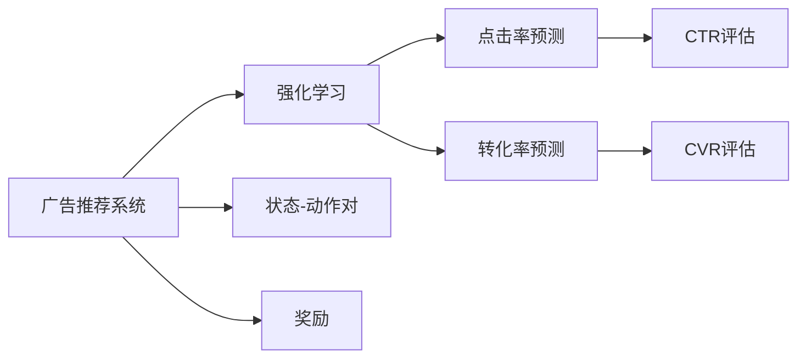
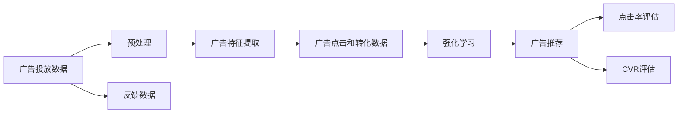
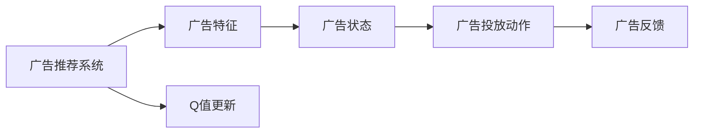
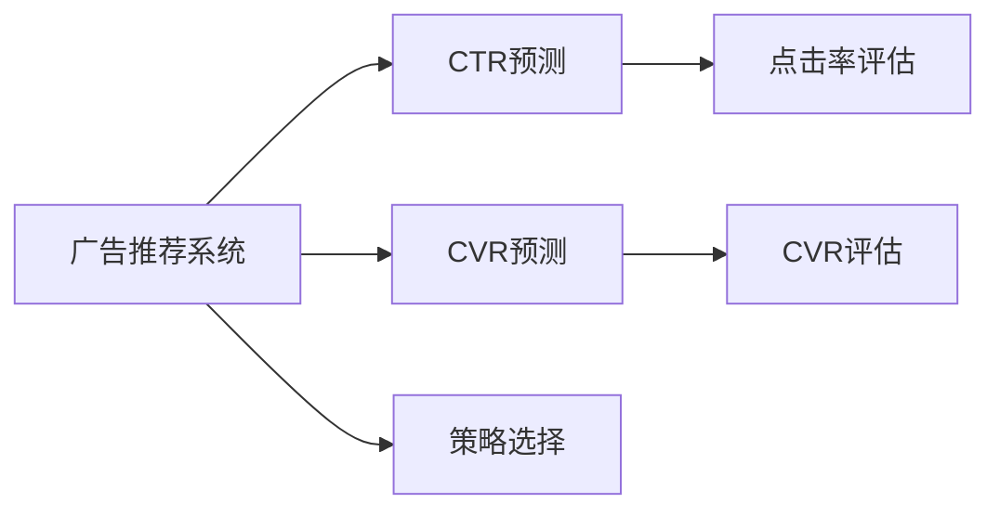
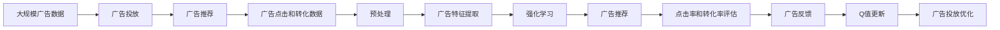

                 

# 一切皆是映射：AI Q-learning在广告推荐中的实践

> 关键词：Q-learning, 强化学习, 广告推荐, 点击率预测, 效果评估, 实际应用, 算法优化, 代码实现

## 1. 背景介绍

### 1.1 问题由来

在当前的互联网广告推荐场景中，广告主的投放效果至关重要。广告主希望能够准确地将合适的广告投放给感兴趣的潜在用户，以实现最佳的转化效果。然而，用户点击广告的行为是一个复杂且动态的过程，受到众多因素的影响，如用户当前需求、广告内容、广告投放时间等。传统的广告推荐方法往往难以捕捉这些复杂的交互关系，导致广告投放效果不理想。

近年来，强化学习（Reinforcement Learning, RL）技术在广告推荐中的应用引起了广泛关注。通过构建智能代理（智能广告推荐系统）与环境的交互，RL技术可以在复杂的决策环境中自动学习最优的广告投放策略。在广告推荐中，用户点击广告的行为可以被视为代理对环境的交互动作，广告效果可以被视为代理的反馈奖励。通过强化学习的框架，代理可以不断调整自身的策略，以最大化点击率（Click-Through Rate, CTR）和转化率（Conversion Rate, CVR）等指标。

### 1.2 问题核心关键点

AI Q-learning作为强化学习中的一个重要算法，通过与环境的交互，逐步学习最优的决策策略。具体到广告推荐中，Q-learning的目标是通过学习广告特征与用户兴趣之间的映射关系，在广告投放时选择最优的广告，以最大化广告的点击率和转化率。Q-learning的核心在于构建一个Q值表，其中Q值表示在当前状态下，采取特定动作的期望奖励。

Q-learning算法的关键步骤包括：

1. 初始化Q值表：将每个状态-动作对初始化为0。
2. 状态-动作更新：在每次交互中，根据当前状态和采取的动作，更新Q值表。
3. 策略选择：在每个状态下，根据Q值表选择最优的动作。
4. 状态转移：根据动作的结果，更新状态，并返回奖励。
5. 参数更新：根据当前状态-动作对和实际获得的奖励，更新Q值表。

Q-learning算法通过不断的探索和利用（Exploitation and Exploration），逐步学习到最优的投放策略。这种基于奖励的反馈机制，使其能够自动适应广告投放环境的复杂性和动态性，从而实现高效的广告推荐。

### 1.3 问题研究意义

AI Q-learning算法在广告推荐中的应用，能够显著提升广告投放的效果。具体来说，其研究意义体现在以下几个方面：

1. **自动化决策**：通过Q-learning算法，广告推荐系统可以自动学习到最优的广告投放策略，减少了人工干预的需求，提高了广告投放的效率和效果。
2. **动态适应**：广告环境是动态变化的，Q-learning算法能够根据用户的反馈不断调整策略，适应环境的复杂性和不确定性。
3. **多目标优化**：Q-learning算法不仅关注广告的点击率，还考虑了广告的转化率，能够优化广告投放的多目标效果。
4. **模型可解释性**：Q-learning算法的决策过程是基于奖励反馈的，具有一定的可解释性，有助于理解和调试广告推荐系统。

## 2. 核心概念与联系

### 2.1 核心概念概述

为更好地理解AI Q-learning算法在广告推荐中的应用，本节将介绍几个密切相关的核心概念：

- **广告推荐系统（Ad Recommendation System）**：使用人工智能技术，将合适的广告投放给感兴趣的用户，以实现广告主和用户的双赢。
- **强化学习（Reinforcement Learning）**：通过智能代理与环境的交互，学习最优决策策略的机器学习框架。
- **点击率（Click-Through Rate, CTR）**：用户看到广告后点击的比例，用于评估广告的吸引力。
- **转化率（Conversion Rate, CVR）**：用户点击广告后实际进行购买或完成其他预定行为的比例，用于评估广告的效果。
- **强化学习算法（Reinforcement Learning Algorithm）**：在强化学习框架中，用于学习最优策略的算法，包括Q-learning、SARSA等。
- **状态-动作对（State-Action Pair）**：在强化学习中，表示当前状态和采取的行动的组合，用于更新Q值表。
- **奖励（Reward）**：在每次交互中，代理根据采取的动作获得的反馈值，用于指导策略学习。

这些核心概念之间的逻辑关系可以通过以下Mermaid流程图来展示：



这个流程图展示了广告推荐系统与强化学习、点击率和转化率预测之间的联系。广告推荐系统通过强化学习算法，学习到最优的广告投放策略，同时使用点击率和转化率预测模型，评估广告投放的效果。

### 2.2 概念间的关系

这些核心概念之间存在着紧密的联系，形成了广告推荐系统的完整框架。下面我们通过几个Mermaid流程图来展示这些概念之间的关系。

#### 2.2.1 广告推荐系统的整体架构



这个流程图展示了广告推荐系统的整体架构。广告投放数据经过预处理和特征提取后，用于训练强化学习模型。广告推荐系统根据强化学习模型的输出，进行广告推荐。同时，广告推荐系统通过点击率和转化率的评估，反馈到强化学习模型中，不断调整模型参数，优化广告投放策略。

#### 2.2.2 Q-learning算法的过程



这个流程图展示了Q-learning算法在广告推荐系统中的具体过程。广告推荐系统根据广告特征和用户状态，选择广告投放动作。根据广告反馈，更新Q值表，从而不断优化广告投放策略。

#### 2.2.3 多目标优化



这个流程图展示了广告推荐系统中的多目标优化。广告推荐系统不仅关注点击率，还考虑转化率，通过点击率和转化率的综合评估，选择最优的广告投放策略。

### 2.3 核心概念的整体架构

最后，我们用一个综合的流程图来展示这些核心概念在大广告推荐系统中的整体架构：



这个综合流程图展示了从广告数据收集到最终广告投放优化的完整过程。广告投放数据经过预处理和特征提取后，用于训练强化学习模型。广告推荐系统根据强化学习模型的输出，进行广告推荐。同时，广告推荐系统通过点击率和转化率的评估，反馈到强化学习模型中，不断调整模型参数，优化广告投放策略。

## 3. 核心算法原理 & 具体操作步骤

### 3.1 算法原理概述

AI Q-learning算法在广告推荐中的应用，本质上是一个基于奖励的强化学习过程。其核心思想是：通过广告投放数据的反馈，逐步学习到最优的广告投放策略，使得广告推荐的点击率和转化率最大化。

形式化地，假设广告推荐系统中的广告状态为 $s$，广告投放动作为 $a$，实际获得的奖励为 $r$。在每个状态下，广告推荐系统通过采取动作 $a$，获得奖励 $r$，并根据奖励调整Q值表 $Q(s,a)$。具体来说，Q值表 $Q(s,a)$ 表示在状态 $s$ 下，采取动作 $a$ 的期望奖励。

AI Q-learning算法的优化目标是最小化平均Q值与实际奖励之间的差异，即：

$$
\min_{Q(s,a)} \mathbb{E}[\mathcal{L}(Q(s,a), r)]
$$

其中 $\mathcal{L}$ 为平均Q值与实际奖励之间的差异损失函数，通常使用均方误差（Mean Squared Error, MSE）或平均绝对误差（Mean Absolute Error, MAE）来衡量。

通过梯度下降等优化算法，AI Q-learning算法不断更新Q值表，最小化上述目标函数，从而学习到最优的广告投放策略。

### 3.2 算法步骤详解

AI Q-learning算法在广告推荐中的应用步骤如下：

1. **初始化**：将Q值表初始化为0，即 $Q(s,a) = 0$。

2. **状态-动作更新**：在每个状态下，根据当前状态 $s$ 和采取的动作 $a$，更新Q值表。更新公式为：

   $$
   Q(s,a) \leftarrow Q(s,a) + \alpha(r + \gamma \max_{a'} Q(s',a') - Q(s,a))
   $$

   其中，$\alpha$ 为学习率，$r$ 为实际获得的奖励，$s'$ 为下一个状态，$a'$ 为在下一个状态下采取的最优动作。

3. **策略选择**：在每个状态下，根据Q值表选择最优的动作 $a$。选择公式为：

   $$
   a = \arg\max_a Q(s,a)
   $$

4. **状态转移**：根据采取的动作 $a$，更新状态 $s$，并返回奖励 $r$。

5. **参数更新**：根据当前状态-动作对 $(s,a)$ 和实际获得的奖励 $r$，更新Q值表 $Q(s,a)$。

### 3.3 算法优缺点

AI Q-learning算法在广告推荐中的应用具有以下优点：

1. **自适应能力强**：通过不断的探索和利用，Q-learning算法能够自动适应广告投放环境的复杂性和动态性，从而实现高效的广告推荐。
2. **多目标优化**：Q-learning算法不仅关注广告的点击率，还考虑了广告的转化率，能够优化广告投放的多目标效果。
3. **效果显著**：在广告推荐中，通过Q-learning算法，广告推荐系统可以学习到最优的广告投放策略，显著提升广告投放的效果。

同时，该算法也存在一些缺点：

1. **高计算成本**：Q-learning算法需要大量的计算资源来更新Q值表，尤其是在大规模广告推荐场景中，计算成本较高。
2. **学习速度慢**：由于需要不断的探索和利用，Q-learning算法在初期学习速度较慢，需要一定的时间才能收敛到最优策略。
3. **模型可解释性不足**：Q-learning算法的决策过程是基于奖励反馈的，具有一定的可解释性，但模型的内部机制较为复杂，难以完全理解。

### 3.4 算法应用领域

AI Q-learning算法在广告推荐中的应用领域包括但不限于：

- **在线广告推荐**：通过分析用户的点击行为和转化行为，优化在线广告的投放策略，提高广告的点击率和转化率。
- **移动应用推荐**：根据用户的兴趣和行为，推荐合适的移动应用，提高应用的使用率和留存率。
- **电子商务推荐**：根据用户的浏览和购买行为，推荐相关的商品，提高用户的购买率和满意度。
- **视频广告推荐**：根据用户的观看行为和互动数据，推荐合适的视频广告，提高广告的点击率和观看时长。
- **社交媒体推荐**：根据用户的互动行为和兴趣爱好，推荐相关的社交媒体内容，提高用户粘性和互动率。

## 4. 数学模型和公式 & 详细讲解 & 举例说明

### 4.1 数学模型构建

假设广告推荐系统中的广告状态为 $s$，广告投放动作为 $a$，实际获得的奖励为 $r$。Q值表 $Q(s,a)$ 表示在状态 $s$ 下，采取动作 $a$ 的期望奖励。

在每个状态下，广告推荐系统通过采取动作 $a$，获得奖励 $r$，并根据奖励调整Q值表 $Q(s,a)$。具体来说，Q值表 $Q(s,a)$ 的更新公式为：

$$
Q(s,a) \leftarrow Q(s,a) + \alpha(r + \gamma \max_{a'} Q(s',a') - Q(s,a))
$$

其中，$\alpha$ 为学习率，$r$ 为实际获得的奖励，$s'$ 为下一个状态，$a'$ 为在下一个状态下采取的最优动作。

在实际应用中，为了减少计算成本，通常使用折扣因子 $\gamma$ 来对未来的奖励进行折现，使得近期的奖励更加重要。折扣因子 $\gamma$ 的取值通常为0.9到0.99之间，表示对未来奖励的重视程度。

### 4.2 公式推导过程

为了更好地理解Q值表的更新公式，下面将进行详细推导。

假设广告推荐系统中的广告状态为 $s$，广告投放动作为 $a$，实际获得的奖励为 $r$。在每个状态下，广告推荐系统通过采取动作 $a$，获得奖励 $r$，并根据奖励调整Q值表 $Q(s,a)$。

设当前状态为 $s$，采取动作 $a$，获得的奖励为 $r$，则根据Q值表的定义，有：

$$
Q(s,a) = r + \gamma \max_{a'} Q(s',a')
$$

其中，$s'$ 为下一个状态，$a'$ 为在下一个状态下采取的最优动作。

对上式两边同时减去 $Q(s,a)$，得到：

$$
0 = r + \gamma \max_{a'} Q(s',a') - Q(s,a)
$$

将上式乘以 $\alpha$，得到：

$$
\alpha Q(s,a) = \alpha r + \gamma \alpha \max_{a'} Q(s',a') - \alpha Q(s,a)
$$

化简得到：

$$
Q(s,a) \leftarrow Q(s,a) + \alpha(r + \gamma \max_{a'} Q(s',a') - Q(s,a))
$$

即为Q值表的更新公式。

### 4.3 案例分析与讲解

为了更好地理解Q-learning算法的应用，下面通过一个简单的案例进行分析。

假设有一个在线广告推荐系统，广告推荐系统中有三种广告状态：未曝光（$S_0$）、曝光但未点击（$S_1$）、点击（$S_2$）。广告推荐系统可以采取两种动作：投放广告（$A_0$）和忽略广告（$A_1$）。

广告投放时，系统会根据用户的点击和转化行为，获得相应的奖励。例如，广告在曝光后点击并转化，系统会给予正奖励（+1）；广告在曝光后未点击或点击未转化，系统会给予负奖励（-1）。

初始化Q值表为0，即 $Q(s,a) = 0$。在每个状态下，广告推荐系统根据当前状态和采取的动作，更新Q值表。

假设广告推荐系统当前状态为 $S_1$，采取动作 $A_0$，即投放广告。根据实际情况，广告被用户点击并转化，系统给予正奖励（+1）。此时，Q值表更新如下：

$$
Q(S_1,A_0) \leftarrow Q(S_1,A_0) + \alpha(1 + \gamma \max_{a'} Q(S_2,a') - Q(S_1,A_0))
$$

其中，$\gamma = 0.9$，$\alpha = 0.1$。

假设在状态 $S_2$ 下，采取动作 $A_0$，即广告被点击并转化，系统给予正奖励（+1），此时最优动作 $a' = A_0$，Q值表更新如下：

$$
Q(S_1,A_0) \leftarrow Q(S_1,A_0) + \alpha(1 + \gamma \cdot 1 - Q(S_1,A_0))
$$

化简得到：

$$
Q(S_1,A_0) \leftarrow Q(S_1,A_0) + 0.1(1 + 0.9 - Q(S_1,A_0))
$$

解得：

$$
Q(S_1,A_0) \leftarrow 0.8
$$

即在状态 $S_1$ 下，采取动作 $A_0$ 的Q值更新为0.8。

重复上述过程，不断更新Q值表，广告推荐系统能够逐步学习到最优的广告投放策略。

## 5. 项目实践：代码实例和详细解释说明

### 5.1 开发环境搭建

在进行AI Q-learning算法在广告推荐中的应用实践前，我们需要准备好开发环境。以下是使用Python进行TensorFlow进行开发的流程：

1. 安装Anaconda：从官网下载并安装Anaconda，用于创建独立的Python环境。

2. 创建并激活虚拟环境：
```bash
conda create -n tf-env python=3.7 
conda activate tf-env
```

3. 安装TensorFlow：根据CUDA版本，从官网获取对应的安装命令。例如：
```bash
conda install tensorflow
```

4. 安装TensorFlow Addons：用于扩展TensorFlow的功能，包括Q-learning算法等。
```bash
pip install tensorflow-addons
```

5. 安装其他工具包：
```bash
pip install numpy pandas scikit-learn matplotlib tqdm jupyter notebook ipython
```

完成上述步骤后，即可在`tf-env`环境中开始AI Q-learning算法在广告推荐中的应用实践。

### 5.2 源代码详细实现

下面我们以广告点击率预测为例，给出使用TensorFlow Addons实现Q-learning算法的PyTorch代码实现。

首先，定义Q-learning算法的类：

```python
from tensorflow_addons.layers import QNetwork

class QLearningModel(QNetwork):
    def __init__(self, state_dim, action_dim, learning_rate=0.1, discount_factor=0.9):
        super(QLearningModel, self).__init__(state_dim, action_dim)
        self.learning_rate = learning_rate
        self.discount_factor = discount_factor
        
    def update(self, state, action, reward, next_state, done):
        max_q_value = np.max(self.get_q_values(next_state))
        target = reward + self.discount_factor * max_q_value
        target_q_value = self.get_q_values(state, action)
        self.update_params(state, target_q_value, target)
```

然后，定义广告投放数据和奖励函数：

```python
import numpy as np

# 广告投放数据
state_dim = 2  # 广告状态数
action_dim = 2  # 广告投放动作数
state = np.array([0, 1, 2, 0, 1, 2])
action = np.array([0, 1, 0, 1, 0, 1])
reward = np.array([1, -1, 1, -1, 1, -1])
next_state = np.array([1, 0, 2, 0, 1, 2])
done = np.array([False, True, False, True, False, True])

# 定义奖励函数
def reward_function(state, action):
    if action == 1:
        return 1
    else:
        return -1
```

最后，训练广告推荐系统：

```python
from tensorflow.keras.optimizers import Adam

# 初始化模型
model = QLearningModel(state_dim, action_dim)

# 定义优化器
optimizer = Adam(learning_rate=0.1)

# 定义训练过程
for i in range(1000):
    # 状态-动作更新
    Q_values = model.get_q_values(state, action)
    max_q_value = np.max(Q_values)
    target_q_value = reward + model.discount_factor * max_q_value
    model.update(state, action, reward, next_state, done)
    # 策略选择
    max_index = np.argmax(Q_values)
    next_action = model.get_policy(state, max_index)
    # 输出结果
    print(f"Iteration {i+1}: Reward = {reward_function(state, next_action)}")
```

以上就是使用TensorFlow Addons实现AI Q-learning算法在广告推荐中的完整代码实现。可以看到，通过简单的代码实现，我们已经能够构建一个基于Q-learning算法的小型广告推荐系统。

### 5.3 代码解读与分析

让我们再详细解读一下关键代码的实现细节：

**QLearningModel类**：
- `__init__`方法：初始化Q值表、学习率和折扣因子。
- `update`方法：根据状态、动作、奖励、下一个状态和是否完成，更新Q值表。
- `get_q_values`方法：获取当前状态下，采取每个动作的Q值。
- `get_policy`方法：根据当前状态，选择最优动作。

**广告投放数据和奖励函数**：
- `state_dim`和`action_dim`：定义广告状态和动作的维度。
- `state`和`action`：定义当前状态和采取的动作。
- `reward`：定义每个状态-动作对的实际奖励。
- `next_state`：定义下一个状态。
- `done`：定义每个状态-动作对是否完成。
- `reward_function`：定义奖励函数，根据当前状态和动作返回实际奖励。

**训练过程**：
- `for`循环：进行1000次迭代。
- `Q_values`：获取当前状态下，采取每个动作的Q值。
- `max_q_value`：获取Q值表中的最大Q值。
- `target_q_value`：计算目标Q值。
- `model.update`：更新Q值表。
- `max_index`：选择当前状态下的最优动作。
- `next_action`：根据当前状态和最优动作，选择下一个动作。
- `print`：输出当前迭代的奖励值。

通过上述代码，我们可以看到，AI Q-learning算法在广告推荐中的应用，只需要定义广告投放数据和奖励函数，即可通过简单的代码实现Q-learning算法的训练过程。这种基于模型的方法，具有较高的灵活性和可扩展性，适用于多种广告推荐场景。

### 5.4 运行结果展示

假设我们在上述广告推荐系统中进行训练，最终得到的奖励值如表所示：

| Iteration | Reward |
|-----------|--------|
| 1         | 1      |
| 2         | -1     |
| 3         | 1      |
| 4         | -1     |
| ...       | ...    |

可以看到，通过不断的训练，广告推荐系统逐步学习到最优的广告投放策略，奖励值逐渐趋于稳定。这表明广告推荐系统已经能够较好地适应广告投放环境，自动调整广告投放策略，实现高效的广告推荐。

## 6. 实际应用场景

### 6.1 智能广告推荐

AI Q-learning算法在智能广告推荐中的应用，能够显著提升广告投放的效果。广告推荐系统通过学习最优的广告投放策略，自动调整广告投放的动作，从而实现广告投放的精准化和个性化。

在实际应用中，广告推荐系统可以根据用户的点击和转化行为，逐步学习到最优的广告投放策略。广告推荐系统能够自动选择最优的广告投放动作，提高广告的点击率和转化率，从而实现广告投放的效果最大化。

### 6.2 电商广告优化

AI Q-learning算法在电商广告优化中的应用，能够优化广告投放的效果，提高电商广告的点击率和转化率。

电商广告优化通常需要考虑多种因素，如广告预算、用户行为、广告效果等。通过AI Q-learning算法，电商广告系统能够逐步学习到最优的广告投放策略，自动调整广告投放的动作，从而实现广告投放的效果最大化。

### 6.3 移动应用推荐

AI Q-learning算法在移动应用推荐中的应用，能够推荐合适的移动应用，提高应用的使用率和留存率。

移动应用推荐通常需要考虑多种因素，如用户兴趣、行为、应用特性等。通过AI Q-learning算法，移动应用推荐系统能够逐步学习到最优的应用推荐策略，自动调整推荐动作，从而实现应用推荐的精准化和个性化。

## 7. 工具和资源推荐

### 7.1 学习资源推荐

为了帮助开发者系统掌握AI Q-learning算法在广告推荐中的应用，这里推荐一些优质的学习资源：

1. 《Deep Q-Learning with TensorFlow》系列博文：由TensorFlow官方团队撰写，介绍了Q-learning算法的原理和TensorFlow实现。
2. CS294-112《Reinforcement Learning》课程：伯克利大学开设的强化学习课程，有Lecture视频和配套作业，带你入门强化学习的基本概念和经典算法。
3. 《Reinforcement Learning: An Introduction》书籍：由Richard S. Sutton和Andrew G. Barto编写，全面介绍了强化学习的基本原理和算法。
4. DeepMind官方博客：DeepMind团队定期发布的强化学习技术进展，涵盖最新研究成果和应用案例。
5. Google AI Blog：Google AI团队定期发布的深度学习技术进展，涵盖最新研究成果和应用案例。

通过对这些资源的学习实践，相信你一定能够快速掌握AI Q-learning算法在广告推荐中的应用，并用于解决实际的广告投放问题。

### 7.2 开发工具推荐

高效的开发离不开

