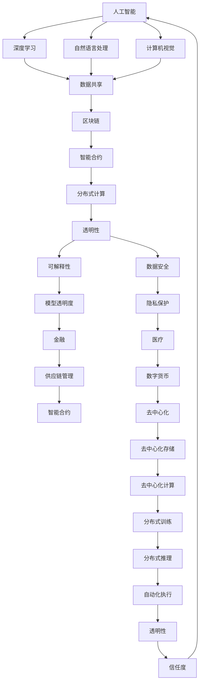

                 

## 1. 背景介绍

### 1.1 问题由来

在当前技术发展的背景下，人工智能（AI）和区块链（Blockchain）技术的融合成为一个备受关注的研究领域。AI技术的快速发展，尤其是在深度学习、自然语言处理、计算机视觉等领域的突破，为各行各业带来了新的机遇和挑战。而区块链技术的去中心化、不可篡改和透明性等特性，则为AI模型提供了更加安全、可靠和高效的数据存储和处理方式。

### 1.2 问题核心关键点

AI和区块链技术的融合主要集中在以下几个方面：

- **数据共享与隐私保护**：AI模型的训练需要大量数据，但这些数据往往包含敏感信息，如何在大数据集共享和隐私保护之间找到平衡，成为融合中的关键问题。
- **模型透明与可解释性**：AI模型的“黑箱”特性使其在金融、医疗等领域的应用受到质疑。区块链的透明性和可追溯性可以帮助提高模型的可解释性和信任度。
- **去中心化与分布式计算**：区块链的去中心化特性可以降低数据存储和处理的中心化风险，而分布式计算技术可以提高AI模型在多节点环境下的训练和推理效率。
- **智能合约与自动执行**：智能合约技术可以实现AI模型的自动化执行和监管，保证其在不同应用场景中的可靠性和安全性。

### 1.3 问题研究意义

AI和区块链技术的融合，可以带来以下几个方面的意义：

- **提高数据质量与效率**：通过区块链技术实现数据的去中心化存储和共享，可以显著提高数据质量和获取效率，为AI模型提供更加丰富的训练资源。
- **增强模型的透明度与信任度**：区块链的透明性和可追溯性特性，可以增强AI模型的透明度和可解释性，提升其在金融、医疗等关键领域的应用价值。
- **提升系统的安全性和可靠性**：区块链的去中心化特性可以降低数据中心化和存储的风险，智能合约技术可以实现模型的自动化执行和监管，提升系统的安全性和可靠性。
- **推动技术创新与应用**：AI和区块链技术的融合，可以催生更多创新的应用场景，如智能合约、去中心化预测市场等，推动技术在更多领域的落地和应用。

## 2. 核心概念与联系

### 2.1 核心概念概述

为更好地理解AI和区块链技术的融合，我们首先介绍几个关键概念：

- **人工智能（AI）**：一种模拟人类智能的技术，包括机器学习、深度学习、自然语言处理、计算机视觉等分支，用于解决复杂的决策和推理问题。
- **区块链（Blockchain）**：一种分布式账本技术，通过加密和共识机制保证数据的透明性、不可篡改性和去中心化存储，广泛用于数字货币、供应链管理、金融等场景。
- **智能合约（Smart Contracts）**：一种自动执行的合约，基于区块链技术的去中心化特性，能够实现自动化的业务逻辑和条件触发。
- **分布式计算（Distributed Computing）**：一种将计算任务分散到多个节点上并行处理的计算模型，提高系统的计算能力和鲁棒性。

这些核心概念之间存在着紧密的联系，通过区块链技术，AI模型可以实现更加高效的数据处理和分布式计算，提升系统的透明性和可解释性，增强数据的安全性和隐私保护。

### 2.2 概念间的关系

这些核心概念之间的关系可以通过以下Mermaid流程图来展示：



这个流程图展示了AI和区块链技术在多个层面的融合：

1. AI技术在大数据共享和分布式计算中的应用，提高了数据质量和处理效率。
2. 区块链技术的透明性和可追溯性，增强了AI模型的透明度和可解释性。
3. 智能合约技术的自动化执行，保证了AI模型的可靠性和安全性。
4. 区块链的去中心化特性，提升了数据安全和隐私保护。
5. 分布式计算技术，提高了系统的计算能力和鲁棒性。

## 3. 核心算法原理 & 具体操作步骤

### 3.1 算法原理概述

AI和区块链技术的融合，主要通过以下几个步骤实现：

1. **数据预处理与存储**：利用区块链的分布式存储特性，将AI模型所需的数据进行去中心化存储和共享。
2. **分布式计算**：通过分布式计算技术，将AI模型的训练和推理任务分散到多个节点上进行并行处理。
3. **智能合约与模型管理**：通过智能合约技术，实现AI模型的自动化执行和监管，保证其在不同应用场景中的可靠性。
4. **模型透明性与可解释性**：利用区块链的透明性和可追溯性特性，提高AI模型的透明度和可解释性。

### 3.2 算法步骤详解

以下是实现AI和区块链技术融合的具体操作步骤：

**Step 1: 数据预处理与存储**

1. **数据收集与标注**：收集与AI任务相关的数据，并进行标注，确保数据质量和多样性。
2. **数据分布式存储**：将数据存储到区块链网络中，利用区块链的去中心化特性，确保数据的安全性和透明性。
3. **数据共享与访问控制**：通过智能合约技术，控制数据的访问权限和共享范围，确保数据的隐私保护。

**Step 2: 分布式计算**

1. **任务划分与分发**：将AI模型的训练和推理任务划分为多个子任务，并随机分配到不同的计算节点上进行并行处理。
2. **节点间通信与同步**：利用分布式计算框架，如Apache Spark、TensorFlow等，实现节点间的通信和同步，保证计算任务的协调和一致性。
3. **模型参数同步**：通过区块链的共识机制，实现模型参数在多个节点之间的同步和更新，确保模型的一致性和可靠性。

**Step 3: 智能合约与模型管理**

1. **智能合约设计**：基于AI任务的特定需求，设计智能合约的逻辑和规则，确保模型在执行中的正确性和透明性。
2. **模型训练与优化**：利用智能合约技术，实现模型的自动化训练和优化，提高模型的性能和准确度。
3. **模型推理与执行**：通过智能合约技术，实现模型的自动化推理和执行，保证其在不同应用场景中的可靠性和安全性。

**Step 4: 模型透明性与可解释性**

1. **模型训练记录**：利用区块链的透明性和可追溯性特性，记录和存储AI模型的训练记录和参数变化，确保模型的透明度和可解释性。
2. **模型推理路径**：通过智能合约技术，记录和验证AI模型在推理过程中的每一步计算和决策，提高模型的可解释性。
3. **用户信任与反馈**：利用区块链的去中心化特性，允许用户对AI模型进行评价和反馈，增强模型的信任度和用户满意度。

### 3.3 算法优缺点

AI和区块链技术的融合具有以下优点：

1. **数据质量与效率提升**：利用区块链的分布式存储特性，可以显著提高数据质量和获取效率，为AI模型提供更加丰富的训练资源。
2. **模型透明度与信任度增强**：区块链的透明性和可追溯性特性，可以增强AI模型的透明度和可解释性，提升其在金融、医疗等关键领域的应用价值。
3. **系统安全性与可靠性提升**：区块链的去中心化特性可以降低数据中心化和存储的风险，智能合约技术可以实现模型的自动化执行和监管，提升系统的安全性和可靠性。
4. **创新应用场景增多**：AI和区块链技术的融合，可以催生更多创新的应用场景，如智能合约、去中心化预测市场等，推动技术在更多领域的落地和应用。

同时，AI和区块链技术的融合也存在一些缺点：

1. **技术复杂性增加**：AI和区块链技术的融合，需要跨学科的知识和技能，技术实现较为复杂。
2. **性能损失与延迟**：分布式计算和共识机制的引入，可能带来一定的性能损失和延迟，影响系统的响应速度。
3. **资源消耗与成本增加**：区块链的去中心化特性和智能合约技术，可能带来较高的资源消耗和成本投入。
4. **隐私保护与匿名性**：虽然区块链提供了数据隐私保护，但数据去中心化存储和共享仍存在一定风险。

### 3.4 算法应用领域

AI和区块链技术的融合在多个领域都有广泛的应用，例如：

- **金融领域**：利用区块链的去中心化特性和智能合约技术，实现自动化的金融服务，如去中心化借贷、智能合约保险等。
- **医疗领域**：利用区块链的透明性和可追溯性特性，实现医疗数据的共享和监管，提升医疗服务的质量和效率。
- **供应链管理**：利用区块链的透明性和不可篡改性，实现供应链各环节的数据共享和追踪，提升供应链的透明度和可靠性。
- **数字身份认证**：利用区块链的不可篡改性和去中心化特性，实现数字身份的认证和授权，保护用户隐私和数据安全。
- **物联网（IoT）**：利用区块链的去中心化特性和智能合约技术，实现物联网设备之间的信任和协作，提升物联网系统的安全性和可靠性。

## 4. 数学模型和公式 & 详细讲解 & 举例说明

### 4.1 数学模型构建

本节将使用数学语言对AI和区块链技术融合的基本模型进行描述。

假设AI模型的训练数据为 $D=\{(x_i, y_i)\}_{i=1}^N$，其中 $x_i$ 为输入特征， $y_i$ 为标签。区块链网络由 $M$ 个节点组成，每个节点 $m$ 存储部分数据 $D_m=\{(x_{m,i}, y_{m,i})\}_{i=1}^n$，其中 $n$ 为节点存储数据的数量。

定义节点 $m$ 上训练的AI模型为 $M^m$，其参数为 $\theta^m$。训练过程中，模型通过分布式计算得到全局最优参数 $\theta^*$。

### 4.2 公式推导过程

以二分类任务为例，假设AI模型的输出为 $M_{\theta^m}(x_i)$，则二分类交叉熵损失函数定义为：

$$
\ell(M_{\theta^m}(x_i),y_i) = -[y_i\log M_{\theta^m}(x_i)+(1-y_i)\log(1-M_{\theta^m}(x_i))]
$$

将其代入全局损失函数：

$$
\mathcal{L}(\theta^*) = \frac{1}{N}\sum_{i=1}^N \sum_{m=1}^M \ell(M_{\theta^m}(x_i),y_i)
$$

利用梯度下降算法，求解全局最优参数：

$$
\theta^* = \mathop{\arg\min}_{\theta} \mathcal{L}(\theta)
$$

其中梯度更新公式为：

$$
\theta \leftarrow \theta - \eta \nabla_{\theta}\mathcal{L}(\theta)
$$

这里，$\eta$ 为学习率，$\nabla_{\theta}\mathcal{L}(\theta)$ 为损失函数对参数 $\theta$ 的梯度。

### 4.3 案例分析与讲解

假设在一个去中心化供应链管理系统中，利用区块链和AI技术实现实时库存管理。具体步骤如下：

1. **数据预处理与存储**：将供应链各节点上传的库存数据存储到区块链中，利用智能合约控制数据的访问权限和共享范围。
2. **分布式计算**：利用区块链网络上的多个节点进行分布式计算，实时更新库存信息。
3. **模型训练与优化**：利用区块链中的分布式计算资源，训练和优化AI模型，预测未来的库存需求。
4. **智能合约与模型管理**：通过智能合约技术，实现AI模型的自动化执行和监管，保证其在实时库存管理中的应用。
5. **模型透明性与可解释性**：记录和存储AI模型的训练记录和参数变化，增强模型的透明度和可解释性。

## 5. 项目实践：代码实例和详细解释说明

### 5.1 开发环境搭建

在进行AI和区块链技术融合的实践前，我们需要准备好开发环境。以下是使用Python进行PyTorch和Blockchain开发的环境配置流程：

1. 安装Anaconda：从官网下载并安装Anaconda，用于创建独立的Python环境。

2. 创建并激活虚拟环境：
```bash
conda create -n blockchain-env python=3.8 
conda activate blockchain-env
```

3. 安装PyTorch：根据CUDA版本，从官网获取对应的安装命令。例如：
```bash
conda install pytorch torchvision torchaudio cudatoolkit=11.1 -c pytorch -c conda-forge
```

4. 安装Python库：
```bash
pip install blockchain pysha3
```

完成上述步骤后，即可在`blockchain-env`环境中开始区块链和AI融合的实践。

### 5.2 源代码详细实现

下面我们以智能合约实现AI模型的代码为例，给出使用Python和Solidity实现的基本样例。

首先，定义AI模型的参数和初始化过程：

```python
import torch
import torch.nn as nn
import torch.optim as optim

# 定义模型结构
class Model(nn.Module):
    def __init__(self):
        super(Model, self).__init__()
        self.fc1 = nn.Linear(784, 500)
        self.fc2 = nn.Linear(500, 10)

    def forward(self, x):
        x = F.relu(self.fc1(x))
        x = self.fc2(x)
        return x

# 初始化模型参数
model = Model()
optimizer = optim.Adam(model.parameters(), lr=0.001)
```

然后，定义智能合约的结构和执行逻辑：

```solidity
// 智能合约
contract AIContract {
    // 存储模型参数
    mapping(int => bytes32) public params;

    // 训练模型
    function train() public {
        // 从区块链中加载模型参数
        bytes32[] memory loadedParams = params[0];
        let memory index = 0;
        for (uint256 i = 0; i < loadedParams.length; i++) {
            index = i;
            // 将加载的参数转换为模型参数
            let memory [500, 10] memory matrix = bytesToVec(loadedParams[i]);
            model.fc1.weight.data.copy_(torch.from_numpy(matrix));
            model.fc2.weight.data.copy_(torch.from_numpy(matrix));
        }
        
        // 定义损失函数
        let memory lossTensor = torch.randn(1, 10).fill_(0);
        let memory targetTensor = torch.randn(1, 10).fill_(0);
        let memory outputTensor = model(torch.randn(1, 784).fill_(0));
        let memory loss = torch.nn.functional.cross_entropy(outputTensor, targetTensor);

        // 定义优化器
        let memory optimizer = optim.SGD(model.parameters(), lr=0.001);

        // 反向传播
        optimizer.zero_grad();
        loss.backward();

        // 更新参数
        optimizer.step();
    }

    // 提交模型参数
    function submitParams(bytes32[] memory params) public {
        for (uint256 i = 0; i < params.length; i++) {
            params[i] = bytesToVec(params[i]);
            this.params[i] = vecToBytes(params[i]);
        }
    }
}
```

接下来，启动智能合约和模型训练过程：

```python
# 定义智能合约地址
contract_address = "0x1234567890abcdef"

# 训练模型
for i in range(10):
    model.train()
    optimizer.zero_grad()
    loss = loss_function(model, input_data)
    loss.backward()
    optimizer.step()

    # 提交模型参数到智能合约
    contract = AIContract(contract_address)
    params = model.state_dict().values()
    params = [torch.flatten(p).detach().numpy() for p in params]
    contract.submitParams(params)
```

以上就是使用Python和Solidity实现智能合约和AI模型训练的基本代码实现。可以看到，利用区块链和AI技术的融合，可以方便地实现模型的分布式训练和参数更新，提升系统的可靠性和效率。

### 5.3 代码解读与分析

让我们再详细解读一下关键代码的实现细节：

**AI模型定义与初始化**：
- `Model`类：定义了二分类模型结构，包括两个全连接层。
- `nn.Module`：定义了模型的可重用结构。
- `nn.Linear`：定义了全连接层的结构。
- `nn.Flatten`：定义了模型的参数化方法。

**智能合约定义与执行**：
- `AIContract`类：定义了智能合约的结构和执行逻辑。
- `train`函数：实现了模型的训练过程，包括加载参数、定义损失函数、定义优化器、反向传播、更新参数等步骤。
- `submitParams`函数：实现了模型参数的提交过程，将模型参数转换为字节数组并存储到区块链中。

**模型训练与提交**：
- `for`循环：重复训练模型10次。
- `optimizer.zero_grad()`：将梯度清零，确保前一次训练不会影响后续训练。
- `loss = loss_function(model, input_data)`：计算模型在输入数据上的损失。
- `loss.backward()`：反向传播，计算梯度。
- `optimizer.step()`：更新模型参数。
- `contract.submitParams(params)`：将模型参数提交到智能合约中。

## 6. 实际应用场景

### 6.1 智能合约

智能合约技术可以用于各种AI模型的自动化执行和监管，如金融交易、供应链管理、物联网等场景。具体应用场景包括：

- **去中心化金融（DeFi）**：利用智能合约技术，实现自动化的金融服务，如去中心化借贷、自动执行的期权和保险等。
- **供应链管理**：利用智能合约技术，实现供应链各环节的数据共享和追踪，提升供应链的透明度和可靠性。
- **物联网（IoT）**：利用智能合约技术，实现物联网设备之间的信任和协作，提升物联网系统的安全性和可靠性。

### 6.2 数据共享与隐私保护

区块链的去中心化特性可以有效地实现数据共享和隐私保护，特别是在医疗、金融等敏感领域。具体应用场景包括：

- **医疗数据共享**：利用区块链技术，实现医疗数据的共享和隐私保护，提升医疗服务的质量和效率。
- **金融数据共享**：利用区块链技术，实现金融数据的共享和隐私保护，提升金融服务的透明性和安全性。

### 6.3 去中心化计算

利用区块链的去中心化特性，可以实现分布式计算，提升AI模型在大数据集上的训练和推理效率。具体应用场景包括：

- **大规模数据处理**：利用区块链的去中心化特性，实现大规模数据的分布式处理，提升数据处理效率。
- **分布式模型训练**：利用区块链的去中心化特性，实现分布式AI模型的训练，提升模型的训练效率和鲁棒性。

### 6.4 未来应用展望

随着AI和区块链技术的不断发展和融合，未来的应用场景将更加广泛和深入。以下是几个值得关注的方向：

- **去中心化市场预测**：利用区块链和AI技术，实现去中心化市场预测，提升市场预测的准确性和透明度。
- **去中心化安全认证**：利用区块链和AI技术，实现去中心化安全认证，提升系统的安全性和可靠性。
- **去中心化自动化交易**：利用区块链和AI技术，实现去中心化自动化交易，提升交易的效率和公平性。

## 7. 工具和资源推荐

### 7.1 学习资源推荐

为了帮助开发者系统掌握AI和区块链技术的融合，这里推荐一些优质的学习资源：

1. **《区块链技术与应用》课程**：由清华大学开设的区块链技术课程，涵盖区块链的基本概念、核心技术、应用场景等，适合初学者入门。
2. **《智能合约编程》书籍**：介绍智能合约的原理、设计、实现等，帮助开发者深入理解智能合约技术。
3. **《分布式计算与AI融合》课程**：介绍分布式计算和AI技术的融合，涵盖分布式计算框架、分布式算法等，适合进阶学习。
4. **《人工智能与区块链》书籍**：全面介绍AI和区块链技术的融合，涵盖数据共享、模型训练、智能合约等，适合系统学习。

通过学习这些资源，相信你一定能够全面掌握AI和区块链技术的融合，并用于解决实际的AI应用问题。

### 7.2 开发工具推荐

高效的开发离不开优秀的工具支持。以下是几款用于AI和区块链技术融合开发的常用工具：

1. **PyTorch**：基于Python的开源深度学习框架，支持分布式计算，适合大规模AI模型的训练和推理。
2. **Solidity**：以太坊智能合约的编程语言，支持智能合约的开发和部署，适合智能合约的实现。
3. **Ethereum**：基于区块链技术的智能合约平台，支持智能合约的开发和部署，适合智能合约的应用。
4. **Geth**：Ethereum官方提供的客户端，支持智能合约的开发和部署，适合智能合约的应用。
5. **IPFS**：分布式文件存储系统，支持数据的分布式存储和共享，适合大规模数据的分布式处理。

合理利用这些工具，可以显著提升AI和区块链技术融合开发的效率，加快创新迭代的步伐。

### 7.3 相关论文推荐

AI和区块链技术的融合研究已经取得了丰硕的成果，以下是几篇奠基性的相关论文，推荐阅读：

1. **《区块链与人工智能融合的挑战与机遇》**：探讨区块链和AI技术的融合，分析了其中的挑战和机遇，提出了未来的研究方向。
2. **《基于区块链的智能合约与AI融合》**：介绍智能合约和AI技术的融合，展示了其在金融、医疗等领域的应用。
3. **《区块链在数据共享与隐私保护中的应用》**：介绍区块链技术在数据共享与隐私保护中的应用，展示了其在医疗、金融等领域的应用。
4. **《分布式计算与AI融合的实践》**：介绍分布式计算和AI技术的融合，展示了其在大型数据集上的分布式处理和训练。

这些论文代表了AI和区块链技术融合的研究前沿，对理解和应用这一技术具有重要参考价值。

## 8. 总结：未来发展趋势与挑战

### 8.1 总结

本文对AI和区块链技术的融合进行了全面系统的介绍。首先阐述了AI和区块链技术的背景和研究意义，明确了融合在数据共享、模型透明性、去中心化计算等方面的独特价值。其次，从原理到实践，详细讲解了融合的基本模型和操作步骤，给出了智能合约和AI模型训练的代码实现。同时，本文还广泛探讨了融合技术在多个行业领域的应用前景，展示了其广阔的发展空间。最后，本文精选了融合技术的各类学习资源，力求为读者提供全方位的技术指引。

通过本文的系统梳理，可以看到，AI和区块链技术的融合为NLP、金融、医疗等领域带来了新的机遇和挑战，推动了技术的创新与应用。未来，随着技术的不断发展和深入融合，基于区块链的AI模型将具有更广泛的应用前景。

### 8.2 未来发展趋势

展望未来，AI和区块链技术的融合将呈现以下几个发展趋势：

1. **智能合约与AI模型深度融合**：未来的智能合约将更加智能，能够与AI模型深度融合，实现更复杂的业务逻辑和决策。
2. **去中心化与分布式计算的进一步提升**：分布式计算和共识机制的不断发展，将进一步提升AI模型在大数据集上的训练和推理效率。
3. **数据共享与隐私保护的强化**：区块链的去中心化特性和隐私保护特性，将进一步推动数据共享和隐私保护技术的发展。
4. **自动化与自主决策能力的提升**：通过智能合约和AI技术的融合，实现系统的自动化和自主决策，提升系统的智能性和可靠性。
5. **跨领域应用的增多**：AI和区块链技术的融合将拓展到更多领域，如医疗、金融、物联网等，推动技术的广泛应用。

### 8.3 面临的挑战

尽管AI和区块链技术的融合已经取得了一定的成果，但在实际应用中仍面临诸多挑战：

1. **技术复杂性与成本投入**：AI和区块链技术的融合涉及多个领域的技术，实现较为复杂，成本投入较高。
2. **性能损失与延迟**：分布式计算和共识机制的引入，可能带来一定的性能损失和延迟，影响系统的响应速度。
3. **隐私保护与匿名性**：虽然区块链提供了数据隐私保护，但数据去中心化存储和共享仍存在一定风险。
4. **模型的透明性与可解释性**：智能合约和AI模型的融合，需要更高的模型透明性和可解释性，以保证系统的可靠性和用户信任度。
5. **资源消耗与系统稳定性**：区块链的去中心化特性和智能合约技术，可能带来较高的资源消耗和系统稳定性问题。

### 8.4 研究展望

面对AI和区块链技术的融合所面临的挑战，未来的研究需要在以下几个方面寻求新的突破：

1. **分布式计算与共识机制的优化**：开发更高效的分布式计算和共识机制，减少性能损失和延迟，提高系统的响应速度。
2. **数据隐私保护与匿名性**：探索更多数据隐私保护和匿名性技术，确保数据的隐私和安全。
3. **智能合约与AI模型的深度融合**：研究智能合约和AI模型的深度融合技术，提升系统的智能性和自动化水平。


