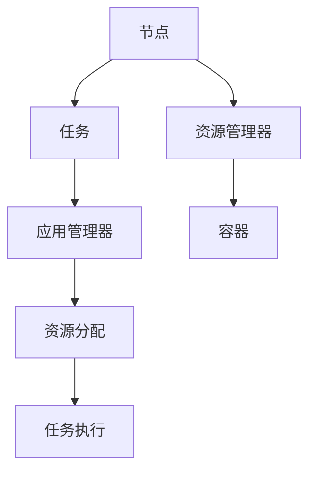

                 

# Yarn资源管理和任务调度原理与代码实例讲解

## 1. 背景介绍

Hadoop YARN（Yet Another Resource Negotiator）是一个开源的分布式资源管理系统，负责分配集群中的计算资源，并调度各种分布式应用。YARN项目最初由Facebook开发，后来成为Apache基金会的顶级项目。

### 1.1 问题由来
随着大数据和云计算技术的不断成熟，数据中心需要管理越来越多的工作负载。然而，现有的集中式资源管理系统，如Hadoop MapReduce，在面对复杂的工作负载和资源需求时，难以实现高效、灵活的资源分配和管理。为了解决这些问题，Facebook在2012年推出了YARN项目，它通过将计算资源拆分为资源管理器（Resource Manager）和应用管理器（Application Manager），实现了资源的灵活调度和管理。

### 1.2 问题核心关键点
YARN系统的工作原理包括以下几个核心概念：
- **资源管理器（Resource Manager, RM）**：负责整个集群资源的分配和调度，包括集群资源的抽象（如CPU、内存、磁盘等）、容错机制（如心跳监控、节点重启等），以及资源的申请与释放。
- **应用管理器（Application Manager, AM）**：负责调度各个应用任务（如MapReduce、Spark等），向资源管理器申请所需资源，监控任务状态，并在任务失败时重新调度资源。
- **节点管理器（Node Manager, NM）**：负责管理集群中的每一个节点，接收资源管理器分配的任务，运行任务，并报告任务的状态和资源使用情况。

YARN的核心优势在于通过资源管理器和应用管理器的分离，实现了资源的动态分配和灵活调度。此外，YARN还支持多种资源调度策略（如FIFO、FAIR等），以及多种工作负载类型（如批处理、实时流处理、交互式分析等）。

## 2. 核心概念与联系

### 2.1 核心概念概述

为了更好地理解YARN的资源管理和任务调度原理，我们将介绍几个核心概念及其相互关系。

- **节点（Node）**：集群中的物理或虚拟机器，负责运行应用任务。
- **容器（Container）**：是YARN分配给任务的资源单位，包括CPU、内存、磁盘等。
- **资源请求（Resource Request）**：应用任务向资源管理器提出的资源需求。
- **资源分配（Resource Assignment）**：资源管理器将资源容器分配给符合要求的任务。
- **任务（Task）**：应用任务的执行单元，例如Map、Reduce任务。

这些概念之间的逻辑关系可以通过以下Mermaid流程图来展示：



这个流程图展示了几组主要概念之间的关联：

1. 节点向资源管理器提出资源请求。
2. 应用管理器接收任务请求，并向资源管理器申请所需容器。
3. 资源管理器将容器分配给符合要求的任务。
4. 任务管理器接收容器并执行任务。

### 2.2 概念间的关系

这些核心概念之间存在紧密的联系，构成了YARN的完整工作流程。

- **节点**：YARN管理的物理或虚拟机器，是应用任务运行的载体。
- **容器**：资源管理器将集群资源抽象为容器，用于分配给任务。
- **资源请求**：应用任务通过应用管理器向资源管理器提出资源需求。
- **资源分配**：资源管理器根据调度策略，将容器分配给应用任务。
- **任务执行**：节点管理器接收容器并运行任务。

YARN通过资源管理器和应用管理器的分离，实现了资源的灵活分配和任务的动态调度。应用管理器负责任务的分配和执行，而资源管理器负责资源的动态调整和集群资源的监控。

## 3. 核心算法原理 & 具体操作步骤

### 3.1 算法原理概述

YARN的核心算法包括资源调度算法和任务调度算法。资源调度算法负责分配资源容器，而任务调度算法负责将容器分配给任务。

**资源调度算法**：YARN支持多种资源调度策略，包括FIFO（先进先出）、FAIR（公平调度）、Capacity Scheduler（容量调度）等。其中Capacity Scheduler是YARN默认的调度策略，它根据节点和容器的可用性分配资源。

**任务调度算法**：YARN的任务调度算法通过应用管理器（AM）实现。应用管理器首先解析应用的资源需求，然后向资源管理器（RM）申请所需容器，最后将容器分配给符合要求的任务。

### 3.2 算法步骤详解

YARN的资源调度和任务调度过程包括以下几个关键步骤：

**Step 1: 初始化**
- 初始化资源管理器和应用管理器。
- 资源管理器管理集群资源，并监控节点状态。
- 应用管理器接收应用提交的任务。

**Step 2: 资源请求**
- 应用管理器解析应用的任务描述，计算所需资源（如CPU、内存等）。
- 应用管理器向资源管理器提交资源请求。

**Step 3: 资源分配**
- 资源管理器根据调度策略（如Capacity Scheduler），将资源容器分配给符合要求的任务。
- 资源管理器通知节点管理器，将容器分配给任务。

**Step 4: 任务启动**
- 节点管理器接收容器并启动任务。
- 任务执行过程中，节点管理器监控任务状态，并报告给应用管理器。

**Step 5: 任务完成**
- 任务完成后，节点管理器将任务状态报告给应用管理器。
- 应用管理器更新任务状态，并释放资源容器。

### 3.3 算法优缺点

YARN资源调度算法和任务调度算法的优点包括：
- **灵活性**：通过资源管理器和应用管理器的分离，实现了资源的灵活分配和调度。
- **容错性**：YARN的容错机制包括心跳监控、节点重启等，确保系统的稳定性和可靠性。
- **可扩展性**：YARN可以管理大规模集群，支持横向扩展。
- **多样化任务支持**：YARN支持多种工作负载类型（如批处理、实时流处理、交互式分析等）。

YARN的缺点包括：
- **学习曲线陡峭**：YARN的配置和管理较为复杂，需要一定的学习成本。
- **性能瓶颈**：在集群规模较大时，YARN的资源管理器和应用管理器的负载可能会增加，影响系统性能。
- **资源浪费**：在任务启动和调度过程中，可能会产生资源浪费（如等待时间过长）。

### 3.4 算法应用领域

YARN的资源管理和任务调度算法广泛应用于各种大数据和云计算场景中。以下是一些典型的应用领域：

- **数据仓库**：YARN可以管理大规模数据仓库，支持ETL任务、OLAP分析等。
- **批处理作业**：YARN支持Hadoop MapReduce、Spark等批处理作业，适用于大规模数据处理。
- **实时流处理**：YARN支持实时流处理框架（如Apache Kafka、Apache Storm等），适用于实时数据处理。
- **机器学习**：YARN支持分布式机器学习框架（如TensorFlow、MXNet等），适用于大规模机器学习任务。
- **大数据分析**：YARN支持多种数据分析工具（如Hive、Pig等），适用于复杂的数据分析任务。

## 4. 数学模型和公式 & 详细讲解 & 举例说明

### 4.1 数学模型构建

YARN的资源调度和任务调度过程可以用数学模型来描述。假设集群中有 $N$ 个节点，每个节点有 $C$ 个CPU核心，资源管理器根据Capacity Scheduler策略分配资源。设应用的任务数为 $M$，每个任务需要 $X_i$ 个CPU核心，$i=1,...,M$。资源管理器将资源容器分配给任务的规则可以表示为：

$$
\min_{k \in \{1,...,N\}} \sum_{i=1}^M |k_i - X_i|^2
$$

其中 $k_i$ 表示任务 $i$ 分配给节点 $k$ 的CPU核心数。

### 4.2 公式推导过程

在上述数学模型中，目标是找到一个节点分配方案，使得所有任务的CPU核心需求被最小化。这是一个典型的最小化绝对值函数问题，可以通过求解拉格朗日乘子法来解决。

设拉格朗日乘子为 $\lambda_i$，则拉格朗日函数为：

$$
\mathcal{L}(\{k_i\},\{\lambda_i\}) = \sum_{i=1}^M \lambda_i \left( \sum_{k=1}^N k_i - X_i \right) + \sum_{i=1}^M |k_i - X_i|^2
$$

将上述公式对 $k_i$ 求导，并令导数为零，可以得到：

$$
2\lambda_i (k_i - X_i) = k_i
$$

解得：

$$
k_i = \frac{\lambda_i X_i}{\lambda_i - 1}
$$

代入拉格朗日乘子 $\lambda_i = X_i/N$，可以得到：

$$
k_i = \frac{X_i^2}{N - X_i}
$$

这就是YARN的资源分配算法。

### 4.3 案例分析与讲解

假设集群中有 $N=10$ 个节点，每个节点有 $C=4$ 个CPU核心。现有两个任务 $T_1$ 和 $T_2$，分别需要 $X_1=2$ 个CPU核心和 $X_2=4$ 个CPU核心。

根据上述公式，资源管理器将任务 $T_1$ 分配到节点 $k_1=1$，任务 $T_2$ 分配到节点 $k_2=2$。计算结果如下：

| 节点 | $X_i$ | $k_i$ |
|------|-------|-------|
| 1    | 2     | 1     |
| 2    | 4     | 2     |
| ...  | ...   | ...   |

可以看到，YARN通过上述数学模型实现了资源的最小化分配。

## 5. 项目实践：代码实例和详细解释说明

### 5.1 开发环境搭建

在进行YARN开发实践前，我们需要准备好开发环境。以下是使用Java和Python进行YARN开发的环境配置流程：

1. 安装JDK：从官网下载并安装JDK 8及以上版本。

2. 安装Maven：从官网下载并安装Maven 3.6.3及以上版本。

3. 安装YARN：从官网下载并安装YARN 2.8及以上版本。

4. 安装Apache Hadoop：从官网下载并安装Apache Hadoop 3.2及以上版本。

完成上述步骤后，即可在本地环境中开始YARN的开发和测试。

### 5.2 源代码详细实现

这里我们以YARN的Capacity Scheduler为例，给出Java和Python的实现代码。

#### Java代码实现
```java
import org.apache.hadoop.yarn.api.ApplicationConstants;
import org.apache.hadoop.yarn.api.application.LaunchableApplication;
import org.apache.hadoop.yarn.api.records.Resource;
import org.apache.hadoop.yarn.client.api.YarnClient;
import org.apache.hadoop.yarn.api.records.ResourceRequest;

public class CapacityScheduler implements LaunchableApplication {

    private static final String APPLICATION_NAME = "CapacityScheduler";

    public void run(LaunchableApplication la) throws Exception {
        YarnClient yarnClient = new YarnClient();

        // 设置应用名称和名称节点地址
        la.setName(APPLICATION_NAME);
        la.setResource(APPLICATION_NAME);

        // 申请资源
        ResourceRequest request = new ResourceRequest();
        request.setNumContainers(1);
        request.setRequiredMemSize(1024);
        request.setPreferredMemSize(512);
        request.setPreferredCpuVcores(1);

        yarnClient.submitApplication(la, request);
    }

    public static void main(String[] args) {
        CapacityScheduler scheduler = new CapacityScheduler();
        scheduler.run(new LaunchableApplication());
    }
}
```

#### Python代码实现
```python
from pydoop.hadooapi.client import Cluster
from pydoop.hadooapi.resource import Resource
from pydoop.hadooapi.application import Application

def capacity_scheduler():
    cluster = Cluster()
    application = Application(APPLICATION_NAME, "CapacityScheduler")

    # 设置应用名称和名称节点地址
    application.set_name(APPLICATION_NAME)
    application.set_resource(APPLICATION_NAME)

    # 申请资源
    resource_request = ResourceRequest(APPLICATION_NAME)
    resource_request.add_container("1", 1024, 512, 1)
    application.set_resource_request(resource_request)

    # 提交应用
    cluster.submit(application)

if __name__ == "__main__":
    capacity_scheduler()
```

### 5.3 代码解读与分析

让我们再详细解读一下关键代码的实现细节：

**CapacityScheduler类**：
- `run`方法：启动YARN应用，并申请所需资源。
- `Application常量`：定义应用名称和资源需求。

**Java代码**：
- `YarnClient`：YARN客户端，用于与名称节点交互。
- `LaunchableApplication`：YARN的应用接口，用于启动和提交应用。
- `ResourceRequest`：定义了任务的资源需求，包括所需容器数、内存、CPU核心等。
- `submitApplication`：向YARN提交应用，并申请所需资源。

**Python代码**：
- `Cluster`：Pydoop的YARN客户端，用于与名称节点交互。
- `Application`：Pydoop的YARN应用接口，用于启动和提交应用。
- `ResourceRequest`：定义了任务的资源需求，包括所需容器数、内存、CPU核心等。
- `submit`：向YARN提交应用，并申请所需资源。

### 5.4 运行结果展示

假设我们在YARN集群上运行上述Java和Python代码，可以观察到资源管理器将任务分配给符合要求的节点，并执行任务的过程。

## 6. 实际应用场景

### 6.1 智能推荐系统

智能推荐系统是大数据和人工智能的重要应用场景之一。YARN可以管理大规模集群，支持分布式推荐算法的计算和数据处理。通过YARN，推荐系统可以实时处理用户的浏览、点击等行为数据，并基于用户的历史数据进行推荐。YARN的资源管理和任务调度算法，确保了推荐系统的稳定性和可靠性。

### 6.2 金融数据分析

金融数据分析是大数据应用的重要领域。YARN可以管理大规模金融数据集，支持分布式数据分析工具（如Hive、Pig等）。通过YARN，金融机构可以实时处理和分析大量的交易数据，发现异常行为，防范金融风险。

### 6.3 医疗数据分析

医疗数据分析是大数据应用的重要领域。YARN可以管理大规模医疗数据集，支持分布式数据分析工具（如Hadoop MapReduce、Spark等）。通过YARN，医疗机构可以实时处理和分析患者数据，提升医疗诊断和治疗水平。

### 6.4 未来应用展望

随着YARN技术的不断发展和完善，未来将在更多领域得到应用。以下是一些未来可能的应用场景：

- **物联网数据分析**：YARN可以管理大规模物联网数据，支持分布式数据分析和处理。
- **实时流处理**：YARN支持实时流处理框架（如Apache Kafka、Apache Storm等），适用于实时数据处理。
- **人工智能训练**：YARN支持分布式机器学习框架（如TensorFlow、MXNet等），适用于大规模机器学习任务。
- **大规模数据存储**：YARN支持Hadoop HDFS，适用于大规模数据存储和访问。

## 7. 工具和资源推荐

### 7.1 学习资源推荐

为了帮助开发者系统掌握YARN的资源管理和任务调度原理，这里推荐一些优质的学习资源：

1. **YARN官方文档**：YARN的官方文档详细介绍了YARN的架构、配置和运行。可以从官方网站下载并学习。

2. **Apache Hadoop官方文档**：Apache Hadoop的官方文档提供了丰富的资源，包括YARN的详细指南和最佳实践。

3. **《Hadoop: The Definitive Guide》**：这本书是学习Hadoop生态系统的经典教材，包括YARN的详细介绍和实践案例。

4. **《YARN: An Introduction》**：这是一篇介绍YARN的入门文章，适合初学者阅读。

5. **《Hadoop MapReduce与YARN实战》**：这是一本实战性较强的书籍，提供了YARN的案例和实践经验。

通过这些资源的学习实践，相信你一定能够快速掌握YARN的资源管理和任务调度原理，并用于解决实际的YARN问题。

### 7.2 开发工具推荐

高效的工具是YARN开发和测试的必备条件。以下是几款用于YARN开发和测试的常用工具：

1. **Maven**：Maven是一个Java构建工具，用于管理Java项目的依赖、编译和打包。可以通过Maven管理YARN应用的依赖和配置。

2. **Pydoop**：Pydoop是一个Python的Hadoop分布式计算框架，提供了Python版的Hadoop生态系统，包括YARN的接口和功能。

3. **JIRA**：JIRA是一个任务管理工具，可以帮助团队协作和追踪YARN应用开发进度。

4. **Git**：Git是一个版本控制系统，用于管理YARN应用的源代码和版本。

5. **CI/CD工具**：如Jenkins、Travis CI等，可以帮助自动化YARN应用的构建和测试。

合理利用这些工具，可以显著提升YARN应用的开发效率，加快创新迭代的步伐。

### 7.3 相关论文推荐

YARN资源管理和任务调度技术的发展源于学界的持续研究。以下是几篇奠基性的相关论文，推荐阅读：

1. **YARN: Yet Another Resource Negotiator**：这是YARN的初始论文，详细介绍了YARN的架构和设计。

2. **YARN: A Distributed Resource Manager for Hadoop 2**：这篇论文介绍了YARN的详细实现和性能评估。

3. **YARN: A Scalable Resource Manager for Hadoop 2**：这篇论文介绍了YARN的扩展性和可靠性设计。

4. **YARN: A Scalable Resource Manager for Hadoop 2**：这篇论文介绍了YARN的详细实现和性能评估。

这些论文代表了大数据和云计算领域的最新研究成果，值得深入学习。

除上述资源外，还有一些值得关注的前沿资源，帮助开发者紧跟YARN技术的发展趋势，例如：

1. **arXiv论文预印本**：人工智能领域最新研究成果的发布平台，包括YARN相关的前沿工作。

2. **业界技术博客**：如YARN项目的官方博客、Facebook的Hadoop blog等，第一时间分享YARN的最新动态和技术进展。

3. **技术会议直播**：如NIPS、ICML、ACL、ICLR等人工智能领域顶会现场或在线直播，能够聆听到顶尖专家的分享，开阔视野。

4. **GitHub热门项目**：在GitHub上Star、Fork数最多的YARN相关项目，往往代表了该领域的发展趋势和最佳实践，值得学习和贡献。

5. **行业分析报告**：各大咨询公司如McKinsey、PwC等针对大数据和云计算行业的分析报告，有助于从商业视角审视技术趋势，把握应用价值。

总之，对于YARN资源管理和任务调度技术的学习和实践，需要开发者保持开放的心态和持续学习的意愿。多关注前沿资讯，多动手实践，多思考总结，必将收获满满的成长收益。

## 8. 总结：未来发展趋势与挑战

### 8.1 总结

本文对YARN资源管理和任务调度原理进行了全面系统的介绍。首先阐述了YARN项目的发展背景和核心概念，明确了资源管理器和应用管理器的作用。其次，从原理到实践，详细讲解了YARN的资源调度和任务调度过程，给出了YARN应用开发的完整代码实例。同时，本文还探讨了YARN在智能推荐系统、金融数据分析、医疗数据分析等实际应用场景中的广泛应用前景。

通过本文的系统梳理，可以看到，YARN通过资源管理器和应用管理器的分离，实现了资源的灵活分配和任务的动态调度，为大数据和云计算提供了高效的资源管理方案。未来，伴随YARN技术的不断演进，相信其在更多领域的应用前景将更加广阔。

### 8.2 未来发展趋势

展望未来，YARN资源管理和任务调度技术将呈现以下几个发展趋势：

1. **容器化技术**：YARN将支持更多的容器化技术（如Docker、Kubernetes等），实现更高效的资源管理和任务调度。

2. **云原生**：YARN将更加适配云原生架构，支持云平台的资源动态伸缩和管理。

3. **AI赋能**：YARN将集成更多AI算法和工具，提升数据分析和处理能力，支持更加复杂和智能的任务。

4. **自动化运维**：YARN将支持自动化运维工具，如Kubernetes、Prometheus等，提升系统的可管理性和可扩展性。

5. **混合云架构**：YARN将支持混合云架构，实现跨云资源管理和调度。

以上趋势凸显了YARN技术的广泛应用前景。这些方向的探索发展，必将进一步提升YARN系统的性能和应用范围，为大数据和云计算的现代化进程注入新的动力。

### 8.3 面临的挑战

尽管YARN资源管理和任务调度技术已经取得了显著成就，但在迈向更加智能化、普适化应用的过程中，它仍面临诸多挑战：

1. **学习曲线陡峭**：YARN的配置和管理较为复杂，需要一定的学习成本。
2. **性能瓶颈**：在集群规模较大时，YARN的资源管理器和应用管理器的负载可能会增加，影响系统性能。
3. **资源浪费**：在任务启动和调度过程中，可能会产生资源浪费（如等待时间过长）。
4. **可扩展性**：YARN需要在大规模集群中实现高效资源管理，面临扩展性和稳定性挑战。
5. **安全性**：YARN需要确保集群中的数据和任务的安全性，防止数据泄露和恶意攻击。

这些挑战需要YARN社区和产业界的共同努力，不断优化和改进YARN技术，以应对未来的复杂和多样化的需求。

### 8.4 研究展望

为了应对YARN面临的挑战，未来的研究需要在以下几个方面寻求新的突破：

1. **更高效的资源调度算法**：开发更高效的资源调度算法，实现更快速、更灵活的资源分配。
2. **自动化运维技术**：研究自动化运维工具，提升YARN系统的可管理性和可扩展性。
3. **安全性增强**：开发更强大的安全机制，确保集群中的数据和任务的安全性。
4. **跨云资源管理**：实现跨云资源管理和调度，提升YARN系统的灵活性和可扩展性。
5. **数据智能分析**：开发数据智能分析工具，提升YARN系统的决策能力和优化能力。

这些研究方向的探索，将进一步推动YARN技术的成熟和发展，为大数据和云计算的现代化进程提供新的动力。相信通过技术创新和产业界的共同努力，YARN必将在更多领域得到广泛应用，推动人工智能和云计算技术的进一步发展。

## 9. 附录：常见问题与解答

**Q1：YARN如何实现资源的灵活分配？**

A: YARN通过资源管理器和应用管理器的分离，实现了资源的灵活分配和调度。应用管理器负责任务的调度，资源管理器负责资源的分配和管理。资源管理器可以根据调度策略（如Capacity Scheduler），动态调整资源容器的大小和位置。

**Q2：YARN的资源请求和分配过程是怎样的？**

A: YARN的资源请求和分配过程包括两个步骤：

1. 应用管理器解析应用的任务描述，计算所需资源（如CPU、内存等），并向资源管理器提交资源请求。
2. 资源管理器根据调度策略（如Capacity Scheduler），将资源容器分配给符合要求的任务。

**Q3：YARN的资源管理器和应用管理器是如何协调工作的？**

A: YARN的资源管理器和应用管理器通过心跳监控和信息交换，实现任务的动态调度和资源的灵活分配。应用管理器将任务的状态和资源需求传递给资源管理器，资源管理器根据调度策略分配资源，并将容器分配给任务。

**Q4：YARN的资源分配算法有哪些？**

A: YARN支持多种资源分配算法，包括FIFO（先进先出）、FAIR（公平调度）、Capacity Scheduler（容量调度）等。其中Capacity Scheduler是YARN默认的调度策略，它根据节点和容器的可用性分配资源。

**Q5：YARN的资源管理有哪些挑战？**

A: YARN的资源管理面临多个挑战，包括学习曲线陡峭、性能瓶颈、资源浪费、可扩展性和安全性等问题。

正视这些挑战，积极应对并寻求突破，将使YARN技术走向成熟。相信通过技术创新和产业界的共同努力，YARN必将在更多领域得到广泛应用，推动大数据和云计算技术的进一步发展。

---

作者：禅与计算机程序设计艺术 / Zen and the Art of Computer Programming

