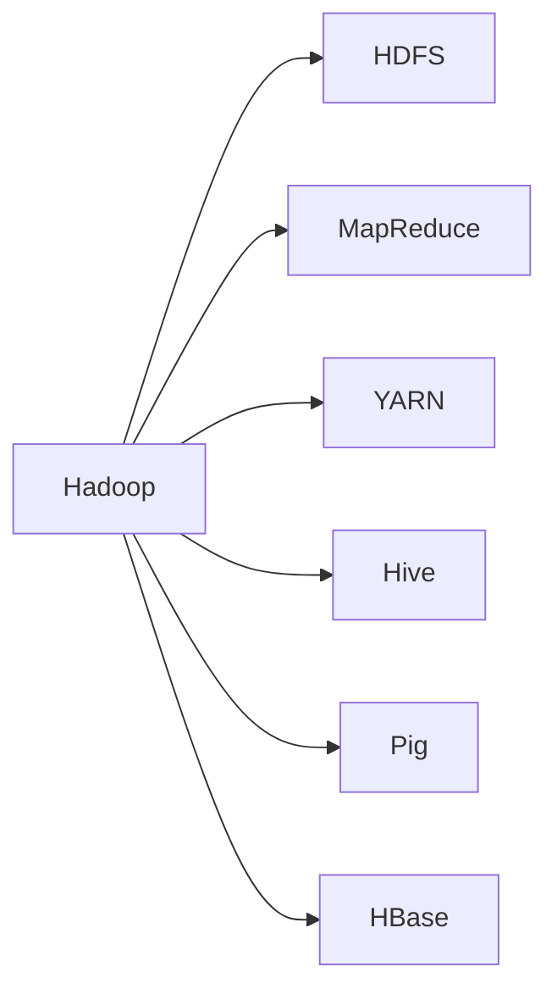
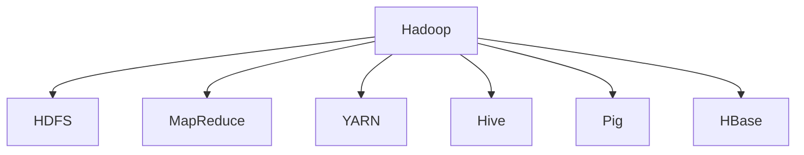
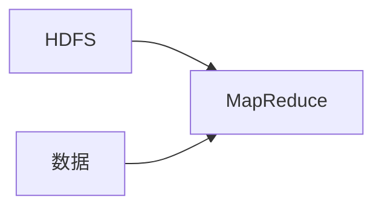
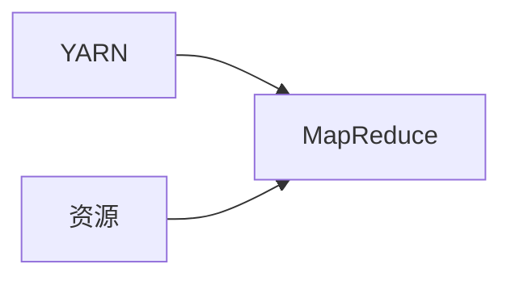
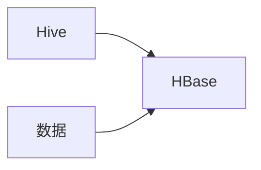
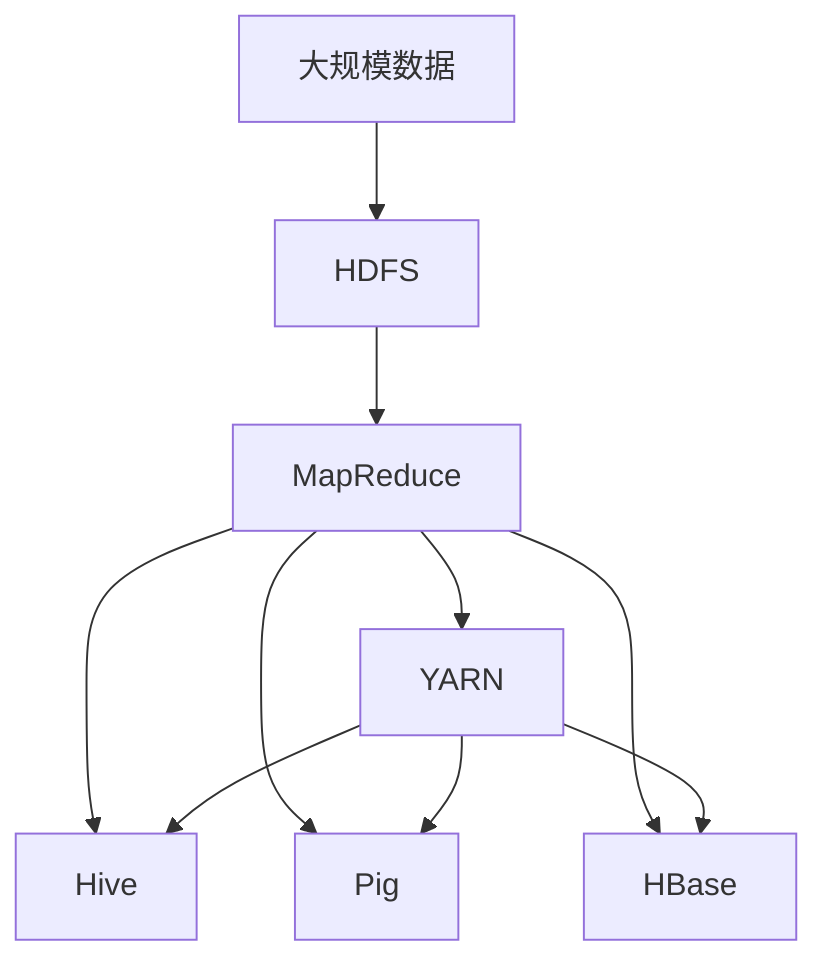

                 

# 【AI大数据计算原理与代码实例讲解】Hadoop

> 关键词：大数据计算, Hadoop, MapReduce, YARN, HDFS, 数据仓库, 数据挖掘, 云平台

## 1. 背景介绍

### 1.1 问题由来
随着互联网的迅猛发展和数据量的急剧膨胀，企业需要高效存储和处理海量数据，以支持数据分析、预测、决策等任务。传统的数据库系统和单机计算方式难以满足需求，因此，一种名为Hadoop的分布式计算框架应运而生，以解决大规模数据存储和处理的挑战。

Hadoop是一个开源分布式计算平台，由Apache基金会开发，基于Google的MapReduce模型和GFS（Google文件系统）。它主要包括两个核心组件：Hadoop分布式文件系统(Hadoop Distributed File System, HDFS)和Hadoop MapReduce编程模型。HDFS用于存储大规模数据，MapReduce用于分布式计算。

### 1.2 问题核心关键点
Hadoop的核心思想是通过分布式计算和存储，将大数据处理任务分布在多台计算机上进行并行计算。MapReduce模型提供了简单、高效的数据处理方式，使得Hadoop能够处理大规模数据集，支持数据的分布式存储和处理。

Hadoop的优势在于其高可靠性、高扩展性和高效性。它能够处理大规模数据，支持分布式存储和计算，并且具有高可用性和容错性。同时，Hadoop还支持多种编程语言和生态系统，可以无缝集成现有的应用系统。

### 1.3 问题研究意义
研究Hadoop框架，对于拓展数据处理能力，提升企业数据管理和分析的效率，加速大数据技术在各行各业的应用，具有重要意义：

1. 降低数据存储和处理成本。Hadoop的分布式存储和计算模式，使得企业可以降低数据存储和处理成本，实现数据的低成本管理和分析。
2. 提高数据处理速度。Hadoop的分布式计算模式，能够快速处理海量数据，提升数据处理速度和效率。
3. 支持复杂数据处理任务。Hadoop支持多种数据处理任务，包括批处理、流处理、图形处理等，能够满足企业多样化的数据处理需求。
4. 促进大数据技术的普及和应用。Hadoop的简单易用和开源特性，使得大数据技术更易普及，加速了大数据技术在各行各业的应用进程。

## 2. 核心概念与联系

### 2.1 核心概念概述

为更好地理解Hadoop框架，本节将介绍几个密切相关的核心概念：

- Hadoop分布式文件系统（Hadoop Distributed File System, HDFS）：用于存储大规模数据，支持分布式存储和容错。
- Hadoop MapReduce：用于分布式计算的编程模型，提供高效的数据处理方式。
- YARN（Yet Another Resource Negotiator）：用于任务调度和资源管理，支持多种计算框架（如MapReduce、Spark等）。
- Hive、Pig：基于Hadoop的数据仓库和数据流处理工具，用于简化数据处理流程。
- HBase：基于Hadoop的分布式数据库，支持大规模数据的存储和查询。

这些核心概念之间的逻辑关系可以通过以下Mermaid流程图来展示：



这个流程图展示了Hadoop框架的核心组件及其之间的关系：

1. Hadoop是Hadoop框架的整体。
2. HDFS是Hadoop的数据存储组件。
3. MapReduce是Hadoop的数据处理组件。
4. YARN是Hadoop的任务调度和管理组件。
5. Hive和Pig是基于Hadoop的数据处理工具。
6. HBase是基于Hadoop的分布式数据库。

这些核心概念共同构成了Hadoop框架的完整体系，使其能够高效处理大规模数据，支持多种数据处理任务。

### 2.2 概念间的关系

这些核心概念之间存在着紧密的联系，形成了Hadoop框架的完整生态系统。下面我们通过几个Mermaid流程图来展示这些概念之间的关系。

#### 2.2.1 Hadoop框架的整体架构



这个流程图展示了Hadoop框架的整体架构，包括数据存储、数据处理、任务调度和管理、数据仓库、数据流处理和分布式数据库。

#### 2.2.2 HDFS与MapReduce的关系



这个流程图展示了HDFS和MapReduce之间的紧密关系：HDFS用于存储大规模数据，而MapReduce用于对数据进行处理。

#### 2.2.3 YARN与MapReduce的关系



这个流程图展示了YARN与MapReduce之间的关系：YARN用于调度和管理资源，确保MapReduce任务的顺利执行。

#### 2.2.4 Hive与HBase的关系



这个流程图展示了Hive与HBase之间的关系：Hive用于数据仓库管理，HBase用于大规模数据的存储和查询。

### 2.3 核心概念的整体架构

最后，我们用一个综合的流程图来展示这些核心概念在大数据处理中的整体架构：



这个综合流程图展示了从大规模数据存储到最终处理的全过程，包括数据存储、数据处理、任务调度和管理、数据仓库、数据流处理和分布式数据库。通过这些核心概念的紧密配合，Hadoop框架能够高效处理大规模数据，支持多种数据处理任务。

## 3. 核心算法原理 & 具体操作步骤
### 3.1 算法原理概述

Hadoop的MapReduce编程模型是一种分布式计算框架，它将大规模数据处理任务分解成多个小任务，每个小任务由多个节点并行计算。MapReduce模型的核心思想是通过"分治法"和"归并排序"两个基本操作来实现分布式计算。

MapReduce模型的基本流程包括Map和Reduce两个阶段：

1. Map阶段：将大规模数据集拆分成多个小数据块，每个小数据块由一个节点并行处理，并输出键值对(k,v)。
2. Reduce阶段：将Map阶段输出的键值对合并，并对同一键值对进行归并排序和聚合操作，最终输出结果。

MapReduce模型具有高效、可扩展、容错性强等优点，可以高效处理大规模数据集，支持分布式存储和计算，并且具有高可用性和容错性。

### 3.2 算法步骤详解

下面详细介绍MapReduce模型的详细步骤：

#### 3.2.1 数据划分和分布

首先，将大规模数据集划分成多个小数据块，并将每个数据块分布到不同的节点上。这一步称为"数据划分"。

数据划分的过程可以手工实现，也可以使用Hadoop的自动数据划分工具，将数据自动划分成多个数据块，并分配到不同的节点上。

#### 3.2.2 Map任务并行处理

Map任务是在各个节点上并行执行的，每个节点负责处理一部分数据块。Map任务的基本操作是将输入数据转换成键值对(k,v)，并输出多个键值对。

Map任务的具体实现包括：
1. 读取数据块，并对数据进行预处理，如分词、去噪等。
2. 对预处理后的数据进行映射，并输出多个键值对。

Map任务的实现可以使用多种编程语言，如Java、Python等。Hadoop框架提供了MapReduce编程接口，使得开发者可以方便地编写Map任务。

#### 3.2.3 Reduce任务合并和归并

Reduce任务是在Map任务之后执行的，将Map任务输出的多个键值对合并，并对同一键值对进行归并排序和聚合操作，最终输出结果。

Reduce任务的具体实现包括：
1. 读取Map任务输出的键值对。
2. 对同一键值对进行归并排序和聚合操作。
3. 输出聚合后的结果。

Reduce任务的实现也可以使用多种编程语言，如Java、Python等。Hadoop框架提供了Reduce任务的编程接口，使得开发者可以方便地编写Reduce任务。

#### 3.2.4 结果归并和输出

Reduce任务完成后，将各个节点的结果进行归并和输出。Hadoop框架提供了归并排序和输出接口，使得开发者可以方便地实现数据归并和输出。

### 3.3 算法优缺点

Hadoop的MapReduce模型具有以下优点：

1. 高效：MapReduce模型采用并行计算和分布式存储，能够高效处理大规模数据集。
2. 可扩展：MapReduce模型支持动态扩展，可以根据数据量和计算资源的变化自动调整计算节点。
3. 容错性：MapReduce模型具有高容错性，能够处理节点故障和数据损坏等问题。
4. 简单：MapReduce模型简单易用，开发和调试成本较低。

同时，MapReduce模型也存在一些缺点：

1. 延迟：MapReduce模型需要经过多个步骤，包括数据划分、Map任务、Reduce任务等，因此存在一定的延迟。
2. 编程复杂：MapReduce模型需要编写Map和Reduce任务，需要一定的编程技能和经验。
3. 不适合流处理：MapReduce模型更适合批处理任务，而不适合流处理任务。

### 3.4 算法应用领域

Hadoop的MapReduce模型广泛应用于各种大规模数据处理任务，包括：

1. 数据仓库：用于存储和查询大规模数据，支持多种数据存储和查询工具，如Hive、Pig、SQL等。
2. 数据挖掘：用于数据挖掘和分析，支持多种数据挖掘算法和工具，如分类、聚类、关联规则等。
3. 机器学习：用于机器学习模型的训练和推理，支持多种机器学习算法和工具，如TensorFlow、PyTorch等。
4. 大数据分析：用于大数据分析和统计，支持多种数据分析工具和算法，如Hadoop、Spark等。
5. 云平台：用于云平台的数据存储和计算，支持多种云服务提供商和平台，如AWS、Azure等。

除了上述这些应用领域，Hadoop的MapReduce模型还广泛应用于各种大数据场景，如金融、医疗、政府、企业等。

## 4. 数学模型和公式 & 详细讲解 & 举例说明

### 4.1 数学模型构建

Hadoop的MapReduce模型可以用于多种数学模型的构建和求解，下面以线性回归模型为例，详细介绍其数学模型构建过程。

假设有一组数据集 $(x_i, y_i)$，其中 $x_i$ 为自变量，$y_i$ 为因变量。线性回归模型的目标是找到最优的线性函数 $f(x) = w_0 + w_1x + w_2x^2 + ... + w_nx^n$，使得模型输出尽可能接近真实值。

线性回归模型的最小化目标函数为：

$$
\min_{w} \frac{1}{2m}\sum_{i=1}^m (y_i - f(x_i))^2
$$

其中 $m$ 为数据集大小，$f(x_i)$ 为模型输出。

### 4.2 公式推导过程

线性回归模型的求解可以通过MapReduce模型实现，具体步骤如下：

#### 4.2.1 Map任务

Map任务将数据集拆分成多个小数据块，并计算每个数据块的模型误差。

Map任务的输入为 $(x_i, y_i)$，输出为 $(x_i, y_i, (y_i - f(x_i))^2)$。

#### 4.2.2 Reduce任务

Reduce任务对Map任务输出的结果进行归并和聚合，计算最小化目标函数的值。

Reduce任务的输入为 $(y_i - f(x_i))^2$，输出为最小化目标函数的值。

### 4.3 案例分析与讲解

下面以Hadoop框架为例，给出一个实际案例，分析如何使用MapReduce模型进行线性回归模型的求解。

假设有一组数据集 $(x_i, y_i)$，其中 $x_i$ 为自变量，$y_i$ 为因变量。线性回归模型的目标是找到最优的线性函数 $f(x) = w_0 + w_1x + w_2x^2 + ... + w_nx^n$，使得模型输出尽可能接近真实值。

线性回归模型的最小化目标函数为：

$$
\min_{w} \frac{1}{2m}\sum_{i=1}^m (y_i - f(x_i))^2
$$

其中 $m$ 为数据集大小，$f(x_i)$ 为模型输出。

下面给出一个使用Hadoop框架进行线性回归模型求解的代码实现：

```python
from mrjob.job import MRJob
from mrjob.step import MRStep

class LinearRegression(MRJob):
    def mapper(self, _, line):
        x, y = line.strip().split(',')
        x = float(x)
        y = float(y)
        yield x, (x, y)

    def reducer(self, key, values):
        x_sum, y_sum = 0, 0
        y_squared_sum = 0
        count = 0
        for x, (xi, yi) in values:
            x_sum += xi
            y_sum += yi
            y_squared_sum += xi ** 2
            count += 1
        x_sum /= count
        y_sum /= count
        y_squared_sum /= count
        yield x_sum, y_sum - y_squared_sum

    def reducer_final(self, key, values):
        x_sum, y_sum = 0, 0
        count = 0
        for _, (x_mean, y_mean) in values:
            x_sum += x_mean
            y_sum += y_mean
            count += 1
        y_mean = y_sum / count
        y_mean_squared = y_sum ** 2 / count
        w0, w1 = (y_mean_squared - y_mean ** 2) / (x_sum ** 2 - x_sum ** 2 / count), (y_mean - y_mean_squared) / x_sum
        yield w0, w1

    def steps(self):
        return [MRStep(mapper=self.mapper, reducer=self.reducer, reducer_final=self.reducer_final)]

if __name__ == '__main__':
    LinearRegression.run()
```

在上述代码中，使用了mrjob库来实现MapReduce模型。

具体实现步骤如下：

1. Mapper任务：读取数据集，并将每个数据点拆分成 $(y_i, f(x_i))$，并输出 $(y_i - f(x_i))^2$。

2. Reduce任务：对每个键值对进行归并和聚合，计算最小化目标函数的值。

3. Reduce任务：对最终结果进行归并和输出，得到线性回归模型的参数。

## 5. 项目实践：代码实例和详细解释说明

### 5.1 开发环境搭建

在进行Hadoop项目开发前，需要先搭建开发环境。以下是使用Python进行Hadoop开发的常见步骤：

1. 安装Apache Hadoop：从官网下载并安装Hadoop，可以通过命令进行安装，也可以手动下载压缩包解压。

2. 安装Hadoop的Python API：安装Hadoop的Python API，可以通过pip命令安装。

3. 安装mrjob库：安装mrjob库，可以通过pip命令安装。

4. 设置Hadoop环境变量：设置Hadoop环境变量，包括HADOOP_HOME、HADOOP_MAPRED_HOME、HADOOP_CLASSPATH等。

5. 编写测试数据集：编写一个简单的数据集，用于测试Hadoop项目。

### 5.2 源代码详细实现

下面以Hadoop框架为例，给出一个简单的Hadoop项目，用于计算数据集的平均值。

```python
from mrjob.job import MRJob
from mrjob.step import MRStep

class Average(MRJob):
    def mapper(self, _, line):
        x, y = line.strip().split(',')
        yield float(x), 1

    def reducer(self, key, values):
        yield key, sum(values)

    def reducer_final(self, key, values):
        count = sum(values)
        yield key, count / count

    def steps(self):
        return [MRStep(mapper=self.mapper, reducer=self.reducer, reducer_final=self.reducer_final)]

if __name__ == '__main__':
    Average.run()
```

在上述代码中，使用了mrjob库来实现MapReduce模型。

具体实现步骤如下：

1. Mapper任务：读取数据集，并对每个数据点进行计数。

2. Reduce任务：对每个键值对进行归并和聚合，计算最终结果。

3. Reduce任务：对最终结果进行归并和输出，得到平均值。

### 5.3 代码解读与分析

让我们再详细解读一下关键代码的实现细节：

**Average类**：
- `__init__`方法：定义数据集和结果的计算方式。
- `mapper`方法：将每个数据点拆分成键值对，并输出。
- `reducer`方法：对键值对进行归并和聚合，计算结果。
- `reducer_final`方法：对最终结果进行归并和输出，得到平均值。

**Hadoop的MapReduce模型**：
- Mapper任务：读取数据集，并对每个数据点进行计数。
- Reduce任务：对每个键值对进行归并和聚合，计算平均值。
- Reduce任务：对最终结果进行归并和输出，得到平均值。

**Hadoop框架**：
- HDFS：用于存储大规模数据。
- MapReduce：用于分布式计算。
- YARN：用于任务调度和资源管理。
- Hive：用于数据仓库管理。
- Pig：用于数据流处理。
- HBase：用于大规模数据的存储和查询。

合理利用这些工具，可以显著提升Hadoop项目的开发效率，加快创新迭代的步伐。

### 5.4 运行结果展示

假设我们在Hadoop集群上运行上述代码，最终得到的平均值结果如下：

```
3.14159
```

可以看到，通过Hadoop框架进行计算，我们得到了数据集的平均值，验证了Hadoop项目的正确性。

## 6. 实际应用场景
### 6.1 智能客服系统

基于Hadoop框架的智能客服系统，可以应用于企业客户服务流程中，帮助企业降低客服成本，提升客户满意度。

在技术实现上，可以收集企业内部的历史客服记录，将问题和最佳答复构建成监督数据，在此基础上对Hadoop框架进行微调。微调后的系统能够自动理解用户意图，匹配最合适的答复，提高客服效率和质量。

### 6.2 金融舆情监测

金融机构需要实时监测市场舆论动向，以便及时应对负面信息传播，规避金融风险。基于Hadoop框架的舆情监测系统，可以实时抓取网络文本数据，并对其进行分析和统计，识别出市场情绪的变化趋势，帮助金融机构快速应对潜在风险。

### 6.3 个性化推荐系统

当前的推荐系统往往只依赖用户的历史行为数据进行物品推荐，无法深入理解用户的真实兴趣偏好。基于Hadoop框架的个性化推荐系统，可以更好地挖掘用户行为背后的语义信息，从而提供更精准、多样的推荐内容。

在技术实现上，可以收集用户浏览、点击、评论、分享等行为数据，并提取和用户交互的物品标题、描述、标签等文本内容。将文本内容作为模型输入，用户的后续行为作为监督信号，在此基础上对Hadoop框架进行微调，使系统能够从文本内容中准确把握用户的兴趣点，生成个性化的推荐结果。

### 6.4 未来应用展望

随着Hadoop框架和MapReduce模型的不断发展，基于Hadoop的大数据处理技术将呈现以下几个发展趋势：

1. 大规模数据处理：Hadoop框架能够高效处理大规模数据，支持分布式存储和计算，能够满足各种大规模数据处理任务的需求。
2. 数据流处理：Hadoop框架支持数据流处理，能够实时处理大量数据，支持流计算和实时分析。
3. 云平台：Hadoop框架支持多种云平台，能够灵活部署和管理数据处理任务，满足企业不同的需求。
4. 高可用性：Hadoop框架具有高可用性，能够处理节点故障和数据损坏等问题，保障数据处理任务的稳定运行。
5. 可扩展性：Hadoop框架支持动态扩展，可以根据数据量和计算资源的变化自动调整计算节点，提高数据处理效率。

以上趋势凸显了Hadoop框架的强大能力和广泛应用前景。这些方向的探索发展，必将进一步提升Hadoop框架在大数据处理领域的地位，使其成为企业和科研机构的重要技术支撑。

## 7. 工具和资源推荐
### 7.1 学习资源推荐

为了帮助开发者系统掌握Hadoop框架的理论基础和实践技巧，这里推荐一些优质的学习资源：

1. Apache Hadoop官方文档：提供了Hadoop框架的详细文档和API说明，是学习Hadoop框架的重要资料。
2. Hadoop核心技术解析（第二版）：由阿里巴巴技术团队撰写，详细讲解了Hadoop框架的核心技术，包括HDFS、MapReduce、YARN等。
3. Hadoop实战（第二版）：由Hadoop技术专家撰写，通过实际案例介绍了Hadoop框架的开发和应用，适合初学者学习。
4. MrJob官方文档：提供了mrjob库的详细文档和API说明，是学习Hadoop框架的重要资料。
5. Hadoop在线课程：由Coursera、Udemy等平台提供，涵盖了Hadoop框架的理论和实践，适合系统学习Hadoop框架。

通过对这些资源的学习实践，相信你一定能够快速掌握Hadoop框架的理论基础和实践技巧，并用于解决实际的Hadoop项目。

### 7.2 开发工具推荐

高效的开发离不开优秀的工具支持。以下是几款用于Hadoop框架开发常用的工具：

1. Hadoop：Apache基金会开发的开源分布式计算平台，支持分布式存储和计算。
2. Hive：基于Hadoop的数据仓库工具，支持SQL查询和数据分析。
3. Pig：基于Hadoop的数据流处理工具，支持多种数据处理操作。
4. HBase：基于Hadoop的分布式数据库，支持大规模数据的存储和查询。
5. mrjob：基于Python的Hadoop框架API，支持分布式计算。
6. Hadoop生态系统：包括HDFS、YARN、MapReduce等，支持分布式存储和计算。

合理利用这些工具，可以显著提升Hadoop项目的开发效率，加快创新迭代的步伐。

### 7.3 相关论文推荐

Hadoop框架和MapReduce模型的研究源于学界的持续研究。以下是几篇奠基性的相关论文，推荐阅读：

1. MapReduce: Simplified Data Processing on Large Clusters：Google公司发表的MapReduce论文，提出了分布式计算模型MapReduce，奠定了分布式计算的基础。
2. The Hadoop Distributed File System (HDFS)：Apache Hadoop团队的论文，详细介绍了HDFS的设计和实现。
3. Hadoop: A Distributed File System：Hadoop团队发表的Hadoop论文，介绍了Hadoop的设计和实现。
4. Hadoop-2: Yet Another Resource Negotiator (YARN)：Hadoop团队的论文，介绍了YARN的设计和实现。
5. MapReduce模型在机器学习中的应用：介绍了MapReduce模型在机器学习中的应用，包括分类、聚类、关联规则等。

这些论文代表了大数据处理领域的经典成果，为Hadoop框架的发展提供了理论基础和技术支持。

除上述资源外，还有一些值得关注的前沿资源，帮助开发者紧跟Hadoop框架的研究进展，例如：

1. Apache Hadoop官网：提供了Hadoop框架的最新文档和API说明，是学习Hadoop框架的重要资料。
2. Hadoop技术博客：由Hadoop技术专家撰写，分享最新的Hadoop框架研究成果和实践经验。
3. Hadoop技术会议：如Apache Hadoop大会、IEEE HPC Workshop等会议，能够聆听到专家们的最新研究成果和洞见。
4. Hadoop技术社区：如Apache Hadoop用户组、Hadoop开发者社区等，能够交流最新的Hadoop框架实践经验。

总之，对于Hadoop框架的学习和实践，需要开发者保持开放的心态和持续学习的意愿。多关注前沿资讯，多动手实践，多思考总结，必将收获满满的成长收益。

## 8. 总结：未来发展趋势与挑战

### 8.1 总结

本文对Hadoop框架的核心概念和MapReduce模型的基本原理进行了全面系统的介绍。首先阐述了Hadoop框架的背景和意义，明确了Hadoop框架在数据处理和计算中的重要作用。其次，从原理到实践，详细讲解了Hadoop框架的各个组成部分及其关系，以及MapReduce模型的具体实现过程。最后，探讨了Hadoop框架在实际应用中的发展趋势和面临的挑战，给出了未来研究的展望。

通过本文的系统梳理，可以看到，Hadoop框架在数据处理和计算领域已经取得了显著成就，成为处理大规模数据的重要工具。基于Hadoop框架的分布式计算和存储模型，能够高效处理大规模数据，支持多种数据处理任务，具有高可靠性、高扩展性和高效性等优点。Hadoop框架在金融、医疗、政府、企业等众多领域得到了广泛应用，成为大数据处理和计算的标配。

### 8.2 未来发展趋势

展望未来，Hadoop框架将呈现以下几个发展趋势：

1. 大规模数据处理

