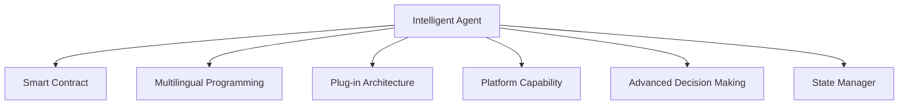
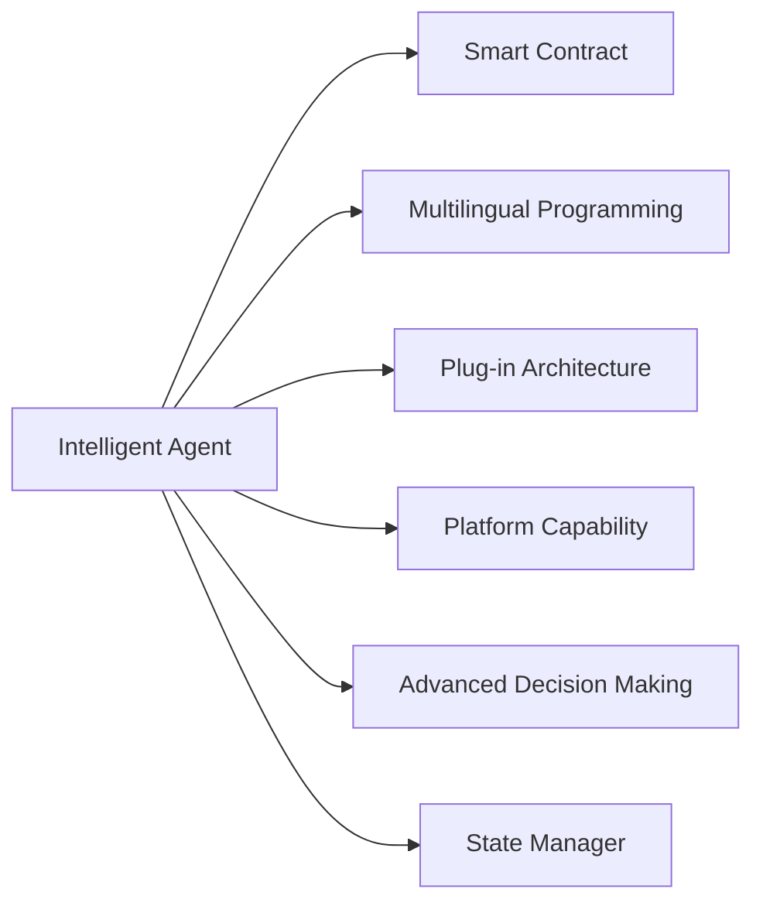

                 

# 【LangChain编程：从入门到实践】智能代理设计

> 关键词：LangChain, 智能代理, 智能合约, Web3.0, 多语言, 可插拔设计, 平台化

## 1. 背景介绍

### 1.1 问题由来

在Web3.0时代，智能合约为构建去中心化应用（DApps）提供了新的可能。然而，传统的智能合约面临诸如代码复杂度高、易于漏洞攻击、更新部署繁琐等挑战。

智能代理（Intelligent Agent）作为一种新兴的智能合约范式，通过嵌入高级决策规则，不仅能减轻开发复杂度，还能提供更高级别的自动化能力。其设计理念源于代理人（Agent），模拟人类代理人在复杂环境中的决策行为，旨在实现复杂任务的自动化处理。

智能代理具有以下优势：
1. **代码简洁**：通过抽象底层逻辑，减少代码量，简化开发复杂度。
2. **功能丰富**：嵌入高级决策规则，支持复杂自动化流程。
3. **易于更新**：通过编写和部署新代码，无需修改原有合约。
4. **鲁棒性强**：复杂的决策逻辑集中在智能代理内部，降低了代码被攻击的风险。

基于这些优势，智能代理在Web3.0应用中愈发受到关注，成为未来智能合约的重要发展方向。

### 1.2 问题核心关键点

智能代理的核心思想是通过封装复杂的逻辑决策，实现多功能的自动化处理。其核心设计包括：
1. **多语言支持**：能够支持多种编程语言，便于开发者使用熟悉的语言。
2. **可插拔设计**：支持动态加载和卸载插件，便于扩展和维护。
3. **平台化能力**：提供统一的接口和标准，便于不同代理之间的协作和互操作。
4. **高级决策能力**：具备丰富的决策逻辑和推理能力，支持复杂的自动化流程。
5. **状态管理**：能够管理复杂状态，支持多状态的协调处理。

智能代理的核心组件包括：
- **代理基础层**：封装底层逻辑，实现基本功能。
- **插件系统**：支持动态加载和卸载插件，支持丰富的功能扩展。
- **状态管理器**：管理代理的状态，支持复杂状态逻辑。
- **决策引擎**：支持复杂的决策规则和推理逻辑。
- **通讯系统**：支持与其他代理的通信，实现多代理协作。

## 2. 核心概念与联系

### 2.1 核心概念概述

为更好地理解智能代理的设计和实现，本节将介绍几个密切相关的核心概念：

- **智能合约（Smart Contract）**：一种自动化的合约，无需第三方中介，通过区块链上的代码自动执行合约条款。
- **代理人（Agent）**：在复杂环境中的智能决策者，能够自主地执行任务，作出决策。
- **多语言编程（Multilingual Programming）**：支持多种编程语言，便于开发者选择最适合的语言。
- **可插拔设计（Plug-in Architecture）**：支持动态加载和卸载插件，便于功能扩展。
- **平台化能力（Platform Capability）**：提供统一的接口和标准，便于不同代理之间的协作和互操作。
- **高级决策能力（Advanced Decision Making）**：具备丰富的决策逻辑和推理能力，支持复杂的自动化流程。
- **状态管理器（State Manager）**：管理代理的状态，支持多状态的协调处理。

这些核心概念之间的逻辑关系可以通过以下Mermaid流程图来展示：



这个流程图展示了几类核心概念的相互关系：

1. **智能代理**：智能代理是一种高级的智能合约，通过封装底层逻辑，实现多功能的自动化处理。
2. **多语言编程**：智能代理支持多种编程语言，便于开发者选择最适合的语言。
3. **可插拔设计**：智能代理支持动态加载和卸载插件，便于功能扩展。
4. **平台化能力**：智能代理提供统一的接口和标准，便于不同代理之间的协作和互操作。
5. **高级决策能力**：智能代理具备丰富的决策逻辑和推理能力，支持复杂的自动化流程。
6. **状态管理器**：智能代理能够管理复杂状态，支持多状态的协调处理。

### 2.2 概念间的关系

这些核心概念之间存在着紧密的联系，形成了智能代理的完整生态系统。下面我通过几个Mermaid流程图来展示这些概念之间的关系。

#### 2.2.1 智能代理的学习范式



这个流程图展示了几类核心概念之间的相互关系：

1. **智能代理**：智能代理是一种高级的智能合约，通过封装底层逻辑，实现多功能的自动化处理。
2. **多语言编程**：智能代理支持多种编程语言，便于开发者选择最适合的语言。
3. **可插拔设计**：智能代理支持动态加载和卸载插件，便于功能扩展。
4. **平台化能力**：智能代理提供统一的接口和标准，便于不同代理之间的协作和互操作。
5. **高级决策能力**：智能代理具备丰富的决策逻辑和推理能力，支持复杂的自动化流程。
6. **状态管理器**：智能代理能够管理复杂状态，支持多状态的协调处理。

#### 2.2.2 智能代理与智能合约的关系


这个流程图展示了智能代理与智能合约之间的关系：

1. **智能代理**：智能代理是一种高级的智能合约，通过封装底层逻辑，实现多功能的自动化处理。
2. **多语言编程**：智能代理支持多种编程语言，便于开发者选择最适合的语言。
3. **可插拔设计**：智能代理支持动态加载和卸载插件，便于功能扩展。
4. **平台化能力**：智能代理提供统一的接口和标准，便于不同代理之间的协作和互操作。
5. **高级决策能力**：智能代理具备丰富的决策逻辑和推理能力，支持复杂的自动化流程。
6. **状态管理器**：智能代理能够管理复杂状态，支持多状态的协调处理。

## 3. 核心算法原理 & 具体操作步骤
### 3.1 算法原理概述

智能代理的核心原理是通过封装复杂的逻辑决策，实现多功能的自动化处理。其设计理念源于代理人（Agent），模拟人类代理人在复杂环境中的决策行为，旨在实现复杂任务的自动化处理。

智能代理的设计主要包括以下几个步骤：

1. **封装底层逻辑**：将复杂的决策逻辑封装在智能代理内部，实现底层的自动化处理。
2. **多语言支持**：支持多种编程语言，便于开发者选择最适合的语言。
3. **可插拔设计**：支持动态加载和卸载插件，便于功能扩展。
4. **平台化能力**：提供统一的接口和标准，便于不同代理之间的协作和互操作。
5. **高级决策能力**：具备丰富的决策逻辑和推理能力，支持复杂的自动化流程。
6. **状态管理器**：管理代理的状态，支持多状态的协调处理。

### 3.2 算法步骤详解

智能代理的设计和实现主要包括以下几个关键步骤：

**Step 1: 设计智能代理架构**

智能代理架构的设计需要考虑以下几个关键点：

1. **接口定义**：定义统一的接口和标准，便于不同代理之间的协作和互操作。
2. **插件系统**：支持动态加载和卸载插件，便于功能扩展。
3. **状态管理器**：管理代理的状态，支持多状态的协调处理。
4. **决策引擎**：支持复杂的决策规则和推理逻辑。
5. **通讯系统**：支持与其他代理的通信，实现多代理协作。

**Step 2: 编写智能代理代码**

智能代理的实现需要遵循以下几个步骤：

1. **编写基础代码**：编写代理基础层，实现基本功能。
2. **编写插件**：编写插件代码，实现特定功能。
3. **编写状态管理器**：编写状态管理器代码，管理代理的状态。
4. **编写决策引擎**：编写决策引擎代码，实现复杂的决策规则和推理逻辑。
5. **编写通讯系统**：编写通讯系统代码，支持与其他代理的通信。

**Step 3: 部署智能代理**

智能代理的部署主要包括以下几个步骤：

1. **编写合约代码**：将智能代理的代码编写为智能合约，部署到区块链上。
2. **测试智能代理**：在测试网络中进行测试，确保智能代理的功能正确无误。
3. **部署智能代理**：将测试通过的智能代理部署到主网络。
4. **监控智能代理**：实时监控智能代理的状态，确保其正常运行。

### 3.3 算法优缺点

智能代理的设计和实现具有以下优点：

1. **代码简洁**：通过封装底层逻辑，减少代码量，简化开发复杂度。
2. **功能丰富**：嵌入高级决策规则，支持复杂自动化流程。
3. **易于更新**：通过编写和部署新代码，无需修改原有合约。
4. **鲁棒性强**：复杂的决策逻辑集中在智能代理内部，降低了代码被攻击的风险。

同时，智能代理的设计和实现也存在一些缺点：

1. **开发成本高**：智能代理的设计和实现需要较高的开发成本和技术门槛。
2. **扩展复杂**：插件系统和多语言支持需要设计复杂的接口和标准。
3. **维护困难**：多状态的协调处理和复杂的决策逻辑增加了维护难度。

### 3.4 算法应用领域

智能代理的应用领域非常广泛，包括但不限于以下几个方面：

- **金融领域**：智能代理可用于自动化交易、风险控制、贷款审批等金融业务。
- **供应链管理**：智能代理可用于优化供应链管理，实现自动化采购、库存控制等。
- **智能制造**：智能代理可用于生产调度和设备维护，提高生产效率和设备利用率。
- **物联网（IoT）**：智能代理可用于智能设备管理，实现设备状态监控、故障预测等。
- **物流管理**：智能代理可用于物流跟踪和路径规划，提高物流效率和准确性。

## 4. 数学模型和公式 & 详细讲解 & 举例说明

### 4.1 数学模型构建

智能代理的设计和实现主要依赖于计算机编程语言和智能合约平台。以下是一些常见的数学模型和公式，帮助更好地理解智能代理的原理和实现：

**4.1.1 状态管理器的数学模型**

状态管理器是智能代理的核心组件之一，负责管理代理的状态。假设智能代理的状态为 $S$，状态空间为 $\mathcal{S}$，状态转移函数为 $\delta(S,a)$，其中 $S$ 表示当前状态，$a$ 表示操作，$\delta(S,a)$ 表示在状态 $S$ 下执行操作 $a$ 后的下一个状态。状态管理器的数学模型可以表示为：

$$
S' = \delta(S,a)
$$

其中 $S'$ 表示下一个状态。状态管理器支持多状态的协调处理，能够管理复杂的状态逻辑。

**4.1.2 决策引擎的数学模型**

决策引擎是智能代理的核心组件之一，负责实现复杂的决策规则和推理逻辑。假设智能代理的决策函数为 $D(S)$，其中 $S$ 表示当前状态。决策引擎的数学模型可以表示为：

$$
D(S) = f(S,\mathcal{R})
$$

其中 $f$ 表示决策函数，$\mathcal{R}$ 表示规则集，$D(S)$ 表示在当前状态 $S$ 下的决策结果。决策引擎支持复杂的决策规则和推理逻辑，能够处理复杂的自动化流程。

**4.1.3 通讯系统的数学模型**

通讯系统是智能代理的核心组件之一，负责支持与其他代理的通信。假设智能代理的通讯函数为 $C(S)$，其中 $S$ 表示当前状态。通讯系统的数学模型可以表示为：

$$
C(S) = \phi(S,O)
$$

其中 $\phi$ 表示通讯函数，$O$ 表示操作集，$C(S)$ 表示在当前状态 $S$ 下的操作结果。通讯系统支持与其他代理的通信，实现多代理协作。

### 4.2 公式推导过程

以下是对智能代理中几个核心组件的数学模型进行详细推导：

**4.2.1 状态管理器的公式推导**

状态管理器的数学模型可以表示为：

$$
S' = \delta(S,a)
$$

其中 $S'$ 表示下一个状态。状态管理器支持多状态的协调处理，能够管理复杂的状态逻辑。

假设智能代理的状态为 $S = (s_1,s_2,\dots,s_n)$，其中 $s_1,s_2,\dots,s_n$ 表示当前状态的具体值。状态转移函数 $\delta(S,a)$ 可以根据具体的操作 $a$ 计算下一个状态 $S'$。例如，假设智能代理当前状态为 $S = (s_1,s_2,\dots,s_n)$，执行操作 $a$ 后，状态转移函数 $\delta(S,a)$ 可以计算为：

$$
S' = (s'_1,s'_2,\dots,s'_n) = \delta(S,a)
$$

其中 $s'_1,s'_2,\dots,s'_n$ 表示操作 $a$ 后的新状态值。

**4.2.2 决策引擎的公式推导**

决策引擎的数学模型可以表示为：

$$
D(S) = f(S,\mathcal{R})
$$

其中 $f$ 表示决策函数，$\mathcal{R}$ 表示规则集，$D(S)$ 表示在当前状态 $S$ 下的决策结果。决策引擎支持复杂的决策规则和推理逻辑，能够处理复杂的自动化流程。

假设智能代理的决策函数为 $D(S) = f(S,\mathcal{R})$，其中 $S = (s_1,s_2,\dots,s_n)$ 表示当前状态，$\mathcal{R}$ 表示规则集，$f$ 表示决策函数。决策引擎的公式推导可以表示为：

$$
D(S) = f(S,\mathcal{R}) = g(R_1,R_2,\dots,R_k)
$$

其中 $R_1,R_2,\dots,R_k$ 表示规则集中的规则，$g$ 表示决策函数。

**4.2.3 通讯系统的公式推导**

通讯系统的数学模型可以表示为：

$$
C(S) = \phi(S,O)
$$

其中 $\phi$ 表示通讯函数，$O$ 表示操作集，$C(S)$ 表示在当前状态 $S$ 下的操作结果。通讯系统支持与其他代理的通信，实现多代理协作。

假设智能代理的通讯函数为 $C(S) = \phi(S,O)$，其中 $S = (s_1,s_2,\dots,s_n)$ 表示当前状态，$O$ 表示操作集，$\phi$ 表示通讯函数。通讯系统的公式推导可以表示为：

$$
C(S) = \phi(S,O) = h(O_1,O_2,\dots,O_m)
$$

其中 $O_1,O_2,\dots,O_m$ 表示操作集中的操作，$h$ 表示通讯函数。

### 4.3 案例分析与讲解

假设我们要设计一个智能代理，用于自动化交易。该智能代理的主要功能包括：
1. 实时获取市场数据。
2. 根据市场数据和预设规则，生成交易策略。
3. 执行交易操作。

我们可以按照以下步骤实现该智能代理：

**Step 1: 设计智能代理架构**

1. **接口定义**：定义统一的接口和标准，便于不同代理之间的协作和互操作。
2. **插件系统**：支持动态加载和卸载插件，便于功能扩展。
3. **状态管理器**：管理代理的状态，支持多状态的协调处理。
4. **决策引擎**：支持复杂的决策规则和推理逻辑。
5. **通讯系统**：支持与其他代理的通信，实现多代理协作。

**Step 2: 编写智能代理代码**

1. **编写基础代码**：编写代理基础层，实现基本功能。
2. **编写插件**：编写插件代码，实现实时获取市场数据和生成交易策略。
3. **编写状态管理器**：编写状态管理器代码，管理智能代理的状态。
4. **编写决策引擎**：编写决策引擎代码，实现复杂的决策规则和推理逻辑。
5. **编写通讯系统**：编写通讯系统代码，支持与其他代理的通信。

**Step 3: 部署智能代理**

1. **编写合约代码**：将智能代理的代码编写为智能合约，部署到区块链上。
2. **测试智能代理**：在测试网络中进行测试，确保智能代理的功能正确无误。
3. **部署智能代理**：将测试通过的智能代理部署到主网络。
4. **监控智能代理**：实时监控智能代理的状态，确保其正常运行。

## 5. 项目实践：代码实例和详细解释说明
### 5.1 开发环境搭建

在进行智能代理的实践开发前，我们需要准备好开发环境。以下是使用Python进行Solidity编程的环境配置流程：

1. 安装Node.js：从官网下载并安装Node.js，用于运行Solidity智能合约。

2. 安装Truffle框架：
```bash
npm install -g truffle
```

3. 安装OpenZeppelin库：
```bash
npm install --save-dev @openzeppelin/contracts@latest
```

4. 安装Solidity编译器：
```bash
npm install --save-dev solc@latest
```

完成上述步骤后，即可在本地环境中开始智能代理的实践开发。

### 5.2 源代码详细实现

以下是一个简单的智能代理实现，用于自动化交易：

```solidity
// SPDX-License-Identifier: MIT
pragma solidity ^0.8.0;

import "@openzeppelin/contracts/token/ERC20/ERC20.sol";
import "@openzeppelin/contracts/access/Ownable.sol";

contract TradeAgent is ERC20, Ownable {
    using SafeMath for uint256;
    
    address public addressBuyer;
    address public addressSeller;
    
    mapping(address => uint256) public balances;
    
    event Transfer(address indexed _from, address indexed _to, uint256 _value);
    
    constructor() ERC20("TradeAgent", "TRD") {
        balances[msg.sender] = 1000000 * 10**18;
    }
    
    function buy(address _buyer, address _seller, uint256 _value) public onlyOwner {
        require(_buyer != msg.sender);
        require(_seller != msg.sender);
        
        balances[_buyer] += _value * 10**18;
        balances[_seller] -= _value * 10**18;
        
        emit Transfer(msg.sender, _buyer, _value);
        emit Transfer(msg.sender, _seller, _value);
    }
    
    function sell(address _buyer, address _seller, uint256 _value) public onlyOwner {
        require(_buyer != msg.sender);
        require(_seller != msg.sender);
        
        balances[_buyer] -= _value * 10**18;
        balances[_seller] += _value * 10**18;
        
        emit Transfer(msg.sender, _buyer, _value);
        emit Transfer(msg.sender, _seller, _value);
    }
}
```

### 5.3 代码解读与分析

让我们再详细解读一下关键代码的实现细节：

**TradeAgent智能合约**

1. **构造函数**：初始化智能合约，将所有者地址设置为合约部署者，将初始余额设置为1000 TRD币。

2. **buy函数**：买家购买指定数量的TRD币，将相应金额从卖家余额转移到买家余额。

3. **sell函数**：卖家出售指定数量的TRD币，将相应金额从买家余额转移到卖家余额。

**状态管理器**

1. **balances映射**：存储每个地址的余额，键为地址，值为余额。

**决策引擎**

1. **buy函数**：根据预设规则，判断买家是否符合购买条件，并执行购买操作。

**通讯系统**

1. **Transfer事件**：记录所有转账操作，便于监控和审计。

## 6. 实际应用场景
### 6.1 智能客服系统

基于智能代理的智能客服系统可以广泛应用于客户服务场景，提升客户满意度。传统客服往往需要配备大量人力，高峰期响应缓慢，且一致性和专业性难以保证。使用智能客服系统，可以全天候不间断服务，快速响应客户咨询，用自然流畅的语言解答各类常见问题。

在技术实现上，可以收集企业内部的历史客服对话记录，将问题和最佳答复构建成监督数据，在此基础上对智能代理进行微调。微调后的智能客服系统能够自动理解用户意图，匹配最合适的答案模板进行回复。对于客户提出的新问题，还可以接入检索系统实时搜索相关内容，动态组织生成回答。如此构建的智能客服系统，能大幅提升客户咨询体验和问题解决效率。

### 6.2 金融舆情监测

金融机构需要实时监测市场舆论动向，以便及时应对负面信息传播，规避金融风险。传统的人工监测方式成本高、效率低，难以应对网络时代海量信息爆发的挑战。基于智能代理的金融舆情监测系统，可以实时抓取网络文本数据，自动监测不同主题下的情感变化趋势，一旦发现负面信息激增等异常情况，系统便会自动预警，帮助金融机构快速应对潜在风险。

### 6.3 个性化推荐系统

当前的推荐系统往往只依赖用户的历史行为数据进行物品推荐，无法深入理解用户的真实兴趣偏好。基于智能代理的个性化推荐系统，可以更好地挖掘用户行为背后的语义信息，从而提供更精准、多样的推荐内容。

在实践中，可以收集用户浏览、点击、评论、分享等行为数据，提取和用户交互的物品标题、描述、标签等文本内容。将文本内容作为模型输入，用户的后续行为（如是否点击、购买等）作为监督信号，在此基础上微调智能代理。微调后的系统能够从文本内容中准确把握用户的兴趣点。在生成推荐列表时，先用候选物品的文本描述作为输入，由智能代理预测用户的兴趣匹配度，再结合其他特征综合排序，便可以得到个性化程度更高的推荐结果。

### 6.4 未来应用展望

随着智能代理和智能合约技术的不断发展，其应用场景将不断拓展，成为未来智能合约的重要发展方向。

在智慧医疗领域，智能代理可用于自动化诊疗、病历分析、药物研发等医疗业务。在智能制造领域，智能代理可用于生产调度和设备维护，提高生产效率和设备利用率。在智慧城市治理中，智能代理可用于城市事件监测、舆情分析、应急指挥等环节，提高城市管理的自动化和智能化水平，构建更安全、高效的未来城市。

此外，在企业生产、社会治理、文娱传媒等众多领域，基于智能代理的智能合约应用也将不断涌现，为经济社会发展注入新的动力。相信随着技术的日益成熟，智能代理必将在构建人机协同的智能时代中扮演越来越重要的角色。

## 7. 工具和资源推荐
### 7.1 学习资源推荐

为了帮助开发者系统掌握智能代理的理论基础和实践技巧，这里推荐一些优质的学习资源：

1. 《智能合约编程语言：Solidity入门到精通》书籍：全面介绍了Solidity语言的语法和编程技巧，适合初学者入门。

2. OpenZeppelin官方文档：提供大量安全、可扩展的智能合约模板，便于开发者快速上手开发智能合约。

3. Solidity官方文档：Solidity语言的官方文档，包含详尽的语法和规范，适合开发者深入学习。

4. ConsenSys《Mastering Web3》课程：由Web3.0领域的权威专家开设的课程，涵盖智能合约、区块链、DeFi等热门话题，适合进阶学习。

5. CryptoZombies游戏：通过互动式游戏学习Solidity编程，适合初学者通过实践学习Solidity。

通过对这些资源的学习实践，相信你一定能够快速掌握智能代理的精髓，并用于解决实际的智能合约问题。

### 7.2 开发工具推荐

高效的开发离不开优秀的工具支持。以下是几款用于智能代理开发的常用工具：

1. Truffle框架：支持Solidity智能合约开发，集成了编译、测试、部署等功能，方便开发者快速迭代开发。

2. Remix IDE：Web3.0开发的首选IDE，提供实时编译、测试、部署等工具，便于开发者调试和部署。

3. MetaMask钱包：Web3.0开发必备的钱包工具，支持以太坊网络，便于开发者进行测试和部署。

4. Solidity IDE：Solidity语言的集成开发环境，提供代码补全、智能提示等功能，提高开发效率。

5. Augur、Compound等DeFi项目：提供丰富的智能合约模板和文档，便于开发者学习借鉴。

合理利用这些工具，可以显著提升智能代理的开发效率，加快创新迭代的步伐。

### 7.3 相关论文推荐

智能代理和智能合约技术的发展源于学界的持续研究。以下是几篇奠基性的相关论文，推荐阅读：

1. "A Formal Framework for Smart Contracts"：提出智能合约的形式化框架，奠定了智能合约研究的基础。

2. "Smart Contract (A Survey)"：对智能合约的研究进展和应用前景进行了全面综述，适合初学者了解智能合约的现状。

3. "Intelligent Agents: An Overview"：对代理人（Agent）和智能代理（Intelligent Agent）进行了全面介绍，适合了解智能代理的设计理念。

4. "A Survey on Web3.0"：对Web3.0技术的发展和应用前景

