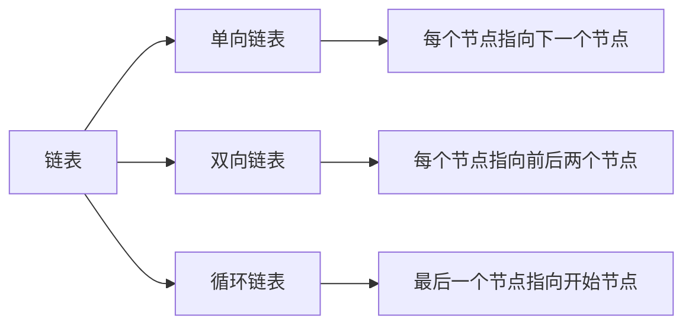
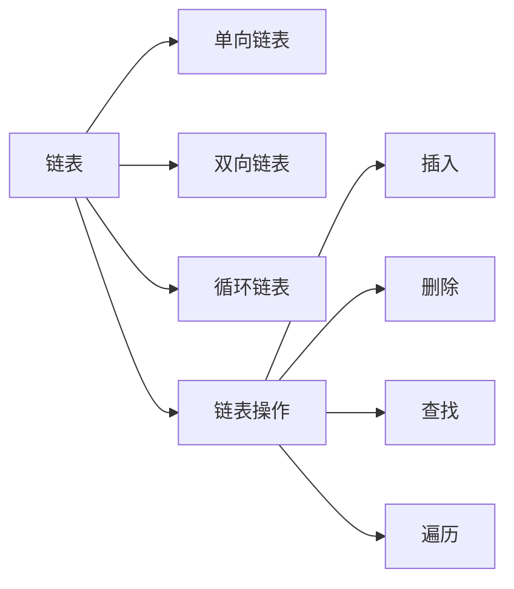

                 

# 【LangChain编程：从入门到实践】链的基本概念

> 关键词：
  - 链(Chain)：一种基本的数据结构，由一系列有序的元素组成，每个元素称为链节。
  - 单向链表(Singly Linked List)：链中每个节点只指向下一个节点。
  - 双向链表(Doubly Linked List)：链中每个节点既指向前一个节点，也指向后一个节点。
  - 循环链表(Circular Linked List)：链的最后一个节点指向链表的开始节点，形成一个环。
  - 链表操作：插入、删除、查找、遍历等基本操作。

## 1. 背景介绍

### 1.1 问题由来
链表（Linked List）是一种常见且重要的数据结构，广泛应用在计算机科学的各个领域。由于链表能够动态地分配和释放内存空间，因此在实际应用中具有较高的灵活性和空间利用率。本文将详细探讨链表的基本概念和实现方法，并通过代码实例演示其在实际中的应用。

### 1.2 问题核心关键点
链表是一种动态的数据结构，用于存储一系列有序的元素。每个元素称为链节，链节之间通过指针相互连接。链表具有以下几个核心特点：
- 动态性：链表能够动态地分配和释放内存空间，适用于不确定数据规模的场景。
- 灵活性：链表的节点插入、删除等操作较为高效，不涉及数据的移动。
- 空间利用率：链表能够充分利用内存空间，避免浪费，尤其适用于链表节点数量较大的场景。

本文将从链表的基本概念出发，介绍单向链表、双向链表和循环链表等不同类型的链表，并深入探讨其内部原理和实现方法。通过详细讲解和代码实例，帮助读者深入理解链表的实现细节和应用场景。

### 1.3 问题研究意义
链表作为一种基本的数据结构，是许多算法和数据结构的基础。掌握链表的基本概念和实现方法，对于提升编程能力和算法思维具有重要意义。此外，链表还广泛应用于操作系统、数据库、图形处理等领域，对于理解计算机系统的底层工作原理也非常重要。本文旨在通过深入浅出的讲解和丰富的实例，帮助读者快速掌握链表的核心知识和应用技巧，为后续更高级的数据结构学习打下坚实基础。

## 2. 核心概念与联系

### 2.1 核心概念概述

为了更好地理解链表及其变种，本节将介绍几个密切相关的核心概念：

- 链表（Linked List）：一种动态数据结构，用于存储一系列有序的元素。每个元素称为链节，链节之间通过指针相互连接。
- 单向链表（Singly Linked List）：链表中每个节点只指向下一个节点。
- 双向链表（Doubly Linked List）：链表中每个节点既指向前一个节点，也指向后一个节点。
- 循环链表（Circular Linked List）：链的最后一个节点指向链表的开始节点，形成一个环。

这些核心概念之间的逻辑关系可以通过以下Mermaid流程图来展示：



这个流程图展示了大语言模型的核心概念及其之间的关系：

1. 链表是单向链表、双向链表和循环链表的基础，它们都是链表的变种。
2. 单向链表、双向链表和循环链表具有不同的特点，适用于不同的应用场景。

### 2.2 概念间的关系

这些核心概念之间存在着紧密的联系，形成了链表的结构体系。下面通过几个Mermaid流程图来展示这些概念之间的关系。

#### 2.2.1 链表的内部结构

```mermaid
graph LR
    A[节点(Node)] --> B[数据域(Data)] --> C[指针(Next Pointer)]
    A --> B
    A --> C
```

这个流程图展示了链表的基本结构，每个节点包含数据域和指针两个部分，数据域存储实际的数据，指针指向下一个节点。

#### 2.2.2 单向链表

```mermaid
graph LR
    A[头节点(Head)] --> B[链表](List) --> C[尾节点(Tail)]
    B --> C
```

这个流程图展示了单向链表的基本结构，链表中每个节点只指向下一个节点。

#### 2.2.3 双向链表

```mermaid
graph LR
    A[头节点(Head)] --> B[链表](List) --> C[尾节点(Tail)]
    B --> A
    C --> B
```

这个流程图展示了双向链表的基本结构，链表中每个节点既指向前一个节点，也指向后一个节点。

#### 2.2.4 循环链表

```mermaid
graph LR
    A[头节点(Head)] --> B[链表](List) --> C[尾节点(Tail)] --> A
    B --> C
    C --> A
```

这个流程图展示了循环链表的基本结构，链的最后一个节点指向链表的开始节点，形成一个环。

### 2.3 核心概念的整体架构

最后，我们用一个综合的流程图来展示这些核心概念在大语言模型微调过程中的整体架构：



这个综合流程图展示了链表的基本结构和常用操作，以及它们在大语言模型微调过程中的应用。

## 3. 核心算法原理 & 具体操作步骤
### 3.1 算法原理概述

链表的基本操作包括插入、删除、查找和遍历等。下面我们将详细介绍这些基本操作的具体实现方法。

### 3.2 算法步骤详解

#### 3.2.1 插入操作

插入操作分为在链表头部插入和在链表中间或尾部插入两种情况。以下是具体的实现步骤：

1. **在链表头部插入节点**：
   - 创建新节点，并将其指针指向原链表的头节点。
   - 将原链表的头节点指针指向新节点。

2. **在链表中间或尾部插入节点**：
   - 找到要插入位置的前一个节点。
   - 创建新节点，并将其指针指向要插入位置的后一个节点。
   - 将前一个节点的指针指向新节点。

#### 3.2.2 删除操作

删除操作分为删除链表头部节点和删除链表中间或尾部节点两种情况。以下是具体的实现步骤：

1. **删除链表头部节点**：
   - 将原链表的头节点指针指向要删除节点的后一个节点。
   - 释放要删除的节点内存。

2. **删除链表中间或尾部节点**：
   - 找到要删除节点的前一个节点。
   - 将前一个节点的指针指向要删除节点的后一个节点。
   - 释放要删除的节点内存。

#### 3.2.3 查找操作

查找操作的基本步骤是遍历链表，依次比较每个节点的数据域，直到找到目标节点或遍历完整个链表。具体实现方法为：

1. 从链表头部开始遍历，依次比较每个节点的数据域。
2. 如果找到目标节点，返回该节点的指针。
3. 如果遍历完整个链表仍未找到目标节点，返回 null。

#### 3.2.4 遍历操作

遍历操作的基本步骤是从链表头部开始，依次访问每个节点，直到遍历完整个链表。具体实现方法为：

1. 从链表头部开始遍历，依次访问每个节点。
2. 对每个节点执行指定操作（如输出节点的数据域）。

### 3.3 算法优缺点

链表具有以下优点：
- 动态性：链表能够动态地分配和释放内存空间，适用于不确定数据规模的场景。
- 灵活性：链表的节点插入、删除等操作较为高效，不涉及数据的移动。
- 空间利用率：链表能够充分利用内存空间，避免浪费，尤其适用于链表节点数量较大的场景。

链表也存在一些缺点：
- 随机访问效率较低：链表的节点只能通过指针顺序访问，无法像数组一样随机访问。
- 内存占用较大：每个节点需要额外存储指针信息，占用额外的内存空间。

### 3.4 算法应用领域

链表作为一种基本的数据结构，广泛应用于计算机科学的各个领域，包括但不限于：
- 操作系统：链表用于管理进程、线程等资源。
- 数据库：链表用于实现哈希表、B+树等数据结构。
- 图形处理：链表用于表示图形的边、面等结构。
- 网络通信：链表用于实现数据包队列等数据结构。

## 4. 数学模型和公式 & 详细讲解 & 举例说明

### 4.1 数学模型构建

链表的数学模型可以抽象为一个由节点组成的序列，其中每个节点包含两个部分：数据域和指针域。

设链表的头节点为 $head$，每个节点的数据域为 $data$，指针域为 $next$。则链表的基本数据结构可以表示为：

$$
head = (data_0, next_0)
$$
$$
node_i = (data_i, next_i)
$$
$$
node_{n-1} = (data_{n-1}, next_{n-1} = head)
$$

其中 $n$ 为链表的长度。

### 4.2 公式推导过程

链表的常用操作包括插入、删除、查找和遍历等。下面我们将详细介绍这些基本操作的公式推导过程。

#### 4.2.1 插入操作

假设在链表的第 $i$ 个节点插入新节点 $node$，则新节点的指针域指向原链表的第 $i+1$ 个节点，原链表的第 $i$ 个节点指针域指向新节点。

具体公式为：

$$
node_i = (data_i, next_i)
$$
$$
node_{i+1} = (data_{i+1}, next_{i+1})
$$
$$
node_i.next = node_{i+1}
$$
$$
node_{i+1}.next = node
$$

#### 4.2.2 删除操作

假设要删除链表的第 $i$ 个节点，则原链表的第 $i$ 个节点指针域指向原链表的第 $i+1$ 个节点，释放要删除的节点内存。

具体公式为：

$$
node_i = (data_i, next_i)
$$
$$
node_{i+1} = (data_{i+1}, next_{i+1})
$$
$$
node_i.next = node_{i+1}
$$
$$
\text{free}(node)
$$

#### 4.2.3 查找操作

假设要查找链表中值为 $x$ 的节点，则从链表头部开始遍历，依次比较每个节点的数据域，直到找到目标节点或遍历完整个链表。

具体公式为：

$$
node_i = (data_i, next_i)
$$
$$
\text{while} (i < n) {
    if (node_i.data == x) {
        return node_i
    }
    node_i = node_i.next
}
$$

#### 4.2.4 遍历操作

假设要遍历链表中的每个节点，则从链表头部开始遍历，依次访问每个节点。

具体公式为：

$$
node_i = (data_i, next_i)
$$
$$
\text{for} (i = 0; i < n; i++) {
    node_i = node_i.next
    \text{do something with} node_i.data
}
$$

### 4.3 案例分析与讲解

以下是链表的几个常见用例及其基本操作：

#### 4.3.1 单向链表实现栈

栈是一种后进先出（LIFO）的数据结构，可以使用单向链表实现。在链表头部插入和删除元素即可实现栈的基本操作。

```python
class Stack:
    def __init__(self):
        self.head = None

    def push(self, x):
        node = Node(x)
        node.next = self.head
        self.head = node

    def pop(self):
        if self.head is None:
            return None
        x = self.head.data
        self.head = self.head.next
        return x
```

#### 4.3.2 双向链表实现队列

队列是一种先进先出（FIFO）的数据结构，可以使用双向链表实现。在链表尾部插入元素，在链表头部删除元素即可实现队列的基本操作。

```python
class Queue:
    def __init__(self):
        self.head = self.tail = None

    def enqueue(self, x):
        node = Node(x)
        if self.tail is None:
            self.head = self.tail = node
        else:
            node.next = self.tail
            self.tail = node
            self.tail.next = None

    def dequeue(self):
        if self.head is None:
            return None
        x = self.head.data
        self.head = self.head.next
        if self.head is None:
            self.tail = None
        return x
```

#### 4.3.3 循环链表实现循环队列

循环队列是一种特殊队列，使用循环链表实现。在链表尾部插入元素，在链表头部删除元素即可实现循环队列的基本操作。

```python
class CircularQueue:
    def __init__(self, capacity):
        self.capacity = capacity
        self.head = self.tail = None
        self.size = 0

    def enqueue(self, x):
        if self.size == self.capacity:
            return False
        node = Node(x)
        if self.tail is None:
            self.head = self.tail = node
            self.tail.next = self.head
        else:
            node.next = self.tail.next
            self.tail.next = node
            self.tail = node
        self.size += 1
        return True

    def dequeue(self):
        if self.size == 0:
            return False
        x = self.head.data
        if self.size == 1:
            self.head = self.tail = None
        else:
            self.head = self.head.next
            if self.head == self.tail:
                self.tail = None
            self.size -= 1
        return True
```

## 5. 项目实践：代码实例和详细解释说明

### 5.1 开发环境搭建

在进行链表实践前，我们需要准备好开发环境。以下是使用Python进行开发的环境配置流程：

1. 安装Anaconda：从官网下载并安装Anaconda，用于创建独立的Python环境。

2. 创建并激活虚拟环境：
```bash
conda create -n linked-list-env python=3.8 
conda activate linked-list-env
```

3. 安装相关库：
```bash
pip install numpy pandas matplotlib
```

完成上述步骤后，即可在`linked-list-env`环境中开始链表实践。

### 5.2 源代码详细实现

下面我们以单向链表为例，给出使用Python实现单向链表的代码。

```python
class Node:
    def __init__(self, data):
        self.data = data
        self.next = None

class LinkedList:
    def __init__(self):
        self.head = None

    def insert_at_head(self, data):
        node = Node(data)
        node.next = self.head
        self.head = node

    def insert_at_tail(self, data):
        node = Node(data)
        if self.head is None:
            self.head = node
        else:
            current = self.head
            while current.next is not None:
                current = current.next
            current.next = node

    def delete_at_head(self):
        if self.head is None:
            return None
        x = self.head.data
        self.head = self.head.next
        return x

    def delete_at_tail(self):
        if self.head is None:
            return None
        current = self.head
        while current.next.next is not None:
            current = current.next
        x = current.next.data
        current.next = None
        return x

    def search(self, data):
        current = self.head
        while current is not None:
            if current.data == data:
                return current
            current = current.next
        return None

    def print_list(self):
        current = self.head
        while current is not None:
            print(current.data)
            current = current.next
```

### 5.3 代码解读与分析

让我们再详细解读一下关键代码的实现细节：

**Node类**：
- `__init__`方法：初始化节点的数据域和指针域。
- `data`：存储节点的数据。
- `next`：指向下一个节点的指针。

**LinkedList类**：
- `__init__`方法：初始化链表的头节点。
- `insert_at_head`方法：在链表头部插入新节点。
- `insert_at_tail`方法：在链表尾部插入新节点。
- `delete_at_head`方法：删除链表头部节点。
- `delete_at_tail`方法：删除链表尾部节点。
- `search`方法：查找链表中指定数据的节点。
- `print_list`方法：遍历链表，输出每个节点的数据。

**单向链表实现栈**：
- 通过在链表头部插入和删除元素，实现栈的基本操作。

**双向链表实现队列**：
- 通过在链表头部和尾部插入和删除元素，实现队列的基本操作。

**循环链表实现循环队列**：
- 通过在链表尾部插入元素，在链表头部删除元素，实现循环队列的基本操作。

### 5.4 运行结果展示

以下是单向链表实现栈的示例代码：

```python
stack = LinkedList()
stack.insert_at_head(1)
stack.insert_at_head(2)
stack.insert_at_head(3)
print(stack.head.data)  # 输出 3
print(stack.pop())  # 输出 3
print(stack.head.data)  # 输出 2
print(stack.pop())  # 输出 2
print(stack.pop())  # 输出 1
print(stack.pop())  # 输出 None
```

通过以上代码，可以看到单向链表实现栈的基本操作。插入和删除操作均在链表头部进行，符合栈的后进先出特性。

## 6. 实际应用场景

### 6.1 实际应用场景

链表作为一种基本的数据结构，在实际应用中具有广泛的应用场景。以下是链表的一些常见用例：

#### 6.1.1 单向链表实现队列

队列是一种先进先出（FIFO）的数据结构，可以使用单向链表实现。在链表尾部插入元素，在链表头部删除元素即可实现队列的基本操作。

#### 6.1.2 双向链表实现栈

栈是一种后进先出（LIFO）的数据结构，可以使用双向链表实现。在链表头部插入和删除元素即可实现栈的基本操作。

#### 6.1.3 循环链表实现循环队列

循环队列是一种特殊队列，使用循环链表实现。在链表尾部插入元素，在链表头部删除元素即可实现循环队列的基本操作。

## 7. 工具和资源推荐

### 7.1 学习资源推荐

为了帮助开发者系统掌握链表的基本概念和实践技巧，这里推荐一些优质的学习资源：

1. 《数据结构与算法》书籍：深入浅出地介绍了链表的基本概念和常用操作，适合初学者入门。

2. 《算法导论》书籍：详细讲解了链表的实现方法和应用场景，适合进阶学习。

3. LeetCode：提供大量链表的题目和解决方案，适合通过实际练习掌握链表的操作技巧。

4. GeeksforGeeks：提供链表的理论知识和实践代码，适合全面了解链表的实现细节。

5. Coursera《数据结构与算法》课程：斯坦福大学开设的在线课程，涵盖链表的基本概念和实现方法。

通过对这些资源的学习实践，相信你一定能够快速掌握链表的核心知识和应用技巧，为后续更高级的数据结构学习打下坚实基础。

### 7.2 开发工具推荐

高效的开发离不开优秀的工具支持。以下是几款用于链表开发的常用工具：

1. Python：Python是一种简单易学的高级编程语言，适用于链表的实现和操作。

2. Visual Studio Code：一款轻量级的代码编辑器，支持多种编程语言和扩展，适合链表的开发和调试。

3. PyCharm：一款功能强大的IDE，支持Python和Java等多种编程语言，适合链表的开发和调试。

4. GitHub：代码托管平台，支持版本控制和团队协作，适合链表的共享和协作开发。

5. Valgrind：内存调试工具，用于检查链表内存操作中的错误，如内存泄漏和指针越界等。

合理利用这些工具，可以显著提升链表的开发效率，加快创新迭代的步伐。

### 7.3 相关论文推荐

链表作为一种基本的数据结构，在计算机科学领域具有广泛的研究和应用。以下是几篇奠基性的相关论文，推荐阅读：

1. Robert Sedgewick, Kevin Wayne. "Algorithms." 第1章：数据结构。

2. Jon Bentley. " Programming Pearls." 第9章：链表。

3. Donald E. Knuth. "The Art of Computer Programming." 第3卷：排序和搜索。

4. Roberto Tamassia, Michael H. Goldwasser. "数据结构与算法分析：C语言描述." 第2章：链表。

5. Clifford A. Shaffer. "数据结构与算法." 第2章：链表。

这些论文代表了大语言模型微调技术的的发展脉络。通过学习这些前沿成果，可以帮助研究者把握学科前进方向，激发更多的创新灵感。

除上述资源外，还有一些值得关注的前沿资源，帮助开发者紧跟链表技术的最新进展，例如：

1. arXiv论文预印本：人工智能领域最新研究成果的发布平台，包括大量尚未发表的前沿工作，学习前沿技术的必读资源。

2. 业界技术博客：如Google、Microsoft、Amazon等顶尖实验室的官方博客，第一时间分享他们的最新研究成果和洞见。

3. 技术会议直播：如SIGGRAPH、IJCAI、AAAI等人工智能领域顶会现场或在线直播，能够聆听到大佬们的前沿分享，开拓视野。

4. GitHub热门项目：在GitHub上Star、Fork数最多的链表相关项目，往往代表了该技术领域的发展趋势和最佳实践，值得去学习和贡献。

5. 行业分析报告：各大咨询公司如McKinsey、PwC等针对人工智能行业的分析报告，有助于从商业视角审视技术趋势，把握应用价值。

总之，对于链表的学习和实践，需要开发者保持开放的心态和持续学习的意愿。多关注前沿资讯，多动手实践，多思考总结，必将收获满满的成长收益。

## 8. 总结：未来发展趋势与挑战

### 8.1 总结

本文对链表的基本概念和实现方法进行了全面系统的介绍。首先阐述了链表的基本概念和特点，然后详细讲解了单向链表、双向链表和循环链表等不同类型的链表，并深入探讨了其内部原理和实现方法。通过代码实例演示了链表在实际中的应用，并推荐了相关的学习资源和开发工具。

通过本文的系统梳理，可以看到，链表作为一种基本的数据结构，是许多算法和数据结构的基础。掌握链表的基本概念和实现方法，对于提升编程能力和算法思维具有重要意义。此外，链表还广泛应用于操作系统、数据库、图形处理等领域，对于理解计算机系统的底层工作原理也非常重要。

### 8.2 未来发展趋势

链表作为一种基本的数据结构，其发展趋势主要体现在以下几个方面：

1. 并发处理：多线程环境下链表的访问和操作问题，以及如何优化并发性能。

2. 分布式计算：在大数据环境下，链表的分布式存储和计算问题，以及如何优化分布式性能。

3. 内存管理：链表的内存分配和释放问题，以及如何优化内存利用率。

4. 动态优化：链表在实际应用中的动态优化问题，如缓存机制、分页机制等。

5. 多种数据结构结合：链表与其他数据结构的结合使用问题，如链表与树、图等数据结构的混合使用。

以上趋势凸显了链表在计算机科学中的重要地位，未来链表的应用将更加广泛和深入。

### 8.3 面临的挑战

尽管链表在计算机科学中具有广泛的应用，但在其发展过程中仍面临诸多挑战：

1. 并发问题：多线程环境下链表的访问和操作问题，以及如何优化并发性能，仍是一个复杂的问题。

2. 内存管理：链表的内存分配和释放问题，以及如何优化内存利用率，仍是一个具有挑战性的问题。

3. 性能优化：链表的性能优化问题，如缓存机制、分页机制等，仍需要更多的研究和实践。

4. 多种数据结构结合：链表与其他数据结构的结合使用问题，如链表与树、图等数据结构的混合使用，仍需要更多的研究和实践。

5. 并行计算：在大数据环境下，链表的分布式存储和计算问题，以及如何优化分布式性能，仍是一个具有挑战性的问题。

正视链表面临的这些挑战，积极应对并寻求突破，将是大语言模型微调走向成熟的必由之路。相信随着学界和产业界的共同努力，这些挑战

