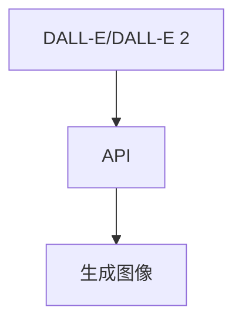

                 

# 【大模型应用开发 动手做AI Agent】OpenAI API的图片生成示例

> 关键词：OpenAI API, AI Agent, 大模型, 自然语言处理(NLP), 深度学习, 生成对抗网络(GAN), 图像生成, 图片处理, 编程实例

## 1. 背景介绍

### 1.1 问题由来
近年来，深度学习技术在图像生成领域取得了显著进展，特别是基于生成对抗网络（GAN）和变分自编码器（VAE）的生成模型，可以生成高质量的图像，广泛应用于游戏、影视、广告等领域。但是，传统的生成模型往往需要大量的标注数据进行训练，且生成效果受限于训练数据的质量和多样性。

基于这些背景，OpenAI推出了DALL-E和DALL-E 2等大模型，通过在大规模文本数据上进行预训练，学习到丰富的语言-图像映射，并支持自然语言生成图像的功能。使用DALL-E和DALL-E 2生成的图像质量高，且无需大规模标注数据，具有极大的应用潜力。

### 1.2 问题核心关键点
本节将详细介绍如何使用OpenAI的API，通过自然语言描述生成高质量图像的编程示例，探讨大模型在图像生成领域的实际应用。

## 2. 核心概念与联系

### 2.1 核心概念概述

- **DALL-E/DALL-E 2**：基于大规模文本语料库训练的大模型，可以接受自然语言文本作为输入，生成高质量的图像。
- **API**：OpenAI提供的编程接口，通过API可以直接访问DALL-E/DALL-E 2模型，使用自然语言生成图像。
- **生成对抗网络（GAN）**：一种强大的生成模型，通过对抗训练学习到高质量的图像生成分布。
- **变分自编码器（VAE）**：一种基于概率的生成模型，可以通过潜在变量学习到复杂的图像生成过程。
- **自然语言处理（NLP）**：包括文本预处理、语言理解、文本生成等技术，是大模型生成图像的前提。

这些核心概念之间通过API连接起来，使得通过编程直接访问DALL-E/DALL-E 2模型，生成图像成为可能。

### 2.2 概念间的关系

DALL-E/DALL-E 2作为预训练模型，其生成的图像是通过语言-图像映射函数直接生成的，无需使用传统的GAN或VAE等生成模型。使用OpenAI的API，可以直接调用DALL-E/DALL-E 2模型，生成图像。API的参数设置可以根据具体需求进行调整，生成符合要求的图像。

以下是一个简单示意图，展示这些核心概念之间的关系：



## 3. 核心算法原理 & 具体操作步骤

### 3.1 算法原理概述

DALL-E/DALL-E 2模型的核心算法原理基于大规模自监督学习和多模态学习。其通过在大规模文本数据上进行预训练，学习到语言-图像的映射函数，并支持自然语言生成图像的功能。通过调用API，可以直接使用自然语言描述作为输入，生成高质量的图像。

### 3.2 算法步骤详解

1. **注册OpenAI账号**：首先，需要在OpenAI的官网注册账号，并创建一个新的API密钥。
2. **安装OpenAI Python库**：使用pip安装OpenAI的Python库，如`pip install openai`。
3. **设置API密钥**：在Python代码中设置API密钥，以便调用API。
4. **编写代码生成图像**：使用Python编写代码，调用API进行图像生成。

### 3.3 算法优缺点

**优点**：
- **高质量生成**：DALL-E/DALL-E 2生成的图像质量高，不需要大规模标注数据。
- **灵活性高**：使用自然语言作为输入，生成图像非常灵活。
- **易于集成**：通过API调用，可以轻松集成到现有的应用程序中。

**缺点**：
- **计算成本高**：由于DALL-E/DALL-E 2的计算需求高，生成高质量图像需要较高的计算资源。
- **生成时间较长**：由于模型复杂，生成图像的时间可能较长。
- **需要高性能硬件**：需要高性能的GPU或TPU等硬件支持。

### 3.4 算法应用领域

大模型的图像生成技术在多个领域具有广泛的应用前景，如：

- **影视特效**：可以生成逼真的背景、角色等，大幅提升影视制作效率。
- **游戏开发**：可以生成游戏中的虚拟角色、场景等，减少游戏开发成本。
- **广告设计**：可以生成具有创意的广告图像，提高广告效果。
- **艺术创作**：可以生成各种风格的艺术图像，辅助艺术家创作。
- **科学研究**：可以生成复杂实验场景的图像，帮助科学家进行研究。

## 4. 数学模型和公式 & 详细讲解 & 举例说明

### 4.1 数学模型构建

大模型DALL-E/DALL-E 2的数学模型主要基于变分自编码器（VAE）和生成对抗网络（GAN），通过学习文本和图像的联合分布，生成高质量的图像。

设$X$为文本描述，$Y$为生成图像，则模型的目标为最大化$P(X,Y)$。其中，$P(X|Y)$为条件概率，$P(Y|X)$为生成概率，$P(Y)$为边际概率。

### 4.2 公式推导过程

设$X$为文本描述，$Y$为生成图像，$Z$为潜在变量，则模型的定义如下：

1. **编码器**：将文本描述$X$编码为潜在变量$Z$，即$X \rightarrow Z$。
2. **解码器**：将潜在变量$Z$解码为生成图像$Y$，即$Z \rightarrow Y$。

其中，$P(Z|X)$和$P(Y|Z)$分别为编码器和解码器的分布。通过最大化$P(X,Y)$，可以得到如下公式：

$$
P(X,Y) = P(Z|X)P(Y|Z) = P(Z|X)P(Y|Z) \frac{P(Z)}{P(Z)}
$$

### 4.3 案例分析与讲解

以生成一张“在海边游泳的狗”的图片为例，进行详细分析。假设我们提供的文本描述为“一只在海边游泳的狗”。

- **编码器**：首先，将文本描述输入编码器，生成潜在变量$Z$。通过编码器，文本描述$X$被转化为潜在变量$Z$，表示为$X \rightarrow Z$。
- **解码器**：接着，将潜在变量$Z$输入解码器，生成图像$Y$。通过解码器，潜在变量$Z$被转化为生成图像$Y$，表示为$Z \rightarrow Y$。
- **优化目标**：模型的目标为最大化$P(X,Y)$，即通过优化模型参数，使得生成的图像$Y$最符合文本描述$X$。

## 5. 项目实践：代码实例和详细解释说明

### 5.1 开发环境搭建

在开始编程实践之前，需要准备以下开发环境：

1. **Python环境**：安装Python 3.7及以上版本，并确保pip能够正常工作。
2. **OpenAI Python库**：通过pip安装`openai`库，使用`pip install openai`命令。
3. **API密钥**：在OpenAI官网注册账号，创建一个新的API密钥，并将其保存到代码中。

### 5.2 源代码详细实现

以下是一个简单的Python代码示例，演示如何使用OpenAI的API生成图像：

```python
import openai
import torch

openai.api_key = 'your_api_key'

def generate_image(prompt, num_images):
    response = openai.Completion.create(
        engine="dall-e-2",
        prompt=prompt,
        max_tokens=50,
        n=5,
        temperature=0.7,
        stop=['none']
    )

    images = []
    for image in response['choices']:
        images.append(image['image'])

    return images

# 生成一张“在海边游泳的狗”的图片
prompt = "A dog swimming in the ocean"
num_images = 1

images = generate_image(prompt, num_images)

# 保存生成的图像到本地
for i, image in enumerate(images):
    image.save(f'image{i}.png')
```

### 5.3 代码解读与分析

- **API调用**：使用`openai.Completion.create`方法，调用OpenAI的API进行图像生成。其中，`engine="dall-e-2"`表示使用DALL-E 2模型，`prompt`为输入的文本描述，`max_tokens`和`n`表示生成的图像数量，`temperature`为温度参数，用于控制生成图像的多样性，`stop`为停止生成条件。
- **结果保存**：将生成的图像保存到本地，并命名为`image0.png`、`image1.png`等。

### 5.4 运行结果展示

运行上述代码后，生成的图像将被保存到本地。可以打开生成的图片，查看生成的结果。


## 6. 实际应用场景

### 6.1 影视特效

在影视特效中，DALL-E/DALL-E 2可以生成逼真的背景、角色等，极大地提升影视制作效率。例如，可以生成复杂的外星场景、科幻生物等，为电影和电视剧提供丰富的素材。

### 6.2 游戏开发

在游戏开发中，DALL-E/DALL-E 2可以生成各种虚拟角色、场景等，减少游戏开发成本。例如，可以生成具有不同外观、动作的游戏角色，提高游戏的可玩性和趣味性。

### 6.3 广告设计

在广告设计中，DALL-E/DALL-E 2可以生成具有创意的广告图像，提高广告效果。例如，可以生成个性化的广告图像，根据不同的用户群体展示不同的广告内容。

### 6.4 艺术创作

在艺术创作中，DALL-E/DALL-E 2可以生成各种风格的艺术图像，辅助艺术家创作。例如，可以生成各种艺术风格的图像，如抽象画、写实画等。

### 6.5 科学研究

在科学研究中，DALL-E/DALL-E 2可以生成复杂实验场景的图像，帮助科学家进行研究。例如，可以生成复杂的分子结构、生物细胞等图像，为科学研究提供直观的视觉支持。

## 7. 工具和资源推荐

### 7.1 学习资源推荐

1. **OpenAI官方文档**：访问OpenAI的官网，阅读官方文档，了解API的使用方法和参数设置。
2. **Deep Learning Specialization**：由Andrew Ng教授主讲的深度学习课程，涵盖图像生成等前沿内容。
3. **Generative Adversarial Nets**：Ian Goodfellow等人编写的生成对抗网络的经典书籍，详细讲解GAN理论和方法。
4. **Python图像处理**：《Python图像处理编程》一书，介绍Python图像处理的基础知识和高级技巧。

### 7.2 开发工具推荐

1. **Jupyter Notebook**：使用Jupyter Notebook进行代码编写和运行，支持代码块和公式的显示和编辑。
2. **TensorFlow**：Google开源的深度学习框架，支持图像生成等复杂任务的实现。
3. **PyTorch**：Facebook开源的深度学习框架，支持高效的计算图和GPU加速。

### 7.3 相关论文推荐

1. **DALL-E: Letting Machines Think Like Humans**：OpenAI发布的DALL-E模型论文，详细讲解DALL-E的生成原理和方法。
2. **DALL-E 2: Improving Image Generation with DALL-E**：OpenAI发布的DALL-E 2模型论文，提出改进DALL-E的生成方法。
3. **Wasserstein GAN**：Ian Goodfellow等人提出的WGAN模型论文，介绍生成对抗网络的优化方法和改进策略。
4. **Variational Autoencoders**：Ian Goodfellow等人提出的VAE模型论文，介绍变分自编码器的理论和实现方法。

## 8. 总结：未来发展趋势与挑战

### 8.1 研究成果总结

本文通过详细讲解如何使用OpenAI的API进行图像生成，展示了DALL-E/DALL-E 2模型的强大功能和应用潜力。大模型的图像生成技术正在逐步走向成熟，被广泛应用于影视、游戏、广告等领域，为人类创造更具创意和想象力的图像。

### 8.2 未来发展趋势

未来，大模型的图像生成技术将呈现以下几个发展趋势：

1. **模型规模更大**：随着计算资源的不断增加，模型的参数量将进一步扩大，生成图像的质量将进一步提升。
2. **生成效率更高**：通过优化算法和硬件配置，生成图像的效率将进一步提高，减少等待时间。
3. **生成多样化**：通过引入更多样化的训练数据和生成技巧，生成图像的多样性将进一步提高，满足更多样化的需求。
4. **应用场景更广泛**：大模型的图像生成技术将进一步拓展到更多领域，如科学研究、艺术创作等，推动各行各业的创新发展。

### 8.3 面临的挑战

虽然大模型的图像生成技术取得了显著进展，但仍面临诸多挑战：

1. **计算资源需求高**：生成高质量图像需要高性能的硬件支持，计算资源成本较高。
2. **生成结果不可控**：生成结果的不可控性，可能导致不符合预期的生成图像。
3. **数据隐私问题**：使用生成模型需要大量数据进行训练，数据隐私问题需要引起重视。

### 8.4 研究展望

未来的研究需要在以下几个方面寻求新的突破：

1. **计算优化**：开发高效的算法和硬件优化技术，降低计算资源需求，提升生成效率。
2. **生成结果控制**：研究生成结果的稳定性和可控性，确保生成的图像符合预期。
3. **数据隐私保护**：设计隐私保护机制，保护数据隐私，确保数据安全。

总之，大模型的图像生成技术具有广阔的应用前景，但面临诸多挑战，需要进一步优化和创新，才能实现更加高效、多样、可靠的应用。

## 9. 附录：常见问题与解答

**Q1：DALL-E/DALL-E 2生成的图像质量如何？**

A: DALL-E/DALL-E 2生成的图像质量非常高，可以生成逼真、细节丰富的图像，广泛应用于影视、游戏等领域。

**Q2：使用DALL-E/DALL-E 2生成图像需要高性能硬件吗？**

A: 是的，由于DALL-E/DALL-E 2的计算需求高，生成高质量图像需要高性能的GPU或TPU等硬件支持。

**Q3：如何生成具有特定风格的图像？**

A: 可以通过设置不同的温度参数和生成条件，生成不同风格的图像。例如，较高的温度参数可以生成更具有创意的图像，而较低温度参数可以生成更具有细节的图像。

**Q4：如何使用DALL-E/DALL-E 2进行图像生成？**

A: 可以通过调用OpenAI的API进行图像生成，具体方法可以参考本文中的代码示例。

**Q5：DALL-E/DALL-E 2的生成速度如何？**

A: 由于DALL-E/DALL-E 2的计算需求高，生成高质量图像的时间较长。但可以通过优化算法和硬件配置，提升生成效率。

---

作者：禅与计算机程序设计艺术 / Zen and the Art of Computer Programming

