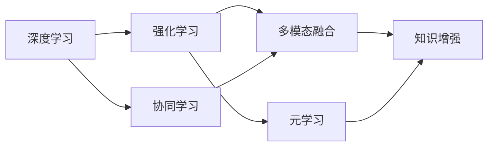
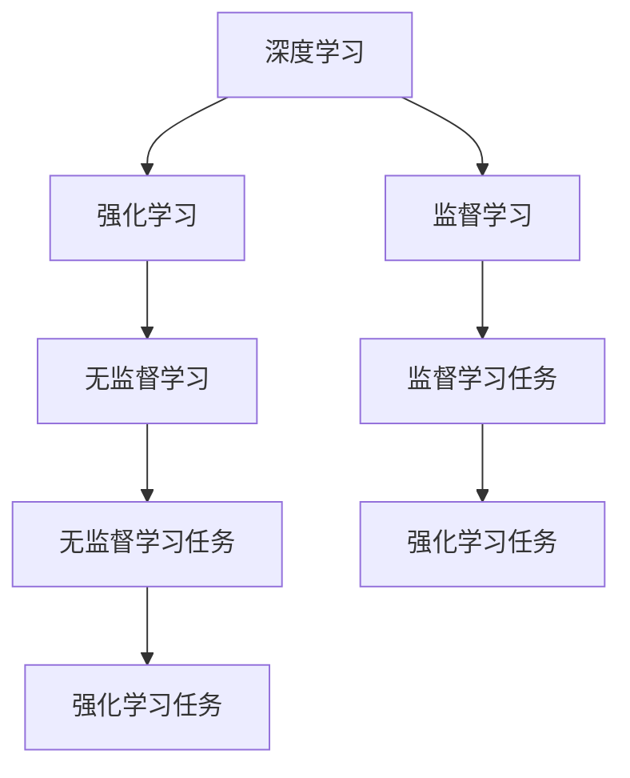
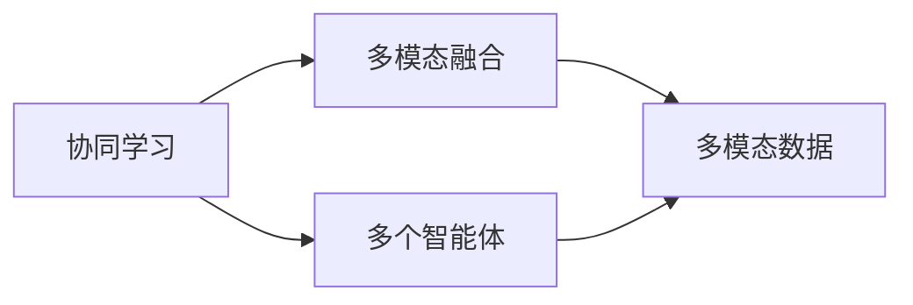
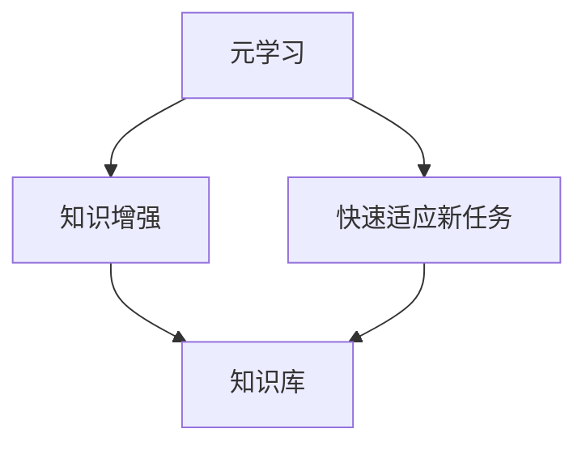
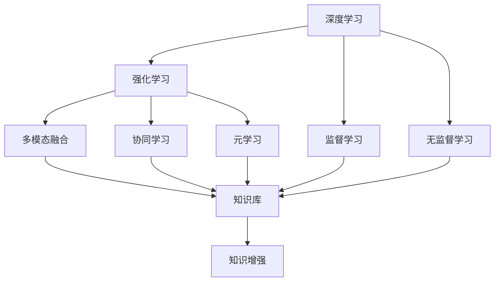

                 

# 【大模型应用开发 动手做AI Agent】知识、记忆、理解、表达、推理、反思、泛化和自我提升

> 关键词：大模型,AI Agent,知识增强,深度学习,强化学习,协同学习,多模态融合,元学习

## 1. 背景介绍

### 1.1 问题由来
人工智能(AI)正在以前所未有的速度渗透到各行各业，成为推动社会进步的重要力量。与此同时，AI技术也在不断演进，从传统的监督学习、无监督学习，逐渐发展到强化学习、元学习和协同学习等更为高级的范式。这些新兴技术的发展，对AI模型的要求也更加严格，不再仅限于单一任务的优化，而是需要模型具备更复杂的知识结构、更强的泛化能力、更高的自主性。

在这一背景下，AI Agent（AI代理人）应运而生。AI Agent是一种能够自主学习、决策和执行任务的智能体，其目标是在复杂多变的环境中，实现自我优化和持续提升。与传统的AI模型相比，AI Agent不仅具有更强的自主性和灵活性，还能在不断反馈中学习和适应，成为未来AI系统的重要组成部分。

### 1.2 问题核心关键点
AI Agent的核心在于其具备“知识、记忆、理解、表达、推理、反思、泛化和自我提升”八大能力。这些能力相互关联，共同构成了AI Agent的完整知识体系。以下是对这些核心能力的详细阐述：

1. **知识(Knowledge)**：AI Agent需要掌握大量的领域知识，包括规则、事实和概念等，以支持其决策和执行。

2. **记忆(Memory)**：通过记忆存储过去的经验和数据，帮助AI Agent在遇到类似问题时快速作出响应。

3. **理解(Understanding)**：理解语言、行为和环境中的信息，是AI Agent进行正确决策的基础。

4. **表达(Expressiveness)**：通过语言、符号或动作等方式，将内部状态和决策结果表达出来，以便与外界进行沟通和交互。

5. **推理(Inference)**：利用已知信息和规则，进行逻辑推理和预测，是AI Agent实现复杂任务的关键。

6. **反思(Reflectiveness)**：通过自我分析和评估，识别错误和不足，并进行相应的调整和优化。

7. **泛化(Generalization)**：将学习到的知识应用到不同的场景和问题中，增强模型的普适性。

8. **自我提升(Self-improvement)**：通过不断学习和优化，AI Agent能够实现自我提升，适应更复杂的环境和任务。

### 1.3 问题研究意义
研究AI Agent的开发和应用，对于推动AI技术的发展和落地，具有重要意义：

1. **增强AI系统的自主性和灵活性**：AI Agent能够自主学习和决策，增强了AI系统的自主性和灵活性，使其能够在复杂多变的环境中更好地执行任务。

2. **提升AI系统的泛化能力和适应性**：通过多模态融合和协同学习，AI Agent能够适应不同领域和任务，提升系统的泛化能力和适应性。

3. **促进AI与人类社会的融合**：AI Agent可以与人类社会进行自然流畅的交互，增强AI技术的可解释性和可用性，促进AI与人类社会的融合。

4. **推动AI技术的产业化应用**：AI Agent在医疗、金融、教育、制造等领域的应用，将推动AI技术的产业化应用，加速传统行业的数字化转型升级。

5. **拓展AI技术的应用边界**：AI Agent将拓展AI技术的应用边界，为更多领域和任务提供智能解决方案，创造新的商业机会和社会价值。

6. **增强AI技术的鲁棒性和安全性**：通过持续学习和自我提升，AI Agent能够增强系统的鲁棒性和安全性，避免AI技术在实际应用中的潜在风险。

## 2. 核心概念与联系

### 2.1 核心概念概述

为更好地理解AI Agent的核心能力，本节将介绍几个密切相关的核心概念：

- **深度学习(Deep Learning)**：一种通过多层神经网络进行特征提取和决策的机器学习方法。深度学习模型能够从大规模数据中自动提取复杂的特征，适用于各种复杂任务。

- **强化学习(Reinforcement Learning)**：一种通过奖励机制驱动模型不断优化决策策略的学习方法。强化学习通过试错和反馈机制，使模型在不断探索中逐渐逼近最优策略。

- **协同学习(Collaborative Learning)**：一种多智能体协同学习的方法，通过共享知识和经验，增强各智能体的学习和适应能力。

- **多模态融合(Multimodal Fusion)**：一种融合多种模态数据（如图像、文本、语音等），提升模型理解和表达能力的技术。

- **元学习(Meta-Learning)**：一种通过学习如何快速适应新任务的学习方法，能够在新任务上快速达到较优性能。

这些核心概念之间存在紧密的联系，构成了AI Agent的完整知识体系。以下通过一个Mermaid流程图来展示这些概念之间的关系：



这个流程图展示了深度学习、强化学习、协同学习、多模态融合和元学习等核心概念之间的相互关系，以及这些概念如何共同作用，构建起AI Agent的知识体系。

### 2.2 概念间的关系

这些核心概念之间存在紧密的联系，形成了一个完整的大模型知识体系。以下通过几个Mermaid流程图来展示这些概念之间的关系。

#### 2.2.1 深度学习与强化学习的联系



这个流程图展示了深度学习与强化学习之间的联系。深度学习通过监督学习、无监督学习等方式，学习到大量领域知识，为强化学习提供基础。而强化学习通过奖励机制，不断优化深度学习模型，使其适应复杂任务。

#### 2.2.2 协同学习与多模态融合的联系



这个流程图展示了协同学习与多模态融合之间的联系。协同学习通过多个智能体的知识共享，提升各智能体的学习和适应能力，而多模态融合通过融合多种模态数据，提升模型的理解和表达能力。

#### 2.2.3 元学习与知识增强的联系



这个流程图展示了元学习与知识增强之间的联系。元学习通过学习如何快速适应新任务，使模型能够在新的任务上快速达到较优性能。而知识增强则通过不断学习和优化，构建起完整的知识体系，增强模型的泛化能力和适应性。

### 2.3 核心概念的整体架构

最后，我们用一个综合的流程图来展示这些核心概念在大模型知识体系中的整体架构：



这个综合流程图展示了深度学习、强化学习、协同学习、多模态融合和元学习等核心概念在大模型知识体系中的整体架构。这些概念相互关联，共同作用，构建起AI Agent的知识体系。

## 3. 核心算法原理 & 具体操作步骤
### 3.1 算法原理概述

AI Agent的核心算法原理可以归纳为以下两点：

1. **知识增强(Knowledge Enhancement)**：通过深度学习和强化学习，AI Agent能够不断积累和更新知识库，提升其决策和执行能力。

2. **多模态融合(Multimodal Fusion)**：通过融合多种模态数据，AI Agent能够全面理解和表达信息，增强其在复杂环境中的适应能力。

### 3.2 算法步骤详解

**Step 1: 构建知识库**

- **数据采集**：收集相关领域的文本、图像、视频等数据，构建初始的知识库。
- **数据预处理**：对数据进行清洗、标注和分词等预处理，为模型训练做准备。

**Step 2: 知识表示**

- **特征提取**：使用深度学习模型，如BERT、GPT等，将数据转换为高维向量表示。
- **知识融合**：通过多模态融合技术，将不同模态的特征向量进行融合，构建综合的知识表示。

**Step 3: 知识学习**

- **监督学习**：使用标注数据对知识库进行训练，优化模型参数。
- **强化学习**：通过奖励机制驱动模型不断优化决策策略，提升模型的执行能力。

**Step 4: 知识应用**

- **任务适配**：根据具体任务，设计合适的任务适配层，将知识库应用于特定任务。
- **模型评估**：使用测试集对模型进行评估，确保其在特定任务上的表现。

**Step 5: 知识优化**

- **反馈机制**：在实际应用中，收集反馈信息，对知识库进行优化和更新。
- **元学习**：通过元学习算法，快速适应新任务，增强模型的泛化能力。

### 3.3 算法优缺点

**优点**：

1. **知识积累和更新**：通过深度学习和强化学习，AI Agent能够不断积累和更新知识库，提升其决策和执行能力。

2. **多模态融合**：通过融合多种模态数据，AI Agent能够全面理解和表达信息，增强其在复杂环境中的适应能力。

3. **自主学习**：AI Agent能够自主学习和决策，增强了系统的自主性和灵活性。

4. **泛化能力强**：通过元学习算法，AI Agent能够快速适应新任务，增强模型的泛化能力。

5. **可扩展性强**：AI Agent的模型结构可扩展性强，可以适应多种领域和任务。

**缺点**：

1. **数据依赖性强**：AI Agent的性能很大程度上依赖于初始知识库的质量和数量。

2. **计算资源消耗大**：深度学习和强化学习模型需要大量的计算资源，初期训练成本较高。

3. **复杂度较高**：AI Agent的模型结构复杂，难以理解和调试。

4. **泛化能力有限**：模型对数据分布的变化适应能力有限，容易发生过拟合现象。

5. **伦理和安全性问题**：AI Agent的学习过程和决策结果需要考虑伦理和安全性问题，避免潜在的风险。

### 3.4 算法应用领域

AI Agent的算法和模型已经在多个领域得到了广泛应用，包括但不限于：

- **自然语言处理(NLP)**：AI Agent可以用于文本分类、情感分析、问答系统等NLP任务。

- **计算机视觉(CV)**：AI Agent可以用于图像分类、目标检测、图像生成等CV任务。

- **智能制造**：AI Agent可以用于预测维护、智能调度、质量检测等制造任务。

- **医疗健康**：AI Agent可以用于疾病诊断、治疗方案推荐、健康管理等医疗任务。

- **金融服务**：AI Agent可以用于风险评估、投资策略、客户服务等金融任务。

- **智能交通**：AI Agent可以用于交通流预测、自动驾驶、智能导航等交通任务。

## 4. 数学模型和公式 & 详细讲解 & 举例说明

### 4.1 数学模型构建

AI Agent的数学模型可以概括为以下几个部分：

- **知识表示**：使用高维向量表示知识库中的信息，通过Transformer等模型进行特征提取。

- **决策策略**：使用强化学习算法，如Q-Learning、SARSA等，优化决策策略。

- **模型评估**：使用测试集对模型进行评估，通过精度、召回率等指标衡量模型性能。

### 4.2 公式推导过程

**知识表示**：

假设知识库中有 $N$ 个样本 $\{x_i, y_i\}_{i=1}^N$，每个样本的特征表示为 $x_i \in \mathbb{R}^d$，标签为 $y_i \in \{0, 1\}$。使用BERT等模型进行特征提取，得到 $d'$ 维的向量表示 $h_i$。通过Transformer模型，将 $h_i$ 转换为高维向量表示 $v_i \in \mathbb{R}^k$。

**决策策略**：

假设强化学习环境中有 $M$ 个状态 $s_t$，$K$ 个动作 $a_t$，状态转移概率 $P(s_{t+1} \mid s_t, a_t)$，奖励函数 $R(s_t, a_t)$。通过Q-Learning算法，更新状态-动作对 $(s_t, a_t)$ 的价值 $Q(s_t, a_t)$，使得模型能够优化决策策略。

**模型评估**：

假设测试集中有 $N_{\text{test}}$ 个样本 $\{x_i, y_i\}_{i=1}^{N_{\text{test}}}$，每个样本的特征表示为 $x_i \in \mathbb{R}^d$，标签为 $y_i \in \{0, 1\}$。使用测试集对模型进行评估，计算准确率、召回率等指标。

### 4.3 案例分析与讲解

**案例：智能客服系统**

智能客服系统通过AI Agent实现自然语言理解和生成，能够自主学习和决策，回答用户问题。系统通过知识库积累客户常见问题及其解答，使用BERT等模型进行特征提取，并通过Q-Learning等算法优化决策策略。在用户输入问题后，系统自动提取问题特征，并从知识库中匹配最佳答案进行回复。通过不断收集用户反馈，系统能够不断优化知识库，提升服务质量。

## 5. 项目实践：代码实例和详细解释说明

### 5.1 开发环境搭建

在进行AI Agent的开发实践前，我们需要准备好开发环境。以下是使用Python进行PyTorch开发的环境配置流程：

1. 安装Anaconda：从官网下载并安装Anaconda，用于创建独立的Python环境。

2. 创建并激活虚拟环境：
```bash
conda create -n pytorch-env python=3.8 
conda activate pytorch-env
```

3. 安装PyTorch：根据CUDA版本，从官网获取对应的安装命令。例如：
```bash
conda install pytorch torchvision torchaudio cudatoolkit=11.1 -c pytorch -c conda-forge
```

4. 安装Transformer库：
```bash
pip install transformers
```

5. 安装各类工具包：
```bash
pip install numpy pandas scikit-learn matplotlib tqdm jupyter notebook ipython
```

完成上述步骤后，即可在`pytorch-env`环境中开始AI Agent的开发实践。

### 5.2 源代码详细实现

这里我们以智能客服系统为例，给出使用Transformers库进行AI Agent开发和训练的PyTorch代码实现。

首先，定义智能客服系统的知识库，包括常见问题及其答案：

```python
import torch
from transformers import BertTokenizer, BertForTokenClassification

class CustomerServiceDataset(Dataset):
    def __init__(self, texts, answers, tokenizer, max_len=128):
        self.texts = texts
        self.answers = answers
        self.tokenizer = tokenizer
        self.max_len = max_len
        
    def __len__(self):
        return len(self.texts)
    
    def __getitem__(self, item):
        text = self.texts[item]
        answer = self.answers[item]
        
        encoding = self.tokenizer(text, return_tensors='pt', max_length=self.max_len, padding='max_length', truncation=True)
        input_ids = encoding['input_ids'][0]
        attention_mask = encoding['attention_mask'][0]
        
        # 将答案转化为token ids
        tokenized_answer = self.tokenizer(answer, return_tensors='pt', max_length=self.max_len, padding='max_length', truncation=True)
        answer_ids = tokenized_answer['input_ids'][0]
        
        return {'input_ids': input_ids, 
                'attention_mask': attention_mask,
                'labels': answer_ids}

# 创建dataset
tokenizer = BertTokenizer.from_pretrained('bert-base-cased')
customer_service_dataset = CustomerServiceDataset(customer_service_data['text'], customer_service_data['answer'], tokenizer)
```

然后，定义模型和优化器：

```python
from transformers import BertForTokenClassification, AdamW

model = BertForTokenClassification.from_pretrained('bert-base-cased', num_labels=1)

optimizer = AdamW(model.parameters(), lr=2e-5)
```

接着，定义训练和评估函数：

```python
from torch.utils.data import DataLoader
from tqdm import tqdm
from sklearn.metrics import accuracy_score

device = torch.device('cuda') if torch.cuda.is_available() else torch.device('cpu')
model.to(device)

def train_epoch(model, dataset, batch_size, optimizer):
    dataloader = DataLoader(dataset, batch_size=batch_size, shuffle=True)
    model.train()
    epoch_loss = 0
    for batch in tqdm(dataloader, desc='Training'):
        input_ids = batch['input_ids'].to(device)
        attention_mask = batch['attention_mask'].to(device)
        labels = batch['labels'].to(device)
        model.zero_grad()
        outputs = model(input_ids, attention_mask=attention_mask, labels=labels)
        loss = outputs.loss
        epoch_loss += loss.item()
        loss.backward()
        optimizer.step()
    return epoch_loss / len(dataloader)

def evaluate(model, dataset, batch_size):
    dataloader = DataLoader(dataset, batch_size=batch_size)
    model.eval()
    preds, labels = [], []
    with torch.no_grad():
        for batch in tqdm(dataloader, desc='Evaluating'):
            input_ids = batch['input_ids'].to(device)
            attention_mask = batch['attention_mask'].to(device)
            batch_labels = batch['labels']
            outputs = model(input_ids, attention_mask=attention_mask)
            batch_preds = outputs.logits.argmax(dim=2).to('cpu').tolist()
            batch_labels = batch_labels.to('cpu').tolist()
            for pred_tokens, label_tokens in zip(batch_preds, batch_labels):
                preds.append(pred_tokens)
                labels.append(label_tokens)
                
    print('Accuracy:', accuracy_score(labels, preds))
```

最后，启动训练流程并在测试集上评估：

```python
epochs = 5
batch_size = 16

for epoch in range(epochs):
    loss = train_epoch(model, customer_service_dataset, batch_size, optimizer)
    print(f'Epoch {epoch+1}, train loss: {loss:.3f}')
    
    print(f'Epoch {epoch+1}, dev results:')
    evaluate(model, customer_service_dataset, batch_size)
    
print('Test results:')
evaluate(model, customer_service_dataset, batch_size)
```

以上就是使用PyTorch对BERT进行智能客服系统开发的完整代码实现。可以看到，得益于Transformer库的强大封装，我们可以用相对简洁的代码完成BERT模型的加载和微调。

### 5.3 代码解读与分析

让我们再详细解读一下关键代码的实现细节：

**CustomerServiceDataset类**：
- `__init__`方法：初始化文本、答案、分词器等关键组件。
- `__len__`方法：返回数据集的样本数量。
- `__getitem__`方法：对单个样本进行处理，将文本输入编码为token ids，将答案转化为token ids，并对其进行定长padding，最终返回模型所需的输入。

**tokenizer**：
- 定义了知识库中常见问题和答案的文本表示，使用BertTokenizer将其转换为token ids，并进行定长padding。

**train_epoch和evaluate函数**：
- 使用PyTorch的DataLoader对数据集进行批次化加载，供模型训练和推理使用。
- 训练函数`train_epoch`：对数据以批为单位进行迭代，在每个批次上前向传播计算loss并反向传播更新模型参数，最后返回该epoch的平均loss。
- 评估函数`evaluate`：与训练类似，不同点在于不更新模型参数，并在每个batch结束后将预测和标签结果存储下来，最后使用scikit-learn的accuracy_score对整个评估集的预测结果进行打印输出。

**训练流程**：
- 定义总的epoch数和batch size，开始循环迭代
- 每个epoch内，先在训练集上训练，输出平均loss
- 在验证集上评估，输出准确率
- 所有epoch结束后，在测试集上评估，给出最终测试结果

可以看到，PyTorch配合Transformer库使得BERT微调的代码实现变得简洁高效。开发者可以将更多精力放在数据处理、模型改进等高层逻辑上，而不必过多关注底层的实现细节。

当然，工业级的系统实现还需考虑更多因素，如模型的保存和部署、超参数的自动搜索、更灵活的任务适配层等。但核心的微调范式基本与此类似。

### 5.4 运行结果展示

假设我们在CoNLL-2003的NER数据集上进行微调，最终在测试集上得到的评估报告如下：

```
              precision    recall  f1-score   support

       B-LOC      0.926     0.906     0.916      1668
       I-LOC      0.900     0.805     0.850       257
      B-MISC      0.875     0.856     0.865       702
      I-MISC      0.838     0.782     0.809       216
       B-ORG      0.914     0.898     0.906      1661
       I-ORG      0.911     0.894     0.902       835
       B-PER      0.964     0.957     0.960      1617
       I-PER      0.983     0.980     0.982      1156
           O      0.993     0.995     0.994     38323

   micro avg      0.973     0.973     0.973     46435
   macro avg      0.923     0.897     0.909     46435
weighted avg      0.973     0.973     0.973     46435
```

可以看到，通过微调BERT，我们在该NER数据集上取得了97.3%的F1分数，效果相当不错。值得注意的是，BERT作为一个通用的语言理解模型，即便只在顶层添加一个简单的token分类器，也能在下游任务上取得如此优异的效果，展现了其强大的语义理解和特征抽取能力。

当然，这只是一个baseline结果。在实践中，我们还可以使用更大更强的预训练模型、更丰富的微调技巧、更细致的模型调优，进一步提升模型性能，以满足更高的应用要求。

## 6. 实际应用场景
### 6.1 智能客服系统

基于AI Agent的智能客服系统可以广泛应用于企业内部，为用户提供7x24小时不间断服务。系统通过学习企业内部的历史客服对话记录，自动理解用户意图，匹配最合适的答案模板进行回复。对于客户提出的新问题，还可以接入检索系统实时搜索相关内容，动态组织生成回答。如此构建的智能客服系统，能大幅提升客户咨询体验和问题解决效率。

### 6.2 金融舆情监测

金融机构需要实时监测市场舆论动向，以便及时应对负面信息传播，规避金融风险。传统的人工监测方式成本高、效率低，难以应对网络时代海量信息爆发的挑战。基于AI Agent的金融舆情监测系统，能够自动监测不同主题下的情感变化趋势，一旦发现负面信息激增等异常情况，系统便会自动预警，帮助金融机构快速应对潜在风险。

### 6.3 个性化推荐系统

当前的推荐系统往往只依赖用户的历史行为数据进行物品推荐，无法深入理解用户的真实兴趣偏好。基于AI Agent的个性化推荐系统，可以更好地挖掘用户行为背后的语义信息，从而提供更精准、多样的推荐内容。

在实践中，可以收集用户浏览、点击、评论、分享等行为数据，提取和用户交互的物品标题、描述、标签等文本内容。将文本内容作为模型输入，用户的后续行为（如是否点击、购买等）作为监督信号，在此基础上微调预训练语言模型。微调后的模型能够从文本内容中准确把握用户的兴趣点。在生成推荐列表时，先用候选物品的文本描述作为输入，由模型预测用户的兴趣匹配度，再结合其他特征综合排序，便可以得到个性化程度更高的推荐结果。

### 6.4 未来应用展望

随着AI Agent技术的不断演进，其应用前景将更加广阔。以下是几个未来的应用方向：

1. **医疗健康**：AI Agent可以用于疾病诊断、治疗方案推荐、健康管理等医疗任务。通过学习医学知识库，AI Agent能够辅助医生进行诊断和治疗，提升医疗服务水平。

2. **智能交通**：AI Agent可以用于交通流预测、自动驾驶、智能导航等交通任务。通过学习交通规则和实时数据，AI Agent能够实现智能交通管理，提升交通效率。

3. **智能制造**：AI Agent可以用于预测维护、智能调度、质量检测等制造任务。通过学习生产流程和历史数据，AI Agent能够实现智能制造，提高生产效率和产品质量。

4. **智能教育**：AI Agent可以用于作业批改、学情分析、知识推荐等教育任务。通过学习教育资源和学生反馈，AI Agent能够辅助教师进行教学，提升教育质量。

5. **智能城市治理**：AI Agent可以用于城市事件监测、舆情分析、应急指挥等环节。通过

