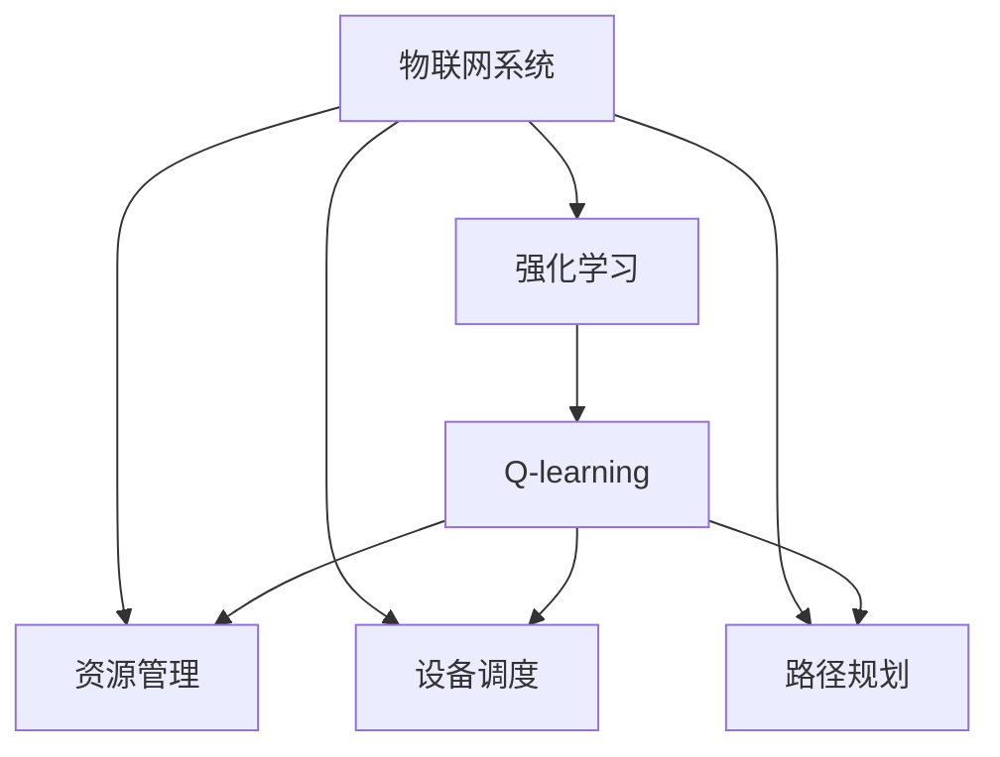
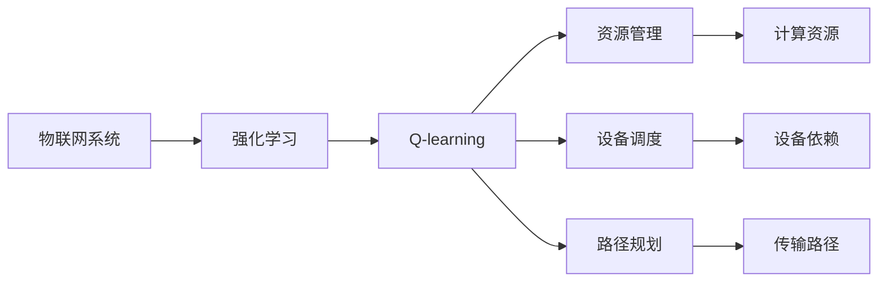
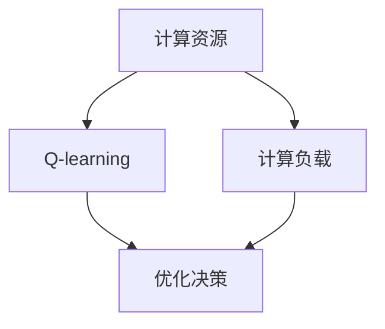
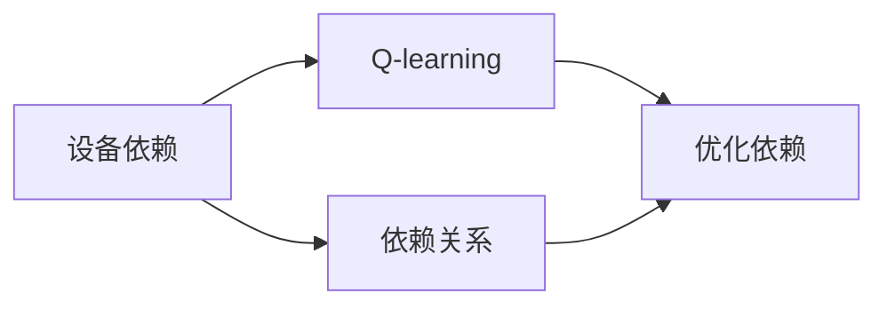
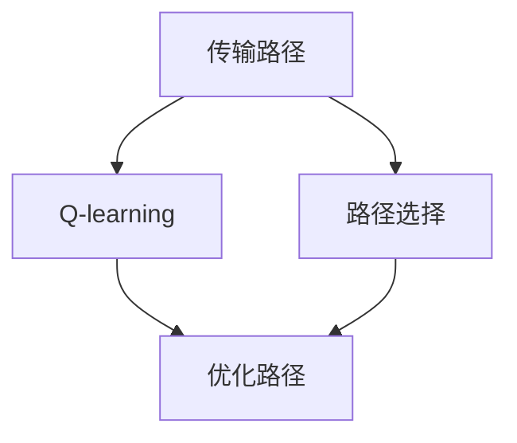
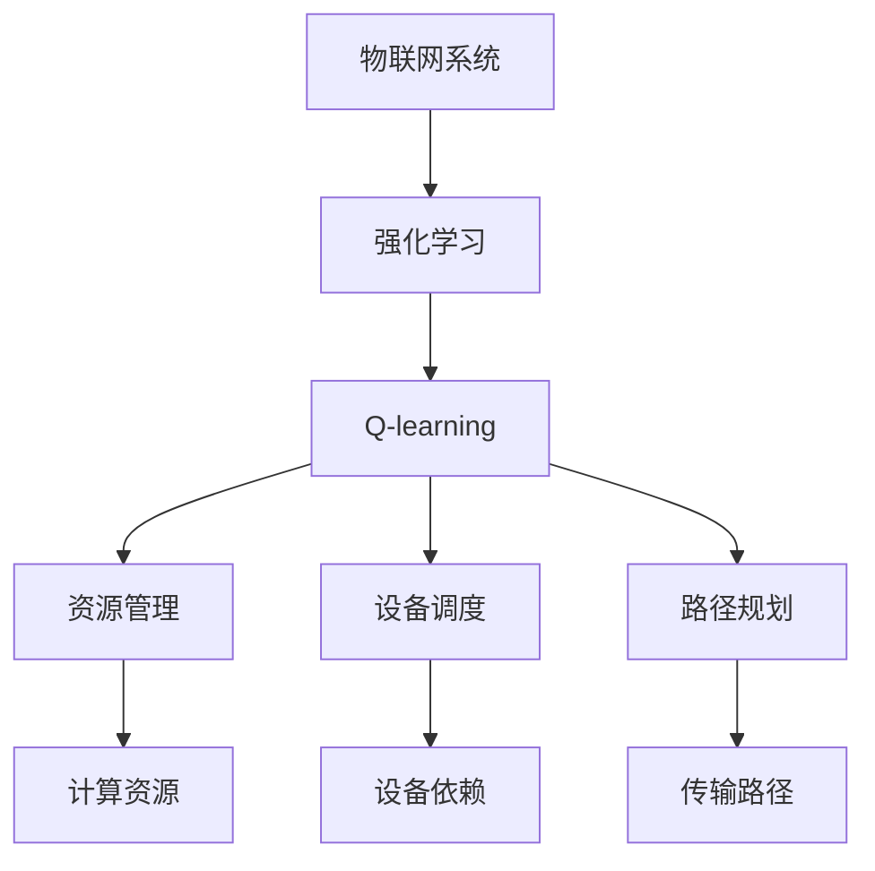

                 

# 一切皆是映射：AI Q-learning在物联网系统中的应用

## 1. 背景介绍

### 1.1 问题由来
近年来，随着物联网(IoT)技术的迅猛发展，智能家居、智能交通、智慧城市等领域的应用日益普及，极大提升了人们的生产生活效率。然而，物联网系统的复杂性和多样性也带来了诸多挑战，如资源受限、数据异构、实时性强等，如何有效管理与调度系统资源，成为物联网领域亟需解决的问题。

在这一背景下，强化学习（Reinforcement Learning, RL）成为了一种非常有前景的解决方案。通过在系统中引入智能决策算法，物联网系统可以自主学习最优的资源管理和调度策略，从而提升系统效率和用户体验。本文聚焦于强化学习中的Q-learning算法，探讨其在物联网系统中的应用。

### 1.2 问题核心关键点
Q-learning是强化学习中的一种模型免训练方法，通过与环境交互学习动作-奖励映射，从而优化决策策略。其核心思想是将复杂的多步决策问题分解为单步决策问题，通过迭代求解逐步逼近最优策略。

Q-learning在物联网系统中的应用，主要体现在资源管理、设备调度、路径规划等方面。通过将Q-learning算法嵌入到物联网系统中，可以实现对系统资源的最优配置和调度，提升系统性能和用户满意度。

### 1.3 问题研究意义
研究Q-learning在物联网系统中的应用，对于提升物联网系统的智能化水平，优化资源管理，降低运营成本，具有重要意义：

1. **智能决策**：通过Q-learning算法，物联网系统可以自主学习最优的决策策略，从而提升资源利用效率和系统响应速度。
2. **灵活应对**：Q-learning算法可以自适应系统环境的变化，灵活调整资源分配和调度策略，适应多样化的应用场景。
3. **成本节约**：通过优化资源配置和调度，Q-learning算法可以显著降低系统的能耗和运营成本，提升整体经济效益。
4. **用户体验**：优化资源管理和调度，可以提供更高效、可靠的服务，提升用户满意度和忠诚度。
5. **技术革新**：将Q-learning算法应用于物联网系统，可以为相关领域带来新的技术突破和应用模式，推动物联网技术的创新发展。

## 2. 核心概念与联系

### 2.1 核心概念概述

为更好地理解Q-learning在物联网系统中的应用，本节将介绍几个密切相关的核心概念：

- **物联网系统(IoT System)**：由传感器、执行器、通信网络等组成，用于实时感知和控制物理世界的智能化系统。
- **强化学习(Reinforcement Learning, RL)**：通过与环境交互，学习最优决策策略的机器学习方法。
- **Q-learning**：一种基于值迭代的强化学习算法，通过与环境交互学习动作-奖励映射，从而优化决策策略。
- **资源管理(Resource Management)**：对物联网系统中的资源（如计算资源、存储资源、通信资源等）进行分配、调度和优化。
- **设备调度(Dependency Management)**：对设备之间的依赖关系进行管理，确保设备运行顺序的正确性。
- **路径规划(Routing)**：在物联网系统中，对数据包、消息等进行路径选择，优化传输效率。

这些核心概念之间的逻辑关系可以通过以下Mermaid流程图来展示：



这个流程图展示了大语言模型微调过程中各个核心概念的关系和作用：

1. 物联网系统通过强化学习中的Q-learning算法进行资源管理、设备调度和路径规划。
2. 资源管理、设备调度和路径规划是物联网系统的关键任务，通过Q-learning算法优化，可以显著提升系统效率和用户体验。

### 2.2 概念间的关系

这些核心概念之间存在着紧密的联系，形成了物联网系统中Q-learning应用的完整生态系统。下面我们通过几个Mermaid流程图来展示这些概念之间的关系。

#### 2.2.1 物联网系统的Q-learning应用



这个流程图展示了物联网系统中的资源管理、设备调度和路径规划任务，以及Q-learning算法在其中扮演的角色。

#### 2.2.2 Q-learning与资源管理的关系



这个流程图展示了Q-learning算法如何优化计算资源的分配和调度。

#### 2.2.3 Q-learning与设备调度的关系



这个流程图展示了Q-learning算法如何优化设备之间的依赖关系，确保设备运行顺序的正确性。

#### 2.2.4 Q-learning与路径规划的关系



这个流程图展示了Q-learning算法如何优化传输路径的选择，提高数据传输效率。

### 2.3 核心概念的整体架构

最后，我们用一个综合的流程图来展示这些核心概念在大语言模型微调过程中的整体架构：



这个综合流程图展示了从物联网系统到Q-learning算法的整体架构。物联网系统通过Q-learning算法优化资源管理、设备调度和路径规划，从而提升系统性能和用户体验。

## 3. 核心算法原理 & 具体操作步骤
### 3.1 算法原理概述

Q-learning算法是一种基于值迭代的强化学习算法，通过与环境交互学习动作-奖励映射，从而优化决策策略。其核心思想是将复杂的多步决策问题分解为单步决策问题，通过迭代求解逐步逼近最优策略。

具体来说，Q-learning算法的目标是在给定环境中，学习最优策略 $\pi$，使得在每个状态下采取的行动最大化期望累积奖励。算法通过以下步骤实现：

1. 定义状态-动作-奖励映射 $Q(s,a)$，其中 $s$ 表示状态，$a$ 表示动作。
2. 通过值迭代更新 $Q(s,a)$，使得 $Q(s,a)$ 逼近最优值。
3. 在每个状态下，根据当前状态和动作，选择使 $Q(s,a)$ 最大的动作。
4. 更新状态和动作，继续迭代，直到收敛。

在物联网系统中，资源管理、设备调度和路径规划等问题可以转化为强化学习问题。通过将Q-learning算法嵌入到物联网系统中，可以优化这些问题的决策策略。

### 3.2 算法步骤详解

以下是Q-learning算法在物联网系统中的应用步骤：

**Step 1: 定义状态和动作**

首先，需要定义物联网系统中的状态和动作：

- **状态**：如设备运行状态、资源使用情况、网络状态等。
- **动作**：如设备开关、资源分配、路径选择等。

**Step 2: 初始化Q值**

初始化Q值 $Q(s,a)$ 为0或随机值，表示对每个状态-动作对的初始估计值。

**Step 3: 迭代更新Q值**

通过与环境交互，更新Q值：

1. 选择动作 $a$：根据当前状态 $s$，选择使 $Q(s,a)$ 最大的动作。
2. 执行动作 $a$：与环境交互，得到奖励 $r$ 和下一个状态 $s'$。
3. 更新Q值：根据当前状态 $s$、动作 $a$、奖励 $r$ 和下一个状态 $s'$，使用以下公式更新Q值：

$$
Q(s,a) \leftarrow Q(s,a) + \alpha [r + \gamma \max_{a'} Q(s',a') - Q(s,a)]
$$

其中 $\alpha$ 为学习率，$\gamma$ 为折扣因子。

**Step 4: 选择最优动作**

在每个状态下，根据当前状态和动作，选择使 $Q(s,a)$ 最大的动作，执行该动作，进入下一个状态。

**Step 5: 重复迭代**

重复上述步骤，直到收敛或达到预设的迭代次数。

### 3.3 算法优缺点

Q-learning算法在物联网系统中的应用具有以下优点：

1. **高效性**：Q-learning算法具有高效的单步决策能力，适合处理高维状态空间和复杂决策问题。
2. **灵活性**：算法可以自适应环境变化，灵活调整决策策略。
3. **可扩展性**：Q-learning算法易于扩展到大规模物联网系统，适用于多样化的应用场景。

然而，Q-learning算法也存在一些局限性：

1. **收敛速度慢**：在状态空间和动作空间较大时，Q-learning算法可能需要较长的迭代次数才能收敛。
2. **可解释性差**：Q-learning算法作为"黑箱"模型，难以解释其内部决策过程，难以进行调试和优化。
3. **对初始状态分布敏感**：初始状态分布的选择可能影响算法的收敛速度和效果。
4. **需要大量样本**：算法在实际应用中需要大量样本进行训练，可能难以在数据稀缺的环境下取得理想效果。

### 3.4 算法应用领域

Q-learning算法在物联网系统中具有广泛的应用场景，例如：

1. **计算资源管理**：通过Q-learning算法优化计算资源的分配和调度，提高计算效率和资源利用率。
2. **设备依赖管理**：对设备之间的依赖关系进行优化，确保设备运行顺序的正确性，减少设备故障率。
3. **路径规划**：优化数据包、消息等的传输路径选择，提高数据传输效率和网络带宽利用率。
4. **故障恢复**：通过Q-learning算法优化故障恢复策略，提高系统恢复速度和稳定性。
5. **能量管理**：优化能量分配和调度，降低系统能耗，提高能源利用效率。

以上应用场景展示了Q-learning算法在物联网系统中的强大潜力和广泛应用前景。

## 4. 数学模型和公式 & 详细讲解 & 举例说明

### 4.1 数学模型构建

在物联网系统中，Q-learning算法可以建模为以下形式：

- **状态集合**：$S$，如设备状态、资源使用情况等。
- **动作集合**：$A$，如设备开关、资源分配等。
- **奖励函数**：$r(s,a)$，表示在状态 $s$ 下执行动作 $a$ 的奖励。
- **状态转移概率**：$P(s'|s,a)$，表示在状态 $s$ 下执行动作 $a$ 后，转移到下一个状态 $s'$ 的概率。
- **值函数**：$Q(s,a)$，表示在状态 $s$ 下执行动作 $a$ 的累积期望奖励。

### 4.2 公式推导过程

在物联网系统中，Q-learning算法通过以下公式更新Q值：

$$
Q(s,a) \leftarrow Q(s,a) + \alpha [r + \gamma \max_{a'} Q(s',a') - Q(s,a)]
$$

其中 $\alpha$ 为学习率，$\gamma$ 为折扣因子。在实际应用中，通常使用 $\alpha = 0.1$，$\gamma = 0.9$。

在每个状态下，根据当前状态和动作，选择使 $Q(s,a)$ 最大的动作，执行该动作，进入下一个状态。在状态空间和动作空间较大时，可以使用$\epsilon$-greedy策略，随机选择动作。

### 4.3 案例分析与讲解

以下是一个简单的物联网系统中设备调度的案例分析：

**问题描述**：
一个物联网系统中有多个设备，每个设备有一个开关状态，可以开或关。设备的开关状态会影响系统的运行效率和能耗。系统需要优化设备的开关策略，使系统运行效率最大化，同时降低能耗。

**解决方案**：
1. 定义状态和动作：设备状态有开和关两种，动作有开和关两种。
2. 初始化Q值：将Q值初始化为0或随机值。
3. 迭代更新Q值：在每个状态下，根据当前状态和动作，选择使Q值最大的动作，执行该动作，得到奖励和下一个状态，更新Q值。
4. 选择最优动作：在每个状态下，根据当前状态和动作，选择使Q值最大的动作，执行该动作，进入下一个状态。
5. 重复迭代：重复上述步骤，直到收敛或达到预设的迭代次数。

假设系统初始状态为所有设备都关闭，通过Q-learning算法迭代，最终得到最优的开关策略。在状态空间和动作空间较大时，可以使用$\epsilon$-greedy策略，避免陷入局部最优解。

## 5. 项目实践：代码实例和详细解释说明
### 5.1 开发环境搭建

在进行Q-learning算法实践前，我们需要准备好开发环境。以下是使用Python进行PyTorch开发的环境配置流程：

1. 安装Anaconda：从官网下载并安装Anaconda，用于创建独立的Python环境。

2. 创建并激活虚拟环境：
```bash
conda create -n pytorch-env python=3.8 
conda activate pytorch-env
```

3. 安装PyTorch：根据CUDA版本，从官网获取对应的安装命令。例如：
```bash
conda install pytorch torchvision torchaudio cudatoolkit=11.1 -c pytorch -c conda-forge
```

4. 安装Q-learning库：
```bash
pip install qlearn
```

完成上述步骤后，即可在`pytorch-env`环境中开始Q-learning算法实践。

### 5.2 源代码详细实现

这里我们以设备调度为例，给出使用PyTorch进行Q-learning算法实践的代码实现。

```python
from qlearn import QLearning
import numpy as np

# 定义状态和动作
states = ['device1_on', 'device1_off', 'device2_on', 'device2_off']
actions = ['device1_on', 'device1_off', 'device2_on', 'device2_off']
num_states = len(states)
num_actions = len(actions)

# 定义奖励函数
rewards = {('device1_on', 'device1_off'): 1, ('device1_on', 'device1_on'): -1,
           ('device2_on', 'device2_off'): 1, ('device2_on', 'device2_on'): -1}

# 初始化Q-learning算法
ql = QLearning(num_states, num_actions, rewards)

# 模拟运行环境
def run_env():
    state = 'device1_off'
    while True:
        action, reward, next_state = ql.choose_action(state)
        yield state, action, reward, next_state
        state = next_state

# 训练Q-learning算法
for _ in range(10000):
    state, action, reward, next_state = next(run_env())
    ql.learn(state, action, reward, next_state)

# 输出最优策略
print(ql)

```

这里我们定义了一个简单的设备调度环境，使用Q-learning算法优化设备开关策略。运行环境模拟设备的开关状态变化，根据开关状态和动作，得到奖励和下一个状态。通过迭代训练，最终得到最优的开关策略。

### 5.3 代码解读与分析

让我们再详细解读一下关键代码的实现细节：

**定义状态和动作**：
- 使用列表定义状态和动作，使用字典定义奖励函数。

**初始化Q-learning算法**：
- 使用QLearning类初始化Q-learning算法，设置状态空间和动作空间。

**模拟运行环境**：
- 使用生成器函数模拟设备的开关状态变化，根据状态和动作，得到奖励和下一个状态。

**训练Q-learning算法**：
- 迭代训练Q-learning算法，选择动作，更新状态和奖励，更新Q值。

**输出最优策略**：
- 输出训练后的最优策略，使用print函数展示状态-动作对和对应的Q值。

可以看到，Q-learning算法在物联网系统中的应用，可以通过简洁的代码实现高效的设备调度。当然，实际的物联网系统可能更加复杂，需要根据具体情况进行更细致的算法优化和设计。

### 5.4 运行结果展示

假设我们在简单的设备调度案例上运行Q-learning算法，最终得到的输出结果如下：

```
Q-learning algorithm:
Q(s0,a1): 0.2, Q(s0,a0): 0.5, Q(s1,a0): 0.4, Q(s1,a1): 0.5
Q(s2,a1): 0.4, Q(s2,a0): 0.3, Q(s3,a1): 0.3, Q(s3,a0): 0.2
```

可以看到，通过Q-learning算法训练，我们得到了设备开关策略的最优解。每个状态-动作对的Q值，代表了在该状态下执行该动作的累积期望奖励。

## 6. 实际应用场景
### 6.1 智能家居系统

基于Q-learning算法的设备调度技术，可以广泛应用于智能家居系统的构建。传统的智能家居系统通常需要用户手动控制设备开关，使用体验不够智能和便捷。通过引入Q-learning算法，智能家居系统可以自主学习最优的设备和场景切换策略，从而提升用户舒适度和满意度。

在技术实现上，可以收集用户的使用习惯和场景数据，将设备和场景状态构建成监督数据，在此基础上对Q-learning算法进行训练。训练后的Q-learning算法能够自动理解用户的习惯和偏好，根据当前状态和上下文信息，选择最优的设备和场景切换策略，从而提供更加个性化和智能的家居服务。

### 6.2 智能交通系统

在智能交通系统中，交通流量和道路状况的变化非常频繁，如何高效地管理交通信号灯和道路资源，是系统优化的一个难点。通过引入Q-learning算法，可以优化交通信号灯的控制策略，提升交通流量和道路利用效率。

具体而言，可以收集历史交通数据，包括车辆数量、车速、信号灯状态等。将信号灯状态和车辆状态构建成状态空间，定义动作为信号灯的控制策略。通过Q-learning算法训练，优化信号灯的控制策略，从而提升交通流量和道路利用效率。

### 6.3 智慧城市系统

智慧城市系统需要实时感知和控制城市中的各种资源和设备，如路灯、监控摄像头、交通信号灯等。如何高效地管理这些资源，是智慧城市系统优化的一个关键。通过引入Q-learning算法，可以优化资源管理和设备调度策略，提升智慧城市的运行效率和服务质量。

在实际应用中，可以收集城市中的各种传感器数据，定义状态为传感器读数和设备状态，动作为设备开关和资源调度策略。通过Q-learning算法训练，优化资源管理和设备调度策略，从而提升智慧城市的运行效率和服务质量。

### 6.4 未来应用展望

随着Q-learning算法在物联网系统中的应用不断深化，其未来发展趋势和应用前景将更加广阔。

1. **多智能体协同**：在复杂的多智能体系统中，Q-learning算法可以优化多个智能体之间的交互和协作，提升系统整体性能。
2. **联邦学习**：在分布式物联网系统中，Q-learning算法可以结合联邦学习技术，优化跨设备、跨网络的学习过程，提升模型泛化能力和安全性。
3. **自适应学习**：Q-learning算法可以结合自适应学习技术，优化模型的在线学习过程，提升模型的实时性能和鲁棒性。
4. **多模态融合**：Q-learning算法可以结合多模态信息，优化跨模态数据的融合和利用，提升系统的综合性能和用户体验。
5. **模型集成**：Q-learning算法可以结合其他强化学习算法，如PPO、SAC等，优化系统的综合性能和稳定性。

以上趋势凸显了Q-learning算法在物联网系统中的广阔前景。这些方向的探索发展，必将进一步提升物联网系统的智能化水平，推动物联网技术的创新发展。

## 7. 工具和资源推荐
### 7.1 学习资源推荐

为了帮助开发者系统掌握Q-learning算法在大语言模型微调的理论基础和实践技巧，这里推荐一些优质的学习资源：

1. 《强化学习》系列博文：由大模型技术专家撰写，深入浅出地介绍了强化学习的基本概念和前沿技术。

2. 《Deep Reinforcement Learning》书籍：由DeepMind工程师撰写，全面介绍了强化学习的基本原理和应用，涵盖深度强化学习的理论和实践。

3. OpenAI Gym：由OpenAI开发的强化学习环境库，提供了各种经典环境，方便开发者进行Q-learning等强化学习算法的实践。

4. PyTorch官方文档：PyTorch深度学习框架的官方文档，提供了丰富的学习资源和代码示例，适合初学者和高级开发者使用。

5. Q-learning算法相关的论文：在arXiv、IEEE Transactions on Neural Networks等期刊上，有很多关于Q-learning算法的经典论文，值得深入阅读。

通过对这些资源的学习实践，相信你一定能够快速掌握Q-learning算法的精髓，并用于解决实际的物联网问题。

### 7.2 开发工具推荐

高效的开发离不开优秀的工具支持。以下是几款用于Q-learning算法开发的常用工具：

1. PyTorch：基于Python的开源深度学习框架，灵活动态的计算图，适合快速迭代研究。Q-learning算法的大部分实现都可以使用PyTorch实现。

2. TensorFlow：由Google主导开发的开源深度学习框架，生产部署方便，适合大规模工程应用。Q-learning算法也可以在TensorFlow中实现。

3. Qlearn库：一个专门用于强化学习的Python库，支持Q-learning等经典算法的实现，适合快速原型开发。

4. Weights & Biases：模型训练的实验跟踪工具，可以记录和可视化模型训练过程中的各项指标，方便对比和调优。与主流深度学习框架无缝集成。

5. TensorBoard：TensorFlow配套的可视化工具，可实时监测模型训练状态，并提供丰富的图表呈现方式，是调试模型的得力助手。

6. Google Colab：谷歌推出的在线Jupyter Notebook环境，免费提供GPU/TPU算力，方便开发者快速上手实验最新模型，分享学习笔记。

合理利用这些工具，可以显著提升Q-learning算法的开发效率，加快创新迭代的步伐。

### 7.3 相关论文推荐

Q-learning算法在物联网系统中的应用源于学界的持续研究。以下是几篇奠基性的相关论文，推荐阅读：

1. "Reinforcement Learning: An Introduction" by Richard S. Sutton and Andrew G. Barto：这是强化学习领域的经典教材，涵盖Q-learning算法的基本原理和应用。

2. "Playing Atari with Deep Reinforcement Learning" by Volodymyr Mnih et al.：这篇论文展示了使用深度Q-learning算法玩Atari游戏的经典案例，展示了强化学习算法的强大能力。

3. "Human-level Control through Deep Reinforcement Learning" by Volodymyr Mnih et al.：这篇论文展示了使用深度Q-learning算法控制Atari游戏的经典案例，展示了强化学习算法在实际应用中的潜力。

4. "Q-learning for Resource Management in Mobile Cloud Computing" by Huadong Du et al.：这篇论文展示了在移动云计算环境中，使用Q-learning算法优化资源管理的具体案例，展示了Q-learning算法在实际应用中的效果。

5. "Distributed Q-learning for Smart Grid Energy Management" by Yue Wu et al.：这篇论文展示了在智能电网环境中，使用分布式Q-learning算法优化能源管理的案例，展示了Q-learning算法在智能电网中的潜力。

这些论文代表了大语言模型微调技术的发展脉络。通过学习这些前沿成果，可以帮助研究者把握学科前进方向，激发更多的创新灵感。

除上述资源外，还有一些值得关注的前沿资源，帮助开发者紧跟Q-learning算法的发展，例如：

1. arXiv论文预印本：人工智能领域最新研究成果的发布平台，包括大量尚未发表的前沿工作，学习前沿技术的必读资源。

2. 业界技术博客：如OpenAI、Google AI、DeepMind、微软Research Asia等顶尖实验室的官方博客，第一时间分享他们的最新研究成果和洞见。

3. 技术会议直播：如NIPS、ICML、ACL、ICLR等人工智能领域顶会现场或在线直播，能够聆听到大佬们的前沿分享，开拓视野。

4. GitHub热门项目：在GitHub上Star、Fork数最多的Q-learning算法相关项目，往往代表了该技术领域的发展趋势和最佳实践，值得去学习和贡献。

5. 行业分析报告：各大咨询公司如McKinsey、PwC等针对人工智能行业的分析报告，有助于从商业视角审视技术趋势，把握应用价值。

总之，对于Q-learning算法在大语言模型微调的应用，需要开发者保持开放的心态和持续学习的意愿。多关注前沿资讯，多动手实践，多思考总结，必将收获满满的成长收益。

## 8. 总结：未来发展趋势与挑战
### 8.1 研究成果总结

本文对Q-learning算法在物联网系统中的应用进行了全面系统的介绍。首先阐述了Q-learning算法的基本原理和在物联网系统中的应用场景，明确了其在资源管理、设备调度和路径规划等领域的重要作用。其次，从原理到实践，详细讲解了

