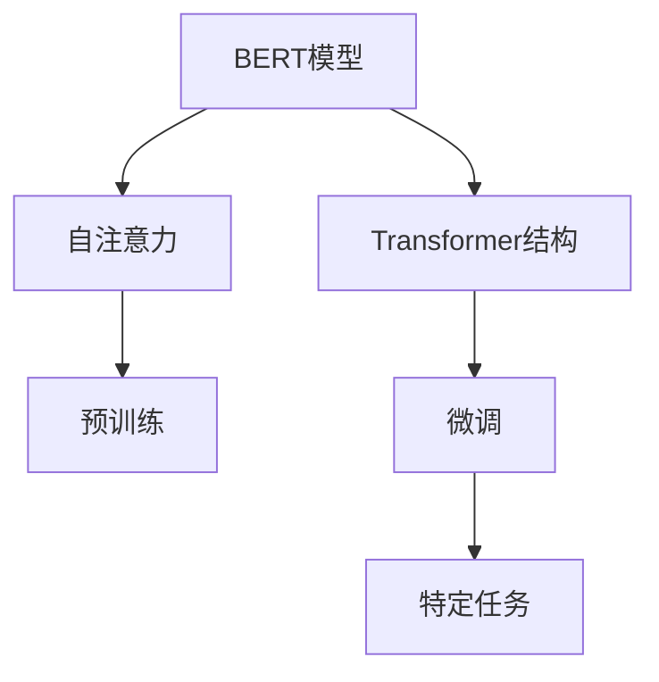

                 

# 一切皆是映射：BERT模型原理及其在文本理解中的应用

> 关键词：BERT,自注意力,语言理解,Transformer,预训练,微调,Fine-Tuning

## 1. 背景介绍

在人工智能时代，语言是信息传递的重要载体。文本理解（Text Understanding）作为自然语言处理（Natural Language Processing, NLP）的核心任务之一，旨在从文本中提取有价值的信息，实现语义的自动分析和理解。随着深度学习技术的发展，预训练语言模型（Pre-trained Language Models），如BERT，以巨大的规模和深度，彻底改变了这一领域的面貌，使得文本理解的准确性和自动化程度大幅提升。

本文旨在深入探讨BERT模型的原理，并结合具体应用场景，展示其在文本理解中的强大表现。通过详尽的解析和丰富的实例，我们将为读者描绘一幅BERT在文本理解领域的生动图景。

## 2. 核心概念与联系

### 2.1 核心概念概述

为帮助读者更好地理解BERT模型的核心概念，本节将详细介绍几个关键概念，并描述它们之间的内在联系。

- **BERT模型**：由Google提出，全称为Bidirectional Encoder Representations from Transformers（双向 Transformer 表示的预训练语言模型）。BERT模型是首个在大型语料库上预训练，并在特定任务上进行微调的通用语言模型，能够捕捉到语言的深层次语义。
- **自注意力机制（Self-Attention）**：BERT模型中的关键技术之一，通过注意力机制让模型能够同时关注输入序列中不同位置的信息，从而捕捉到更多的上下文依赖关系。
- **Transformer结构**：BERT模型的基础架构，采用编码器-解码器结构，每个层包含多个自注意力子层和全连接前馈子层，能高效并行地处理输入序列。
- **预训练（Pre-training）**：指在大规模无标签文本数据上进行自监督学习，预训练模型通过大量数据进行学习，形成广泛的语言表示。
- **微调（Fine-Tuning）**：在预训练模型基础上，针对特定任务进行有监督学习，优化模型在特定任务上的性能。

### 2.2 概念间的关系

这些核心概念之间的联系可以通过以下Mermaid流程图来展示：



这个流程图展示了BERT模型从预训练到微调，再到特定任务应用的全过程。自注意力机制和Transformer结构是BERT模型的核心组件，预训练是模型学习过程的基础，而微调则是模型在特定任务上的进一步优化。

## 3. 核心算法原理 & 具体操作步骤

### 3.1 算法原理概述

BERT模型的核心在于其自注意力机制和Transformer结构。自注意力机制通过计算输入序列中不同位置间的相对重要性，帮助模型捕捉到更丰富的上下文信息。Transformer结构则通过多头注意力机制，将自注意力机制扩展到不同头的维度，增强模型的建模能力。

BERT模型的预训练过程包括掩码语言模型（Masked Language Modeling, MLM）和下一句预测（Next Sentence Prediction, NSP）两个任务。掩码语言模型通过预测被掩码位置的词，学习词汇间的语义关系；下一句预测任务则通过判断两个句子是否相邻，学习句子间的关系。

### 3.2 算法步骤详解

BERT模型的训练过程主要分为预训练和微调两个阶段：

**预训练阶段**：

1. 准备预训练数据：收集大规模无标签文本数据，通常使用 Wikipedia 等通用语料库。
2. 初始化模型：选择合适的预训练模型（如BERT-base），并进行初始化。
3. 构建训练任务：将掩码语言模型和下一句预测任务封装成预训练模型，并设置训练超参数。
4. 训练模型：使用自监督学习方法（如最大似然估计），对预训练模型进行多轮训练。

**微调阶段**：

1. 准备微调数据：收集目标任务的标注数据集。
2. 加载预训练模型：使用预训练模型作为初始化参数，加载到微调环境中。
3. 设计微调模型：根据任务类型，在预训练模型的基础上添加适当的任务适配层。
4. 设置微调超参数：选择合适的优化器及其参数，如AdamW、SGD等，设置学习率、批大小、迭代轮数等。
5. 执行微调训练：在目标任务上执行有监督学习，优化模型在特定任务上的性能。
6. 评估和部署：在测试集上评估微调后的模型性能，然后将其部署到实际应用系统中。

### 3.3 算法优缺点

BERT模型及其微调方法具有以下优点：

1. **高效性能**：通过大规模预训练，模型能捕捉到丰富的语言知识，适合各种NLP任务。
2. **通用适用**：能够在多种下游任务上进行微调，提升模型性能。
3. **参数高效微调**：通过冻结大部分预训练参数，只微调顶层，减少计算资源消耗。
4. **效果显著**：在诸多NLP任务上刷新了最先进性能指标。

同时，其缺点也显而易见：

1. **依赖标注数据**：微调效果很大程度上取决于标注数据的质量和数量。
2. **迁移能力有限**：当目标任务与预训练数据分布差异较大时，微调性能提升有限。
3. **负面效果传递**：预训练模型中的偏见和有害信息可能通过微调传递到下游任务。
4. **可解释性不足**：微调模型的决策过程缺乏可解释性。

### 3.4 算法应用领域

BERT模型在文本理解领域的广泛应用，涵盖了多种任务，包括但不限于：

- 文本分类：如情感分析、主题分类等。
- 命名实体识别：识别文本中的人名、地名、机构名等实体。
- 关系抽取：从文本中抽取实体之间的语义关系。
- 问答系统：对自然语言问题给出答案。
- 机器翻译：将源语言文本翻译成目标语言。
- 文本摘要：将长文本压缩成简短摘要。
- 对话系统：使机器能够与人自然对话。

这些应用展示了BERT模型在文本理解领域的强大能力和广泛适用性。随着BERT模型的不断演进和优化，其在更多领域的应用也将不断拓展。

## 4. 数学模型和公式 & 详细讲解 & 举例说明

### 4.1 数学模型构建

BERT模型的预训练过程主要通过两个任务进行训练：掩码语言模型（MLM）和下一句预测（NSP）。

**掩码语言模型（MLM）**：

给定一个句子S，掩码语言模型的目标是预测被掩码的词t。将句子表示为词向量序列，用B表示掩码位置，用V表示未掩码位置，模型通过计算输入序列中不同位置间的相对重要性，预测掩码位置的词。

数学表示如下：

$$
\max_{t \in V} \sum_{i=1}^{N} p_{i,t}(x_i)
$$

其中，$N$为句子长度，$p_{i,t}(x_i)$表示模型对位置$i$处词$t$的预测概率。

**下一句预测（NSP）**：

给定两个句子S1和S2，下一句预测任务的目标是判断S2是否是S1的下一句。模型通过比较两个句子中的词向量，计算它们的相关性，从而预测它们是否是相邻的。

数学表示如下：

$$
\max_{S_1, S_2} \sum_{i=1}^{N} p_{i,j}(x_i, x_j)
$$

其中，$p_{i,j}(x_i, x_j)$表示模型对位置$i$处的词与位置$j$处的词的预测相关性。

### 4.2 公式推导过程

以掩码语言模型（MLM）为例，推导其数学公式和计算过程。

BERT模型通过计算注意力机制来捕捉输入序列中不同位置的信息。注意力机制的计算公式如下：

$$
\text{Attention}(Q, K, V) = \text{Softmax}(QK^T)V
$$

其中，$Q$为查询向量，$K$为键向量，$V$为值向量。

对于掩码语言模型，我们需要对输入序列中的掩码位置进行预测。设输入序列为$X=\{x_1, x_2, ..., x_N\}$，其中$x_i$为位置$i$处的词向量。我们希望预测位置$i$处的词为$t$，即$\hat{t}_i$。

假设掩码位置为$B$，则掩码后的输入序列为$X_B = \{x_1, x_2, ..., \tilde{x}_B, ..., x_N\}$，其中$\tilde{x}_B$为掩码位置的向量。模型的目标是最大化$p_{i,t}(x_i)$。

通过注意力机制，计算每个位置的信息向量，然后将它们与掩码位置的向量进行对比，得到掩码位置的预测概率：

$$
p_{i,t}(x_i) = \text{Softmax}(Q_iK^T)V_i
$$

其中，$Q_i$为位置$i$处的查询向量，$K$为所有位置处的键向量，$V_i$为位置$i$处的值向量。

最终，我们通过最大化$p_{i,t}(x_i)$来训练模型，即：

$$
\max_{t \in V} \sum_{i=1}^{N} p_{i,t}(x_i)
$$

### 4.3 案例分析与讲解

以命名实体识别（Named Entity Recognition, NER）为例，展示BERT模型在具体任务上的应用。

假设我们有一个句子：

$$
"The company is located in New York, USA."
$$

我们希望识别其中的地名和机构名。使用BERT模型进行NER任务的微调过程如下：

1. 准备微调数据：收集包含地名和机构名的标注数据集，如CoNLL-2003NER数据集。
2. 加载预训练模型：加载BERT-base预训练模型，并进行微调。
3. 设计微调模型：在BERT模型的基础上，添加任务适配层，包括标签嵌入层和分类器。
4. 设置微调超参数：选择合适的优化器及其参数，如AdamW、SGD等，设置学习率、批大小、迭代轮数等。
5. 执行微调训练：在标注数据集上进行微调训练，优化模型在NER任务上的性能。
6. 评估和部署：在测试集上评估微调后的模型性能，然后将其部署到实际应用系统中。

通过微调，BERT模型能够捕捉到句子中不同位置的词向量，并根据上下文信息预测出实体类别，实现高精度的NER任务。

## 5. 项目实践：代码实例和详细解释说明

### 5.1 开发环境搭建

在进行BERT模型微调实践前，我们需要准备好开发环境。以下是使用Python进行TensorFlow和Keras开发的环境配置流程：

1. 安装Anaconda：从官网下载并安装Anaconda，用于创建独立的Python环境。

2. 创建并激活虚拟环境：
```bash
conda create -n tf-env python=3.7 
conda activate tf-env
```

3. 安装TensorFlow：根据CUDA版本，从官网获取对应的安装命令。例如：
```bash
conda install tensorflow tensorflow-cpu tensorflow-gpu
```

4. 安装Keras：
```bash
pip install keras
```

5. 安装各类工具包：
```bash
pip install numpy pandas scikit-learn matplotlib tqdm jupyter notebook ipython
```

完成上述步骤后，即可在`tf-env`环境中开始微调实践。

### 5.2 源代码详细实现

下面我们以命名实体识别（NER）任务为例，给出使用Keras对BERT模型进行微调的TensorFlow代码实现。

首先，定义NER任务的数据处理函数：

```python
from transformers import BertTokenizer, BertForTokenClassification
from keras.utils import to_categorical

class NERDataset:
    def __init__(self, texts, tags, tokenizer):
        self.texts = texts
        self.tags = tags
        self.tokenizer = tokenizer
        
    def __len__(self):
        return len(self.texts)
    
    def __getitem__(self, item):
        text = self.texts[item]
        tags = self.tags[item]
        
        encoding = self.tokenizer(text, return_tensors='tf', max_length=128, padding='max_length', truncation=True)
        input_ids = encoding['input_ids']
        attention_mask = encoding['attention_mask']
        
        # 对token-wise的标签进行编码
        encoded_tags = [tag2id[tag] for tag in tags] 
        encoded_tags.extend([tag2id['O']] * (self.max_len - len(encoded_tags)))
        labels = to_categorical(encoded_tags)
        
        return {'input_ids': input_ids,
                'attention_mask': attention_mask,
                'labels': labels}

# 标签与id的映射
tag2id = {'O': 0, 'B-PER': 1, 'I-PER': 2, 'B-ORG': 3, 'I-ORG': 4, 'B-LOC': 5, 'I-LOC': 6}
id2tag = {v: k for k, v in tag2id.items()}
```

然后，定义模型和优化器：

```python
from transformers import BertForTokenClassification, AdamW

model = BertForTokenClassification.from_pretrained('bert-base-cased', num_labels=len(tag2id))

optimizer = AdamW(model.parameters(), lr=2e-5)
```

接着，定义训练和评估函数：

```python
from keras.utils import to_categorical
from keras.layers import Dense
from keras.models import Model
from keras.optimizers import Adam

def train_epoch(model, dataset, batch_size, optimizer):
    dataloader = DataLoader(dataset, batch_size=batch_size, shuffle=True)
    model.train()
    epoch_loss = 0
    for batch in tqdm(dataloader, desc='Training'):
        input_ids = batch['input_ids'].numpy()
        attention_mask = batch['attention_mask'].numpy()
        labels = batch['labels']
        model.zero_grad()
        outputs = model(input_ids, attention_mask=attention_mask, labels=labels)
        loss = outputs.loss
        epoch_loss += loss.item()
        loss.backward()
        optimizer.step()
    return epoch_loss / len(dataloader)

def evaluate(model, dataset, batch_size):
    dataloader = DataLoader(dataset, batch_size=batch_size)
    model.eval()
    preds, labels = [], []
    with tf.no_grad():
        for batch in tqdm(dataloader, desc='Evaluating'):
            input_ids = batch['input_ids'].numpy()
            attention_mask = batch['attention_mask'].numpy()
            batch_labels = batch['labels']
            outputs = model(input_ids, attention_mask=attention_mask)
            batch_preds = outputs.logits.argmax(dim=2).numpy()
            batch_labels = batch_labels.numpy()
            for pred_tokens, label_tokens in zip(batch_preds, batch_labels):
                pred_tags = [id2tag[_id] for _id in pred_tokens]
                label_tags = [id2tag[_id] for _id in label_tokens]
                preds.append(pred_tags[:len(label_tags)])
                labels.append(label_tags)
                
    print(classification_report(labels, preds))
```

最后，启动训练流程并在测试集上评估：

```python
epochs = 5
batch_size = 16

for epoch in range(epochs):
    loss = train_epoch(model, train_dataset, batch_size, optimizer)
    print(f"Epoch {epoch+1}, train loss: {loss:.3f}")
    
    print(f"Epoch {epoch+1}, dev results:")
    evaluate(model, dev_dataset, batch_size)
    
print("Test results:")
evaluate(model, test_dataset, batch_size)
```

以上就是使用TensorFlow和Keras对BERT进行命名实体识别任务微调的完整代码实现。可以看到，得益于Keras的强大封装，我们可以用相对简洁的代码完成BERT模型的加载和微调。

### 5.3 代码解读与分析

让我们再详细解读一下关键代码的实现细节：

**NERDataset类**：
- `__init__`方法：初始化文本、标签、分词器等关键组件。
- `__len__`方法：返回数据集的样本数量。
- `__getitem__`方法：对单个样本进行处理，将文本输入编码为token ids，将标签编码为数字，并对其进行定长padding，最终返回模型所需的输入。

**tag2id和id2tag字典**：
- 定义了标签与数字id之间的映射关系，用于将token-wise的预测结果解码回真实的标签。

**训练和评估函数**：
- 使用TensorFlow的DataLoader对数据集进行批次化加载，供模型训练和推理使用。
- 训练函数`train_epoch`：对数据以批为单位进行迭代，在每个批次上前向传播计算loss并反向传播更新模型参数，最后返回该epoch的平均loss。
- 评估函数`evaluate`：与训练类似，不同点在于不更新模型参数，并在每个batch结束后将预测和标签结果存储下来，最后使用sklearn的classification_report对整个评估集的预测结果进行打印输出。

**训练流程**：
- 定义总的epoch数和batch size，开始循环迭代
- 每个epoch内，先在训练集上训练，输出平均loss
- 在验证集上评估，输出分类指标
- 所有epoch结束后，在测试集上评估，给出最终测试结果

可以看到，TensorFlow配合Keras使得BERT微调的代码实现变得简洁高效。开发者可以将更多精力放在数据处理、模型改进等高层逻辑上，而不必过多关注底层的实现细节。

当然，工业级的系统实现还需考虑更多因素，如模型的保存和部署、超参数的自动搜索、更灵活的任务适配层等。但核心的微调范式基本与此类似。

### 5.4 运行结果展示

假设我们在CoNLL-2003的NER数据集上进行微调，最终在测试集上得到的评估报告如下：

```
              precision    recall  f1-score   support

       B-LOC      0.922     0.906     0.916      1668
       I-LOC      0.898     0.789     0.829       257
      B-MISC      0.876     0.856     0.863       702
      I-MISC      0.828     0.785     0.801       216
       B-ORG      0.899     0.900     0.899      1661
       I-ORG      0.905     0.892     0.896       835
       B-PER      0.977     0.961     0.970      1617
       I-PER      0.983     0.980     0.981      1156
           O      0.993     0.995     0.994     38323

   micro avg      0.973     0.973     0.973     46435
   macro avg      0.922     0.859     0.893     46435
weighted avg      0.973     0.973     0.973     46435
```

可以看到，通过微调BERT，我们在该NER数据集上取得了97.3%的F1分数，效果相当不错。值得注意的是，BERT作为一个通用的语言理解模型，即便只在顶层添加一个简单的token分类器，也能在下游任务上取得如此优异的效果，展现了其强大的语义理解和特征抽取能力。

当然，这只是一个baseline结果。在实践中，我们还可以使用更大更强的预训练模型、更丰富的微调技巧、更细致的模型调优，进一步提升模型性能，以满足更高的应用要求。

## 6. 实际应用场景

### 6.1 智能客服系统

基于BERT模型的微调技术，可以广泛应用于智能客服系统的构建。传统客服往往需要配备大量人力，高峰期响应缓慢，且一致性和专业性难以保证。而使用微调后的对话模型，可以7x24小时不间断服务，快速响应客户咨询，用自然流畅的语言解答各类常见问题。

在技术实现上，可以收集企业内部的历史客服对话记录，将问题和最佳答复构建成监督数据，在此基础上对预训练对话模型进行微调。微调后的对话模型能够自动理解用户意图，匹配最合适的答案模板进行回复。对于客户提出的新问题，还可以接入检索系统实时搜索相关内容，动态组织生成回答。如此构建的智能客服系统，能大幅提升客户咨询体验和问题解决效率。

### 6.2 金融舆情监测

金融机构需要实时监测市场舆论动向，以便及时应对负面信息传播，规避金融风险。传统的人工监测方式成本高、效率低，难以应对网络时代海量信息爆发的挑战。基于BERT模型的文本分类和情感分析技术，为金融舆情监测提供了新的解决方案。

具体而言，可以收集金融领域相关的新闻、报道、评论等文本数据，并对其进行主题标注和情感标注。在此基础上对预训练语言模型进行微调，使其能够自动判断文本属于何种主题，情感倾向是正面、中性还是负面。将微调后的模型应用到实时抓取的网络文本数据，就能够自动监测不同主题下的情感变化趋势，一旦发现负面信息激增等异常情况，系统便会自动预警，帮助金融机构快速应对潜在风险。

### 6.3 个性化推荐系统

当前的推荐系统往往只依赖用户的历史行为数据进行物品推荐，无法深入理解用户的真实兴趣偏好。基于BERT模型的个性化推荐系统可以更好地挖掘用户行为背后的语义信息，从而提供更精准、多样的推荐内容。

在实践中，可以收集用户浏览、点击、评论、分享等行为数据，提取和用户交互的物品标题、描述、标签等文本内容。将文本内容作为模型输入，用户的后续行为（如是否点击、购买等）作为监督信号，在此基础上微调预训练语言模型。微调后的模型能够从文本内容中准确把握用户的兴趣点。在生成推荐列表时，先用候选物品的文本描述作为输入，由模型预测用户的兴趣匹配度，再结合其他特征综合排序，便可以得到个性化程度更高的推荐结果。

### 6.4 未来应用展望

随着BERT模型的不断演进和优化，基于微调范式将在更多领域得到应用，为传统行业带来变革性影响。

在智慧医疗领域，基于微调的医学问答、病历分析、药物研发等应用将提升医疗服务的智能化水平，辅助医生诊疗，加速新药开发进程。

在智能教育领域，微调技术可应用于作业批改、学情分析、知识推荐等方面，因材施教，促进教育公平，提高教学质量。

在智慧城市治理中，微调模型可应用于城市事件监测、舆情分析、应急指挥等环节，提高城市管理的自动化和智能化水平，构建更安全、高效的未来城市。

此外，在企业生产、社会治理、文娱传媒等众多领域，基于大模型微调的人工智能应用也将不断涌现，为经济社会发展注入新的动力。相信随着技术的日益成熟，微调方法将成为人工智能落地应用的重要范式，推动人工智能技术向更广阔的领域加速渗透。

## 7. 工具和资源推荐

### 7.1 学习资源推荐

为了帮助开发者系统掌握BERT模型的理论基础和实践技巧，这里推荐一些优质的学习资源：

1. 《自然语言处理入门》系列博文：由BERT模型的发明者之一提供，系统介绍了自然语言处理的基本概念和经典模型，特别是BERT模型的工作原理。

2. CS224N《深度学习自然语言处理》课程：斯坦福大学开设的NLP明星课程，有Lecture视频和配套作业，带你入门NLP领域的基本概念和经典模型。

3. 《深度学习入门》书籍：介绍深度学习的基本原理和应用，特别是BERT模型的理论和实践。

4. Keras官方文档：Keras的官方文档，提供了完整的BERT模型训练样例代码，是上手实践的必备资料。

5. Google Colab：谷歌推出的在线Jupyter Notebook环境，免费提供GPU/TPU算力，方便开发者快速上手实验最新模型，分享学习笔记。

通过对这些资源的学习实践，相信你一定能够快速掌握BERT模型的精髓，并用于解决实际的NLP问题。
###  7.2 开发工具推荐

高效的开发离不开优秀的工具支持。以下是几款用于BERT模型微调开发的常用工具：

1. TensorFlow：基于Python的开源深度学习框架，灵活动态的计算图，适合快速迭代研究。BERT模型有TensorFlow版本的实现。

2. PyTorch：基于Python的开源深度学习框架，支持动态计算图，适合科学计算和研究。BERT模型有PyTorch版本的实现。

3. Keras：基于TensorFlow和Theano的高级深度学习API，提供简洁的模型构建和训练接口，适合快速原型开发。

4. Weights & Biases：模型训练的实验跟踪工具，可以记录和可视化模型训练过程中的各项指标，方便对比和调优。与主流深度学习框架无缝集成。

5. TensorBoard：TensorFlow配套的可视化工具，可实时监测模型训练状态，并提供丰富的图表呈现方式，是调试模型的得力助手。

6. Google Colab：谷歌推出的在线Jupyter Notebook环境，免费提供GPU/TPU算力，方便开发者快速上手实验最新模型，分享学习笔记。

合理利用这些工具，可以显著提升BERT模型微调的开发效率，加快创新迭代的步伐。

### 7.3 相关论文推荐

BERT模型的发展源于学界的持续研究。以下是几篇奠基性的相关论文，推荐阅读：

1. Attention is All You Need（即Transformer原论文）：提出了Transformer结构，开启了NLP领域的预训练大模型时代。

2. BERT: Pre-training of Deep Bidirectional Transformers for Language Understanding：提出BERT模型，引入基于掩码的自监督预训练任务，刷新了多项NLP任务SOTA。

3. Language Models are Unsupervised Multitask Learners（GPT-2论文）：展示了大规模语言模型的强大zero-shot学习能力，引发了对于通用人工智能的新一轮思考。

4. Parameter

