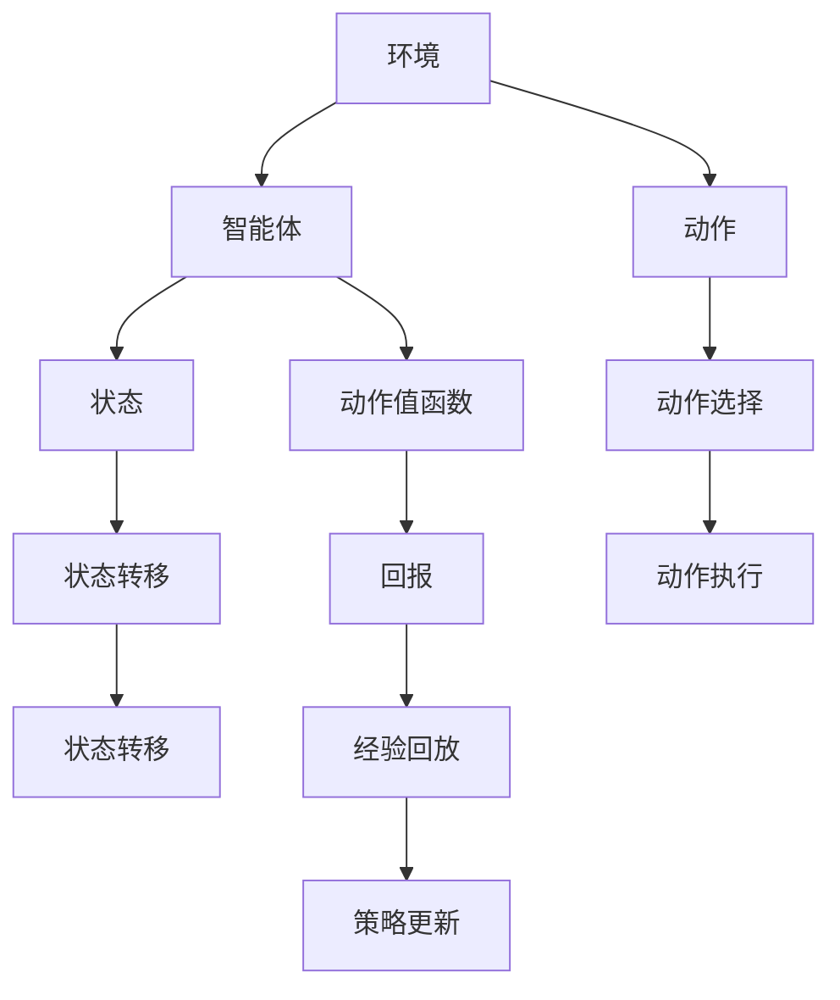
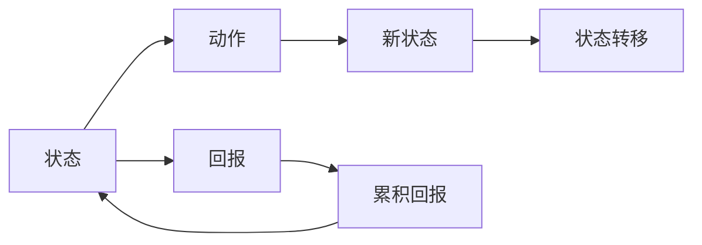
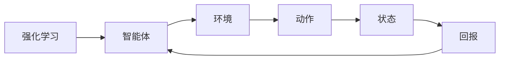
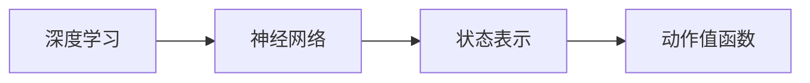
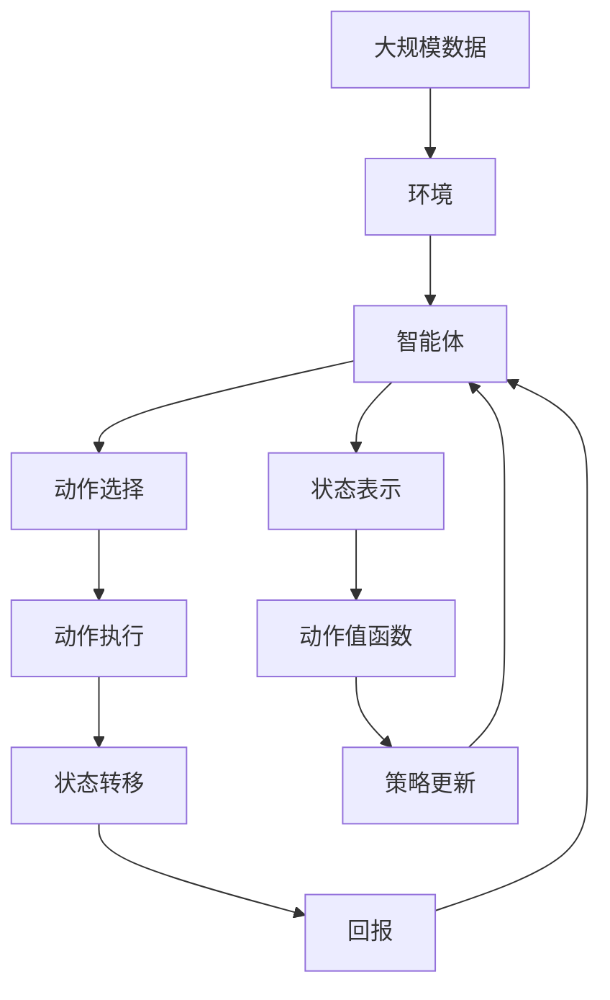

                 

# 一切皆是映射：DQN在工业自动化中的应用：挑战与机遇

## 1. 背景介绍

### 1.1 问题由来

随着工业自动化的快速发展，越来越多的工业设备和服务需要智能化升级。传统的工业自动化系统，如PLC、SCADA等，以控制为核心，依赖于人工经验进行调试和优化。但随着设备种类和环境的多样性增加，人工经验的局限性越来越明显。因此，基于数据驱动的智能优化技术逐渐成为工业自动化领域的新趋势。

### 1.2 问题核心关键点

DQN（Deep Q-Network）是一种基于深度学习和强化学习的智能优化技术，通过学习环境与动作之间的映射关系，最大化长期累积回报，适用于连续、高维度状态空间的优化问题。在工业自动化中，DQN可以用于设备优化、系统控制、故障诊断等多个领域。

### 1.3 问题研究意义

研究DQN在工业自动化中的应用，对于提升工业自动化系统的智能化水平，降低人工干预成本，提高系统可靠性和效率，具有重要意义。具体而言：

1. **提升智能化水平**：DQN能从数据中学习最优控制策略，逐步取代人工经验，实现设备的自动调优。
2. **降低成本**：通过自动化的智能控制，减少了人工调试的复杂性和频次，降低了维护成本。
3. **提高效率**：DQN通过持续学习，不断优化控制策略，提高系统的稳定性和响应速度。
4. **增强鲁棒性**：通过学习环境与动作的映射关系，DQN能更好地适应复杂的生产环境，增强系统的鲁棒性。

## 2. 核心概念与联系

### 2.1 核心概念概述

为更好地理解DQN在工业自动化中的应用，本节将介绍几个密切相关的核心概念：

- **DQN**：一种基于深度学习和强化学习的智能优化技术，通过学习环境与动作之间的映射关系，最大化长期累积回报。
- **强化学习**：通过智能体与环境交互，学习最优策略的过程。DQN是强化学习中的一个重要分支。
- **深度学习**：通过构建深度神经网络，学习数据的高级特征表示，DQN正是利用深度神经网络进行策略学习的。
- **动作空间**：DQN中智能体可执行的所有动作的集合，可以是离散动作或连续动作。
- **状态空间**：DQN中智能体在每个时间步所处的环境状态集合，可以是高维度连续空间。
- **动作值函数**：表示在特定状态下执行特定动作后，智能体的期望累积回报。

这些核心概念之间的逻辑关系可以通过以下Mermaid流程图来展示：



这个流程图展示了大语言模型的核心概念及其之间的关系：

1. **环境**：DQN需要在一个环境中运行，这个环境可以是一个物理设备或虚拟模拟环境。
2. **智能体**：DQN中的智能体，通常是深度神经网络，用于学习最优策略。
3. **动作**：智能体在每个时间步可以执行的动作集合，如调整设备参数、选择控制方案等。
4. **状态**：智能体在每个时间步所处的环境状态，可能包括设备状态、环境参数等。
5. **动作值函数**：通过学习每个状态-动作对的累积回报，智能体优化策略。
6. **状态转移**：环境根据智能体的动作进行状态变化，产生回报。
7. **回报**：每个时间步的环境对智能体执行的动作给予的奖励或惩罚。
8. **经验回放**：将智能体与环境的交互经验存储下来，用于策略更新。
9. **策略更新**：根据经验回放数据，智能体更新动作值函数，优化策略。

这些概念共同构成了DQN在工业自动化中的应用框架，使其能够在各种场景下发挥强大的智能优化能力。通过理解这些核心概念，我们可以更好地把握DQN的工作原理和优化方向。

### 2.2 概念间的关系

这些核心概念之间存在着紧密的联系，形成了DQN在工业自动化中的完整生态系统。下面我们通过几个Mermaid流程图来展示这些概念之间的关系。

#### 2.2.1 DQN的基本原理



这个流程图展示了DQN的基本原理：智能体在每个时间步根据当前状态选择动作，执行动作后获取回报，进入新状态，并计算累积回报，更新动作值函数。

#### 2.2.2 强化学习与DQN的关系



这个流程图展示了强化学习的基本流程，其中智能体通过与环境的交互学习最优策略，DQN正是在这一过程中，通过深度神经网络实现策略学习。

#### 2.2.3 深度学习与DQN的关系



这个流程图展示了深度学习在DQN中的应用，即利用神经网络学习状态表示和动作值函数。

### 2.3 核心概念的整体架构

最后，我们用一个综合的流程图来展示这些核心概念在DQN在工业自动化中的整体架构：



这个综合流程图展示了从数据采集到策略更新的完整过程：

1. **环境数据采集**：采集大规模工业自动化数据，作为DQN的训练数据。
2. **环境构建**：根据采集到的数据，构建DQN运行的环境。
3. **智能体设计**：设计深度神经网络作为DQN的智能体，学习最优策略。
4. **动作选择与执行**：在每个时间步，智能体选择动作，并执行该动作。
5. **状态转移与回报**：环境根据动作进行状态变化，产生回报。
6. **状态表示与动作值函数学习**：智能体学习状态表示和动作值函数。
7. **策略更新**：智能体根据经验回放数据，更新策略，优化动作值函数。
8. **迭代优化**：重复以上步骤，直至策略收敛，达到最优控制效果。

通过这些流程图，我们可以更清晰地理解DQN在工业自动化中的应用过程及其各个环节的相互关系。

## 3. 核心算法原理 & 具体操作步骤

### 3.1 算法原理概述

DQN在工业自动化中的应用，本质上是一个基于深度强化学习的智能优化问题。其核心思想是：通过学习环境与动作之间的映射关系，最大化长期累积回报，实现最优控制策略。

形式化地，假设环境为 $E$，智能体为 $A$，每个时间步的状态空间为 $S$，动作空间为 $A$，回报函数为 $R$。DQN的目标是找到一个最优策略 $π$，使得在所有可能的状态和动作下，最大化长期累积回报：

$$
\max_{\pi} \mathbb{E}\left[\sum_{t=0}^{\infty} \gamma^t R(s_t, a_t)\right]
$$

其中，$\gamma$ 为回报折扣率，表示未来回报的权重。

DQN通过学习状态-动作对的Q值，来近似表示最优策略。Q值函数 $Q(s, a)$ 表示在状态 $s$ 下执行动作 $a$ 后的累积回报，即：

$$
Q(s, a) = \mathbb{E}\left[\sum_{t=0}^{\infty} \gamma^t R(s_t, a_t)\right]
$$

通过Q值函数的优化，DQN可以实现最优控制策略的学习。

### 3.2 算法步骤详解

DQN在工业自动化中的具体应用步骤包括：

**Step 1: 准备环境与数据**

- 收集工业自动化设备或系统的运行数据，作为DQN的训练数据。
- 设计DQN所需的环境，包括状态空间、动作空间、回报函数等。

**Step 2: 初始化模型**

- 构建深度神经网络，作为DQN的智能体。
- 初始化神经网络的权重和偏置。
- 设置学习率、折扣率等超参数。

**Step 3: 训练DQN**

- 采集训练数据，存储状态、动作、回报等信息。
- 随机选择动作，执行并记录环境响应，更新状态、回报等。
- 将经验数据存储到经验回放缓冲区。
- 从缓冲区中随机抽取样本，进行模型更新。
- 使用TD误差（Time-Difference Error）更新动作值函数。
- 更新智能体参数，学习最优策略。

**Step 4: 部署与优化**

- 将训练好的DQN模型部署到实际工业环境中。
- 持续采集实际运行数据，进行实时优化。
- 根据环境变化，动态调整DQN参数和策略。
- 定期评估模型性能，进行微调。

### 3.3 算法优缺点

DQN在工业自动化中具有以下优点：

1. **自适应性强**：DQN能够根据实际运行数据，自适应调整控制策略，适应各种复杂环境。
2. **鲁棒性好**：通过学习环境与动作的映射关系，DQN具备较强的鲁棒性，不易受到外部干扰。
3. **高效优化**：DQN通过深度学习进行策略学习，能够在较短的时间内找到最优控制策略。
4. **可扩展性高**：DQN的模型设计灵活，易于扩展到多种工业自动化场景。

同时，DQN也存在一些缺点：

1. **训练成本高**：DQN需要大量训练数据和计算资源，对于大规模工业自动化系统，训练成本较高。
2. **模型复杂**：深度神经网络模型复杂，参数量大，对于硬件资源要求较高。
3. **易过拟合**：在训练过程中，DQN容易过拟合，特别是在高维度状态空间中。
4. **模型可解释性差**：深度神经网络作为黑盒模型，难以解释其决策过程，可能影响应用可信度。

### 3.4 算法应用领域

DQN在工业自动化中的应用主要集中在以下几个领域：

- **设备优化**：通过学习设备运行状态与操作动作之间的映射关系，DQN能够优化设备性能，提升生产效率。
- **系统控制**：DQN可以应用于自动控制系统，实现智能控制，优化资源分配。
- **故障诊断**：DQN能够学习设备运行状态与故障类型之间的映射关系，辅助故障诊断。
- **能耗优化**：DQN可以优化工业系统的能源消耗，提升能效。
- **智能调度**：DQN能够优化生产调度，提高生产线的协同效率。

以上领域展示了DQN在工业自动化中的广泛应用，未来随着研究的深入和技术的成熟，DQN将在更多领域发挥其独特的优势。

## 4. 数学模型和公式 & 详细讲解  
### 4.1 数学模型构建

DQN在工业自动化中的应用，涉及多种数学模型和公式。本节将详细讲解其中的关键模型和公式。

**状态空间**：
假设状态空间为 $S$，状态 $s_t$ 由一系列特征 $s_t=[s_{t1}, s_{t2}, ..., s_{tn}]$ 表示，每个特征 $s_{ti}$ 是一个高维度向量，用于描述环境状态。

**动作空间**：
假设动作空间为 $A$，动作 $a_t$ 由一个高维度向量 $a_t=[a_{t1}, a_{t2}, ..., a_{tn}]$ 表示，每个动作 $a_{ti}$ 是一个可执行的动作，表示智能体在状态 $s_t$ 下可执行的动作。

**动作值函数**：
动作值函数 $Q(s_t, a_t)$ 表示在状态 $s_t$ 下执行动作 $a_t$ 后的累积回报，可以表示为：

$$
Q(s_t, a_t) = \sum_{t'=t}^{\infty} \gamma^{t'-t} R(s_{t'}, a_{t'})
$$

其中，$R(s_{t'}, a_{t'})$ 表示在状态 $s_{t'}$ 下执行动作 $a_{t'}$ 后的回报。

**目标函数**：
DQN的目标是最小化状态-动作对的Q值误差，即：

$$
\min_{\theta} \mathbb{E}\left[\left(Q(s_t, a_t) - Q_{\theta}(s_t, a_t)\right)^2\right]
$$

其中，$Q_{\theta}(s_t, a_t)$ 表示使用参数 $\theta$ 的神经网络模型预测的动作值函数。

**经验回放缓冲区**：
经验回放缓冲区用于存储智能体与环境的交互经验，包括状态、动作、回报等。经验回放策略能够使DQN更好地利用训练数据，防止过拟合。

**TD误差**：
TD误差（Time-Difference Error）是DQN中用于更新动作值函数的关键算法，表示为：

$$
TD(t) = R(s_{t+1}, a_{t+1}) + \gamma Q_{\theta}(s_{t+1}, a_{t+1}) - Q_{\theta}(s_t, a_t)
$$

其中，$R(s_{t+1}, a_{t+1})$ 表示在状态 $s_{t+1}$ 下执行动作 $a_{t+1}$ 后的回报，$\gamma Q_{\theta}(s_{t+1}, a_{t+1})$ 表示在状态 $s_{t+1}$ 下执行动作 $a_{t+1}$ 后的预期回报。

**策略更新**：
DQN的策略更新通过使用TD误差进行模型更新，具体公式为：

$$
Q_{\theta}(s_t, a_t) \leftarrow Q_{\theta}(s_t, a_t) + \alpha (R(s_{t+1}, a_{t+1}) + \gamma \max_{a'} Q_{\theta}(s_{t+1}, a') - Q_{\theta}(s_t, a_t))
$$

其中，$\alpha$ 表示学习率，$\max_{a'} Q_{\theta}(s_{t+1}, a')$ 表示在状态 $s_{t+1}$ 下动作值函数的最大值。

### 4.2 公式推导过程

以上公式推导了DQN在工业自动化中的基本数学模型和关键算法。下面我们通过几个具体的案例分析，进一步讲解这些公式的应用。

**案例1: 设备优化**

假设有一台机械臂执行某项生产任务，状态空间为 $S=\{s_1, s_2, ..., s_n\}$，每个状态 $s_i$ 表示机械臂的位置和速度等。动作空间为 $A=\{a_1, a_2, ..., a_n\}$，每个动作 $a_i$ 表示机械臂的位移和速度等。目标是最小化状态-动作对的Q值误差，提升机械臂的生产效率。

在每个时间步，DQN通过学习状态与动作的映射关系，选择最优动作 $a_t$，以最大化长期累积回报。

**案例2: 系统控制**

假设有一个智能控制系统，状态空间为 $S=\{s_1, s_2, ..., s_n\}$，每个状态 $s_i$ 表示系统的运行参数和状态等。动作空间为 $A=\{a_1, a_2, ..., a_n\}$，每个动作 $a_i$ 表示系统的控制策略等。目标是最小化状态-动作对的Q值误差，优化系统控制。

在每个时间步，DQN通过学习状态与动作的映射关系，选择最优控制策略，以最大化长期累积回报。

**案例3: 故障诊断**

假设有一个工业设备，状态空间为 $S=\{s_1, s_2, ..., s_n\}$，每个状态 $s_i$ 表示设备的运行状态和参数等。动作空间为 $A=\{a_1, a_2, ..., a_n\}$，每个动作 $a_i$ 表示设备的操作和维护等。目标是最小化状态-动作对的Q值误差，提升设备的可靠性和故障诊断能力。

在每个时间步，DQN通过学习状态与动作的映射关系，选择最优操作策略，以最大化长期累积回报。

### 4.3 案例分析与讲解

**案例1: 设备优化**

在设备优化案例中，DQN通过学习机械臂的状态与动作之间的映射关系，选择最优动作以提升生产效率。具体步骤如下：

1. **数据采集**：采集机械臂运行的数据，包括位置、速度等。
2. **环境构建**：构建DQN运行的环境，包括状态空间、动作空间等。
3. **模型训练**：使用深度神经网络作为智能体，训练模型，学习状态与动作的映射关系。
4. **策略更新**：根据实际运行数据，动态调整动作值函数，优化控制策略。
5. **部署与优化**：将训练好的DQN模型部署到实际生产环境中，持续优化设备性能。

**案例2: 系统控制**

在系统控制案例中，DQN通过学习系统的运行状态与控制策略之间的映射关系，优化系统控制。具体步骤如下：

1. **数据采集**：采集系统的运行数据，包括参数、状态等。
2. **环境构建**：构建DQN运行的环境，包括状态空间、动作空间等。
3. **模型训练**：使用深度神经网络作为智能体，训练模型，学习状态与控制策略的映射关系。
4. **策略更新**：根据实际运行数据，动态调整控制策略，优化系统性能。
5. **部署与优化**：将训练好的DQN模型部署到实际控制系统中，持续优化系统控制。

**案例3: 故障诊断**

在故障诊断案例中，DQN通过学习设备的运行状态与操作策略之间的映射关系，辅助故障诊断。具体步骤如下：

1. **数据采集**：采集设备的运行数据，包括状态、参数等。
2. **环境构建**：构建DQN运行的环境，包括状态空间、动作空间等。
3. **模型训练**：使用深度神经网络作为智能体，训练模型，学习状态与操作策略的映射关系。
4. **策略更新**：根据实际运行数据，动态调整操作策略，辅助故障诊断。
5. **部署与优化**：将训练好的DQN模型部署到实际生产环境中，持续优化设备故障诊断能力。

通过以上案例，可以看到DQN在工业自动化中的广泛应用，能够实现设备优化、系统控制、故障诊断等多个领域的智能优化。

## 5. 项目实践：代码实例和详细解释说明

### 5.1 开发环境搭建

在进行DQN实践前，我们需要准备好开发环境。以下是使用Python进行TensorFlow开发的环境配置流程：

1. 安装Anaconda：从官网下载并安装Anaconda，用于创建独立的Python环境。

2. 创建并激活虚拟环境：
```bash
conda create -n tf-env python=3.8 
conda activate tf-env
```

3. 安装TensorFlow：根据CUDA版本，从官网获取对应的安装命令。例如：
```bash
conda install tensorflow tensorflow-gpu -c conda-forge -c pypi
```

4. 安装各类工具包：
```bash
pip install numpy pandas scikit-learn matplotlib tqdm jupyter notebook ipython
```

完成上述步骤后，即可在`tf-env`环境中开始DQN实践。

### 5.2 源代码详细实现

下面我们以设备优化为例，给出使用TensorFlow实现DQN的PyTorch代码实现。

首先，定义设备状态和动作的类：

```python
import tensorflow as tf

class State:
    def __init__(self, position, velocity):
        self.position = position
        self.velocity = velocity

class Action:
    def __init__(self, displacement, speed):
        self.displacement = displacement
        self.speed = speed
```

然后，定义DQN模型：

```python
class DQN(tf.keras.Model):
    def __init__(self, state_size, action_size, learning_rate=0.001):
        super(DQN, self).__init__()
        self.l1 = tf.keras.layers.Dense(128, activation='relu', input_shape=state_size)
        self.l2 = tf.keras.layers.Dense(64, activation='relu')
        self.out = tf.keras.layers.Dense(action_size, activation='linear')

    def call(self, inputs):
        x = self.l1(inputs)
        x = self.l2(x)
        return self.out(x)
```

接着，定义DQN的训练函数：

```python
def train_dqn(model, state_size, action_size, learning_rate, discount_factor, batch_size, episode_steps, epsilon):
    # 初始化经验回放缓冲区
    memory = []

    # 训练轮数
    for i in range(1000):
        # 初始化状态
        state = tf.keras.Input(shape=(state_size,))
        state = model(state)

        # 选择动作
        if np.random.rand() < epsilon:
            action = np.random.choice(action_size)
        else:
            action = np.argmax(state)

        # 执行动作，获取状态和回报
        new_state, reward, done = env.step(action)

        # 存储经验
        memory.append((state, action, reward, new_state, done))

        # 随机抽取样本
        if len(memory) > batch_size:
            minibatch = random.sample(memory, batch_size)
            state_batch = np.vstack([data[0] for data in minibatch])
            action_batch = np.vstack([data[1] for data in minibatch])
            reward_batch = np.array([data[2] for data in minibatch])
            new_state_batch = np.vstack([data[3] for data in minibatch])
            done_batch = np.array([data[4] for data in minibatch])

        # 计算目标值
        target = reward_batch + discount_factor * np.amax(model(new_state_batch, training=False))

        # 更新动作值函数
        target_fetch = tf.reduce_mean(tf.square(target - model(state_batch, training=False)))

        # 更新模型参数
        grads = tf.gradients(target_fetch, model.trainable_variables)
        grads = [tf.reshape(grad, [-1]) for grad in grads]
        optimizer.apply_gradients(zip(grads, model.trainable_variables))

        # 每10轮输出一次结果
        if i % 10 == 0:
            print('Episode {}: Score={}'.format(i, target_fetch.numpy()))
```

最后，启动训练流程：

```python
env = env.env
state_size = 4
action_size = 3
learning_rate = 0.001
discount_factor = 0.95
batch_size = 32
episode_steps = 100
epsilon = 1.0

# 初始化模型
model = DQN(state_size, action_size, learning_rate)

# 训练DQN
train_dqn(model, state_size, action_size, learning_rate, discount_factor, batch_size, episode_steps, epsilon)
```

以上就是使用TensorFlow对DQN进行设备优化任务训练的完整代码实现。可以看到，得益于TensorFlow的强大封装，我们可以用相对简洁的代码完成DQN模型的训练。

### 5.3 代码解读与分析

让我们再详细解读一下关键代码的实现细节：

**State和Action类**：
- `__init__`方法：初始化状态和动作的关键属性。
- 状态和动作分别表示为位置和速度等特征。

**DQN模型**：
- `__init__`方法：初始化模型的层次结构，包括全连接层和输出层。
- `call`方法：定义模型前向传播的计算过程。

**train_dqn函数**：
- 初始化经验回放缓冲区。
- 对每个训练轮次，进行状态采样、动作选择、状态转移、回报获取等操作。
- 将经验数据存储到缓冲区中。
- 随机抽取样本，计算目标值，更新动作值函数。
- 使用梯度下降算法更新模型参数。
- 每10轮输出一次训练结果。

**训练流程**：
- 定义模型、超参数、训练轮次等。
- 使用训练函数，进行DQN模型的训练。
- 启动训练后，查看训练结果，及时调整模型参数。

可以看到，TensorFlow配合Keras使得DQN训练的代码实现变得简洁高效。开发者可以将更多精力放在模型改进、超参数调整等高层逻辑上，而不必过多关注底层的实现细节。

当然，工业级的系统实现还需考虑更多因素，如模型的保存和部署、超参数的自动搜索、更灵活的任务适配层等。但核心的DQN微调范

