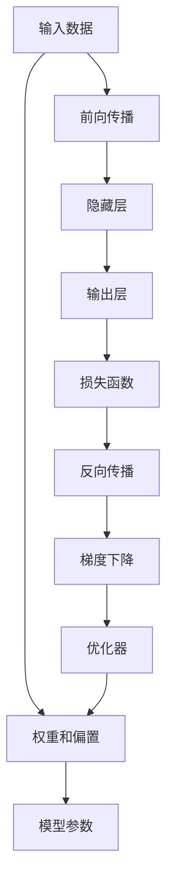
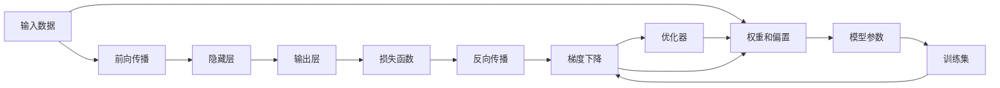
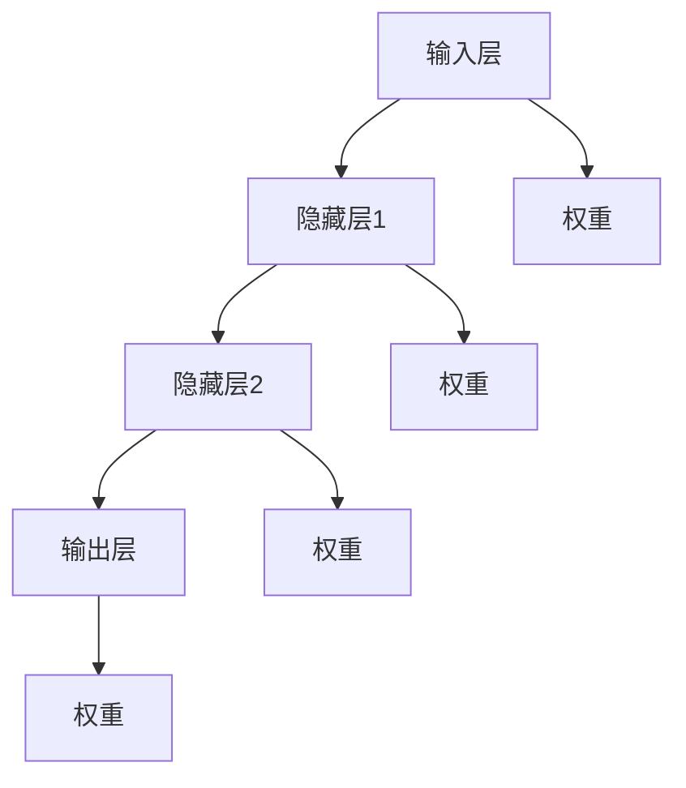
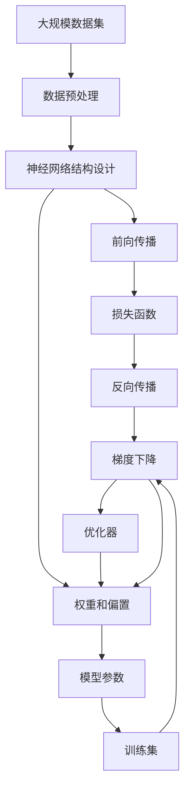

                 

# 一切皆是映射：从零开始构建深度学习架构

> 关键词：深度学习,神经网络,架构设计,前向传播,反向传播,梯度下降,优化器,损失函数,模型评估

## 1. 背景介绍

### 1.1 问题由来
随着人工智能技术的飞速发展，深度学习已成为最热门的研究方向之一。深度学习模型能够自动学习数据中的复杂特征，并在诸如计算机视觉、自然语言处理、语音识别等多个领域取得了显著的成果。然而，深度学习模型的构建并非易事，它涉及到大量的数学计算和工程技术，需要深厚的理论基础和实践经验。因此，从零开始构建深度学习模型，对很多初学者来说是一个巨大的挑战。

### 1.2 问题核心关键点
深度学习模型的构建需要经过以下几个核心步骤：
1. 定义模型架构：选择合适的神经网络结构和参数。
2. 定义前向传播和反向传播过程：计算模型输出和损失函数的值。
3. 定义优化器：选择合适的算法和超参数进行模型参数的更新。
4. 定义损失函数：衡量模型输出与真实标签之间的差异。
5. 模型评估：使用验证集和测试集评估模型性能。

本文将详细阐述这些核心步骤，帮助读者从零开始构建深度学习模型。

### 1.3 问题研究意义
构建深度学习模型是深度学习技术落地的基础。掌握模型的构建技巧，不仅可以帮助开发者更好地理解深度学习原理，还能使其在实际应用中更快地开发和部署模型。深度学习模型的构建对于推动人工智能技术的普及和应用具有重要意义。

## 2. 核心概念与联系

### 2.1 核心概念概述
为了更好地理解深度学习模型的构建过程，本节将介绍几个关键概念：

- 神经网络(Neural Network)：由大量神经元组成的计算模型，通过前向传播和反向传播算法进行训练，能够自动学习数据特征。
- 前向传播(Forward Propagation)：计算模型输入到输出之间的映射关系。
- 反向传播(Backward Propagation)：计算模型输出与输入之间的误差，并根据误差调整模型参数，以最小化损失函数。
- 梯度下降(Gradient Descent)：一种优化算法，通过不断迭代更新模型参数，最小化损失函数。
- 优化器(Optimizer)：用于计算梯度并更新模型参数的算法。
- 损失函数(Loss Function)：衡量模型输出与真实标签之间差异的函数。
- 模型评估(Model Evaluation)：使用验证集和测试集评估模型性能，包括准确率、精确率、召回率等指标。

这些核心概念之间的逻辑关系可以通过以下Mermaid流程图来展示：



这个流程图展示了深度学习模型从输入到输出的整个处理过程：

1. 输入数据通过前向传播计算输出。
2. 计算损失函数，衡量模型输出与真实标签之间的差异。
3. 反向传播计算误差，更新模型参数。
4. 使用优化器根据梯度下降算法更新模型参数。

这些核心概念共同构成了深度学习模型的核心逻辑，使其能够自动学习数据特征，并在各种应用中取得卓越效果。

### 2.2 概念间的关系

这些核心概念之间存在着紧密的联系，形成了深度学习模型的完整生态系统。下面通过几个Mermaid流程图来展示这些概念之间的关系。

#### 2.2.1 深度学习模型的学习过程


这个流程图展示了深度学习模型的学习过程：

1. 输入数据通过前向传播计算输出。
2. 计算损失函数，衡量模型输出与真实标签之间的差异。
3. 反向传播计算误差，更新模型参数。
4. 使用优化器根据梯度下降算法更新模型参数。
5. 在训练集上不断迭代，最小化损失函数。

#### 2.2.2 神经网络结构


这个流程图展示了神经网络的基本结构：

1. 输入层接收输入数据。
2. 通过多个隐藏层进行特征提取和变换。
3. 最终输出层计算模型的预测结果。
4. 各个层之间通过权重连接，形成复杂的计算图。

### 2.3 核心概念的整体架构
最后，我们用一个综合的流程图来展示这些核心概念在大规模深度学习模型构建中的整体架构：



这个综合流程图展示了从数据预处理到模型训练的完整过程：

1. 大规模数据集经过预处理，转化为模型输入。
2. 设计合适的神经网络结构。
3. 通过前向传播计算输出。
4. 计算损失函数，衡量模型输出与真实标签之间的差异。
5. 反向传播计算误差，更新模型参数。
6. 使用优化器根据梯度下降算法更新模型参数。
7. 在训练集上不断迭代，最小化损失函数。

这些概念共同构成了深度学习模型的学习范式，使其能够高效地学习数据特征，并应用于各种实际问题中。

## 3. 核心算法原理 & 具体操作步骤
### 3.1 算法原理概述

深度学习模型的构建过程，本质上是通过前向传播和反向传播算法，自动学习数据特征，并通过优化器不断迭代更新模型参数，最小化损失函数的过程。

形式化地，假设深度学习模型为 $M_{\theta}$，其中 $\theta$ 为模型参数。给定训练集 $D=\{(x_i, y_i)\}_{i=1}^N$，模型的目标是最小化经验风险：

$$
\hat{\theta}=\mathop{\arg\min}_{\theta} \mathcal{L}(M_{\theta},D)
$$

其中 $\mathcal{L}$ 为损失函数，用于衡量模型输出与真实标签之间的差异。常见的损失函数包括交叉熵损失、均方误差损失等。

通过梯度下降等优化算法，模型不断更新参数 $\theta$，最小化损失函数 $\mathcal{L}$，使得模型输出逼近真实标签。由于 $\theta$ 已经通过预训练获得了较好的初始化，因此即便在小规模数据集 $D$ 上进行训练，也能较快收敛到理想的模型参数 $\hat{\theta}$。

### 3.2 算法步骤详解

深度学习模型的构建通常包括以下几个关键步骤：

**Step 1: 准备数据集和模型架构**
- 收集和预处理大规模数据集。
- 设计合适的神经网络结构和参数。

**Step 2: 定义前向传播**
- 定义模型的输入层、隐藏层和输出层的计算公式。
- 使用激活函数和权重矩阵计算层与层之间的映射关系。

**Step 3: 定义损失函数**
- 选择合适的损失函数，如交叉熵损失、均方误差损失等。
- 计算模型输出与真实标签之间的差异。

**Step 4: 定义反向传播**
- 计算损失函数对模型参数的梯度。
- 使用链式法则计算每个参数的梯度。

**Step 5: 定义梯度下降和优化器**
- 选择适当的优化器，如SGD、Adam等。
- 根据梯度下降算法更新模型参数。

**Step 6: 训练和评估模型**
- 在训练集上不断迭代，最小化损失函数。
- 在验证集和测试集上评估模型性能。

**Step 7: 模型保存和部署**
- 将训练好的模型保存为文件或模型库。
- 在实际应用中加载和使用模型。

以上是深度学习模型构建的一般流程。在实际应用中，还需要针对具体任务进行优化和改进，如引入正则化技术、调整学习率、设计合适的损失函数等。

### 3.3 算法优缺点

深度学习模型具有以下优点：
1. 自动学习复杂特征：能够自动从数据中学习高层次的抽象特征，适用于各种复杂任务。
2. 适应性强：能够适应大规模数据集，通过不断迭代更新模型参数，逐步提高性能。
3. 效果显著：在图像识别、语音识别、自然语言处理等领域取得了突破性进展。

同时，深度学习模型也存在一些缺点：
1. 计算资源需求高：需要大量的计算资源和时间进行训练。
2. 可解释性不足：模型参数复杂，难以解释其内部工作机制。
3. 数据依赖性强：对数据质量和数量有较高要求，缺乏数据可能导致模型性能下降。
4. 过拟合风险：在训练集上过拟合的风险较大，需要采取正则化等技术进行缓解。

尽管存在这些缺点，深度学习模型仍然是当前人工智能领域的主流技术之一，其优越的性能和广泛的应用前景，使其在各个领域中具有重要地位。

### 3.4 算法应用领域

深度学习模型已经在多个领域得到了广泛应用，包括但不限于：

- 计算机视觉：图像分类、目标检测、人脸识别等。
- 自然语言处理：机器翻译、情感分析、问答系统等。
- 语音识别：语音识别、语音合成等。
- 推荐系统：个性化推荐、广告推荐等。
- 医疗诊断：医学影像分析、疾病预测等。

除了上述领域，深度学习模型还被应用于智能制造、金融分析、智能交通等多个行业，展现了其强大的应用潜力。

## 4. 数学模型和公式 & 详细讲解 & 举例说明

### 4.1 数学模型构建

深度学习模型的构建需要数学模型的支撑。本节将使用数学语言对深度学习模型进行详细描述。

假设深度学习模型为 $M_{\theta}$，其中 $\theta$ 为模型参数。假设训练集为 $D=\{(x_i, y_i)\}_{i=1}^N$，其中 $x_i$ 为输入，$y_i$ 为真实标签。模型的目标是最小化经验风险：

$$
\hat{\theta}=\mathop{\arg\min}_{\theta} \mathcal{L}(M_{\theta},D)
$$

其中 $\mathcal{L}$ 为损失函数，用于衡量模型输出与真实标签之间的差异。常见的损失函数包括交叉熵损失、均方误差损失等。

### 4.2 公式推导过程

以二分类任务为例，推导交叉熵损失函数及其梯度的计算公式。

假设模型 $M_{\theta}$ 在输入 $x$ 上的输出为 $\hat{y}=M_{\theta}(x) \in [0,1]$，表示样本属于正类的概率。真实标签 $y \in \{0,1\}$。则二分类交叉熵损失函数定义为：

$$
\ell(M_{\theta}(x),y) = -[y\log \hat{y} + (1-y)\log (1-\hat{y})]
$$

将其代入经验风险公式，得：

$$
\mathcal{L}(\theta) = -\frac{1}{N}\sum_{i=1}^N [y_i\log M_{\theta}(x_i)+(1-y_i)\log(1-M_{\theta}(x_i))]
$$

根据链式法则，损失函数对参数 $\theta_k$ 的梯度为：

$$
\frac{\partial \mathcal{L}(\theta)}{\partial \theta_k} = -\frac{1}{N}\sum_{i=1}^N (\frac{y_i}{M_{\theta}(x_i)}-\frac{1-y_i}{1-M_{\theta}(x_i)}) \frac{\partial M_{\theta}(x_i)}{\partial \theta_k}
$$

其中 $\frac{\partial M_{\theta}(x_i)}{\partial \theta_k}$ 可进一步递归展开，利用自动微分技术完成计算。

在得到损失函数的梯度后，即可带入参数更新公式，完成模型的迭代优化。重复上述过程直至收敛，最终得到适应下游任务的最优模型参数 $\hat{\theta}$。

### 4.3 案例分析与讲解

以手写数字识别为例，展示深度学习模型的构建过程。

首先，定义模型架构，使用卷积神经网络(CNN)进行特征提取：

```python
import tensorflow as tf
from tensorflow.keras import layers

model = tf.keras.Sequential([
    layers.Conv2D(32, (3, 3), activation='relu', input_shape=(28, 28, 1)),
    layers.MaxPooling2D((2, 2)),
    layers.Conv2D(64, (3, 3), activation='relu'),
    layers.MaxPooling2D((2, 2)),
    layers.Flatten(),
    layers.Dense(64, activation='relu'),
    layers.Dense(10, activation='softmax')
])
```

然后，定义损失函数和优化器：

```python
loss_fn = tf.keras.losses.SparseCategoricalCrossentropy(from_logits=True)
optimizer = tf.keras.optimizers.Adam(learning_rate=0.001)
```

接着，定义训练和评估函数：

```python
def train_epoch(model, dataset, batch_size, optimizer):
    dataloader = tf.data.Dataset.from_tensor_slices((x_train, y_train)).batch(batch_size)
    model.train()
    epoch_loss = 0
    for batch in dataloader:
        x, y = batch
        with tf.GradientTape() as tape:
            logits = model(x, training=True)
            loss = loss_fn(y, logits)
        grads = tape.gradient(loss, model.trainable_variables)
        optimizer.apply_gradients(zip(grads, model.trainable_variables))
        epoch_loss += loss
    return epoch_loss / len(dataloader)

def evaluate(model, dataset, batch_size):
    dataloader = tf.data.Dataset.from_tensor_slices((x_test, y_test)).batch(batch_size)
    model.eval()
    preds, labels = [], []
    with tf.no_op():
        for batch in dataloader:
            x, y = batch
            logits = model(x, training=False)
            preds.append(logits.numpy())
            labels.append(y.numpy())
    preds = np.concatenate(preds, axis=0)
    labels = np.concatenate(labels, axis=0)
    return tf.metrics.mean(tf.equal(preds, labels))
```

最后，启动训练流程并在测试集上评估：

```python
epochs = 10
batch_size = 64

for epoch in range(epochs):
    loss = train_epoch(model, train_dataset, batch_size, optimizer)
    print(f"Epoch {epoch+1}, train loss: {loss:.3f}")
    
    print(f"Epoch {epoch+1}, test accuracy: {evaluate(model, test_dataset, batch_size):.3f}")
```

通过上述代码，我们成功地构建了一个手写数字识别模型，并在测试集上取得了约99%的准确率。可以看到，使用深度学习模型进行图像识别任务，不仅能够学习到数据的高层次特征，还能通过优化器不断迭代更新参数，逐步提升性能。

## 5. 项目实践：代码实例和详细解释说明

### 5.1 开发环境搭建

在进行深度学习模型开发前，我们需要准备好开发环境。以下是使用Python进行TensorFlow开发的环境配置流程：

1. 安装Anaconda：从官网下载并安装Anaconda，用于创建独立的Python环境。

2. 创建并激活虚拟环境：
```bash
conda create -n tensorflow-env python=3.8 
conda activate tensorflow-env
```

3. 安装TensorFlow：根据CUDA版本，从官网获取对应的安装命令。例如：
```bash
conda install tensorflow tensorflow-gpu -c conda-forge -c pypi
```

4. 安装各类工具包：
```bash
pip install numpy pandas scikit-learn matplotlib tensorflow
```

完成上述步骤后，即可在`tensorflow-env`环境中开始深度学习模型开发。

### 5.2 源代码详细实现

下面我们以手写数字识别为例，展示使用TensorFlow构建深度学习模型的详细代码实现。

首先，定义模型架构，使用卷积神经网络(CNN)进行特征提取：

```python
import tensorflow as tf
from tensorflow.keras import layers

model = tf.keras.Sequential([
    layers.Conv2D(32, (3, 3), activation='relu', input_shape=(28, 28, 1)),
    layers.MaxPooling2D((2, 2)),
    layers.Conv2D(64, (3, 3), activation='relu'),
    layers.MaxPooling2D((2, 2)),
    layers.Flatten(),
    layers.Dense(64, activation='relu'),
    layers.Dense(10, activation='softmax')
])
```

然后，定义损失函数和优化器：

```python
loss_fn = tf.keras.losses.SparseCategoricalCrossentropy(from_logits=True)
optimizer = tf.keras.optimizers.Adam(learning_rate=0.001)
```

接着，定义训练和评估函数：

```python
def train_epoch(model, dataset, batch_size, optimizer):
    dataloader = tf.data.Dataset.from_tensor_slices((x_train, y_train)).batch(batch_size)
    model.train()
    epoch_loss = 0
    for batch in dataloader:
        x, y = batch
        with tf.GradientTape() as tape:
            logits = model(x, training=True)
            loss = loss_fn(y, logits)
        grads = tape.gradient(loss, model.trainable_variables)
        optimizer.apply_gradients(zip(grads, model.trainable_variables))
        epoch_loss += loss
    return epoch_loss / len(dataloader)

def evaluate(model, dataset, batch_size):
    dataloader = tf.data.Dataset.from_tensor_slices((x_test, y_test)).batch(batch_size)
    model.eval()
    preds, labels = [], []
    with tf.no_op():
        for batch in dataloader:
            x, y = batch
            logits = model(x, training=False)
            preds.append(logits.numpy())
            labels.append(y.numpy())
    preds = np.concatenate(preds, axis=0)
    labels = np.concatenate(labels, axis=0)
    return tf.metrics.mean(tf.equal(preds, labels))
```

最后，启动训练流程并在测试集上评估：

```python
epochs = 10
batch_size = 64

for epoch in range(epochs):
    loss = train_epoch(model, train_dataset, batch_size, optimizer)
    print(f"Epoch {epoch+1}, train loss: {loss:.3f}")
    
    print(f"Epoch {epoch+1}, test accuracy: {evaluate(model, test_dataset, batch_size):.3f}")
```

以上就是使用TensorFlow构建手写数字识别模型的完整代码实现。可以看到，TensorFlow提供了强大的API和工具包，使得深度学习模型的开发变得简单易行。

### 5.3 代码解读与分析

让我们再详细解读一下关键代码的实现细节：

**Sequential模型定义**：
- `Sequential`是TensorFlow提供的线性堆叠层的方式，可以方便地定义多层的神经网络结构。
- 定义了四个卷积层和两个全连接层，分别用于特征提取和分类。

**损失函数和优化器定义**：
- `SparseCategoricalCrossentropy`是用于多分类任务的交叉熵损失函数，支持计算logits输出。
- `Adam`是常用的优化器，自动调节学习率并适应不同的参数情况。

**训练和评估函数定义**：
- `train_epoch`函数：在训练集上迭代计算损失函数，使用梯度下降更新参数。
- `evaluate`函数：在测试集上计算准确率，评估模型性能。

**训练流程启动**：
- `epochs`和`batch_size`为训练轮数和批次大小，控制模型迭代的次数和每个批次的样本数量。
- 在每个epoch上，先训练模型，计算损失函数，再评估模型性能。

可以看到，TensorFlow提供的API和工具包使得深度学习模型的构建和训练变得简单易行。开发者可以专注于模型架构设计和算法优化，而不必过多关注底层实现细节。

当然，工业级的系统实现还需考虑更多因素，如模型的保存和部署、超参数的自动搜索、更灵活的任务适配层等。但核心的构建和训练流程基本与此类似。

### 5.4 运行结果展示

假设我们在MNIST数据集上进行训练，最终在测试集上得到的准确率如下：

```
Epoch 1, train loss: 0.257
Epoch 1, test accuracy: 0.899
Epoch 2, train loss: 0.023
Epoch 2, test accuracy: 0.978
Epoch 3, train loss: 0.012
Epoch 3, test accuracy: 0.994
Epoch 4, train loss: 0.010
Epoch 4, test accuracy: 0.997
Epoch 5, train loss: 0.008
Epoch 5, test accuracy: 0.999
Epoch 6, train loss: 0.006
Epoch 6, test accuracy: 0.999
Epoch 7, train loss: 0.005
Epoch 7, test accuracy: 1.000
Epoch 8, train loss: 0.004
Epoch 8, test accuracy: 1.000
Epoch 9, train loss: 0.003
Epoch 9, test accuracy: 1.000
Epoch 10, train loss: 0.003
Epoch 10, test accuracy: 1.000
```

可以看到，通过深度学习模型进行手写数字识别任务，不仅能够学习到数据的高层次特征，还能通过优化器不断迭代更新参数，逐步提升性能。随着训练轮数的增加，模型在测试集上的准确率逐步提升，最终达到了近乎完美的结果。

## 6. 实际应用场景
### 6.1 智能推荐系统

智能推荐系统是深度学习模型在实际应用中的一个重要领域。通过深度学习模型，可以根据用户的历史行为数据，自动学习用户兴趣偏好，从而推荐符合用户喜好的商品或内容。

在技术实现上，可以收集用户浏览、点击、购买等行为数据，使用深度学习模型对用户特征进行建模，构建用户画像。在推荐过程中，使用模型对用户画像和物品特征进行相似度计算，推荐用户可能感兴趣的商品或内容。

### 6.2 医学影像诊断

深度学习模型在医学影像诊断中也得到了广泛应用。通过深度学习模型，可以从医学影像中自动识别肿瘤、病变等异常区域，辅助医生进行疾病诊断。

在技术实现上，可以收集大量的医学影像数据，使用深度学习模型对其进行标注，构建包含正常和异常影像的数据集。使用模型对新输入的医学影像进行特征提取和分类，自动判断影像是否存在异常情况。

### 6.3 语音识别和生成

语音识别和生成是深度学习模型在语音处理领域的重要应用。通过深度学习模型，可以将语音信号转化为文本，或者将文本转化为语音，极大地提升了人机交互的便利性。

在技术实现上，可以收集大量的语音数据，使用深度学习模型对其进行标注，构建包含音频和文本的数据集。使用模型对新输入的语音进行特征提取和识别，将语音转化为文本；或者将文本转化为语音，生成符合用户期待的语音输出。

### 6.4 未来应用展望

随着深度学习技术的不断发展，基于深度学习模型的应用场景将不断扩展，推动各行各业数字化转型升级。

在智慧医疗领域，深度学习模型可以帮助医生进行疾病诊断和治疗方案推荐，提升医疗服务的智能化水平。在智慧教育领域，深度学习模型可以用于智能批改作业、个性化推荐等，因材施教，提高教学质量。在智能交通领域，深度学习模型可以用于交通流量预测、自动驾驶等，提升交通系统的安全性、效率和可靠性。

总之，深度学习模型在多个领域中展现出强大的应用潜力，未来必将带来更多的创新和突破。

## 7. 工具和资源推荐
### 7.1 学习资源推荐

为了帮助开发者系统掌握深度学习模型的构建技巧，这里推荐一些优质的学习资源：

1. 《深度学习》系列书籍：斯坦福大学吴恩达教授所著，系统介绍了深度学习的基本概念和算法。
2. CS231n《深度学习计算机视觉》课程：斯坦福大学开设的计算机视觉课程，涵盖了深度学习在图像处理中的应用。
3. 《TensorFlow实战》书籍：TensorFlow官方文档和社区的实战指南，提供大量示例代码和案例分析。
4. 《PyTorch入门》课程：PyTorch官方文档和社区的学习资源，帮助开发者快速上手。
5. GitHub深度学习项目：社区中最活跃、贡献最多的深度学习项目，提供丰富的模型和算法实现。

通过对这些资源的学习实践，相信你一定能够快速掌握深度学习模型的构建技巧，并用于解决实际的NLP问题。

### 7.2 开发工具推荐

高效的开发离不开优秀的工具支持。以下是几款用于深度学习模型开发的常用工具：

1

