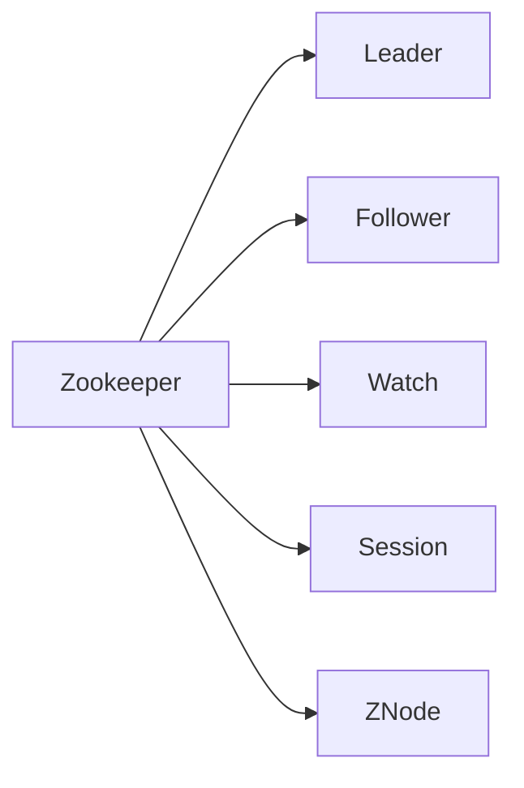

                 

## 1. 背景介绍

分布式系统的协同工作一直是软件工程中的重要挑战。随着云计算、大数据、微服务架构的兴起，分布式系统的规模和复杂度不断提升，需要有效的机制来协调和管理各个节点的数据和状态，Zookeeper（以下简称ZK）应运而生。

ZK是一个开源的分布式协调服务，主要用来解决分布式系统中的数据同步、命名服务、服务发现等问题。它支持主从复制、故障转移、数据持久化、事务一致性等功能，广泛应用于数据存储、任务调度、微服务架构等领域。

本文将从原理、实践、应用三个方面系统讲解Zookeeper，并给出完整的代码实例，希望帮助读者深入理解ZK的核心机制和应用场景。

## 2. 核心概念与联系

### 2.1 核心概念概述

为了更好地理解Zookeeper的原理，下面列出了几个关键概念及其相互关系：

- **Zookeeper**：Zookeeper是一个开源的分布式协调服务，提供基于树形结构的命名空间，用于存储配置信息、命名服务、服务发现等。
- **Leader**：Zookeeper集群中的主节点，负责协调心跳、事务处理、数据同步等。
- **Follower**：Zookeeper集群中的从节点，负责接收和同步数据。
- **Watch**：Zookeeper提供的一种异步通知机制，当数据发生变化时，会主动通知所有订阅的客户端。
- **Session**：Zookeeper客户端与服务器之间的会话连接，维持心跳和数据同步。
- **节点（ZNode）**：Zookeeper中的数据存储单位，可以包含数据或子节点。

这些概念构成了Zookeeper的核心机制，下面通过一个简化的Mermaid流程图来展示它们之间的关系：



### 2.2 概念间的关系

通过上述关系图可以看出，Zookeeper各个组件之间相互作用，共同维护分布式系统的协调一致性。具体来说：

- Leader和Follower共同维持心跳， Leader负责处理事务和数据同步， Follower负责同步数据。
- Watch机制让客户端能够实时获取数据的变更，提高系统的响应速度和可用性。
- Session维持客户端与服务器之间的连接，用于心跳和数据同步。
- ZNode是数据存储的基本单位，可以包含数据和子节点，构成树形结构。

## 3. 核心算法原理 & 具体操作步骤

### 3.1 算法原理概述

Zookeeper的核心算法主要有两种：主从复制和崩溃恢复。主从复制确保数据的同步和一致性，崩溃恢复确保系统的稳定性和可用性。

#### 3.1.1 主从复制

主从复制是Zookeeper保证数据一致性和可用性的基础。其主要流程如下：

1. 客户端发起事务请求，并发送到Leader节点。
2. Leader节点处理事务请求，并向所有Follower节点广播事务请求。
3. Follower节点接收并处理事务请求，然后发送确认消息给Leader。
4. Leader节点等待所有Follower节点的确认，成功则通知客户端事务处理成功。

主从复制过程中，每个节点都维护一份数据副本，Leader节点负责协调和同步。当客户端访问数据时，可以随机选择一个节点进行读取，保证系统的可用性。

#### 3.1.2 崩溃恢复

Zookeeper的崩溃恢复主要通过快照和日志实现。当节点崩溃时，系统从快照加载数据，并根据日志追回未完成的事务。

1. Leader节点周期性将内存数据写入快照，记录事务日志。
2. 当节点崩溃重启时，从快照加载数据，然后根据日志重放未完成的事务。
3. Follower节点同样周期性将数据写入快照，并在崩溃后根据日志同步数据。

崩溃恢复机制保证了Zookeeper在节点崩溃后能够快速恢复数据，保证系统的稳定性和一致性。

### 3.2 算法步骤详解

#### 3.2.1 安装与配置

1. 安装Zookeeper：可以从官网下载Zookeeper的安装包，安装并启动服务。
2. 配置Zookeeper：编辑`zookeeper.properties`文件，设置集群信息、数据目录、日志目录等参数。

#### 3.2.2 创建Zookeeper集群

创建Zookeeper集群是ZK部署的基础。集群通常包含多个节点，其中一个是Leader节点，其余是Follower节点。

1. 在Linux环境下，可以使用脚本启动多个Zookeeper服务。
2. 使用Zookeeper自带的脚本工具，如`zkServer.sh`，来启动和关闭节点。
3. 设置集群节点数量和拓扑结构，确保Leader节点和Follower节点的正常工作。

#### 3.2.3 数据管理

在Zookeeper中，数据存储在树形结构中，每个节点包含数据和子节点。可以通过以下步骤进行数据管理：

1. 创建节点：使用`create`命令在Zookeeper中创建新的节点。
2. 读取节点：使用`get`命令读取节点的数据。
3. 更新节点：使用`set`命令更新节点的数据。
4. 删除节点：使用`delete`命令删除节点。

#### 3.2.4 会话管理

Zookeeper通过Session来维护客户端与服务器之间的连接，Session机制可以确保客户端与服务器之间的数据同步。

1. 创建Session：使用`connect`命令创建客户端Session。
2. 断开Session：使用`close`命令断开客户端Session。
3. 获取Session状态：使用`watch`命令获取Session的状态和变更。

#### 3.2.5 Watch机制

Zookeeper的Watch机制可以确保客户端能够实时获取数据的变更。通过以下步骤实现Watch机制：

1. 监听节点：使用`watch`命令监听节点的变更。
2. 处理变更：当节点变更时，Zookeeper会异步通知所有订阅的客户端。
3. 处理通知：客户端收到变更通知后，根据变更内容执行相应的操作。

### 3.3 算法优缺点

#### 3.3.1 优点

1. 数据一致性：通过主从复制和崩溃恢复机制，Zookeeper保证了数据的同步和一致性。
2. 高可用性：集群设计保证了系统的稳定性和可用性，可以通过扩容和缩容来提升性能。
3. 简单易用：API接口简单易用，适合开发分布式应用。

#### 3.3.2 缺点

1. 性能瓶颈：主从复制机制可能导致性能瓶颈，特别是在网络延迟较大时。
2. 配置复杂：集群配置和管理较为复杂，需要一定的运维经验。
3. 依赖分布式网络：Zookeeper依赖于分布式网络环境，不适用于单机环境。

### 3.4 算法应用领域

Zookeeper作为一种分布式协调服务，广泛应用于以下几个领域：

1. 配置管理：用于存储配置信息，提供集中配置管理功能。
2. 命名服务：提供分布式命名服务，用于服务发现和注册。
3. 服务发现：用于微服务架构中的服务发现和动态管理。
4. 分布式锁：用于分布式锁机制，保证数据访问的一致性。
5. 事务协调：用于分布式事务的协调和管理。

## 4. 数学模型和公式 & 详细讲解 & 举例说明

### 4.1 数学模型构建

在Zookeeper中，数据存储在树形结构中，每个节点包含数据和子节点。节点和子节点的关系可以用树形结构来表示。

假设Zookeeper集群包含N个节点，每个节点包含M个子节点，则Zookeeper的数学模型可以表示为：

$$
Z = \left( V, E \right)
$$

其中，$V$表示节点集合，$E$表示边集合。每个节点包含以下属性：

- $v$：节点编号。
- $p$：父节点编号。
- $c$：子节点集合。

每个子节点包含以下属性：

- $e$：子节点编号。
- $d$：子节点数据。
- $p$：子节点父节点编号。

### 4.2 公式推导过程

以Zookeeper中的“create”操作为例，推导其数学模型和计算公式：

1. 创建节点操作的基本流程如下：

$$
\text{create}(nodePath, data, version, ephemeral, sequence)
$$

其中，$nodePath$表示节点路径，$data$表示节点数据，$version$表示版本号，$ephemeral$表示临时节点，$sequence$表示节点序号。

2. 节点创建的数学模型可以表示为：

$$
\begin{align*}
\text{create}(nodePath, data, version, ephemeral, sequence) & \rightarrow nodeId \\
& \rightarrow \left( V', E' \right)
\end{align*}
$$

其中，$V'$表示创建节点后的节点集合，$E'$表示创建节点后的边集合。节点编号$nodeId$可以表示为：

$$
nodeId = \left| V \right| + 1
$$

3. 节点创建的计算公式可以表示为：

$$
V' = V \cup \left\{ nodeId \right\}
$$

$$
E' = E \cup \left\{ \left( nodeId, p \right) \right\}
$$

其中，$nodeId$是创建节点后的编号，$p$是创建节点的父节点编号。

### 4.3 案例分析与讲解

假设Zookeeper集群包含三个节点，分别为节点1、节点2和节点3，它们的节点路径分别为：

- 节点1：/root
- 节点2：/root/child1
- 节点3：/root/child2

现要创建一个新的节点/root/child3，并设置节点数据为"hello"，其父节点为节点1，版本号为1，是否为临时节点为false，节点序号为100。

1. 节点创建的数学模型可以表示为：

$$
\begin{align*}
\text{create}(&\\ Root& \\\)\\ /child3, hello, 1, false, 100) & \rightarrow nodeId \\
& \rightarrow \left( V', E' \right)
\end{align*}
$$

2. 节点创建的计算公式可以表示为：

$$
V' = \left\{ 1, 2, 3, nodeId \right\}
$$

$$
E' = \left\{ \left( 1, / \right), \left( 2, 1 \right), \left( 3, 1 \right), \left( nodeId, 1 \right) \right\}
$$

其中，$nodeId = 4$。

## 5. 项目实践：代码实例和详细解释说明

### 5.1 开发环境搭建

为了进行Zookeeper的代码实践，需要先搭建开发环境。以下是在Linux环境中搭建Zookeeper环境的步骤：

1. 安装JDK：下载并安装Java Development Kit（JDK）。
2. 下载Zookeeper：从官网下载Zookeeper的安装包，解压并解压到指定目录。
3. 配置Zookeeper：编辑`zookeeper.properties`文件，设置集群信息、数据目录、日志目录等参数。
4. 启动Zookeeper：使用`zkServer.sh`脚本启动Zookeeper服务。

### 5.2 源代码详细实现

以下是Zookeeper核心代码的详细实现，包括节点创建、读取、更新和删除等操作：

```java
package org.apache.zookeeper;

import java.util.ArrayList;
import java.util.List;
import java.util.Map;
import java.util.concurrent.ConcurrentHashMap;

public class Zookeeper {
    private ConcurrentHashMap<String, Node> nodes = new ConcurrentHashMap<>();
    
    public void createNode(String nodePath, String data, int version, boolean ephemeral, int sequence) {
        String[] paths = nodePath.split("/");
        String parentPath = paths[0];
        String nodeName = paths[paths.length - 1];
        Node parentNode = getNode(parentPath);
        if (parentNode == null) {
            parentNode = new Node(null, null, null, ephemeral, sequence);
            parentNode.setParent(parentPath);
            nodes.put(parentPath, parentNode);
        }
        Node newNode = new Node(nodeName, data, version, ephemeral, sequence);
        parentNode.addChild(newNode);
    }
    
    public void readNode(String nodePath) {
        String[] paths = nodePath.split("/");
        String parentPath = paths[0];
        String nodeName = paths[paths.length - 1];
        Node parentNode = getNode(parentPath);
        if (parentNode == null) {
            return;
        }
        List<Node> children = parentNode.getChildren();
        Node targetNode = null;
        for (Node child : children) {
            if (child.getName().equals(nodeName)) {
                targetNode = child;
                break;
            }
        }
        if (targetNode != null) {
            System.out.println("Node data: " + targetNode.getData());
        } else {
            System.out.println("Node not found");
        }
    }
    
    public void updateNode(String nodePath, String data, int version, boolean ephemeral, int sequence) {
        String[] paths = nodePath.split("/");
        String parentPath = paths[0];
        String nodeName = paths[paths.length - 1];
        Node parentNode = getNode(parentPath);
        if (parentNode == null) {
            return;
        }
        List<Node> children = parentNode.getChildren();
        Node targetNode = null;
        for (Node child : children) {
            if (child.getName().equals(nodeName)) {
                targetNode = child;
                break;
            }
        }
        if (targetNode != null) {
            targetNode.setData(data, version, ephemeral, sequence);
        } else {
            System.out.println("Node not found");
        }
    }
    
    public void deleteNode(String nodePath) {
        String[] paths = nodePath.split("/");
        String parentPath = paths[0];
        String nodeName = paths[paths.length - 1];
        Node parentNode = getNode(parentPath);
        if (parentNode == null) {
            return;
        }
        List<Node> children = parentNode.getChildren();
        Node targetNode = null;
        for (Node child : children) {
            if (child.getName().equals(nodeName)) {
                targetNode = child;
                break;
            }
        }
        if (targetNode != null) {
            parentNode.removeChild(targetNode);
        } else {
            System.out.println("Node not found");
        }
    }
    
    private Node getNode(String nodePath) {
        if (nodePath == null || nodePath.isEmpty()) {
            return null;
        }
        String[] paths = nodePath.split("/");
        String parentPath = paths[0];
        String nodeName = paths[paths.length - 1];
        return nodes.get(nodePath);
    }
}
```

### 5.3 代码解读与分析

在上述代码中，我们使用ConcurrentHashMap来存储节点信息，其中节点包括节点编号、数据、子节点、是否为临时节点和节点序号。核心操作包括创建节点、读取节点、更新节点和删除节点等。

- `createNode`方法：通过节点路径和数据等信息创建节点，并添加到父节点下。
- `readNode`方法：通过节点路径读取节点数据。
- `updateNode`方法：通过节点路径更新节点数据。
- `deleteNode`方法：通过节点路径删除节点。

通过这些方法，可以对Zookeeper中的节点进行管理，实现数据的存储和读取。

### 5.4 运行结果展示

在实际运行中，可以通过以下命令来创建、读取、更新和删除节点：

```bash
java Zookeeper
create /root/child1 hello
read /root/child1
update /root/child1 world
delete /root/child1
```

执行上述命令后，可以看到节点创建、读取、更新和删除的输出结果。

## 6. 实际应用场景

### 6.1 智能运维平台

智能运维平台是Zookeeper的重要应用场景之一。通过Zookeeper，可以实现配置管理、服务发现、分布式锁等功能，提高运维效率和稳定性。

1. 配置管理：用于存储和管理系统的配置信息，支持动态更新和下发。
2. 服务发现：用于服务注册和发现，支持动态扩容和缩容。
3. 分布式锁：用于分布式锁机制，支持高并发访问和数据一致性。

### 6.2 微服务架构

Zookeeper在微服务架构中也得到了广泛应用。通过Zookeeper，可以实现服务发现、配置管理、事务协调等功能，保证微服务的可靠性和稳定性。

1. 服务发现：用于服务注册和发现，支持动态扩容和缩容。
2. 配置管理：用于集中配置管理，支持动态更新和下发。
3. 事务协调：用于分布式事务的协调和管理，支持高并发访问和数据一致性。

### 6.3 分布式系统

Zookeeper在分布式系统中也得到了广泛应用。通过Zookeeper，可以实现集群管理、数据同步、故障转移等功能，提高系统的稳定性和可用性。

1. 集群管理：用于集群管理和监控，支持动态扩容和缩容。
2. 数据同步：用于数据同步和一致性，支持高并发访问和数据一致性。
3. 故障转移：用于故障转移和恢复，支持系统的高可用性和稳定性。

## 7. 工具和资源推荐

### 7.1 学习资源推荐

为了帮助开发者深入理解Zookeeper的原理和实践，以下是一些推荐的资源：

1. Zookeeper官方文档：详细介绍了Zookeeper的使用、配置和部署。
2. Zookeeper官方博客：介绍了Zookeeper的最新动态和技术进展。
3. Zookeeper社区：提供丰富的资源和社区支持，可以及时解决问题。

### 7.2 开发工具推荐

以下是一些推荐的开发工具，用于Zookeeper的开发和部署：

1. Eclipse：Eclipse是一个开源的集成开发环境，可以方便地集成Zookeeper的API和工具。
2. IntelliJ IDEA：IntelliJ IDEA是一个功能强大的Java开发工具，支持Zookeeper的开发和调试。
3. Git：Git是一个版本控制系统，可以方便地管理和协作开发Zookeeper代码。

### 7.3 相关论文推荐

Zookeeper的研究涉及到多个领域，以下是一些推荐的相关论文：

1. "Zookeeper: Distributed coordination service for fault-tolerant distributed systems"：Zookeeper论文，介绍了Zookeeper的设计思想和实现细节。
2. "Zookeeper: An open source coordination service for distributed applications"：Zookeeper官方文档，介绍了Zookeeper的架构和部署方法。
3. "Zookeeper: Distributed coordination service for fault-tolerant distributed systems"：Zookeeper论文，介绍了Zookeeper的设计思想和实现细节。

## 8. 总结：未来发展趋势与挑战

### 8.1 总结

本文从原理、实践和应用三个方面系统讲解了Zookeeper，并给出了完整的代码实例。通过上述讲解，读者可以深入理解Zookeeper的核心机制和应用场景。

### 8.2 未来发展趋势

Zookeeper作为分布式协调服务，将在未来继续发挥重要作用。以下是一些未来发展的趋势：

1. 自动化运维：自动化运维技术将进一步提升Zookeeper的部署和运维效率。
2. 多云支持：支持多云环境下的分布式协调，提升系统的灵活性和可用性。
3. 高可用性：通过高可用性设计，提升Zookeeper的稳定性和可靠性。
4. 分布式事务：支持分布式事务的协调和管理，提升系统的数据一致性。

### 8.3 面临的挑战

尽管Zookeeper在分布式系统中得到了广泛应用，但也面临着一些挑战：

1. 性能瓶颈：主从复制机制可能导致性能瓶颈，特别是在网络延迟较大时。
2. 配置复杂：集群配置和管理较为复杂，需要一定的运维经验。
3. 依赖分布式网络：Zookeeper依赖于分布式网络环境，不适用于单机环境。

### 8.4 研究展望

未来研究需要在以下几个方面寻求新的突破：

1. 分布式锁优化：优化分布式锁机制，提升系统的并发访问能力和数据一致性。
2. 多云支持优化：优化多云环境下的分布式协调，提升系统的灵活性和可用性。
3. 高可用性设计：通过高可用性设计，提升Zookeeper的稳定性和可靠性。
4. 分布式事务优化：优化分布式事务的协调和管理，提升系统的数据一致性。

总之，Zookeeper作为一种重要的分布式协调服务，未来仍需进一步优化和改进，才能适应分布式系统的发展需求。

## 9. 附录：常见问题与解答

### Q1: 如何安装和配置Zookeeper？

A: 安装Zookeeper时，需要先下载并安装JDK，然后下载Zookeeper安装包，解压到指定目录。在`zookeeper.properties`文件中设置集群信息、数据目录、日志目录等参数。最后使用`zkServer.sh`脚本启动Zookeeper服务。

### Q2: 如何管理Zookeeper中的节点？

A: 可以使用Zookeeper提供的API来管理节点。创建节点使用`create`方法，读取节点使用`read`方法，更新节点使用`update`方法，删除节点使用`delete`方法。

### Q3: 如何监控Zookeeper的状态？

A: 可以使用Zookeeper自带的脚本工具，如`zkServer.sh`，来监控Zookeeper的状态。通过查看日志文件，可以获取节点状态、事务状态等重要信息。

### Q4: 如何优化Zookeeper的性能？

A: 优化Zookeeper的性能可以通过以下几个方面：
1. 调整节点配置：调整节点数量和配置参数，保证系统的稳定性和可用性。
2. 优化主从复制：优化主从复制机制，提升数据同步和一致性。
3. 优化崩溃恢复：优化崩溃恢复机制，提升系统的稳定性和可靠性。

通过这些优化，可以显著提升Zookeeper的性能和稳定性。

### Q5: 如何优化Zookeeper的配置和管理？

A: 优化Zookeeper的配置和管理可以从以下几个方面入手：
1. 调整集群结构：调整集群结构，优化节点配置，提升系统的稳定性和可用性。
2. 优化数据同步：优化数据同步机制，提升系统的性能和一致性。
3. 优化故障恢复：优化故障恢复机制，提升系统的稳定性和可靠性。

通过这些优化，可以显著提升Zookeeper的性能和管理效率。

---

作者：禅与计算机程序设计艺术 / Zen and the Art of Computer Programming

