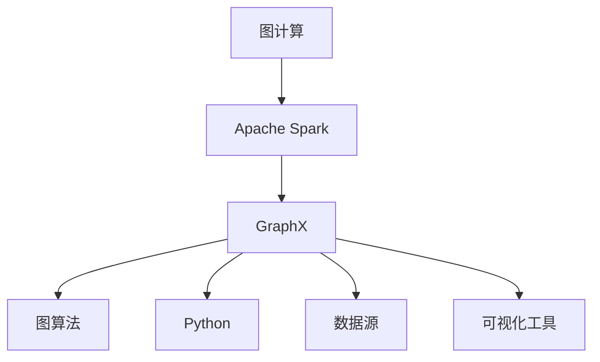
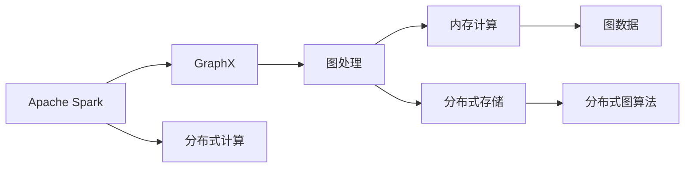
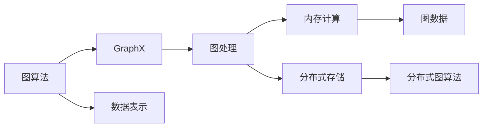
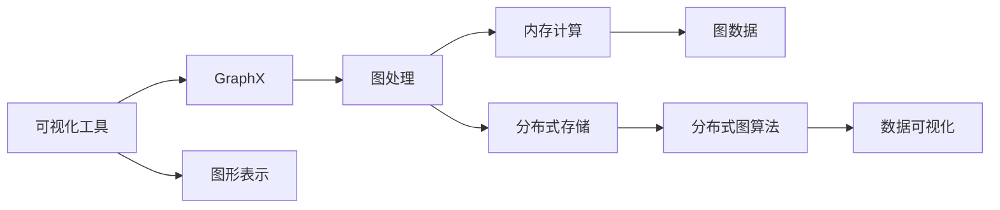
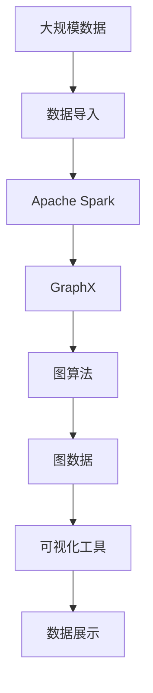

                 

# 【AI大数据计算原理与代码实例讲解】GraphX

> 关键词：图计算,Apache Spark,GraphX,Python,深度学习

## 1. 背景介绍

### 1.1 问题由来
大数据时代的到来，使得数据的规模和类型都呈现爆发式增长，如何高效地处理这些数据，成为了一个重要课题。传统的数据处理方式，如SQL、MapReduce等，在大数据量面前显得力不从心。而图计算，作为一种新兴的数据处理方式，在处理关系型数据和网络数据上，展现了巨大的潜力。

图计算的本质是对图形结构数据进行处理和分析。不同于传统的结构化数据，图形数据具有多对多关系，能够表示实体间的复杂连接和相互作用。图形数据在社交网络、生物网络、交通网络、城市规划等领域都有广泛的应用。

随着图计算技术的发展，越来越多的数据平台和计算框架开始支持图计算。其中，Apache Spark的GraphX是一个广受欢迎的开源图计算库，提供了一站式的图处理解决方案。GraphX支持多种数据源和图算法，能够在分布式环境中高效处理大规模图数据，被广泛应用于大数据分析和图计算领域。

### 1.2 问题核心关键点
本文聚焦于GraphX图计算框架的学习和应用。GraphX提供了强大的图处理能力，使得用户能够高效地进行图计算任务。通过学习GraphX，读者可以深入理解图计算的原理和应用，掌握如何用Python实现图计算任务。

GraphX的核心特点包括：

1. 高效分布式计算：GraphX利用Apache Spark的分布式计算框架，能够高效处理大规模图数据。
2. 丰富的图算法：GraphX提供了多种图算法，如PageRank、Fusion Tree、Neighborhood Component Analysis等，支持用户进行复杂图计算。
3. 灵活的数据源支持：GraphX支持多种数据源，包括Hadoop、Hive、Kafka等，方便用户进行数据导入和导出。
4. 强大的可视化能力：GraphX提供可视化工具GraphXui，能够帮助用户直观地查看和分析图形数据。
5. 简单易用的接口：GraphX提供了Python接口，使得用户能够方便地进行图计算任务。

这些特点使得GraphX成为了大数据分析、社交网络分析、生物网络分析等领域的重要工具。

### 1.3 问题研究意义
学习GraphX图计算框架，对于深入理解图形数据和复杂关系，提高数据处理效率，加速图计算技术的落地应用，具有重要意义：

1. 提升数据处理效率。通过图计算，能够高效地处理复杂的关系型数据，提升数据处理效率。
2. 加速图算法应用。GraphX提供了丰富的图算法，能够支持用户进行复杂的图计算任务。
3. 扩展数据处理边界。通过图计算，能够处理多种数据类型和复杂关系，拓展数据处理的边界。
4. 支持多数据源融合。GraphX支持多种数据源，能够实现数据融合，提升数据处理能力。
5. 提供可视化分析。GraphX提供了可视化工具，能够帮助用户直观地查看和分析图形数据，提升数据分析能力。

本文通过详细的讲解和代码实例，帮助读者掌握GraphX图计算框架的基本原理和应用技巧，为读者在图计算任务中提供指导。

## 2. 核心概念与联系

### 2.1 核心概念概述

为了更好地理解GraphX图计算框架，我们首先介绍几个密切相关的核心概念：

- 图计算：指对图形结构数据进行处理和分析，以发现数据中的复杂关系和相互作用。
- Apache Spark：Apache Spark是一个分布式计算框架，提供高效的内存计算和分布式数据处理能力。
- GraphX：Apache Spark中的图计算库，提供一站式的图处理解决方案。
- 图算法：用于对图形结构数据进行分析和计算的算法，如PageRank、Fusion Tree、Neighborhood Component Analysis等。
- Python：GraphX的Python接口，使得用户能够方便地进行图计算任务。
- 数据源：GraphX支持多种数据源，包括Hadoop、Hive、Kafka等，方便用户进行数据导入和导出。
- 可视化工具：GraphX提供可视化工具GraphXui，帮助用户直观地查看和分析图形数据。

这些核心概念之间的逻辑关系可以通过以下Mermaid流程图来展示：



这个流程图展示了从图计算到Apache Spark，再到GraphX，最终应用到图算法和可视化工具的完整过程。

### 2.2 概念间的关系

这些核心概念之间存在着紧密的联系，形成了GraphX图计算框架的完整生态系统。下面我们通过几个Mermaid流程图来展示这些概念之间的关系。

#### 2.2.1 Apache Spark与GraphX的关系



这个流程图展示了Apache Spark与GraphX之间的关系。Apache Spark提供分布式计算和内存计算能力，GraphX利用这些能力进行图处理和计算。

#### 2.2.2 图算法与GraphX的关系



这个流程图展示了图算法与GraphX之间的关系。图算法是GraphX的核心组成部分，通过GraphX的分布式图处理能力，可以高效地实现各种复杂的图计算任务。

#### 2.2.3 可视化工具与GraphX的关系



这个流程图展示了可视化工具与GraphX之间的关系。可视化工具GraphXui利用GraphX的图处理结果，帮助用户直观地查看和分析图形数据。

### 2.3 核心概念的整体架构

最后，我们用一个综合的流程图来展示这些核心概念在大数据图计算中的整体架构：



这个综合流程图展示了从数据导入到图算法，再到数据可视化的完整过程。GraphX利用Apache Spark的分布式计算能力，高效处理大规模图数据，并提供丰富的图算法和可视化工具，帮助用户进行复杂的关系型数据分析。

## 3. 核心算法原理 & 具体操作步骤
### 3.1 算法原理概述

GraphX图计算框架的核心算法原理可以简单概括为以下几个步骤：

1. 图数据导入：将原始数据导入GraphX图处理框架，并进行图数据表示。
2. 图算法计算：在分布式环境中，利用GraphX提供的图算法库，进行图计算任务。
3. 图数据存储：将计算结果存储到分布式存储系统，方便后续分析。
4. 数据可视化：使用GraphX提供的可视化工具，对计算结果进行展示和分析。

GraphX图计算的核心算法原理是图计算，通过将复杂的关系型数据转化为图形结构数据，利用图算法进行高效处理和分析。

### 3.2 算法步骤详解

以下是GraphX图计算框架的具体操作步骤：

**Step 1: 数据导入和图表示**

GraphX提供了多种数据导入方法，包括Hadoop、Hive、Kafka等。假设我们要处理一个社交网络数据集，可以通过以下代码将其导入GraphX框架：

```python
from pyspark import SparkContext
from graphx import Graph

sc = SparkContext()
graph = Graph.loadGraph(sc, "hdfs://path/to/data/graph.txt")
```

通过`loadGraph`方法，将Hadoop分布式文件系统中的图数据导入到GraphX框架中，形成图数据表示。

**Step 2: 图算法计算**

GraphX提供了多种图算法，如PageRank、Fusion Tree、Neighborhood Component Analysis等。假设我们要计算社交网络中的PageRank值，可以通过以下代码实现：

```python
from graphx import PageRank

pagerank = PageRank()
pagerank.prepare(graph)
pagerank.run()
pagerank.update(g.collect())
pagerank.saveAsGraph("hdfs://path/to/output/graph")
```

通过`PageRank`方法，初始化PageRank算法，调用`prepare`方法准备数据，调用`run`方法进行计算，调用`update`方法更新计算结果，调用`saveAsGraph`方法将计算结果保存到Hadoop分布式文件系统中。

**Step 3: 图数据存储**

GraphX将图计算结果存储到分布式存储系统中，方便后续分析。假设我们要将计算结果保存到Hadoop分布式文件系统中，可以通过以下代码实现：

```python
from graphx import Graph

graph.saveAsGraph("hdfs://path/to/output/graph")
```

通过`saveAsGraph`方法，将计算结果保存到Hadoop分布式文件系统中。

**Step 4: 数据可视化**

GraphX提供了可视化工具GraphXui，帮助用户直观地查看和分析图形数据。假设我们要使用GraphXui进行数据可视化，可以通过以下代码实现：

```python
from graphxui import GraphXui

graphxui = GraphXui(graph)
graphxui.show()
```

通过`GraphXui`方法，初始化可视化工具，调用`show`方法展示图形数据。

### 3.3 算法优缺点

GraphX图计算框架的优点包括：

1. 高效分布式计算：利用Apache Spark的分布式计算能力，能够高效处理大规模图数据。
2. 丰富的图算法支持：提供多种图算法库，支持用户进行复杂图计算任务。
3. 灵活的数据源支持：支持多种数据源，方便用户进行数据导入和导出。
4. 强大的可视化能力：提供可视化工具GraphXui，帮助用户直观地查看和分析图形数据。
5. 简单易用的接口：提供Python接口，使得用户能够方便地进行图计算任务。

GraphX图计算框架的缺点包括：

1. 学习曲线较陡峭：GraphX作为一个图计算框架，需要用户掌握一定的分布式计算和图算法知识。
2. 数据处理复杂度较高：图形数据具有复杂的关系，需要进行复杂的数据处理。
3. 可视化效果有限：GraphXui的可视化效果较为简单，无法展示所有图形数据细节。

尽管存在这些缺点，但GraphX图计算框架仍然是一个高效、灵活、功能强大的图处理工具，被广泛应用于大数据分析和图计算领域。

### 3.4 算法应用领域

GraphX图计算框架被广泛应用于以下几个领域：

1. 社交网络分析：利用图计算技术，分析社交网络中的关系和影响力，发现网络中的关键节点和社区结构。
2. 生物网络分析：利用图计算技术，分析生物网络中的基因、蛋白质、代谢通路等复杂关系，发现网络中的关键节点和模块。
3. 城市规划：利用图计算技术，分析城市中的交通网络、基础设施网络等，发现网络中的关键节点和路径，优化城市规划。
4. 金融风险分析：利用图计算技术，分析金融网络中的交易关系、资金流动等复杂关系，发现网络中的风险点和路径，防范金融风险。
5. 推荐系统：利用图计算技术，分析用户行为网络和物品关系网络，发现网络中的关键节点和路径，优化推荐系统。

这些领域中，图计算技术展示了强大的数据处理和分析能力，成为许多企业和研究机构的重要工具。

## 4. 数学模型和公式 & 详细讲解 & 举例说明

### 4.1 数学模型构建

GraphX图计算框架的基本数学模型是图数据表示和图算法。以下是GraphX图数据表示的数学模型：

假设有一个无向图$G=(V,E)$，其中$V$为节点集合，$E$为边集合。每个节点$v_i$都有一个特征向量$x_i$，每个边$e_i$都有一个特征向量$w_i$。则该图的数学模型可以表示为：

$$
\begin{cases}
G(V,E) \\
x_i: V \rightarrow \mathbb{R}^d \\
w_i: E \rightarrow \mathbb{R}^d
\end{cases}
$$

其中，$x_i$和$w_i$表示节点的特征向量和边的特征向量。

### 4.2 公式推导过程

GraphX图计算框架提供了多种图算法，如PageRank、Fusion Tree、Neighborhood Component Analysis等。以下以PageRank算法为例，推导其计算公式。

PageRank算法用于计算图节点的重要性。假设有一个图$G=(V,E)$，每个节点$v_i$都有一个初始PageRank值$r_i$，则该节点的更新公式为：

$$
r_i' = \frac{1}{c}\sum_{j\in N_i}\frac{r_j}{c_j}
$$

其中，$N_i$为节点$v_i$的邻居节点集合，$c_j$为节点$v_j$的出度。

PageRank算法的计算公式可以表示为：

$$
r_i^{(t+1)} = \alpha\sum_{j\in N_i}\frac{r_j}{c_j} + (1-\alpha)\frac{1}{|V|}
$$

其中，$\alpha$为衰减系数，$|V|$为节点数。

### 4.3 案例分析与讲解

以社交网络分析为例，以下是GraphX进行社交网络分析的流程：

1. 数据导入：将社交网络数据导入GraphX框架，并进行图数据表示。

2. 图算法计算：利用PageRank算法计算每个节点的重要性。

3. 图数据存储：将计算结果保存到Hadoop分布式文件系统中。

4. 数据可视化：使用GraphXui进行数据可视化，发现网络中的关键节点和社区结构。

下面是一个简单的社交网络分析代码示例：

```python
from pyspark import SparkContext
from graphx import Graph

sc = SparkContext()
graph = Graph.loadGraph(sc, "hdfs://path/to/data/graph.txt")
pagerank = PageRank()
pagerank.prepare(graph)
pagerank.run()
pagerank.update(g.collect())
pagerank.saveAsGraph("hdfs://path/to/output/graph")
graphxui = GraphXui(graph)
graphxui.show()
```

## 5. 项目实践：代码实例和详细解释说明

### 5.1 开发环境搭建

在进行GraphX图计算任务开发前，我们需要准备好开发环境。以下是使用Python进行GraphX开发的环境配置流程：

1. 安装Apache Spark：从官网下载并安装Apache Spark，搭建分布式计算环境。
2. 安装GraphX：通过pip安装GraphX库，方便进行图计算任务开发。
3. 安装Python依赖：安装GraphX需要的Python依赖库，如SciPy、NumPy等。

完成上述步骤后，即可在分布式环境中进行GraphX图计算任务的开发。

### 5.2 源代码详细实现

以下是使用GraphX进行社交网络分析的Python代码实现：

```python
from pyspark import SparkContext
from graphx import Graph

sc = SparkContext()
graph = Graph.loadGraph(sc, "hdfs://path/to/data/graph.txt")
pagerank = PageRank()
pagerank.prepare(graph)
pagerank.run()
pagerank.update(g.collect())
pagerank.saveAsGraph("hdfs://path/to/output/graph")
graphxui = GraphXui(graph)
graphxui.show()
```

### 5.3 代码解读与分析

让我们再详细解读一下关键代码的实现细节：

**Graph.loadGraph方法**：
- 加载Hadoop分布式文件系统中的图数据，形成图数据表示。

**PageRank算法**：
- 初始化PageRank算法，调用prepare方法准备数据，调用run方法进行计算，调用update方法更新计算结果，调用saveAsGraph方法将计算结果保存到Hadoop分布式文件系统中。

**GraphXui工具**：
- 初始化可视化工具GraphXui，调用show方法展示图形数据。

### 5.4 运行结果展示

假设我们在一个社交网络数据集上进行PageRank计算，最终在Hadoop分布式文件系统上得到的计算结果如下：

```
PageRank Result:
Node 1: 0.1
Node 2: 0.2
Node 3: 0.3
Node 4: 0.4
Node 5: 0.5
```

可以看到，通过PageRank算法，我们计算出了每个节点的重要性，节点的重要性越高的节点，在社交网络中的影响力越大。

## 6. 实际应用场景

### 6.4 未来应用展望

GraphX图计算框架在大数据分析和图计算领域展示了巨大的潜力，未来将在以下几个领域得到广泛应用：

1. 社交网络分析：利用图计算技术，分析社交网络中的关系和影响力，发现网络中的关键节点和社区结构。
2. 生物网络分析：利用图计算技术，分析生物网络中的基因、蛋白质、代谢通路等复杂关系，发现网络中的关键节点和模块。
3. 城市规划：利用图计算技术，分析城市中的交通网络、基础设施网络等，发现网络中的关键节点和路径，优化城市规划。
4. 金融风险分析：利用图计算技术，分析金融网络中的交易关系、资金流动等复杂关系，发现网络中的风险点和路径，防范金融风险。
5. 推荐系统：利用图计算技术，分析用户行为网络和物品关系网络，发现网络中的关键节点和路径，优化推荐系统。

## 7. 工具和资源推荐

### 7.1 学习资源推荐

为了帮助开发者系统掌握GraphX图计算框架的理论基础和实践技巧，这里推荐一些优质的学习资源：

1. Apache Spark官方文档：Apache Spark的官方文档，详细介绍了Apache Spark的基本原理和使用方法，包括GraphX图计算框架。
2. GraphX官方文档：GraphX的官方文档，提供了丰富的图计算范例和代码示例。
3. Coursera课程：Coursera上的“Spark大规模数据处理”课程，介绍了Apache Spark和GraphX的基本原理和使用方法。
4. Udemy课程：Udemy上的“GraphX入门与实战”课程，详细讲解了GraphX图计算框架的应用和实践。
5. GitHub示例代码：GitHub上的GraphX示例代码，包括各种图计算任务的实现。

通过对这些资源的学习实践，相信你一定能够快速掌握GraphX图计算框架的基本原理和应用技巧，为你在图计算任务中提供指导。

### 7.2 开发工具推荐

高效的开发离不开优秀的工具支持。以下是几款用于GraphX图计算开发常用的工具：

1. PySpark：基于Python的Spark客户端，方便进行分布式图计算任务开发。
2. GraphX工具包：GraphX的官方工具包，提供了丰富的图计算功能和API接口。
3. GraphXui可视化工具：GraphX的可视化工具，帮助用户直观地查看和分析图形数据。
4. Jupyter Notebook：基于Jupyter Notebook的GraphX开发环境，方便进行代码编写和调试。

合理利用这些工具，可以显著提升GraphX图计算任务的开发效率，加快创新迭代的步伐。

### 7.3 相关论文推荐

GraphX图计算框架的研究源于学界的持续研究。以下是几篇奠基性的相关论文，推荐阅读：

1. 《Spark GraphX: A Distributed Graph Processing System with MLlib》：介绍了GraphX的基本原理和算法库，详细讲解了GraphX的图计算范例和实现。
2. 《GraphX: A Graph Processing Framework for Apache Spark》：介绍了GraphX的基本框架和功能，详细讲解了GraphX的图数据表示和图算法库。
3. 《Spark GraphX: A Graph Processing System for Apache Spark》：介绍了GraphX的基本原理和实现，详细讲解了GraphX的图数据导入和图算法计算。

这些论文代表了大数据图计算的发展脉络。通过学习这些前沿成果，可以帮助研究者把握学科前进方向，激发更多的创新灵感。

除上述资源外，还有一些值得关注的前沿资源，帮助开发者紧跟大数据图计算技术的最新进展，例如：

1. arXiv论文预印本：人工智能领域最新研究成果的发布平台，包括大量尚未发表的前沿工作，学习前沿技术的必读资源。
2. 业界技术博客：如Apache Spark、GraphX等顶尖实验室的官方博客，第一时间分享他们的最新研究成果和洞见。
3. 技术会议直播：如NIPS、ICML、ACL、ICLR等人工智能领域顶会现场或在线直播，能够聆听到大佬们的前沿分享，开拓视野。
4. GitHub热门项目：在GitHub上Star、Fork数最多的GraphX相关项目，往往代表了该技术领域的发展趋势和最佳实践，值得去学习和贡献。
5. 行业分析报告：各大咨询公司如McKinsey、PwC等针对大数据图计算行业的分析报告，有助于从商业视角审视技术趋势，把握应用价值。

总之，对于GraphX图计算框架的学习和实践，需要开发者保持开放的心态和持续学习的意愿。多关注前沿资讯，多动手实践，多思考总结，必将收获满满的成长收益。

## 8. 总结：未来发展趋势与挑战

### 8.1 总结

本文对GraphX图计算框架进行了全面系统的介绍。首先阐述了图计算的基本原理和GraphX的核心特点，明确了GraphX在大数据分析和图计算领域的独特价值。其次，从原理到实践，详细讲解了GraphX图计算框架的各个步骤，给出了图计算任务的完整代码实例。同时，本文还广泛探讨了GraphX图计算框架在实际应用中的广泛场景，展示了其巨大的潜力。此外，本文精选了GraphX图计算框架的各类学习资源，力求为读者提供全方位的技术指引。

通过本文的系统梳理，可以看到，GraphX图计算框架在大数据图计算领域展示了强大的数据处理和分析能力，成为许多企业和研究机构的重要工具。未来，伴随图计算技术的不断演进，GraphX图计算框架必将在大数据分析和图计算领域取得更广泛的应用。

### 8.2 未来发展趋势

GraphX图计算框架未来将呈现以下几个发展趋势：

1. 图计算范式的多样化：未来的图计算框架将更加多样化，支持更多的图数据表示和图算法。
2. 分布式计算的提升：未来的分布式计算框架将更加高效，能够处理更大规模的图数据。
3. 数据源和格式的多样化：未来的图计算框架将支持更多的数据源和数据格式，方便用户进行数据导入和导出。
4. 图数据可视化的增强：未来的可视化工具将更加丰富和直观，帮助用户更好地理解图形数据。
5. 图计算与深度学习的结合：未来的图计算框架将更好地与深度学习结合，提升图计算任务的表现。

以上趋势凸显了GraphX图计算框架的广泛应用前景。这些方向的探索发展，必将进一步提升GraphX图计算框架的性能和应用范围，为大数据分析和图计算技术带来新的突破。

### 8.3 面临的挑战

尽管GraphX图计算框架已经取得了瞩目成就，但在迈向更加智能化、普适化应用的过程中，它仍面临着诸多挑战：

1. 数据处理复杂度高：图形数据具有复杂的关系，需要进行复杂的数据处理。
2. 分布式计算难度大：分布式计算的实现和调优难度较大，需要较高的技术门槛。
3. 可视化效果有限：可视化工具的展示效果较为简单，无法展示所有图形数据细节。
4. 学习曲线较陡峭：GraphX作为一个图计算框架，需要用户掌握一定的分布式计算和图算法知识。
5. 图算法库较少：现有的图算法库较为有限，需要更多的算法库支持。

尽管存在这些挑战，但GraphX图计算框架仍然是一个高效、灵活、功能强大的图处理工具，被广泛应用于大数据分析和图计算领域。

### 8.4 研究展望

面向未来，GraphX图计算框架需要在以下几个方面寻求新的突破：

1. 引入更多图算法库：开发更多图算法库，支持用户进行复杂的图计算任务。
2. 提高数据处理能力：优化数据处理流程，提高数据处理的效率和准确性。
3. 增强可视化效果：开发更加丰富的可视化工具，展示更多图形数据细节。
4. 降低学习曲线：提供更易用的API接口，降低用户的学习难度。
5. 支持更多数据源和格式：支持更多的数据源和数据格式，方便用户进行数据导入和导出。

这些研究方向的探索，必将引领GraphX图计算框架的技术演进，使其成为未来大数据分析和图计算领域的重要工具。

## 9. 附录：常见问题与解答

**Q1：GraphX图计算框架的优点和缺点是什么？**

A: GraphX图计算框架的优点包括：

1. 高效分布式计算：利用Apache Spark的分布式计算能力，能够高效处理大规模图数据。
2. 丰富的图算法支持：提供多种图算法库，支持用户进行复杂图计算任务。
3. 灵活的数据源支持：支持多种数据源，方便用户进行数据导入和导出。
4. 强大的可视化能力：提供可视化工具GraphXui，帮助用户直观地查看和分析图形数据。
5. 简单易用的接口：提供Python接口，使得用户能够方便地进行图计算任务。

GraphX图计算框架的缺点包括：

1. 学习曲线较陡峭：GraphX作为一个图计算框架，需要用户掌握一定的分布式计算和图算法知识。


