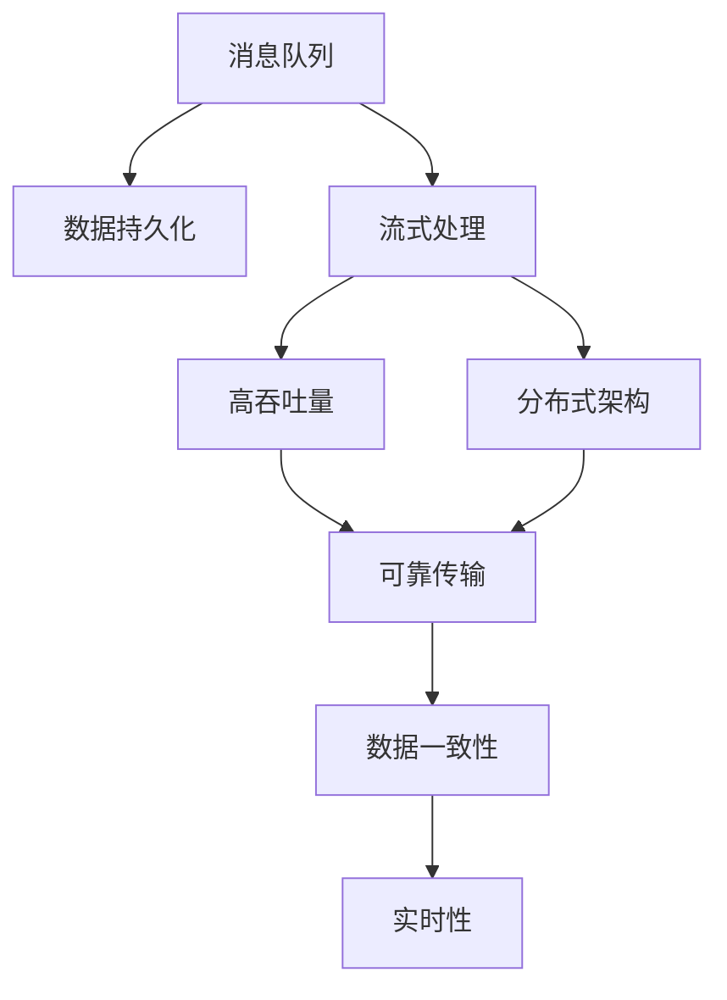
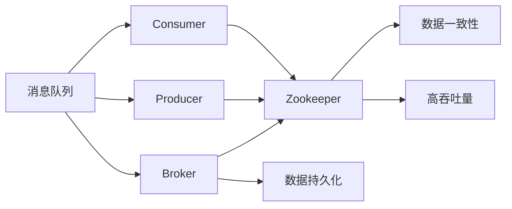
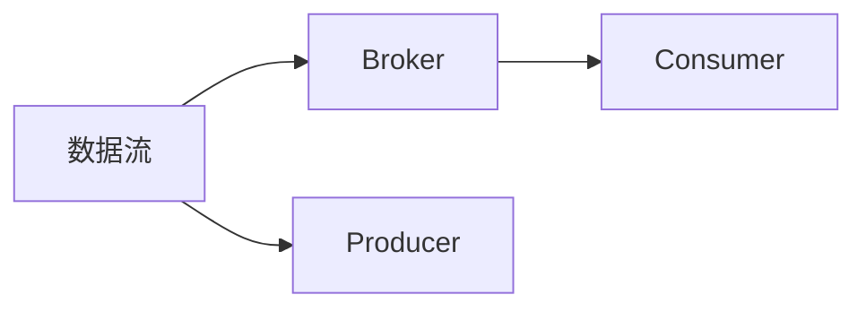
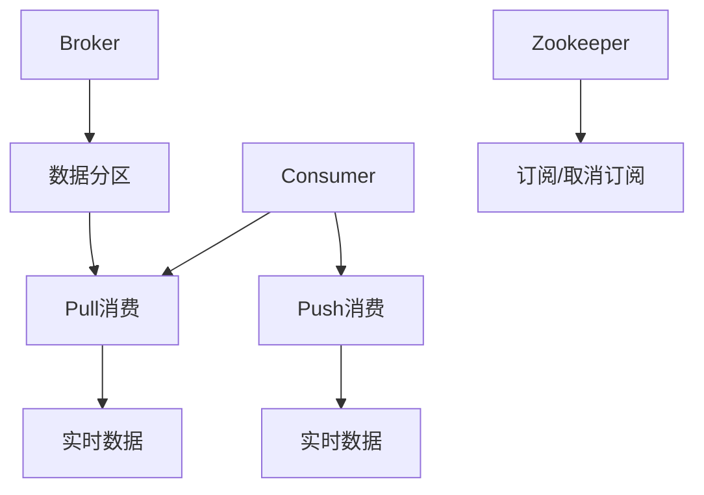
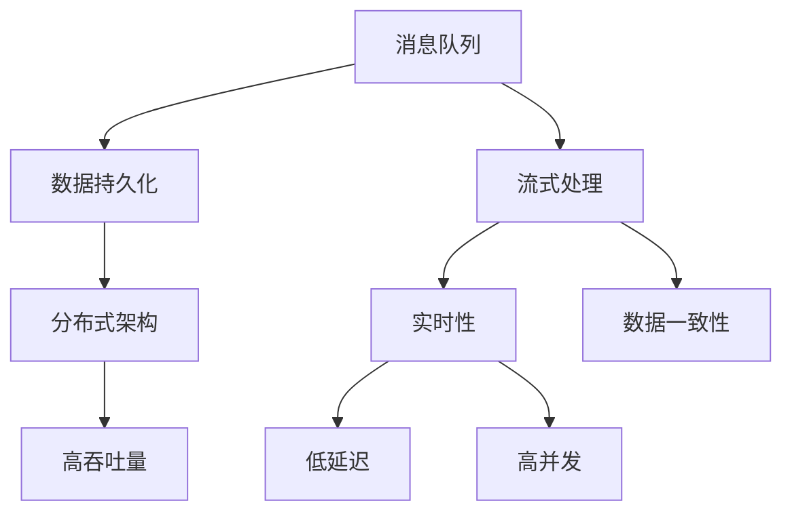

                 

# 【AI大数据计算原理与代码实例讲解】Kafka

> 关键词：Kafka, 大数据计算, 分布式消息系统, 流处理, 实时数据处理

## 1. 背景介绍

### 1.1 问题由来
随着互联网和物联网设备的迅猛发展，数据量呈爆炸式增长。企业需要处理和分析的海量数据越来越多，这对传统的数据处理架构提出了严峻的挑战。传统的数据仓库和批处理系统难以满足实时性和低延迟的需求，无法有效支撑业务实时决策和智能分析。

为了应对这一问题，人们提出了“大数据计算”（Big Data Computing）的概念，通过分布式计算技术和实时数据流处理，实现数据的实时存储、处理和分析。Kafka作为一种高效的消息队列系统，在大数据计算中扮演了重要角色。

### 1.2 问题核心关键点
Kafka是一个分布式流处理平台，由Apache软件基金会开发维护。它基于分布式架构，可以高效地处理高吞吐量的实时数据流。Kafka具有以下几个核心特点：

- **分布式架构**：Kafka由多个节点组成，每个节点都负责存储和处理部分数据，系统通过分布式架构实现高可扩展性和高可用性。
- **流式处理**：Kafka采用流式处理方式，可以高效地处理实时数据流，支持毫秒级别的低延迟。
- **高吞吐量**：Kafka可以处理每秒数百万条消息，具有极高的吞吐量，适用于大数据量和高并发场景。
- **数据持久化**：Kafka支持消息的持久化和重放，可以实现数据的可靠性和一致性保障。

Kafka已经在金融、电商、社交、媒体等多个领域得到了广泛应用，成为实时数据处理的重要工具。

### 1.3 问题研究意义
研究Kafka系统及其在大数据计算中的应用，对于提升数据处理效率、降低延迟、优化系统架构等方面具有重要意义：

1. **提升数据处理效率**：Kafka的高吞吐量和分布式架构可以大幅提升数据处理效率，满足业务实时需求。
2. **降低数据延迟**：Kafka的流式处理方式可以实现数据的实时存储和处理，降低数据延迟，提升决策响应速度。
3. **优化系统架构**：Kafka的分布式架构可以提供高可扩展性和高可用性，帮助企业构建弹性、可靠的数据处理系统。
4. **支持智能分析**：Kafka可以处理实时数据流，支持复杂的数据分析和机器学习模型训练，为业务智能决策提供数据支撑。

## 2. 核心概念与联系

### 2.1 核心概念概述

为更好地理解Kafka系统及其在大数据计算中的应用，本节将介绍几个密切相关的核心概念：

- **Kafka分布式架构**：Kafka采用分布式架构，由Broker、Producer、Consumer、Zookeeper等多个组件组成，每个组件都有明确的角色和功能。
- **消息队列**：Kafka基于消息队列技术，通过消息队列实现数据的可靠传输和持久化。
- **流式处理**：Kafka采用流式处理方式，支持实时数据流的存储、处理和分析。
- **高吞吐量**：Kafka可以处理高吞吐量的数据流，适用于大数据量和高并发场景。
- **数据持久化**：Kafka支持消息的持久化和重放，确保数据的可靠性和一致性。

这些核心概念之间的逻辑关系可以通过以下Mermaid流程图来展示：



这个流程图展示了Kafka系统的主要功能和特点：

1. 消息队列是Kafka的基础组件，实现数据的可靠传输和持久化。
2. 流式处理是基于消息队列实现的核心功能，支持实时数据流的存储和处理。
3. 高吞吐量是Kafka的重要特点，支持处理大数据量和高并发场景。
4. 分布式架构是Kafka的核心设计理念，通过多个节点实现高可扩展性和高可用性。
5. 数据一致性是Kafka的重要目标，通过消息的持久化和重放实现。

这些核心概念共同构成了Kafka系统的基本架构和功能，使得Kafka能够在大数据计算中发挥重要作用。

### 2.2 概念间的关系

这些核心概念之间存在着紧密的联系，形成了Kafka系统的完整生态系统。下面我们通过几个Mermaid流程图来展示这些概念之间的关系。

#### 2.2.1 Kafka系统架构



这个流程图展示了Kafka系统的架构，包括Broker、Producer、Consumer和Zookeeper等多个组件及其相互关系。

#### 2.2.2 Kafka数据流



这个流程图展示了Kafka数据流的基本流程，即数据通过Producer发送到Broker，Broker再将数据分发给Consumer。

#### 2.2.3 Kafka消费模式



这个流程图展示了Kafka消费的两种模式：Pull消费和Push消费。Pull消费是Consumer主动从Broker获取数据，而Push消费则是Broker主动推送数据给Consumer。

### 2.3 核心概念的整体架构

最后，我们用一个综合的流程图来展示Kafka系统的核心概念及其在整个大数据计算中的作用：



这个综合流程图展示了Kafka系统在大数据计算中的应用。Kafka通过分布式架构和流式处理，实现了高吞吐量和低延迟的数据处理，同时通过数据持久化和一致性保障，确保数据的可靠性和可用性。

## 3. 核心算法原理 & 具体操作步骤
### 3.1 算法原理概述

Kafka系统基于分布式架构和消息队列技术，实现实时数据流的存储和处理。其核心算法原理包括以下几个方面：

- **分布式架构**：Kafka采用分布式架构，由多个节点组成，每个节点负责存储和处理部分数据，系统通过分布式架构实现高可扩展性和高可用性。
- **消息队列**：Kafka基于消息队列技术，通过消息队列实现数据的可靠传输和持久化。
- **流式处理**：Kafka采用流式处理方式，可以高效地处理实时数据流，支持毫秒级别的低延迟。
- **高吞吐量**：Kafka可以处理每秒数百万条消息，具有极高的吞吐量，适用于大数据量和高并发场景。
- **数据持久化**：Kafka支持消息的持久化和重放，可以实现数据的可靠性和一致性保障。

### 3.2 算法步骤详解

Kafka系统的算法步骤包括以下几个关键步骤：

1. **数据生产与发送**：Producer负责将数据发送到Kafka集群，数据以消息形式发送到Kafka的多个分区（Partition）中。
2. **数据存储与管理**：Kafka的Broker负责存储和管理数据，将消息存储到本地文件系统中，并提供数据一致性和持久化保障。
3. **数据消费与处理**：Consumer从Kafka集群中读取数据，进行实时数据处理和分析，支持Push和Pull两种消费模式。
4. **集群管理与监控**：Kafka的Zookeeper负责集群管理与监控，维护集群状态，提供高可用性和可靠性保障。

### 3.3 算法优缺点

Kafka系统的优点包括：

- **高吞吐量**：Kafka可以处理高吞吐量的数据流，适用于大数据量和高并发场景。
- **低延迟**：Kafka采用流式处理方式，可以实现数据的实时存储和处理，降低数据延迟，提升决策响应速度。
- **高可扩展性**：Kafka采用分布式架构，通过添加节点实现高可扩展性和高可用性。
- **数据持久化**：Kafka支持消息的持久化和重放，确保数据的可靠性和一致性。

Kafka系统也存在一些缺点：

- **复杂性高**：Kafka系统较为复杂，需要一定的配置和管理经验。
- **资源消耗高**：Kafka系统需要较多的资源，包括CPU、内存、磁盘等，对于资源有限的企业可能存在挑战。
- **延迟敏感**：Kafka的实时处理能力虽然强，但受限于网络延迟和数据量大小，在某些高延迟或大数据量的场景下可能难以保证性能。
- **数据一致性问题**：Kafka通过数据复制和分布式一致性协议（如Zookeeper）实现数据一致性，但在高并发和大数据量的场景下，数据一致性难以完全保障。

### 3.4 算法应用领域

Kafka系统在大数据计算中的应用广泛，主要包括以下几个领域：

- **实时数据处理**：Kafka可以高效处理实时数据流，适用于金融交易、电商点击流、物联网设备数据等高吞吐量、低延迟的场景。
- **数据存储与持久化**：Kafka支持数据持久化和重放，适用于数据备份、日志存储、审计记录等需要可靠性和一致性的场景。
- **流式计算**：Kafka结合流式计算框架（如Spark Streaming、Apache Flink），可以实现复杂的数据分析和机器学习模型训练。
- **消息队列**：Kafka基于消息队列技术，适用于事件驱动的业务系统，如新闻推送、推荐系统、物联网设备通信等。

Kafka系统以其高效、可靠和灵活的特点，成为大数据计算领域的重要技术之一。

## 4. 数学模型和公式 & 详细讲解 & 举例说明

### 4.1 数学模型构建

Kafka系统的数学模型主要涉及消息队列、数据持久化、流式处理和高吞吐量等方面。以下是对这些核心组件的数学模型构建。

- **消息队列模型**：设消息队列的消息数量为 $N$，消息大小为 $s$，消息到达速率 $R$，消息处理速率 $S$。则队列中的消息数量 $Q$ 可以表示为：
  $$
  Q = N + R \times T - S \times T
  $$
  其中 $T$ 为时间间隔。当 $R>S$ 时，队列中的消息数量逐渐增加，当 $R=S$ 时，队列中的消息数量保持不变。

- **数据持久化模型**：设每个消息的大小为 $s$，每个消息的存储时间为 $t$，消息的到达速率 $R$，消息的删除速率 $D$。则队列中未处理消息的数量 $Q$ 可以表示为：
  $$
  Q = N + R \times T - D \times T
  $$
  当 $R>D$ 时，队列中的未处理消息数量逐渐增加，当 $R=D$ 时，队列中的未处理消息数量保持不变。

- **流式处理模型**：设数据流的大小为 $D$，数据流的到达速率 $R$，数据流的处理速率 $S$，数据流的延迟 $L$。则流式处理系统中的数据量 $Q$ 可以表示为：
  $$
  Q = D + R \times T - S \times T - L \times T
  $$
  当 $R>S$ 时，数据量逐渐增加，当 $R=S$ 时，数据量保持不变。

- **高吞吐量模型**：设系统处理的最高消息速率 $M$，系统的硬件资源（如CPU、内存）为 $H$，每个消息的计算时间为 $t$。则系统的吞吐量 $T$ 可以表示为：
  $$
  T = M \times t \times H
  $$
  当系统处理能力达到上限时，吞吐量保持不变。

### 4.2 公式推导过程

以消息队列模型为例，进行公式推导：

设消息队列的消息数量为 $N$，消息大小为 $s$，消息到达速率 $R$，消息处理速率 $S$。令 $T$ 为时间间隔，则队列中的消息数量 $Q$ 可以表示为：
$$
Q = N + R \times T - S \times T
$$
令 $Q = 0$ 求解 $T$，得到：
$$
T = \frac{N}{R - S}
$$
表示队列中消息数量为 $N$ 时，处理速率与到达速率的差值。

设 $T$ 为时间间隔，消息大小为 $s$，到达速率 $R$，处理速率 $S$，令 $Q = 0$，则有：
$$
N + R \times T - S \times T = 0
$$
$$
N = S \times T - R \times T
$$
$$
T = \frac{N}{S - R}
$$
表示队列中消息数量为 $N$ 时，处理速率与到达速率的差值。

当 $R>S$ 时，队列中的消息数量逐渐增加，当 $R=S$ 时，队列中的消息数量保持不变。

### 4.3 案例分析与讲解

以电商点击流数据为例，进行案例分析：

- **数据生产与发送**：电商平台每天产生数十亿条点击流数据，通过Kafka的Producer将数据发送到多个分区中。
- **数据存储与管理**：Kafka的Broker将这些数据存储到本地文件系统中，并提供数据一致性和持久化保障。
- **数据消费与处理**：电商平台的实时数据分析系统通过Kafka的Consumer实时读取数据，进行实时数据处理和分析，支持实时监控和决策支持。
- **集群管理与监控**：Kafka的Zookeeper负责集群管理与监控，维护集群状态，提供高可用性和可靠性保障。

## 5. 项目实践：代码实例和详细解释说明

### 5.1 开发环境搭建

在进行Kafka项目实践前，我们需要准备好开发环境。以下是使用Python进行Kafka开发的环境配置流程：

1. 安装Kafka：从官网下载并安装Kafka。
2. 安装Kafka-Python：使用pip安装Kafka-Python库。
3. 安装Zookeeper：Kafka依赖Zookeeper，从官网下载并安装Zookeeper。
4. 配置Kafka：编辑Kafka的配置文件，指定broker、log.dir等参数。
5. 启动Kafka：运行Kafka的启动脚本，启动Kafka集群。

完成上述步骤后，即可在Kafka集群上进行数据生产和消费的实践。

### 5.2 源代码详细实现

下面我们以Kafka消息生产和消费的代码实现为例，展示Kafka的基本使用方法。

```python
from kafka import KafkaProducer, KafkaConsumer
import json

# 配置Kafka参数
bootstrap_servers = 'localhost:9092'
topic = 'my-topic'
producer = KafkaProducer(bootstrap_servers=bootstrap_servers)
consumer = KafkaConsumer(topic=topic, bootstrap_servers=bootstrap_servers)

# 发送消息
data = {"name": "Alice", "age": 25, "city": "Shanghai"}
producer.send(topic, json.dumps(data).encode())
producer.flush()

# 消费消息
for message in consumer:
    print(json.loads(message.value))
```

在上述代码中，我们使用Kafka-Python库实现了Kafka消息的生产和消费。发送消息时，我们使用`KafkaProducer`将JSON格式的数据发送到Kafka集群；消费消息时，我们使用`KafkaConsumer`从Kafka集群中读取消息，并打印输出。

### 5.3 代码解读与分析

让我们再详细解读一下关键代码的实现细节：

**KafkaProducer**：
- `KafkaProducer`：用于发送消息到Kafka集群，通过`send`方法发送数据，`flush`方法确保消息全部发送到Kafka集群。

**KafkaConsumer**：
- `KafkaConsumer`：用于从Kafka集群中读取消息，通过`for`循环逐条读取消息，`value`属性获取消息的原始字节流，`json.loads`方法将其转换为Python对象。

**发送消息**：
- `json.dumps`方法将Python对象转换为JSON格式的字符串，`encode`方法将字符串转换为字节流，`send`方法将字节流发送到Kafka集群。

**消费消息**：
- `for`循环逐条读取Kafka集群中的消息，`message.value`获取消息的原始字节流，`json.loads`方法将其转换为Python对象。

在实际项目中，开发者需要根据具体需求，选择合适的Kafka配置和参数，并结合业务场景进行灵活配置和优化。

### 5.4 运行结果展示

假设我们在Kafka集群上发送了一条JSON格式的消息，并将其发送到了名为`my-topic`的分区中。然后从该分区中读取数据，得到如下结果：

```
{'name': 'Alice', 'age': 25, 'city': 'Shanghai'}
```

可以看到，通过Kafka-Python库，我们实现了消息的生产和消费，验证了Kafka的基本功能。

## 6. 实际应用场景
### 6.1 智能客服系统

Kafka的分布式架构和流式处理能力，使得其在智能客服系统中得到了广泛应用。智能客服系统需要实时处理和分析用户咨询信息，并自动回答用户问题。Kafka可以将用户咨询信息实时存储和传输，为智能客服系统提供数据支撑。

在技术实现上，可以收集用户的历史咨询记录和常见问题，将问题和答案构建成监督数据，在此基础上对Kafka集群进行微调，使其能够自动理解用户咨询信息，匹配最合适的答案模板进行回复。对于新用户提出的问题，还可以接入检索系统实时搜索相关内容，动态组织生成回答。如此构建的智能客服系统，能大幅提升客户咨询体验和问题解决效率。

### 6.2 金融舆情监测

Kafka的分布式架构和高吞吐量，使得其在金融舆情监测中得到了广泛应用。金融舆情监测需要实时监控社交媒体、新闻网站等网络文本数据，以便及时应对负面信息传播，规避金融风险。Kafka可以将网络文本数据实时存储和传输，为舆情监测系统提供数据支撑。

具体而言，可以收集金融领域相关的网络文本数据，并将其发送到Kafka集群中。舆情监测系统通过Kafka的Consumer实时读取数据，进行文本分析和情感分析，一旦发现负面信息激增等异常情况，系统便会自动预警，帮助金融机构快速应对潜在风险。

### 6.3 个性化推荐系统

Kafka的流式处理能力和大数据计算框架（如Spark Streaming、Apache Flink）的结合，使得其在个性化推荐系统中得到了广泛应用。个性化推荐系统需要实时处理和分析用户行为数据，并推荐合适的商品或服务。Kafka可以将用户行为数据实时存储和传输，为推荐系统提供数据支撑。

具体而言，可以收集用户浏览、点击、评论、分享等行为数据，并将其发送到Kafka集群中。推荐系统通过Kafka的Consumer实时读取数据，进行用户行为分析和商品推荐，结合其他特征综合排序，便可以得到个性化程度更高的推荐结果。

### 6.4 未来应用展望

随着Kafka系统的不断演进，其在实时数据处理、数据存储与持久化、流式计算等方面的应用将更加广泛。未来，Kafka还将与更多的大数据计算框架（如Apache Spark、Apache Flink、Apache Storm等）进行深度融合，实现更强大的数据处理和分析能力。

在智慧医疗领域，Kafka可以实现医疗数据的实时存储和传输，支持医疗数据分析和机器学习模型训练，为医疗智能决策提供数据支撑。

在智能教育领域，Kafka可以支持实时教学数据记录和分析，提升在线教育的质量和效率。

在智慧城市治理中，Kafka可以实现城市事件监测、舆情分析、应急指挥等环节的数据实时处理，提高城市管理的自动化和智能化水平，构建更安全、高效的未来城市。

此外，在企业生产、社会治理、文娱传媒等众多领域，Kafka也将发挥重要作用，为各行各业提供强有力的数据支撑。

## 7. 工具和资源推荐
### 7.1 学习资源推荐

为了帮助开发者系统掌握Kafka系统及其在大数据计算中的应用，这里推荐一些优质的学习资源：

1. Kafka官方文档：Kafka官方提供的详细文档，包括安装、配置、使用等方面的详细指南。
2. Kafka实战：一本介绍Kafka实际应用的书籍，涵盖Kafka的架构、部署、优化等各个方面。
3. 《Kafka权威指南》：一本由Apache Kafka的创始人编写的Kafka权威指南，全面介绍Kafka的工作原理和最佳实践。
4. Kafka微服务架构：一篇介绍Kafka微服务架构的博客文章，详细讲解Kafka的分布式架构和微服务设计。
5. Kafka与大数据计算：一篇介绍Kafka在大数据计算中应用的博客文章，涵盖Kafka在实时数据处理、数据存储与持久化等方面的应用。

通过对这些资源的学习实践，相信你一定能够快速掌握Kafka系统的核心技术，并用于解决实际的NLP问题。

### 7.2 开发工具推荐

高效的开发离不开优秀的工具支持。以下是几款用于Kafka开发和部署的工具：

1. Kafka-Python：Python语言的Kafka客户端库，提供简单易用的API，支持消息的生产和消费。
2. Kafka Streams：Kafka提供的流式处理框架，提供强大的流式计算能力，支持复杂的数据分析和机器学习模型训练。
3. Kafka Connect：Kafka提供的数据采集和传输工具，支持从各种数据源采集数据，并将其发送到Kafka集群中。
4. Kafka Manager：Kafka的可视化管理工具，提供Kafka集群的监控和管理功能，帮助开发者快速构建和管理Kafka集群。
5. Kafka Streams作为Kafka的流式处理框架，可以方便地实现数据的实时处理和分析，支持复杂的数据分析和机器学习模型训练。

合理利用这些工具，可以显著提升Kafka系统的开发效率，加快创新迭代的步伐。

### 7.3 相关论文推荐

Kafka系统的研究源于学界的持续研究。以下是几篇奠基性的相关论文，推荐阅读：

1. Kafka: Scalable and Fault-Tolerant Real-Time Stream Processing：Kafka的原始论文，详细介绍了Kafka的核心设计思想和实现细节。
2. Towards Scalable Stream Processing: A View from Kafka：一篇介绍Kafka的架构和设计的博客文章，全面讲解Kafka的分布式架构和流式处理。
3. Stream Processing with Apache Kafka: A Developer's Perspective：一篇介绍Kafka流式计算框架的博客文章，详细讲解Kafka Streams的实现和使用。
4. Apache Kafka: Under-the-Hood: A Deep Dive into Kafka Architecture：一篇介绍Kafka架构和实现的深度分析文章，涵盖Kafka的分布式架构和数据传输机制。

这些论文代表了大数据计算领域的最新进展，通过学习这些前沿成果，可以帮助研究者把握学科前进方向，激发更多的创新灵感。

除上述资源外，还有一些值得关注的前沿资源，帮助开发者紧跟大数据计算领域的最新进展，例如：

1. Kafka官方博客：Kafka官方博客，提供最新的技术动态和应用案例。
2. Kafka用户社区：Kafka的用户社区，提供丰富的技术交流和经验分享。
3. Kafka开发者大会：Kafka的开发者大会，汇集了全球的Kafka开发者和用户，交流最新的技术进展和应用经验。
4. Kafka论文和会议：Kafka的研究论文和相关会议，涵盖Kafka的最新研究进展和应用案例。

总之，对于Kafka系统及其在大数据计算中的应用，需要开发者保持开放的心态和持续学习的意愿。多关注前沿资讯，多动手实践，多思考总结，必将收获满满的成长收益。

## 8. 总结：未来发展趋势与挑战
### 8.1 总结

本文对Kafka系统及其在大数据计算中的应用进行了全面系统的介绍。首先阐述了Kafka系统的背景和核心概念，明确了Kafka在分布式架构、流式处理、高吞吐量等方面的优势。其次，从原理到实践，详细讲解了Kafka系统在大数据计算中的应用，提供了完整的代码实例和详细解释。同时，本文还探讨了Kafka系统在大数据计算中的应用场景和未来发展趋势。

通过本文的系统梳理，可以看到，Kafka系统以其高效、可靠和灵活的特点，成为大数据计算领域的重要技术之一。

### 8.2 未来发展趋势

展望未来，Kafka系统将呈现以下几个发展趋势：

1. **分布式架构演进**：Kafka将继续采用分布式架构，通过添加更多节点和优化集群管理，实现更高的可扩展性和高可用性。
2. **流式处理优化**：Kafka将进一步优化流式处理算法，支持更高吞吐量和更低延迟的数据处理。
3. **大数据计算融合**：Kafka将与更多的大数据计算框架（如Apache Spark、Apache Flink、Apache Storm等）进行深度融合，实现更强大的数据处理和分析能力。
4. **实时数据处理**：Kafka将支持更复杂的数据分析和机器学习模型训练，实现更全面的实时数据处理能力。
5. **跨领域应用拓展**：Kafka将在更多领域得到应用，如智慧医疗、智能教育、智慧城市等，为各行各业提供强有力的数据支撑。

以上趋势凸显了Kafka系统在大

