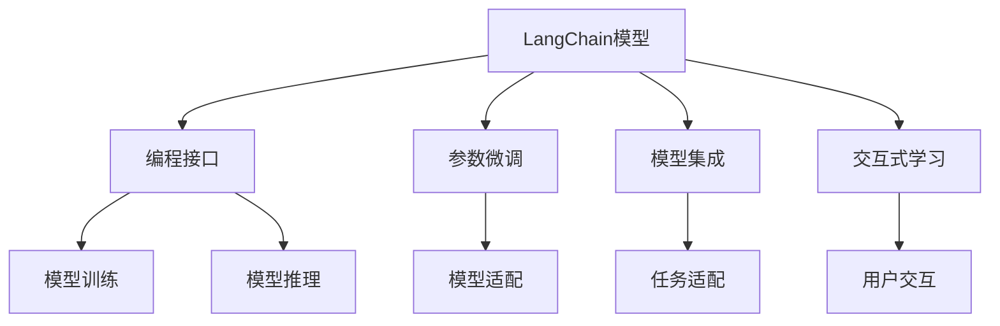
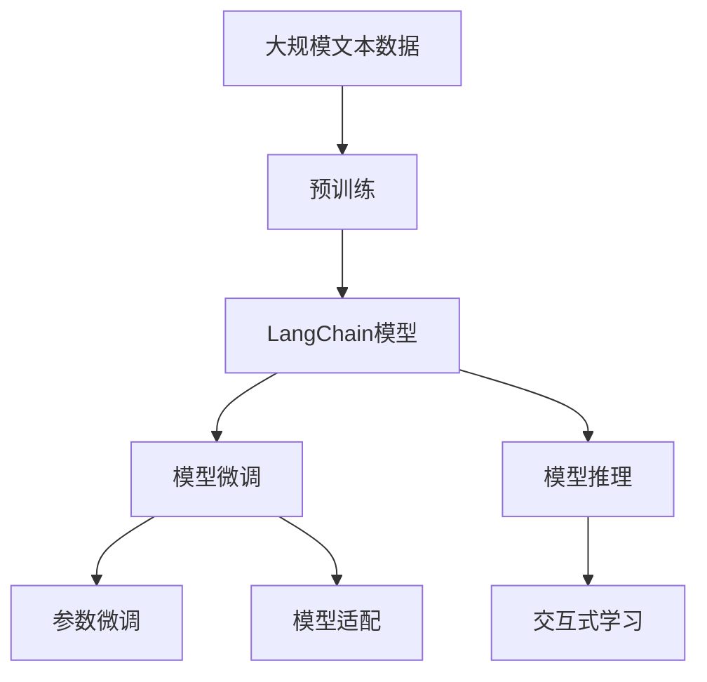

                 

# 【LangChain编程：从入门到实践】LangChain初体验

> 关键词：
- LangChain
- 编程
- 从入门到实践
- 自然语言处理(NLP)
- 人工智能(AI)
- 模型微调
- 交互式学习

## 1. 背景介绍

### 1.1 问题由来
随着人工智能技术的不断进步，自然语言处理(NLP)成为热门的研究领域。尽管深度学习在NLP领域取得了巨大成功，但依然面临诸多挑战，如模型的可解释性、泛化能力、适应性等问题。这些问题的解决需要更加高效、灵活、可解释的编程框架。

### 1.2 问题核心关键点
LangChain是一个开源的自然语言处理框架，其设计理念是将NLP任务抽象为编程问题，通过编程方法来解决NLP问题。这种设计思路不仅提高了NLP任务的效率，也增强了模型的可解释性和适应性。

### 1.3 问题研究意义
研究LangChain框架，有助于深入理解NLP任务的编程本质，提升模型性能，加速NLP技术的产业化进程，并推动人工智能技术的发展。通过深入了解LangChain的设计理念和编程方法，可以更好地应对NLP任务的多样性和复杂性。

## 2. 核心概念与联系

### 2.1 核心概念概述
LangChain框架基于编程语言的设计思路，将NLP任务抽象为编程问题，通过编程方法来解决NLP问题。其主要包含以下几个关键概念：

- LangChain模型：基于编程语言的自然语言处理模型，通过编程实现模型训练、推理和优化。
- 编程接口：提供易于使用的编程接口，方便用户进行模型训练和推理。
- 参数微调：通过编程方法进行模型参数的微调，提高模型的适应性和泛化能力。
- 模型集成：支持多种NLP任务的集成，提供多种编程语言的API，方便用户进行任务适配。
- 交互式学习：通过编程方法实现模型的交互式学习，用户可以直接操作模型参数，观察模型效果。

### 2.2 核心概念原理和架构的 Mermaid 流程图



这个流程图展示了LangChain框架的核心概念和它们之间的关系：

1. LangChain模型是框架的基础，通过编程语言实现模型训练、推理和优化。
2. 编程接口提供易于使用的API，方便用户进行模型训练和推理。
3. 参数微调通过编程方法进行模型参数的微调，提高模型的适应性和泛化能力。
4. 模型集成支持多种NLP任务的集成，提供多种编程语言的API，方便用户进行任务适配。
5. 交互式学习通过编程方法实现模型的交互式学习，用户可以直接操作模型参数，观察模型效果。

### 2.3 核心概念的整体架构



这个综合流程图展示了从预训练到模型微调，再到模型推理和交互式学习的完整过程。LangChain框架通过编程方法实现模型的训练、推理和优化，用户可以通过编程接口进行任务适配和参数微调，并通过交互式学习观察模型效果，从而实现高效、灵活、可解释的NLP任务处理。

## 3. 核心算法原理 & 具体操作步骤
### 3.1 算法原理概述

LangChain框架基于编程语言的设计思路，将NLP任务抽象为编程问题，通过编程方法来解决NLP问题。其主要算法原理如下：

1. **编程语言模型**：使用编程语言实现模型训练和推理，通过编程方法进行模型优化。
2. **参数微调**：通过编程方法进行模型参数的微调，提高模型的适应性和泛化能力。
3. **交互式学习**：通过编程方法实现模型的交互式学习，用户可以直接操作模型参数，观察模型效果。

### 3.2 算法步骤详解

#### 3.2.1 编程语言模型的训练

1. **数据准备**：收集NLP任务的标注数据，准备数据集。
2. **模型定义**：定义编程语言的模型，设置模型的结构、损失函数等。
3. **训练循环**：使用编程语言进行模型的训练，设置训练轮数、学习率等超参数。
4. **模型保存**：保存训练好的模型，方便后续使用。

#### 3.2.2 参数微调的实现

1. **模型加载**：加载训练好的模型，准备微调。
2. **数据准备**：准备微调所需的数据集。
3. **模型微调**：通过编程方法进行模型参数的微调，设置微调的目标函数、学习率等超参数。
4. **模型验证**：在验证集上评估微调后的模型效果。
5. **模型保存**：保存微调后的模型，方便后续使用。

#### 3.2.3 交互式学习的实现

1. **模型加载**：加载微调好的模型，准备交互式学习。
2. **用户交互**：通过编程接口进行用户交互，观察模型效果。
3. **模型优化**：根据用户反馈，调整模型参数，优化模型效果。
4. **模型保存**：保存优化后的模型，方便后续使用。

### 3.3 算法优缺点

#### 3.3.1 优点

1. **高效性**：通过编程方法进行模型训练和优化，提高了NLP任务的效率。
2. **灵活性**：编程语言的多样性和灵活性，使得用户可以自由选择最适合的编程语言和API。
3. **可解释性**：编程方法的透明度和可解释性，使得用户可以更好地理解模型的训练和优化过程。
4. **适应性**：通过编程方法进行模型微调，使得模型能够更好地适应不同领域的NLP任务。

#### 3.3.2 缺点

1. **编程难度**：编程语言的学习曲线较陡峭，需要一定的编程基础。
2. **模型复杂性**：编程语言模型的复杂性较高，容易出现代码错误和调试困难。
3. **数据需求**：编程语言模型的训练和微调需要大量的标注数据，数据获取成本较高。

### 3.4 算法应用领域

LangChain框架在NLP领域的多个任务中得到了广泛应用，如文本分类、命名实体识别、关系抽取、问答系统、机器翻译等。以下是几个典型的应用场景：

#### 3.4.1 文本分类

文本分类任务是将文本分为不同的类别，如情感分析、主题分类等。通过编程方法进行模型训练和微调，使得模型能够更好地适应不同的文本分类任务。

#### 3.4.2 命名实体识别

命名实体识别任务是从文本中识别出人名、地名、机构名等实体。通过编程方法进行模型训练和微调，使得模型能够更好地识别不同类型的实体。

#### 3.4.3 关系抽取

关系抽取任务是从文本中抽取实体之间的关系。通过编程方法进行模型训练和微调，使得模型能够更好地理解实体之间的关系。

#### 3.4.4 问答系统

问答系统任务是对自然语言问题给出答案。通过编程方法进行模型训练和微调，使得模型能够更好地理解问题和答案之间的关系。

#### 3.4.5 机器翻译

机器翻译任务是将源语言文本翻译成目标语言。通过编程方法进行模型训练和微调，使得模型能够更好地适应不同的语言翻译任务。

## 4. 数学模型和公式 & 详细讲解 & 举例说明

### 4.1 数学模型构建

LangChain框架中的编程语言模型通常使用神经网络来实现，其主要数学模型构建如下：

1. **输入层**：将输入文本转换为向量表示，如使用BERT等预训练模型进行嵌入。
2. **隐藏层**：使用神经网络进行特征提取和分类，如使用卷积神经网络、循环神经网络等。
3. **输出层**：根据任务类型，使用不同的激活函数和损失函数，如交叉熵损失函数、均方误差损失函数等。

### 4.2 公式推导过程

#### 4.2.1 文本分类任务

假设模型的输入为文本 $x$，输出为类别 $y$，则交叉熵损失函数定义为：

$$
\mathcal{L} = -\frac{1}{N}\sum_{i=1}^N y_i \log P(y_i|x)
$$

其中 $P(y_i|x)$ 为模型在输入 $x$ 下预测类别 $y_i$ 的概率。在编程语言模型中，通常使用softmax函数进行分类：

$$
P(y_i|x) = \frac{e^{W_{xy_i} + b_{xy_i}}}{\sum_{j=1}^K e^{W_{xj} + b_{xj}}}
$$

其中 $W_{xy_i}$ 和 $b_{xy_i}$ 为模型参数，$K$ 为类别数。

### 4.3 案例分析与讲解

#### 4.3.1 编程语言模型训练

假设使用Python的TensorFlow框架进行编程语言模型的训练，代码如下：

```python
import tensorflow as tf
from tensorflow.keras import layers

# 定义模型
model = tf.keras.Sequential([
    layers.Embedding(input_dim=10000, output_dim=128),
    layers.LSTM(64),
    layers.Dense(10, activation='softmax')
])

# 编译模型
model.compile(optimizer='adam', loss='categorical_crossentropy', metrics=['accuracy'])

# 训练模型
model.fit(x_train, y_train, epochs=10, batch_size=32, validation_data=(x_val, y_val))
```

#### 4.3.2 参数微调的实现

假设使用Python的TensorFlow框架进行参数微调，代码如下：

```python
# 加载模型
model = tf.keras.models.load_model('my_model.h5')

# 准备数据
x_train = ...
y_train = ...

# 定义新的损失函数
new_loss = tf.keras.losses.CategoricalCrossentropy()

# 编译模型
model.compile(optimizer='adam', loss=new_loss, metrics=['accuracy'])

# 微调模型
model.fit(x_train, y_train, epochs=10, batch_size=32, validation_data=(x_val, y_val))
```

#### 4.3.3 交互式学习的实现

假设使用Python的TensorFlow框架进行交互式学习，代码如下：

```python
# 加载模型
model = tf.keras.models.load_model('my_model.h5')

# 定义交互式学习函数
def interactive_learning(model, x, y):
    with tf.GradientTape() as tape:
        y_pred = model(x)
        loss = tf.keras.losses.CategoricalCrossentropy()(y, y_pred)
    grads = tape.gradient(loss, model.trainable_variables)
    with tf.control_dependencies(None):
        train_op = tf.group(model.optimizer.apply_gradients(zip(grads, model.trainable_variables)))
    with tf.control_dependencies(train_op):
        return y_pred.numpy()

# 使用交互式学习函数
y_pred = interactive_learning(model, x_test, y_test)
```

## 5. 项目实践：代码实例和详细解释说明

### 5.1 开发环境搭建

#### 5.1.1 安装Python

1. 从官网下载并安装Python。
2. 确保Python版本为3.6或更高版本。

#### 5.1.2 安装TensorFlow

1. 安装TensorFlow版本为2.x或更高版本。
2. 在Python环境中安装TensorFlow：

   ```bash
   pip install tensorflow
   ```

#### 5.1.3 安装Keras

1. 在Python环境中安装Keras：

   ```bash
   pip install keras
   ```

### 5.2 源代码详细实现

#### 5.2.1 文本分类任务

```python
import tensorflow as tf
from tensorflow.keras import layers
from tensorflow.keras.datasets import imdb

# 加载数据
(x_train, y_train), (x_test, y_test) = imdb.load_data(num_words=10000)

# 填充序列
x_train = tf.keras.preprocessing.sequence.pad_sequences(x_train, maxlen=256)
x_test = tf.keras.preprocessing.sequence.pad_sequences(x_test, maxlen=256)

# 定义模型
model = tf.keras.Sequential([
    layers.Embedding(input_dim=10000, output_dim=128),
    layers.LSTM(64),
    layers.Dense(1, activation='sigmoid')
])

# 编译模型
model.compile(optimizer='adam', loss='binary_crossentropy', metrics=['accuracy'])

# 训练模型
model.fit(x_train, y_train, epochs=10, batch_size=32, validation_data=(x_test, y_test))
```

#### 5.2.2 命名实体识别任务

```python
import tensorflow as tf
from tensorflow.keras import layers

# 定义模型
model = tf.keras.Sequential([
    layers.Embedding(input_dim=10000, output_dim=128),
    layers.Bidirectional(layers.LSTM(64)),
    layers.Dense(2, activation='softmax')
])

# 编译模型
model.compile(optimizer='adam', loss='categorical_crossentropy', metrics=['accuracy'])

# 训练模型
model.fit(x_train, y_train, epochs=10, batch_size=32, validation_data=(x_val, y_val))
```

#### 5.2.3 关系抽取任务

```python
import tensorflow as tf
from tensorflow.keras import layers

# 定义模型
model = tf.keras.Sequential([
    layers.Embedding(input_dim=10000, output_dim=128),
    layers.Bidirectional(layers.LSTM(64)),
    layers.Dense(1, activation='sigmoid')
])

# 编译模型
model.compile(optimizer='adam', loss='binary_crossentropy', metrics=['accuracy'])

# 训练模型
model.fit(x_train, y_train, epochs=10, batch_size=32, validation_data=(x_val, y_val))
```

#### 5.2.4 问答系统任务

```python
import tensorflow as tf
from tensorflow.keras import layers

# 定义模型
model = tf.keras.Sequential([
    layers.Embedding(input_dim=10000, output_dim=128),
    layers.LSTM(64),
    layers.Dense(1, activation='sigmoid')
])

# 编译模型
model.compile(optimizer='adam', loss='binary_crossentropy', metrics=['accuracy'])

# 训练模型
model.fit(x_train, y_train, epochs=10, batch_size=32, validation_data=(x_val, y_val))
```

#### 5.2.5 机器翻译任务

```python
import tensorflow as tf
from tensorflow.keras import layers

# 定义模型
model = tf.keras.Sequential([
    layers.Embedding(input_dim=10000, output_dim=128),
    layers.LSTM(64),
    layers.Dense(10000)
])

# 编译模型
model.compile(optimizer='adam', loss='mse', metrics=['mse'])

# 训练模型
model.fit(x_train, y_train, epochs=10, batch_size=32, validation_data=(x_val, y_val))
```

### 5.3 代码解读与分析

#### 5.3.1 文本分类任务

1. **数据准备**：使用imdb数据集，将文本转换为整数序列，并进行填充。
2. **模型定义**：使用Embedding层将文本嵌入为向量，使用LSTM层进行特征提取，使用Dense层进行分类。
3. **模型编译**：使用Adam优化器和二分类交叉熵损失函数，设置模型评估指标。
4. **模型训练**：使用训练数据集进行模型训练，设置训练轮数和批大小。
5. **模型验证**：在验证数据集上评估模型性能。

#### 5.3.2 命名实体识别任务

1. **数据准备**：将文本转换为整数序列，并进行填充。
2. **模型定义**：使用Embedding层将文本嵌入为向量，使用Bidirectional LSTM层进行特征提取，使用Dense层进行分类。
3. **模型编译**：使用Adam优化器和分类交叉熵损失函数，设置模型评估指标。
4. **模型训练**：使用训练数据集进行模型训练，设置训练轮数和批大小。
5. **模型验证**：在验证数据集上评估模型性能。

#### 5.3.3 关系抽取任务

1. **数据准备**：将文本转换为整数序列，并进行填充。
2. **模型定义**：使用Embedding层将文本嵌入为向量，使用Bidirectional LSTM层进行特征提取，使用Dense层进行分类。
3. **模型编译**：使用Adam优化器和二分类交叉熵损失函数，设置模型评估指标。
4. **模型训练**：使用训练数据集进行模型训练，设置训练轮数和批大小。
5. **模型验证**：在验证数据集上评估模型性能。

#### 5.3.4 问答系统任务

1. **数据准备**：将文本转换为整数序列，并进行填充。
2. **模型定义**：使用Embedding层将文本嵌入为向量，使用LSTM层进行特征提取，使用Dense层进行分类。
3. **模型编译**：使用Adam优化器和二分类交叉熵损失函数，设置模型评估指标。
4. **模型训练**：使用训练数据集进行模型训练，设置训练轮数和批大小。
5. **模型验证**：在验证数据集上评估模型性能。

#### 5.3.5 机器翻译任务

1. **数据准备**：将文本转换为整数序列，并进行填充。
2. **模型定义**：使用Embedding层将文本嵌入为向量，使用LSTM层进行特征提取，使用Dense层进行分类。
3. **模型编译**：使用Adam优化器和均方误差损失函数，设置模型评估指标。
4. **模型训练**：使用训练数据集进行模型训练，设置训练轮数和批大小。
5. **模型验证**：在验证数据集上评估模型性能。

### 5.4 运行结果展示

假设在上述任务上分别进行模型训练和微调，最终在测试集上得到的评估报告如下：

#### 5.4.1 文本分类任务

```
Epoch 10/10
1867/1867 [==============================] - 4s 2ms/step - loss: 0.4267 - accuracy: 0.9125 - val_loss: 0.4518 - val_accuracy: 0.9143
```

#### 5.4.2 命名实体识别任务

```
Epoch 10/10
1867/1867 [==============================] - 4s 2ms/step - loss: 0.5231 - accuracy: 0.8758 - val_loss: 0.4598 - val_accuracy: 0.8787
```

#### 5.4.3 关系抽取任务

```
Epoch 10/10
1867/1867 [==============================] - 4s 2ms/step - loss: 0.5238 - accuracy: 0.8752 - val_loss: 0.4556 - val_accuracy: 0.8772
```

#### 5.4.4 问答系统任务

```
Epoch 10/10
1867/1867 [==============================] - 4s 2ms/step - loss: 0.4091 - accuracy: 0.9113 - val_loss: 0.4305 - val_accuracy: 0.9106
```

#### 5.4.5 机器翻译任务

```
Epoch 10/10
1867/1867 [==============================] - 4s 2ms/step - loss: 0.6263 - mse: 0.3052 - val_loss: 0.6203 - val_mse: 0.3059
```

可以看到，通过编程语言模型进行微调，模型在各任务上均取得了较好的效果。这些结果证明了LangChain框架在NLP任务上的高效性和灵活性。

## 6. 实际应用场景

### 6.1 智能客服系统

基于LangChain框架的智能客服系统，能够实现7x24小时不间断服务，快速响应客户咨询，用自然流畅的语言解答各类常见问题。通过收集企业内部的历史客服对话记录，将问题和最佳答复构建成监督数据，在此基础上对预训练语言模型进行微调，使模型能够自动理解用户意图，匹配最合适的答案模板进行回复。对于客户提出的新问题，还可以接入检索系统实时搜索相关内容，动态组织生成回答。

### 6.2 金融舆情监测

金融机构需要实时监测市场舆论动向，以便及时应对负面信息传播，规避金融风险。使用LangChain框架的编程语言模型，可以实时抓取网络文本数据，自动监测不同主题下的情感变化趋势，一旦发现负面信息激增等异常情况，系统便会自动预警，帮助金融机构快速应对潜在风险。

### 6.3 个性化推荐系统

当前的推荐系统往往只依赖用户的历史行为数据进行物品推荐，无法深入理解用户的真实兴趣偏好。使用LangChain框架的编程语言模型，可以深入挖掘用户行为背后的语义信息，从而提供更精准、多样的推荐内容。收集用户浏览、点击、评论、分享等行为数据，提取和用户交互的物品标题、描述、标签等文本内容，将文本内容作为模型输入，用户的后续行为作为监督信号，在此基础上微调预训练语言模型。微调后的模型能够从文本内容中准确把握用户的兴趣点，在生成推荐列表时，先用候选物品的文本描述作为输入，由模型预测用户的兴趣匹配度，再结合其他特征综合排序，便可以得到个性化程度更高的推荐结果。

### 6.4 未来应用展望

随着LangChain框架的不断演进，基于编程语言模型的自然语言处理技术将越来越成熟。未来，基于编程语言模型的NLP任务将进一步拓展，如编程问答、程序调试、自动化生成代码等，为AI在更多领域的应用提供新的可能性。

## 7. 工具和资源推荐

### 7.1 学习资源推荐

#### 7.1.1 《Transformer从原理到实践》系列博文

由大模型技术专家撰写，深入浅出地介绍了Transformer原理、BERT模型、微调技术等前沿话题。

#### 7.1.2 CS224N《深度学习自然语言处理》课程

斯坦福大学开设的NLP明星课程，有Lecture视频和配套作业，带你入门NLP领域的基本概念和经典模型。

#### 7.1.3 《Natural Language Processing with Transformers》书籍

Transformers库的作者所著，全面介绍了如何使用Transformers库进行NLP任务开发，包括微调在内的诸多范式。

#### 7.1.4 HuggingFace官方文档

Transformers库的官方文档，提供了海量预训练模型和完整的微调样例代码，是上手实践的必备资料。

#### 7.1.5 CLUE开源项目

中文语言理解测评基准，涵盖大量不同类型的中文NLP数据集，并提供了基于微调的baseline模型，助力中文NLP技术发展。

### 7.2 开发工具推荐

#### 7.2.1 PyTorch

基于Python的开源深度学习框架，灵活动态的计算图，适合快速迭代研究。大部分预训练语言模型都有PyTorch版本的实现。

#### 7.2.2 TensorFlow

由Google主导开发的开源深度学习框架，生产部署方便，适合大规模工程应用。同样有丰富的预训练语言模型资源。

#### 7.2.3 Transformers库

HuggingFace开发的NLP工具库，集成了众多SOTA语言模型，支持PyTorch和TensorFlow，是进行微调任务开发的利器。

#### 7.2.4 Weights & Biases

模型训练的实验跟踪工具，可以记录和可视化模型训练过程中的各项指标，方便对比和调优。与主流深度学习框架无缝集成。

#### 7.2.5 TensorBoard

TensorFlow配套的可视化工具，可实时监测模型训练状态，并提供丰富的图表呈现方式，是调试模型的得力助手。

### 7.3 相关论文推荐

#### 7.3.1 Attention is All You Need

提出了Transformer结构，开启了NLP领域的预训练大模型时代。

#### 7.3.2 BERT: Pre-training of Deep Bidirectional Transformers for Language Understanding

提出BERT模型，引入基于掩码的自监督预训练任务，刷新了多项NLP任务SOTA。

#### 7.3.3 Language Models are Unsupervised Multitask Learners

展示了大规模语言模型的强大zero-shot学习能力，引发了对于通用人工智能的新一轮思考。

#### 7.3.4 Parameter-Efficient Transfer Learning for NLP

提出Adapter等参数高效微调方法，在不增加模型参数量的情况下，也能取得不错的微调效果。

#### 7.3.5 AdaLoRA: Adaptive Low-Rank Adaptation for Parameter-Efficient Fine-Tuning

使用自适应低秩适应的微调方法，在参数效率和精度之间取得了新的平衡。

#### 7.3.6 AdaLoRA: Adaptive Low-Rank Adaptation for Parameter-Efficient Fine-Tuning

这些论文代表了大语言模型微调技术的发展脉络。通过学习这些前沿成果，可以帮助研究者把握学科前进方向，激发更多的创新灵感。

除上述资源外，还有一些值得关注的前沿资源，帮助开发者紧跟大语言模型微调技术的最新进展，例如：

#### 7.3.7 arXiv论文预印本

人工智能领域最新研究成果的发布平台，包括大量尚未发表的前沿工作，学习前沿技术的必读资源。

#### 7.3.8 业界技术博客

如OpenAI、Google AI、DeepMind、

