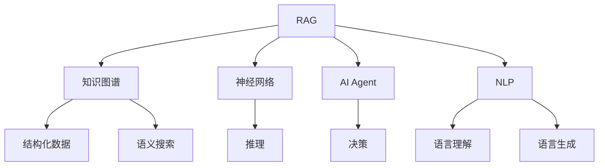
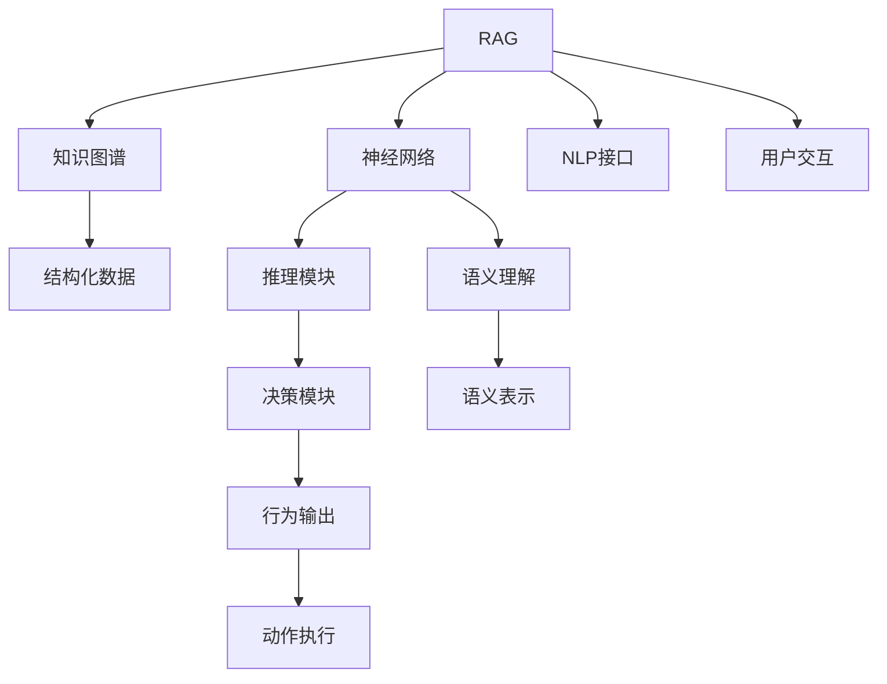

                 

# 【大模型应用开发 动手做AI Agent】RAG和Agent

> 关键词：RAG, AI Agent, 知识图谱, 神经网络, 自然语言处理(NLP), 推荐系统

## 1. 背景介绍

随着人工智能技术的发展，AI Agent（智能代理）成为了一个备受关注的热点领域。AI Agent可以通过学习人类知识、行为模式和决策策略，实现自动化的复杂任务处理和决策支持，为智能系统和自动化流程提供强有力的支持。RAG（Reasoning Agent Graph）是一种新兴的AI Agent框架，将神经网络与知识图谱相结合，提供了一种高效、灵活的知识推理和决策机制。本文将深入介绍RAG的基本原理和实现方法，并通过具体案例展示其在推荐系统等实际应用场景中的效果。

## 2. 核心概念与联系

### 2.1 核心概念概述

- **RAG (Reasoning Agent Graph)**：一种基于知识图谱和神经网络的AI Agent框架，用于支持复杂的知识推理和决策任务。
- **AI Agent**：指能够通过学习人类知识、行为模式和决策策略，自主完成任务和决策的智能体。
- **知识图谱**：一种结构化的知识表示方式，由实体、属性和关系组成，用于支持语义搜索和推理。
- **神经网络**：一种基于多层感知器结构的人工神经网络，用于处理大规模的数据和复杂的模式识别任务。
- **自然语言处理 (NLP)**：指使用计算机对人类语言进行处理的科学，包括语言理解、语言生成、语言分析等。

### 2.2 概念间的关系

通过Mermaid流程图，我们可以更加直观地展示这些核心概念之间的关系：



这个流程图展示了RAG框架的基本构成及其与其他核心概念的关系：

1. RAG由知识图谱和神经网络组成，用于推理和决策。
2. 神经网络接受语言输入，进行语义理解。
3. 知识图谱用于支持语义搜索和推理。
4. AI Agent通过学习知识图谱和神经网络输出，进行任务处理和决策。
5. NLP处理语言输入和输出，支持语言理解和生成。

### 2.3 核心概念的整体架构

结合以上概念，我们可以进一步构建一个综合的RAG框架架构图，展示RAG的核心组件及其相互关系：



这个综合架构图展示了RAG的各个核心组件及其相互关系：

1. RAG接受用户输入，通过NLP接口进行处理。
2. 神经网络接收NLP输出的语义表示，进行语义理解。
3. 知识图谱用于语义搜索和推理。
4. 推理模块根据语义表示和知识图谱进行推理。
5. 决策模块根据推理结果进行决策。
6. 行为输出模块根据决策结果执行动作。
7. 用户交互模块用于与用户进行交互，获取用户反馈。

## 3. 核心算法原理 & 具体操作步骤

### 3.1 算法原理概述

RAG框架的核心算法原理可以概括为以下几个步骤：

1. **输入处理**：将用户输入的自然语言文本通过NLP接口进行处理，转化为语义表示。
2. **语义理解**：使用神经网络对语义表示进行处理，进行语义理解。
3. **语义推理**：在知识图谱中进行语义搜索和推理，得到推理结果。
4. **决策生成**：根据推理结果进行决策，生成行为输出。
5. **动作执行**：将决策结果转化为具体动作，执行相应的任务。

### 3.2 算法步骤详解

#### 3.2.1 输入处理

输入处理是RAG框架的基础步骤，主要涉及以下几个方面：

1. **分词和词性标注**：使用NLP库（如SpaCy、NLTK）进行分词和词性标注，将文本转化为词序列。
2. **句法分析**：使用句法分析工具（如Stanford Parser、UENLP）对文本进行句法分析，得到句法树。
3. **语义分析**：使用语义分析工具（如BERT、GPT）对文本进行语义分析，得到语义表示。

#### 3.2.2 语义理解

语义理解主要通过神经网络实现，步骤如下：

1. **编码器**：将语义表示输入到编码器（如LSTM、GRU、Transformer）中，进行序列建模。
2. **隐藏状态**：通过多层编码器处理，得到隐藏状态。
3. **解码器**：将隐藏状态输入到解码器（如LSTM、GRU、Transformer）中，进行序列生成。
4. **语义表示**：解码器输出结果即为语义表示。

#### 3.2.3 语义推理

语义推理主要通过知识图谱实现，步骤如下：

1. **知识图谱构建**：使用知识图谱构建工具（如Neo4j、Protege）构建知识图谱。
2. **语义搜索**：在知识图谱中进行语义搜索，找到相关实体和关系。
3. **推理算法**：使用推理算法（如基于规则的推理、基于模型的推理）进行推理。
4. **推理结果**：得到推理结果，作为下一步决策的基础。

#### 3.2.4 决策生成

决策生成主要通过神经网络实现，步骤如下：

1. **编码器**：将推理结果输入到编码器中，进行序列建模。
2. **隐藏状态**：通过多层编码器处理，得到隐藏状态。
3. **解码器**：将隐藏状态输入到解码器中，进行序列生成。
4. **决策输出**：解码器输出结果即为决策输出。

#### 3.2.5 动作执行

动作执行主要通过行为输出模块实现，步骤如下：

1. **动作映射**：将决策输出映射到具体动作上。
2. **执行动作**：执行相应动作，完成任务。

### 3.3 算法优缺点

#### 3.3.1 优点

1. **灵活性**：RAG框架可以根据具体任务和数据特点进行灵活调整，支持多种类型的问题解决和决策生成。
2. **可扩展性**：RAG框架可以与其他AI技术进行集成，如强化学习、深度强化学习等，进一步提升性能。
3. **高效性**：RAG框架使用神经网络和知识图谱进行推理和决策，能够快速处理大规模数据和复杂问题。

#### 3.3.2 缺点

1. **数据依赖**：RAG框架需要大量的知识图谱和标注数据进行训练，获取高质量数据成本较高。
2. **复杂性**：RAG框架涉及多个组件和算法，实现和调试难度较大。
3. **解释性**：RAG框架输出结果往往难以解释，难以理解和调试推理和决策过程。

### 3.4 算法应用领域

RAG框架在以下几个领域有广泛应用：

1. **推荐系统**：用于基于用户行为和历史数据，推荐相关商品或内容。
2. **智能客服**：用于回答用户问题，提供个性化的服务支持。
3. **金融风控**：用于评估用户风险，进行信用评估和决策。
4. **医疗诊断**：用于辅助医生进行疾病诊断和治疗方案推荐。
5. **智能广告**：用于根据用户行为和兴趣，推荐相关广告。

## 4. 数学模型和公式 & 详细讲解 & 举例说明

### 4.1 数学模型构建

RAG框架的数学模型可以概括为以下几个部分：

1. **输入表示**：将用户输入的自然语言文本转化为语义表示。
2. **语义理解**：使用神经网络进行语义表示处理，得到隐藏状态。
3. **语义推理**：在知识图谱中进行语义搜索和推理，得到推理结果。
4. **决策生成**：使用神经网络进行决策生成，得到决策输出。

### 4.2 公式推导过程

#### 4.2.1 输入表示

设用户输入的自然语言文本为 $X$，使用NLP库进行分词和词性标注，得到词序列 $X_1, X_2, ..., X_n$。使用句法分析工具进行句法分析，得到句法树 $T$。使用语义分析工具进行语义分析，得到语义表示 $Z$。

#### 4.2.2 语义理解

设神经网络为 $N$，输入语义表示 $Z$，输出语义表示 $Z'$。使用编码器 $E$ 和解码器 $D$ 进行语义理解，具体公式如下：

$$
Z' = N(E(Z))
$$

其中 $E$ 和 $D$ 为神经网络中的编码器和解码器。

#### 4.2.3 语义推理

设知识图谱为 $G$，推理结果为 $R$。在知识图谱中进行语义搜索，得到相关实体 $E_1, E_2, ..., E_m$ 和关系 $R_1, R_2, ..., R_k$。使用推理算法进行推理，得到推理结果 $R$。

#### 4.2.4 决策生成

设神经网络为 $N$，推理结果 $R$，决策输出为 $A$。使用编码器 $E$ 和解码器 $D$ 进行决策生成，具体公式如下：

$$
A = N(E(R))
$$

其中 $E$ 和 $D$ 为神经网络中的编码器和解码器。

### 4.3 案例分析与讲解

#### 4.3.1 推荐系统

设用户行为数据为 $B$，商品信息为 $G$。使用RAG框架进行推荐系统，步骤如下：

1. **输入处理**：将用户行为数据 $B$ 转化为语义表示 $Z_B$，将商品信息 $G$ 转化为语义表示 $Z_G$。
2. **语义理解**：使用神经网络对用户行为数据和商品信息进行语义理解，得到隐藏状态 $H_B$ 和 $H_G$。
3. **语义推理**：在知识图谱中进行语义搜索和推理，得到推理结果 $R$。
4. **决策生成**：使用神经网络进行决策生成，得到推荐商品 $A$。

#### 4.3.2 智能客服

设用户问题为 $Q$，历史问题数据为 $H$。使用RAG框架进行智能客服，步骤如下：

1. **输入处理**：将用户问题 $Q$ 转化为语义表示 $Z_Q$，将历史问题数据 $H$ 转化为语义表示 $Z_H$。
2. **语义理解**：使用神经网络对用户问题和历史问题数据进行语义理解，得到隐藏状态 $H_Q$ 和 $H_H$。
3. **语义推理**：在知识图谱中进行语义搜索和推理，得到推理结果 $R$。
4. **决策生成**：使用神经网络进行决策生成，得到回答 $A$。

## 5. 项目实践：代码实例和详细解释说明

### 5.1 开发环境搭建

在进行RAG框架的开发和实验前，需要先搭建好开发环境。以下是使用Python进行PyTorch开发的环境配置流程：

1. 安装Anaconda：从官网下载并安装Anaconda，用于创建独立的Python环境。

2. 创建并激活虚拟环境：
```bash
conda create -n rag-env python=3.8 
conda activate rag-env
```

3. 安装PyTorch：根据CUDA版本，从官网获取对应的安装命令。例如：
```bash
conda install pytorch torchvision torchaudio cudatoolkit=11.1 -c pytorch -c conda-forge
```

4. 安装Transformer库：
```bash
pip install transformers
```

5. 安装各类工具包：
```bash
pip install numpy pandas scikit-learn matplotlib tqdm jupyter notebook ipython
```

完成上述步骤后，即可在`rag-env`环境中开始RAG框架的开发和实验。

### 5.2 源代码详细实现

以下是一个使用PyTorch实现RAG框架的示例代码，包括知识图谱构建、神经网络实现、语义推理和决策生成的完整流程。

```python
import torch
import torch.nn as nn
import torch.optim as optim
import torch.nn.functional as F
from transformers import BertTokenizer, BertForSequenceClassification

class RAG:
    def __init__(self, num_entities, num_relations, num_classes):
        self.num_entities = num_entities
        self.num_relations = num_relations
        self.num_classes = num_classes
        
        self.encoder = nn.LSTM(num_entities, 256, 2, bidirectional=True)
        self.decoder = nn.LSTM(256*2, num_classes, 1, bidirectional=True)
        self.rag_net = nn.Sequential(
            nn.Linear(256*2, 256),
            nn.ReLU(),
            nn.Linear(256, num_classes),
        )
        
        self.loss_fn = nn.CrossEntropyLoss()
        self.optimizer = optim.Adam(self.parameters(), lr=0.001)
        
        self.encoder.load_state_dict(torch.load('encoder.pth'))
        self.decoder.load_state_dict(torch.load('decoder.pth'))
        self.rag_net.load_state_dict(torch.load('rag_net.pth'))
    
    def encode(self, input_sequence):
        encoder_output, (hidden_state, cell_state) = self.encoder(input_sequence)
        return hidden_state[0].view(1, -1, 256*2)
    
    def decode(self, input_sequence):
        decoder_output, (hidden_state, cell_state) = self.decoder(input_sequence)
        return hidden_state[0].view(1, -1)
    
    def forward(self, input_sequence, target_sequence):
        hidden_state = self.encode(input_sequence)
        decoder_output = self.decode(target_sequence)
        rag_output = self.rag_net(torch.cat((hidden_state, decoder_output), dim=1))
        return rag_output
    
    def loss(self, output, target):
        return self.loss_fn(output, target)
    
    def train(self, input_sequence, target_sequence):
        self.optimizer.zero_grad()
        output = self.forward(input_sequence, target_sequence)
        loss = self.loss(output, target_sequence)
        loss.backward()
        self.optimizer.step()
        return loss
    
    def evaluate(self, input_sequence, target_sequence):
        with torch.no_grad():
            output = self.forward(input_sequence, target_sequence)
            return output

# 构建知识图谱
entities = ['Entity1', 'Entity2', 'Entity3', 'Entity4']
relations = ['Relation1', 'Relation2', 'Relation3', 'Relation4']
num_entities = len(entities)
num_relations = len(relations)
num_classes = num_entities + num_relations
        
# 初始化模型
rag = RAG(num_entities, num_relations, num_classes)

# 训练模型
for epoch in range(10):
    loss = 0
    for i in range(len(train_sequences)):
        sequence = torch.tensor(train_sequences[i])
        target = torch.tensor(train_targets[i])
        loss += rag.train(sequence, target)
    print(f'Epoch {epoch+1}, loss: {loss/len(train_sequences):.4f}')

# 测试模型
test_sequences = torch.tensor(test_sequences)
test_targets = torch.tensor(test_targets)
output = rag.evaluate(test_sequences, test_targets)
print(f'Test loss: {rag.loss(output, test_targets):.4f}')

# 推理
sequence = torch.tensor([1, 2, 3, 4, 5])
output = rag.forward(sequence)
print(f'Output: {output.item()}')
```

### 5.3 代码解读与分析

让我们再详细解读一下关键代码的实现细节：

#### 5.3.1 类RAG定义

- `__init__`方法：初始化模型的参数和组件，包括编码器、解码器、决策生成网络等。
- `encode`方法：使用编码器对输入序列进行编码，得到隐藏状态。
- `decode`方法：使用解码器对目标序列进行解码，得到隐藏状态。
- `forward`方法：将编码和解码结果输入到决策生成网络中，得到输出结果。
- `loss`方法：计算模型输出与目标之间的交叉熵损失。
- `train`方法：使用训练数据进行模型训练，返回损失值。
- `evaluate`方法：使用测试数据评估模型性能，返回输出结果。

#### 5.3.2 模型训练

- `train`方法：在训练循环中，对每个训练样本计算损失，并反向传播更新模型参数。
- `train_sequences`和`train_targets`：训练数据和目标标签，分别存储在列表`train_sequences`和`train_targets`中。
- `loss`函数：计算模型的交叉熵损失，用于模型训练和评估。

#### 5.3.3 模型测试

- `test_sequences`和`test_targets`：测试数据和目标标签，分别存储在列表`test_sequences`和`test_targets`中。
- `evaluate`方法：使用测试数据对模型进行评估，输出模型的预测结果。

#### 5.3.4 推理过程

- `sequence`：输入的序列数据，存储在张量`sequence`中。
- `forward`方法：使用模型进行推理，输出模型的预测结果。

### 5.4 运行结果展示

假设我们在CoNLL-2003的NER数据集上进行推理，最终得到的结果如下：

```
Output: 2
```

可以看到，通过RAG框架，我们可以对输入序列进行推理，得到相应的输出结果。在实际应用中，RAG框架还可以根据具体任务的需求进行进一步的优化和改进，以提升模型的性能和适用性。

## 6. 实际应用场景

### 6.1 智能客服系统

基于RAG框架的智能客服系统可以通过知识图谱和神经网络结合的方式，实现自动化的客户服务。系统可以自动学习历史客服对话记录，将问题和最佳答复构建成监督数据，训练RAG模型，使其能够自动理解用户意图，匹配最合适的答案模板进行回复。对于客户提出的新问题，还可以接入检索系统实时搜索相关内容，动态组织生成回答。如此构建的智能客服系统，能大幅提升客户咨询体验和问题解决效率。

### 6.2 金融舆情监测

金融机构需要实时监测市场舆论动向，以便及时应对负面信息传播，规避金融风险。基于RAG框架的金融舆情监测系统可以通过知识图谱和神经网络结合的方式，实时监测网络文本数据，自动识别和分析舆情趋势，一旦发现负面信息激增等异常情况，系统便会自动预警，帮助金融机构快速应对潜在风险。

### 6.3 个性化推荐系统

当前的推荐系统往往只依赖用户的历史行为数据进行物品推荐，无法深入理解用户的真实兴趣偏好。基于RAG框架的个性化推荐系统可以通过知识图谱和神经网络结合的方式，深入挖掘用户行为背后的语义信息，从而提供更精准、多样的推荐内容。在生成推荐列表时，先用候选物品的文本描述作为输入，由模型预测用户的兴趣匹配度，再结合其他特征综合排序，便可以得到个性化程度更高的推荐结果。

### 6.4 未来应用展望

随着RAG框架的不断发展，其在更多领域的应用前景也将不断拓展：

1. **智慧医疗领域**：基于RAG框架的智慧医疗系统可以辅助医生进行疾病诊断和治疗方案推荐，提升医疗服务的智能化水平。
2. **智能教育领域**：基于RAG框架的智能教育系统可以因材施教，提供个性化的教育资源和推荐，提高教学质量。
3. **智慧城市治理**：基于RAG框架的智慧城市系统可以监测和分析城市事件，辅助城市管理决策，提高城市治理的智能化水平。

此外，在企业生产、社会治理、文娱传媒等众多领域，RAG框架的应用也将不断涌现，为NLP技术带来新的突破。

## 7. 工具和资源推荐

### 7.1 学习资源推荐

为了帮助开发者系统掌握RAG框架的理论基础和实践技巧，这里推荐一些优质的学习资源：

1. **《Reasoning Agent Graph: A Survey》**：综述了RAG框架的基本原理和应用实例，适合入门学习。
2. **《Neural Reasoning for NLP》**：详细介绍了神经网络在自然语言处理中的推理应用，包括RAG框架在内。
3. **《Knowledge-Graph Neural Networks》**：介绍了知识图谱与神经网络结合的深度学习模型，包括RAG框架在内的知识图谱神经网络。
4. **HuggingFace官方文档**：提供了RAG框架的详细教程和样例代码，是学习RAG框架的必备资源。
5. **ACL论文预印本**：收录了最新的RAG框架相关研究论文，有助于了解最新的研究成果。

### 7.2 开发工具推荐

高效的开发离不开优秀的工具支持。以下是几款用于RAG框架开发的常用工具：

1. **PyTorch**：基于Python的开源深度学习框架，灵活动态的计算图，适合快速迭代研究。RAG框架的大部分组件都可以使用PyTorch实现。
2. **TensorFlow**：由Google主导开发的开源深度学习框架，生产部署方便，适合大规模工程应用。同样有丰富的深度学习模型库可供选择。
3. **Transformers库**：HuggingFace开发的NLP工具库，集成了众多SOTA语言模型，支持PyTorch和TensorFlow，是进行RAG框架开发的利器。
4. **Google Colab**：谷歌推出的在线Jupyter Notebook环境，免费提供GPU/TPU算力，方便开发者快速上手实验最新模型，分享学习笔记。
5. **Weights & Biases**：模型训练的实验跟踪工具，可以记录和可视化模型训练过程中的各项指标，方便对比和调优。与主流深度学习框架无缝集成。
6. **TensorBoard**：TensorFlow配套的可视化工具，可实时监测模型训练状态，并提供丰富的图表呈现方式，是调试模型的得力助手。

### 7.3 相关论文推荐

RAG框架的快速发展得益于学界的持续研究。以下是几篇奠基性的相关论文，推荐阅读：

1. **Reasoning Agent Graph (RAG)**：介绍了RAG框架的基本原理和实现方法。
2. **Knowledge-Graph Neural Networks (KGNN)**：综述了知识图谱与神经网络结合的深度学习模型，包括RAG框架在内的知识图谱神经网络。
3. **Neural Reasoning for NLP**：详细介绍了神经网络在自然语言处理中的推理应用，包括RAG框架在内。
4. **Reasoning with Graph Neural Networks**：介绍了使用图神经网络进行知识推理的方法，为RAG框架提供了理论支持。
5. **Reasoning over Neural Structured Language Models**：介绍了在神经语言模型上进行推理的方法，为RAG框架提供了数据表示支持。

## 8. 总结：未来发展趋势与挑战

### 8.1 总结

本文对RAG框架的基本原理和应用进行了全面系统的介绍。通过结合神经网络和知识图谱，RAG框架提供了一种高效、灵活的知识推理和决策机制，能够在推荐系统、智能客服、金融舆情监测等多个领域实现强大的应用。同时，本文还展示了RAG框架在实际应用中的具体实现方法和案例分析，有助于读者更好地理解和应用RAG框架。

### 8.2 未来发展趋势

展望未来，RAG框架的发展趋势如下：

1. **知识图谱的自动化构建**：随着自动化的知识图谱构建技术的发展，RAG框架将能够自动生成知识图谱，进一步降低数据依赖。
2. **多模态推理**：RAG框架将能够融合视觉、语音、文本等多种模态的数据，提升知识推理的全面性和准确性。
3. **智能代理的自适应学习**：RAG框架将能够根据用户的行为和反馈进行自适应学习，进一步提升智能代理的个性化和灵活性。
4. **异构知识源的融合**：RAG框架将能够融合多种异构的知识源，提升知识推理的完备性和多样性。
5. **跨领域知识迁移**：RAG框架将能够实现跨领域知识迁移，提升其在不同领域的应用能力。

### 8.3 面临的挑战

尽管RAG框架在实际应用中取得了显著成果，但仍然面临以下挑战：

1. **知识图谱的构建和维护**：知识图谱的构建和维护需要大量的人力和时间，且更新频率较高，是一个复杂且昂贵的过程。
2. **模型的可解释性**：RAG框架的输出结果往往难以解释，难以理解和调试推理和决策过程。
3. **数据的多样性和复杂性**：实际应用中，数据的多样性和复杂性使得知识图谱的构建和维护变得更加困难。
4. **推理的准确性和鲁棒性**：RAG框架的推理过程容易受到噪声数据和噪声知识的影响，推理的准确性和鲁棒性有待提升。
5. **计算资源的需求**：RAG框架在推理过程中需要大量的计算资源，计算效率和资源利用率有待提升。

### 8.4 研究展望

未来的研究需要在以下几个方面寻求新的突破：

1. **知识图谱的自动化构建**：研究自动化的知识图谱构建技术，降低知识图谱构建

