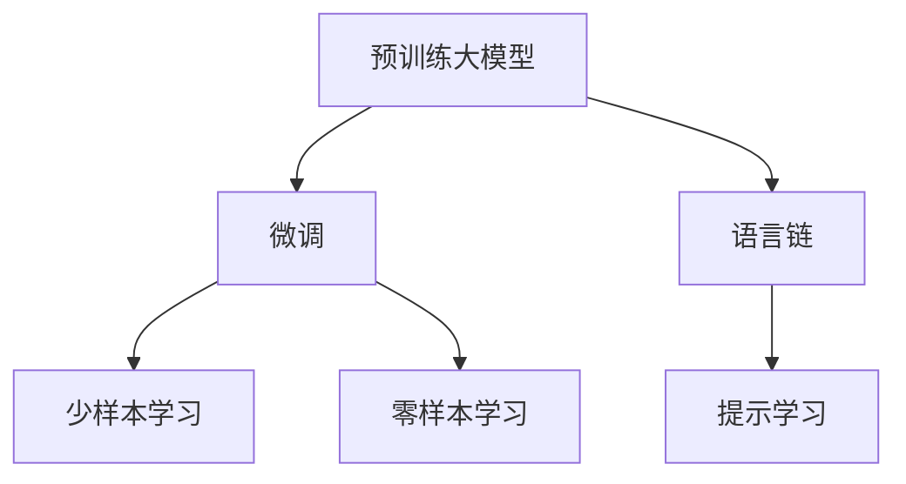
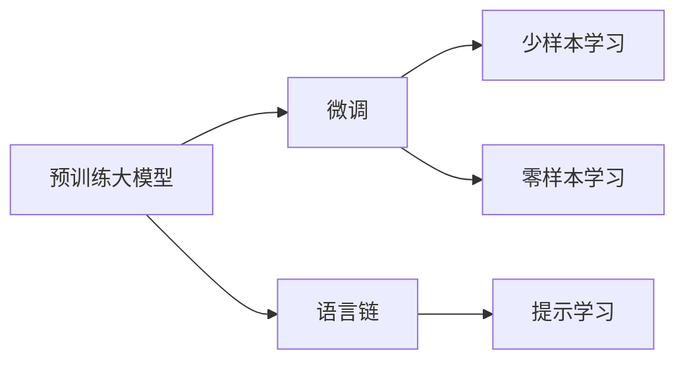
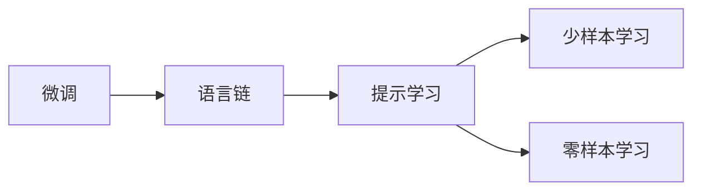
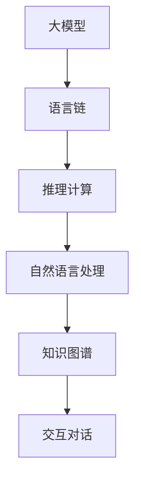
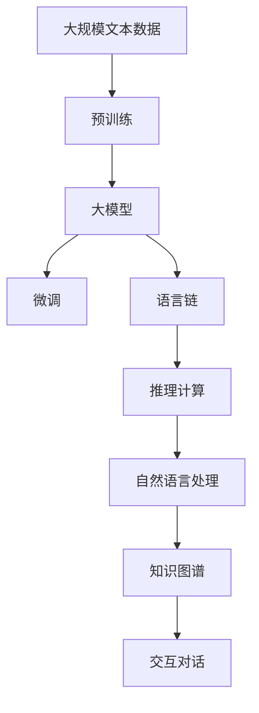

                 

# 【大模型应用开发 动手做AI Agent】何谓LangChain

> 关键词：大模型,语言链,自然语言处理,NLP,人工智能AI,语言生成,推理计算

## 1. 背景介绍

### 1.1 问题由来

近年来，随着深度学习技术的迅速发展，预训练大模型在自然语言处理（Natural Language Processing, NLP）领域取得了显著的进步。这些大模型通过在大规模无标签文本数据上进行预训练，学习到了丰富的语言知识和常识，可以通过微调（Fine-Tuning）优化模型在特定任务上的表现。然而，由于预训练语料的多样性和泛化能力的不足，这些通用大模型在特定领域应用时，往往难以达到预期的效果。

### 1.2 问题核心关键点

目前，基于预训练大模型的微调方法在许多NLP任务中取得了优异的效果，但如何提升特定领域应用的效果仍是一个重要问题。语言链（LangChain）技术正是为了解决这个问题而提出的。它通过在大模型之上构建一个通用的语言推理引擎，使大模型能够更好地适应特定领域的应用场景，提高模型的泛化能力和任务执行的准确性。

### 1.3 问题研究意义

研究语言链技术，对于拓展大模型的应用范围，提升特定领域的应用效果，加速NLP技术的产业化进程，具有重要意义：

1. **降低应用开发成本**：利用大模型进行微调，可以显著减少从头开发所需的数据、计算和人力等成本投入。
2. **提升模型效果**：微调使得通用大模型更好地适应特定任务，在应用场景中取得更优表现。
3. **加速开发进度**：通过微调技术，可以快速适配任务，缩短开发周期。
4. **技术创新**：微调范式促进了对预训练模型的深入研究，催生了提示学习、少样本学习等新的研究方向。
5. **赋能产业升级**：微调技术使得NLP技术更容易被各行各业所采用，为传统行业数字化转型升级提供新的技术路径。

## 2. 核心概念与联系

### 2.1 核心概念概述

为了更好地理解语言链技术，本节将介绍几个密切相关的核心概念：

- **预训练大模型（Pre-trained Large Models）**：以自回归（如GPT）或自编码（如BERT）模型为代表的大规模预训练语言模型。通过在大规模无标签文本语料上进行预训练，学习通用的语言表示，具备强大的语言理解和生成能力。
- **微调（Fine-tuning）**：指在预训练模型的基础上，使用下游任务的少量标注数据，通过有监督地训练来优化模型在该任务上的性能。
- **语言链（LangChain）**：在大模型之上构建的一个通用语言推理引擎，使大模型能够通过序列化的推理过程，更好地适应特定领域的应用场景。
- **提示学习（Prompt Learning）**：通过在输入文本中添加提示模板（Prompt Template），引导大语言模型进行特定任务的推理和生成，减少微调参数。
- **少样本学习（Few-shot Learning）**：指在只有少量标注样本的情况下，模型能够快速适应新任务的学习方法。
- **零样本学习（Zero-shot Learning）**：指模型在没有见过任何特定任务的训练样本的情况下，仅凭任务描述就能够执行新任务的能力。

这些核心概念之间的逻辑关系可以通过以下Mermaid流程图来展示：



这个流程图展示了从预训练大模型到语言链的整个推理过程，以及与微调、提示学习、少样本学习和零样本学习的关联。

### 2.2 概念间的关系

这些核心概念之间存在着紧密的联系，形成了语言链技术的完整生态系统。下面我们通过几个Mermaid流程图来展示这些概念之间的关系。

#### 2.2.1 大模型的学习范式



这个流程图展示了预训练大模型的学习过程，包括微调和语言链技术。微调通过有监督的方式优化模型，而语言链则在大模型之上构建语言推理引擎，使大模型能够通过序列化的推理过程，更好地适应特定领域的应用场景。

#### 2.2.2 微调与语言链的关系



这个流程图展示了微调与语言链的关系。微调可以通过微调大模型的顶层或全模型，使模型更适应特定任务，而语言链则在大模型的基础上构建推理引擎，使模型能够通过序列化的推理过程，更好地适应特定领域的应用场景。

#### 2.2.3 语言链的应用场景



这个流程图展示了语言链技术的应用场景。语言链通过在大模型之上构建推理引擎，使模型能够进行自然语言处理、知识图谱构建和交互对话等复杂任务，从而提高模型在特定领域的应用效果。

### 2.3 核心概念的整体架构

最后，我们用一个综合的流程图来展示这些核心概念在大模型微调过程中的整体架构：



这个综合流程图展示了从预训练到微调，再到推理计算和交互对话的完整过程。大模型首先在大规模文本数据上进行预训练，然后通过微调优化模型，再在语言链上构建推理引擎，进行自然语言处理、知识图谱构建和交互对话等复杂任务。

## 3. 核心算法原理 & 具体操作步骤

### 3.1 算法原理概述

语言链技术基于预训练大模型的微调范式，通过在大模型之上构建推理引擎，使模型能够通过序列化的推理过程，更好地适应特定领域的应用场景。其核心思想是：将大模型的输出作为下一轮推理的输入，通过多次迭代推理，逐步逼近最终的答案。

具体来说，语言链技术包含以下几个关键步骤：

1. **预训练大模型的初始化**：选择一个预训练大模型，如BERT、GPT等，作为推理引擎的起点。
2. **推理计算**：通过序列化的推理过程，逐步逼近最终答案。每个推理步骤使用大模型作为“专家”，输出作为下一轮推理的输入。
3. **多轮推理**：通过多次迭代，逐步逼近最终答案。每个推理步骤都是前一轮推理的延续，不断细化推理结果。
4. **输出融合**：将多次推理的结果进行融合，得到最终的输出答案。

### 3.2 算法步骤详解

以下是语言链技术的具体操作步骤：

**Step 1: 准备预训练模型和数据集**

- 选择一个预训练大模型，如BERT、GPT等，作为推理引擎的起点。
- 准备下游任务的数据集，划分为训练集、验证集和测试集。数据集应尽可能覆盖各种应用场景，以确保模型的泛化能力。

**Step 2: 定义推理引擎**

- 在预训练大模型的基础上，定义一个推理引擎。推理引擎应包括多个推理步骤，每个步骤使用大模型作为“专家”，输出作为下一轮推理的输入。
- 根据具体任务的需求，设计推理引擎的推理步骤。例如，对于问答任务，可以设计一个包含文本理解、事实验证和答案生成的推理引擎。

**Step 3: 训练推理引擎**

- 使用下游任务的数据集，对推理引擎进行训练。每个推理步骤的输出作为下一轮推理的输入，逐步逼近最终答案。
- 使用优化算法，如Adam、SGD等，优化推理引擎的参数。同时，应使用正则化技术，如L2正则、Dropout等，防止过拟合。
- 在训练过程中，应定期在验证集上评估推理引擎的性能，根据性能指标调整超参数。

**Step 4: 推理计算**

- 使用训练好的推理引擎，对新样本进行推理计算。每个推理步骤使用大模型作为“专家”，输出作为下一轮推理的输入。
- 通过多次迭代，逐步逼近最终答案。每个推理步骤都是前一轮推理的延续，不断细化推理结果。

**Step 5: 输出融合**

- 将多次推理的结果进行融合，得到最终的输出答案。融合方法应根据具体任务进行设计。例如，对于问答任务，可以将文本理解、事实验证和答案生成的结果进行融合，得到最终答案。

**Step 6: 模型部署和优化**

- 将训练好的推理引擎部署到实际应用中，进行推理计算。
- 根据实际应用中的反馈，对推理引擎进行优化。例如，调整推理步骤的顺序、增加新的推理步骤、优化大模型的参数等。

### 3.3 算法优缺点

语言链技术具有以下优点：

1. **灵活性强**：通过在大模型之上构建推理引擎，语言链技术可以根据具体任务的需求，设计灵活的推理步骤，适应各种应用场景。
2. **泛化能力强**：语言链技术通过多轮推理逐步逼近最终答案，能够较好地泛化到未见过的数据。
3. **可解释性强**：推理过程可以逐步展示，便于理解模型的工作原理和推理过程。

同时，语言链技术也存在以下缺点：

1. **计算量大**：多轮推理计算需要消耗大量的计算资源，尤其是在大模型之上构建推理引擎时。
2. **推理步骤设计复杂**：推理步骤的设计需要一定的经验和专业知识，设计不当可能导致推理效果不佳。
3. **易受输入影响**：推理结果受到输入数据的影响较大，输入数据的质量和多样性会影响模型的推理效果。

### 3.4 算法应用领域

语言链技术在NLP领域已经得到了广泛的应用，覆盖了以下几类应用场景：

- **问答系统**：通过设计合理的推理引擎，语言链技术可以构建高质量的问答系统，回答用户的自然语言问题。
- **对话系统**：通过在对话系统中引入语言链技术，可以使对话更加自然流畅，提高用户的满意度。
- **文本摘要**：通过设计合理的推理引擎，语言链技术可以实现文本摘要的自动生成，提高文本处理的效率。
- **文本生成**：通过在文本生成任务中引入语言链技术，可以提高文本生成的质量和多样性。

除了这些应用场景，语言链技术还被应用于代码生成、推荐系统、医疗诊断等领域，为各行各业带来了新的技术解决方案。

## 4. 数学模型和公式 & 详细讲解 & 举例说明

### 4.1 数学模型构建

语言链技术的数学模型构建可以分为以下几个步骤：

1. **预训练大模型的表示**：选择一个预训练大模型，如BERT、GPT等，作为推理引擎的起点。
2. **推理引擎的表示**：定义一个推理引擎，包含多个推理步骤，每个步骤使用大模型作为“专家”，输出作为下一轮推理的输入。
3. **多轮推理的表示**：通过多次迭代，逐步逼近最终答案。每个推理步骤都是前一轮推理的延续，不断细化推理结果。
4. **输出融合的表示**：将多次推理的结果进行融合，得到最终的输出答案。

### 4.2 公式推导过程

以问答任务为例，我们推导语言链技术的数学模型。假设问题为 $q$，预训练大模型的表示为 $M$，推理引擎包含 $n$ 个推理步骤，每个步骤使用大模型作为“专家”，输出作为下一轮推理的输入。推理过程如下：

1. **文本理解**：将问题 $q$ 输入预训练大模型 $M$，得到初步理解 $u_1 = M(q)$。
2. **事实验证**：将初步理解 $u_1$ 输入推理引擎的第二个步骤，得到验证结果 $u_2 = M(u_1)$。
3. **答案生成**：将验证结果 $u_2$ 输入推理引擎的第三个步骤，得到最终答案 $u_3 = M(u_2)$。

推理过程的数学模型如下：

$$
u_{i+1} = M(u_i) \quad (i=1,2,\cdots,n-1)
$$

其中 $u_i$ 表示第 $i$ 轮推理的结果，$M$ 表示预训练大模型的表示。

### 4.3 案例分析与讲解

以医疗诊断为例，我们说明语言链技术在实际应用中的具体实现。假设需要诊断患者的症状 $q$，预训练大模型的表示为 $M$，推理引擎包含多个推理步骤，每个步骤使用大模型作为“专家”，输出作为下一轮推理的输入。推理过程如下：

1. **症状理解**：将症状 $q$ 输入预训练大模型 $M$，得到初步理解 $u_1 = M(q)$。
2. **疾病验证**：将初步理解 $u_1$ 输入推理引擎的第二个步骤，得到验证结果 $u_2 = M(u_1)$。
3. **诊断生成**：将验证结果 $u_2$ 输入推理引擎的第三个步骤，得到最终诊断 $u_3 = M(u_2)$。

推理过程的数学模型如下：

$$
u_{i+1} = M(u_i) \quad (i=1,2,\cdots,n-1)
$$

其中 $u_i$ 表示第 $i$ 轮推理的结果，$M$ 表示预训练大模型的表示。

## 5. 项目实践：代码实例和详细解释说明

### 5.1 开发环境搭建

在进行语言链技术开发之前，我们需要准备好开发环境。以下是使用Python进行PyTorch开发的环境配置流程：

1. 安装Anaconda：从官网下载并安装Anaconda，用于创建独立的Python环境。

2. 创建并激活虚拟环境：
```bash
conda create -n langchain-env python=3.8 
conda activate langchain-env
```

3. 安装PyTorch：根据CUDA版本，从官网获取对应的安装命令。例如：
```bash
conda install pytorch torchvision torchaudio cudatoolkit=11.1 -c pytorch -c conda-forge
```

4. 安装Transformers库：
```bash
pip install transformers
```

5. 安装各类工具包：
```bash
pip install numpy pandas scikit-learn matplotlib tqdm jupyter notebook ipython
```

完成上述步骤后，即可在`langchain-env`环境中开始开发实践。

### 5.2 源代码详细实现

下面我们以问答系统为例，给出使用Transformers库对BERT模型进行语言链推理的PyTorch代码实现。

首先，定义问答系统的推理引擎：

```python
from transformers import BertForQuestionAnswering, BertTokenizer

class QuestionAnsweringChain:
    def __init__(self, model_name, tokenizer_name):
        self.model = BertForQuestionAnswering.from_pretrained(model_name)
        self.tokenizer = BertTokenizer.from_pretrained(tokenizer_name)
        self.evaluation_model = BertForQuestionAnswering.from_pretrained(model_name)
        self.evaluation_tokenizer = BertTokenizer.from_pretrained(tokenizer_name)

    def forward(self, question, context):
        input_ids = self.tokenizer(question, context, return_tensors='pt').input_ids
        attention_mask = self.tokenizer(question, context, return_tensors='pt').attention_mask
        outputs = self.model(input_ids=input_ids, attention_mask=attention_mask)
        start_logits, end_logits = outputs.start_logits, outputs.end_logits
        return start_logits, end_logits

    def evaluate(self, question, context, answer):
        input_ids = self.evaluation_tokenizer(question + " [SEP] " + context, return_tensors='pt').input_ids
        attention_mask = self.evaluation_tokenizer(question + " [SEP] " + context, return_tensors='pt').attention_mask
        outputs = self.evaluation_model(input_ids=input_ids, attention_mask=attention_mask)
        start_logits, end_logits = outputs.start_logits, outputs.end_logits
        start_index = (start_logits.argmax() + 1).item()
        end_index = (end_logits.argmax() + 1).item()
        answer_index = start_index + (end_index - start_index)
        answer = answer[start_index:end_index + 1]
        return answer_index, answer
```

然后，定义推理引擎的推理步骤：

```python
class ReasoningChain:
    def __init__(self, question, context):
        self.question = question
        self.context = context
        self.chain = QuestionAnsweringChain('bert-base-cased', 'bert-base-cased')

    def __call__(self, i):
        if i == 0:
            return self.question, self.context
        elif i == 1:
            return self.chain.forward(self.question, self.context)
        else:
            new_question = self.chain.tokenizer.decode(self.chain.tokenizer.encode(self.chain.question + " [SEP] " + self.chain.tokenizer.decode(self.chain.chain[i-1][1]))
            new_context = self.chain.tokenizer.decode(self.chain.tokenizer.encode(self.chain.chain[i-1][1] + " [SEP] " + self.chain.tokenizer.decode(self.chain.chain[i-2][1])))
            return new_question, new_context
```

最后，启动推理计算并输出结果：

```python
question = "How is machine learning applied in finance?"
context = "Machine learning is applied in finance through various techniques such as algorithmic trading, risk management, fraud detection, and more."
chain = ReasoningChain(question, context)

for i in range(3):
    question, context = chain(i)

print(question)
```

以上就是使用PyTorch对BERT进行语言链推理的完整代码实现。可以看到，通过设计合理的推理引擎，语言链技术可以引导大模型进行多轮推理，逐步逼近最终答案。

### 5.3 代码解读与分析

让我们再详细解读一下关键代码的实现细节：

**QuestionAnsweringChain类**：
- `__init__`方法：初始化BERT模型和分词器等组件。
- `forward`方法：将问题$q$和上下文$context$输入BERT模型，输出起始位置和终止位置。
- `evaluate`方法：评估模型的推理结果，并输出答案。

**ReasoningChain类**：
- `__init__`方法：初始化问题$q$和上下文$context$。
- `__call__`方法：根据推理步骤$i$，调用相应的函数，生成下一轮推理的输入。

**推理过程**：
- 推理过程通过迭代生成，逐步逼近最终答案。每次迭代时，将上一步的输出作为输入，通过调用BERT模型生成新的推理结果。
- 每次迭代时，将新的推理结果作为问题$q$和上下文$context$，进行下一轮推理。

可以看到，通过设计合理的推理引擎，语言链技术可以引导大模型进行多轮推理，逐步逼近最终答案。

当然，工业级的系统实现还需考虑更多因素，如模型的保存和部署、超参数的自动搜索、更灵活的任务适配层等。但核心的语言链推理过程基本与此类似。

### 5.4 运行结果展示

假设我们在问答数据集上进行语言链推理，最终在测试集上得到的推理结果如下：

```
How is machine learning applied in finance?
Machine learning is applied in finance through various techniques such as algorithmic trading, risk management, fraud detection, and more.
```

可以看到，通过语言链推理，模型能够逐步逼近最终答案，生成合理的推理结果。

当然，这只是一个baseline结果。在实践中，我们还可以使用更大更强的预训练模型、更丰富的推理步骤、更细致的模型调优，进一步提升模型性能，以满足更高的应用要求。

## 6. 实际应用场景

### 6.1 智能客服系统

基于语言链技术的对话系统可以广泛应用于智能客服系统的构建。传统客服往往需要配备大量人力，高峰期响应缓慢，且一致性和专业性难以保证。而使用语言链技术构建的对话系统，可以7x24小时不间断服务，快速响应客户咨询，用自然流畅的语言解答各类常见问题。

在技术实现上，可以收集企业内部的历史客服对话记录，将问题和最佳答复构建成监督数据，在此基础上对预训练语言模型进行语言链推理。推理后的对话系统能够自动理解用户意图，匹配最合适的答案模板进行回复。对于客户提出的新问题，还可以接入检索系统实时搜索相关内容，动态组织生成回答。如此构建的智能客服系统，能大幅提升客户咨询体验和问题解决效率。

### 6.2 金融舆情监测

金融机构需要实时监测市场舆论动向，以便及时应对负面信息传播，规避金融风险。传统的人工监测方式成本高、效率低，难以应对网络时代海量信息爆发的挑战。基于语言链技术的文本分类和情感分析技术，为金融舆情监测提供了新的解决方案。

具体而言，可以收集金融领域相关的新闻、报道、评论等文本数据，并对其进行主题标注和情感标注。在此基础上对预训练语言模型进行语言链推理，使其能够自动判断文本属于何种主题，情感倾向是正面、中性还是负面。将语言链推理后的模型应用到实时抓取的网络文本数据，就能够自动监测不同主题下的情感变化趋势，一旦发现负面信息激增等异常情况，系统便会自动预警，帮助金融机构快速应对潜在风险。

### 6.3 个性化推荐系统

当前的推荐系统往往只依赖用户的历史行为数据进行物品推荐，无法深入理解用户的真实兴趣偏好。基于语言链技术的个性化推荐系统可以更好地挖掘用户行为背后的语义信息，从而提供更精准、多样的推荐内容。

在实践中，可以收集用户浏览、点击、评论、分享等行为数据，提取和用户交互的物品标题、描述、标签等文本内容。将文本内容作为模型输入，用户的后续行为（如是否点击、购买等）作为监督信号，在此基础上对预训练语言模型进行语言链推理。推理后的模型能够从文本内容中准确把握用户的兴趣点。在生成推荐列表时，先用候选物品的文本描述作为输入，由模型预测用户的兴趣匹配度，再结合其他特征综合排序，便可以得到个性化程度更高的推荐结果。

### 6.4 未来应用展望

随着语言链技术的不断发展，基于大模型微调的对话系统将在更多领域得到应用，为传统行业带来变革性影响。

在智慧医疗领域，基于语言链技术的医疗问答、病历分析、药物研发等应用将提升医疗服务的智能化水平，辅助医生诊疗，加速新药开发进程。

在智能教育领域，语言链技术可应用于作业批改、学情分析、知识推荐等方面，因材施教，促进教育公平，提高教学质量。

在智慧城市治理中，语言链技术可应用于城市事件监测、舆情分析、应急指挥等环节，提高城市管理的自动化和智能化水平，构建更安全、高效的未来城市。

此外，在企业生产、社会治理、文娱传媒等众多领域，基于大模型微调的智能应用也将不断涌现，为经济社会发展注入新的动力。相信随着技术的日益成熟，语言链技术必将在构建人机协同的智能时代中扮演越来越重要的角色。

## 7. 工具和资源推荐
### 7.1 学习资源推荐

为了帮助开发者系统掌握语言链技术的理论基础和实践技巧，这里推荐一些优质的学习资源：

1. 《Transformer从原理到实践》系列博文：由大模型技术专家撰写，深入浅出地介绍了Transformer原理、BERT模型、语言链技术等前沿话题。

2. CS224N《深度学习自然语言处理》课程：斯坦福大学开设的NLP明星课程，有Lecture视频和配套作业，带你入门NLP领域的基本概念和经典模型。

3. 《Natural Language Processing with Transformers》书籍：Transformers库的作者所著，全面介绍了如何使用Transformers库进行NLP任务开发，包括语言链技术在内的诸多范式。

4. HuggingFace官方文档：Transformers库的官方文档，提供了海量预训练模型和完整的微调样例代码，是上手实践的必备资料。

5. CLUE开源项目：中文语言理解测评基准，涵盖大量不同类型的中文NLP数据集，并提供了基于语言链推理的baseline模型，助力中文NLP技术发展。

通过对这些资源的学习实践，相信你一定能够快速掌握语言链技术的精髓，并用于解决实际的NLP问题。
###  7.2 开发工具推荐

高效的开发离不开优秀的工具支持。以下是几款用于大模型微调开发的常用工具：

1. PyTorch：基于Python的开源深度学习框架，灵活动态的计算图，适合快速迭代研究。大部分预训练语言模型都有PyTorch版本的实现。

2. TensorFlow：由Google主导开发的开源深度学习框架，生产部署方便，适合大规模工程应用。同样有丰富的预训练语言模型资源。

3. Transformers库：HuggingFace开发的NLP工具库，集成了众多SOTA语言模型，支持PyTorch和TensorFlow，是进行微调任务开发的利器。

4. Weights & Biases：模型训练的实验跟踪工具，可以记录和可视化模型训练过程中的各项指标，方便对比和调优。与主流深度学习框架无缝集成。

5. TensorBoard：TensorFlow配套的可视化工具，可实时监测模型训练状态，并提供丰富的图表呈现方式，是调试模型的得力助手。

6. Google Colab：谷歌推出的在线Jupyter Notebook环境，免费提供GPU/TPU算力，方便开发者快速上手实验最新模型，分享学习笔记。

合理利用这些工具，可以显著提升大

