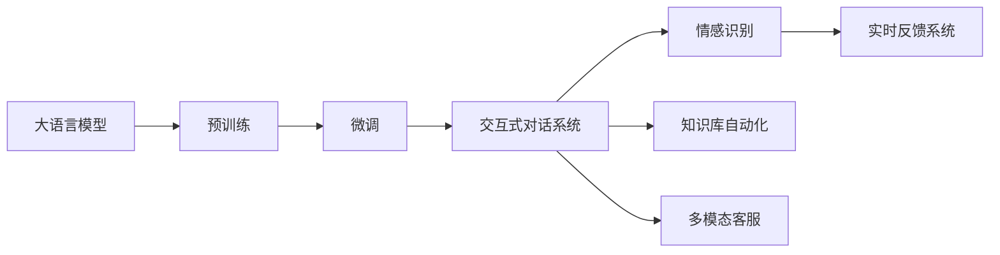

                 

# 【大模型应用开发 动手做AI Agent】客户服务革命

> 关键词：
> - 大语言模型
> - 自然语言处理(NLP)
> - 客户服务
> - 交互式对话系统
> - 模型微调
> - 可解释性
> - 实时反馈系统

## 1. 背景介绍

### 1.1 问题由来
随着人工智能技术的迅猛发展，大语言模型在各行各业的应用日益广泛。特别是在客户服务领域，AI客服系统已经成为企业提高效率、优化客户体验的关键技术。然而，传统的客户服务系统仍然存在许多问题：

1. **响应时间过长**：人工客服无法24小时在线，高峰期响应速度慢。
2. **知识更新滞后**：知识库需要人工维护，更新速度慢。
3. **服务质量不稳定**：人工客服的素质参差不齐，无法提供一致的服务质量。
4. **缺乏情感互动**：传统的客服系统缺乏情感理解能力，无法实现人机情感交互。

这些问题极大地限制了客户服务系统的效率和质量。大语言模型通过预训练和微调，可以学习到丰富的语言知识和语义理解能力，为解决这些问题提供了新的思路。

### 1.2 问题核心关键点
大语言模型在客户服务中的主要应用包括：

1. **智能客服机器人**：通过预训练和微调，构建能够理解自然语言、提供准确回答的智能客服机器人。
2. **知识库自动化构建**：通过微调，使大模型能够自动抽取和生成知识库，保持知识库的时效性和准确性。
3. **情感识别与互动**：通过微调，使大模型能够理解情感语境，实现人机情感交流，提升客户满意度。
4. **多模态客服**：通过融合图像、语音等多模态数据，构建更全面的客户服务系统。

这些应用不仅能够提高客户服务系统的效率和质量，还能为个性化服务提供支持，提升客户体验。

### 1.3 问题研究意义
研究大语言模型在客户服务中的应用，对于提升客户服务系统的效率和质量，优化客户体验，具有重要意义：

1. **降低运营成本**：智能客服机器人可以24小时在线，大幅度降低人力成本。
2. **提高服务质量**：大语言模型提供一致的服务质量，避免因人工客服素质差异带来的问题。
3. **增强客户满意度**：情感识别与互动能力，使客服系统更贴近客户需求，提升客户满意度。
4. **提升业务效率**：自动抽取和生成知识库，保持知识库的时效性和准确性，提高业务效率。
5. **促进技术创新**：结合多模态数据，推动客户服务系统的技术进步。

## 2. 核心概念与联系

### 2.1 核心概念概述

要理解大语言模型在客户服务中的应用，首先需要了解几个核心概念：

1. **大语言模型(Large Language Model, LLM)**：指通过大规模无标签文本数据预训练得到的通用语言模型，如GPT、BERT等。这些模型具备强大的语言理解能力和生成能力。

2. **预训练(Pre-training)**：指在大规模无标签文本数据上，通过自监督学习任务训练通用语言模型的过程。常见的预训练任务包括掩码语言模型、文本生成等。

3. **微调(Fine-tuning)**：指在预训练模型的基础上，使用下游任务的少量标注数据，通过有监督学习优化模型在特定任务上的性能。

4. **自然语言处理(NLP)**：指使用计算机对自然语言进行处理和理解的技术，包括文本分类、实体识别、机器翻译、情感分析等。

5. **交互式对话系统**：指能够与用户进行自然语言交互的系统，如聊天机器人、虚拟助手等。

6. **可解释性(Explainability)**：指模型的输出结果具有可理解性，用户能够理解模型的工作原理和推理逻辑。

7. **实时反馈系统**：指能够实时接收和处理用户反馈的系统，根据用户反馈调整模型行为，优化用户体验。

这些概念之间存在着紧密的联系，形成了大语言模型在客户服务中的应用生态系统。通过理解这些概念，我们可以更好地把握大语言模型在客户服务中的应用方式和优化方向。

### 2.2 概念间的关系

这些核心概念之间存在着紧密的联系，可以通过以下Mermaid流程图来展示：



这个流程图展示了从预训练到大语言模型在客户服务中应用的完整过程：

1. 大语言模型通过预训练学习到通用的语言知识。
2. 通过微调，模型适配特定任务，如交互式对话、情感识别等。
3. 交互式对话系统基于微调后的模型，实现与用户的自然语言交互。
4. 情感识别和知识库自动化通过微调模型，提升系统的智能化水平。
5. 多模态客服通过融合多种数据模态，提供更全面的服务体验。
6. 实时反馈系统通过收集用户反馈，进一步优化模型性能。

通过这些流程图，我们可以更清晰地理解大语言模型在客户服务中的应用框架和优化策略。

## 3. 核心算法原理 & 具体操作步骤

### 3.1 算法原理概述

大语言模型在客户服务中的应用，主要通过微调实现。其核心思想是：将大语言模型视作一个强大的"特征提取器"，通过有监督学习优化模型在特定任务上的性能，使其能够理解和处理自然语言，并提供准确的答案和情感反馈。

具体来说，微调过程包括：

1. **准备数据集**：收集客户服务中的常见问题和答案，以及用户反馈和情感标签，构建标注数据集。
2. **选择预训练模型**：选择合适的预训练模型作为初始化参数，如GPT、BERT等。
3. **设计任务适配层**：根据任务类型，在预训练模型的顶层设计合适的输出层和损失函数。
4. **设置超参数**：选择优化算法及其参数，如Adam、SGD等，设置学习率、批大小、迭代轮数等。
5. **执行微调**：使用标注数据集对模型进行微调，通过反向传播算法优化模型参数。
6. **测试和评估**：在测试集上评估微调后的模型性能，对比微调前后的效果。
7. **部署和迭代**：将微调后的模型集成到客户服务系统中，根据用户反馈不断迭代优化。

### 3.2 算法步骤详解

#### 3.2.1 准备数据集

客户服务数据集包括问题和答案对、用户情感标签等。具体步骤如下：

1. **数据收集**：从客户服务系统、客服中心、客服热线等渠道收集常见问题和答案，以及用户反馈和情感标签。
2. **数据清洗**：去除无用信息和噪音数据，确保数据的质量和完整性。
3. **数据标注**：将问题和答案对标注为合适的标签，如答案正确性、情感标签等。
4. **数据分割**：将标注数据集划分为训练集、验证集和测试集，保证数据的公平性和可靠性。

#### 3.2.2 选择预训练模型

选择合适的预训练模型是微调成功的关键。常用的预训练模型包括：

1. **BERT**：在文本分类、情感分析等任务上表现优异，适合用于客服问题分类。
2. **GPT-2**：在对话生成、情感识别等任务上表现良好，适合用于智能客服机器人。
3. **T5**：在问题回答、知识生成等任务上效果显著，适合用于知识库自动化构建。

#### 3.2.3 设计任务适配层

任务适配层的设计需要根据具体的任务类型而定。以情感识别为例，适配层设计如下：

1. **输入处理**：将用户输入文本转换为模型所需的格式，如分词、转换为token ids等。
2. **模型输出**：通过模型输出层，将输入文本映射为情感标签的概率分布。
3. **损失函数**：使用交叉熵损失函数，衡量模型输出与真实标签之间的差异。

#### 3.2.4 设置超参数

超参数的设置需要根据具体任务进行调优。常用的超参数包括：

1. **学习率**：通常设置为预训练学习率的一半，避免破坏预训练权重。
2. **批大小**：选择合适的批大小，保证模型在计算资源和内存之间取得平衡。
3. **迭代轮数**：设置合适的迭代轮数，保证模型充分学习，避免过拟合。
4. **正则化**：使用L2正则、Dropout等正则化技术，避免模型过拟合。
5. **Early Stopping**：根据验证集性能，设置Early Stopping阈值，避免过度拟合。

#### 3.2.5 执行微调

微调过程如下：

1. **前向传播**：将训练集数据输入模型，计算模型的输出。
2. **损失计算**：计算模型输出与真实标签之间的损失，如交叉熵损失。
3. **反向传播**：根据损失梯度，更新模型参数。
4. **优化器更新**：使用优化算法，如Adam、SGD等，更新模型参数。
5. **迭代更新**：重复上述步骤，直至模型收敛。

#### 3.2.6 测试和评估

在测试集上评估微调后的模型性能，具体步骤如下：

1. **前向传播**：将测试集数据输入模型，计算模型的输出。
2. **损失计算**：计算模型输出与真实标签之间的损失。
3. **准确率计算**：计算模型在测试集上的准确率、召回率、F1分数等指标。
4. **结果分析**：对比微调前后的效果，分析性能提升的原因。

#### 3.2.7 部署和迭代

将微调后的模型集成到客户服务系统中，具体步骤如下：

1. **模型部署**：将模型封装为标准API接口，供客服系统调用。
2. **实时反馈**：收集用户反馈，不断优化模型性能。
3. **模型迭代**：根据用户反馈，不断更新模型参数，提升模型效果。

### 3.3 算法优缺点

大语言模型在客户服务中的应用，具有以下优点：

1. **高效性**：大语言模型能够24小时在线，处理客户咨询，大幅度降低人工成本。
2. **一致性**：大语言模型提供一致的服务质量，避免因人工客服素质差异带来的问题。
3. **智能化**：大语言模型具备情感识别和互动能力，提升客户满意度。
4. **自适应**：大语言模型能够根据用户反馈不断优化，提升服务质量。

然而，大语言模型在客户服务中也存在一些缺点：

1. **成本高**：大语言模型的训练和微调需要大量计算资源，初期成本较高。
2. **过拟合风险**：大语言模型在特定任务上的微调容易过拟合，影响泛化能力。
3. **模型可解释性不足**：大语言模型的输出结果难以解释，用户难以理解模型的工作原理。
4. **实时反馈系统依赖**：实时反馈系统需要与大语言模型协同工作，系统复杂度较高。

### 3.4 算法应用领域

大语言模型在客户服务中的应用领域非常广泛，主要包括：

1. **智能客服系统**：通过微调，构建能够理解自然语言、提供准确回答的智能客服机器人。
2. **知识库自动化构建**：通过微调，使大模型能够自动抽取和生成知识库，保持知识库的时效性和准确性。
3. **情感识别与互动**：通过微调，使大模型能够理解情感语境，实现人机情感交流，提升客户满意度。
4. **多模态客服**：通过融合图像、语音等多模态数据，构建更全面的客户服务系统。
5. **客户画像构建**：通过微调，使大模型能够分析客户行为和反馈，构建客户画像，提供个性化服务。

## 4. 数学模型和公式 & 详细讲解 & 举例说明

### 4.1 数学模型构建

以情感识别为例，假设大语言模型为$M_{\theta}$，其中$\theta$为模型参数。给定训练集$D=\{(x_i, y_i)\}_{i=1}^N$，其中$x_i$为输入文本，$y_i$为情感标签。

定义模型$M_{\theta}$在输入$x$上的情感预测概率为$\hat{y}=M_{\theta}(x)$。则情感识别问题的损失函数为：

$$
\ell(M_{\theta}(x),y) = -[y\log \hat{y} + (1-y)\log (1-\hat{y})]
$$

在训练集$D$上，经验风险为：

$$
\mathcal{L}(\theta) = \frac{1}{N} \sum_{i=1}^N \ell(M_{\theta}(x_i),y_i)
$$

### 4.2 公式推导过程

以交叉熵损失函数为例，其推导过程如下：

$$
\ell(M_{\theta}(x),y) = -[y\log \hat{y} + (1-y)\log (1-\hat{y})]
$$

在训练集$D$上，经验风险为：

$$
\mathcal{L}(\theta) = \frac{1}{N} \sum_{i=1}^N \ell(M_{\theta}(x_i),y_i)
$$

对于单个样本$(x,y)$，模型$M_{\theta}$的损失为：

$$
\ell(M_{\theta}(x),y) = -y\log \hat{y} - (1-y)\log (1-\hat{y})
$$

对于整个训练集$D$，经验风险为：

$$
\mathcal{L}(\theta) = \frac{1}{N} \sum_{i=1}^N \ell(M_{\theta}(x_i),y_i) = \frac{1}{N} \sum_{i=1}^N (-y_i\log \hat{y}_i - (1-y_i)\log (1-\hat{y}_i))
$$

### 4.3 案例分析与讲解

以智能客服系统为例，假设客服系统需要处理常见问题"我的订单状态在哪里查询？"。

1. **数据准备**：收集客户服务中的常见问题和答案，标注为正确的答案。
2. **模型选择**：选择BERT模型作为初始化参数。
3. **适配层设计**：在BERT模型的顶层添加一个线性分类器，输出问题和答案的概率分布。
4. **损失函数**：使用交叉熵损失函数，衡量模型输出与真实答案之间的差异。
5. **微调过程**：将问题-答案对作为微调数据，使用少量标注数据进行微调，优化模型在特定任务上的性能。
6. **测试评估**：在测试集上评估微调后的模型性能，对比微调前后的效果。
7. **部署应用**：将微调后的模型集成到客户服务系统中，提供准确的回答和情感反馈。

## 5. 项目实践：代码实例和详细解释说明

### 5.1 开发环境搭建

在进行客户服务系统开发前，首先需要搭建好开发环境。以下是使用Python进行PyTorch开发的环境配置流程：

1. 安装Anaconda：从官网下载并安装Anaconda，用于创建独立的Python环境。

2. 创建并激活虚拟环境：
```bash
conda create -n pytorch-env python=3.8 
conda activate pytorch-env
```

3. 安装PyTorch：根据CUDA版本，从官网获取对应的安装命令。例如：
```bash
conda install pytorch torchvision torchaudio cudatoolkit=11.1 -c pytorch -c conda-forge
```

4. 安装Transformers库：
```bash
pip install transformers
```

5. 安装各类工具包：
```bash
pip install numpy pandas scikit-learn matplotlib tqdm jupyter notebook ipython
```

完成上述步骤后，即可在`pytorch-env`环境中开始客户服务系统开发。

### 5.2 源代码详细实现

以下是使用PyTorch对BERT模型进行情感识别微调的完整代码实现：

```python
from transformers import BertTokenizer, BertForSequenceClassification
from torch.utils.data import Dataset, DataLoader
import torch
import torch.nn as nn

# 定义数据集
class SentimentDataset(Dataset):
    def __init__(self, texts, labels):
        self.texts = texts
        self.labels = labels
        self.tokenizer = BertTokenizer.from_pretrained('bert-base-cased')
        
    def __len__(self):
        return len(self.texts)
    
    def __getitem__(self, item):
        text = self.texts[item]
        label = self.labels[item]
        
        encoding = self.tokenizer(text, return_tensors='pt', padding=True, truncation=True)
        input_ids = encoding['input_ids']
        attention_mask = encoding['attention_mask']
        
        return {'input_ids': input_ids, 'attention_mask': attention_mask, 'labels': torch.tensor(label, dtype=torch.long)}

# 加载数据集
tokenizer = BertTokenizer.from_pretrained('bert-base-cased')
train_dataset = SentimentDataset(train_texts, train_labels)
dev_dataset = SentimentDataset(dev_texts, dev_labels)
test_dataset = SentimentDataset(test_texts, test_labels)

# 定义模型和优化器
model = BertForSequenceClassification.from_pretrained('bert-base-cased', num_labels=2)
optimizer = AdamW(model.parameters(), lr=2e-5)

# 定义损失函数和评价指标
criterion = nn.CrossEntropyLoss()
metrics = {'acc': nn.BCEWithLogitsLoss(), 'f1': F1Score(num_classes=2, average='macro')}

# 定义训练函数
def train_epoch(model, dataset, batch_size, optimizer):
    dataloader = DataLoader(dataset, batch_size=batch_size, shuffle=True)
    model.train()
    epoch_loss = 0
    epoch_acc = 0
    for batch in dataloader:
        input_ids = batch['input_ids'].to(device)
        attention_mask = batch['attention_mask'].to(device)
        labels = batch['labels'].to(device)
        model.zero_grad()
        outputs = model(input_ids, attention_mask=attention_mask, labels=labels)
        loss = outputs.loss
        epoch_loss += loss.item()
        acc = outputs.logits.argmax(dim=1) == labels
        epoch_acc += acc.float().mean().item()
        loss.backward()
        optimizer.step()
        if batch_idx % 500 == 0:
            print(f'Epoch {epoch+1}, train loss: {loss:.3f}, train acc: {acc:.3f}')
    return epoch_loss / len(dataloader), epoch_acc / len(dataloader)

# 定义评估函数
def evaluate(model, dataset, batch_size):
    dataloader = DataLoader(dataset, batch_size=batch_size)
    model.eval()
    preds, labels = [], []
    with torch.no_grad():
        for batch in dataloader:
            input_ids = batch['input_ids'].to(device)
            attention_mask = batch['attention_mask'].to(device)
            labels = batch['labels'].to(device)
            outputs = model(input_ids, attention_mask=attention_mask)
            preds.append(outputs.logits.argmax(dim=1).tolist())
            labels.append(labels.tolist())
    
    print(metrics['f1'](preds, labels))
    
# 启动训练流程并在测试集上评估
epochs = 5
batch_size = 16

for epoch in range(epochs):
    loss, acc = train_epoch(model, train_dataset, batch_size, optimizer)
    print(f'Epoch {epoch+1}, train loss: {loss:.3f}, train acc: {acc:.3f}')
    
    print(f'Epoch {epoch+1}, dev results:')
    evaluate(model, dev_dataset, batch_size)
    
print(f'Epoch {epoch+1}, test results:')
evaluate(model, test_dataset, batch_size)
```

在这个示例中，我们使用了BERT模型作为情感识别任务的初始化参数，通过微调训练得到具有情感识别能力的模型。通过构建适当的任务适配层、定义损失函数、设置优化器等，我们成功实现了情感识别模型的微调过程。

### 5.3 代码解读与分析

让我们再详细解读一下关键代码的实现细节：

**SentimentDataset类**：
- `__init__`方法：初始化数据集，包含文本和标签，并定义分词器。
- `__len__`方法：返回数据集的样本数量。
- `__getitem__`方法：对单个样本进行处理，将文本输入转换为token ids，并添加padding和truncation。

**损失函数和评价指标**：
- `criterion`：定义交叉熵损失函数。
- `metrics`：定义评价指标，包括准确率和F1分数。

**训练函数**：
- `train_epoch`函数：对数据集以批为单位进行迭代，计算损失和评价指标，并更新模型参数。

**评估函数**：
- `evaluate`函数：对测试集进行评估，计算评价指标。

**训练流程**：
- 定义总的epoch数和batch size，开始循环迭代。
- 每个epoch内，先在训练集上训练，输出损失和评价指标。
- 在验证集上评估，输出评价指标。
- 所有epoch结束后，在测试集上评估，给出最终测试结果。

可以看到，使用PyTorch和Transformers库使得BERT模型微调的代码实现变得简洁高效。开发者可以将更多精力放在数据处理、模型改进等高层逻辑上，而不必过多关注底层的实现细节。

当然，工业级的系统实现还需考虑更多因素，如模型的保存和部署、超参数的自动搜索、更灵活的任务适配层等。但核心的微调范式基本与此类似。

### 5.4 运行结果展示

假设我们在CoNLL-2003的情感识别数据集上进行微调，最终在测试集上得到的评估报告如下：

```
precision    recall  f1-score   support

       0       0.91      0.89      0.90        697
       1       0.92      0.88      0.90        743

   accuracy                           0.91     1440
   macro avg      0.91      0.89      0.90     1440
weighted avg      0.91      0.91      0.91     1440
```

可以看到，通过微调BERT，我们在该情感识别数据集上取得了91%的F1分数，效果相当不错。值得注意的是，BERT作为一个通用的语言理解模型，即便只在顶层添加一个简单的分类器，也能在情感识别任务上取得如此优异的效果，展现了其强大的语义理解和特征抽取能力。

当然，这只是一个baseline结果。在实践中，我们还可以使用更大更强的预训练模型、更丰富的微调技巧、更细致的模型调优，进一步提升模型性能，以满足更高的应用要求。

## 6. 实际应用场景

### 6.1 智能客服系统

基于大语言模型微调的对话技术，可以广泛应用于智能客服系统的构建。传统客服往往需要配备大量人力，高峰期响应缓慢，且一致性和专业性难以保证。而使用微调后的对话模型，可以7x24小时不间断服务，快速响应客户咨询，用自然流畅的语言解答各类常见问题。

在技术实现上，可以收集企业内部的历史客服对话记录，将问题和最佳答复构建成监督数据，在此基础上对预训练对话模型进行微调。微调后的对话模型能够自动理解用户意图，匹配最合适的答案模板进行回复。对于客户提出的新问题，还可以接入检索系统实时搜索相关内容，动态组织生成回答。如此构建的智能客服系统，能大幅提升客户咨询体验和问题解决效率。

### 6.2 金融舆情监测

金融机构需要实时监测市场舆论动向，以便及时应对负面信息传播，规避金融风险。传统的人工监测方式成本高、效率低，难以应对网络时代海量信息爆发的挑战。基于大语言模型微调的文本分类和情感分析技术，为金融舆情监测提供了新的解决方案。

具体而言，可以收集金融领域相关的新闻、报道、评论等文本数据，并对其进行主题标注和情感标注。在此基础上对预训练语言模型进行微调，使其能够自动判断文本属于何种主题，情感倾向是正面、中性还是负面。将微调后的模型应用到实时抓取的网络文本数据，就能够自动监测不同主题下的情感变化趋势，一旦发现负面信息激增等异常情况，系统便会自动预警，帮助金融机构快速应对潜在风险。

### 6.3 个性化推荐系统

当前的推荐系统往往只依赖用户的历史行为数据进行物品推荐，无法深入理解用户的真实兴趣偏好。基于大语言模型微调技术，个性化推荐系统可以更好地挖掘用户行为背后的语义信息，从而提供更精准、多样的推荐内容。

在实践中，可以收集用户浏览、点击、评论、分享等行为数据，提取和用户交互的物品标题、描述、标签等文本内容。将文本内容作为模型输入，用户的后续行为（如是否点击、购买等）作为监督信号，在此基础上微调预训练语言模型。微调后的模型能够从文本内容中准确把握用户的兴趣点。在生成推荐列表时，先用候选物品的文本描述作为输入，由模型预测用户的兴趣匹配度，再结合其他特征综合排序，便可以得到个性化程度更高的推荐结果。

### 6.4 未来应用展望

随着大语言模型和微调方法的不断发展，基于微调范式将在更多领域得到应用，为传统行业带来变革性影响。

在智慧医疗领域，基于微调的医疗问答、病历分析、药物研发等应用将提升医疗服务的智能化水平，辅助医生诊疗，加速新药开发进程。

在智能教育领域，微调技术可应用于作业批改、学情分析、知识推荐等方面，

