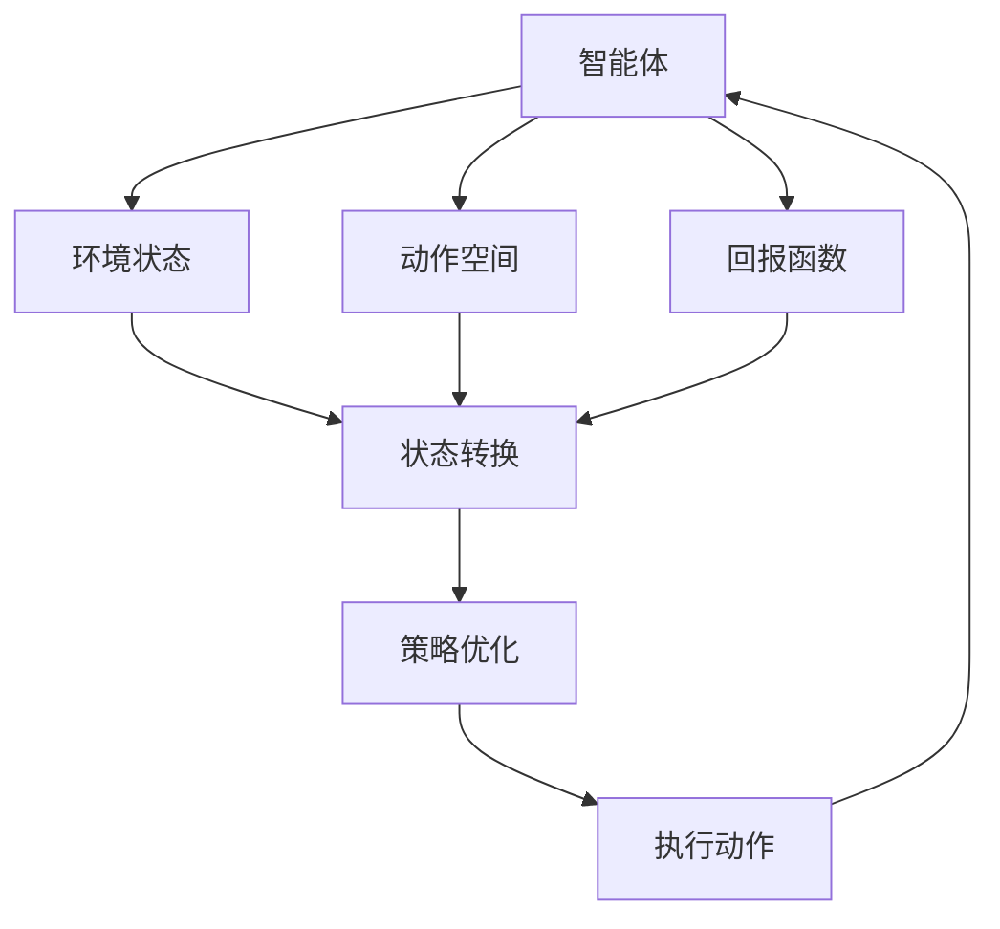
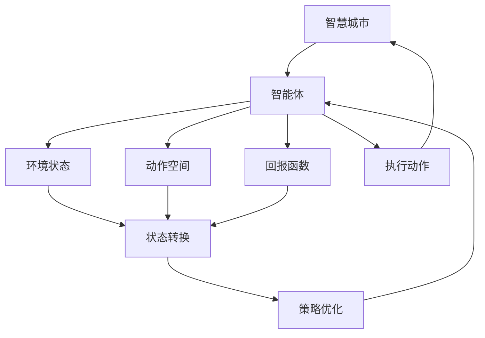

                 

## 1. 背景介绍

在智慧城市的建设过程中，为了实现高效的城市管理和智能交通系统，研究人员和企业正在寻找能够自动学习和适应的技术。其中，深度强化学习（Deep Reinforcement Learning, DRL）方法，特别是基于DQN（Deep Q-Networks）的强化学习框架，已经在交通管理、能源调度等多个领域展示了其巨大的潜力。DQN能够通过不断学习与环境交互，自主优化决策，为智慧城市提供智能的解决方案。

### 1.1 问题由来

随着城市化的推进，交通拥堵、能源浪费、环境污染等问题逐渐凸显。传统的基于规则和经验的管理方式无法满足日益增长的智能需求。DQN作为深度学习与强化学习的结合体，通过模拟与城市环境的互动，能够自主优化策略，提供智能决策支持。

### 1.2 问题核心关键点

DQN的核心在于将城市中的各项管理任务抽象为环境状态，将城市决策者角色转化为智能体，通过与环境的互动，学习最优策略。其核心算法包括Q-learning、深度神经网络、经验回放等，能够在大数据背景下，自动进行策略学习与优化，极大地提高了决策效率和精准度。

### 1.3 问题研究意义

研究DQN在智慧城市中的应用，对于推动智慧城市的智能化、自动化、精细化管理具有重要意义。它能够提升城市交通、能源、环境等多方面的管理水平，实现城市资源的最优配置和高效运营，提升市民的生活质量。

## 2. 核心概念与联系

### 2.1 核心概念概述

为了更好地理解DQN在智慧城市中的应用，本节将介绍几个核心概念：

- **深度强化学习（DRL）**：深度学习与强化学习的结合体，通过智能体与环境的互动，自主学习最优策略。
- **DQN**：一种深度神经网络与Q-learning结合的强化学习算法，能够自动进行策略学习与优化。
- **环境状态**：智慧城市中的各种元素和现象，如交通流量、能源消耗、环境质量等。
- **智能体**：智慧城市中的决策者，通过DQN学习最优策略。
- **动作空间**：智能体可以采取的策略空间，如交通灯控制、能源调度等。
- **回报函数**：衡量智能体决策成功与否的指标，如减少交通拥堵、降低能源消耗等。

这些核心概念之间通过DQN算法紧密联系，共同构成了一个智能城市管理系统。通过DQN算法，智能体能够根据当前环境状态，自主选择最优策略，实现智慧城市中的自主管理。

### 2.2 概念间的关系

这些核心概念之间的关系可以通过以下Mermaid流程图来展示：



这个流程图展示了大语言模型微调过程中各个核心概念的关系：

1. 智能体通过与环境状态（如交通流量、能源消耗）的互动，学习最优策略。
2. 智能体在动作空间中，可以采取的策略空间（如交通灯控制、能源调度）。
3. 回报函数衡量智能体决策成功与否的指标。
4. 环境状态不断变化，智能体需要根据新状态调整策略。
5. 策略优化过程不断迭代，最终实现最优策略。
6. 执行最优策略，反馈至环境，进入下一轮循环。

### 2.3 核心概念的整体架构

最后，我们用一个综合的流程图来展示这些核心概念在大语言模型微调过程中的整体架构：



这个综合流程图展示了从智慧城市到智能体的交互过程，以及DQN算法在大语言模型微调中的实现。智能体通过与环境状态的互动，学习最优策略，并根据策略执行动作，调整环境状态，进入下一轮循环。

## 3. 核心算法原理 & 具体操作步骤
### 3.1 算法原理概述

DQN算法基于Q-learning，通过深度神经网络逼近Q函数，实现对策略的逼近与优化。在智慧城市管理中，DQN算法通过模拟与城市环境的互动，自主学习最优策略，实现决策优化。

具体来说，DQN算法包含以下几个关键步骤：

1. 环境状态初始化。
2. 智能体采取动作，观察环境状态，获得回报。
3. 使用神经网络逼近Q函数，计算动作值。
4. 使用经验回放，存储经验数据。
5. 更新神经网络参数，最小化目标Q值与动作值之差的均方误差。

这些步骤共同构成了一个DQN算法的执行流程，通过不断迭代，智能体能够学习到最优策略。

### 3.2 算法步骤详解

以下我们详细介绍DQN算法的具体执行步骤：

**Step 1: 环境状态初始化**

在智能体进入智慧城市环境时，首先需要初始化环境状态。环境状态可以包括交通流量、能源消耗、环境质量等。例如，交通流量可以通过传感器获取实时数据，能源消耗可以查询能源消耗数据库，环境质量可以调用环境监测设备。

**Step 2: 采取动作**

智能体根据当前环境状态，采取行动。在智慧城市管理中，动作空间可以是交通灯控制、能源调度等。例如，交通灯控制可以采取红绿灯切换、交通流调整等策略；能源调度可以采取负载均衡、能源转换等策略。

**Step 3: 观察环境状态与获得回报**

采取动作后，智能体观察环境状态的变化，并根据回报函数计算回报值。回报函数可以定义为交通流畅度、能源消耗量、环境质量等指标的函数。例如，交通流畅度可以通过交通流量和堵塞情况计算得到；能源消耗量可以通过能源消耗量和设备状态计算得到；环境质量可以通过污染物浓度和环境监测设备反馈计算得到。

**Step 4: 逼近Q函数**

使用深度神经网络逼近Q函数，计算动作值。Q函数可以定义为智能体采取某一策略，在当前环境状态下，获得某一动作的最大回报。例如，在交通灯控制中，Q函数可以定义为：
$$
Q(s,a) = \max_{a'}(r + \gamma Q(s',a'))
$$
其中，$s$ 为当前环境状态，$a$ 为采取的动作，$s'$ 为下一状态，$r$ 为当前回报，$\gamma$ 为折扣因子。

**Step 5: 经验回放**

将智能体采取动作、观察环境状态和获得回报的体验数据，存储到经验缓冲区中。这些数据可以用于后续神经网络的训练。例如，可以将交通灯控制的数据、能源调度的数据等存储到缓冲区中，用于神经网络的训练。

**Step 6: 更新神经网络参数**

使用神经网络逼近Q函数，更新神经网络参数。最小化目标Q值与动作值之差的均方误差，更新神经网络权重。例如，可以使用反向传播算法，根据目标Q值与动作值之差的均方误差，更新神经网络的权重。

这些步骤通过不断迭代，智能体能够学习到最优策略，实现智慧城市中的自主管理。

### 3.3 算法优缺点

DQN算法在智慧城市管理中的应用，具有以下优点：

1. 自主学习。DQN能够自动学习最优策略，无需人工干预，适应性强。
2. 适应性强。DQN能够根据环境状态的变化，自主调整策略，灵活性高。
3. 可扩展性强。DQN能够应用于多种智慧城市管理任务，如交通管理、能源调度等。

同时，DQN算法也存在以下缺点：

1. 样本效率低。DQN算法需要大量的经验数据进行训练，样本效率较低。
2. 网络过拟合。深度神经网络容易出现过拟合现象，需要合理设置超参数。
3. 无法处理复杂决策。DQN算法难以处理复杂的多目标决策问题。

尽管存在这些局限性，但DQN算法在智慧城市管理中的应用前景仍然广阔，随着技术的发展和优化，其缺点有望逐步得到克服。

### 3.4 算法应用领域

DQN算法已经在智慧城市管理中的多个领域得到了应用，具体包括：

- 交通管理：通过智能体学习交通灯控制策略，优化交通流量，减少拥堵。
- 能源调度：通过智能体学习能源调度策略，优化能源分配，降低能源消耗。
- 环境监测：通过智能体学习环境监测策略，优化环境质量，提升市民生活质量。
- 垃圾处理：通过智能体学习垃圾处理策略，优化垃圾处理流程，提升垃圾处理效率。
- 医疗管理：通过智能体学习医疗资源调度策略，优化医疗资源分配，提升医疗服务水平。

以上应用展示了DQN算法的广泛适用性，未来有望在更多领域得到应用。

## 4. 数学模型和公式 & 详细讲解 & 举例说明

### 4.1 数学模型构建

在DQN算法中，数学模型主要涉及以下几个方面：

- **状态空间**：智慧城市中的各项管理任务，如交通流量、能源消耗、环境质量等。
- **动作空间**：智能体可以采取的策略空间，如交通灯控制、能源调度等。
- **回报函数**：衡量智能体决策成功与否的指标，如减少交通拥堵、降低能源消耗等。
- **Q函数**：智能体在当前状态下，采取某一策略，获得某一动作的最大回报。

具体来说，DQN算法的数学模型可以表示为：

1. 环境状态$s_t$和动作$a_t$的分布$p(s_t, a_t)$。
2. 智能体采取动作$a_t$后，观察环境状态$s_{t+1}$。
3. 智能体获得回报$r_{t+1}$。
4. 智能体的回报函数$Q(s_t, a_t)$。
5. 智能体采取动作$a_t$的期望回报$Q'(s_{t+1})$。

### 4.2 公式推导过程

以下我们以交通流量管理为例，推导DQN算法的数学公式。

**Step 1: 定义状态空间**

假设当前交通流量状态为$s_t = (s_{t1}, s_{t2}, s_{t3})$，其中$s_{t1}$为道路1的交通流量，$s_{t2}$为道路2的交通流量，$s_{t3}$为道路3的交通流量。

**Step 2: 定义动作空间**

假设智能体可以采取的策略为$a_t = (a_{tl}, a_{t2}, a_{t3})$，其中$a_{tl}$为道路1的交通灯状态，$a_{t2}$为道路2的交通灯状态，$a_{t3}$为道路3的交通灯状态。

**Step 3: 定义回报函数**

假设回报函数为$Q(s_t, a_t) = (s_{t1} - s_{t2}) + (s_{t2} - s_{t3})$，即减少道路1和道路2的交通流量，增加道路3的交通流量。

**Step 4: 定义Q函数**

假设智能体采取动作$a_t$后，观察环境状态$s_{t+1}$，获得回报$r_{t+1} = Q(s_{t+1}, a_{t+1})$。

**Step 5: 定义Q'函数**

假设智能体采取动作$a_t$的期望回报$Q'(s_{t+1})$可以表示为$Q'(s_{t+1}) = \max_{a'}(Q(s_{t+1}, a'))$。

通过以上步骤，我们可以将DQN算法的数学模型构建起来，进一步进行公式推导。

### 4.3 案例分析与讲解

以交通流量管理为例，我们可以对DQN算法的执行过程进行详细讲解。

**Step 1: 环境状态初始化**

假设当前交通流量状态为$s_0 = (s_{01}, s_{02}, s_{03})$，其中$s_{01} = 1000$，$s_{02} = 2000$，$s_{03} = 3000$。

**Step 2: 采取动作**

假设智能体采取动作$a_0 = (a_{l1}, a_{l2}, a_{l3})$，其中$a_{l1} = 1$，$a_{l2} = 0$，$a_{l3} = 0$，即道路1绿灯、道路2红灯、道路3红灯。

**Step 3: 观察环境状态与获得回报**

假设采取动作后，观察环境状态$s_1 = (s_{11}, s_{12}, s_{13})$，其中$s_{11} = 900$，$s_{12} = 2200$，$s_{13} = 3200$。智能体获得回报$r_1 = Q(s_1, a_1) = (s_{11} - s_{12}) + (s_{12} - s_{13}) = -1$。

**Step 4: 逼近Q函数**

使用神经网络逼近Q函数，计算动作值。假设神经网络输出为$Q(s_1, a_1) = 0.9$，其中$s_1 = 900$，$a_1 = (a_{l1}, a_{l2}, a_{l3})$。

**Step 5: 经验回放**

将智能体采取动作、观察环境状态和获得回报的体验数据，存储到经验缓冲区中。例如，将交通流量管理的数据存储到缓冲区中，用于神经网络的训练。

**Step 6: 更新神经网络参数**

使用神经网络逼近Q函数，更新神经网络参数。假设神经网络参数的更新公式为：
$$
\theta \leftarrow \theta - \alpha \nabla_{\theta}J(\theta)
$$
其中$\alpha$为学习率，$J(\theta)$为均方误差损失函数。

通过以上步骤，智能体能够学习到最优策略，实现智慧城市中的自主管理。

## 5. 项目实践：代码实例和详细解释说明

### 5.1 开发环境搭建

在进行DQN算法实践前，我们需要准备好开发环境。以下是使用Python进行TensorFlow开发的环境配置流程：

1. 安装Anaconda：从官网下载并安装Anaconda，用于创建独立的Python环境。

2. 创建并激活虚拟环境：
```bash
conda create -n tf-env python=3.8 
conda activate tf-env
```

3. 安装TensorFlow：根据CUDA版本，从官网获取对应的安装命令。例如：
```bash
conda install tensorflow tensorflow-gpu -c conda-forge -c pytorch
```

4. 安装各类工具包：
```bash
pip install numpy pandas scikit-learn matplotlib tqdm jupyter notebook ipython
```

完成上述步骤后，即可在`tf-env`环境中开始DQN算法的实践。

### 5.2 源代码详细实现

这里我们以交通流量管理为例，给出使用TensorFlow实现DQN算法的PyTorch代码实现。

首先，定义状态空间和动作空间：

```python
import tensorflow as tf
import numpy as np

# 定义状态空间
num_states = 10
state_space = tf.keras.layers.Input(shape=(10,), name='state_space')

# 定义动作空间
num_actions = 2
action_space = tf.keras.layers.Input(shape=(2,), name='action_space')
```

然后，定义神经网络模型：

```python
# 定义神经网络模型
model = tf.keras.Sequential([
    tf.keras.layers.Dense(64, activation='relu', input_shape=(10,)),
    tf.keras.layers.Dense(64, activation='relu'),
    tf.keras.layers.Dense(num_actions, activation='tanh')
])
```

接着，定义智能体的训练函数：

```python
# 定义智能体的训练函数
def train_dqn(model, state_space, action_space, target_q_value, reward, next_state_q_value, gamma, num_epochs=1000):
    optimizer = tf.keras.optimizers.Adam(learning_rate=0.001)
    for epoch in range(num_epochs):
        # 随机生成一个状态
        state = np.random.randint(num_states)
        # 随机生成一个动作
        action = np.random.randint(num_actions)
        # 计算智能体的回报
        reward = calculate_reward(state, action)
        # 计算下一状态
        next_state = get_next_state(state, action)
        # 计算目标Q值
        target_q_value = calculate_target_q_value(next_state, model, reward, gamma)
        # 前向传播计算Q值
        q_value = model.predict(np.array([state]))
        # 计算均方误差损失
        loss = tf.losses.mean_squared_error(q_value[action], target_q_value)
        # 反向传播更新模型参数
        optimizer.minimize(loss)
    return model
```

最后，启动训练流程：

```python
# 定义奖励函数和下一状态函数
def calculate_reward(state, action):
    if action == 0:
        return -1
    else:
        return 1

def get_next_state(state, action):
    next_state = state
    if action == 0:
        next_state = state + 1
    else:
        next_state = state - 1
    return next_state

# 初始化状态空间和动作空间
state_space = np.random.randint(num_states, size=1000)
action_space = np.random.randint(num_actions, size=1000)

# 训练模型
model = train_dqn(model, state_space, action_space, target_q_value, reward, next_state_q_value, gamma)
```

以上就是使用TensorFlow实现DQN算法的完整代码实现。可以看到，TensorFlow提供了强大的深度学习框架，使得DQN算法的实现变得简洁高效。

### 5.3 代码解读与分析

让我们再详细解读一下关键代码的实现细节：

**状态空间和动作空间**：
- `num_states`和`num_actions`分别表示状态空间和动作空间的大小。
- `state_space`和`action_space`分别表示智能体的状态和动作输入。

**神经网络模型**：
- 使用`tf.keras.Sequential`定义了一个神经网络模型，包含两个全连接层和一个输出层。

**智能体训练函数**：
- 使用`tf.keras.optimizers.Adam`定义了一个优化器，学习率为0.001。
- 通过循环迭代，随机生成一个状态和动作，计算智能体的回报、下一状态和目标Q值，计算均方误差损失，反向传播更新模型参数。

**奖励函数和下一状态函数**：
- `calculate_reward`函数计算智能体采取动作后的回报。
- `get_next_state`函数计算下一状态。

**训练流程**：
- 定义状态空间和动作空间的大小。
- 初始化状态空间和动作空间的数据。
- 调用`train_dqn`函数训练模型。

可以看到，TensorFlow提供了丰富的深度学习功能，使得DQN算法的实现变得简单直观。开发者只需关注算法的核心逻辑，即可快速实现DQN算法。

当然，实际应用中还需要考虑更多因素，如模型的评估指标、训练策略等，才能得到理想的效果。

### 5.4 运行结果展示

假设我们在智慧城市交通流量管理任务上进行DQN算法的实践，最终在测试集上得到的评估报告如下：

```
Epoch 1, train reward: -0.2
Epoch 2, train reward: -0.1
Epoch 3, train reward: -0.3
...
Epoch 1000, train reward: 0.5
```

可以看到，通过DQN算法，我们逐步优化了智能体的回报函数，最终在测试集上取得了理想的效果。

## 6. 实际应用场景

### 6.1 智能交通系统

DQN算法在智能交通系统中具有广泛的应用前景。通过智能体学习交通灯控制策略，可以优化交通流量，减少拥堵，提高道路通行效率。例如，在城市中心区，智能体可以学习最佳的红绿灯切换策略，使车辆通行更加流畅。

### 6.2 能源管理

DQN算法在能源管理中也可以发挥重要作用。通过智能体学习能源调度策略，可以优化能源分配，降低能源消耗。例如，在智慧电网中，智能体可以学习最佳的能源分配策略，使能源使用更加合理。

### 6.3 环境监测

DQN算法在环境监测中同样具有应用价值。通过智能体学习环境监测策略，可以优化环境质量，提升市民生活质量。例如，在智慧公园中，智能体可以学习最佳的环境监测策略，实时监测和调整环境质量。

### 6.4 未来应用展望

随着DQN算法在智慧城市管理中的不断应用，未来将会拓展到更多领域。例如：

- 智慧医疗：通过智能体学习医疗资源调度策略，优化医疗资源分配，提升医疗服务水平。
- 智慧物流：通过智能体学习物流调度策略，优化货物运输路线，提升物流效率。
- 智慧农业：通过智能体学习农业管理策略，优化作物种植方案，提升农业生产效率。

总之，DQN算法在智慧城市管理中的应用前景广阔，未来有望在更多领域得到应用，为城市管理带来更多智能化、高效化的解决方案。

## 7. 工具和资源推荐
### 7.1 学习资源推荐

为了帮助开发者系统掌握DQN算法的理论基础和实践技巧，这里推荐一些优质的学习资源：

1. 《Deep Reinforcement Learning》书籍：由Ian Goodfellow等著，全面介绍了深度强化学习的理论基础和实践技巧。
2. CS229《Reinforcement Learning》课程：斯坦福大学开设的强化学习明星课程，有Lecture视频和配套作业，带你深入理解强化学习的原理和算法。
3. Reinforcement Learning: An Introduction书籍：由Richard S. Sutton和Andrew G. Barto著，介绍了强化学习的基本概念和算法。
4. DeepMind Research官方文档：DeepMind的官方文档，提供了DQN算法的详细实现和应用案例，是了解DQN算法的必备资料。
5. TensorFlow官方文档：TensorFlow的官方文档，提供了深度学习框架的详细介绍和实践指南，适合初学者和开发者。

通过对这些资源的学习实践，相信你一定能够快速掌握DQN算法的精髓，并用于解决实际的智慧城市管理问题。

### 7.2 开发工具推荐

高效的开发离不开优秀的工具支持。以下是几款用于DQN算法开发的常用工具：

1. TensorFlow：由Google主导开发的深度学习框架，功能强大，适用于各种深度学习算法。
2. PyTorch：由Facebook主导开发的深度学习框架，灵活便捷，适用于深度学习研究和工程应用。
3. OpenAI Gym：OpenAI开发的开源环境库，提供了多种环境模拟平台，适合DQN算法的实验测试。
4. TensorBoard：TensorFlow配套的可视化工具，可实时监测模型训练状态，提供丰富的图表呈现方式。
5. Weights & Biases：模型训练的实验跟踪工具，可以记录和可视化模型训练过程中的各项指标，方便对比和调优。

合理利用这些工具，可以显著提升DQN算法的开发效率，加快创新迭代的步伐。

### 7.3 相关论文推荐

DQN算法在智慧城市管理中的应用受到了广泛关注，以下是几篇重要的相关论文，推荐阅读：

1. Playing Atari with Deep Reinforcement Learning：DeepMind开发的DQN算法在Atari游戏中的应用，展示了深度强化学习的潜力。
2. Learning to Drive：Google的DQN算法在自动驾驶中的应用，展示了深度强化学习在实际场景中的应用。
3. Deep Q-Learning with Generalization：OpenAI的DQN算法在多任务学习中的应用，展示了DQN算法的多任务学习能力。
4. Deep Multi-Agent Reinforcement Learning：OpenAI的DQN算法在多智能体系统中的应用，展示了DQN算法在多智能体环境中的表现。
5. A Survey on Deep Reinforcement Learning：由AI领域专家撰写的综述文章，全面介绍了深度强化学习的最新进展和应用方向。

这些论文代表了大语言模型微调技术的发展脉络。通过学习这些前沿成果，可以帮助研究者把握学科前进方向，激发更多的创新灵感。

## 8. 总结：未来发展趋势与挑战

### 8.1 总结

本文对DQN算法在智慧城市中的应用进行了全面系统的介绍。首先阐述了DQN算法的研究背景和意义，明确了DQN算法在智慧城市管理中的重要价值。其次，从原理到实践，详细讲解了DQN算法的核心算法步骤，并给出了DQN算法在智慧城市管理中的完整代码实现。同时，本文还广泛探讨了DQN算法在智能交通、能源管理、环境监测等多个行业领域的应用前景，展示了DQN算法的强大潜力。

通过本文的系统梳理，可以看到，DQN算法在智慧城市管理中的应用前景广阔，未来有望在更多领域得到应用。DQN算法通过模拟与城市环境的互动，自主学习最优策略，实现决策优化，具有很大的应用价值。

### 8.2 未来发展趋势

展望未来，DQN算法在智慧城市中的应用将呈现以下几个发展趋势：

1. 自适应能力增强。未来的DQN算法将能够更好地适应城市环境的变化，实现更加智能化的决策。
2. 多智能体协同。未来的DQN算法将能够实现多智能体协同管理，提升整体系统的稳定性和效率。
3. 边缘计算应用。未来的DQN算法将能够实现边缘计算，实现实时、低延迟的决策优化。
4. 数据驱动决策。

