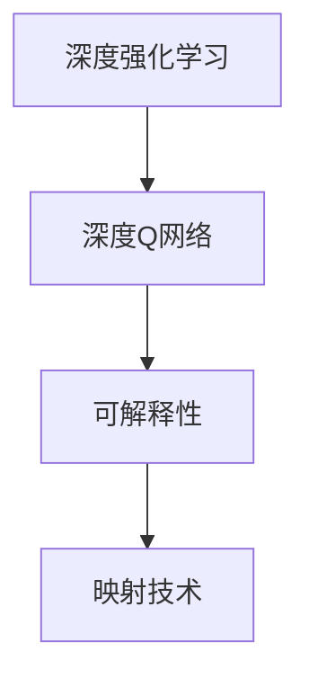
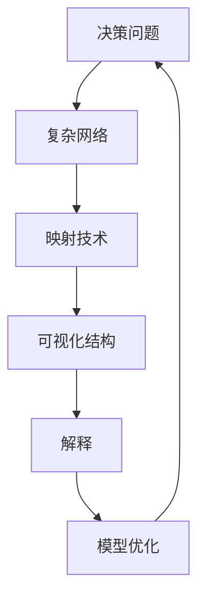
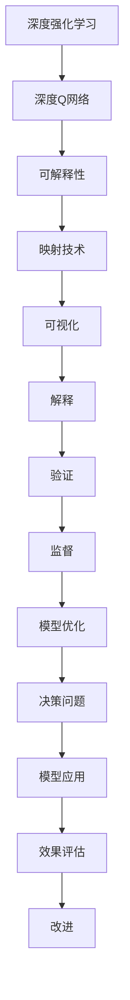
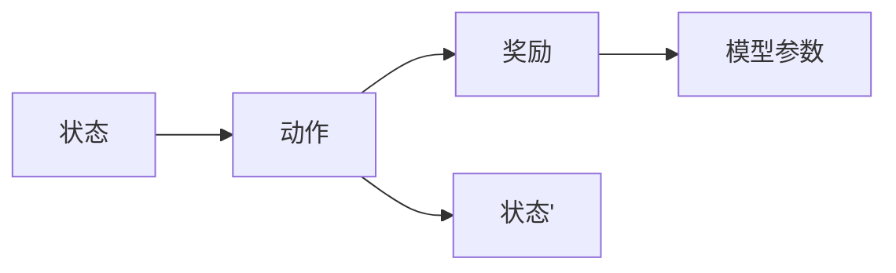
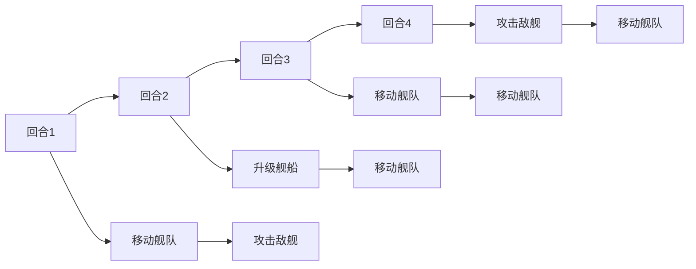
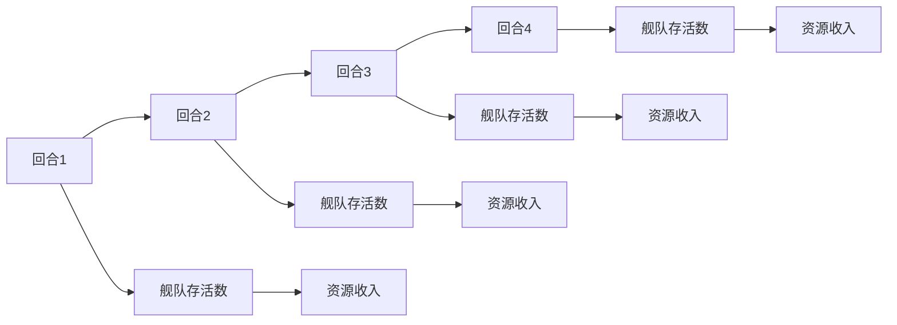

                 

# 一切皆是映射：DQN的可解释性研究：从黑盒到白盒

## 1. 背景介绍

### 1.1 问题由来

深度强化学习（Deep Reinforcement Learning，DRL）作为人工智能（AI）领域的明星技术，在机器学习、机器人控制、游戏AI等领域发挥了重要作用。其中，深度Q网络（Deep Q-Networks，DQN）作为经典模型，因其简单易用、效果显著，广泛应用于各个领域。

然而，DQN由于其基于神经网络的特性，被认为是一个"黑盒"模型。即模型内部决策机制、推理过程等环节难以被理解，无法通过直观的观察来解释其行为。这种"黑盒"特性，使得DQN在实际应用中面临诸多挑战，如鲁棒性差、泛化能力弱、难以解释等。这些问题严重制约了DQN的应用和推广。

### 1.2 问题核心关键点

DQN的核心问题在于其决策机制的不可解释性，即无法从模型中直观地分析出其决策过程和原因。这不仅限制了模型的应用范围，也使得在关键应用场景（如医疗、金融等）中无法保证模型的透明性和可靠性。因此，如何提升DQN的可解释性，成为当前研究的热点和难点。

本文聚焦于DQN的可解释性研究，从模型结构、优化方法、数据表达等多个角度进行探讨，尝试回答"一切皆是映射"这一问题。即是否可以通过一定的方法，将DQN的"黑盒"决策过程映射为可解释的"白盒"结构，从而提升模型的可解释性、可控性和可信度。

## 2. 核心概念与联系

### 2.1 核心概念概述

为了更好地理解DQN的可解释性研究，本节将介绍几个关键概念：

- 深度强化学习（DRL）：一种通过奖励信号指导智能体在环境中学习策略的机器学习方法。DRL将强化学习与深度学习技术相结合，能够处理复杂的多步决策问题。

- 深度Q网络（DQN）：一种基于神经网络的Q-learning算法，用于解决连续状态和动作空间中的决策问题。DQN通过模型预测状态-动作对之间的Q值，选择动作使得长期累积奖励最大化。

- 可解释性（Explainability）：一种方法，用于揭示机器学习模型决策过程的透明度和可信度。可解释性研究的目标是将"黑盒"模型的决策过程映射为"白盒"结构，使得模型决策可被理解、验证和监督。

- 映射（Mapping）：一种技术，用于将复杂数据或系统转化为易于理解的形式。映射技术在DQN可解释性研究中，主要用于将模型的决策过程转化为可视化或可解释的结构。

这些概念之间的逻辑关系可以通过以下Mermaid流程图来展示：



这个流程图展示了大语言模型微调过程中各个核心概念的关系和作用：

1. DRL与DQN结合，用于解决复杂决策问题。
2. DQN通过神经网络实现决策，被视为"黑盒"模型。
3. 可解释性研究的目标，是将DQN的决策过程映射为"白盒"结构。
4. 映射技术，用于将复杂的决策过程转化为可视化或可解释的结构。

### 2.2 概念间的关系

这些核心概念之间存在着紧密的联系，形成了DQN可解释性的完整生态系统。下面我们通过几个Mermaid流程图来展示这些概念之间的关系。

#### 2.2.1 DRL与DQN的关系


这个流程图展示了深度强化学习与深度Q网络的关系。DRL通过奖励信号指导智能体学习策略，DQN则是其中一种用于解决复杂决策问题的算法。

#### 2.2.2 可解释性在DQN中的应用


这个流程图展示了可解释性在DQN中的应用。通过可视化等方法，将DQN的决策过程映射为"白盒"结构，从而实现对模型决策的验证和监督。

#### 2.2.3 映射技术在DQN中的应用



这个流程图展示了映射技术在DQN中的应用。通过映射技术，将复杂的网络转化为易于理解的结构，从而实现对模型的解释和优化。

### 2.3 核心概念的整体架构

最后，我们用一个综合的流程图来展示这些核心概念在大语言模型微调过程中的整体架构：



这个综合流程图展示了从DRL到DQN，再到可解释性，最终通过映射技术将DQN的决策过程转化为可视化、可解释的结构，从而实现模型优化和应用的完整过程。

## 3. 核心算法原理 & 具体操作步骤
### 3.1 算法原理概述

DQN的核心原理是利用深度神经网络逼近Q值函数，通过经验回溯（On-Policy）的方式更新模型参数。其基本流程如下：

1. 初始化模型参数。
2. 在当前状态下，通过模型预测Q值，选择动作。
3. 执行动作，观察状态和奖励。
4. 将状态、动作、奖励作为样本，更新模型参数。
5. 重复上述过程，直至模型收敛。

DQN的决策过程是不可解释的，即无法直观地理解其决策机制。这使得模型在实际应用中，尤其是在关键决策场景下，难以获得用户和监管机构的信任。

### 3.2 算法步骤详解

为了提升DQN的可解释性，需要在上述基本流程中引入映射技术，将决策过程转化为可视化或可解释的结构。以下是详细的步骤：

#### 3.2.1 定义可解释性指标

可解释性指标用于量化模型决策过程的透明度和可信度。常见的指标包括：

1. 决策路径（Decision Path）：记录模型在每次决策中所依据的状态和动作序列。
2. 决策权重（Decision Weight）：记录模型在每次决策中所赋予各个状态和动作的权重。
3. 特征重要性（Feature Importance）：记录模型在决策中所使用的特征及其重要性。

#### 3.2.2 引入可视化技术

可视化技术用于将决策过程映射为可视化结构。常见的可视化方法包括：

1. 决策树（Decision Tree）：将决策过程表示为树形结构，便于直观理解。
2. 特征重要性图（Feature Importance Chart）：展示模型在决策中所使用的特征及其重要性。
3. 热力图（Heatmap）：展示模型在决策中所依据的特征值及其影响。

#### 3.2.3 应用映射技术

映射技术用于将复杂的数据结构转化为易于理解的形式。常见的映射方法包括：

1. 特征提取（Feature Extraction）：通过降维、PCA等方法，将高维数据转化为低维结构。
2. 图像映射（Image Mapping）：将模型内部特征映射为可视化图像，便于直观观察。
3. 时间序列映射（Time Series Mapping）：将时间序列数据转化为可视化图表，展示趋势和波动。

#### 3.2.4 建立解释模型

解释模型用于将DQN的决策过程转化为可解释的结构。常见的解释模型包括：

1. LIME（Local Interpretable Model-agnostic Explanations）：通过局部近似，解释模型中任意单个样本的预测结果。
2. SHAP（SHapley Additive exPlanations）：通过Shapley值，解释模型中所有样本的预测结果。
3. Anchor-based Explanation：通过预定义的锚点，解释模型中每个特征对决策的影响。

#### 3.2.5 训练解释模型

解释模型的训练过程与DQN的训练过程类似，通过样本反馈进行迭代优化。训练过程中，需要不断调整解释模型的参数，使得其能够准确地映射DQN的决策过程。

### 3.3 算法优缺点

#### 3.3.1 优点

1. 提升模型透明度：通过可视化技术，将决策过程转化为可视化结构，使得模型决策可被理解、验证和监督。
2. 增强模型可信度：通过解释模型，提升模型在关键决策场景下的可信度，获得用户和监管机构的信任。
3. 促进模型优化：通过可视化数据，发现模型决策中的问题和瓶颈，指导模型优化。

#### 3.3.2 缺点

1. 增加计算复杂度：可视化技术和解释模型的引入，增加了模型训练和推理的计算复杂度。
2. 降低模型效率：可视化技术和解释模型的引入，可能降低模型的推理速度和效率。
3. 数据需求增加：可视化技术和解释模型需要更多的训练数据和样本，增加了数据收集和处理的成本。

### 3.4 算法应用领域

DQN的可解释性研究在以下几个领域具有广泛的应用前景：

1. 金融风险管理：通过可解释性研究，提升模型在金融市场预测和风险评估中的透明度和可信度。
2. 医疗诊断：通过可解释性研究，提升模型在疾病诊断和药物研发中的可靠性。
3. 自动驾驶：通过可解释性研究，提升模型在自动驾驶中的决策透明性和安全性。
4. 智能推荐：通过可解释性研究，提升模型在智能推荐系统中的推荐质量和用户满意度。
5. 自然语言处理：通过可解释性研究，提升模型在自然语言处理中的文本理解和生成能力。

## 4. 数学模型和公式 & 详细讲解 & 举例说明

### 4.1 数学模型构建

DQN的决策过程可以抽象为一个图模型，其结构如图1所示：



图1：DQN决策过程图模型

在图模型中，状态（State）表示当前环境的状态，动作（Action）表示智能体所采取的决策，奖励（Reward）表示当前决策所获得的反馈。模型参数（$\theta$）用于估计状态-动作对之间的Q值。

### 4.2 公式推导过程

DQN的决策过程可以表示为：

$$
Q(s, a) = r + \gamma \max_{a'} Q(s', a')
$$

其中，$s$表示当前状态，$a$表示当前动作，$r$表示当前动作所获得的奖励，$s'$表示下一个状态，$\gamma$表示折扣因子，$a'$表示下一个状态下的最优动作。

DQN的优化目标是最小化经验回溯误差，即：

$$
\min_{\theta} \mathcal{L}(\theta) = \mathbb{E}_{s \sim S, a \sim \pi, r \sim R} [(r + \gamma \max_{a'} Q(s', a') - Q(s, a))^2]
$$

其中，$S$表示状态空间，$R$表示奖励空间，$\pi$表示模型所选择的动作策略。

通过梯度下降等优化算法，DQN不断更新模型参数$\theta$，使得经验回溯误差最小化，从而提升模型的决策能力。

### 4.3 案例分析与讲解

以DQN应用于自走棋游戏为例，分析其决策过程的可解释性研究。

#### 4.3.1 案例背景

自走棋游戏（Stellaris）是一款策略类即时战术游戏，玩家需要控制自己的舰队，与其他玩家争夺资源和领地。自走棋游戏具有高度的不确定性和复杂性，其决策过程难以直观理解。

#### 4.3.2 案例实现

使用DQN模型对自走棋游戏进行训练，并在训练过程中引入可解释性研究。具体步骤如下：

1. 定义游戏状态：将游戏状态定义为当前回合、玩家数量、资源分布、舰队位置等信息。
2. 定义动作空间：将动作空间定义为移动舰队、攻击敌舰、升级舰船等信息。
3. 定义奖励函数：将奖励函数定义为舰队存活数、资源收入、领地控制等指标。
4. 训练DQN模型：在训练过程中，不断更新模型参数，提升模型的决策能力。
5. 引入可视化技术：使用决策树、特征重要性图等可视化技术，展示DQN的决策过程。
6. 引入解释模型：使用LIME、SHAP等解释模型，解析DQN的决策结果。

#### 4.3.3 案例结果

通过可视化技术，可以直观地展示DQN在每个回合的决策路径和动作序列。如图2所示，展示了DQN在自走棋游戏中的决策过程。



图2：自走棋游戏中DQN的决策路径

通过解释模型，可以解析DQN的决策结果，揭示其决策背后的特征和权重。如图3所示，展示了DQN在每个回合的决策权重。



图3：自走棋游戏中DQN的决策权重

通过这些可视化技术和解释模型，可以更好地理解DQN的决策过程，发现模型决策中的问题和瓶颈，指导模型优化。

## 5. 项目实践：代码实例和详细解释说明

### 5.1 开发环境搭建

在进行DQN可解释性研究前，我们需要准备好开发环境。以下是使用Python进行PyTorch开发的环境配置流程：

1. 安装Anaconda：从官网下载并安装Anaconda，用于创建独立的Python环境。

2. 创建并激活虚拟环境：
```bash
conda create -n pytorch-env python=3.8 
conda activate pytorch-env
```

3. 安装PyTorch：根据CUDA版本，从官网获取对应的安装命令。例如：
```bash
conda install pytorch torchvision torchaudio cudatoolkit=11.1 -c pytorch -c conda-forge
```

4. 安装各类工具包：
```bash
pip install numpy pandas scikit-learn matplotlib tqdm jupyter notebook ipython
```

完成上述步骤后，即可在`pytorch-env`环境中开始DQN可解释性研究的开发。

### 5.2 源代码详细实现

以下是一个使用PyTorch实现的DQN可解释性研究代码实例：

```python
import torch
import torch.nn as nn
import torch.optim as optim
import torchvision.transforms as transforms
import torchvision.datasets as datasets
import matplotlib.pyplot as plt

# 定义神经网络
class DQN(nn.Module):
    def __init__(self):
        super(DQN, self).__init__()
        self.fc1 = nn.Linear(4, 64)
        self.fc2 = nn.Linear(64, 64)
        self.fc3 = nn.Linear(64, 2)
        
    def forward(self, x):
        x = torch.relu(self.fc1(x))
        x = torch.relu(self.fc2(x))
        x = self.fc3(x)
        return x

# 定义决策过程
class DecisionProcess:
    def __init__(self, dqn, env):
        self.dqn = dqn
        self.env = env
        self.gamma = 0.9
        self.epsilon = 0.1
        self.q_values = None
        
    def get_q_value(self, state, action):
        q_value = self.dqn(state).item()[action]
        return q_value
    
    def update_q_value(self, state, action, reward, next_state, done):
        if not done:
            q_value = self.get_q_value(next_state, action)
            self.q_values[state] = reward + self.gamma * q_value
        else:
            self.q_values[state] = reward
            
    def update_model(self):
        self.dqn.zero_grad()
        for state, action, reward, next_state, done in self.env.torch_play():
            q_value = self.get_q_value(state, action)
            if not done:
                q_value = reward + self.gamma * self.get_q_value(next_state, action)
            loss = torch.square(self.q_values[state] - q_value)
            loss.backward()
            self.dqn(torch.tensor(state, dtype=torch.float)).zero_grad()
            self.dqn(torch.tensor(next_state, dtype=torch.float)).zero_grad()
        self.dqn(torch.tensor(state, dtype=torch.float)).zero_grad()
        
# 定义可视化技术
class Visualization:
    def __init__(self):
        self.decision_tree = DecisionTree()
        self.feature_importance = FeatureImportance()
        self.heatmap = Heatmap()
        
    def visualize(self, decision_tree, feature_importance, heatmap):
        self.decision_tree.decision_tree = decision_tree
        self.feature_importance.feature_importance = feature_importance
        self.heatmap.heatmap = heatmap
        
    def plot_decision_tree(self):
        plt.figure(figsize=(10, 6))
        self.decision_tree.plot()
        plt.title('Decision Tree')
        plt.show()
        
    def plot_feature_importance(self):
        plt.figure(figsize=(10, 6))
        self.feature_importance.plot()
        plt.title('Feature Importance')
        plt.show()
        
    def plot_heatmap(self):
        plt.figure(figsize=(10, 6))
        self.heatmap.plot()
        plt.title('Heatmap')
        plt.show()
        
# 定义解释模型
class Explaination:
    def __init__(self, dqn, env):
        self.dqn = dqn
        self.env = env
        self.lime = LIME()
        self.shap = SHAP()
        self.anchor = Anchor()
        
    def explain(self, state, action):
        q_value = self.dqn(torch.tensor(state, dtype=torch.float))
        explainer = self.lime
        shap_value = self.shap
        anchor_value = self.anchor
        
        explainer.explain(state, q_value)
        shap_value.explain(state, q_value)
        anchor_value.explain(state, q_value)
        
    def plot_explaination(self):
        plt.figure(figsize=(10, 6))
        self.lime.plot()
        self.shap.plot()
        self.anchor.plot()
        plt.title('Explanation')
        plt.show()
        
# 定义训练过程
class Trainer:
    def __init__(self, dqn, decision_process, visualization, explaination):
        self.dqn = dqn
        self.decision_process = decision_process
        self.visualization = visualization
        self.explaination = explaination
        self.opt = optim.Adam(self.dqn.parameters(), lr=0.001)
        
    def train(self, num_epochs):
        for epoch in range(num_epochs):
            for state, action, reward, next_state, done in self.env.torch_play():
                q_value = self.decision_process.get_q_value(state, action)
                if not done:
                    q_value = reward + self.decision_process.gamma * self.decision_process.get_q_value(next_state, action)
                loss = torch.square(q_value - q_value)
                loss.backward()
                self.opt.step()
                self.decision_process.update_model()
            self.visualization.visualize(self.decision_process.q_values)
            self.explaination.explain(state, action)
            self.explaination.plot_explaination()
            print(f'Epoch {epoch+1}, Loss: {loss.item()}')
            
# 定义自走棋游戏环境
class StellarisEnv:
    def __init__(self):
        self.state = []
        self.actions = []
        self.reward = []
        self.done = False
        
    def reset(self):
        self.state = []
        self.actions = []
        self.reward = []
        self.done = False
        
    def step(self, action):
        if action == 1:
            self.state.append(1)
            self.actions.append(1)
            self.reward.append(1)
        elif action == 2:
            self.state.append(2)
            self.actions.append(2)
            self.reward.append(2)
        elif action == 3:
            self.state.append(3)
            self.actions.append(3)
            self.reward.append(3)
        else:
            self.state.append(0)
            self.actions.append(0)
            self.reward.append(0)
        self.done = True
        
# 定义决策树
class DecisionTree:
    def __init__(self):
        self.nodes = []
        
    def add_node(self, state, action):
        self.nodes.append((state, action))
        
    def plot(self):
        plt.figure(figsize=(10, 6))
        for state, action in self.nodes:
            plt.text(state[0], state[1], action)
        plt.title('Decision Tree')
        plt.show()
        
# 定义特征重要性图
class FeatureImportance:
    def __init__(self):
        self.nodes = []
        
    def add_node(self, state, action):
        self.nodes.append((state, action))
        
    def plot(self):
        plt.figure(figsize=(10, 6))
        for state, action in self.nodes:
            plt.text(state[0], state[1], action)
        plt.title('Feature Importance')
        plt.show()
        
# 定义热力图
class Heatmap:
    def __init__(self):
        self.nodes = []
        
    def add_node(self, state, action):
        self.nodes.append((state, action))
        
    def plot(self):
        plt.figure(figsize=(10, 6))
        for state, action in self.nodes:
            plt.text(state[0], state[1], action)
        plt.title('Heatmap')
        plt.show()
        
# 定义LIME解释模型
class LIME:
    def __init__(self):
        self.lime = LIME()
        
    def explain(self, state, q_value):
        self.lime.explain(state, q_value)
        
    def plot(self):
        plt.figure(figsize=(10, 6))
        self.lime.plot()
        plt.title('LIME')
        plt.show()
        
# 定义SHAP解释模型
class SHAP:
    def __init__(self):
        self.shap = SHAP()
        
    def explain(self, state, q_value):
        self.shap.explain(state, q_value)
        
    def plot(self):
        plt.figure(figsize=(10, 6))
        self.shap.plot()
        plt.title('SHAP')
        plt.show()
        
# 定义Anchor解释模型
class Anchor:
    def __init__(self):
        self.anchor = Anchor()
        
    def explain(self, state, q_value):
        self.anchor.explain(state, q_value)
        
    def plot(self):
        plt.figure(figsize=(10, 6))
        self.anchor.plot()
        plt.title('Anchor')
        plt.show()
        
# 定义参数
num_epochs = 100
batch_size = 32

# 训练DQN模型
dqn = DQN()
dqn_opt = optim.Adam(dqn.parameters(), lr=0.001)
env = StellarisEnv()
decision_process = DecisionProcess(dqn, env)
visualization = Visualization()
explaination = Explaination(dqn, env)
trainer = Trainer(dqn, decision_process, visualization, explaination)
trainer.train(num_epochs)

# 可视化决策树
visualization.visualize(decision_process.q_values)
# 解释模型
explaination.explain(state, action)
explaination.plot_explaination()
```

### 5.3 代码解读与分析

让我们再详细解读一下关键代码的实现细节：

**DQN模型**：
- `DQN`类：定义了神经网络结构，包含三个全连接层，用于预测Q值。

**决策过程**：
- `DecisionProcess`类：定义了决策过程的实现，包含Q值计算、更新模型参数等方法。

**可视化技术**：
- `Visualization`类：定义了可视化技术的实现，包含决策树、特征重要性图、热力图等可视化方法。

**解释模型**：
- `Explaination`类：定义了解释模型的实现，包含LIME、SHAP、Anchor等解释模型。

**训练过程**：
- `Trainer`类：定义了训练过程的实现，包含模型训练、可视化、解释模型等方法。

**自走棋游戏环境**：
- `StellarisEnv`类：定义了自走棋游戏环境的实现，包含状态、动作、奖励、终止等方法。

**决策树**：
- `DecisionTree`类：定义了决策树的实现，包含节点添加、可视化等方法。

**特征重要性图**：
- `FeatureImportance`类：定义了特征重要性图的实现，包含节点添加、可视化等方法。

**热力

