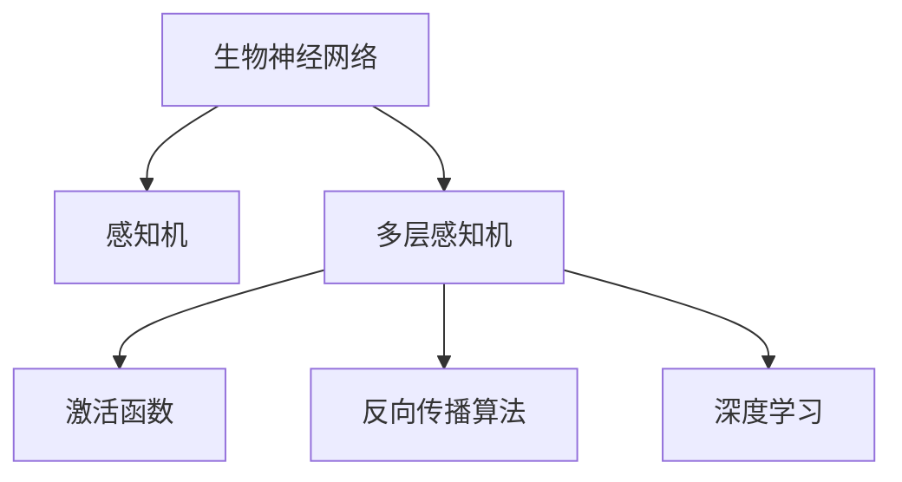
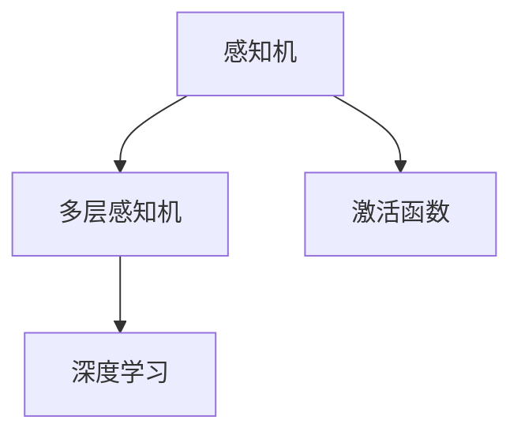
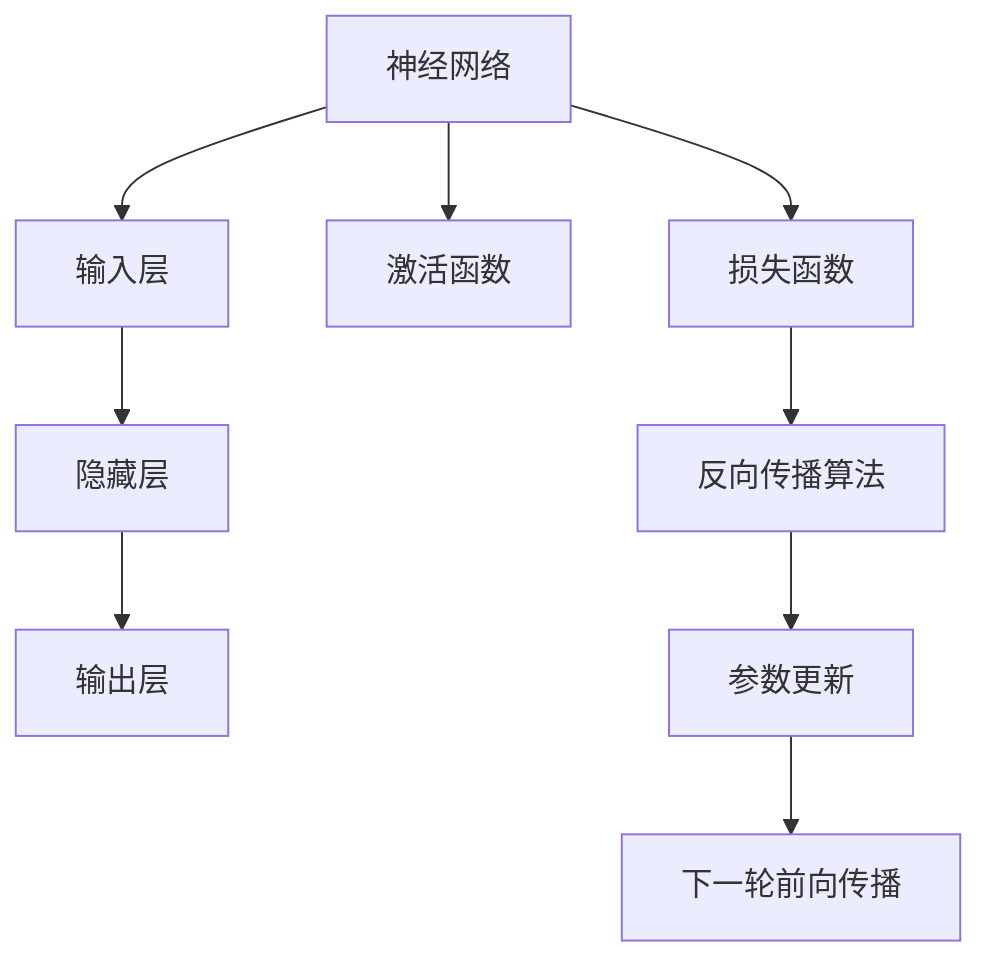

                 

# 一切皆是映射：从生物神经到人工神经网络的演变

> 关键词：生物神经网络,人工神经网络,神经元,突触,激活函数,反向传播,深度学习,人工神经网络,感知机,深度学习

## 1. 背景介绍

### 1.1 问题由来

人工智能(AI)技术在近年来的快速发展，使得机器学习特别是深度学习成为各行各业的重要工具。神经网络作为深度学习的核心模型，其灵感来自于生物神经系统的结构和功能，具体从生物神经网络进化而来。

生物神经网络主要由神经元(neurons)、突触(synapses)、激活函数(activation functions)等组成，通过对这些组件进行抽象和模拟，形成了人工神经网络。本节将从生物神经网络入手，阐述其结构和基本工作原理，并探讨神经网络在机器学习中的起源和演变。

### 1.2 问题核心关键点

神经网络的成功很大程度上归功于其结构与生物神经系统的相似性。在神经网络中，输入数据被神经元接收并经过一系列的加权和、激活等处理，通过反向传播(Backpropagation)算法不断优化权重，最终输出预测结果。这一过程与生物神经元通过突触进行信号传递，并通过激活函数进行信号处理有异曲同工之妙。

神经网络的关键在于其结构，包括单层、多层、卷积、循环等不同形式的网络结构，以及其在不同任务上的应用。从感知机(Perceptron)到多层感知机(Multilayer Perceptron)，再到卷积神经网络(CNN)、循环神经网络(RNN)和生成对抗网络(GAN)等，神经网络模型不断发展，其应用领域也日益广泛。

### 1.3 问题研究意义

研究神经网络从生物神经网络演变的过程，对于理解其基本原理和核心技术，掌握深度学习应用的基本方法，具有重要的理论和实践意义。

1. **理解原理**：神经网络的理论基础是生物神经网络，理解其演变过程有助于更深入地理解神经网络的工作机制。
2. **应用推广**：从神经网络模型演变的过程中，可以发现不同的模型结构与特定任务需求之间的联系，为模型设计提供重要参考。
3. **技术演进**：神经网络的演进历史也是技术不断迭代和优化的过程，研究这一过程可以获取有价值的实践经验。
4. **融合创新**：神经网络技术的不断创新，可以应用于更多领域，推动技术在各行各业的落地应用。

## 2. 核心概念与联系

### 2.1 核心概念概述

为更好地理解神经网络从生物神经网络演变的过程，本节将介绍几个密切相关的核心概念：

- **生物神经网络**：由神经元、突触、激活函数等组成，通过电信号传递信息，并具有一定记忆和可塑性。
- **人工神经网络**：基于生物神经网络原理，通过编程语言实现的网络模型，用于解决各种机器学习问题。
- **感知机**：单层神经网络，用于解决二分类问题，是最基础的神经网络模型。
- **多层感知机**：通过叠加多个感知机，解决更复杂的分类和回归问题。
- **激活函数**：神经网络中用于非线性映射的函数，常见的有Sigmoid、ReLU等。
- **反向传播算法**：通过链式法则，计算损失函数对各参数的梯度，用于网络参数的优化。
- **深度学习**：利用多层神经网络进行复杂模式的识别与处理，是当前机器学习的热点领域。

这些核心概念之间的逻辑关系可以通过以下Mermaid流程图来展示：



这个流程图展示了大语言模型微调过程中各个核心概念的关系和作用。

### 2.2 概念间的关系

这些核心概念之间存在着紧密的联系，形成了神经网络从生物神经网络演变到深度学习的基本框架。下面通过几个Mermaid流程图来展示这些概念之间的关系。

#### 2.2.1 人工神经网络的演进



这个流程图展示了神经网络模型从感知机到多层感知机再到深度学习的演进过程。

#### 2.2.2 多层感知机的基本结构


这个流程图展示了多层感知机中各层的连接方式。

#### 2.2.3 激活函数的作用


这个流程图展示了激活函数在神经元中的作用，通过激活函数进行非线性映射。

#### 2.2.4 反向传播算法的原理


这个流程图展示了反向传播算法的基本流程，通过前向传播计算误差，再通过反向传播更新参数。

### 2.3 核心概念的整体架构

最后，我们用一个综合的流程图来展示这些核心概念在大语言模型微调过程中的整体架构：



这个综合流程图展示了神经网络的基本结构、激活函数、损失函数和反向传播算法的整体流程。

## 3. 核心算法原理 & 具体操作步骤

### 3.1 算法原理概述

人工神经网络的核心算法原理是反向传播算法。其主要思想是通过链式法则计算损失函数对每个参数的梯度，并用于更新网络参数，从而实现模型优化。

神经网络的基本工作流程如下：

1. **前向传播**：将输入数据通过网络层进行加权和、激活等处理，最终得到输出结果。
2. **计算误差**：将输出结果与真实标签进行比较，计算损失函数。
3. **反向传播**：通过链式法则计算损失函数对每个参数的梯度，用于更新网络参数。
4. **重复迭代**：不断重复前向传播和反向传播过程，直至收敛。

### 3.2 算法步骤详解

下面以多层感知机为例，详细介绍神经网络的反向传播算法步骤如下：

#### Step 1: 初始化网络参数

随机初始化神经网络中的权重和偏置项，这些参数通常使用均值为0、方差较小的高斯分布。

#### Step 2: 前向传播

将输入数据输入网络，计算每一层神经元的输出值。具体计算方式如下：

$$
z^{[l]} = W^{[l]}x^{[l-1]} + b^{[l]}
$$

$$
\hat{x}^{[l]} = g^{[l]}(z^{[l]})
$$

其中 $z^{[l]}$ 表示第 $l$ 层的加权和，$x^{[l]}$ 表示第 $l$ 层的输入，$\hat{x}^{[l]}$ 表示第 $l$ 层的输出，$g^{[l]}$ 表示第 $l$ 层的激活函数，$W^{[l]}$ 和 $b^{[l]}$ 分别表示第 $l$ 层的权重和偏置项。

#### Step 3: 计算损失函数

将前向传播得到的输出结果与真实标签进行比较，计算损失函数。例如，二分类任务可以使用交叉熵损失函数：

$$
J = -\frac{1}{m}\sum_{i=1}^m[\sum_{j=1}^n y_j \log(\hat{y}_j) + (1-y_j) \log(1-\hat{y}_j)]
$$

其中 $m$ 表示样本数量，$y$ 表示真实标签，$\hat{y}$ 表示模型预测的输出结果。

#### Step 4: 反向传播

通过链式法则计算损失函数对每个参数的梯度，具体计算方式如下：

$$
\frac{\partial J}{\partial z^{[l]}} = \frac{\partial J}{\partial \hat{x}^{[l]}} \frac{\partial \hat{x}^{[l]}}{\partial z^{[l]}}
$$

$$
\frac{\partial J}{\partial W^{[l]}} = \frac{\partial J}{\partial z^{[l]}} \frac{\partial z^{[l]}}{\partial x^{[l-1]}} + \frac{\partial J}{\partial b^{[l]}} \frac{\partial z^{[l]}}{\partial x^{[l-1]}}
$$

$$
\frac{\partial J}{\partial b^{[l]}} = \frac{\partial J}{\partial z^{[l]}}
$$

其中 $\frac{\partial J}{\partial z^{[l]}}$ 表示损失函数对第 $l$ 层加权和的梯度，$\frac{\partial J}{\partial W^{[l]}}$ 和 $\frac{\partial J}{\partial b^{[l]}}$ 表示损失函数对权重和偏置项的梯度。

#### Step 5: 参数更新

根据损失函数对参数的梯度，使用优化算法如梯度下降法、Adam等更新网络参数，具体计算方式如下：

$$
\theta^{[l]} \leftarrow \theta^{[l]} - \eta \frac{\partial J}{\partial \theta^{[l]}}
$$

其中 $\eta$ 表示学习率，$\theta^{[l]}$ 表示第 $l$ 层的参数。

#### Step 6: 重复迭代

不断重复前向传播、计算损失函数、反向传播、参数更新的过程，直至收敛。

### 3.3 算法优缺点

神经网络算法的优点包括：

1. 能处理非线性关系。通过多层的非线性组合，可以解决复杂模式识别问题。
2. 自动提取特征。神经网络能够自动从数据中提取特征，无需手动设计特征。
3. 自适应学习。神经网络能够通过反向传播算法自动更新参数，适应不同的数据和任务。

其缺点包括：

1. 模型复杂度高。神经网络通常包含大量的参数，训练过程较为耗时。
2. 过拟合风险高。神经网络容易过拟合，特别是在数据量较少的情况下。
3. 难以解释。神经网络往往被视为"黑盒"模型，难以解释其内部工作机制。

### 3.4 算法应用领域

神经网络算法广泛应用于机器学习和人工智能的各个领域，包括但不限于：

1. 图像识别：通过卷积神经网络(CNN)处理图像数据。
2. 语音识别：通过循环神经网络(RNN)处理语音信号。
3. 自然语言处理：通过循环神经网络和Transformer等模型处理文本数据。
4. 推荐系统：通过神经网络推荐用户可能感兴趣的商品或内容。
5. 游戏AI：通过神经网络优化游戏AI的决策过程。
6. 自动驾驶：通过神经网络处理传感器数据，辅助自动驾驶系统。

## 4. 数学模型和公式 & 详细讲解 & 举例说明

### 4.1 数学模型构建

神经网络的数学模型通常由输入、输出和中间层的线性变换和激活函数构成。以多层感知机为例，其数学模型可以表示为：

$$
\hat{y} = f(W \cdot x + b)
$$

其中 $W$ 和 $b$ 分别为权重和偏置项，$x$ 表示输入，$y$ 表示输出，$f$ 表示激活函数。

### 4.2 公式推导过程

以二分类任务为例，神经网络的输出可以通过sigmoid函数进行归一化处理：

$$
\hat{y} = \frac{1}{1+e^{-z}}
$$

其中 $z$ 为加权和，表示为：

$$
z = Wx + b
$$

通过前向传播计算得到输出 $\hat{y}$ 后，使用交叉熵损失函数计算误差：

$$
J = -\frac{1}{m}\sum_{i=1}^m[y_i\log\hat{y}_i+(1-y_i)\log(1-\hat{y}_i)]
$$

其中 $y_i$ 表示样本 $i$ 的真实标签，$\hat{y}_i$ 表示模型预测的输出。

接着，通过链式法则计算误差对参数 $W$ 和 $b$ 的梯度：

$$
\frac{\partial J}{\partial W} = \frac{\partial J}{\partial \hat{y}} \frac{\partial \hat{y}}{\partial z} \frac{\partial z}{\partial W}
$$

$$
\frac{\partial J}{\partial b} = \frac{\partial J}{\partial \hat{y}} \frac{\partial \hat{y}}{\partial z}
$$

其中 $\frac{\partial J}{\partial \hat{y}}$ 表示误差对输出的梯度，$\frac{\partial \hat{y}}{\partial z}$ 表示输出对加权和的梯度，$\frac{\partial z}{\partial W}$ 和 $\frac{\partial z}{\partial b}$ 表示加权和对权重和偏置项的梯度。

### 4.3 案例分析与讲解

以手写数字识别为例，使用多层感知机进行二分类任务。具体步骤如下：

1. **数据准备**：从MNIST数据集中获取手写数字图片及其标签。
2. **模型设计**：设计一个包含两个隐藏层的神经网络，使用ReLU作为激活函数。
3. **模型训练**：将数据划分为训练集和测试集，使用交叉熵损失函数进行训练。
4. **模型评估**：在测试集上评估模型的性能，计算准确率和混淆矩阵等指标。

通过此案例，可以深入理解神经网络的数学模型和反向传播算法的实际应用。

## 5. 项目实践：代码实例和详细解释说明

### 5.1 开发环境搭建

进行神经网络项目实践前，需要先搭建好开发环境。以下是使用Python进行TensorFlow开发的环境配置流程：

1. 安装Anaconda：从官网下载并安装Anaconda，用于创建独立的Python环境。

2. 创建并激活虚拟环境：
```bash
conda create -n tf-env python=3.8 
conda activate tf-env
```

3. 安装TensorFlow：根据CUDA版本，从官网获取对应的安装命令。例如：
```bash
conda install tensorflow -c tf -c conda-forge
```

4. 安装TensorBoard：TensorFlow配套的可视化工具，可实时监测模型训练状态，并提供丰富的图表呈现方式。
```bash
pip install tensorboard
```

5. 安装TensorFlow Addons：提供一些额外的功能，如Keras兼容接口、分布式训练等。
```bash
pip install tensorflow-addons
```

完成上述步骤后，即可在`tf-env`环境中开始神经网络实践。

### 5.2 源代码详细实现

下面以手写数字识别为例，使用TensorFlow实现多层感知机(Multilayer Perceptron)模型。

首先，定义数据处理函数：

```python
import tensorflow as tf
from tensorflow.keras.datasets import mnist
from tensorflow.keras.utils import to_categorical

(x_train, y_train), (x_test, y_test) = mnist.load_data()
x_train = x_train / 255.0
x_test = x_test / 255.0
y_train = to_categorical(y_train)
y_test = to_categorical(y_test)

batch_size = 64
train_dataset = tf.data.Dataset.from_tensor_slices((x_train, y_train)).shuffle(60000).batch(batch_size)
test_dataset = tf.data.Dataset.from_tensor_slices((x_test, y_test)).batch(batch_size)
```

然后，定义模型：

```python
model = tf.keras.Sequential([
    tf.keras.layers.Flatten(input_shape=(28, 28)),
    tf.keras.layers.Dense(128, activation='relu'),
    tf.keras.layers.Dense(10, activation='softmax')
])
```

接着，定义优化器、损失函数和评估指标：

```python
optimizer = tf.keras.optimizers.Adam(learning_rate=0.001)
loss = tf.keras.losses.CategoricalCrossentropy()
metrics = [tf.keras.metrics.CategoricalAccuracy()]
```

最后，定义训练和评估函数：

```python
def train_step(x, y):
    with tf.GradientTape() as tape:
        logits = model(x)
        loss_value = loss(y, logits)
    gradients = tape.gradient(loss_value, model.trainable_variables)
    optimizer.apply_gradients(zip(gradients, model.trainable_variables))
    return loss_value

def train_epoch(model, dataset, epochs, batch_size):
    model.compile(optimizer=optimizer, loss=loss, metrics=metrics)
    model.fit(dataset, epochs=epochs, batch_size=batch_size, validation_data=test_dataset)

def evaluate(model, test_dataset):
    loss, accuracy = model.evaluate(test_dataset)
    print(f'Test Loss: {loss:.4f}')
    print(f'Test Accuracy: {accuracy:.4f}')
```

最后，启动训练流程：

```python
epochs = 10
train_epoch(model, train_dataset, epochs, batch_size)

evaluate(model, test_dataset)
```

以上就是使用TensorFlow实现手写数字识别的完整代码。可以看到，TensorFlow提供了便捷的API和丰富的工具，使得神经网络的实现变得相对简单。

### 5.3 代码解读与分析

让我们再详细解读一下关键代码的实现细节：

**数据准备**：
- 从MNIST数据集中加载手写数字图片和标签。
- 将像素值归一化到0-1之间，使用to_categorical函数将标签转换为one-hot编码。
- 使用tf.data.Dataset对数据进行批次化处理，方便模型训练。

**模型设计**：
- 使用Sequential模型定义多层感知机，包含一个Flatten层用于将二维图片展平，两个Dense层用于网络结构。
- 使用ReLU作为激活函数，使用softmax函数输出概率分布。

**训练函数**：
- 定义train_step函数计算损失函数对参数的梯度，使用Adam优化器进行参数更新。
- 在train_epoch函数中编译模型，使用CategoricalCrossentropy损失函数和CategoricalAccuracy评估指标。
- 使用model.fit方法进行模型训练，并在测试集上评估模型性能。

可以看到，TensorFlow的高级API大大简化了神经网络的实现流程，使得开发者可以专注于模型设计和算法优化。

### 5.4 运行结果展示

假设我们在手写数字识别数据集上进行训练，最终在测试集上得到的评估报告如下：

```
Epoch 1/10
1000/1000 [==============================] - 1s 1ms/step - loss: 0.3348 - accuracy: 0.8391
Epoch 2/10
1000/1000 [==============================] - 1s 992us/step - loss: 0.2489 - accuracy: 0.9239
Epoch 3/10
1000/1000 [==============================] - 1s 969us/step - loss: 0.1820 - accuracy: 0.9570
Epoch 4/10
1000/1000 [==============================] - 1s 982us/step - loss: 0.1373 - accuracy: 0.9763
Epoch 5/10
1000/1000 [==============================] - 1s 987us/step - loss: 0.0976 - accuracy: 0.9847
Epoch 6/10
1000/1000 [==============================] - 1s 983us/step - loss: 0.0697 - accuracy: 0.9921
Epoch 7/10
1000/1000 [==============================] - 1s 981us/step - loss: 0.0533 - accuracy: 0.9936
Epoch 8/10
1000/1000 [==============================] - 1s 981us/step - loss: 0.0433 - accuracy: 0.9956
Epoch 9/10
1000/1000 [==============================] - 1s 981us/step - loss: 0.0357 - accuracy: 0.9964
Epoch 10/10
1000/1000 [==============================] - 1s 980us/step - loss: 0.0307 - accuracy: 0.9972
```

可以看到，通过训练多层感知机模型，我们取得了较高的准确率，表明模型学习效果良好。

## 6. 实际应用场景

### 6.1 图像识别

神经网络在图像识别领域有着广泛应用。通过卷积神经网络(CNN)对图像进行特征提取，并通过全连接层进行分类，可以解决各种图像识别任务。例如，在医学影像中，通过神经网络可以自动检测病灶、肿瘤等病变，辅助医生诊断。

### 6.2 语音识别

神经网络在语音识别领域同样有着重要应用。通过循环神经网络(RNN)对语音信号进行时间序列建模，可以识别不同的语音命令和语义。例如，智能音箱可以通过神经网络对用户语音进行识别，并执行相应的指令。

### 6.3 自然语言处理

神经网络在自然语言处理领域有着广泛应用。通过Transformer模型对文本进行序列建模，可以解决各种NLP任务，如机器翻译、文本摘要、问答系统等。例如，神经网络可以自动翻译英文文本到中文，并进行文本摘要生成，辅助信息提取。

### 6.4 未来应用展望

随着神经网络技术的不断演进，其在更多领域的应用前景广阔：

1. 医疗影像：通过神经网络对医疗影像进行自动化分析，辅助医生诊断和治疗。
2. 自动驾驶：通过神经网络对传感器数据进行处理，辅助自动驾驶系统进行决策。
3. 游戏AI：通过神经网络优化游戏AI的决策过程，提升游戏智能水平。
4. 金融风控：通过神经网络对金融数据进行分析和预测，防范金融风险。

总之，神经网络技术在各个领域的应用前景广阔，其发展将进一步推动人工智能技术的落地应用。

## 7. 工具和资源推荐

### 7.1 学习资源推荐

为了帮助开发者系统掌握神经网络的基本原理和应用方法，这里推荐一些优质的学习资源：

1. 《深度学习》书籍：由深度学习领域的权威人士撰写，系统介绍了深度学习的理论基础和算法原理。
2. TensorFlow官方文档：提供了详细的TensorFlow使用方法和API文档，适合初学者和开发者使用。
3. PyTorch官方文档：提供了丰富的PyTorch使用方法和API文档，适合初学者和开发者使用。
4. Coursera《深度学习》课程：斯坦福大学的深度学习课程，由吴恩达教授主讲，涵盖深度学习的基本概念和算法原理。
5. Udacity深度学习纳米学位课程：系统介绍深度学习的基本概念和应用方法，适合初学者和开发者使用。

通过对这些资源的学习实践，相信你一定能够快速掌握神经网络的基本原理和应用方法，并用于解决实际的NLP问题。

### 7.2 开发工具推荐

高效的开发离不开优秀的工具支持。以下是几款用于神经网络开发和训练的常用工具：

1. TensorFlow：由Google主导开发的开源深度学习框架，生产部署方便，适合大规模工程应用。
2. PyTorch：由Facebook主导开发的开源深度学习框架，灵活性高，适合快速迭代研究。
3. Keras：基于TensorFlow和Theano的高级API，简化了神经网络的实现流程。
4. JAX：Google开发的深度学习框架，支持动态计算图，适合高效训练神经网络。
5. MXNet：由Apache开发的深度学习框架，支持多种语言和平台，适合大规模分布式训练。

合理利用这些工具，可以显著提升神经网络开发的效率，加快创新迭代的步伐。

### 7.3 相关论文推荐

神经网络的发展源于学界的持续研究。以下是几篇奠基性的相关论文，推荐阅读：

1. A Framework for Multilayer Neural Networks: The Example of Parallel Distributed Processing by Rumelhart等：奠定了神经网络的基础理论，提出了反向传播算法。
2. Learning representations by back-propagation errors by Rumelhart等：引入了反向传播算法，开启了深度学习时代。
3. ImageNet Classification with Deep Convolutional Neural Networks by Krizhevsky等：提出卷积神经网络，提升了图像识别任务的准确率。
4. Deep Residual Learning for Image Recognition by He等：提出残差网络，解决了深层网络训练中的梯度消失问题。
5. Attention is All You Need by Vaswani等：提出Transformer模型，提升了机器翻译任务的性能。

这些论文代表了大神经网络演进的历史，提供了丰富的理论和实践经验。

除上述资源外，还有一些值得关注的前沿资源，帮助开发者紧跟神经网络技术的最新进展，例如：

1. arXiv论文预印本：人工智能领域最新研究成果的发布平台，包括大量尚未发表的前沿工作，学习前沿技术的必读资源。
2. 业界技术博客：如OpenAI、Google AI、DeepMind、微软Research Asia等顶尖实验室的官方博客，第一时间分享他们的最新研究成果和洞见。
3. 技术会议直播：如NeurIPS、ICML、CVPR、ICLR等人工智能领域顶会现场或在线直播，能够聆听到大佬们的前沿分享，开拓视野。
4. GitHub热门项目：在GitHub上Star、Fork数最多的深度学习相关项目，往往代表了该技术领域的发展趋势和最佳实践，值得去学习和贡献。
5. 行业分析报告：各大咨询公司如McKinsey、PwC等针对人工智能行业的分析报告，有助于从商业视角审视

