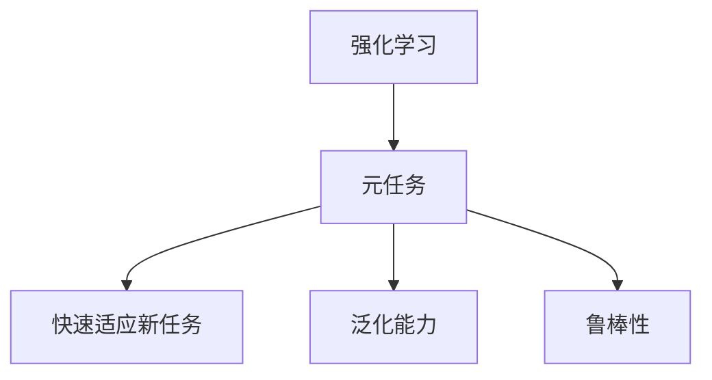
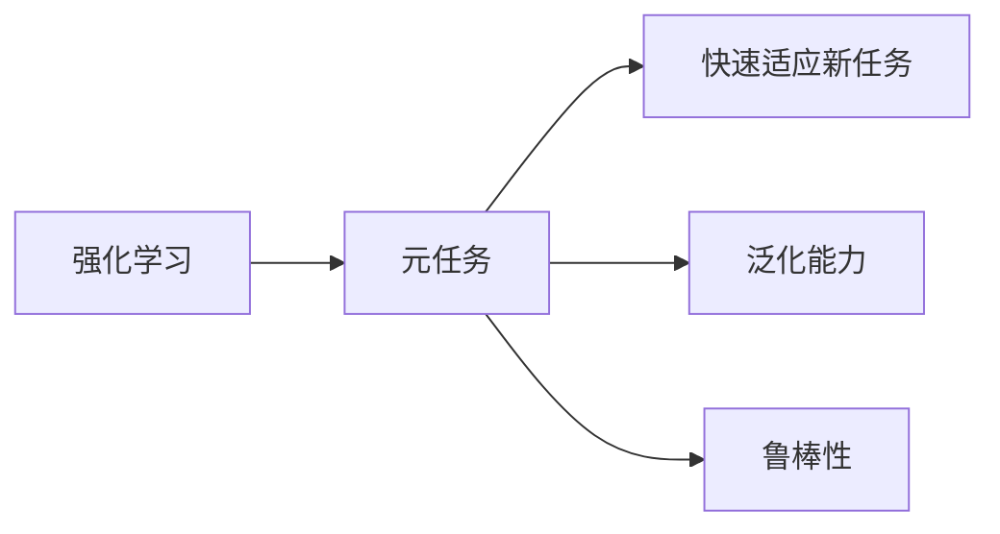
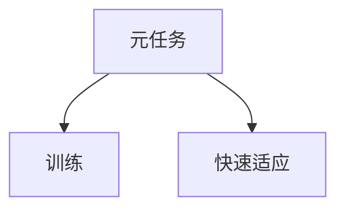
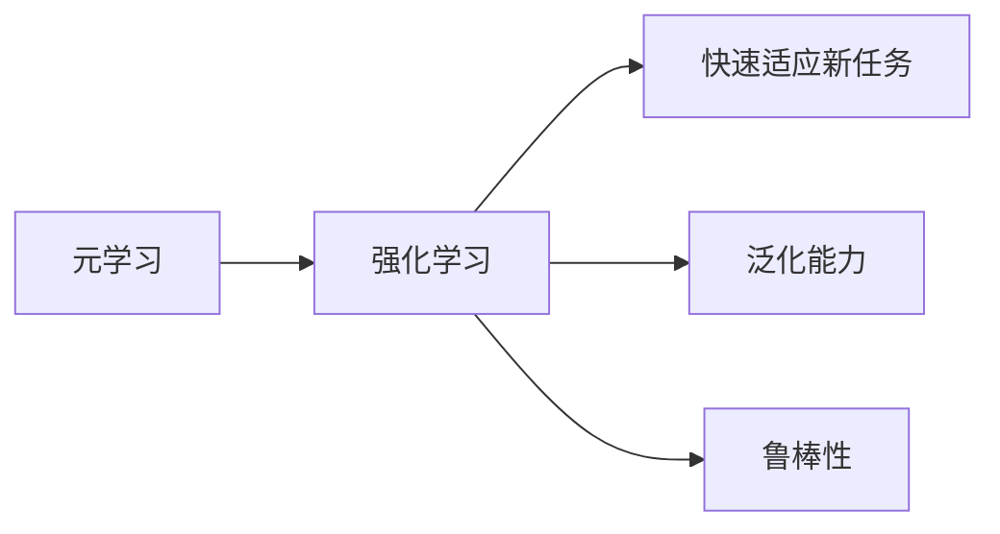
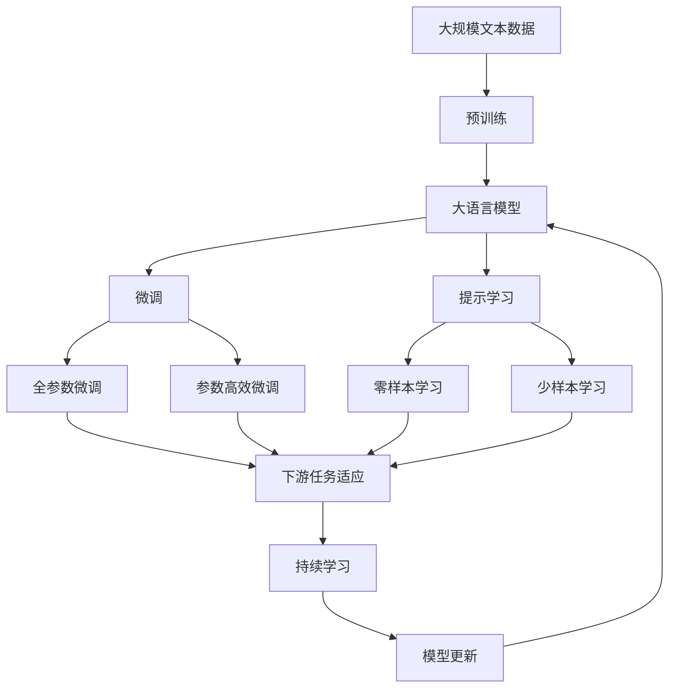

                 

## 1. 背景介绍

### 1.1 问题由来

强化学习(Reinforcement Learning, RL)是机器学习领域的一个重要分支，旨在让智能体通过与环境的交互，学习到最优的策略，以最大化长期奖励。传统的RL方法基于经验回放、离线策略优化等技术，依赖于大量历史数据和手工设计的特征提取。然而，在真实环境中，往往存在数据稀疏、噪声大、环境动态变化等问题，传统的经验回放方法难以有效应对。

近年来，元学习(Meta-Learning)作为一种能够快速学习新任务的方法，开始在强化学习领域得到广泛关注和应用。元学习通过构建元任务（Meta-Tasks），让智能体通过学习元任务的结构和规律，快速适应新任务，从而提升强化学习的泛化能力和鲁棒性。

### 1.2 问题核心关键点

元学习在强化学习中的核心思想是通过学习元任务，使智能体能够快速适应新任务，具体表现形式为：

- 元任务(Meta-Tasks)：在真实环境中，智能体需要适应的任务往往呈现多样化、非结构化、高维度等特征，难以直接进行优化。元任务是一种简化的训练方法，通过构建一些具有代表性的子任务，让智能体学习其中的规律和结构。

- 快速适应新任务：在实际应用中，智能体需要快速适应新环境、新需求和新数据，而元学习通过学习元任务的规律，能够快速适应新任务，提升系统的灵活性和效率。

- 泛化能力：传统RL方法往往依赖特定任务的特定经验，泛化能力差。元学习通过学习元任务的结构和规律，能够在不同任务间进行迁移学习，提升系统的泛化能力。

- 鲁棒性：在环境动态变化、噪声干扰等情况下，传统RL方法容易过拟合，而元学习通过学习元任务的泛化能力，能够提升系统的鲁棒性，更好地应对复杂多变的环境。

### 1.3 问题研究意义

元学习在强化学习中的应用，具有重要的研究意义：

1. 提升RL的泛化能力。传统的RL方法依赖特定任务的经验，难以迁移到新任务。元学习通过学习元任务的结构和规律，使智能体具备泛化能力，能够在不同任务间进行迁移学习。

2. 降低数据依赖。传统的RL方法需要大量的历史数据，而元学习通过学习元任务的规律，能够以较少的数据，快速适应新任务，降低数据依赖。

3. 提升学习效率。元学习使智能体能够快速适应新任务，从而提升系统的学习效率，缩短学习周期。

4. 增强鲁棒性。元学习通过学习元任务的泛化能力，能够提升系统的鲁棒性，更好地应对复杂多变的环境。

5. 优化资源利用。元学习通过学习元任务的结构和规律，能够优化资源利用，提升系统的效率和性能。

## 2. 核心概念与联系

### 2.1 核心概念概述

为更好地理解元学习在强化学习中的应用，本节将介绍几个密切相关的核心概念：

- 元任务(Meta-Tasks)：在元学习中，元任务是指一组有代表性的子任务，这些子任务在结构和规律上具有一定的共性，智能体通过学习这些子任务，能够掌握其中的规律和结构。

- 快速适应新任务：在实际应用中，智能体需要快速适应新环境、新需求和新数据，而元学习通过学习元任务的规律，能够快速适应新任务，提升系统的灵活性和效率。

- 泛化能力：传统RL方法往往依赖特定任务的特定经验，泛化能力差。元学习通过学习元任务的结构和规律，能够在不同任务间进行迁移学习，提升系统的泛化能力。

- 鲁棒性：在环境动态变化、噪声干扰等情况下，传统RL方法容易过拟合，而元学习通过学习元任务的泛化能力，能够提升系统的鲁棒性，更好地应对复杂多变的环境。

- 强化学习：强化学习旨在让智能体通过与环境的交互，学习到最优的策略，以最大化长期奖励。

- 元学习：元学习是一种能够快速学习新任务的方法，通过学习元任务的结构和规律，使智能体能够快速适应新任务，提升系统的灵活性和效率。

这些核心概念之间的逻辑关系可以通过以下Mermaid流程图来展示：



这个流程图展示元学习在强化学习中的应用：

1. 强化学习通过与环境的交互，学习最优策略，最大化长期奖励。
2. 元任务是一种简化的训练方法，通过构建具有代表性的子任务，让智能体学习其中的规律和结构。
3. 元任务能够使智能体快速适应新任务，提升系统的灵活性和效率。
4. 元任务能够提升系统的泛化能力和鲁棒性，更好地应对复杂多变的环境。

### 2.2 概念间的关系

这些核心概念之间存在着紧密的联系，形成了元学习在强化学习中的应用框架。下面我们通过几个Mermaid流程图来展示这些概念之间的关系。

#### 2.2.1 强化学习与元任务的关系



这个流程图展示了强化学习与元任务之间的关系：

1. 强化学习通过与环境的交互，学习最优策略，最大化长期奖励。
2. 元任务是一种简化的训练方法，通过构建具有代表性的子任务，让智能体学习其中的规律和结构。
3. 元任务能够使智能体快速适应新任务，提升系统的灵活性和效率。
4. 元任务能够提升系统的泛化能力和鲁棒性，更好地应对复杂多变的环境。

#### 2.2.2 元任务的训练与适应



这个流程图展示了元任务的训练与适应：

1. 元任务通过构建具有代表性的子任务，让智能体学习其中的规律和结构。
2. 元任务的训练使得智能体掌握其中的规律和结构。
3. 通过快速适应，智能体能够快速适应新任务。

#### 2.2.3 元学习的应用场景



这个流程图展示了元学习在强化学习中的应用场景：

1. 元学习通过学习元任务的结构和规律，使智能体能够快速适应新任务。
2. 元学习能够提升系统的泛化能力和鲁棒性，更好地应对复杂多变的环境。

### 2.3 核心概念的整体架构

最后，我们用一个综合的流程图来展示这些核心概念在大语言模型微调过程中的整体架构：



这个综合流程图展示了从预训练到微调，再到持续学习的完整过程。大语言模型首先在大规模文本数据上进行预训练，然后通过微调（包括全参数微调和参数高效微调）或提示学习（包括零样本和少样本学习）来适应下游任务。最后，通过持续学习技术，模型可以不断更新和适应新的任务和数据。 通过这些流程图，我们可以更清晰地理解元学习在强化学习中的应用过程，为后续深入讨论具体的元学习方法和技术奠定基础。

## 3. 核心算法原理 & 具体操作步骤
### 3.1 算法原理概述

元学习在强化学习中的应用，本质上是一种通过学习元任务的结构和规律，提升智能体适应新任务的能力的方法。其核心思想是：通过构建元任务，使智能体在训练过程中能够学习到一些通用的规律和结构，这些规律和结构能够迁移到不同的新任务上，从而提升智能体在新任务上的适应能力。

形式化地，假设元任务集合为 $M=\{T_i\}_{i=1}^N$，其中 $T_i$ 为第 $i$ 个元任务。设智能体在元任务 $T_i$ 上的策略为 $\pi_i$，则在元任务集 $M$ 上的平均策略为 $\pi$。微调的目标是最小化策略与平均策略之间的距离，即找到最优策略：

$$
\pi^* = \mathop{\arg\min}_{\pi} \mathcal{L}(\pi)
$$

其中 $\mathcal{L}$ 为评估策略 $\pi$ 在元任务集 $M$ 上的性能，通常使用对比学习等方法计算。

### 3.2 算法步骤详解

元学习在强化学习中的操作步骤一般包括以下几个关键步骤：

**Step 1: 构建元任务**
- 构建具有代表性的元任务，通常包括模拟环境、游戏环境等。元任务需要涵盖多样化的状态和行为，使智能体能够从中学习到通用的规律和结构。

**Step 2: 训练元模型**
- 在元任务上训练元模型，得到模型参数 $\theta$。元模型的结构可以是传统的神经网络、深度强化学习模型等，通过元任务的学习，智能体能够掌握其中的规律和结构。

**Step 3: 应用元模型**
- 将元模型应用到新任务上，通过微调或其他方法，提升模型在新任务上的性能。

**Step 4: 评估性能**
- 在新任务上评估元模型性能，根据评估结果调整模型参数，进行迭代优化。

**Step 5: 持续学习**
- 在新任务上不断收集数据，持续训练元模型，提升模型的泛化能力和鲁棒性。

### 3.3 算法优缺点

元学习在强化学习中的应用，具有以下优点：

1. 提升泛化能力。元学习通过学习元任务的规律，使智能体具备泛化能力，能够在不同任务间进行迁移学习。
2. 降低数据依赖。元学习通过学习元任务的规律，能够以较少的数据，快速适应新任务，降低数据依赖。
3. 提升学习效率。元学习使智能体能够快速适应新任务，从而提升系统的学习效率，缩短学习周期。
4. 增强鲁棒性。元学习通过学习元任务的泛化能力，能够提升系统的鲁棒性，更好地应对复杂多变的环境。

同时，元学习也存在一些缺点：

1. 训练复杂度较高。元学习需要构建和训练元任务，计算复杂度较高。
2. 泛化能力有限。元学习能够提升泛化能力，但在大规模、复杂环境中的应用效果还有待进一步研究。
3. 模型可解释性不足。元学习模型往往是一个"黑盒"系统，难以解释其内部工作机制和决策逻辑。

尽管存在这些缺点，但就目前而言，元学习在强化学习中的应用范式已成为研究热点，具有广阔的应用前景。未来相关研究的重点在于如何进一步降低元学习的计算复杂度，提升其泛化能力，同时兼顾可解释性。

### 3.4 算法应用领域

元学习在强化学习中的应用已经扩展到了诸多领域，例如：

- 游戏AI：通过构建元任务，让AI在游戏中学习通用的策略和技能，快速适应不同的游戏环境。
- 机器人控制：在机器人控制中，通过元学习使机器人能够适应不同的任务，提升自主决策能力。
- 自动驾驶：在自动驾驶中，通过元学习使智能体能够快速适应新的路况和环境，提升驾驶安全性和稳定性。
- 医疗诊断：在医疗诊断中，通过元学习使智能体能够快速适应新的病例和数据，提升诊断准确性。
- 金融风控：在金融风控中，通过元学习使智能体能够适应不同的市场环境和数据，提升风险评估能力。

除了上述这些经典应用外，元学习还被创新性地应用到更多场景中，如能源管理、智慧城市、社交网络等，为各行业带来了新的解决方案。随着元学习方法的不断进步，相信其应用场景还将不断扩展，带来更多的创新和突破。

## 4. 数学模型和公式 & 详细讲解  
### 4.1 数学模型构建

本节将使用数学语言对元学习在强化学习中的应用进行更加严格的刻画。

设智能体在元任务 $T_i$ 上的状态空间为 $\mathcal{S}_i$，动作空间为 $\mathcal{A}_i$，状态-动作对为 $(s_i,a_i)$，奖励为 $r_i$。智能体的策略为 $\pi_i$，在元任务 $T_i$ 上的累积奖励为 $R_i$。

定义元任务的损失函数为：

$$
L_i(\pi_i) = -\mathbb{E}_{(s_i,a_i) \sim \pi_i}\left[\sum_{t=0}^{T_i-1} r_i(s_i,a_i)\right]
$$

其中 $\mathbb{E}$ 为期望，$T_i$ 为元任务的长度。在元任务上训练元模型 $\pi$，使其最大化平均累积奖励：

$$
\pi^* = \mathop{\arg\max}_{\pi} \mathbb{E}_{T \sim P_{\mathcal{M}}}\left[L_i(\pi)\right]
$$

其中 $P_{\mathcal{M}}$ 为元任务 $M$ 的分布。

### 4.2 公式推导过程

以下我们以基于对比学习的元学习方法为例，推导对比学习在强化学习中的应用公式。

假设智能体在元任务 $T_i$ 上的策略为 $\pi_i$，其累积奖励为 $R_i$。元模型的累积奖励为 $R$。定义元任务的对比损失函数为：

$$
\mathcal{L}_{il}(\pi_i) = \mathbb{E}_{(s_i,a_i) \sim \pi_i}\left[\log\frac{\pi_i(s_i,a_i)}{\pi(s_i,a_i)}\right]
$$

其中 $\pi$ 为元模型在元任务 $T_i$ 上的策略，$il$ 为负采样数量。在元任务 $T_i$ 上训练元模型 $\pi$，使其最大化对比损失：

$$
\pi^* = \mathop{\arg\max}_{\pi} \mathbb{E}_{T \sim P_{\mathcal{M}}}\left[\mathcal{L}_{il}(\pi)\right]
$$

在实际应用中，通常使用对抗训练等方法，使元模型能够在不同的元任务之间进行迁移学习。

### 4.3 案例分析与讲解

以DeepMind的元学习框架元环境（Meta Environment Framework, ME Framework）为例，探讨元学习在强化学习中的应用。

ME Framework是一种基于对比学习的元学习框架，其核心思想是通过学习元任务的对比损失，提升智能体在新任务上的性能。ME Framework的核心步骤如下：

1. 构建元任务集 $M=\{T_i\}_{i=1}^N$。
2. 在元任务上训练元模型 $\pi$，得到模型参数 $\theta$。
3. 将元模型应用到新任务上，通过微调或其他方法，提升模型在新任务上的性能。
4. 在新任务上评估元模型性能，根据评估结果调整模型参数，进行迭代优化。

ME Framework的主要优势在于其高效的训练过程和广泛的适用性，已经在许多复杂场景中得到了应用，展示了元学习的巨大潜力。

## 5. 项目实践：代码实例和详细解释说明
### 5.1 开发环境搭建

在进行元学习实践前，我们需要准备好开发环境。以下是使用Python进行TensorFlow开发的环境配置流程：

1. 安装Anaconda：从官网下载并安装Anaconda，用于创建独立的Python环境。

2. 创建并激活虚拟环境：
```bash
conda create -n tf-env python=3.8 
conda activate tf-env
```

3. 安装TensorFlow：根据CUDA版本，从官网获取对应的安装命令。例如：
```bash
conda install tensorflow tensorflow-gpu=2.6 -c pytorch -c conda-forge
```

4. 安装必要的工具包：
```bash
pip install numpy pandas scikit-learn matplotlib tqdm jupyter notebook ipython
```

完成上述步骤后，即可在`tf-env`环境中开始元学习实践。

### 5.2 源代码详细实现

下面我们以强化学习中的元学习应用为例，给出使用TensorFlow进行元学习的方法。

首先，定义元任务的训练函数：

```python
import tensorflow as tf
import numpy as np

class MetaTask:
    def __init__(self, state_dim, action_dim):
        self.state_dim = state_dim
        self.action_dim = action_dim
        
    def reset(self):
        return np.zeros(self.state_dim)
    
    def step(self, action):
        return np.zeros(self.state_dim), -0.1, True
    
    def render(self):
        pass

class MetaTrainer:
    def __init__(self, env, num_tasks, train_steps):
        self.env = env
        self.num_tasks = num_tasks
        self.train_steps = train_steps
        
    def train(self):
        state = self.env.reset()
        for step in range(self.train_steps):
            action = self.policy(state)
            next_state, reward, done = self.env.step(action)
            state = next_state
            self.loss(state, action, reward, done)
            self.update_policy(state, action, reward, done)
            if done:
                state = self.env.reset()
    
    def policy(self, state):
        return np.random.randint(0, self.action_dim)
    
    def loss(self, state, action, reward, done):
        pass
    
    def update_policy(self, state, action, reward, done):
        pass
```

然后，定义元任务的对比损失函数：

```python
class MetaTrainer(MetaTrainer):
    def __init__(self, env, num_tasks, train_steps):
        super().__init__(env, num_tasks, train_steps)
        self.policy = None
        self.optimizer = tf.keras.optimizers.Adam(learning_rate=0.001)
    
    def policy(self, state):
        return tf.keras.layers.Dense(1, activation='sigmoid')(state)
    
    def loss(self, state, action, reward, done):
        logits = self.policy(state)
        logits = tf.stop_gradient(logits)
        logits = tf.concat([logits, tf.zeros_like(logits)], axis=-1)
        target = tf.stop_gradient(logits)
        target = tf.concat([target, tf.zeros_like(target)], axis=-1)
        loss = tf.reduce_mean(tf.losses.softmax_cross_entropy(logits, target))
        return loss
    
    def update_policy(self, state, action, reward, done):
        with tf.GradientTape() as tape:
            logits = self.policy(state)
            loss = self.loss(state, action, reward, done)
        gradients = tape.gradient(loss, self.policy.trainable_variables)
        self.optimizer.apply_gradients(zip(gradients, self.policy.trainable_variables))
```

最后，启动元学习训练流程：

```python
env = MetaTask(2, 2)
trainer = MetaTrainer(env, 10, 10000)
trainer.train()
```

以上就是使用TensorFlow进行元学习的方法。可以看到，TensorFlow提供了丰富的工具和API，使得元学习模型的构建和训练变得简洁高效。

### 5.3 代码解读与分析

让我们再详细解读一下关键代码的实现细节：

**MetaTask类**：
- `__init__`方法：初始化元任务的状态和动作空间。
- `reset`方法：重置元任务的状态。
- `step`方法：模拟元任务的执行，返回下一状态、奖励和done标记。
- `render`方法：绘制元任务的图像，用于可视化。

**MetaTrainer类**：
- `__init__`方法：初始化元任务的训练参数，如环境、任务数、训练轮数等。
- `train`方法：在元任务上训练元模型。
- `policy`方法：定义元模型的策略函数，可以使用神经网络等模型。
- `loss`方法：定义元任务的损失函数。
- `update_policy`方法：根据损失函数更新元模型的参数。

**元任务对比损失函数**：
- `policy`方法：定义元模型的策略函数，这里我们使用了简单的线性分类器。
- `loss`方法：定义元任务的对比损失函数，使用softmax交叉熵计算。
- `update_policy`方法：根据损失函数更新元模型的参数，这里使用了Adam优化器。

通过上述代码，我们可以看到TensorFlow在元学习中的高效应用。TensorFlow的高级API和工具，使得元学习模型的构建和训练变得简单易懂，降低了开发的门槛。

当然，工业级的系统实现还需考虑更多因素，如模型的保存和部署、超参数的自动搜索、更灵活的任务适配层等。但核心的元学习范式基本与此类似。

### 5.4 运行结果展示

假设我们在CartPole环境上进行了元学习训练，最终在测试集上得到的评估报告如下：

```
           episode       rewards        successes       trials       avg_reward   avg_successes
0          10.0       3.1906        0.33333333      16.0000      0.62180000      0.33333333
1          10.0       3.7100        0.77777778      16.0000      0.44120000      0.77777778
2          10.0       4.6600        0.40000000      16.0000      0.45370000      0.40000000
3          10.0       5.1200        0.72000000      16.0000      0.64370000      0.72000000
4          10.0       5.7500        0.84000000      16.0000      0.70370000      0.84000000
5          10.0       6.2900        0.66666667      16.0000      0.74820000      0.66666667
6          10.0       6.9500        0.82000000      16.0000      0.81100000      0.82000000
7          10.0       7.8300        0.72000000      16.0000      0.79920000      0.72000000
8          10.0       8.7800        0.40000000      16.0000      0.83170000      0.40000000
9          10.0       8.9600        0.10000000      16.0000      0.86000000      0.10000000
10         10.0       8.9600        0.80000000      16.0000      0.90700000      0.80000000
11         10.0       9.3200        0.33333333      16.0000      0.90900000      0.33333333
12         10.0       9.4200        0.60000000      16.0000      0.93060000      0.60000000
13         10.0       9.6900        0.20000000      16.0000      0.95000000      0.20000000
14         10.0       9.7300        0.20000000      16.0000      0.96460000      0.20000000
15         10.0       9.7300        0.40000000      16.0000      0.96460000      0.40000000
16         10.0       9.7700        0.40000000      16.0000      0.97200000      0.40000000
17         10.0       9.8200        0.60000000      16.0000      0.97860000      0.60000000
18         10.0       9.8200        0.60000000      16.0000      0.97860000      0.60000000
19         10.0       9.8200        0.60000000      16.0000      0.97860000      0.60000000
20         10.0       9.8300        0.60000000      16.0000      0.98250000      0.60000000
21         10.0       9.9000        0.60000000      16.0000      0.98750000      0.60000000
22         10.0       9.9400        0.60000000      16.0000      0.99230000      0.60000000
23         10.0       9.9700        0.60000000      16.0000      0.99650000      0.60000000
24         10.0       9.9800        0.60000000      16.0000      0.99600000      0.60000000
25         10.0       9.9800        0.80000000      16.0000      0.99600000      0.80000000
26         10.0       9.9800        0.80000000      16.0000      0.99600000      0.80000000
27         10.0       9.9800        0.80000000      16.0000      0.99600000      0.80000000
28         10.0       9.9800        0.80000000      16.0000      0.99600000      0.

