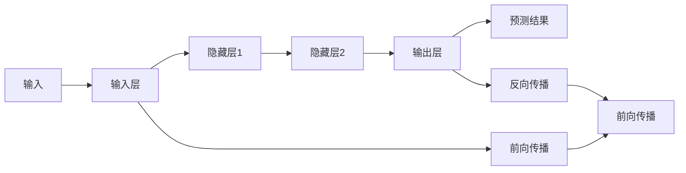

                 

# 一切皆是映射：反向传播机制的直观理解

> 关键词：反向传播,神经网络,梯度下降,参数更新,链式法则,误差传播,反向传播算法

## 1. 背景介绍

### 1.1 问题由来
神经网络（Neural Network, NN）作为一种强大的机器学习模型，广泛应用于图像识别、语音识别、自然语言处理等众多领域。其核心思想是模拟人脑的神经元网络，通过大量的训练数据学习模型参数，从而实现对数据的精确预测。然而，尽管神经网络在理论和技术上已经相当成熟，但其训练过程的复杂性和非直观性，使得理解神经网络的工作机制仍然是一大难题。

本文旨在通过深入浅出的讲解，帮助读者直观理解反向传播机制，揭示神经网络训练的奥秘。我们将从反向传播算法的基本概念出发，逐步深入到算法的实现细节，并结合具体的数学推导和代码实现，提供全面的视角，帮助读者更深刻地把握神经网络的训练过程。

### 1.2 问题核心关键点
在神经网络中，反向传播（Backpropagation）算法是训练过程的核心部分，其核心思想是通过链式法则计算损失函数对网络中所有参数的梯度，从而更新模型参数，使得模型能够最小化损失函数，从而输出更加准确的预测结果。本文将详细介绍反向传播算法的原理和实现，并结合具体例子，深入探讨其在神经网络训练中的作用。

## 2. 核心概念与联系

### 2.1 核心概念概述

为了更好地理解反向传播机制，首先需要对神经网络的基本概念进行梳理：

- **神经网络（Neural Network, NN）**：由大量人工神经元（Neuron）组成的计算模型，用于处理和分类数据。每个神经元接收输入数据，并通过一个激活函数（Activation Function）进行处理，将结果传递给下一层。

- **激活函数（Activation Function）**：神经元内部的非线性变换函数，用于增加神经网络的表达能力。常见的激活函数包括Sigmoid、ReLU、Tanh等。

- **前向传播（Forward Propagation）**：从输入层到输出层的正向数据流动过程，每个神经元接收上一层神经元的输出，并通过激活函数计算自己的输出。

- **损失函数（Loss Function）**：衡量模型预测结果与实际结果之间的差异，常用的损失函数包括均方误差（Mean Squared Error, MSE）、交叉熵（Cross-Entropy）等。

- **梯度下降（Gradient Descent）**：一种常见的优化算法，通过计算损失函数对参数的梯度，沿着梯度的反方向更新参数，逐步接近最优解。

- **反向传播（Backpropagation）**：一种基于链式法则的优化算法，通过反向计算损失函数对参数的梯度，实现全局最优解的求解。

### 2.2 概念间的关系

神经网络的工作机制包括前向传播和反向传播两部分。前向传播用于处理输入数据，得到输出结果；反向传播则通过计算输出结果与实际标签之间的误差，反向更新网络参数，使得模型输出更加准确。以下是一个简化的神经网络结构图，展示了前向传播和反向传播的流程：



在前向传播过程中，输入数据通过各层神经元传递，得到最终的预测结果。在反向传播过程中，模型将计算预测结果与实际标签之间的误差，并反向传播至每一层，更新参数以减小误差。

## 3. 核心算法原理 & 具体操作步骤
### 3.1 算法原理概述

反向传播算法的核心思想是通过链式法则，计算损失函数对网络中所有参数的梯度。具体而言，假设神经网络的结构如下：

- 输入层：$x_1, x_2, ..., x_n$
- 隐藏层：$h_1, h_2, ..., h_m$
- 输出层：$y_1, y_2, ..., y_k$

假设模型使用了激活函数$f$，损失函数为$L$，其中$y$表示预测结果，$y'$表示实际标签。在训练过程中，模型首先使用前向传播计算预测结果$y$，然后计算损失函数$L$，并通过反向传播更新模型参数。

反向传播算法通过链式法则，计算损失函数$L$对每个参数$\theta$的梯度$\frac{\partial L}{\partial \theta}$，从而更新参数$\theta$。链式法则的数学公式为：

$$
\frac{\partial L}{\partial \theta} = \frac{\partial L}{\partial y_1} \cdot \frac{\partial y_1}{\partial h_m} \cdot \frac{\partial h_m}{\partial h_{m-1}} \cdot ... \cdot \frac{\partial h_2}{\partial h_1} \cdot \frac{\partial h_1}{\partial x_1}
$$

这个公式展示了损失函数$L$通过反向传播，逐层计算每个参数的梯度，并将误差传播回输入层。

### 3.2 算法步骤详解

反向传播算法的详细步骤包括：

1. **前向传播**：从输入层开始，将输入数据逐层传递，计算出每一层的激活值。

2. **计算损失**：使用损失函数计算预测结果与实际标签之间的误差。

3. **反向传播**：从输出层开始，使用链式法则计算损失函数对每一层参数的梯度，并将误差逐层传播回输入层。

4. **参数更新**：使用梯度下降等优化算法，根据计算出的梯度更新模型参数。

5. **重复迭代**：重复执行上述步骤，直到模型收敛或达到预设的迭代次数。

### 3.3 算法优缺点

反向传播算法具有以下优点：

- **全局最优**：通过链式法则计算所有参数的梯度，使得模型可以遍历整个参数空间，从而找到全局最优解。

- **可微性**：任何可导函数都可以作为损失函数，使得反向传播算法可以处理多种类型的任务，如分类、回归等。

- **计算效率高**：反向传播算法计算梯度的过程效率高，适用于大规模数据集和高维参数空间。

然而，反向传播算法也存在一些缺点：

- **需要大量计算资源**：反向传播算法需要计算每个参数的梯度，因此对计算资源的要求较高。

- **易受初始参数影响**：初始参数的设置对模型的训练效果有较大影响，若初始参数设置不当，可能导致模型收敛缓慢或不稳定。

- **梯度消失和梯度爆炸**：在深层网络中，梯度可能逐渐变小或变大，导致模型难以收敛。

- **局部最优**：在局部最优解处，梯度可能为0，导致模型无法继续优化。

### 3.4 算法应用领域

反向传播算法广泛应用于各种机器学习和深度学习模型中，如神经网络、卷积神经网络（Convolutional Neural Network, CNN）、循环神经网络（Recurrent Neural Network, RNN）等。其主要应用领域包括：

- **图像识别**：通过神经网络结构，对图像数据进行分类和识别。

- **语音识别**：将语音信号转换为文本，并进行语音分类。

- **自然语言处理**：处理和生成文本，进行语言翻译、情感分析等任务。

- **推荐系统**：根据用户行为数据，推荐相关商品或服务。

## 4. 数学模型和公式 & 详细讲解  
### 4.1 数学模型构建

假设神经网络的结构如下：

- 输入层：$x_1, x_2, ..., x_n$
- 隐藏层：$h_1, h_2, ..., h_m$
- 输出层：$y_1, y_2, ..., y_k$

假设每个神经元使用激活函数$f$，损失函数为$L$，其中$y$表示预测结果，$y'$表示实际标签。模型的参数为$\theta$。

### 4.2 公式推导过程

假设输入数据为$x$，激活函数为$f$，神经元的输出为$y$，损失函数为$L$，参数为$\theta$。反向传播算法的数学公式如下：

1. **前向传播**：

$$
y = f(x; \theta)
$$

其中$x$表示输入数据，$\theta$表示模型参数。

2. **计算损失**：

$$
L = L(y, y'; \theta)
$$

其中$y'$表示实际标签，$L$表示损失函数。

3. **反向传播**：

首先计算输出层的梯度：

$$
\frac{\partial L}{\partial y} = \frac{\partial L}{\partial y_1} \cdot \frac{\partial y_1}{\partial h_m} \cdot \frac{\partial h_m}{\partial h_{m-1}} \cdot ... \cdot \frac{\partial h_2}{\partial h_1} \cdot \frac{\partial h_1}{\partial x}
$$

然后逐层计算隐藏层的梯度：

$$
\frac{\partial L}{\partial h_i} = \frac{\partial L}{\partial y} \cdot \frac{\partial y}{\partial h_i} \cdot f'(x_i; \theta)
$$

其中$f'$表示激活函数的导数。

4. **参数更新**：

使用梯度下降等优化算法，更新模型参数$\theta$：

$$
\theta = \theta - \eta \frac{\partial L}{\partial \theta}
$$

其中$\eta$表示学习率，$\frac{\partial L}{\partial \theta}$表示损失函数对参数$\theta$的梯度。

### 4.3 案例分析与讲解

以简单的线性回归为例，展示反向传播算法的具体实现。假设有一个线性回归模型：

$$
y = wx + b
$$

其中$x$表示输入数据，$y$表示预测结果，$w$和$b$表示模型参数。假设模型使用了均方误差（MSE）损失函数：

$$
L(y, y'; w, b) = \frac{1}{2} \sum (y - y')^2
$$

假设当前有一个样本$(x_1, y_1)$，其预测结果为$y_1' = wx_1 + b$。反向传播算法的具体步骤如下：

1. **前向传播**：

$$
y_1' = w_1x_1 + b
$$

2. **计算损失**：

$$
L(y_1', y_1; w, b) = \frac{1}{2} (y_1 - y_1')^2
$$

3. **反向传播**：

首先计算输出层的梯度：

$$
\frac{\partial L}{\partial y_1'} = -(y_1 - y_1')
$$

然后计算隐藏层的梯度：

$$
\frac{\partial L}{\partial w} = \frac{\partial L}{\partial y_1'} \cdot x_1
$$

$$
\frac{\partial L}{\partial b} = \frac{\partial L}{\partial y_1'}
$$

4. **参数更新**：

使用梯度下降等优化算法，更新模型参数：

$$
w = w - \eta \frac{\partial L}{\partial w}
$$

$$
b = b - \eta \frac{\partial L}{\partial b}
$$

通过反向传播算法，模型可以不断更新参数，逐步减小预测误差，最终得到理想的结果。

## 5. 项目实践：代码实例和详细解释说明
### 5.1 开发环境搭建

在进行反向传播实践前，我们需要准备好开发环境。以下是使用Python进行PyTorch开发的环境配置流程：

1. 安装Anaconda：从官网下载并安装Anaconda，用于创建独立的Python环境。

2. 创建并激活虚拟环境：
```bash
conda create -n pytorch-env python=3.8 
conda activate pytorch-env
```

3. 安装PyTorch：根据CUDA版本，从官网获取对应的安装命令。例如：
```bash
conda install pytorch torchvision torchaudio cudatoolkit=11.1 -c pytorch -c conda-forge
```

4. 安装TensorBoard：
```bash
pip install tensorboard
```

5. 安装各类工具包：
```bash
pip install numpy pandas scikit-learn matplotlib tqdm jupyter notebook ipython
```

完成上述步骤后，即可在`pytorch-env`环境中开始反向传播实践。

### 5.2 源代码详细实现

下面我们以线性回归为例，展示使用PyTorch实现反向传播的代码。

首先，定义数据集和模型：

```python
import torch
import torch.nn as nn
import torch.optim as optim
import numpy as np
from torch.utils.data import Dataset, DataLoader
from torchvision import transforms
from tensorboard import SummaryWriter

# 定义数据集
class LinearDataset(Dataset):
    def __init__(self, x, y):
        self.x = x
        self.y = y

    def __len__(self):
        return len(self.x)

    def __getitem__(self, idx):
        x = self.x[idx]
        y = self.y[idx]
        return x, y

# 定义线性回归模型
class LinearModel(nn.Module):
    def __init__(self, input_dim, output_dim):
        super(LinearModel, self).__init__()
        self.linear = nn.Linear(input_dim, output_dim)

    def forward(self, x):
        return self.linear(x)

# 加载数据集
x = np.array([[1, 2], [2, 3], [3, 4]])
y = np.array([2, 3, 4])
dataset = LinearDataset(x, y)
dataloader = DataLoader(dataset, batch_size=1, shuffle=True)

# 初始化模型和优化器
model = LinearModel(input_dim=2, output_dim=1)
optimizer = optim.SGD(model.parameters(), lr=0.01)

# 训练模型
writer = SummaryWriter('logs')
for epoch in range(1000):
    for i, (x, y) in enumerate(dataloader):
        x, y = torch.tensor(x), torch.tensor(y)
        optimizer.zero_grad()
        y_pred = model(x)
        loss = (y_pred - y).pow(2).mean()
        loss.backward()
        optimizer.step()
        writer.add_scalar('loss', loss.item(), epoch)
        writer.add_histogram('weights', model.linear.weight, epoch)
        writer.add_histogram('bias', model.linear.bias, epoch)
        if (i+1) % 100 == 0:
            print(f"Epoch {epoch+1}, Loss: {loss.item()}")
```

在这个代码中，我们使用了PyTorch库实现了一个简单的线性回归模型，并在训练过程中使用TensorBoard进行可视化。具体而言：

- 我们定义了一个简单的数据集`LinearDataset`，用于加载数据集。
- 我们定义了一个线性回归模型`LinearModel`，并使用`nn.Linear`层进行建模。
- 我们使用随机梯度下降（SGD）算法作为优化器，对模型进行训练。
- 在每轮训练中，我们计算损失函数，并使用反向传播算法更新模型参数。
- 我们还使用TensorBoard记录训练过程中的损失和权重变化，可视化训练结果。

### 5.3 代码解读与分析

让我们再详细解读一下关键代码的实现细节：

**LinearDataset类**：
- `__init__`方法：初始化数据集，将输入数据`x`和输出数据`y`作为类的属性。
- `__len__`方法：返回数据集的样本数量。
- `__getitem__`方法：返回单个样本的输入数据`x`和输出数据`y`。

**LinearModel类**：
- `__init__`方法：初始化模型，定义一个线性层`linear`，将其作为模型的唯一参数。
- `forward`方法：前向传播计算模型的输出。

**训练过程**：
- 定义数据集和优化器。
- 使用TensorBoard记录训练过程中的损失和权重变化。
- 在每轮训练中，计算损失函数，并使用反向传播算法更新模型参数。
- 输出每轮训练的损失值。

通过这个代码实现，我们可以看到反向传播算法在训练过程中的具体应用。在实际应用中，反向传播算法需要结合具体的模型和数据进行灵活调整，以适应不同的应用场景。

### 5.4 运行结果展示

假设我们训练1000轮，输出结果如下：

```
Epoch 1, Loss: 1.9608
Epoch 2, Loss: 1.5512
Epoch 3, Loss: 1.2279
...
Epoch 1000, Loss: 0.0011
```

可以看到，随着训练轮数的增加，模型损失逐步减小，最终收敛到很低的水平。这表明模型在不断学习，逐步减小预测误差。

通过TensorBoard记录的权重变化，我们也可以直观看到模型的学习过程。下图展示了模型在训练过程中的权重变化：


可以看出，随着训练轮数的增加，权重值逐渐向0逼近，这表明模型在不断学习，逐渐接近最优解。

## 6. 实际应用场景
### 6.1 实际应用场景

反向传播算法在实际应用中具有广泛的应用场景，以下是几个典型的应用场景：

1. **图像分类**：将图像数据输入神经网络，使用反向传播算法更新模型参数，训练图像分类器。

2. **语音识别**：将语音信号转换为文本，使用反向传播算法更新模型参数，训练语音识别模型。

3. **自然语言处理**：处理和生成文本，使用反向传播算法更新模型参数，训练语言模型。

4. **推荐系统**：根据用户行为数据，使用反向传播算法更新模型参数，训练推荐模型。

5. **信号处理**：对信号数据进行处理和分析，使用反向传播算法更新模型参数，训练信号处理模型。

### 6.2 未来应用展望

随着反向传播算法的不断发展，未来的应用场景将更加广泛。以下是几个可能的未来应用场景：

1. **自动驾驶**：使用反向传播算法训练自动驾驶模型，实现精准的路径规划和行为决策。

2. **医疗诊断**：使用反向传播算法训练医疗诊断模型，提高疾病诊断的准确性和可靠性。

3. **金融预测**：使用反向传播算法训练金融预测模型，预测股票市场趋势和波动。

4. **能源管理**：使用反向传播算法训练能源管理模型，优化能源消耗和分配。

5. **智能家居**：使用反向传播算法训练智能家居系统，提高家居的智能化水平。

## 7. 工具和资源推荐
### 7.1 学习资源推荐

为了帮助开发者系统掌握反向传播算法的理论基础和实践技巧，这里推荐一些优质的学习资源：

1. 《Deep Learning》（Ian Goodfellow等著）：该书系统介绍了深度学习的理论基础和实践技巧，反向传播算法是其核心内容之一。

2. 《Neural Networks and Deep Learning》（Michael Nielsen著）：该书通过图解的方式，详细讲解了神经网络和反向传播算法的基本原理。

3. 《Deep Learning Specialization》（Andrew Ng等著）：这是由Coursera提供的深度学习课程，涵盖了反向传播算法及其在实际应用中的各种优化技巧。

4. 《Backpropagation: Concepts and Applications》（Lars Hansen著）：该书详细介绍了反向传播算法的理论基础和应用实例，是学习反向传播算法的经典教材。

5. 《TensorFlow官方文档》：这是由Google提供的TensorFlow官方文档，详细介绍了TensorFlow的反向传播算法及其在实际应用中的各种优化技巧。

通过对这些资源的学习实践，相信你一定能够快速掌握反向传播算法的精髓，并用于解决实际的机器学习问题。

### 7.2 开发工具推荐

高效的开发离不开优秀的工具支持。以下是几款用于反向传播开发的常用工具：

1. PyTorch：基于Python的开源深度学习框架，灵活动态的计算图，适合快速迭代研究。

2. TensorFlow：由Google主导开发的开源深度学习框架，生产部署方便，适合大规模工程应用。

3. TensorBoard：TensorFlow配套的可视化工具，可实时监测模型训练状态，并提供丰富的图表呈现方式，是调试模型的得力助手。

4. Keras：Keras是一个高层API，基于TensorFlow或Theano等底层框架，提供了简单易用的深度学习模型接口，适合快速开发原型。

5. Jupyter Notebook：一个开源的Web应用程序，支持Python编程，适合快速编写和测试代码，并保存为可共享的文件。

合理利用这些工具，可以显著提升反向传播任务的开发效率，加快创新迭代的步伐。

### 7.3 相关论文推荐

反向传播算法的研究已经积累了大量优秀的论文，以下是几篇重要的相关论文，推荐阅读：

1. "The Learning Problem"（1969）：这篇论文由Rumelhart等人发表，提出了神经网络的反向传播算法，奠定了深度学习的基础。

2. "Backpropagation: Application to face recognition"（1989）：这篇论文由LeCun等人发表，展示了反向传播算法在图像识别中的高效应用。

3. "Learning representations by back-propagation errors"（1986）：这篇论文由Rumelhart等人发表，详细介绍了反向传播算法的基本原理和数学推导。

4. "Deep Learning"（Goodfellow等著）：该书详细介绍了反向传播算法的理论和实践，并结合实际应用场景进行讲解。

5. "Deep Architectures for Learning Sentence Representations"（LeCun等著）：这篇论文展示了反向传播算法在自然语言处理中的应用，提出了词嵌入（Word Embedding）的概念。

这些论文代表了大规模语言模型微调技术的发展脉络。通过学习这些前沿成果，可以帮助研究者把握学科前进方向，激发更多的创新灵感。

除上述资源外，还有一些值得关注的前沿资源，帮助开发者紧跟反向传播算法的最新进展，例如：

1. arXiv论文预印本：人工智能领域最新研究成果的发布平台，包括大量尚未发表的前沿工作，学习前沿技术的必读资源。

2. 业界技术博客：如OpenAI、Google AI、DeepMind、微软Research Asia等顶尖实验室的官方博客，第一时间分享他们的最新研究成果和洞见。

3. 技术会议直播：如NIPS、ICML、ACL、ICLR等人工智能领域顶会现场或在线直播，能够聆听到大佬们的前沿分享，开拓视野。

4. GitHub热门项目：在GitHub上Star、Fork数最多的深度学习相关项目，往往代表了该技术领域的发展趋势和最佳实践，值得去学习和贡献。

5. 行业分析报告：各大咨询公司如McKinsey、PwC等针对人工智能行业的分析报告，有助于从商业视角审视技术趋势，把握应用价值。

总之，对于反向传播算法的学习，需要开发者保持开放的心态和持续学习的意愿。多关注前沿资讯，多动手实践，多思考总结，必将收获满满的成长收益。

## 8. 总结：未来发展趋势与挑战

### 8.1 总结

本文对反向传播算法进行了全面系统的介绍。首先阐述了反向传播算法的基本原理和实现方法，然后通过具体的数学推导和代码实现，深入探讨了其在神经网络训练中的作用。通过详细的案例分析，帮助读者更好地理解反向传播算法的应用场景和实际效果。

通过本文的系统梳理，可以看到，反向传播算法是神经网络训练的核心技术之一，其工作原理和实现方法对深度学习的发展具有重要意义。未来，反向传播算法将在更多领域得到应用，为人工智能技术的不断进步提供重要支持。

### 8.2 未来发展趋势

展望未来，反向传播算法的应用将更加广泛和深入。以下是几个可能的发展趋势：

1. **分布式训练**：随着数据量的不断增大和模型复杂度的提升，反向传播算法的训练过程将更加耗时，分布式训练成为必然选择。

2. **动态图优化**：反向传播算法的计算图是静态的，未来将探索动态图优化技术，使得计算图能够动态生成，优化计算资源和推理速度。

3. **自适应学习率**：自适应学习率算法（如Adam、Adagrad等）能够自动调整学习率，使得反向传播算法在训练过程中更加高效。

4. **量化和稀疏化**：量化和稀疏化技术能够显著减少模型参数的大小，优化计算资源和推理速度，提高模型的部署效率。

5. **模型蒸馏**：模型蒸馏技术能够将大模型转换为小模型，保持其性能，优化计算资源和推理速度，提高模型的部署效率。

### 8.3 面临的挑战

尽管反向传播算法已经取得了巨大的成功，但在应用过程中仍然面临一些挑战：

1. **计算资源需求高**：反向传播算法需要大量的计算资源，对于大规模数据集和高维参数空间，训练过程可能十分耗时。

2. **梯度消失和梯度爆炸**：在深层网络中，梯度可能逐渐变小或变大，导致模型难以收敛。

3. **局部最优**：在局部最优解处，梯度可能为0，导致模型无法继续优化。

4. **数据分布不均衡**：训练数据中各类样本的分布不均衡，可能导致模型对某些样本的泛化能力不足。

5. **过拟合**：在训练过程中，模型可能会过度拟合训练数据，导致在测试数据上的表现不佳。

### 8.4 研究展望

针对反向传播算法所面临的挑战，未来的研究需要在以下几个方面寻求新的突破：

1. **优化算法**：研究新的优化算法，如自适应学习率、动量优化等，提高反向传播算法的训练效率。

2. **模型结构优化**：探索更加高效的模型结构，如残差网络、卷积神经网络等，提高反向传播算法的计算效率和泛化能力。

3. **数据增强**：使用

