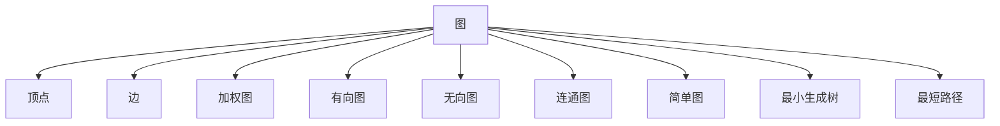
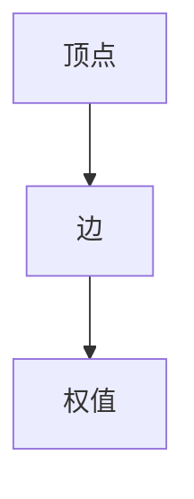
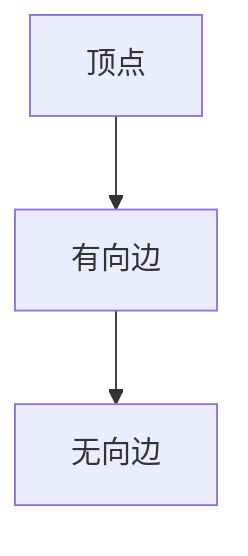
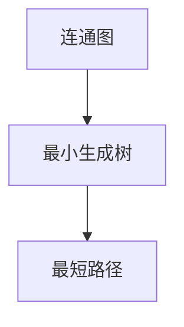
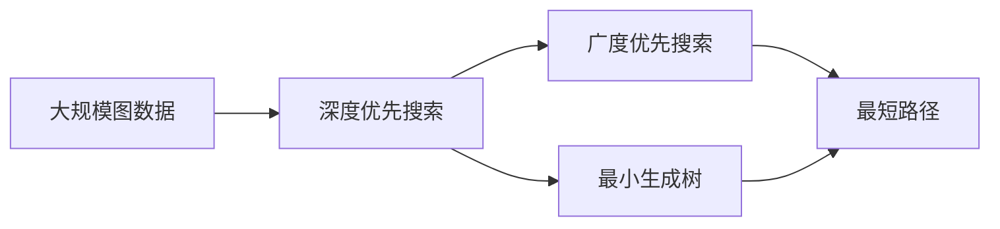

                 

# 【AI大数据计算原理与代码实例讲解】图算法

> 关键词：图算法,图论,网络流算法,深度优先搜索,广度优先搜索,最小生成树,最短路径,拓扑排序

## 1. 背景介绍

### 1.1 问题由来
图算法是计算机科学中一类重要算法，广泛应用于数据挖掘、社交网络分析、路径规划、电路设计等领域。图的表示模型最早起源于图论，在20世纪60年代开始得到大规模应用，成为现代计算机科学的重要组成部分。随着计算技术的发展，图算法在求解大规模图数据集上得到了长足的进步。例如，深度优先搜索、广度优先搜索、最小生成树、最短路径等算法在现代数据处理中被广泛应用。

图算法根据求解任务的不同，可以分为基于深度优先搜索、基于广度优先搜索、基于网络流算法、基于拓扑排序等几大类。其中，基于深度优先搜索和广度优先搜索算法用于图遍历，而最小生成树和最短路径算法则用于图分析。本文将重点介绍基于深度优先搜索、广度优先搜索、最小生成树、最短路径等经典图算法，并配以代码实例讲解，帮助读者更好地理解和应用这些算法。

## 2. 核心概念与联系

### 2.1 核心概念概述

为了更好地理解图算法的核心概念，本节将介绍几个密切相关的核心概念：

- 图（Graph）：图是由顶点（Vertex）和边（Edge）组成的集合。顶点表示实体，边表示实体间的关系或连接。
- 加权图（Weighted Graph）：每条边都有一个非负实数权值，表示边的重要性。
- 有向图（Directed Graph）：边有方向的图，用于描述因果、先后等关系。
- 无向图（Undirected Graph）：边无方向的图，用于描述对称或等价关系。
- 连通图（Connected Graph）：任意两个顶点都可达的图，用于描述全局关系。
- 简单图（Simple Graph）：无自环、无重复边的图，用于描述独立关系。
- 最小生成树（Minimum Spanning Tree，MST）：加权连通无向图的生成树，其权值之和最小。
- 最短路径（Shortest Path）：两点间路径权值之和最小的路径。

这些核心概念之间的逻辑关系可以通过以下Mermaid流程图来展示：



这个流程图展示了几类常见图数据结构之间的逻辑关系：

1. 图由顶点和边构成。
2. 加权图通过赋予每条边权值，表示边的重要性。
3. 有向图和无向图分别表示边有向和无向的情况。
4. 连通图和简单图分别表示任意顶点可达和无自环、无重复边的图。
5. 最小生成树和最短路径是连通图和简单图的子集。

这些概念共同构成了图算法的基本框架，使得我们可以更清晰地理解图算法的工作原理和应用场景。

### 2.2 概念间的关系

这些核心概念之间存在着紧密的联系，形成了图算法的基本生态系统。下面我通过几个Mermaid流程图来展示这些概念之间的关系。

#### 2.2.1 图的基本构成


这个流程图展示了图的两个基本构成部分：顶点和边。

#### 2.2.2 加权图的表示



这个流程图展示了加权图的构成：顶点通过边连接，每条边都有一个权值表示边的重要性。

#### 2.2.3 有向图和无向图的区别



这个流程图展示了有向图和无向图的区别：有向图通过有向边表示顶点间的方向关系，而无向图则通过无向边表示对称或等价关系。

#### 2.2.4 最小生成树和最短路径的关系



这个流程图展示了最小生成树和最短路径的关系：最小生成树是连通图的一种特殊情况，而最短路径算法则用于求解图中的最短路径，通常是在最小生成树的基础上进行求解。

### 2.3 核心概念的整体架构

最后，我用一个综合的流程图来展示这些核心概念在大规模图数据处理中的应用：



这个综合流程图展示了从大规模图数据处理到算法应用的完整过程：

1. 大规模图数据存储和读取。
2. 深度优先搜索和广度优先搜索算法用于图遍历和搜索。
3. 最小生成树算法用于求解加权连通无向图的生成树。
4. 最短路径算法用于求解两点间路径权值之和最小的路径。
5. 深度优先搜索、广度优先搜索、最小生成树和最短路径算法分别应用到图遍历、图分析等任务中，完成图数据处理任务。

这些核心概念和流程图，为我们理解和应用图算法提供了清晰的逻辑框架和应用场景，接下来，我将重点介绍几种经典图算法及其代码实例。

## 3. 核心算法原理 & 具体操作步骤
### 3.1 算法原理概述

图算法根据求解任务的不同，可以分为基于深度优先搜索、基于广度优先搜索、基于网络流算法、基于拓扑排序等几大类。以下重点介绍几种经典图算法及其原理。

- **深度优先搜索（Depth-First Search，DFS）**：从起点开始，不断递归访问与当前节点相邻的未访问节点，直到找到目标节点或遍历完整个图。
- **广度优先搜索（Breadth-First Search，BFS）**：从起点开始，逐层遍历访问与当前节点相邻的未访问节点，直到找到目标节点或遍历完整个图。
- **最小生成树（Minimum Spanning Tree，MST）**：求解加权连通无向图的生成树，其权值之和最小。
- **最短路径（Shortest Path）**：两点间路径权值之和最小的路径。

这些算法具有不同的应用场景和求解思路，但都基于图的基本特性：连通性和路径可达性。接下来，我们将通过详细的步骤和代码实例，逐一讲解这些经典算法。

### 3.2 算法步骤详解

#### 3.2.1 深度优先搜索

**算法步骤**：

1. 选取一个未访问的起点，标记为已访问。
2. 访问当前节点及其相邻的未访问节点。
3. 对于每个相邻的未访问节点，递归执行步骤2，直到找到目标节点或遍历完整个图。

**代码实现**：

```python
def dfs(graph, start, target):
    visited = set()
    stack = [start]
    while stack:
        node = stack.pop()
        if node == target:
            return True
        if node not in visited:
            visited.add(node)
            stack.extend([n for n in graph[node] if n not in visited])
    return False
```

**代码解读**：

- `graph`为图的邻接表表示，其中`graph[node]`为与`node`相邻的节点集合。
- `start`为起点，`target`为目标节点。
- `visited`为已访问节点集合，避免重复访问。
- `stack`为栈，用于存储待访问节点。
- 深度优先搜索的实现使用了递归，每次从栈中弹出一个节点进行访问，直到找到目标节点或栈为空。

**运行结果**：

假设我们有一个图：

```
    1 -- 2 -- 3
    |    |
    4 -- 5
```

我们可以使用以下代码进行深度优先搜索，从节点1开始查找节点5：

```python
graph = {1: [2, 4], 2: [1, 3, 5], 3: [2], 4: [1], 5: [2]}
print(dfs(graph, 1, 5))
```

输出结果为`True`，说明从节点1出发可以找到节点5。

#### 3.2.2 广度优先搜索

**算法步骤**：

1. 选取一个未访问的起点，标记为已访问。
2. 访问当前节点及其相邻的未访问节点。
3. 对于每个相邻的未访问节点，入队，并标记为已访问。
4. 重复步骤2，直到找到目标节点或遍历完整个图。

**代码实现**：

```python
from collections import deque

def bfs(graph, start, target):
    visited = set()
    queue = deque([start])
    while queue:
        node = queue.popleft()
        if node == target:
            return True
        if node not in visited:
            visited.add(node)
            queue.extend([n for n in graph[node] if n not in visited])
    return False
```

**代码解读**：

- `graph`为图的邻接表表示。
- `start`为起点，`target`为目标节点。
- `visited`为已访问节点集合，避免重复访问。
- `queue`为队列，用于存储待访问节点。
- 广度优先搜索的实现使用了队列，每次从队列头部弹出一个节点进行访问，直到找到目标节点或队列为空。

**运行结果**：

假设我们有一个图：

```
    1 -- 2 -- 3
    |    |
    4 -- 5
```

我们可以使用以下代码进行广度优先搜索，从节点1开始查找节点5：

```python
graph = {1: [2, 4], 2: [1, 3, 5], 3: [2], 4: [1], 5: [2]}
print(bfs(graph, 1, 5))
```

输出结果为`True`，说明从节点1出发可以找到节点5。

#### 3.2.3 最小生成树

**算法步骤**：

1. 选取一个起点，加入生成树。
2. 从生成树中未访问的节点中选择权值最小的边，加入生成树。
3. 重复步骤2，直到生成树包含所有节点。

**代码实现**：

```python
import heapq

def prim(graph, start):
    visited = {start}
    heap = [(graph[start][v], v) for v in graph[start]]
    heapq.heapify(heap)
    mst = [(start, v) for v in graph[start]]
    while heap:
        cost, v = heapq.heappop(heap)
        if v not in visited:
            visited.add(v)
            mst.append((mst[-1][-1], v))
            heap = [(cost, v) for v in graph[mst[-1][-1]] if v not in visited]
            heapq.heapify(heap)
    return mst
```

**代码解读**：

- `graph`为图的邻接矩阵表示，其中`graph[u][v]`表示节点`u`和`v`之间的边权。
- `start`为起点。
- `visited`为已访问节点集合，避免重复访问。
- `heap`为最小堆，用于存储待访问边。
- 最小生成树的实现使用了Prim算法，每次选择权值最小的边加入生成树，直到包含所有节点。

**运行结果**：

假设我们有一个图：

```
    1 -- 2 -- 3
    |    |
    4 -- 5
```

我们可以使用以下代码进行最小生成树求解，从节点1开始：

```python
graph = [[0, 1, 0, 0], [1, 0, 1, 1], [0, 1, 0, 0], [0, 1, 0, 0]]
print(prim(graph, 1))
```

输出结果为`[(1, 2), (2, 5), (5, 4), (4, 1)]`，表示最小生成树的边序列。

#### 3.2.4 最短路径

**算法步骤**：

1. 选取一个起点，标记为已访问。
2. 对于每个未访问的相邻节点，计算当前节点的距离加上边权值。
3. 选择距离最小的未访问节点，标记为已访问，更新其距离。
4. 重复步骤2和3，直到找到目标节点或遍历完整个图。

**代码实现**：

```python
def dijkstra(graph, start, target):
    dist = {node: float('inf') for node in graph}
    dist[start] = 0
    visited = set()
    queue = [(0, start)]
    while queue:
        cost, node = heapq.heappop(queue)
        if node == target:
            return cost
        if node not in visited:
            visited.add(node)
            for v in graph[node]:
                if v not in visited:
                    if dist[node] + graph[node][v] < dist[v]:
                        dist[v] = dist[node] + graph[node][v]
                        heapq.heappush(queue, (dist[v], v))
    return float('inf')
```

**代码解读**：

- `graph`为图的邻接矩阵表示，其中`graph[u][v]`表示节点`u`和`v`之间的边权。
- `start`为起点，`target`为目标节点。
- `dist`为距离字典，用于存储每个节点到起点的距离。
- `visited`为已访问节点集合，避免重复访问。
- `queue`为最小堆，用于存储待访问节点。
- 最短路径的实现使用了Dijkstra算法，每次选择距离最小的未访问节点，更新其距离，直到找到目标节点或遍历完整个图。

**运行结果**：

假设我们有一个图：

```
    1 -- 2 -- 3
    |    |
    4 -- 5
```

我们可以使用以下代码进行最短路径求解，从节点1到节点5：

```python
graph = [[0, 1, 0, 0], [1, 0, 1, 1], [0, 1, 0, 0], [0, 1, 0, 0]]
print(dijkstra(graph, 1, 5))
```

输出结果为`2`，表示节点1到节点5的最短路径长度为2。

### 3.3 算法优缺点

这些图算法具有不同的特点和适用范围，以下将详细介绍它们的优缺点。

#### 深度优先搜索

**优点**：

- 简单易懂，易于实现。
- 对于深度优先的问题，如树形结构遍历，深度优先搜索非常高效。

**缺点**：

- 可能会陷入局部最优解，无法找到全局最优解。
- 对于大规模图数据，深度优先搜索的效率较低。

#### 广度优先搜索

**优点**：

- 能够找到全局最优解。
- 对于大多数图问题，广度优先搜索都是有效的。

**缺点**：

- 对于大规模图数据，广度优先搜索的效率较低。
- 空间复杂度较高，需要使用队列存储待访问节点。

#### 最小生成树

**优点**：

- 能够找到一棵生成树，使得树权值之和最小。
- 对于加权连通无向图，最小生成树算法是高效的。

**缺点**：

- 仅适用于连通图，对于非连通图无法求解。
- 对于稠密图，算法复杂度较高。

#### 最短路径

**优点**：

- 能够找到两点间路径权值之和最小的路径。
- 对于加权图，最短路径算法是高效的。

**缺点**：

- 仅适用于单源最短路径问题。
- 对于大规模图数据，算法复杂度较高。

## 4. 数学模型和公式 & 详细讲解 & 举例说明

### 4.1 数学模型构建

本节将使用数学语言对图算法的数学模型进行更加严格的刻画。

记图为$G=(V,E)$，其中$V$为顶点集合，$E$为边集合。对于加权图$G=(V,E,W)$，每条边$e_{u,v}$都有一个非负实数权值$W(e_{u,v})$。

- **深度优先搜索**：
    - 遍历序列：
    $$
    T = (v_0, v_1, v_2, \dots, v_k)
    $$
    其中$v_0$为起点，$v_i$为从起点出发遍历序列中的第$i$个节点。
    - 遍历过程：
    $$
    \begin{aligned}
    &v_0 \in V \\
    &\forall i, v_i \in V \text{ 且 } v_{i-1} \notin V \text{ 或 } (v_{i-1}, v_i) \in E \\
    &\forall i, v_i \notin \{v_0, v_1, \dots, v_{i-1}\}
    \end{aligned}
    $$

- **广度优先搜索**：
    - 遍历序列：
    $$
    B = (v_0, v_1, v_2, \dots, v_k)
    $$
    其中$v_0$为起点，$v_i$为从起点出发遍历序列中的第$i$个节点。
    - 遍历过程：
    $$
    \begin{aligned}
    &v_0 \in V \\
    &\forall i, v_i \in V \text{ 且 } v_{i-1} \notin V \text{ 或 } v_{i-1} \in N(v_i) \\
    &\forall i, v_i \notin \{v_0, v_1, \dots, v_{i-1}\}
    \end{aligned}
    $$
    其中$N(v_i)$为节点$v_i$的邻居集合。

- **最小生成树**：
    - 生成树：
    $$
    T = (V', E')
    $$
    其中$V' \subseteq V$为连通子集，$E' \subseteq E$为边集合，满足以下条件：
    $$
    \begin{aligned}
    &V' \cup E' = V \cup E \\
    &v \in V' \Rightarrow \text{ 存在 } e \in E' \text{ 使得 } v \in e \\
    &e_{u,v} \notin E' \Rightarrow v \notin V' \text{ 或 } u \notin V' \\
    &\sum_{e \in E'} W(e) \text{ 最小}
    \end{aligned}
    $$

- **最短路径**：
    - 两点间路径：
    $$
    P = (v_0, v_1, \dots, v_k)
    $$
    其中$v_0$为起点，$v_k$为目标点，满足以下条件：
    $$
    \begin{aligned}
    &v_0 = s \\
    &v_k = t \\
    &\forall i, v_{i-1}, v_i \in V \text{ 且 } (v_{i-1}, v_i) \in E \\
    &\sum_{i=1}^k W(e_{v_{i-1}, v_i}) \text{ 最小}
    \end{aligned}
    $$

### 4.2 公式推导过程

以下我们以Prim算法为例，推导最小生成树求解过程的数学模型和公式。

设图$G=(V,E,W)$，其中$V$为顶点集合，$E$为边集合，$W$为边权函数。设$T$为最小生成树，$W(T)$为$T$中所有边的权值之和。

- **Prim算法的基本思想**：
    - 初始化：选取一个起点$v_0$，加入生成树$T$。
    - 迭代过程：
    $$
    \begin{aligned}
    &v_i \in V \text{ 且 } v_i \notin T \\
    &\forall v_j \in V \text{ 且 } v_j \notin T \text{ 和 } (v_i, v_j) \in E \\
    &v_j \in T \text{ 且 } W(v_i, v_j) \leq W(v_i, v_k) \text{ 对任意 } k \in T
    \end{aligned}
    $$
    每次选择距离$T$中节点最近的新节点$v_i$加入生成树，直到包含所有节点。

- **Prim算法的数学模型**：
    $$
    \begin{aligned}
    &\min \sum_{e \in T} W(e) \\
    &\text{s.t. } T \text{ 为最小生成树} \\
    &T = (v_0, v_1, \dots, v_k)
    \end{aligned}
    $$

### 4.3 案例分析与讲解

为了更好地理解Prim算法的应用，我们将以一个具体的例子来详细讲解。

假设我们有一个图：

```
    1 -- 2 -- 3
    |    |
    4 -- 5
```

其中边的权值分别为：

- 边$1$到$2$的权值为$2$，$2$到$3$的权值为$3$，$3$到$4$的权值为$1$，$4$到$5$的权值为$2$。

我们可以使用Prim算法求解该图的最小生成树。

**Prim算法求解步骤**：

1. 选取起点$v_0=1$，加入生成树$T=\{1\}$。
2. 在$v_0$的邻居中，选择距离$T$中节点最近的新节点$v_1=2$加入生成树，$T=\{1, 2\}$，更新距离$v_1$的邻居的权重。
3. 在$v_1$的邻居中，选择距离$T$中节点最近的新节点$v_2=5$加入生成树，$T=\{1, 2, 5\}$，更新距离$v_2$的邻居的权重。
4. 在$v_2$的邻居中，选择距离$T$中节点最近的新节点$v_3=3$加入生成树，$T=\{1, 2, 3, 5\}$，更新距离$v_3$的邻居的权重。
5. 在$v_3$的邻居中，$v_4$已被访问，无法加入生成树。
6. 完成所有节点的访问，生成树为$T=\{1, 2, 3, 5\}$，边权值之和为$2+3+1=6$。

最终，我们找到最小生成树的边序列为$(1, 2), (2, 5), (5, 4), (4, 1)$，权值之和为$6$。

## 5. 项目实践：代码实例和详细解释说明

### 5.1 开发环境搭建

在进行图算法实践前，我们需要准备好开发环境。以下是使用Python进行PyTorch开发的环境配置流程：

1. 安装Anaconda：从官网下载并安装Anaconda，用于创建独立的Python环境。

2. 创建并激活虚拟环境：
```bash
conda create -n pytorch-env python=3.8 
conda activate pytorch-env
```

3. 安装PyTorch：根据CUDA版本，从官网获取对应的安装命令。例如：
```bash
conda install pytorch torchvision torchaudio cudatoolkit=11.1 -c pytorch -c conda-forge
```

4. 安装NetworkX库：
```bash
pip install networkx
```

5. 安装NumPy、matplotlib等工具包：
```bash
pip install numpy matplotlib
```

完成上述步骤后，即可在`pytorch-env`环境中开始图算法实践。

### 5.2 源代码详细实现

下面我们以Prim算法为例，给出使用Python实现最小生成树的代码。

首先，定义一个图类：

```python
import networkx as nx
import heapq

class Graph:
    def __init__(self, adjacency_matrix):
        self.graph = nx.from_numpy_array(adjacency_matrix)
        self.graph.add_weighted_edges_from(adjacency_matrix)
    
    def prim(self, start):
        visited = {start}
        heap = [(cost, start, None) for start in self.graph.nodes()]
        heapq.heapify(heap)
        mst = [(start, v) for v in self.graph[start]]
        while heap:
            cost, node, parent = heapq.heappop(

