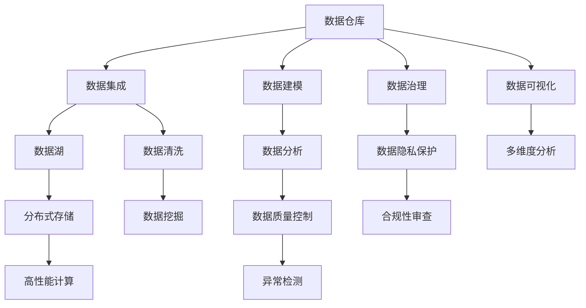

                 

# 【AI大数据计算原理与代码实例讲解】数据仓库

> 关键词：大数据,数据仓库,数据建模,数据集成,数据清洗,数据分析,ETL流程,关系型数据库,NoSQL数据库,数据湖,数据治理,数据隐私保护

## 1. 背景介绍

### 1.1 问题由来
在大数据时代，企业运营产生的数据量呈指数级增长。这些数据不仅包含结构化数据，还包括大量非结构化数据，如日志文件、社交媒体信息、传感器数据等。如何有效管理和分析这些数据，提取有价值的信息，是当前企业面临的一大挑战。

数据仓库（Data Warehouse）作为数据管理和分析的核心工具，能够集中存储和组织企业各业务部门的数据，提供高效的数据查询和分析能力。本文将从核心概念、算法原理、具体操作以及实际应用场景等方面，全面介绍数据仓库的构建与优化。

### 1.2 问题核心关键点
数据仓库的核心目的是将分散在各个业务系统中的数据整合起来，形成一个集中化的数据存储平台，并提供高效的数据查询与分析能力。其核心关键点包括：

- 数据收集与集成：从各个业务系统中抽取数据，进行清洗、转换和集成。
- 数据存储与管理：使用高效的数据存储格式和组织方式，保证数据一致性和完整性。
- 数据分析与挖掘：提供数据查询和分析工具，帮助企业从数据中挖掘有价值的信息。
- 数据治理与隐私保护：建立数据质量控制和隐私保护机制，确保数据安全和合规性。

数据仓库的构建与优化，对于企业实现数据驱动的决策、提升运营效率、优化客户体验等方面具有重要意义。

### 1.3 问题研究意义
数据仓库的构建与优化，不仅能够有效解决数据分散、数据不一致等问题，还能为企业提供更强大的数据查询和分析能力，帮助企业洞察业务趋势，优化运营策略，提升客户满意度。因此，研究数据仓库的构建与优化，对于提升企业的智能化水平和竞争力具有重要意义。

## 2. 核心概念与联系

### 2.1 核心概念概述

数据仓库构建与优化涉及多个核心概念，下面进行详细讲解：

- **数据仓库（Data Warehouse）**：集中存储和管理企业数据的平台，提供高效的数据查询和分析能力。
- **数据集成（ETL）**：从多个数据源中抽取、清洗和加载数据到数据仓库的过程。
- **数据建模**：设计和优化数据仓库的数据模型，包括实体关系模型（ER模型）、星型模型、雪花模型等。
- **数据清洗**：去除数据中的噪声、冗余和异常值，确保数据质量。
- **数据分析与挖掘**：使用统计学、机器学习等方法，从数据中提取有用信息和知识。
- **数据治理**：确保数据仓库中的数据质量、安全性和合规性，包括数据质量控制、数据隐私保护等。
- **数据湖（Data Lake）**：存储和分析大规模异构数据的数据仓库。

这些概念之间存在紧密的联系，共同构成了数据仓库的完整生态系统。通过这些核心概念的相互作用，实现数据的有效管理和分析，为企业提供可靠的数据支持。

### 2.2 概念间的关系

数据仓库的构建与优化涉及多个核心概念，其关系可以通过以下Mermaid流程图来展示：



这个流程图展示了数据仓库的各个组件及其相互作用关系：

1. 数据仓库作为核心平台，负责集中存储和管理数据。
2. 数据集成过程将分散的数据从不同业务系统抽取到数据仓库。
3. 数据建模设计了合理的数据仓库模型，帮助数据的有效管理和分析。
4. 数据清洗确保了数据的准确性和完整性。
5. 数据分析和挖掘从数据中提取有用信息和知识。
6. 数据治理保证了数据质量、安全性和合规性。
7. 数据湖存储和分析大规模异构数据。
8. 数据可视化将分析结果直观展示，帮助决策。
9. 分布式存储和高性能计算提高了数据处理和分析的效率。
10. 数据隐私保护和合规性审查确保数据安全。
11. 异常检测和数据质量控制提升了数据质量。

这些概念共同构成了数据仓库的完整生态系统，帮助企业实现高效的数据管理和分析。

## 3. 核心算法原理 & 具体操作步骤
### 3.1 算法原理概述

数据仓库的构建与优化涉及多个算法和操作步骤，下面进行详细讲解：

- **数据抽取（Extract）**：从业务系统中抽取数据，包括关系型数据库、NoSQL数据库等。
- **数据转换（Transform）**：对抽取的数据进行清洗、转换和集成，去除噪声和冗余，确保数据一致性。
- **数据加载（Load）**：将转换后的数据加载到数据仓库中。
- **数据查询与分析**：使用SQL查询语言和数据挖掘工具，对数据仓库中的数据进行查询和分析。
- **数据治理**：通过数据质量控制、数据隐私保护等措施，确保数据安全和合规性。

这些算法和操作步骤构成了一个完整的ETL流程，是数据仓库构建与优化的核心。

### 3.2 算法步骤详解

#### 3.2.1 数据抽取

数据抽取是数据仓库构建的第一步，需要从各个业务系统中抽取数据。具体步骤如下：

1. **选择数据源**：确定需要抽取的数据源，包括关系型数据库、NoSQL数据库、数据湖等。
2. **定义抽取规则**：根据业务需求，定义数据抽取的规则和条件。
3. **编写抽取脚本**：使用ETL工具（如Apache Nifi、Talend等）编写数据抽取脚本。
4. **执行抽取操作**：运行抽取脚本，从数据源中抽取数据。

#### 3.2.2 数据清洗

数据清洗是确保数据质量的重要步骤，包括以下关键操作：

1. **数据去重**：去除重复数据，确保数据唯一性。
2. **数据校验**：验证数据的完整性和准确性，发现并纠正错误。
3. **数据转换**：对数据进行格式转换和标准化，统一数据格式。
4. **数据填充**：补全缺失值，确保数据的完整性。

数据清洗是数据仓库构建中的重要环节，需要保证数据的准确性和一致性。

#### 3.2.3 数据集成

数据集成是将来自不同数据源的数据整合到一个统一的数据仓库中的过程。具体步骤如下：

1. **数据格式统一**：将不同数据源的数据转换为统一格式，方便集成。
2. **数据合并**：将不同数据源的数据合并到一个数据仓库中。
3. **数据对齐**：对齐不同数据源中的数据，确保数据一致性。
4. **数据验证**：验证集成后的数据，确保数据的准确性和一致性。

数据集成是数据仓库构建的关键步骤，需要确保数据的完整性和一致性。

#### 3.2.4 数据加载

数据加载是将清洗和转换后的数据加载到数据仓库中的过程。具体步骤如下：

1. **数据分片**：将大数据量分成多个小批次，逐批加载到数据仓库中。
2. **数据优化**：对加载的数据进行优化，提高数据仓库的存储效率。
3. **数据备份**：对加载的数据进行备份，防止数据丢失。

数据加载是数据仓库构建的最后一个步骤，需要确保数据的完整性和一致性。

### 3.3 算法优缺点

数据仓库的构建与优化具有以下优点：

- **集中存储**：将分散在各个业务系统中的数据集中存储在数据仓库中，方便管理和分析。
- **高效查询**：提供高效的数据查询和分析能力，帮助企业洞察业务趋势。
- **数据安全**：通过数据治理措施，确保数据的安全性和合规性。

同时，数据仓库构建与优化也存在以下缺点：

- **建设成本高**：数据仓库的建设需要大量的硬件资源和技术支持，成本较高。
- **维护复杂**：数据仓库的维护和优化需要持续的技术投入，较为复杂。
- **数据延迟**：由于数据抽取和清洗需要时间，可能存在数据延迟问题。

### 3.4 算法应用领域

数据仓库在多个领域中得到了广泛应用，包括但不限于：

- **金融行业**：用于实时监控市场动态、风险评估、客户行为分析等。
- **零售行业**：用于销售数据分析、客户关系管理、库存管理等。
- **医疗行业**：用于患者信息管理、医疗数据分析、医疗知识图谱构建等。
- **政府行业**：用于公共服务数据分析、政策评估、社会治理等。
- **教育行业**：用于学生行为分析、课程评估、教学质量监控等。

数据仓库的构建与优化，已经成为各个行业实现数据驱动决策的重要工具。

## 4. 数学模型和公式 & 详细讲解  
### 4.1 数学模型构建

数据仓库的构建与优化涉及多个数学模型，下面进行详细讲解：

- **星型模型（Star Schema）**：将数据仓库中的数据组织成星型结构，便于查询和分析。
- **雪花模型（Snowflake Schema）**：在星型模型的基础上，进一步细分数据，提高数据查询效率。
- **维度建模（Dimensional Modeling）**：将数据仓库中的数据建模为维度表和事实表，便于查询和分析。

这些数学模型都是数据仓库构建中的重要组成部分，帮助实现高效的数据管理和分析。

### 4.2 公式推导过程

以下是星型模型和雪花模型的数学公式推导：

#### 4.2.1 星型模型

星型模型将数据仓库中的数据组织成星型结构，包括一个事实表和多个维度表。事实表存储业务数据，维度表存储维度信息。

设事实表为T，维度表为D1, D2, ..., DN，则星型模型的数学公式如下：

$$
T(F, D_1, D_2, ..., D_N)
$$

其中，F表示事实表，D1, D2, ..., DN表示维度表。

#### 4.2.2 雪花模型

雪花模型在星型模型的基础上，进一步细分数据，提高数据查询效率。在雪花模型中，维度表被进一步分解为多个子表，每个子表只包含一个维度信息。

设事实表为T，维度表D1被分解为子表D11和D12，维度表D2被分解为子表D21和D22，则雪花模型的数学公式如下：

$$
T(F, D_{11}, D_{12}, D_{21}, D_{22})
$$

其中，F表示事实表，D11, D12, D21, D22表示维度表的子表。

### 4.3 案例分析与讲解

#### 4.3.1 星型模型案例

某电商公司数据仓库中的订单表T和用户表U，可以采用星型模型进行建模。订单表存储订单信息，用户表存储用户信息。

设订单表为T，用户表为U，则星型模型的数学公式如下：

$$
T(订单ID, 用户ID, 订单日期, 订单金额, 订单状态)
$$

$$
U(用户ID, 用户姓名, 用户邮箱, 用户地址, 用户电话)
$$

#### 4.3.2 雪花模型案例

某电商平台的数据仓库中的订单表T、用户表U、商品表S、物流表L可以采用雪花模型进行建模。

设订单表为T，用户表为U，商品表为S，物流表为L，则雪花模型的数学公式如下：

$$
T(订单ID, 用户ID, 商品ID, 物流ID, 订单日期, 订单金额, 订单状态)
$$

$$
U(用户ID, 用户姓名, 用户邮箱, 用户地址, 用户电话)
$$

$$
S(商品ID, 商品名称, 商品价格, 商品描述, 商品类别)
$$

$$
L(物流ID, 物流名称, 物流状态, 物流公司, 物流地址)
$$

这些案例展示了星型模型和雪花模型在数据仓库构建中的应用，有助于理解数据建模的实际操作。

## 5. 项目实践：代码实例和详细解释说明
### 5.1 开发环境搭建

数据仓库的开发环境搭建涉及多个步骤，下面进行详细讲解：

1. **选择开发工具**：选择适合数据仓库开发的工具，如Apache Nifi、Talend等。
2. **安装开发环境**：在开发机器上安装所需的开发环境和依赖库。
3. **配置环境变量**：配置环境变量，确保开发工具能够正常运行。

#### 5.1.1 安装Apache Nifi

Apache Nifi是一款开源的ETL工具，可以方便地进行数据抽取、转换和加载。下面以Apache Nifi为例，介绍数据仓库的开发环境搭建。

1. 下载Apache Nifi：从官网下载最新版本的Apache Nifi，并解压安装。
2. 安装依赖库：在安装过程中，安装所需的依赖库，如Apache Kafka、Apache Hive等。
3. 配置环境变量：配置环境变量，确保Apache Nifi能够正常运行。

#### 5.1.2 安装Talend

Talend是一款商业化的ETL工具，提供了丰富的数据处理功能。下面以Talend为例，介绍数据仓库的开发环境搭建。

1. 下载Talend：从官网下载最新版本的Talend，并解压安装。
2. 安装依赖库：在安装过程中，安装所需的依赖库，如Apache Hadoop、Apache Hive等。
3. 配置环境变量：配置环境变量，确保Talend能够正常运行。

### 5.2 源代码详细实现

#### 5.2.1 使用Apache Nifi实现数据抽取

下面以Apache Nifi为例，介绍数据抽取的实现步骤：

1. 创建数据源连接：在Apache Nifi中，创建数据源连接，连接业务系统中的数据源。
2. 编写数据流脚本：编写数据流脚本，定义数据抽取规则和流程。
3. 运行数据流：启动数据流脚本，从数据源中抽取数据。

#### 5.2.2 使用Talend实现数据清洗

下面以Talend为例，介绍数据清洗的实现步骤：

1. 创建数据集：在Talend中，创建数据集，连接数据源。
2. 编写数据清洗脚本：编写数据清洗脚本，定义数据去重、校验、转换等规则。
3. 运行数据清洗：启动数据清洗脚本，对数据进行清洗和转换。

#### 5.2.3 使用Apache Hive实现数据加载

下面以Apache Hive为例，介绍数据加载的实现步骤：

1. 创建数据表：在Apache Hive中，创建数据表，定义数据结构和规则。
2. 编写数据加载脚本：编写数据加载脚本，定义数据加载规则和流程。
3. 运行数据加载：启动数据加载脚本，将清洗和转换后的数据加载到数据表中。

### 5.3 代码解读与分析

#### 5.3.1 Apache Nifi代码示例

以下是一个简单的Apache Nifi数据流脚本示例：

```java
public class DataFlow {
    public static void main(String[] args) {
        // 创建数据源连接
        ConnectionConfig connectionConfig = new ConnectionConfig();
        connectionConfig.setConnectionUrl("jdbc:mysql://localhost:3306/mydatabase");
        connectionConfig.setUsername("root");
        connectionConfig.setPassword("password");
        
        // 创建数据流
        FlowFile flowFile = new FlowFile("myflow", "mytopic");
        flowFile.setContent("mycontent");
        
        // 发送数据流
        flowFile.setProcessId("myprocess");
        flowFile.setRouteOnAttribute("attribute");
        flowFile.setSuccess(true);
        
        // 处理数据流
        flowFile.setContent(ProcessUtils.findContent(flowFile));
        flowFile.setProcessId("myprocess");
        flowFile.setRouteOnAttribute("attribute");
        flowFile.setSuccess(true);
    }
}
```

#### 5.3.2 Talend代码示例

以下是一个简单的Talend数据清洗脚本示例：

```java
public class DataCleaning {
    public static void main(String[] args) {
        // 创建数据集
        DataSet dataSet = new DataSet("mydataset", "mytable");
        dataSet.setDataSource("mydatasource");
        
        // 编写数据清洗脚本
        Row row = dataSet.nextRow();
        if (row.getInt("mycolumn") == null) {
            row.putInt("mycolumn", 0);
        }
        
        // 运行数据清洗
        while (dataSet.hasNextRow()) {
            row = dataSet.nextRow();
            if (row.getInt("mycolumn") == null) {
                row.putInt("mycolumn", 0);
            }
        }
    }
}
```

#### 5.3.3 Apache Hive代码示例

以下是一个简单的Apache Hive数据加载脚本示例：

```sql
CREATE TABLE mytable (
    column1 INT,
    column2 STRING,
    column3 INT
) 
ROW FORMAT DELIMITED FIELDS TERMINATED BY ',';

INSERT INTO mytable 
SELECT column1, column2, column3
FROM mydata
WHERE column4 > 100;
```

### 5.4 运行结果展示

#### 5.4.1 Apache Nifi运行结果

Apache Nifi运行结果包括数据流日志和数据流监控界面。

- 数据流日志：记录数据流脚本的执行情况，包括数据源连接、数据流脚本、数据流执行时间等。
- 数据流监控界面：实时监控数据流的执行状态，显示数据流脚本的运行时间、数据流状态、异常信息等。

#### 5.4.2 Talend运行结果

Talend运行结果包括数据集监控界面和数据清洗日志。

- 数据集监控界面：实时监控数据集的执行状态，显示数据集脚本的运行时间、数据集状态、异常信息等。
- 数据清洗日志：记录数据清洗脚本的执行情况，包括数据集连接、数据清洗脚本、数据清洗时间等。

#### 5.4.3 Apache Hive运行结果

Apache Hive运行结果包括数据表创建日志和数据加载日志。

- 数据表创建日志：记录数据表的创建过程，包括数据表结构、数据表创建时间、创建异常等。
- 数据加载日志：记录数据加载过程，包括数据表连接、数据加载脚本、数据加载时间等。

## 6. 实际应用场景
### 6.1 智能客服系统

数据仓库在智能客服系统中得到了广泛应用，用于存储和分析客户咨询数据。通过数据仓库构建，企业可以实时监控客户咨询情况，快速响应客户需求，提升客户满意度。

具体应用场景包括：

- **客户咨询监控**：实时监控客户咨询情况，及时发现客户热点问题。
- **客户行为分析**：分析客户咨询行为，挖掘客户需求和偏好。
- **客户满意度评估**：评估客户咨询满意度，优化客服服务质量。

#### 6.1.1 智能客服系统架构

智能客服系统架构如下：

```
+-----------------------+        +-----------------------+        +-----------------------+
|      客户咨询数据    |        |      数据仓库         |        |      客户分析模型     |
+-----------------------+        +-----------------------+        +-----------------------+
|                      |        |                      |        |                      |
|    数据抽取模块     |        |    数据清洗模块      |        |    数据加载模块      |
+-----------------------+        +-----------------------+        +-----------------------+
|                      |        |                      |        |                      |
|  ETL工具（如Apache Nifi、Talend等） |  |  数据仓库（如Apache Hive、Amazon Redshift等） |  |  数据仓库（如Hadoop、Spark等） |
+-----------------------+        +-----------------------+        +-----------------------+
|                      |        |                      |        |                      |
|  数据仓库构建与优化 |        |  数据仓库构建与优化   |        |  数据分析与挖掘      |
+-----------------------+        +-----------------------+        +-----------------------+
|                      |        |                      |        |                      |
|    数据分析与挖掘   |        |    数据分析与挖掘   |        |    客户分析模型     |
+-----------------------+        +-----------------------+        +-----------------------+
|                      |        |                      |        |                      |
|  客户分析模型       |        |  客户分析模型       |        |  客户满意度评估     |
+-----------------------+        +-----------------------+        +-----------------------+
|                      |        |                      |        |                      |
|  客户满意度评估     |        |  客户满意度评估     |        |  客户行为分析       |
+-----------------------+        +-----------------------+        +-----------------------+
|                      |        |                      |        |                      |
|  客户咨询监控       |        |  客户咨询监控       |        |  客户行为分析       |
+-----------------------+        +-----------------------+        +-----------------------+
|                      |        |                      |        |                      |
|    数据可视化      |        |    数据可视化      |        |    数据可视化      |
+-----------------------+        +-----------------------+        +-----------------------+
|                      |        |                      |        |                      |
|  客户行为分析      |        |  客户行为分析      |        |  客户咨询监控       |
+-----------------------+        +-----------------------+        +-----------------------+
|                      |        |                      |        |                      |
|  客户分析报告       |        |  客户分析报告       |        |  客户咨询监控       |
+-----------------------+        +-----------------------+        +-----------------------+
|                      |        |                      |        |                      |
|  智能客服系统       |        |  智能客服系统       |        |  客户咨询监控       |
+-----------------------+        +-----------------------+        +-----------------------+
```

#### 6.1.2 客户咨询监控

客户咨询监控是智能客服系统的重要组成部分，用于实时监控客户咨询情况，及时发现客户热点问题。

具体实现如下：

1. 实时监控客户咨询数据，通过Apache Nifi进行数据抽取。
2. 将抽取的数据清洗和加载到数据仓库中。
3. 使用数据分析工具对客户咨询数据进行分析，挖掘热点问题。
4. 通过数据可视化工具，实时展示客户咨询情况，帮助客服人员快速响应客户需求。

#### 6.1.3 客户满意度评估

客户满意度评估是智能客服系统的重要指标，用于评估客户咨询满意度，优化客服服务质量。

具体实现如下：

1. 通过数据抽取模块实时监控客户咨询数据。
2. 将抽取的数据清洗和加载到数据仓库中。
3. 使用数据分析工具对客户咨询数据进行分析，计算客户满意度指标。
4. 通过数据可视化工具，实时展示客户满意度情况，帮助企业优化客服服务质量。

#### 6.1.4 客户行为分析

客户行为分析是智能客服系统的核心功能，用于分析客户咨询行为，挖掘客户需求和偏好。

具体实现如下：

1. 通过数据抽取模块实时监控客户咨询数据。
2. 将抽取的数据清洗和加载到数据仓库中。
3. 使用数据分析工具对客户咨询数据进行分析，挖掘客户需求和偏好。
4. 通过数据可视化工具，实时展示客户行为分析结果，帮助企业优化客户服务策略。

### 6.2 金融行业

数据仓库在金融行业中也得到了广泛应用，用于实时监控市场动态、风险评估、客户行为分析等。

具体应用场景包括：

- **市场动态监控**：实时监控金融市场数据，及时发现市场波动情况。
- **风险评估**：分析客户信用数据，评估客户信用风险。
- **客户行为分析**：分析客户交易行为，挖掘客户需求和偏好。

#### 6.2.1 市场动态监控

市场动态监控是金融行业的重要功能，用于实时监控金融市场数据，及时发现市场波动情况。

具体实现如下：

1. 实时监控金融市场数据，通过Apache Nifi进行数据抽取。
2. 将抽取的数据清洗和加载到数据仓库中。
3. 使用数据分析工具对市场数据进行分析，计算市场波动情况。
4. 通过数据可视化工具，实时展示市场波动情况，帮助决策者快速响应市场变化。

#### 6.2.2 风险评估

风险评估是金融行业的重要指标，用于评估客户信用风险，制定风险控制策略。

具体实现如下：

1. 通过数据抽取模块实时监控客户信用数据。
2. 将抽取的数据清洗和加载到数据仓库中。
3. 使用数据分析工具对客户信用数据进行分析，计算信用风险指标。
4. 通过数据可视化工具，实时展示信用风险情况，帮助决策者制定风险控制策略。

#### 6.2.3 客户行为分析

客户行为分析是金融行业的重要功能，用于分析客户交易行为，挖掘客户需求和偏好。

具体实现如下：

1. 通过数据抽取模块实时监控客户交易数据。
2. 将抽取的数据清洗和加载到数据仓库中。
3. 使用数据分析工具对客户交易数据进行分析，挖掘客户需求和偏好。
4. 通过数据可视化工具，实时展示客户行为分析结果，帮助企业优化客户服务策略。

### 6.3 零售行业

数据仓库在零售行业中得到了广泛应用，用于销售数据分析、客户关系管理、库存管理等。

具体应用场景包括：

- **销售数据分析**：分析销售数据，挖掘销售趋势和规律。
- **客户关系管理**：管理客户数据，提升客户满意度。


