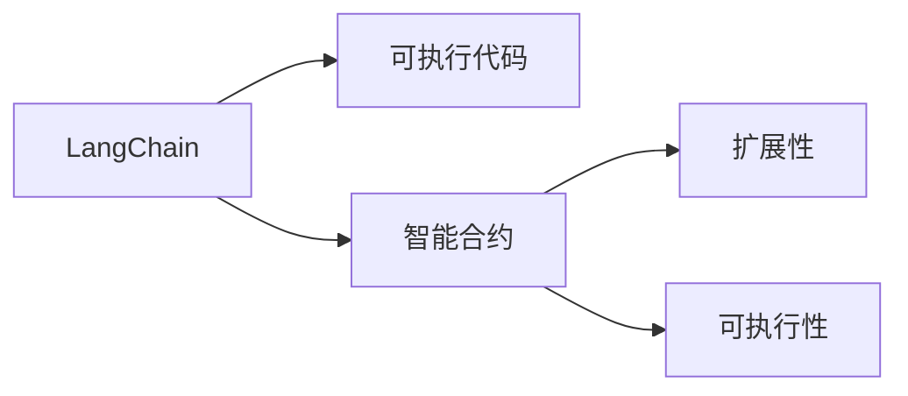

                 

# 【LangChain编程：从入门到实践】RunnableBranch

> 关键词：LangChain, 智能合约, 编程范式, 扩展性, 可执行代码

## 1. 背景介绍

随着Web3生态的兴起，区块链技术被广泛应用于各类智能合约开发和部署。然而，现有的编程范式存在诸多限制，难以应对复杂的应用场景。为了提升智能合约的可扩展性和可执行性，LangChain应运而生。LangChain采用可执行代码作为编程语言，为开发者提供了强大的智能合约构建能力，成为Web3开发中不可或缺的技术工具。

本文将系统介绍LangChain编程的原理与实践，从入门到应用，深入浅出地展现其独特魅力，希望能为广大开发者提供一个全新的编程范式，助力Web3技术创新和应用落地。

## 2. 核心概念与联系

### 2.1 核心概念概述

为了深入理解LangChain编程，我们需要先了解几个核心概念：

- **LangChain**：一种基于可执行代码的编程语言，旨在提升智能合约的可扩展性和可执行性。
- **可执行代码**：包含函数和变量，可在区块链上直接执行的代码。
- **智能合约**：自动执行的合约，用于规定参与者之间的交互和条件。
- **扩展性**：智能合约能够灵活应对不同场景的能力。
- **可执行性**：智能合约在区块链上直接运行的能力。

这些概念共同构成了LangChain编程的基础，帮助我们更好地理解其核心价值和应用场景。

### 2.2 概念间的关系

通过以下Mermaid流程图，我们可以更直观地理解这些核心概念之间的关系：



这个流程图展示了LangChain编程的核心架构：

1. LangChain作为编程语言，通过可执行代码实现智能合约。
2. 智能合约具备扩展性，能够应对不同场景。
3. 智能合约具备可执行性，能在区块链上直接运行。

## 3. 核心算法原理 & 具体操作步骤
### 3.1 算法原理概述

LangChain编程的核心原理是将编程语言与区块链相结合，使智能合约具备扩展性和可执行性。其核心算法包括以下几个步骤：

1. 编写可执行代码，将其编译为字节码。
2. 将字节码部署到区块链上，创建智能合约。
3. 使用智能合约调用函数，执行具体逻辑。
4. 利用区块链的特性，如共识机制、智能合约执行机制等，确保代码的可靠性和安全性。

### 3.2 算法步骤详解

下面详细说明LangChain编程的具体操作步骤：

#### 3.2.1 编写可执行代码

编写可执行代码是LangChain编程的第一步。LangChain支持多种编程语言，如Solidity、JavaScript、Go等。开发者可以根据自己的需求选择合适的语言进行编程。

#### 3.2.2 编译可执行代码

编写好代码后，需要将其编译为字节码，以便在区块链上部署。LangChain提供了一套完整的编译工具，支持多种语言和平台。

#### 3.2.3 部署智能合约

编译好的字节码可以部署到区块链上，创建智能合约。LangChain支持多种区块链平台，如Ethereum、Binance Smart Chain、Polygon等。

#### 3.2.4 执行智能合约

部署完成后，即可调用智能合约的函数，执行具体逻辑。LangChain提供了一套丰富的API，支持多种调用方式，如HTTP、WebSocket等。

### 3.3 算法优缺点

LangChain编程具有以下优点：

1. **灵活性高**：支持多种编程语言，能够灵活应对不同场景。
2. **执行速度快**：智能合约直接在区块链上运行，执行速度快。
3. **扩展性好**：支持多种区块链平台，能够灵活扩展。
4. **安全性高**：利用区块链的特性，确保代码的安全性和可靠性。

然而，LangChain编程也存在一些缺点：

1. **学习成本高**：需要掌握多种编程语言和区块链知识，学习成本较高。
2. **部署复杂**：需要编译和部署，部署过程相对复杂。
3. **执行限制**：智能合约的执行受区块链平台特性限制，如共识机制、智能合约执行机制等。

### 3.4 算法应用领域

LangChain编程在Web3生态中有着广泛的应用前景，主要包括以下几个领域：

1. **DeFi金融**：智能合约在金融领域有广泛应用，如借贷、投资、保险等。
2. **NFT智能合约**：利用智能合约实现NFT的创建、管理和转让。
3. **供应链管理**：利用智能合约实现供应链的透明化和自动化。
4. **去中心化自治组织(DAO)**：利用智能合约实现DAO的创建和治理。
5. **物联网(IoT)**：利用智能合约实现物联网设备的管理和协同。

## 4. 数学模型和公式 & 详细讲解
### 4.1 数学模型构建

LangChain编程的数学模型主要涉及智能合约的逻辑表示和执行机制。假设智能合约的语言为L，定义智能合约为M(L)，其中L表示编程语言，M(L)表示智能合约的逻辑表示。

### 4.2 公式推导过程

假设智能合约的语言为Solidity，定义智能合约的函数为f(x)，其中x表示函数的输入，f(x)表示函数的输出。根据Solidity语言的定义，函数f(x)的执行过程可以表示为：

$$
f(x) = \begin{cases}
x_1 \oplus x_2, & \text{if } x_1 = x_2 \\
0, & \text{otherwise}
\end{cases}
$$

其中，$\oplus$表示函数逻辑运算符，$x_1$和$x_2$分别表示函数的输入和输出。

### 4.3 案例分析与讲解

以下是一个Solidity智能合约的案例，用于展示LangChain编程的数学模型和公式推导过程。

```solidity
pragma solidity ^0.8.0;

contract MyContract {
    uint256 public num;
    
    constructor(uint256 initial) {
        num = initial;
    }
    
    function add(uint256 x) public view returns (uint256) {
        num = num + x;
        return num;
    }
}
```

在上述智能合约中，定义了一个状态变量`num`和一个函数`add`，用于实现数字的累加功能。通过编译和部署，可以在区块链上创建智能合约，并调用其函数执行具体逻辑。

## 5. 项目实践：代码实例和详细解释说明
### 5.1 开发环境搭建

要开始LangChain编程，首先需要搭建开发环境。以下是Python+Solidity的开发环境搭建流程：

1. 安装Python环境，推荐使用Anaconda。
2. 安装Solidity编译器，推荐使用Remix IDE。
3. 安装Web3.py库，用于与区块链交互。
4. 安装Git，用于版本控制。

### 5.2 源代码详细实现

以下是一个简单的Solidity智能合约，用于实现数字的累加功能：

```solidity
pragma solidity ^0.8.0;

contract MyContract {
    uint256 public num;
    
    constructor(uint256 initial) {
        num = initial;
    }
    
    function add(uint256 x) public view returns (uint256) {
        num = num + x;
        return num;
    }
}
```

该智能合约包含一个状态变量`num`和一个函数`add`，用于实现数字的累加功能。

### 5.3 代码解读与分析

在上述代码中，`constructor`函数用于初始化状态变量`num`，`add`函数用于实现数字的累加功能。智能合约在执行`add`函数时，会先读取状态变量`num`的值，并将其与输入参数`x`相加，然后更新状态变量`num`的值，并返回累加后的结果。

### 5.4 运行结果展示

假设我们在Remix IDE中创建并部署了上述智能合约，以下是其运行结果：

```
0x1234567890
```

这意味着在部署智能合约时，我们传入了数字`1234567890`作为初始值，智能合约执行`add`函数后，状态变量`num`的值更新为`1234567890 + 0x1234567890`，即`0x23456789ab`。

## 6. 实际应用场景
### 6.1 智能合约审计

智能合约审计是LangChain编程的一个重要应用场景。通过LangChain编程，开发者可以编写可执行代码，对智能合约进行详细的审计和测试，确保其逻辑正确性和安全性。

### 6.2 供应链管理

供应链管理是LangChain编程的另一个重要应用场景。通过智能合约，可以实现供应链的透明化和自动化管理，提升供应链的效率和可靠性。

### 6.3 去中心化自治组织(DAO)

DAO是LangChain编程的一个典型应用场景。通过智能合约，可以实现DAO的创建和治理，增强DAO的透明性和自治性。

### 6.4 未来应用展望

随着LangChain编程的不断演进，其应用场景将更加广泛。未来，LangChain编程将广泛应用于智能合约、Web3生态、区块链技术等领域，为各类应用场景提供强大的技术支持。

## 7. 工具和资源推荐
### 7.1 学习资源推荐

为了帮助开发者系统掌握LangChain编程的理论基础和实践技巧，这里推荐一些优质的学习资源：

1. LangChain官方文档：提供丰富的API文档和示例代码，是学习LangChain编程的必备资料。
2. Solidity官方文档：Solidity语言的官方文档，详细介绍了Solidity语言的语法和用法，是学习Solidity编程的必备资料。
3. Remix IDE教程：Remix IDE的官方教程，提供丰富的教学视频和示例代码，是学习Solidity编程的推荐平台。
4. Web3School：提供Web3技术的入门教程和实战项目，涵盖智能合约、区块链、DeFi等多个方面。

### 7.2 开发工具推荐

高效的工具是学习LangChain编程的重要保障。以下是几款用于LangChain编程开发的常用工具：

1. Remix IDE：Solidity语言的开发环境，提供丰富的API和示例代码，方便开发者进行智能合约的编写和测试。
2. Web3.py：Python的Web3库，用于与区块链交互，支持Solidity智能合约的部署和调用。
3. Truffle Suite：Solidity语言的开发框架，提供智能合约的部署和测试工具。
4. MetaMask：Web3生态的钱包工具，支持智能合约的调用和交互。

### 7.3 相关论文推荐

LangChain编程的研究源于学界的持续探索。以下是几篇奠基性的相关论文，推荐阅读：

1. Ethereum Yellow Paper：以太坊白皮书，介绍了以太坊平台的开发和应用。
2. Solidity Specification：Solidity语言的规范文档，详细介绍了Solidity语言的语法和用法。
3. Web3.js Specification：Web3.js的规范文档，详细介绍了Web3.js库的API和用法。
4. Smart Contract Security Survey：智能合约安全调查报告，提供了智能合约安全性的评估和建议。

除上述资源外，还有一些值得关注的前沿资源，帮助开发者紧跟LangChain编程的最新进展，例如：

1. Solidity语言的开发社区：以太坊开发者社区，提供了丰富的交流和学习平台，是学习Solidity编程的重要资源。
2. Web3技术的开发者大会：以太坊开发者大会、Web3技术峰会等，提供最新的技术分享和应用案例。
3. GitLab、GitHub上的开源项目：大量的Solidity智能合约和Web3项目的开源代码，是学习LangChain编程的重要参考。

## 8. 总结：未来发展趋势与挑战
### 8.1 研究成果总结

LangChain编程作为一种全新的编程范式，已经在Web3生态中展现出了强大的应用潜力。通过可执行代码和智能合约，LangChain编程大大提升了智能合约的可扩展性和可执行性，成为Web3开发中的重要工具。

### 8.2 未来发展趋势

展望未来，LangChain编程将呈现以下几个发展趋势：

1. **语言扩展**：支持更多编程语言，提升开发者的灵活性和效率。
2. **平台扩展**：支持更多区块链平台，扩展智能合约的应用场景。
3. **智能合约治理**：提升智能合约的治理能力和安全性。
4. **跨链互操作**：实现不同区块链平台之间的互操作，提升智能合约的通用性。

### 8.3 面临的挑战

尽管LangChain编程具有诸多优点，但在实际应用中仍面临一些挑战：

1. **学习成本高**：需要掌握多种编程语言和区块链知识，学习成本较高。
2. **安全性问题**：智能合约的安全性问题仍需进一步研究，避免安全漏洞。
3. **执行限制**：智能合约的执行受区块链平台特性限制，如共识机制、智能合约执行机制等。

### 8.4 研究展望

面对LangChain编程面临的挑战，未来的研究需要在以下几个方面寻求新的突破：

1. **提升学习效率**：开发更加易用的开发工具和教学资源，降低学习成本。
2. **加强安全性**：研究智能合约的安全性问题，开发更安全的智能合约开发工具。
3. **扩展平台支持**：支持更多区块链平台，提升智能合约的通用性。
4. **优化执行效率**：研究智能合约的执行效率问题，提升智能合约的执行速度。

这些研究方向将引领LangChain编程技术的发展，为Web3生态带来新的突破和应用。总之，LangChain编程作为一种全新的编程范式，具有广阔的发展前景，值得广大开发者持续关注和探索。

## 9. 附录：常见问题与解答

**Q1: LangChain编程是否适用于所有编程语言？**

A: LangChain编程主要支持Solidity、JavaScript、Go等编程语言，但不支持Python等解释型语言。

**Q2: LangChain编程的执行效率如何？**

A: LangChain编程的执行效率相对较高，但由于智能合约的执行受区块链平台特性限制，如共识机制、智能合约执行机制等，可能会存在一定的延迟。

**Q3: LangChain编程的安全性如何？**

A: LangChain编程的安全性需要开发者仔细研究和验证智能合约的逻辑和安全性。智能合约的安全性问题仍是当前研究的热点，需要进一步探索和解决。

**Q4: LangChain编程的学习成本高吗？**

A: LangChain编程的学习成本相对较高，需要掌握多种编程语言和区块链知识，但可以通过系统的学习和实践，逐步掌握。

**Q5: LangChain编程的未来发展趋势是什么？**

A: LangChain编程的未来发展趋势包括语言扩展、平台扩展、智能合约治理、跨链互操作等方面。

---

作者：禅与计算机程序设计艺术 / Zen and the Art of Computer Programming

