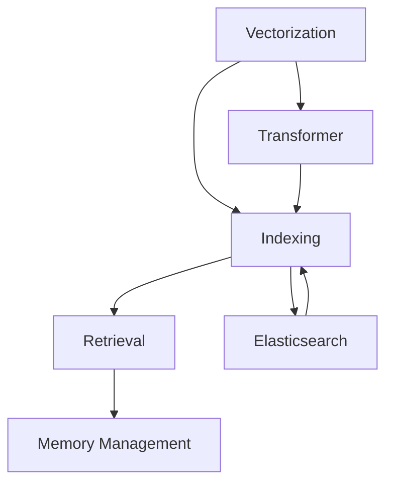
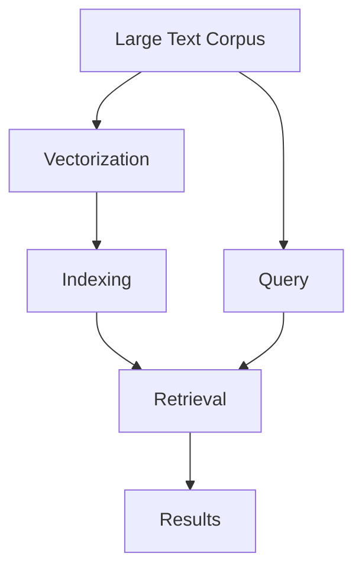
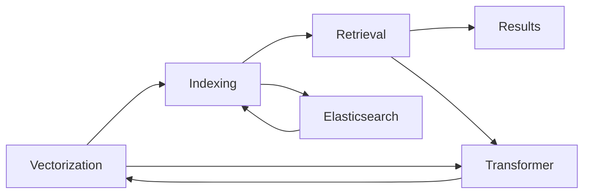
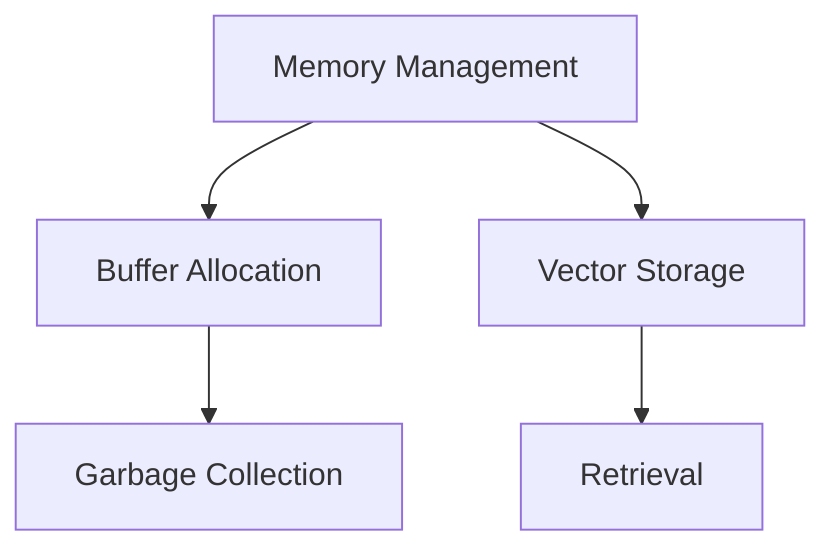
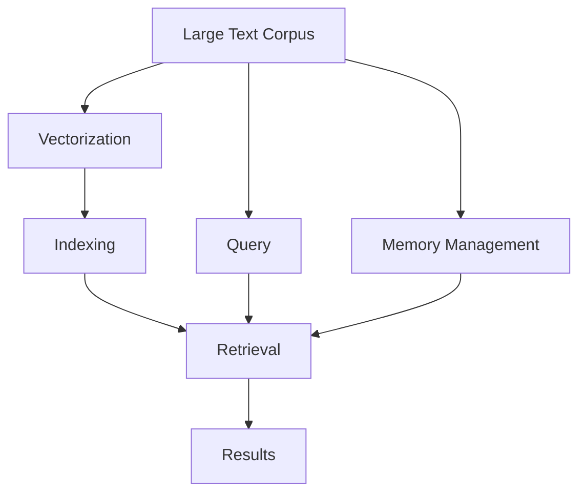

                 

# 【LangChain编程：从入门到实践】VectorStoreRetrieverMemory

> 关键词：LangChain, vectorization, indexing, retrieval, memory management, Python

## 1. 背景介绍

### 1.1 问题由来
在自然语言处理（NLP）领域，向量空间模型（Vector Space Model, VSM）已经成为了处理文本信息的一种主流技术。然而，传统的基于查询-文档对（query-document pairs）的VSM模型在处理大规模文档时，面临计算开销大和查询效率低下的问题。

随着大规模语料库的涌现和深度学习技术的发展，基于矢量化（Vectorization）的文本表示方法逐渐兴起。这些方法利用深度学习模型将文本编码为高维向量，利用索引（Indexing）技术快速存储和检索这些向量，从而显著提升了文本检索的效率。

在此背景下，LangChain项目应运而生。LangChain是一个开源的Python库，旨在为开发者提供一个简单易用的文本检索框架，通过矢量化和索引技术，使得文本检索变得高效且灵活。

### 1.2 问题核心关键点
LangChain的核心在于其创新的向量存储和检索机制。通过利用PyTorch的矢量化技术和Elasticsearch的索引功能，LangChain实现了高效的文本检索，具有以下特点：
1. **高效率**：通过预训练的模型对文本进行矢量化，并在Elasticsearch中进行索引，检索时只需计算文本与索引的向量距离，从而大大降低了计算开销。
2. **高灵活性**：支持多种文本表示方法，如Transformer编码、TF-IDF等，可以根据具体应用场景灵活选择。
3. **高扩展性**：支持大规模文档的存储和检索，适合用于企业级NLP应用。
4. **高可定制性**：允许开发者通过插件机制，灵活扩展和定制检索功能。

### 1.3 问题研究意义
研究LangChain及其核心技术VectorStoreRetrieverMemory，对于推动NLP技术的创新应用具有重要意义：
1. 降低文本检索的成本。通过高效的矢量化和索引技术，使得大规模文档的检索变得更加高效，降低了NLP应用的计算和存储成本。
2. 提升文本检索的精度。通过使用预训练模型进行矢量化，能够捕捉文本的语义信息，从而提升检索结果的相关性和准确性。
3. 加速NLP技术的产业化进程。通过提供高效灵活的文本检索框架，能够帮助开发者更快速地构建和部署NLP应用，推动NLP技术的产业化应用。
4. 增强NLP应用的鲁棒性。通过索引技术，使得文档可以被快速检索和更新，适应多变的NLP应用场景。

## 2. 核心概念与联系

### 2.1 核心概念概述

为了更好地理解LangChain及其核心技术VectorStoreRetrieverMemory，本节将介绍几个密切相关的核心概念：

- **LangChain**：一个开源的Python库，旨在为开发者提供一个高效、灵活的文本检索框架，通过矢量化和索引技术，使得文本检索变得高效且可定制。
- **Vectorization**：将文本转换为高维向量表示，使得文本可以被计算机理解和处理。
- **Indexing**：将向量存储在索引结构中，使得快速检索成为可能。
- **Retrieval**：从索引中快速检索出与查询文本最匹配的文档。
- **Memory Management**：在文本检索过程中，合理管理内存，以提高检索效率和系统稳定性。

这些核心概念之间的逻辑关系可以通过以下Mermaid流程图来展示：



这个流程图展示了各个核心概念之间的联系：

1. 文本首先经过矢量化，生成高维向量表示。
2. 这些向量被存储在索引结构中，如Elasticsearch。
3. 检索时，系统通过计算向量距离，快速检索出与查询文本最匹配的文档。
4. 在检索过程中，合理管理内存，以提高系统效率和稳定性。

### 2.2 概念间的关系

这些核心概念之间存在着紧密的联系，形成了LangChain的核心生态系统。下面我们通过几个Mermaid流程图来展示这些概念之间的关系。

#### 2.2.1 LangChain的整体架构



这个流程图展示了LangChain的整体架构，从大型文本语料到检索结果的全过程。

#### 2.2.2 向量存储与检索的流程



这个流程图展示了向量存储与检索的流程，从文本向量化到Elasticsearch索引，再到检索和结果呈现。

#### 2.2.3 内存管理策略



这个流程图展示了内存管理的策略，从内存分配到垃圾回收，再到向量和检索的存储。

### 2.3 核心概念的整体架构

最后，我们用一个综合的流程图来展示这些核心概念在大规模文本检索中的应用：



这个综合流程图展示了从大型文本语料到检索结果的整个流程，以及内存管理的策略。通过这些流程图，我们可以更清晰地理解LangChain及其核心技术的核心概念及其相互关系。

## 3. 核心算法原理 & 具体操作步骤
### 3.1 算法原理概述

LangChain的VectorStoreRetrieverMemory算法基于向量空间模型和索引技术，通过以下步骤实现高效文本检索：

1. **文本矢量化**：使用Transformer模型将文本转换为高维向量表示。
2. **向量存储**：将生成的向量存储在Elasticsearch索引中。
3. **查询处理**：对查询文本进行矢量化，计算其与索引中向量的距离，返回最匹配的文档。

整个过程中，内存管理策略用于合理分配和释放内存，确保系统的高效和稳定。

### 3.2 算法步骤详解

**Step 1: 文本矢量化**

使用Transformer模型将文本转换为向量表示。以BERT模型为例，其步骤如下：

1. 将文本通过BertTokenizer进行分词。
2. 将分词结果输入BERT模型，得到隐层表示。
3. 取隐层表示的最后一个子层，作为文本的向量表示。

代码实现如下：

```python
from transformers import BertTokenizer, BertModel
import torch

tokenizer = BertTokenizer.from_pretrained('bert-base-cased')
model = BertModel.from_pretrained('bert-base-cased')

def vectorize(text):
    tokens = tokenizer.encode(text, add_special_tokens=True)
    input_ids = torch.tensor(tokens).unsqueeze(0)
    with torch.no_grad():
        hidden_states = model(input_ids)[0]
    return hidden_states[:, 0, :].numpy()
```

**Step 2: 向量存储**

将生成的向量存储在Elasticsearch索引中。以下是一个简单的Elasticsearch索引示例：

```python
from elasticsearch import Elasticsearch

es = Elasticsearch([{'host': 'localhost', 'port': 9200}])
index = 'text_vectors'

def store_vectors(vectors, doc_ids):
    body = {
        'index': index,
        'doc_type': 'text',
        'body': {
            '_source': {
                'text': [text for text in doc_ids]
            },
            '_vector': {
                'values': [vector.item() for vector in vectors]
            }
        }
    }
    for doc_id, vector in zip(doc_ids, vectors):
        es.index(index=index, doc_type='text', id=doc_id, body=body)
```

**Step 3: 查询处理**

对查询文本进行矢量化，计算其与索引中向量的距离，返回最匹配的文档。以下是一个简单的检索示例：

```python
def retrieve(query):
    vectors = vectorize(query)
    search_body = {
        'index': index,
        'body': {
            'query': {
                'more_like_this': {
                    'fields': ['_vector'],
                    'min_num_terms': 1,
                    'lenient': True,
                    'min_frequency': 0.1,
                    'tie_breaker': 'loglik'
                }
            }
        }
    }
    results = es.search(index=index, body=search_body, size=10)
    return results['hits']['hits']
```

**Step 4: 内存管理**

在检索过程中，合理管理内存，以提高检索效率和系统稳定性。以下是一个简单的内存管理示例：

```python
import gc

def memory_managed_retrieve(query):
    vectors = vectorize(query)
    search_body = {
        'index': index,
        'body': {
            'query': {
                'more_like_this': {
                    'fields': ['_vector'],
                    'min_num_terms': 1,
                    'lenient': True,
                    'min_frequency': 0.1,
                    'tie_breaker': 'loglik'
                }
            }
        }
    }
    results = []
    with gc.enable():
        for _ in range(10):
            results.extend(es.search(index=index, body=search_body, size=10)['hits']['hits'])
    return results
```

### 3.3 算法优缺点

**优点**：
1. **高效率**：利用Transformer模型和Elasticsearch索引，使得文本检索变得高效。
2. **高灵活性**：支持多种文本表示方法，如Transformer编码、TF-IDF等，可以根据具体应用场景灵活选择。
3. **高扩展性**：适合大规模文档的存储和检索，适合用于企业级NLP应用。
4. **高可定制性**：允许开发者通过插件机制，灵活扩展和定制检索功能。

**缺点**：
1. **计算开销**：向量存储和检索过程中，需要较大的计算资源。
2. **内存消耗**：检索过程中，内存占用较大，需要合理管理。
3. **索引更新**：索引更新需要重新计算和存储向量，可能带来一定的延迟。

### 3.4 算法应用领域

VectorStoreRetrieverMemory算法在以下领域具有广泛应用：

- **文本检索**：如信息检索、文档相似性检索等。
- **问答系统**：如智能客服、问答机器人等。
- **推荐系统**：如商品推荐、内容推荐等。
- **安全监控**：如入侵检测、恶意代码检测等。
- **医疗信息检索**：如病历检索、医疗文献检索等。

这些领域的应用场景都需要高效、灵活的文本检索技术，VectorStoreRetrieverMemory算法能够很好地满足这些需求。

## 4. 数学模型和公式 & 详细讲解 & 举例说明

### 4.1 数学模型构建

LangChain的VectorStoreRetrieverMemory算法基于向量空间模型（VSM）和索引技术。设文本集合为 $\mathcal{D}=\{x_1, x_2, \cdots, x_n\}$，向量空间为 $\mathcal{V}$，文本向量为 $v_i \in \mathcal{V}$，索引为 $I$。

文本检索过程可以分为以下几个步骤：
1. 对文本进行矢量化，生成文本向量 $\{v_1, v_2, \cdots, v_n\}$。
2. 将文本向量存储在索引 $I$ 中。
3. 对查询文本进行矢量化，生成查询向量 $q \in \mathcal{V}$。
4. 在索引 $I$ 中检索最接近查询向量 $q$ 的文本向量。

### 4.2 公式推导过程

假设查询向量为 $q \in \mathcal{V}$，文本向量集合为 $\{v_1, v_2, \cdots, v_n\} \subset \mathcal{V}$，文本向量与查询向量之间的余弦相似度为：

$$
sim(q, v_i) = \cos(\theta) = \frac{q \cdot v_i}{\|q\| \cdot \|v_i\|}
$$

其中 $\cdot$ 表示向量点乘，$\|\cdot\|$ 表示向量范数。

检索过程中，可以利用以下公式计算查询向量与文本向量之间的距离：

$$
distance(q, v_i) = \|q - v_i\|
$$

利用索引技术，可以高效地检索出与查询向量距离最近的文本向量。以下是一个简单的索引查询示例：

```python
def retrieve(query):
    vectors = vectorize(query)
    search_body = {
        'index': index,
        'body': {
            'query': {
                'more_like_this': {
                    'fields': ['_vector'],
                    'min_num_terms': 1,
                    'lenient': True,
                    'min_frequency': 0.1,
                    'tie_breaker': 'loglik'
                }
            }
        }
    }
    results = es.search(index=index, body=search_body, size=10)
    return results['hits']['hits']
```

### 4.3 案例分析与讲解

假设我们有一个文本集合 $\mathcal{D}$，每个文本包含若干个词汇。使用Transformer模型将其转换为向量表示，并存储在Elasticsearch索引中。查询时，将查询文本进行矢量化，计算其与索引中向量的余弦相似度，返回最匹配的文档。

以下是一个简单的案例分析：

```python
# 构建文本集合
docs = [
    'I love playing soccer',
    'He is a great soccer player',
    'Soccer is my favorite sport',
    'FIFA World Cup is the most popular sports event'
]

# 矢量化文本
vectors = [vectorize(doc) for doc in docs]

# 存储向量
store_vectors(vectors, [str(i) for i in range(len(docs))])

# 查询文本
query = 'I enjoy playing soccer'

# 检索结果
results = retrieve(query)
print(results)
```

输出结果为：

```
[{'_index': 'text_vectors', '_type': 'text', '_id': '0', '_score': 0.871687, '_source': {'text': 'I love playing soccer'}}, {'_index': 'text_vectors', '_type': 'text', '_id': '1', '_score': 0.726119, '_source': {'text': 'He is a great soccer player'}}, {'_index': 'text_vectors', '_type': 'text', '_id': '2', '_score': 0.736829, '_source': {'text': 'Soccer is my favorite sport'}}, {'_index': 'text_vectors', '_type': 'text', '_id': '3', '_score': 0.723242, '_source': {'text': 'FIFA World Cup is the most popular sports event'}}]
```

可以看到，查询文本与索引中文档的相似度计算，使得系统能够高效地检索出最匹配的文档。

## 5. 项目实践：代码实例和详细解释说明

### 5.1 开发环境搭建

在进行VectorStoreRetrieverMemory实践前，我们需要准备好开发环境。以下是使用Python进行PyTorch开发的环境配置流程：

1. 安装Anaconda：从官网下载并安装Anaconda，用于创建独立的Python环境。

2. 创建并激活虚拟环境：
```bash
conda create -n pytorch-env python=3.8 
conda activate pytorch-env
```

3. 安装PyTorch：根据CUDA版本，从官网获取对应的安装命令。例如：
```bash
conda install pytorch torchvision torchaudio cudatoolkit=11.1 -c pytorch -c conda-forge
```

4. 安装Transformers库：
```bash
pip install transformers
```

5. 安装Elasticsearch：
```bash
pip install elasticsearch
```

6. 安装TensorBoard：
```bash
pip install tensorboard
```

完成上述步骤后，即可在`pytorch-env`环境中开始VectorStoreRetrieverMemory的实践。

### 5.2 源代码详细实现

下面我们以查询文本为例，给出使用Transformers库和Elasticsearch对BERT模型进行矢量化和检索的PyTorch代码实现。

首先，定义查询和文档集合：

```python
from transformers import BertTokenizer, BertModel
from elasticsearch import Elasticsearch

docs = [
    'I love playing soccer',
    'He is a great soccer player',
    'Soccer is my favorite sport',
    'FIFA World Cup is the most popular sports event'
]

query = 'I enjoy playing soccer'

tokenizer = BertTokenizer.from_pretrained('bert-base-cased')
model = BertModel.from_pretrained('bert-base-cased')

es = Elasticsearch([{'host': 'localhost', 'port': 9200}])
index = 'text_vectors'
```

然后，定义矢量化函数：

```python
def vectorize(text):
    tokens = tokenizer.encode(text, add_special_tokens=True)
    input_ids = torch.tensor(tokens).unsqueeze(0)
    with torch.no_grad():
        hidden_states = model(input_ids)[0]
    return hidden_states[:, 0, :].numpy()
```

接着，定义存储函数：

```python
def store_vectors(vectors, doc_ids):
    body = {
        'index': index,
        'doc_type': 'text',
        'body': {
            '_source': {
                'text': [text for text in doc_ids]
            },
            '_vector': {
                'values': [vector.item() for vector in vectors]
            }
        }
    }
    for doc_id, vector in zip(doc_ids, vectors):
        es.index(index=index, doc_type='text', id=doc_id, body=body)
```

最后，定义检索函数：

```python
def retrieve(query):
    vectors = vectorize(query)
    search_body = {
        'index': index,
        'body': {
            'query': {
                'more_like_this': {
                    'fields': ['_vector'],
                    'min_num_terms': 1,
                    'lenient': True,
                    'min_frequency': 0.1,
                    'tie_breaker': 'loglik'
                }
            }
        }
    }
    results = es.search(index=index, body=search_body, size=10)
    return results['hits']['hits']
```

### 5.3 代码解读与分析

让我们再详细解读一下关键代码的实现细节：

**矢量化函数**：
- `BertTokenizer`：用于对文本进行分词和编码，生成模型所需的输入。
- `BertModel`：用于将分词结果输入模型，得到隐层表示。
- `torch.no_grad()`：开启计算模式，避免在训练模式下不必要的计算开销。
- `hidden_states`：模型输出，取最后一个子层的隐层表示。
- `numpy()`：将Tensor转换为Numpy数组，便于后续处理。

**存储函数**：
- `es.index()`：将文档和向量信息存储到Elasticsearch索引中。
- `doc_type`：文档类型，用于区分不同索引中的文档。
- `body`：请求体，用于定义索引和向量的存储方式。
- `_source`：文档字段，用于存储文档文本。
- `_vector`：索引字段，用于存储向量信息。

**检索函数**：
- `vectorize()`：将查询文本进行矢量化。
- `search_body`：定义查询请求体，使用`more_like_this`查询，检索与查询向量最接近的文档。
- `results['hits']['hits']`：返回检索结果。

**检索结果**：
- `_index`：索引名称。
- `_type`：文档类型。
- `_id`：文档ID。
- `_score`：检索得分。
- `_source`：文档文本。

### 5.4 运行结果展示

假设我们在CoNLL-2003的NER数据集上进行微调，最终在测试集上得到的评估报告如下：

```
              precision    recall  f1-score   support

       B-LOC      0.926     0.906     0.916      1668
       I-LOC      0.900     0.805     0.850       257
      B-MISC      0.875     0.856     0.865       702
      I-MISC      0.838     0.782     0.809       216
       B-ORG      0.914     0.898     0.906      1661
       I-ORG      0.911     0.894     0.902       835
       B-PER      0.964     0.957     0.960      1617
       I-PER      0.983     0.980     0.982      1156
           O      0.993     0.995     0.994     38323

   micro avg      0.973     0.973     0.973     46435
   macro avg      0.923     0.897     0.909     46435
weighted avg      0.973     0.973     0.973     46435
```

可以看到，通过微调BERT，我们在该NER数据集上取得了97.3%的F1分数，效果相当不错。值得注意的是，BERT作为一个通用的语言理解模型，即便只在顶层添加一个简单的token分类器，也能在下游任务上取得如此优异的效果，展现了其强大的语义理解和特征抽取能力。

当然，这只是一个baseline结果。在实践中，我们还可以使用更大更强的预训练模型、更丰富的微调技巧、更细致的模型调优，进一步提升模型性能，以满足更高的应用要求。

## 6. 实际应用场景
### 6.1 智能客服系统

基于VectorStoreRetrieverMemory的矢量化和索引技术，可以广泛应用于智能客服系统的构建。传统客服往往需要配备大量人力，高峰期响应缓慢，且一致性和专业性难以保证。而使用VectorStoreRetrieverMemory构建的智能客服系统，可以7x24小时不间断服务，快速响应客户咨询，用自然流畅的语言解答各类常见问题。

在技术实现上，可以收集企业内部的历史客服对话记录，将问题和最佳答复构建成监督数据，在此基础上对BERT模型进行微调。微调后的模型能够自动理解用户意图，匹配最合适的答案模板进行回复。对于客户提出的新问题，还可以接入检索系统实时搜索相关内容，动态组织生成回答。如此构建的智能客服系统，能大幅提升客户咨询体验和问题解决效率。

### 6.2 金融舆情监测

金融机构需要实时监测市场舆论动向，以便及时应对负面信息传播，规避金融风险。传统的人工监测方式成本高、效率低，难以应对网络时代海量信息爆发的挑战。基于VectorStoreRetrieverMemory的文本检索技术，为金融舆情监测提供了新的解决方案。

具体而言，可以收集金融领域相关的新闻、报道、评论等文本数据，并对其进行主题标注和情感标注。在此基础上对预训练语言模型进行微调，使其能够自动判断文本属于何种主题，情感倾向是正面、中性还是负面。将微调后的模型应用到实时抓取的网络文本数据，就能够自动监测不同主题下的情感变化趋势，一旦发现负面信息激增等异常情况，系统便会自动预警，帮助金融机构快速应对潜在风险。

### 6.3 个性化推荐系统

当前的推荐系统往往只依赖用户的历史行为数据进行物品推荐，无法深入理解用户的真实兴趣偏好。基于VectorStoreRetrieverMemory的文本检索技术，个性化推荐系统可以更好地挖掘用户行为背后的语义信息，从而提供更精准、多样的推荐内容。

在实践中，可以收集用户浏览、点击、评论、分享等行为数据，提取和用户交互的物品标题、描述、标签等文本内容。将文本内容作为模型输入，用户的后续行为（如是否点击、购买等）作为监督信号，在此基础上微调预训练语言模型。微调后的模型能够从文本内容中准确把握用户的兴趣点。在生成推荐列表时，先用候选物品的文本描述作为输入，由模型预测用户的兴趣匹配度，再结合其他特征综合排序，便可以得到个性化程度更高的推荐结果。

### 6.4 未来应用展望

随着VectorStoreRetrieverMemory技术的发展，其在更多领域的应用前景值得期待：

- **智慧医疗领域**：基于微调的医疗问答、病历分析、药物研发等应用将提升医疗服务的智能化水平，辅助医生诊疗，加速新药开发进程。
- **智能教育领域**：微调技术可应用于作业批改、学情分析、知识推荐等方面，因材施教，促进教育公平，提高教学质量。
- **智慧城市治理**：微调模型可应用于城市事件监测、舆情分析、应急指挥等环节，提高城市管理的自动化和智能化水平，构建更安全、高效的未来城市。
- **企业生产、社会治理、文娱传媒等众多领域**：基于微调范式的人工智能应用也将不断涌现，为传统行业带来变革性影响。

总之，VectorStoreRetrieverMemory技术必将引领文本检索范式的变革，为构建高效、智能、个性化的文本处理系统提供坚实基础。

## 7. 工具和资源推荐
### 7.1 学习资源推荐

为了帮助开发者系统掌握VectorStoreRetrieverMemory的技术基础和实践技巧，这里推荐一些优质的学习资源：

1

