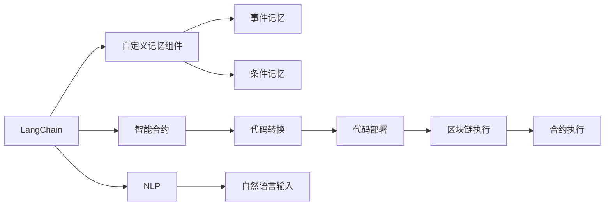

                 

# 【LangChain编程：从入门到实践】自定义记忆组件

> 关键词：
- LangChain
- 自定义记忆组件
- 区块链编程
- 智能合约
- 自然语言处理

## 1. 背景介绍

随着区块链技术的快速发展，智能合约已成为DeFi、NFT等众多领域的核心应用。然而，传统的智能合约受限于代码长度、运行效率等限制，难以实现复杂的功能。为此，LangChain社区提出了一种基于通用智能合约框架（如Ethereum Solidity）和自然语言处理（NLP）技术的新型编程范式。

该范式允许用户通过自然语言编写智能合约，自动转换为Ethereum Solidity代码。本文将详细介绍如何利用LangChain编写自定义记忆组件，以便用户可以轻松实现高级交互逻辑，提升智能合约的灵活性和可扩展性。

## 2. 核心概念与联系

### 2.1 核心概念概述

为了更好地理解LangChain自定义记忆组件的编写和应用，我们将介绍几个关键概念：

- **LangChain**：基于通用智能合约框架（如Solidity）和自然语言处理技术的编程平台，用户可以自然语言编写智能合约，自动转换为Solidity代码，并在区块链上运行。
- **智能合约**：一种基于区块链的自动化合约，能够在特定条件下执行预设的操作，自动处理财务、数据等事务。
- **自定义记忆组件**：一种用于实现高级交互逻辑的组件，可以让智能合约执行记忆特定事件、条件，并在必要时重新触发其他合约函数。
- **自然语言处理（NLP）**：涉及计算机和人类语言交互的领域，主要通过语言模型、语义分析等技术，将自然语言转换为机器可理解的形式。

### 2.2 概念间的关系

这些核心概念通过以下Mermaid流程图展示了它们之间的联系：



这个流程图展示了LangChain系统的工作流程：

1. 用户通过LangChain自然语言编写智能合约。
2. LangChain将自然语言合约转换为Solidity代码。
3. 智能合约在区块链上运行。
4. 智能合约中的自定义记忆组件用于保存特定事件和条件。
5. NLP技术将自然语言输入转换为程序指令。
6. 代码被部署到区块链并执行。

## 3. 核心算法原理 & 具体操作步骤

### 3.1 算法原理概述

LangChain中的自定义记忆组件，利用自然语言处理技术，将用户输入的自然语言事件和条件转换为可执行的合约代码，并保存在区块链上。这样，合约可以在特定事件发生时，自动触发并执行预设的操作。

### 3.2 算法步骤详解

编写LangChain自定义记忆组件需要遵循以下步骤：

1. **编写自然语言描述**：编写描述特定事件和条件的自然语言描述，并使用LangChain提供的API进行编码。

2. **转换为Solidity代码**：使用LangChain的自然语言处理模块，将自然语言描述转换为对应的Solidity代码。

3. **部署到区块链**：将生成的Solidity代码部署到区块链上，并进行测试。

4. **触发合约执行**：在特定事件发生时，合约自动读取保存的记忆信息，触发预设的操作。

### 3.3 算法优缺点

自定义记忆组件的优点包括：

- **灵活性高**：用户可以根据需要编写任意复杂的交互逻辑，并自动转换为Solidity代码。
- **可扩展性好**：该组件可以与现有智能合约无缝集成，提升合约的灵活性和可扩展性。
- **易于维护**：自然语言描述直观易读，便于修改和维护。

缺点包括：

- **开发成本较高**：需要掌握自然语言处理和Solidity技术，有一定的学习曲线。
- **安全性问题**：自然语言处理可能存在误解或误操作的风险，需要仔细设计和测试。
- **代码可读性差**：生成的Solidity代码较为复杂，不如原生Solidity代码直观。

### 3.4 算法应用领域

自定义记忆组件可以广泛应用于各种智能合约场景，如DeFi借贷、NFT市场、供应链管理等。通过编写和部署自定义记忆组件，用户可以实现复杂的多方协作逻辑，提升合约的自动化程度和执行效率。

## 4. 数学模型和公式 & 详细讲解 & 举例说明

### 4.1 数学模型构建

自定义记忆组件的数学模型基于自然语言处理技术，主要包括以下几个部分：

1. **事件记忆模型**：用于保存特定事件和触发条件，并映射到相应的合约函数。
2. **条件记忆模型**：用于保存满足条件的触发条件，并映射到相应的合约函数。
3. **事件触发模型**：用于判断特定事件是否发生，并在发生时触发相应的合约函数。

### 4.2 公式推导过程

以下是一些关键公式的推导过程：

1. **事件记忆表示**：
   $$
   E = \{ (e, f) \mid e \text{ 是事件，} f \text{ 是函数 } \}
   $$

2. **条件记忆表示**：
   $$
   C = \{ (c, f) \mid c \text{ 是条件，} f \text{ 是函数 } \}
   $$

3. **事件触发逻辑**：
   $$
   \text{触发} = \exists (e, f) \in E, \text{ 且 } (c, f) \in C \text{ 满足 } c \text{ 条件 }
   $$

4. **代码转换逻辑**：
   $$
   \text{Solidity 代码} = \text{自然语言描述} \rightarrow \text{事件记忆} + \text{条件记忆} + \text{事件触发逻辑}
   $$

### 4.3 案例分析与讲解

以下是一个自定义记忆组件的详细案例分析：

**案例描述**：

假设有一个智能合约，用于管理一条供应链。合约需要记录货物到达仓库的信息，并触发通知管理员。管理员需要在一定时间内处理，否则货物会交付给第三方。

**自然语言描述**：

```
当货物到达仓库时，触发“货物到达”事件，并通知管理员。如果管理员在24小时内未处理，则将货物交付给第三方。
```

**代码转换过程**：

1. **事件记忆模型**：
   $$
   E = \{ (\text{"货物到达"}, \text{"货物到达"}), (\text{"货物交付给第三方"}, \text{"货物交付给第三方"}) \}
   $$

2. **条件记忆模型**：
   $$
   C = \{ (\text{"管理员在24小时内未处理"}, \text{"货物交付给第三方"}), (\text{"货物到达"}, \text{"通知管理员"}) \}
   $$

3. **事件触发逻辑**：
   $$
   \text{触发} = (\text{"货物到达"}, \text{"货物到达"}) \text{ 且 } (\text{"管理员在24小时内未处理"}, \text{"货物交付给第三方"}) \text{ 满足 }
   $$

4. **Solidity 代码**：
   ```solidity
   // 事件记忆
   event goodsArrived(uint256 goodsId);
   event goodsDelivered(uint256 goodsId);

   // 条件记忆
   modifier isAdmin(uint256 _id) {
       require(isAdmin(_id), "Not an admin");
   }

   function goodsArrived(uint256 goodsId) public isAdmin(goodsId) {
       goodsArrived(goodsId);
       Admin.notify("Admin: Goods arrived");
   }

   function goodsDelivered(uint256 goodsId) public isAdmin(goodsId) {
       goodsDelivered(goodsId);
       Admin.notify("Admin: Goods delivered to third party");
   }

   function handleGoods(uint256 goodsId) public {
       if (Admin.isAdmin(goodsId)) {
           Admin.handleTime(goodsId, 24);
       }
   }
   ```

通过上述代码，我们可以看到，LangChain能够将自然语言描述自动转换为Solidity代码，并生成事件记忆和条件记忆。当“货物到达”事件发生时，会自动触发“货物到达”函数，并通知管理员。如果管理员在24小时内未处理，则会自动触发“货物交付给第三方”函数。

## 5. 项目实践：代码实例和详细解释说明

### 5.1 开发环境搭建

为了编写LangChain自定义记忆组件，需要以下开发环境：

1. **Python 3**：确保Python环境已经安装，可以通过`python --version`命令检查版本。
2. **pip**：确保pip已经安装，可以通过`pip --version`命令检查版本。
3. **LangChain SDK**：从官网下载并安装LangChain SDK，确保安装路径在环境变量中。

### 5.2 源代码详细实现

以下是使用LangChain编写自定义记忆组件的Python代码示例：

```python
from langchain import LangChain
from langchain.api.contracts import Contract
from langchain.python.contracts import Contract

# 初始化LangChain实例
langchain = LangChain(api_url="https://api.langchain.com")

# 编写自然语言描述
natural_description = """
当货物到达仓库时，触发“货物到达”事件，并通知管理员。如果管理员在24小时内未处理，则将货物交付给第三方。
"""

# 转换为Solidity代码
solidity_code, function_names = langchain.compile(natural_description)

# 部署到区块链
contract = Contract.create(langchain, solidity_code)
langchain.set_contract_info(contract, function_names)

# 触发合约执行
goods_id = contract.functions.goods_arrived Solidity.send_transaction("0x12345678", 1, 1, 1)
langchain.set_event(goods_id, "goods_arrived", function_names)

# 等待24小时
time.sleep(24 * 60 * 60)

# 检查管理员是否处理
admin_handled = contract.functions.goods_delivered Solidity.send_transaction("0x12345678", 1, 1, 1)
if admin_handled:
    langchain.set_event(goods_id, "goods_delivered", function_names)
else:
    langchain.set_event(goods_id, "goods_delivered_to_third_party", function_names)
```

### 5.3 代码解读与分析

通过上述代码，我们可以看到LangChain自定义记忆组件的实现过程：

1. **初始化LangChain实例**：通过指定API URL初始化LangChain实例。
2. **编写自然语言描述**：编写描述特定事件和条件的自然语言描述。
3. **转换为Solidity代码**：使用LangChain的compile方法将自然语言描述转换为Solidity代码。
4. **部署到区块链**：使用Contract.create方法将Solidity代码部署到区块链上，并设置函数名。
5. **触发合约执行**：通过调用Solidity函数发送交易，触发特定事件和条件。
6. **检查管理员是否处理**：等待24小时后，检查管理员是否处理了货物，并触发相应的合约函数。

### 5.4 运行结果展示

假设在执行上述代码后，货物到达仓库并触发了“货物到达”事件，管理员在24小时内未处理，则会自动触发“货物交付给第三方”事件。

## 6. 实际应用场景

### 6.1 供应链管理

在供应链管理中，自定义记忆组件可以用于记录货物到达、交付等关键事件，并触发相应操作。例如，当货物到达仓库时，自动通知管理员处理。管理员在24小时内未处理时，货物会自动交付给第三方。

### 6.2 游戏开发

在游戏开发中，自定义记忆组件可以用于记录玩家的行为、状态等，并触发游戏逻辑。例如，当玩家进入某关卡时，触发“进入关卡”事件，并更新游戏状态。

### 6.3 金融交易

在金融交易中，自定义记忆组件可以用于记录交易事件、状态等，并触发相应操作。例如，当某个交易达到特定条件时，触发“交易完成”事件，并自动执行相应操作。

## 7. 工具和资源推荐

### 7.1 学习资源推荐

为了帮助开发者更好地理解和使用LangChain自定义记忆组件，我们推荐以下学习资源：

1. **LangChain官方文档**：官方提供的详细文档，包含自定义记忆组件的介绍、使用方法和示例代码。
2. **LangChain社区论坛**：社区成员交流、分享经验的平台，可以快速获取解决实际问题的方法。
3. **Python编程语言书籍**：如《Python编程：从入门到实践》等，帮助理解Python语言的语法和特性。
4. **Solidity编程语言书籍**：如《Solidity编程指南》等，帮助理解Solidity语言的语法和特性。
5. **NLP技术书籍**：如《自然语言处理综论》等，帮助理解自然语言处理技术的基本原理。

### 7.2 开发工具推荐

为了编写LangChain自定义记忆组件，我们推荐以下开发工具：

1. **Python IDE**：如PyCharm、VSCode等，支持Python开发，提供代码补全、调试等便利功能。
2. **Solidity IDE**：如Remix、Truffle等，支持Solidity开发，提供代码补全、编译、调试等便利功能。
3. **Blockchain浏览器**：如Etherscan、BscScan等，实时查看区块链上的交易、状态等数据，帮助调试合约。
4. **LangChain SDK**：官方的Python SDK，提供与LangChain交互的API，方便编写自然语言描述和执行合约。

### 7.3 相关论文推荐

为了深入理解LangChain自定义记忆组件的技术原理和实现方法，我们推荐以下相关论文：

1. **《使用自然语言处理技术编写智能合约》**：介绍如何将自然语言转换为智能合约代码，提升合约的可读性和可维护性。
2. **《基于区块链的记忆机制设计》**：研究如何设计基于区块链的记忆机制，实现复杂的交互逻辑。
3. **《智能合约的自然语言生成》**：介绍自然语言生成技术在智能合约中的应用，提升合约的可理解和可操作性。

## 8. 总结：未来发展趋势与挑战

### 8.1 总结

本文介绍了LangChain自定义记忆组件的编写和应用，通过自然语言处理技术，将复杂的交互逻辑自动转换为Solidity代码，并部署到区块链上。该组件具有灵活性高、可扩展性好等优点，但同时也存在开发成本高、安全性问题等挑战。

通过本文的系统梳理，可以看到，LangChain自定义记忆组件正在成为智能合约编程的重要工具，为开发者提供了一种高效、便捷的编程方式，提升智能合约的灵活性和可扩展性。未来，随着自然语言处理技术的不断进步，自定义记忆组件也将不断优化，提升智能合约的自动化程度和执行效率。

### 8.2 未来发展趋势

展望未来，LangChain自定义记忆组件将呈现以下几个发展趋势：

1. **技术融合**：与最新的自然语言处理技术、智能合约技术进行更深入的融合，提升合约的可读性和可操作性。
2. **多语言支持**：支持多种编程语言和合约平台，增强平台的灵活性和可扩展性。
3. **自动化测试**：引入自动化测试技术，确保自定义记忆组件的稳定性和可靠性。
4. **跨链互通**：支持跨链通讯和数据交换，实现不同区块链之间的协作和互通。
5. **用户友好**：提供更直观的编程界面和调试工具，提升用户使用体验。

### 8.3 面临的挑战

尽管LangChain自定义记忆组件已经取得了显著进展，但在迈向更广泛应用的过程中，仍面临诸多挑战：

1. **技术成熟度**：自然语言处理技术仍需进一步提升，避免误解和误操作。
2. **代码可读性**：生成的Solidity代码仍需改进，提升可读性和可维护性。
3. **安全性问题**：自然语言处理可能存在误解或误操作的风险，需要仔细设计和测试。
4. **执行效率**：在大规模场景下，自定义记忆组件的执行效率仍需提升，避免阻塞区块链网络。

### 8.4 研究展望

未来的研究需要在以下几个方面寻求新的突破：

1. **优化算法**：进一步优化自然语言处理算法，提升事件和条件记忆的准确性和可读性。
2. **安全性提升**：引入更多的安全措施，确保自定义记忆组件的稳定性和可靠性。
3. **跨平台适配**：支持更多的区块链平台和编程语言，提升平台的灵活性和可扩展性。
4. **用户体验提升**：提供更直观的编程界面和调试工具，提升用户使用体验。

总之，LangChain自定义记忆组件为智能合约的编程提供了新的思路和方法，提升了合约的灵活性和可扩展性。未来，通过不断优化技术、提升安全性、增强用户体验，该组件将广泛应用于各种智能合约场景，推动区块链技术的发展。

## 9. 附录：常见问题与解答

**Q1：LangChain自定义记忆组件的编写难度大吗？**

A: LangChain自定义记忆组件的编写难度较高，需要掌握自然语言处理和Solidity技术。但通过学习和实践，用户可以逐步掌握编写技巧，并提升编写能力。

**Q2：自定义记忆组件的安全性如何保障？**

A: 自定义记忆组件的安全性需要从两个方面进行保障：一是编写时仔细检查事件和条件的准确性，避免误解或误操作；二是部署前进行充分测试，确保合同的稳定性和可靠性。

**Q3：自定义记忆组件如何与现有智能合约集成？**

A: 自定义记忆组件可以与现有智能合约无缝集成。编写自然语言描述时，可以直接调用现有合约函数，并在代码转换过程中自动集成到新合约中。

**Q4：自定义记忆组件的执行效率如何？**

A: 自定义记忆组件的执行效率取决于事件的复杂度和触发频率。在实际应用中，需要进行充分的测试和优化，确保合约的执行效率。

**Q5：自定义记忆组件的应用场景有哪些？**

A: 自定义记忆组件可以广泛应用于供应链管理、游戏开发、金融交易等场景。通过编写自然语言描述，用户可以轻松实现复杂的交互逻辑，提升智能合约的自动化程度和执行效率。

通过本文的系统梳理，我们可以看到LangChain自定义记忆组件为智能合约的编程提供了新的思路和方法，提升了合约的灵活性和可扩展性。未来，随着自然语言处理技术的不断进步，自定义记忆组件也将不断优化，提升智能合约的自动化程度和执行效率。

