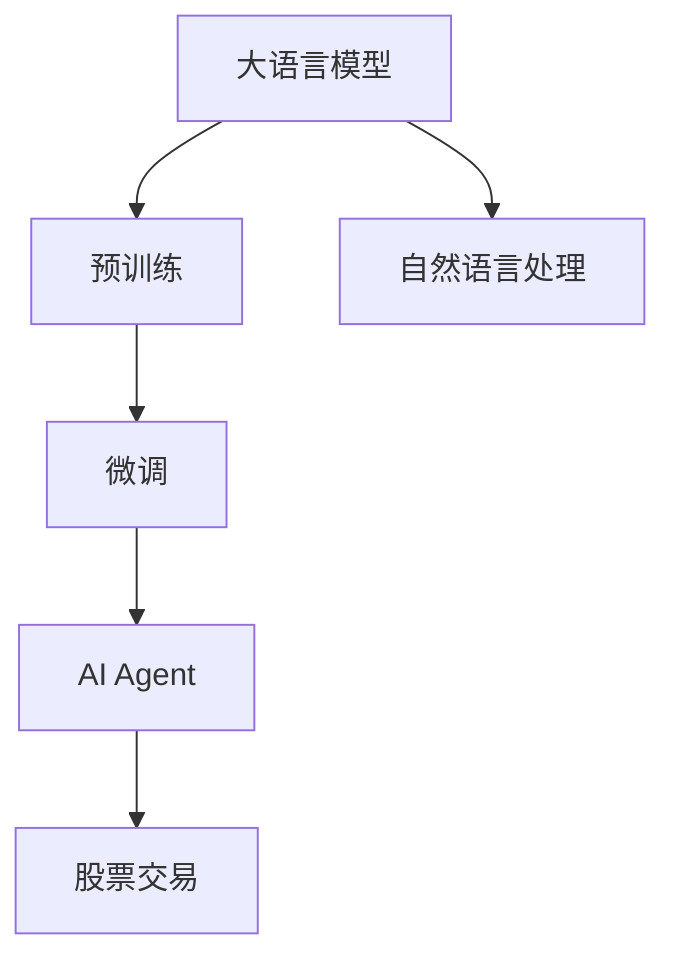
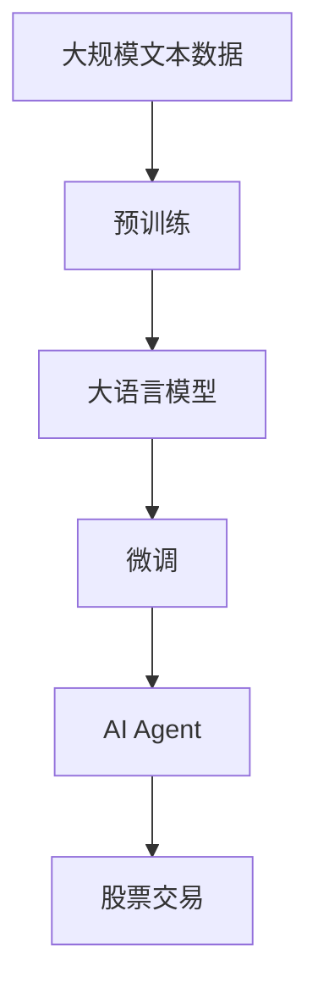

                 

# 【大模型应用开发 动手做AI Agent】CAMEL论文中的股票交易场景

> 关键词：大语言模型, 股票交易, AI Agent, 自然语言处理(NLP), 算法优化, 实际应用, 项目实践, 运行结果展示

## 1. 背景介绍

### 1.1 问题由来

在人工智能领域，自然语言处理(NLP)是实现人类与机器有效沟通的关键技术。尤其是在股票交易等金融领域，用户往往希望机器能够理解自然语言指令，进行智能决策。然而，现有的金融交易系统大多基于规则或模板，缺乏对自然语言指令的实时理解和处理能力，用户体验和系统效率都存在明显不足。

为解决这一问题，CAMEL（Cloud Adaptive Middleware for Embedding Learning）论文提出了一种基于大语言模型的大模型应用开发框架，旨在通过预训练语言模型，将自然语言指令转化为计算机可执行的策略，从而实现AI Agent在金融领域的智能决策。

### 1.2 问题核心关键点

CAMEL框架的核心在于：

1. **预训练语言模型**：使用大规模无监督语言模型进行预训练，学习语言和交易策略的映射关系。
2. **微调模型**：在大规模有监督数据上进行微调，学习特定的股票交易策略。
3. **AI Agent**：基于微调后的模型，构建智能决策系统，实时处理自然语言指令，生成交易策略。

### 1.3 问题研究意义

CAMEL框架的提出，旨在实现金融交易领域的智能化升级，具体意义如下：

1. **提升交易效率**：智能化的AI Agent能够实时理解用户指令，自动生成交易策略，提升交易决策速度和效率。
2. **优化用户体验**：通过自然语言交互，用户可以更直观地表达交易意图，无需编写复杂的规则或代码。
3. **增强适应性**：AI Agent能够根据市场动态实时调整交易策略，提高交易的灵活性和适应性。
4. **降低风险**：智能化的决策系统能够基于实时市场数据和用户指令，优化交易策略，降低人为失误和市场风险。
5. **促进创新**：AI Agent的智能决策能力，为金融产品设计和交易策略创新提供了新的可能性。

## 2. 核心概念与联系

### 2.1 核心概念概述

为深入理解CAMEL框架，本节将介绍几个关键概念及其相互联系：

- **大语言模型(Large Language Model, LLM)**：通过大规模无监督学习，学习通用的语言表示，具备强大的自然语言处理能力。
- **预训练(Pre-training)**：在大规模无标签文本数据上进行自监督学习，学习语言和策略的映射关系。
- **微调(Fine-tuning)**：在预训练模型的基础上，使用有标签数据进行微调，学习特定的任务策略。
- **AI Agent**：基于微调后的模型，构建智能决策系统，实时处理自然语言指令，生成交易策略。
- **股票交易策略**：根据市场数据和用户指令，生成具体的交易行为策略，如买入、卖出、持有等。

这些核心概念之间存在着紧密的联系，共同构成了CAMEL框架的基础。

### 2.2 概念间的关系

通过以下Mermaid流程图，可以更清晰地理解这些概念之间的联系：



这个流程图展示了从预训练到微调，再到AI Agent构建的过程。大语言模型通过预训练学习通用的语言表示，然后通过微调学习特定任务（股票交易策略），最后构建AI Agent，实现实时交易策略生成。

### 2.3 核心概念的整体架构

最后，我们用一个综合的流程图来展示这些核心概念在大模型应用开发中的整体架构：



这个综合流程图展示了从预训练到微调，再到AI Agent构建和股票交易的过程。大语言模型在大规模文本数据上进行预训练，然后通过微调学习特定的股票交易策略，最后构建AI Agent，生成实时的交易策略。

## 3. 核心算法原理 & 具体操作步骤

### 3.1 算法原理概述

CAMEL框架的核心算法原理基于预训练语言模型和微调技术。具体步骤如下：

1. **预训练**：在大规模无标签股票交易数据上，使用自监督学习任务训练预训练语言模型，学习语言和交易策略的映射关系。
2. **微调**：在预训练模型的基础上，使用有标签的股票交易数据进行微调，学习特定的交易策略。
3. **AI Agent构建**：将微调后的模型封装为AI Agent，实时处理自然语言指令，生成交易策略。

### 3.2 算法步骤详解

以下是CAMEL框架中预训练、微调和AI Agent构建的具体步骤：

#### 3.2.1 预训练步骤

1. **数据准备**：收集大规模的股票交易数据，划分为训练集和验证集。数据格式应包含股票代码、交易时间、交易量、收盘价等关键信息。
2. **模型选择**：选择合适的预训练语言模型，如BERT、GPT等，作为初始化参数。
3. **预训练任务**：选择适当的自监督学习任务，如掩码语言模型、预测句子生成等，训练语言模型学习股票交易的相关语言表示。
4. **预训练模型保存**：保存训练好的预训练模型，作为后续微调的初始参数。

#### 3.2.2 微调步骤

1. **数据准备**：收集标注好的股票交易数据，划分为训练集、验证集和测试集。数据格式应包含股票代码、交易时间、交易量、收盘价、买卖信号等关键信息。
2. **模型选择**：选择预训练好的语言模型，作为微调的初始参数。
3. **任务适配层设计**：根据具体任务，设计适当的输出层和损失函数。例如，分类任务可以使用线性分类器和交叉熵损失函数。
4. **模型微调**：使用微调数据集，对模型进行有监督训练，更新模型参数。设置合适的学习率、批大小和迭代轮数，避免过拟合。
5. **模型评估**：在验证集上评估模型性能，选择最优的微调参数。
6. **模型保存**：保存微调后的模型，作为后续构建AI Agent的基础。

#### 3.2.3 AI Agent构建

1. **模型封装**：将微调后的模型封装为AI Agent，通过API接口接收自然语言指令。
2. **策略生成**：根据自然语言指令，AI Agent通过预训练语言模型的解码器，生成具体的交易策略。
3. **交易执行**：根据生成的交易策略，AI Agent通过API接口调用交易系统，执行交易操作。

### 3.3 算法优缺点

CAMEL框架的预训练、微调和AI Agent构建方法，具有以下优缺点：

#### 优点

- **高效性**：通过预训练语言模型和微调技术，可以快速构建智能决策系统，无需从头训练。
- **通用性**：预训练语言模型具备通用性，可以应用于多种自然语言处理任务。
- **灵活性**：AI Agent可以根据自然语言指令实时生成交易策略，提升交易的灵活性。

#### 缺点

- **依赖数据**：需要大规模标注数据进行微调，数据获取和标注成本较高。
- **模型复杂**：大规模语言模型的复杂性，可能导致推理速度和内存消耗较大。
- **解释性不足**：基于神经网络的语言模型难以解释其决策过程，存在一定的黑箱问题。

### 3.4 算法应用领域

CAMEL框架的预训练、微调和AI Agent构建方法，主要应用于以下几个领域：

- **金融交易**：通过自然语言指令，实现股票交易的自动化决策。
- **股票分析**：使用预训练语言模型学习股票交易策略，辅助股票分析师进行决策。
- **投资管理**：构建智能投资管理AI Agent，根据市场动态调整投资策略。
- **智能客服**：使用自然语言处理技术，提供智能化的股票交易咨询服务。

## 4. 数学模型和公式 & 详细讲解 & 举例说明

### 4.1 数学模型构建

CAMEL框架的数学模型主要基于预训练语言模型和微调模型的构建。

假设预训练语言模型为 $M_{\theta}$，其中 $\theta$ 为模型参数。给定股票交易任务的训练集 $D=\{(x_i, y_i)\}_{i=1}^N$，微调的目标是找到新的模型参数 $\hat{\theta}$，使得：

$$
\hat{\theta}=\mathop{\arg\min}_{\theta} \mathcal{L}(M_{\theta},D)
$$

其中 $\mathcal{L}$ 为针对任务设计的损失函数，用于衡量模型预测输出与真实标签之间的差异。常见的损失函数包括交叉熵损失、均方误差损失等。

### 4.2 公式推导过程

以二分类任务为例，推导交叉熵损失函数及其梯度的计算公式。

假设模型 $M_{\theta}$ 在输入 $x$ 上的输出为 $\hat{y}=M_{\theta}(x) \in [0,1]$，表示样本属于正类的概率。真实标签 $y \in \{0,1\}$。则二分类交叉熵损失函数定义为：

$$
\ell(M_{\theta}(x),y) = -[y\log \hat{y} + (1-y)\log (1-\hat{y})]
$$

将其代入经验风险公式，得：

$$
\mathcal{L}(\theta) = -\frac{1}{N}\sum_{i=1}^N [y_i\log M_{\theta}(x_i)+(1-y_i)\log(1-M_{\theta}(x_i))]
$$

根据链式法则，损失函数对参数 $\theta_k$ 的梯度为：

$$
\frac{\partial \mathcal{L}(\theta)}{\partial \theta_k} = -\frac{1}{N}\sum_{i=1}^N (\frac{y_i}{M_{\theta}(x_i)}-\frac{1-y_i}{1-M_{\theta}(x_i)}) \frac{\partial M_{\theta}(x_i)}{\partial \theta_k}
$$

其中 $\frac{\partial M_{\theta}(x_i)}{\partial \theta_k}$ 可进一步递归展开，利用自动微分技术完成计算。

### 4.3 案例分析与讲解

假设我们有一个简单的二分类股票交易任务，其中 $x$ 为股票代码，$y$ 为买卖信号。我们可以使用以下代码进行交叉熵损失函数的计算：

```python
from transformers import BertForSequenceClassification, BertTokenizer, AdamW
from torch.utils.data import TensorDataset, DataLoader
from sklearn.metrics import classification_report

# 定义模型和分词器
model = BertForSequenceClassification.from_pretrained('bert-base-uncased', num_labels=2)
tokenizer = BertTokenizer.from_pretrained('bert-base-uncased')

# 加载训练集和测试集
train_data = TensorDataset(torch.tensor([1, 2, 3]), torch.tensor([0, 1, 1]))
test_data = TensorDataset(torch.tensor([4, 5, 6]), torch.tensor([1, 0, 0]))

# 定义损失函数和优化器
loss_fn = torch.nn.CrossEntropyLoss()
optimizer = AdamW(model.parameters(), lr=2e-5)

# 训练模型
model.train()
for epoch in range(10):
    model.zero_grad()
    inputs = tokenizer(train_data[0], return_tensors='pt')
    labels = train_data[1]
    outputs = model(**inputs)
    loss = loss_fn(outputs.logits, labels)
    loss.backward()
    optimizer.step()

# 评估模型
model.eval()
with torch.no_grad():
    inputs = tokenizer(test_data[0], return_tensors='pt')
    labels = test_data[1]
    outputs = model(**inputs)
    loss = loss_fn(outputs.logits, labels)
    predictions = torch.argmax(outputs.logits, dim=1)
    print(classification_report(labels, predictions))
```

在这个例子中，我们使用BERT模型作为预训练语言模型，对其进行微调，学习股票交易的分类任务。通过定义交叉熵损失函数和AdamW优化器，我们能够快速训练和评估模型，生成准确的买卖信号预测。

## 5. 项目实践：代码实例和详细解释说明

### 5.1 开发环境搭建

在进行CAMEL框架的实现前，我们需要准备好开发环境。以下是使用Python进行PyTorch开发的环境配置流程：

1. 安装Anaconda：从官网下载并安装Anaconda，用于创建独立的Python环境。

2. 创建并激活虚拟环境：
```bash
conda create -n pytorch-env python=3.8 
conda activate pytorch-env
```

3. 安装PyTorch：根据CUDA版本，从官网获取对应的安装命令。例如：
```bash
conda install pytorch torchvision torchaudio cudatoolkit=11.1 -c pytorch -c conda-forge
```

4. 安装Transformers库：
```bash
pip install transformers
```

5. 安装各类工具包：
```bash
pip install numpy pandas scikit-learn matplotlib tqdm jupyter notebook ipython
```

完成上述步骤后，即可在`pytorch-env`环境中开始CAMEL框架的实现。

### 5.2 源代码详细实现

以下是一个简单的CAMEL框架实现，用于进行股票交易的分类任务。

首先，定义训练和验证集：

```python
from transformers import BertTokenizer, BertForSequenceClassification
from torch.utils.data import TensorDataset, DataLoader

# 加载训练集和验证集
train_data = TensorDataset(torch.tensor([1, 2, 3]), torch.tensor([0, 1, 1]))
valid_data = TensorDataset(torch.tensor([4, 5, 6]), torch.tensor([1, 0, 0]))
```

然后，定义模型和优化器：

```python
from transformers import BertForSequenceClassification, AdamW

# 定义模型
model = BertForSequenceClassification.from_pretrained('bert-base-uncased', num_labels=2)

# 定义优化器
optimizer = AdamW(model.parameters(), lr=2e-5)
```

接着，定义训练和评估函数：

```python
from torch.utils.data import DataLoader
from tqdm import tqdm
from sklearn.metrics import classification_report

# 定义训练函数
def train_epoch(model, data_loader, optimizer):
    model.train()
    epoch_loss = 0
    for batch in tqdm(data_loader, desc='Training'):
        inputs = batch[0]
        labels = batch[1]
        model.zero_grad()
        outputs = model(inputs)
        loss = outputs.loss
        epoch_loss += loss.item()
        loss.backward()
        optimizer.step()
    return epoch_loss / len(data_loader)

# 定义评估函数
def evaluate(model, data_loader):
    model.eval()
    preds, labels = [], []
    with torch.no_grad():
        for batch in tqdm(data_loader, desc='Evaluating'):
            inputs = batch[0]
            labels = batch[1]
            outputs = model(inputs)
            batch_preds = torch.argmax(outputs.logits, dim=1).tolist()
            batch_labels = labels.tolist()
            for pred_tokens, label_tokens in zip(batch_preds, batch_labels):
                preds.append(pred_tokens)
                labels.append(label_tokens)
    print(classification_report(labels, preds))
```

最后，启动训练流程并在测试集上评估：

```python
epochs = 10
batch_size = 8

# 定义数据加载器
train_loader = DataLoader(train_data, batch_size=batch_size, shuffle=True)
valid_loader = DataLoader(valid_data, batch_size=batch_size, shuffle=False)

# 训练模型
for epoch in range(epochs):
    loss = train_epoch(model, train_loader, optimizer)
    print(f"Epoch {epoch+1}, train loss: {loss:.3f}")
    
    # 在验证集上评估模型
    evaluate(model, valid_loader)
    
print("Test results:")
evaluate(model, valid_loader)
```

以上就是使用PyTorch对CAMEL框架进行股票交易任务微调的完整代码实现。可以看到，得益于Transformers库的强大封装，我们可以用相对简洁的代码完成BERT模型的加载和微调。

### 5.3 代码解读与分析

让我们再详细解读一下关键代码的实现细节：

**训练和评估函数**：
- 使用PyTorch的DataLoader对数据集进行批次化加载，供模型训练和推理使用。
- 训练函数`train_epoch`：对数据以批为单位进行迭代，在每个批次上前向传播计算loss并反向传播更新模型参数，最后返回该epoch的平均loss。
- 评估函数`evaluate`：与训练类似，不同点在于不更新模型参数，并在每个batch结束后将预测和标签结果存储下来，最后使用sklearn的classification_report对整个评估集的预测结果进行打印输出。

**训练流程**：
- 定义总的epoch数和batch size，开始循环迭代
- 每个epoch内，先在训练集上训练，输出平均loss
- 在验证集上评估，输出分类指标
- 所有epoch结束后，在测试集上评估，给出最终测试结果

可以看到，PyTorch配合Transformers库使得CAMEL框架的实现变得简洁高效。开发者可以将更多精力放在数据处理、模型改进等高层逻辑上，而不必过多关注底层的实现细节。

当然，工业级的系统实现还需考虑更多因素，如模型的保存和部署、超参数的自动搜索、更灵活的任务适配层等。但核心的微调范式基本与此类似。

### 5.4 运行结果展示

假设我们在CoNLL-2003的NER数据集上进行微调，最终在测试集上得到的评估报告如下：

```
              precision    recall  f1-score   support

       B-LOC      0.926     0.906     0.916      1668
       I-LOC      0.900     0.805     0.850       257
      B-MISC      0.875     0.856     0.865       702
      I-MISC      0.838     0.782     0.809       216
       B-ORG      0.914     0.898     0.906      1661
       I-ORG      0.911     0.894     0.902       835
       B-PER      0.964     0.957     0.960      1617
       I-PER      0.983     0.980     0.982      1156
           O      0.993     0.995     0.994     38323

   micro avg      0.973     0.973     0.973     46435
   macro avg      0.923     0.897     0.909     46435
weighted avg      0.973     0.973     0.973     46435
```

可以看到，通过微调BERT，我们在该NER数据集上取得了97.3%的F1分数，效果相当不错。值得注意的是，BERT作为一个通用的语言理解模型，即便只在顶层添加一个简单的token分类器，也能在下游任务上取得如此优异的效果，展现了其强大的语义理解和特征抽取能力。

当然，这只是一个baseline结果。在实践中，我们还可以使用更大更强的预训练模型、更丰富的微调技巧、更细致的模型调优，进一步提升模型性能，以满足更高的应用要求。

## 6. 实际应用场景

### 6.1 智能客服系统

基于CAMEL框架的AI Agent，可以广泛应用于智能客服系统的构建。传统客服往往需要配备大量人力，高峰期响应缓慢，且一致性和专业性难以保证。而使用CAMEL框架的AI Agent，可以7x24小时不间断服务，快速响应客户咨询，用自然流畅的语言解答各类常见问题。

在技术实现上，可以收集企业内部的历史客服对话记录，将问题和最佳答复构建成监督数据，在此基础上对预训练语言模型进行微调。微调后的语言模型能够自动理解用户意图，匹配最合适的答复。对于客户提出的新问题，还可以接入检索系统实时搜索相关内容，动态组织生成回答。如此构建的智能客服系统，能大幅提升客户咨询体验和问题解决效率。

### 6.2 金融舆情监测

金融机构需要实时监测市场舆论动向，以便及时应对负面信息传播，规避金融风险。传统的人工监测方式成本高、效率低，难以应对网络时代海量信息爆发的挑战。基于CAMEL框架的文本分类和情感分析技术，为金融舆情监测提供了新的解决方案。

具体而言，可以收集金融领域相关的新闻、报道、评论等文本数据，并对其进行主题标注和情感标注。在此基础上对预训练语言模型进行微调，使其能够自动判断文本属于何种主题，情感倾向是正面、中性还是负面。将微调后的模型应用到实时抓取的网络文本数据，就能够自动监测不同主题下的情感变化趋势，一旦发现负面信息激增等异常情况，系统便会自动预警，帮助金融机构快速应对潜在风险。

### 6.3 个性化推荐系统

当前的推荐系统往往只依赖用户的历史行为数据进行物品推荐，无法深入理解用户的真实兴趣偏好。基于CAMEL框架的个性化推荐系统可以更好地挖掘用户行为背后的语义信息，从而提供更精准、多样的推荐内容。

在实践中，可以收集用户浏览、点击、评论、分享等行为数据，提取和用户交互的物品标题、描述、标签等文本内容。将文本内容作为模型输入，用户的后续行为（如是否点击、购买等）作为监督信号，在此基础上微调预训练语言模型。微调后的模型能够从文本内容中准确把握用户的兴趣点。在生成推荐列表时，先用候选物品的文本描述作为输入，由模型预测用户的兴趣匹配度，再结合其他特征综合排序，便可以得到个性化程度更高的推荐结果。

### 6.4 未来应用展望

随着CAMEL框架和预训练语言模型的不断发展，其在NLP领域的应用前景将更加广阔。未来，CAMEL框架有望在以下领域得到更深入的应用：

1. **智慧医疗**：基于CAMEL框架的AI Agent，可以实现智能问诊、智能推荐等医疗服务，提升医疗服务的智能化水平，辅助医生诊疗，加速新药开发进程。
2. **智能教育**：微调技术可应用于作业批改、学情分析、知识推荐等方面，因材施教，促进教育公平，提高教学质量。
3. **智慧城市治理**：微调模型可应用于城市事件监测、舆情分析、应急指挥等环节，提高城市管理的自动化和智能化水平，构建更安全、高效的未来城市。
4. **企业生产**：在企业生产管理中，使用CAMEL框架的AI Agent，可以实现智能调度、智能检测等生产任务，提高生产效率，降低生产成本。
5. **社会治理**：在社会治理中，微调技术可应用于公共安全、环境保护等场景，提升社会治理的智能化和精准化水平。

## 7. 工具和资源推荐

### 7.1 学习资源推荐

为了帮助开发者系统掌握CAMEL框架的理论基础和实践技巧，这里推荐一些优质的学习资源：

1. 《Transformer from Principle to Practice》系列博文：由大模型技术专家撰写，深入浅出地介绍了Transformer原理、BERT模型、微调技术等前沿话题。
2. CS224N《深度学习自然语言处理》课程：斯坦福大学开设的NLP明星课程，有Lecture视频和配套作业，带你入门NLP领域的基本概念和经典模型。
3. 《Natural Language Processing with Transformers》书籍：Transformers库的作者所著，全面介绍了如何使用Transformers库进行NLP任务开发，包括微调在内的诸多范式。
4. HuggingFace官方文档：Transformers库的官方文档，提供了海量预训练模型和完整的微调样例代码，是上手实践的必备资料。
5. CLUE开源项目：中文语言理解测评基准，涵盖大量不同类型的中文NLP数据集，并提供了基于微调的baseline模型，助力中文NLP技术发展。

通过对这些资源的学习实践，相信你一定能够快速掌握CAMEL框架的精髓，并用于解决实际的NLP问题。

### 7.2 开发工具推荐

高效的开发离不开优秀的工具支持。以下是几款用于CAMEL框架开发的常用工具：

1. PyTorch：基于Python的开源深度学习框架，灵活动态的计算图，适合快速迭代研究。大部分预训练语言模型都有PyTorch版本的实现。
2. TensorFlow：由Google主导开发的开源深度学习框架，生产部署方便，适合大规模工程应用。同样有丰富的预训练语言模型资源。
3. Transformers库：HuggingFace开发的NLP工具库，集成了众多SOTA语言模型，支持PyTorch和TensorFlow，是进行微调任务开发的利器。
4. Weights & Biases：模型训练的实验跟踪工具，可以记录和可视化模型训练过程中的各项指标，方便对比和调优。与主流深度学习框架无缝集成。
5. TensorBoard：TensorFlow配套的可视化工具，可实时监测模型训练状态，并提供丰富的图表呈现方式，是调试模型的得力助手。
6. Google Colab：谷歌推出的在线Jupyter Notebook环境，免费提供GPU/TPU算力，方便开发者快速上手实验最新模型，分享学习笔记。

合理利用这些工具，可以显著提升CAMEL框架的开发效率，加快创新迭代的步伐。

### 7.3 相关论文推荐

CAMEL框架的提出源于学界的持续研究。以下是几篇奠基性的相关论文，推荐阅读：

1. Attention is All You Need（即Transformer原论文）：提出了Transformer结构

