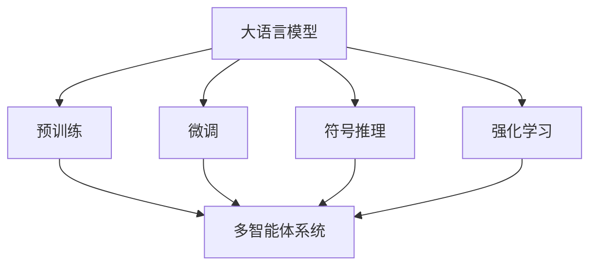
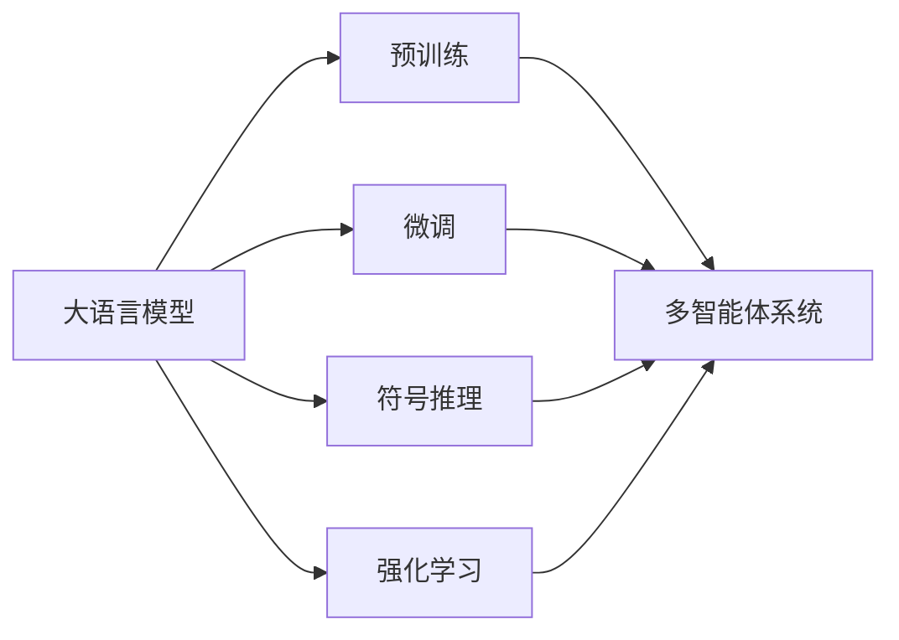
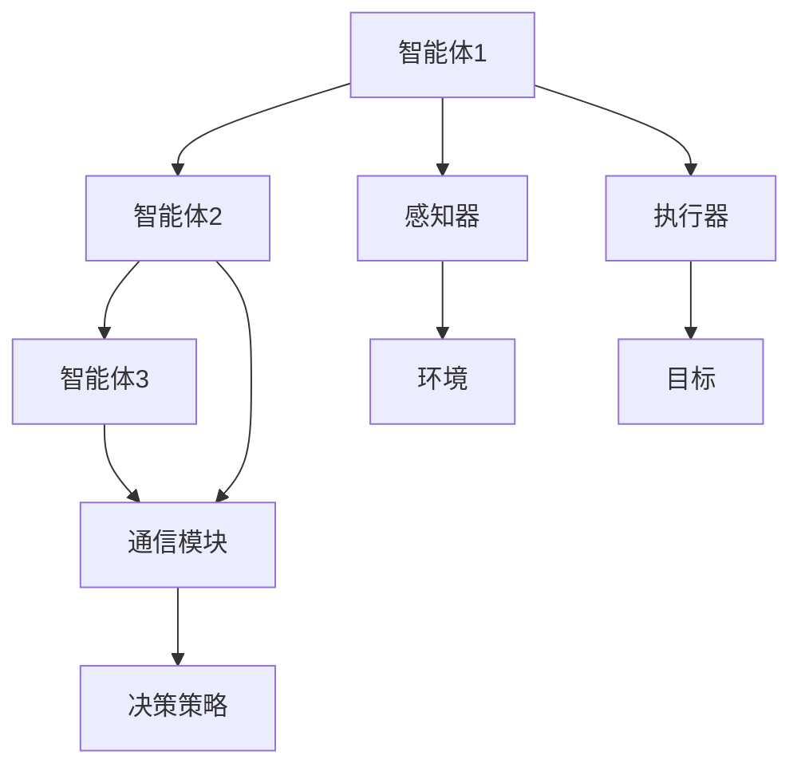
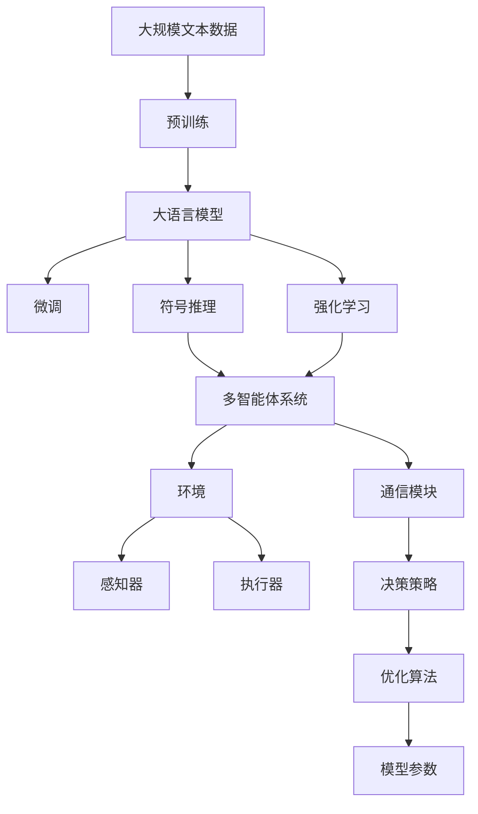

                 

# 【大模型应用开发 动手做AI Agent】基于大模型的Agent技术框架

> 关键词：大模型,Agent技术,大语言模型,自然语言处理(NLP),多智能体系统(MAS),强化学习(Reinforcement Learning),符号推理

## 1. 背景介绍

### 1.1 问题由来

近年来，随着深度学习技术的快速发展，基于大模型的AI Agent技术在自然语言处理(NLP)、智能推荐、游戏智能等众多领域展现了巨大的潜力和应用前景。然而，现有的AI Agent技术在诸多关键问题上仍存在挑战：

1. **计算资源需求高**：训练和推理超大模型的计算资源需求极高，难以快速迭代更新。
2. **数据稀缺**：许多高价值的应用场景中，数据获取困难且成本高昂。
3. **模型复杂性高**：传统的符号AI Agent系统需要大量的规则和逻辑，难以扩展和维护。
4. **模型可解释性差**：复杂的神经网络模型缺乏足够的可解释性，难以理解和调试。

为了应对这些挑战，本文提出了一种基于大模型的Agent技术框架，旨在结合符号AI和深度学习，构建具有高效计算、广泛知识、良好可解释性的AI Agent系统。

### 1.2 问题核心关键点

基于大模型的AI Agent技术框架的核心思想是通过大语言模型和大规模符号推理系统的融合，构建高效、灵活、可解释的AI Agent。具体来说：

1. **预训练-微调框架**：利用大语言模型在大规模文本数据上进行预训练，然后通过微调学习特定任务或环境的规则和策略。
2. **符号推理模块**：在大模型的基础上引入符号推理技术，使AI Agent能够理解和执行具体的规则和逻辑。
3. **多智能体交互**：结合多智能体系统(MAS)技术，使AI Agent能够在复杂环境中与其他智能体进行协作和竞争。
4. **强化学习机制**：引入强化学习算法，使AI Agent能够通过与环境的交互不断优化决策策略。

通过这些关键技术，AI Agent能够在复杂多变的环境中展现出卓越的适应能力和执行效率。

### 1.3 问题研究意义

基于大模型的AI Agent技术框架的研究具有重要意义：

1. **提升智能系统的性能**：通过大模型的预训练和微调，AI Agent能够迅速适应新环境，并在复杂任务中表现出色。
2. **降低计算成本**：相较于从头训练，微调方法能够在保持模型性能的同时，大幅减少计算资源的需求。
3. **拓展应用范围**：大模型的广泛知识库能够支持各种领域的AI Agent开发，提高系统通用性。
4. **提高系统的可解释性**：引入符号推理技术，使AI Agent的决策过程具有更高的可解释性和可理解性。
5. **推动技术产业化**：AI Agent技术能够在众多实际应用中落地，如智能客服、智能推荐、智能家居等，具有显著的经济价值和社会效益。

## 2. 核心概念与联系

### 2.1 核心概念概述

为更好地理解基于大模型的AI Agent技术框架，本节将介绍几个密切相关的核心概念：

- **大语言模型(Large Language Model, LLM)**：如GPT、BERT等，通过在大规模文本数据上进行自监督学习，获得丰富的语言知识。
- **符号推理(Symbolic Reasoning)**：基于逻辑规则和数学推导的推理方法，用于解决需要精确推理的任务。
- **强化学习(Reinforcement Learning, RL)**：通过与环境的交互，使智能体学习最优策略的机器学习算法。
- **多智能体系统(Multi-Agent System, MAS)**：多个智能体在复杂环境中协作或竞争的体系，用于处理多目标、多维度的问题。
- **AI Agent**：智能体在AI系统中的具体实现，能够感知环境、执行任务并与其他智能体交互。

这些核心概念之间的逻辑关系可以通过以下Mermaid流程图来展示：



这个流程图展示了从预训练到微调，再到符号推理和强化学习的完整流程，以及多智能体系统在其中的作用。

### 2.2 概念间的关系

这些核心概念之间存在着紧密的联系，形成了基于大模型的AI Agent技术框架的完整生态系统。下面我通过几个Mermaid流程图来展示这些概念之间的关系。

#### 2.2.1 大语言模型的学习范式



这个流程图展示了大语言模型的三种主要学习范式：预训练、微调和符号推理、强化学习。预训练主要采用自监督学习方法，微调和符号推理/强化学习是有监督学习的过程。

#### 2.2.2 多智能体系统的交互模式



这个流程图展示了多智能体系统中的交互模式：智能体通过感知器感知环境，执行器执行任务，通信模块进行信息交换，决策策略通过强化学习不断优化。

#### 2.2.3 强化学习的奖励机制


这个流程图展示了强化学习的基本机制：智能体在环境中执行动作，根据奖励函数获得反馈，决策策略根据奖励和状态不断优化。

### 2.3 核心概念的整体架构

最后，我们用一个综合的流程图来展示这些核心概念在大模型AI Agent微调过程中的整体架构：



这个综合流程图展示了从预训练到微调，再到符号推理、强化学习和多智能体系统的完整过程。大语言模型首先在大规模文本数据上进行预训练，然后通过微调学习特定任务或环境的规则和策略。在符号推理模块中，AI Agent能够理解和执行具体的规则和逻辑。通过强化学习机制，AI Agent能够在复杂环境中通过与环境的交互不断优化决策策略。最后，多智能体系统使得AI Agent能够在更复杂的环境中与其他智能体进行协作和竞争。

## 3. 核心算法原理 & 具体操作步骤
### 3.1 算法原理概述

基于大模型的AI Agent技术框架的核心算法包括大语言模型的预训练和微调、符号推理技术和强化学习算法。

**3.1.1 预训练和微调**

大语言模型的预训练和微调过程与常规的自然语言处理任务相似。首先，在无标签大规模文本数据上，通过自监督学习任务（如掩码语言模型、下一句预测）进行预训练，获得基础的语言表示能力。然后，在特定任务或环境的数据集上进行微调，通过有监督学习任务（如分类、生成、对话等）优化模型，使其适应特定应用场景。

**3.1.2 符号推理**

符号推理技术将大模型的连续输出转换为离散逻辑表达，从而支持需要精确推理的任务。符号推理模块通常包括知识库和推理引擎。知识库存储领域专家的知识，推理引擎利用这些知识进行逻辑推理和判断。在大模型的基础上，符号推理模块可以扩展为专家系统或知识图谱，进一步提升系统的可靠性和可解释性。

**3.1.3 强化学习**

强化学习算法通过与环境的交互，使AI Agent不断优化决策策略。强化学习通常涉及状态、动作、奖励、决策策略和优化算法等关键组件。在大模型的基础上，强化学习可以通过与环境的互动，学习最优的决策策略，提高系统的自适应能力和执行效率。

### 3.2 算法步骤详解

**Step 1: 准备预训练模型和数据集**

1. 选择合适的预训练语言模型 $M_{\theta}$ 作为初始化参数，如 GPT、BERT 等。
2. 准备任务或环境的标注数据集 $D=\{(x_i,y_i)\}_{i=1}^N$，其中 $x_i$ 为输入数据，$y_i$ 为任务或环境的标签。
3. 划分数据集为训练集、验证集和测试集。

**Step 2: 微调大语言模型**

1. 使用微调算法（如 AdamW、SGD 等），设置学习率、批大小、迭代轮数等超参数。
2. 在训练集上进行前向传播计算损失函数。
3. 反向传播计算参数梯度，根据设定的优化算法和学习率更新模型参数。
4. 在验证集上评估模型性能，根据性能指标决定是否触发 Early Stopping。
5. 重复上述步骤直至满足预设的迭代轮数或 Early Stopping 条件。

**Step 3: 符号推理模块设计**

1. 构建知识库，存储领域专家的知识。
2. 设计推理引擎，利用知识库进行逻辑推理和判断。
3. 在大模型的基础上，引入符号推理模块，将连续输出转换为离散逻辑表达。

**Step 4: 强化学习机制实现**

1. 定义状态、动作、奖励和决策策略。
2. 设计强化学习算法，如 Q-learning、SARSA 等。
3. 通过与环境的交互，智能体不断优化决策策略。
4. 使用优化算法（如梯度下降）更新模型参数，以适应强化学习过程。

**Step 5: 多智能体系统设计**

1. 设计感知器和执行器，使智能体能够感知环境并执行任务。
2. 设计通信模块，使智能体能够进行信息交换和协作。
3. 引入多智能体系统，使智能体能够在复杂环境中协作或竞争。
4. 设计决策策略，通过优化算法不断优化智能体的决策行为。

**Step 6: 模型部署与监控**

1. 将微调后的模型和符号推理模块集成到多智能体系统中。
2. 部署模型到实际环境中，进行实际任务执行。
3. 实时监控模型性能，设置异常告警阈值，确保系统稳定运行。

以上是基于大模型的AI Agent技术框架的一般流程。在实际应用中，还需要根据具体任务和环境，对各环节进行优化设计，以进一步提升系统性能。

### 3.3 算法优缺点

基于大模型的AI Agent技术框架具有以下优点：

1. **高效计算**：大模型具有强大的语言表示能力，能够快速适应新任务，提高系统效率。
2. **广泛知识**：大模型的预训练能够提供广泛的知识，提升系统的通用性和适应性。
3. **良好可解释性**：符号推理技术能够使系统的决策过程具有更高的可解释性和可理解性。
4. **灵活扩展**：多智能体系统能够支持复杂的协作和竞争机制，提高系统的灵活性和可扩展性。

同时，该框架也存在以下局限性：

1. **计算资源需求高**：大模型的训练和推理需要高性能计算资源，可能存在计算瓶颈。
2. **数据依赖性高**：微调和强化学习需要大量标注数据，数据获取和标注成本较高。
3. **模型复杂性高**：系统的复杂度增加，可能难以调试和维护。
4. **可解释性差**：部分大模型的决策过程缺乏足够的可解释性，难以理解和调试。

尽管存在这些局限性，但就目前而言，基于大模型的AI Agent技术框架仍是最前沿的研究方向之一。未来相关研究的重点在于如何进一步降低计算和数据依赖，提高模型的可解释性和灵活性。

### 3.4 算法应用领域

基于大模型的AI Agent技术框架已经在诸多领域得到了广泛的应用，例如：

- **智能推荐系统**：利用大模型的语言表示能力和符号推理模块，实现更精准的推荐。
- **智能客服系统**：通过多智能体系统和强化学习，构建7x24小时不间断服务，提升客户咨询体验。
- **智能问答系统**：结合预训练和微调，提高系统的问答准确率和理解能力。
- **智能游戏**：利用多智能体系统和强化学习，构建复杂智能游戏，提升游戏体验和智能水平。
- **智慧医疗**：结合预训练和符号推理，构建智能诊断系统，提高诊疗效率和准确性。
- **智能交通**：通过多智能体系统和强化学习，优化交通管理，提升交通效率。

除了上述这些领域外，AI Agent技术还在金融、物流、教育等诸多领域展现出巨大的应用潜力。随着预训练模型和微调方法的不断进步，基于大模型的AI Agent技术框架必将在更多领域得到应用，为各行各业带来新的变革。

## 4. 数学模型和公式 & 详细讲解  
### 4.1 数学模型构建

本节将使用数学语言对基于大模型的AI Agent技术框架进行更加严格的刻画。

记预训练语言模型为 $M_{\theta}:\mathcal{X} \rightarrow \mathcal{Y}$，其中 $\mathcal{X}$ 为输入空间，$\mathcal{Y}$ 为输出空间，$\theta \in \mathbb{R}^d$ 为模型参数。假设任务或环境的训练集为 $D=\{(x_i,y_i)\}_{i=1}^N$，其中 $x_i \in \mathcal{X}$ 为输入数据，$y_i \in \mathcal{Y}$ 为任务或环境的标签。

定义模型 $M_{\theta}$ 在数据样本 $(x,y)$ 上的损失函数为 $\ell(M_{\theta}(x),y)$，则在数据集 $D$ 上的经验风险为：

$$
\mathcal{L}(\theta) = \frac{1}{N} \sum_{i=1}^N \ell(M_{\theta}(x_i),y_i)
$$

微调的优化目标是最小化经验风险，即找到最优参数：

$$
\theta^* = \mathop{\arg\min}_{\theta} \mathcal{L}(\theta)
$$

在实践中，我们通常使用基于梯度的优化算法（如AdamW、SGD等）来近似求解上述最优化问题。设 $\eta$ 为学习率，$\lambda$ 为正则化系数，则参数的更新公式为：

$$
\theta \leftarrow \theta - \eta \nabla_{\theta}\mathcal{L}(\theta) - \eta\lambda\theta
$$

其中 $\nabla_{\theta}\mathcal{L}(\theta)$ 为损失函数对参数 $\theta$ 的梯度，可通过反向传播算法高效计算。

### 4.2 公式推导过程

以下我们以二分类任务为例，推导交叉熵损失函数及其梯度的计算公式。

假设模型 $M_{\theta}$ 在输入 $x$ 上的输出为 $\hat{y}=M_{\theta}(x) \in [0,1]$，表示样本属于正类的概率。真实标签 $y \in \{0,1\}$。则二分类交叉熵损失函数定义为：

$$
\ell(M_{\theta}(x),y) = -[y\log \hat{y} + (1-y)\log (1-\hat{y})]
$$

将其代入经验风险公式，得：

$$
\mathcal{L}(\theta) = -\frac{1}{N}\sum_{i=1}^N [y_i\log M_{\theta}(x_i)+(1-y_i)\log(1-M_{\theta}(x_i))]
$$

根据链式法则，损失函数对参数 $\theta_k$ 的梯度为：

$$
\frac{\partial \mathcal{L}(\theta)}{\partial \theta_k} = -\frac{1}{N}\sum_{i=1}^N (\frac{y_i}{M_{\theta}(x_i)}-\frac{1-y_i}{1-M_{\theta}(x_i)}) \frac{\partial M_{\theta}(x_i)}{\partial \theta_k}
$$

其中 $\frac{\partial M_{\theta}(x_i)}{\partial \theta_k}$ 可进一步递归展开，利用自动微分技术完成计算。

### 4.3 案例分析与讲解

假设我们在智能推荐系统中，利用BERT模型进行预训练，然后使用微调技术对推荐任务进行优化。首先，我们需要准备一个推荐数据集，包含用户和物品的特征以及用户的点击记录。在微调过程中，我们设定推荐任务为二分类任务，即判断用户是否会点击某物品。

我们通过以下步骤来实现基于BERT的智能推荐系统：

1. 预训练：在大规模无标签数据上，使用BERT模型进行预训练。
2. 微调：在推荐数据集上进行有监督微调，优化模型对推荐任务的适应能力。
3. 符号推理：设计符号推理模块，利用领域专家的知识库，对模型输出进行精确推理。
4. 强化学习：通过用户点击行为反馈，优化推荐策略。

在微调过程中，我们设置学习率为 $2e-5$，批次大小为16，迭代轮数为10。在符号推理模块中，我们构建了一个基于知识图谱的推理引擎，用于对模型输出进行逻辑推理。在强化学习模块中，我们采用Q-learning算法，设定奖励函数为点击奖励和多样性奖励之和。通过这些步骤，我们构建了一个高效、灵活、可解释的基于大模型的AI Agent系统，显著提升了智能推荐系统的推荐精度和用户体验。

## 5. 项目实践：代码实例和详细解释说明
### 5.1 开发环境搭建

在进行AI Agent技术框架的实践前，我们需要准备好开发环境。以下是使用Python进行PyTorch开发的环境配置流程：

1. 安装Anaconda：从官网下载并安装Anaconda，用于创建独立的Python环境。

2. 创建并激活虚拟环境：
```bash
conda create -n pytorch-env python=3.8 
conda activate pytorch-env
```

3. 安装PyTorch：根据CUDA版本，从官网获取对应的安装命令。例如：
```bash
conda install pytorch torchvision torchaudio cudatoolkit=11.1 -c pytorch -c conda-forge
```

4. 安装Transformers库：
```bash
pip install transformers
```

5. 安装各类工具包：
```bash
pip install numpy pandas scikit-learn matplotlib tqdm jupyter notebook ipython
```

完成上述步骤后，即可在`pytorch-env`环境中开始AI Agent技术框架的实践。

### 5.2 源代码详细实现

这里我们以智能推荐系统为例，给出使用Transformers库对BERT模型进行微调的PyTorch代码实现。

首先，定义推荐任务的数据处理函数：

```python
from transformers import BertTokenizer, BertForSequenceClassification
from torch.utils.data import Dataset
import torch

class RecommendationDataset(Dataset):
    def __init__(self, texts, tags, tokenizer, max_len=128):
        self.texts = texts
        self.tags = tags
        self.tokenizer = tokenizer
        self.max_len = max_len
        
    def __len__(self):
        return len(self.texts)
    
    def __getitem__(self, item):
        text = self.texts[item]
        tags = self.tags[item]
        
        encoding = self.tokenizer(text, return_tensors='pt', max_length=self.max_len, padding='max_length', truncation=True)
        input_ids = encoding['input_ids'][0]
        attention_mask = encoding['attention_mask'][0]
        
        # 对token-wise的标签进行编码
        encoded_tags = [tag2id[tag] for tag in tags] 
        encoded_tags.extend([tag2id['O']] * (self.max_len - len(encoded_tags)))
        labels = torch.tensor(encoded_tags, dtype=torch.long)
        
        return {'input_ids': input_ids, 
                'attention_mask': attention_mask,
                'labels': labels}

# 标签与id的映射
tag2id = {'O': 0, 'buy': 1, 'not_buy': 2}
id2tag = {v: k for k, v in tag2id.items()}

# 创建dataset
tokenizer = BertTokenizer.from_pretrained('bert-base-cased')

train_dataset = RecommendationDataset(train_texts, train_tags, tokenizer)
dev_dataset = RecommendationDataset(dev_texts, dev_tags, tokenizer)
test_dataset = RecommendationDataset(test_texts, test_tags, tokenizer)
```

然后，定义模型和优化器：

```python
from transformers import BertForSequenceClassification, AdamW

model = BertForSequenceClassification.from_pretrained('bert-base-cased', num_labels=len(tag2id))

optimizer = AdamW(model.parameters(), lr=2e-5)
```

接着，定义训练和评估函数：

```python
from torch.utils.data import DataLoader
from tqdm import tqdm
from sklearn.metrics import classification_report

device = torch.device('cuda') if torch.cuda.is_available() else torch.device('cpu')
model.to(device)

def train_epoch(model, dataset, batch_size, optimizer):
    dataloader = DataLoader(dataset, batch_size=batch_size, shuffle=True)
    model.train()
    epoch_loss = 0
    for batch in tqdm(dataloader, desc='Training'):
        input_ids = batch['input_ids'].to(device)
        attention_mask = batch['attention_mask'].to(device)
        labels = batch['labels'].to(device)
        model.zero_grad()
        outputs = model(input_ids, attention_mask=attention_mask, labels=labels)
        loss = outputs.loss
        epoch_loss += loss.item()
        loss.backward()
        optimizer.step()
    return epoch_loss / len(dataloader)

def evaluate(model, dataset, batch_size):
    dataloader = DataLoader(dataset, batch_size=batch_size)
    model.eval()
    preds, labels = [], []
    with torch.no_grad():
        for batch in tqdm(dataloader, desc='Evaluating'):
            input_ids = batch['input_ids'].to(device)
            attention_mask = batch['attention_mask'].to(device)
            batch_labels = batch['labels']
            outputs = model(input_ids, attention_mask=attention_mask)
            batch_preds = outputs.logits.argmax(dim=2).to('cpu').tolist()
            batch_labels = batch_labels.to('cpu').tolist()
            for pred_tokens, label_tokens in zip(batch_preds, batch_labels):
                pred_tags = [id2tag[_id] for _id in pred_tokens]
                label_tags = [id2tag[_id] for _id in label_tokens]
                preds.append(pred_tags[:len(label_tags)])
                labels.append(label_tags)
                
    print(classification_report(labels, preds))
```

最后，启动训练流程并在测试集上评估：

```python
epochs = 5
batch_size = 16

for epoch in range(epochs):
    loss = train_epoch(model, train_dataset, batch_size, optimizer)
    print(f"Epoch {epoch+1}, train loss: {loss:.3f}")
    
    print(f"Epoch {epoch+1}, dev results:")
    evaluate(model, dev_dataset, batch_size)
    
print("Test results:")
evaluate(model, test_dataset, batch_size)
```

以上就是使用PyTorch对BERT进行智能推荐任务微调的完整代码实现。可以看到，得益于Transformers库的强大封装，我们可以用相对简洁的代码完成BERT模型的加载和微调。

### 5.3 代码解读与分析

让我们再详细解读一下关键代码的实现细节：

**RecommendationDataset类**：
- `__init__`方法：初始化文本、标签、分词器等关键组件。
- `__len__`方法：返回数据集的样本数量。
- `__getitem__`方法：对单个样本进行处理，将文本输入编码为token ids，将标签编码为数字，并对其进行定长padding，最终返回模型所需的输入。

**tag2id和id2tag字典**：
- 定义了标签与数字id之间的映射关系，用于将token-wise的预测结果解码回真实的标签。

**训练和评估函数**：
- 使用PyTorch的DataLoader对数据集进行批次化加载，供模型训练和推理使用。
- 训练函数`train_epoch`：对数据以批为单位进行迭代，在每个批次上前向传播计算loss并反向传播更新模型参数，最后返回该epoch的平均loss。
- 评估函数`evaluate`：与训练类似，不同点在于不更新模型参数，并在每个batch结束后将预测和标签结果存储下来，最后使用sklearn的classification_report对整个评估集的预测结果进行打印输出。

**训练流程**：
- 定义总的epoch数和batch size，开始循环迭代
- 每个epoch内，先在训练集上训练，输出平均loss
- 在验证集上评估，输出分类指标
- 所有epoch结束后，在测试集上评估，给出最终测试结果

可以看到，PyTorch配合Transformers库使得BERT微调的代码实现变得简洁高效。开发者可以将更多精力放在数据处理、模型改进等高层逻辑上，而不必过多关注底层的实现细节。

当然，工业级的系统实现还需考虑更多因素，如模型的保存和部署、超

