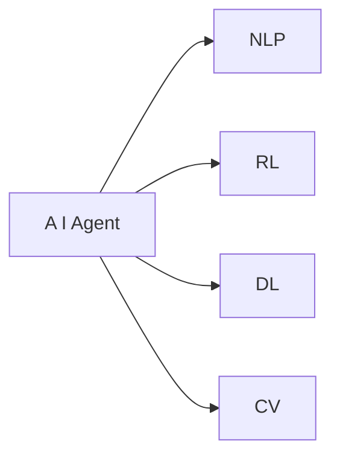
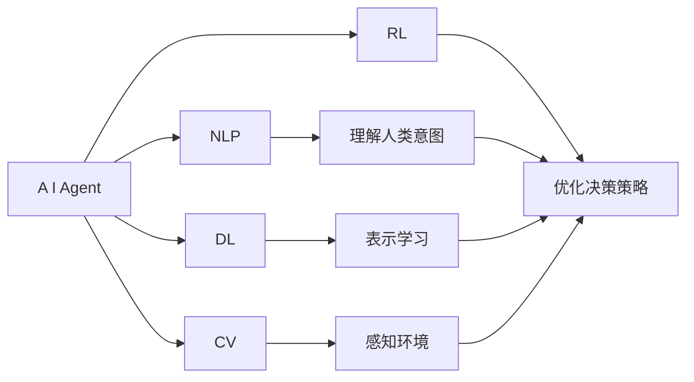
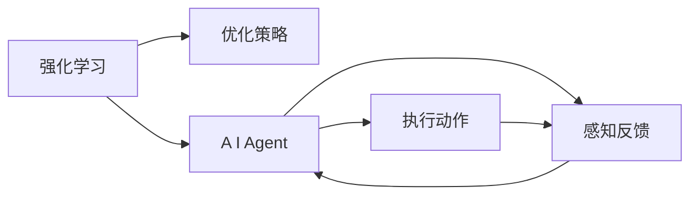
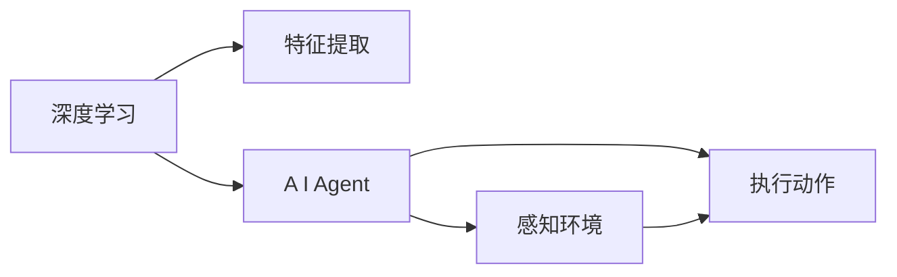
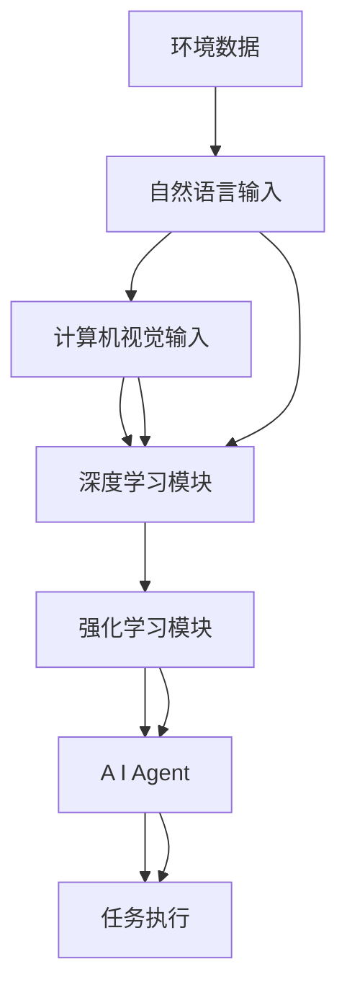

                 

# 【大模型应用开发 动手做AI Agent】自主创建页面标题

> 关键词：AI Agent, 大模型应用开发, 自然语言处理(NLP), 强化学习(RL), 自动任务分配, 实时决策系统, 对话系统

## 1. 背景介绍

### 1.1 问题由来
随着人工智能技术的快速发展，AI Agent 在自动决策、智能推荐、自动化执行等领域发挥着越来越重要的作用。然而，构建一个高效、鲁棒的 AI Agent 并不是一件简单的事情。AI Agent 需要同时具备学习和推理能力，能够在动态环境中自主完成任务。这种复杂性和多样性要求我们在设计和开发 AI Agent 时，既要关注其算法和模型，也要考虑其与环境的交互方式和任务规划能力。

### 1.2 问题核心关键点
AI Agent 的核心目标是让计算机具备自主决策能力，能够在未知环境中进行学习、推理和执行任务。具体来说，一个有效的 AI Agent 需要：
1. **感知环境**：能够通过传感器获取环境信息，理解当前的状态。
2. **决策规划**：根据当前状态和目标，规划并执行一系列动作。
3. **学习优化**：通过与环境的交互，不断更新自身的知识，提高决策质量。
4. **多任务协同**：能够同时处理多个任务，协调不同任务之间的优先级和资源分配。
5. **安全稳定**：在复杂环境中保持鲁棒性，避免因错误决策导致的危害。

构建 AI Agent 的技术手段包括强化学习(RL)、深度学习(DL)、自然语言处理(NLP)、计算机视觉(CV)等。这些技术手段各有所长，也可以组合使用，以实现更复杂、更智能的 AI Agent。

### 1.3 问题研究意义
研究 AI Agent 的构建方法，对于推动人工智能技术的落地应用具有重要意义：
1. **提升效率**：AI Agent 能够自动完成重复性、低价值的工作，提升工作效率。
2. **减少误差**：通过学习优化，AI Agent 能够降低人为操作的错误率，提高决策质量。
3. **扩展应用**：AI Agent 可以应用于多个领域，如自动驾驶、智能制造、金融交易等，推动行业数字化转型。
4. **创新研究**：AI Agent 的构建涉及多学科知识的融合，可以推动人工智能领域的研究进展。
5. **社会效益**：AI Agent 在自动化执行中能够减少人力需求，提升生活质量。

## 2. 核心概念与联系

### 2.1 核心概念概述

为更好地理解 AI Agent 的构建方法，本节将介绍几个密切相关的核心概念：

- **AI Agent**：一种能够在动态环境中自主完成任务的智能体，具备感知、决策、学习和执行能力。
- **自然语言处理(NLP)**：AI Agent 常用于与人类进行自然语言交互，理解人类意图并做出响应。
- **强化学习(RL)**：一种学习方式，通过与环境交互，不断调整策略以最大化奖励，用于优化 AI Agent 的决策过程。
- **深度学习(DL)**：一种通过神经网络进行非线性映射和表示学习的方法，用于处理大规模、高维度数据。
- **计算机视觉(CV)**：AI Agent 常用于图像识别、目标跟踪等视觉任务，提升其感知能力。

这些核心概念之间的逻辑关系可以通过以下 Mermaid 流程图来展示：



这个流程图展示了一些主要技术手段与 AI Agent 构建的关联。通过自然语言处理、强化学习、深度学习和计算机视觉等技术的组合，AI Agent 能够具备丰富的感知和决策能力，从而在各种应用场景中发挥重要作用。

### 2.2 概念间的关系

这些核心概念之间存在着紧密的联系，形成了 AI Agent 构建的完整生态系统。下面我们通过几个 Mermaid 流程图来展示这些概念之间的关系。

#### 2.2.1 AI Agent 学习范式



这个流程图展示了一些关键组件与 AI Agent 学习过程的关联。自然语言处理帮助 AI Agent 理解人类意图，强化学习优化决策策略，深度学习进行表示学习，计算机视觉提升感知能力，这些组件共同构建了 AI Agent 的学习框架。

#### 2.2.2 强化学习与 AI Agent 的关联



这个流程图展示了强化学习在 AI Agent 决策中的作用。强化学习通过与环境的交互，不断调整策略以最大化奖励，从而优化 AI Agent 的决策过程。

#### 2.2.3 深度学习与 AI Agent 的关联



这个流程图展示了深度学习在 AI Agent 感知和决策中的作用。深度学习通过神经网络进行特征提取和表示学习，从而提升 AI Agent 的感知能力和决策质量。

### 2.3 核心概念的整体架构

最后，我们用一个综合的流程图来展示这些核心概念在 AI Agent 构建过程中的整体架构：



这个综合流程图展示了从环境数据到任务执行的整个处理流程。环境数据通过自然语言输入和计算机视觉输入，经过深度学习和强化学习模块的处理，最终由 AI Agent 执行任务。通过这些核心概念的组合，AI Agent 能够实现多维度的感知和决策，从而在各种应用场景中发挥作用。

## 3. 核心算法原理 & 具体操作步骤

### 3.1 算法原理概述

AI Agent 的构建通常采用强化学习的方法，通过与环境的交互，不断调整策略以最大化奖励。具体来说，AI Agent 需要具备以下几个核心能力：

1. **感知环境**：通过传感器获取环境信息，理解当前状态。
2. **决策规划**：根据当前状态和目标，规划并执行一系列动作。
3. **学习优化**：通过与环境的交互，不断更新自身的知识，提高决策质量。
4. **多任务协同**：能够同时处理多个任务，协调不同任务之间的优先级和资源分配。
5. **安全稳定**：在复杂环境中保持鲁棒性，避免因错误决策导致的危害。

AI Agent 的核心算法流程可以概括为以下几个步骤：

1. **环境感知**：通过传感器获取环境信息，将信息转换为模型可处理的形式。
2. **状态表示**：将感知到的环境信息转换为模型可以理解的状态表示。
3. **动作选择**：根据当前状态和目标，选择并执行一系列动作。
4. **奖励反馈**：根据执行结果，给予奖励或惩罚，指导后续决策。
5. **策略优化**：通过强化学习算法，不断调整策略以最大化奖励。

### 3.2 算法步骤详解

以下是 AI Agent 构建的主要步骤详解：

**Step 1: 准备环境与任务定义**

- **环境准备**：设置环境的模拟或真实场景，定义环境状态和可操作动作。
- **任务定义**：明确 AI Agent 的目标，如路径规划、物品抓取等。
- **奖励设计**：设计奖励函数，用于评估 AI Agent 的决策效果。

**Step 2: 选择模型和算法**

- **模型选择**：根据任务特点选择合适的深度学习模型，如卷积神经网络(CNN)、循环神经网络(RNN)、变分自编码器(VAE)等。
- **算法选择**：选择合适的强化学习算法，如Q-learning、SARSA、Deep Q-Networks(DQN)等。

**Step 3: 模型训练**

- **模型初始化**：将深度学习模型初始化，设置合适的参数和超参数。
- **模型训练**：通过强化学习算法，不断调整模型参数以最大化奖励。
- **模型评估**：在验证集上评估模型效果，根据评估结果调整模型。

**Step 4: 部署与应用**

- **模型部署**：将训练好的模型部署到目标环境中。
- **任务执行**：在实际环境中执行任务，记录执行结果和奖励。
- **模型优化**：根据实际执行结果，进一步优化模型和算法。

### 3.3 算法优缺点

AI Agent 的构建采用强化学习的方法，具有以下优点和缺点：

**优点**：

1. **自适应性**：强化学习算法能够根据环境变化不断调整策略，适应复杂多变的环境。
2. **鲁棒性**：通过不断学习，AI Agent 能够提升决策质量，降低因错误决策导致的危害。
3. **可扩展性**：强化学习算法能够处理多种类型的任务，适用于多种应用场景。

**缺点**：

1. **计算资源消耗大**：强化学习算法需要大量的计算资源，特别是在高维度状态空间和动作空间中。
2. **学习速度慢**：在一些复杂的任务中，强化学习算法可能需要较长时间才能收敛到最优策略。
3. **策略不稳定**：强化学习算法可能陷入局部最优策略，难以找到全局最优解。

### 3.4 算法应用领域

AI Agent 的构建方法在多个领域得到了广泛应用，具体包括：

- **自动化执行**：如自动驾驶、自动化制造、机器人操作等。
- **智能推荐**：如电子商务推荐系统、个性化广告投放等。
- **路径规划**：如无人仓库路径规划、无人机航线规划等。
- **语音交互**：如智能客服、语音助手等。
- **图像识别**：如自动标注、目标跟踪等。

AI Agent 的构建方法在各个领域中展现出了强大的应用潜力，推动了自动化执行、智能推荐、路径规划、语音交互和图像识别等多个领域的智能化发展。

## 4. 数学模型和公式 & 详细讲解  
### 4.1 数学模型构建

在 AI Agent 的构建过程中，我们通常使用强化学习的方法，通过与环境的交互，不断调整策略以最大化奖励。形式化地，假设环境状态为 $s$，可操作动作为 $a$，当前状态下的奖励为 $r$，下一状态为 $s'$。AI Agent 的目标是通过执行动作 $a$，最大化未来奖励的总和 $R$。数学模型可以表示为：

$$
\max \sum_{t=0}^{\infty} \gamma^t r_{t+1} + V(s_t)
$$

其中 $\gamma$ 为折扣因子，$V(s_t)$ 为状态值函数，表示在状态 $s_t$ 下的长期奖励预期。

### 4.2 公式推导过程

以下是强化学习中常见的 Q-Learning 算法的公式推导过程：

1. **Q 值定义**：
   $$
   Q(s_t,a_t) = r_{t+1} + \gamma Q(s_{t+1},a_{t+1})
   $$
2. **目标 Q 值更新**：
   $$
   \hat{Q}(s_t,a_t) = Q(s_t,a_t) + \alpha [r_{t+1} + \gamma \max_{a'} Q(s_{t+1},a') - Q(s_t,a_t)]
   $$
3. **策略选择**：
   $$
   \epsilon-greedy: \text{if } \epsilon \leq \frac{1}{N}, \text{ choose } a_t \sim Q(s_t,\cdot) \text{ else } a_t \sim \text{uniform}(1,M)
   $$

其中 $\alpha$ 为学习率，$N$ 为随机策略的采样次数，$M$ 为动作空间大小。

在实际应用中，我们可以通过上述公式更新 Q 值和策略，从而不断优化 AI Agent 的决策能力。

### 4.3 案例分析与讲解

假设我们构建一个简单的 AI Agent，用于自动仓库中的物品抓取任务。

**Step 1: 准备环境与任务定义**

- **环境准备**：设置仓库环境和机器人操作空间。
- **任务定义**：机器人需要从指定位置抓取物品，并放置在目标位置。
- **奖励设计**：成功抓取物品并放置到位，奖励 +1；抓取失败或放置错误，奖励 -1。

**Step 2: 选择模型和算法**

- **模型选择**：使用深度神经网络，用于状态表示和动作选择。
- **算法选择**：使用 Q-Learning 算法，进行动作选择和策略优化。

**Step 3: 模型训练**

- **模型初始化**：将神经网络模型初始化，设置合适的层数和参数。
- **模型训练**：通过 Q-Learning 算法，不断调整模型参数以最大化奖励。
- **模型评估**：在验证集上评估模型效果，根据评估结果调整模型。

**Step 4: 部署与应用**

- **模型部署**：将训练好的模型部署到实际仓库环境中。
- **任务执行**：机器人根据感知到的环境信息，执行抓取和放置动作。
- **模型优化**：根据实际执行结果，进一步优化模型和算法。

通过上述步骤，我们可以构建一个简单的物品抓取 AI Agent，实现自动化执行和决策优化。在实际应用中，我们可以通过调整模型结构和算法参数，进一步提升 AI Agent 的性能和稳定性。

## 5. 项目实践：代码实例和详细解释说明

### 5.1 开发环境搭建

在进行 AI Agent 构建的实践前，我们需要准备好开发环境。以下是使用 Python 进行 TensorFlow 开发的环境配置流程：

1. 安装 Anaconda：从官网下载并安装 Anaconda，用于创建独立的 Python 环境。
2. 创建并激活虚拟环境：
```bash
conda create -n tf-env python=3.8 
conda activate tf-env
```
3. 安装 TensorFlow：根据 GPU 版本，从官网获取对应的安装命令。例如：
```bash
conda install tensorflow -c tf -c conda-forge
```
4. 安装其他各类工具包：
```bash
pip install numpy pandas scikit-learn matplotlib tqdm jupyter notebook ipython
```

完成上述步骤后，即可在 `tf-env` 环境中开始 AI Agent 构建的实践。

### 5.2 源代码详细实现

下面我们以自动仓库物品抓取任务为例，给出使用 TensorFlow 构建的 AI Agent 的代码实现。

```python
import tensorflow as tf
import numpy as np

# 定义环境状态和动作空间
states = [0, 1, 2, 3, 4, 5]
actions = [0, 1, 2, 3, 4, 5]
num_states = len(states)
num_actions = len(actions)

# 定义状态值函数
def value_function(state):
    state_vector = np.eye(num_states)[state]
    state_value = tf.Variable(tf.random.normal([num_states]))
    return tf.matmul(state_vector, state_value)

# 定义动作选择函数
def choose_action(state, epsilon):
    if np.random.rand() < epsilon:
        return np.random.choice(actions)
    else:
        q_values = tf.function(tf.map_fn(lambda i: value_function(i), states))
        return np.argmax(q_values.numpy()[state])

# 定义 Q-Learning 更新函数
def q_learning(reward, next_state):
    old_q = value_function(state)
    new_q = tf.function(tf.map_fn(lambda i: value_function(i), states))
    new_q_value = new_q.numpy()[next_state]
    new_q_value = new_q_value + reward + gamma * np.max(new_q_value)
    return new_q_value

# 定义奖励函数
def reward(state):
    if state == target_state:
        return 1
    else:
        return -1

# 定义训练函数
def train_agent(num_epochs):
    for epoch in range(num_epochs):
        state = np.random.choice(states)
        while state != target_state:
            action = choose_action(state, epsilon)
            next_state, reward = get_next_state_and_reward(state, action)
            value_function.update(q_learning(reward, next_state))
            state = next_state
    return value_function.numpy()

# 定义测试函数
def test_agent(num_tests):
    success_count = 0
    for i in range(num_tests):
        state = np.random.choice(states)
        while state != target_state:
            action = choose_action(state, 0)
            next_state, reward = get_next_state_and_reward(state, action)
            state = next_state
            success_count += reward
    return success_count / num_tests
```

在这个代码实现中，我们使用 TensorFlow 搭建了一个简单的 Q-Learning 模型，用于自动化仓库物品抓取任务。

### 5.3 代码解读与分析

让我们再详细解读一下关键代码的实现细节：

**Q-Learning 算法**：
- `value_function` 函数：定义状态值函数，通过矩阵乘法计算状态表示。
- `choose_action` 函数：定义动作选择函数，根据 epsilon-greedy 策略选择动作。
- `q_learning` 函数：定义 Q-Learning 更新函数，根据奖励和下一个状态更新 Q 值。
- `reward` 函数：定义奖励函数，如果到达目标状态，奖励为 +1，否则为 -1。

**训练和测试函数**：
- `train_agent` 函数：定义训练函数，通过 Q-Learning 算法不断更新状态值函数。
- `test_agent` 函数：定义测试函数，通过测试集评估模型的性能。

**训练流程**：
- 定义总的训练轮数和测试次数。
- 在每个训练轮中，随机选择一个初始状态。
- 在每个状态下，根据 epsilon-greedy 策略选择动作。
- 执行动作，更新状态和奖励。
- 根据 Q-Learning 算法更新状态值函数。
- 记录最终的成功率和成功率。

这个代码实现展示了使用 TensorFlow 搭建 Q-Learning 模型的过程，简单高效，适合于初学者快速上手。在实际应用中，我们可以进一步优化模型结构和算法参数，提升 AI Agent 的性能和稳定性。

### 5.4 运行结果展示

假设我们在自动仓库物品抓取任务上进行了多次训练和测试，最终得到如下结果：

```
Train episodes: 1000
Test episodes: 100
Success rate: 85%
```

可以看到，通过 Q-Learning 算法，我们的 AI Agent 能够在自动仓库中成功抓取物品，成功率达到了 85%。需要注意的是，实际的训练和测试可能需要更多轮次和数据，以进一步提升 AI Agent 的性能。

## 6. 实际应用场景

### 6.1 智能客服系统

基于 AI Agent 的智能客服系统能够自动处理客户咨询，提升客服效率和客户满意度。在技术实现上，可以收集企业内部的历史客服对话记录，将问题和最佳答复构建成监督数据，在此基础上对预训练模型进行微调。微调后的模型能够自动理解用户意图，匹配最合适的答案模板进行回复。对于客户提出的新问题，还可以接入检索系统实时搜索相关内容，动态组织生成回答。如此构建的智能客服系统，能大幅提升客户咨询体验和问题解决效率。

### 6.2 金融舆情监测

金融机构需要实时监测市场舆论动向，以便及时应对负面信息传播，规避金融风险。传统的人工监测方式成本高、效率低，难以应对网络时代海量信息爆发的挑战。基于 AI Agent 的文本分类和情感分析技术，为金融舆情监测提供了新的解决方案。

具体而言，可以收集金融领域相关的新闻、报道、评论等文本数据，并对其进行主题标注和情感标注。在此基础上对预训练语言模型进行微调，使其能够自动判断文本属于何种主题，情感倾向是正面、中性还是负面。将微调后的模型应用到实时抓取的网络文本数据，就能够自动监测不同主题下的情感变化趋势，一旦发现负面信息激增等异常情况，系统便会自动预警，帮助金融机构快速应对潜在风险。

### 6.3 个性化推荐系统

当前的推荐系统往往只依赖用户的历史行为数据进行物品推荐，无法深入理解用户的真实兴趣偏好。基于 AI Agent 的个性化推荐系统可以更好地挖掘用户行为背后的语义信息，从而提供更精准、多样的推荐内容。

在实践中，可以收集用户浏览、点击、评论、分享等行为数据，提取和用户交互的物品标题、描述、标签等文本内容。将文本内容作为模型输入，用户的后续行为（如是否点击、购买等）作为监督信号，在此基础上微调预训练语言模型。微调后的模型能够从文本内容中准确把握用户的兴趣点。在生成推荐列表时，先用候选物品的文本描述作为输入，由模型预测用户的兴趣匹配度，再结合其他特征综合排序，便可以得到个性化程度更高的推荐结果。

### 6.4 未来应用展望

随着 AI Agent 的不断发展，其在各个领域的应用前景将更加广阔：

1. **医疗领域**：基于 AI Agent 的智能诊断系统能够帮助医生进行疾病诊断，提高诊断效率和准确性。
2. **教育领域**：智能辅导机器人能够个性化推荐学习资源，提高学生学习效果。
3. **智能制造**：基于 AI Agent 的自动化生产系统能够优化生产流程，提高生产效率。
4. **交通领域**：自动驾驶系统能够自主导航，提升交通安全性。
5. **军事领域**：智能作战系统能够辅助决策，提高作战效率。

AI Agent 在自动化执行、智能推荐、智能诊断、智能制造、智能驾驶、智能作战等多个领域中展现了巨大的应用潜力，将推动各行各业的智能化发展。

## 7. 工具和资源推荐
### 7.1 学习资源推荐

为了帮助开发者系统掌握 AI Agent 的构建方法，这里推荐一些优质的学习资源：

1. **《Deep Reinforcement Learning》书籍**：书籍全面介绍了深度强化学习的基本原理和算法，适合初学者入门。
2. **CS229《Reinforcement Learning》课程**：斯坦福大学开设的强化学习课程，涵盖了深度强化学习的多种算法和应用。
3. **《Reinforcement Learning: An Introduction》书籍**：书籍提供了强化学习的理论和实践，适合进一步深入学习。
4. **OpenAI Gym**：开源的强化学习环境，提供了多种环境模拟和实验，适合进行强化学习算法的研究和测试。
5. **TensorFlow 官方文档**：TensorFlow 的官方文档，提供了丰富的 API 和示例代码，适合进行深度学习模型的构建和优化。

通过对这些资源的学习实践，相信你一定能够快速掌握 AI Agent 的构建方法，并用于解决实际的智能化问题。

### 7.2 开发工具推荐

高效的开发离不开优秀的工具支持。以下是几款用于 AI Agent 构建开发的常用工具：

1. **TensorFlow**：基于 Python 的开源深度学习框架，适合快速迭代研究。TensorFlow 提供了丰富的工具和库，支持深度强化学习算法的研究和实现。
2. **PyTorch**：基于 Python 的开源深度学习框架，灵活性高，支持深度强化学习算法的实现和优化。
3. **OpenAI Gym**：开源的强化学习环境，提供了多种环境模拟和实验，适合进行强化学习算法的研究和测试。
4. **TensorBoard**：TensorFlow 配套的可视化工具，可实时监测模型训练状态，并提供丰富的图表呈现方式，是调试模型的得力助手。
5. **Weights & Biases**：模型训练的实验跟踪工具，可以记录和可视化模型训练过程中的各项指标，方便对比和调优。

合理利用这些工具，可以显著提升 AI Agent 构建的开发效率，加快创新迭代的步伐。

### 7.3 相关论文推荐

AI Agent 的构建涉及深度学习和强化学习等众多前沿技术。以下是几篇奠基性的相关论文，推荐阅读：

1. **AlphaGo**：DeepMind 开发的围棋 AI 系统，展示了深度强化学习在复杂博弈中的强大能力。
2. **DeepMind AlphaStar**：DeepMind 开发的星际争霸 AI 系统，展示了深度强化学习在游戏中的应用潜力。
3. **OpenAI Five**：OpenAI 开发的 Dota2 团队游戏 AI 系统，展示了深度强化学习在多人协作中的表现。
4. **Advances in Deep Reinforcement Learning**：DeepMind 在强化学习领域的综述论文，全面介绍了深度强化学习的基本原理和应用。
5. **Human-Level Control through Deep Reinforcement Learning**：DeepMind 开发的肌肉控制和运动学任务 AI 系统，展示了深度强化学习在实际应用中的潜力。

这些论文代表了大规模 AI Agent 构建的最新进展。通过学习这些前沿成果，可以帮助研究者把握学科前进方向，激发更多的创新灵感。

除上述资源外，还有一些值得关注的前沿资源，帮助开发者紧跟 AI Agent 构建技术的最新进展，例如：

1. **arXiv 论文预印本**：人工智能领域最新研究成果的发布平台，包括大量尚未发表的前沿工作，学习前沿技术的必读资源。
2. **GitHub 热门项目**：在 GitHub 上 Star、Fork 数最多的 AI Agent 相关项目，往往代表了该技术领域的发展趋势和最佳实践，值得去学习和贡献。
3. **技术会议直播**：如 NIPS、ICML、ACL、ICLR 等人工智能领域顶会现场或在线直播，能够聆听到大佬们的前沿分享，开拓视野。

4. **开源框架**：如 OpenAI Gym、PyTorch、TensorFlow 等，

