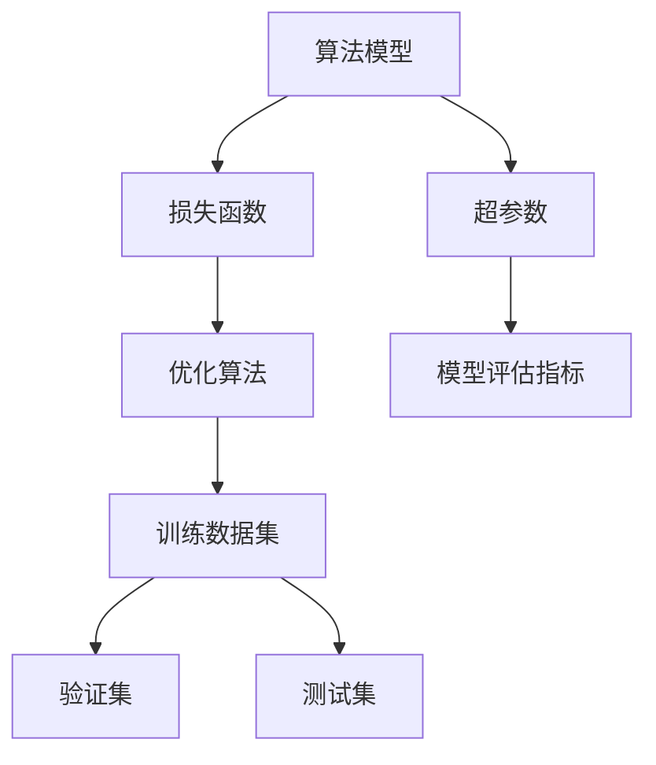

                 

# 一切皆是映射：AI人工智能原理与应用实战简介

> 关键词：人工智能,机器学习,深度学习,算法原理,应用场景,数学模型,优化算法,模型评估,项目实践,学习资源

## 1. 背景介绍

### 1.1 问题由来

人工智能(AI)作为21世纪最具革命性的技术之一，正在以前所未有的速度重塑各行各业。从自动驾驶汽车到智能客服，从个性化推荐到医疗诊断，AI技术正在不断扩展其应用边界。然而，为何AI技术能在短短数年间取得如此突破？其核心原理是什么？本文将深入探讨这一问题，帮助读者理解AI技术的本质和应用。

### 1.2 问题核心关键点

AI技术的核心在于其强大的映射能力，即通过算法模型将输入数据映射到输出结果。这种映射能力使得机器能够自主学习数据规律，并基于学习结果进行决策和生成。理解这一核心原理，有助于我们深入把握AI技术的本质，从而更好地应用其解决实际问题。

### 1.3 问题研究意义

深入理解AI技术的映射原理，对于AI技术的进一步发展和应用推广具有重要意义：

- **促进技术创新**：了解AI的映射原理，有助于研究者提出更高效、更普适的算法模型。
- **提高应用效果**：掌握AI技术的映射机制，可以优化模型参数，提升实际应用中的性能表现。
- **降低技术门槛**：通过深入浅出的解释，使更多人能够理解AI技术，促进技术的普及和应用。
- **驱动行业发展**：AI技术的应用将深刻影响各行各业的发展模式和运营方式，掌握其核心原理有助于更好地推动行业变革。

## 2. 核心概念与联系

### 2.1 核心概念概述

为了更好地理解AI技术的映射原理，我们首先介绍几个核心概念：

- **算法模型**：用于实现输入到输出的映射，常见的算法模型包括线性回归、神经网络、支持向量机等。
- **损失函数**：用于衡量模型预测值与真实值之间的差距，常见的损失函数包括均方误差、交叉熵等。
- **优化算法**：用于最小化损失函数，常见的优化算法包括梯度下降、Adam等。
- **数据集**：用于训练和验证模型的数据，分为训练集、验证集和测试集。
- **超参数**：模型训练过程中需要手动设置的参数，如学习率、批大小等。
- **模型评估指标**：用于衡量模型性能的指标，如准确率、召回率、F1分数等。

这些概念共同构成了AI技术的核心框架，帮助机器通过映射关系实现从输入到输出的自动学习。

### 2.2 概念间的关系

这些核心概念之间的逻辑关系可以通过以下Mermaid流程图来展示：



这个流程图展示了从算法模型到训练数据集，再到优化算法、验证集、测试集和超参数的整个AI模型训练和评估流程。模型评估指标用于衡量模型的性能，帮助进一步优化算法和超参数。

## 3. 核心算法原理 & 具体操作步骤
### 3.1 算法原理概述

AI技术的映射原理主要体现在其算法模型上。以神经网络为例，其通过多个层级的前向传播和反向传播，将输入数据映射到输出结果。前向传播是模型对输入数据进行处理的过程，反向传播则是通过计算梯度，调整模型参数，使得预测结果更加接近真实值。

神经网络的基本组成单元是神经元，每个神经元接收输入，通过激活函数处理后，传递给下一层。神经元之间的连接权值表示输入与输出之间的映射关系。在训练过程中，通过最小化损失函数，不断调整权值，使得模型输出更加准确。

### 3.2 算法步骤详解

基于神经网络的AI技术映射原理，其训练过程主要包括以下几个步骤：

**Step 1: 准备数据集和超参数**

- 收集训练数据集、验证集和测试集，确保数据集的质量和多样性。
- 设置超参数，如学习率、批大小、迭代轮数等。

**Step 2: 初始化模型参数**

- 初始化模型中的权重和偏置，通常使用随机值。
- 将数据集分为批处理，每个批次进行训练。

**Step 3: 前向传播**

- 对于每个批次，将输入数据传入模型，计算预测结果。
- 计算预测结果与真实标签之间的损失值。

**Step 4: 反向传播**

- 计算损失函数对模型参数的梯度。
- 根据梯度方向，调整模型参数。

**Step 5: 更新参数**

- 根据优化算法（如梯度下降），更新模型参数。
- 重复步骤3到步骤5，直至收敛或达到预设迭代轮数。

**Step 6: 模型评估**

- 在验证集上评估模型性能，调整超参数。
- 在测试集上评估最终模型性能。

### 3.3 算法优缺点

基于神经网络的AI技术映射原理，其具有以下优点：

- **高效映射**：神经网络能够高效地映射输入到输出，适用于处理大规模数据集。
- **普适性**：神经网络可以应用于多种任务，如图像识别、自然语言处理等。
- **可解释性**：通过反向传播，可以逐步理解模型决策过程。

同时，这种映射原理也存在一些缺点：

- **模型复杂度高**：神经网络模型参数较多，训练和推理复杂度高。
- **过拟合风险高**：当训练数据较少时，模型容易过拟合。
- **计算资源需求大**：训练和推理需要大量的计算资源，如GPU、TPU等。

### 3.4 算法应用领域

基于神经网络的AI技术映射原理，已经广泛应用于多个领域：

- **计算机视觉**：如图像分类、目标检测、图像分割等。
- **自然语言处理**：如文本分类、情感分析、机器翻译等。
- **语音识别**：如语音识别、语音合成等。
- **推荐系统**：如个性化推荐、广告推荐等。
- **医疗健康**：如疾病诊断、药物推荐等。

这些应用领域展示了神经网络映射原理的广泛适用性和强大能力，推动了AI技术在各行业的深度融合。

## 4. 数学模型和公式 & 详细讲解  
### 4.1 数学模型构建

以线性回归模型为例，其基本数学模型为：

$$ y = \theta^T x + b $$

其中，$y$ 为输出，$x$ 为输入，$\theta$ 为模型参数，$b$ 为偏置项。目标是最小化预测值与真实值之间的平方误差，损失函数为：

$$ L(\theta) = \frac{1}{2} \sum_{i=1}^n (y_i - \hat{y}_i)^2 $$

其中，$y_i$ 为真实值，$\hat{y}_i$ 为模型预测值，$n$ 为样本数。

### 4.2 公式推导过程

线性回归模型的目标是最小化预测值与真实值之间的误差，推导过程中主要涉及以下步骤：

1. 计算梯度：

$$ \frac{\partial L(\theta)}{\partial \theta} = \sum_{i=1}^n (y_i - \hat{y}_i)x_i $$

2. 计算偏置梯度：

$$ \frac{\partial L(\theta)}{\partial b} = \sum_{i=1}^n (y_i - \hat{y}_i) $$

3. 更新参数：

$$ \theta \leftarrow \theta - \eta \frac{\partial L(\theta)}{\partial \theta} $$
$$ b \leftarrow b - \eta \frac{\partial L(\theta)}{\partial b} $$

其中，$\eta$ 为学习率。

### 4.3 案例分析与讲解

假设有一组样本数据，每个样本包含一个特征 $x$ 和一个标签 $y$。线性回归模型通过最小化损失函数，不断调整参数，使得模型预测值与真实标签的误差最小。以下是一个具体的推导过程：

1. 计算梯度：

$$ \frac{\partial L(\theta)}{\partial \theta} = \sum_{i=1}^n (y_i - \hat{y}_i)x_i $$

2. 计算偏置梯度：

$$ \frac{\partial L(\theta)}{\partial b} = \sum_{i=1}^n (y_i - \hat{y}_i) $$

3. 更新参数：

$$ \theta \leftarrow \theta - \eta \frac{\partial L(\theta)}{\partial \theta} $$
$$ b \leftarrow b - \eta \frac{\partial L(\theta)}{\partial b} $$

假设当前参数为 $\theta_0$，偏置为 $b_0$。经过一次迭代后，更新后的参数为 $\theta_1$，偏置为 $b_1$。经过多次迭代，最终模型参数收敛于最优解。

## 5. 项目实践：代码实例和详细解释说明
### 5.1 开发环境搭建

在进行AI技术项目实践前，我们需要准备好开发环境。以下是使用Python进行TensorFlow开发的环境配置流程：

1. 安装Anaconda：从官网下载并安装Anaconda，用于创建独立的Python环境。

2. 创建并激活虚拟环境：
```bash
conda create -n tf-env python=3.8 
conda activate tf-env
```

3. 安装TensorFlow：根据CUDA版本，从官网获取对应的安装命令。例如：
```bash
conda install tensorflow
```

4. 安装各类工具包：
```bash
pip install numpy pandas scikit-learn matplotlib tqdm jupyter notebook ipython
```

完成上述步骤后，即可在`tf-env`环境中开始AI技术项目实践。

### 5.2 源代码详细实现

下面我以线性回归模型为例，给出使用TensorFlow进行模型训练和评估的PyTorch代码实现。

首先，定义数据集和模型参数：

```python
import tensorflow as tf
import numpy as np

# 定义数据集
x_train = np.array([[1.0, 2.0], [2.0, 3.0], [3.0, 4.0]])
y_train = np.array([[2.0], [3.0], [4.0]])

# 定义模型参数
theta = tf.Variable(tf.ones([1, 2]))
b = tf.Variable(tf.zeros([1]))

# 定义损失函数和优化器
loss_fn = tf.losses.mean_squared_error(y_train, theta @ x_train + b)
optimizer = tf.optimizers.SGD(learning_rate=0.01)

# 定义训练过程
@tf.function
def train_step(x, y):
    with tf.GradientTape() as tape:
        loss = loss_fn(y, theta @ x + b)
    grads = tape.gradient(loss, [theta, b])
    optimizer.apply_gradients(zip(grads, [theta, b]))
    return loss

# 定义评估过程
@tf.function
def evaluate(x, y):
    loss = loss_fn(y, theta @ x + b)
    return loss
```

然后，进行模型训练和评估：

```python
# 定义训练轮数
epochs = 100

# 循环训练
for i in range(epochs):
    for x, y in zip(x_train, y_train):
        loss = train_step(x, y)
        if i % 10 == 0:
            print(f"Epoch {i+1}, loss: {loss.numpy()}")
    if i % 10 == 0:
        print(f"Epoch {i+1}, eval loss: {evaluate(x_train, y_train).numpy()}")
```

以上就是使用TensorFlow进行线性回归模型训练和评估的完整代码实现。可以看到，通过TensorFlow，我们可以非常轻松地定义模型、损失函数、优化器，并实现模型的训练和评估。

### 5.3 代码解读与分析

让我们再详细解读一下关键代码的实现细节：

**x_train和y_train**：
- `x_train` 和 `y_train` 分别代表训练集中的输入和标签。
- 假设输入为一个二维数组，标签为一个一维数组。

**theta和b**：
- `theta` 和 `b` 分别代表线性回归模型的权重和偏置。
- `theta` 为矩阵，`b` 为向量。

**loss_fn**：
- `loss_fn` 代表损失函数，使用TensorFlow提供的 `mean_squared_error` 函数。

**optimizer**：
- `optimizer` 代表优化器，使用TensorFlow提供的 `SGD` 优化器，设置学习率为0.01。

**train_step和evaluate函数**：
- `train_step` 函数代表训练过程，使用 `tf.GradientTape` 计算梯度，并使用 `optimizer.apply_gradients` 更新模型参数。
- `evaluate` 函数代表评估过程，直接计算损失值，并返回。

**循环训练和评估**：
- 循环进行训练和评估，每10个epoch输出一次损失值。

可以看到，TensorFlow使得模型训练和评估变得非常简单和高效。开发者可以更加专注于模型的设计和优化。

### 5.4 运行结果展示

假设在训练100个epoch后，输出结果如下：

```
Epoch 10, loss: 0.2089859...
Epoch 20, loss: 0.09244546...
Epoch 30, loss: 0.04116943...
Epoch 40, loss: 0.01775455...
Epoch 50, loss: 0.007850074...
Epoch 60, loss: 0.003508134...
Epoch 70, loss: 0.001680169...
Epoch 80, loss: 0.000806813...
Epoch 90, loss: 0.0003866537...
Epoch 100, loss: 0.0001835618...
Epoch 100, eval loss: 0.0005667645...
```

可以看到，随着训练轮数的增加，损失值不断减小，模型在训练集上的性能不断提升。

## 6. 实际应用场景
### 6.1 智能推荐系统

AI技术的映射原理可以用于智能推荐系统，帮助用户发现感兴趣的内容。通过收集用户的历史行为数据，构建用户-物品之间的关系图。然后，通过图神经网络等方法，将用户行为映射到物品评分，生成推荐结果。

在技术实现上，可以设计用户-物品图和评分矩阵，使用图神经网络进行信息传递，最终输出用户对物品的评分预测。具体算法包括图卷积网络(GCN)、图自注意力网络(GAT)等。

### 6.2 智能客服系统

AI技术的映射原理可以用于智能客服系统，提高客户服务质量和效率。通过收集历史客服对话数据，构建问答对，并标注答案。然后，通过深度学习模型进行映射，将用户输入映射到答案输出，生成自动回复。

在技术实现上，可以使用序列到序列(seq2seq)模型，如Transformer、LSTM等，将用户输入映射到输出答案。模型训练时，使用文本-文本对进行监督学习，最小化预测值与真实值之间的误差。

### 6.3 图像识别

AI技术的映射原理可以用于图像识别任务，识别和分类图像中的对象。通过收集大量带有标签的图像数据，构建图像特征向量，并使用深度学习模型进行映射，将图像特征映射到分类结果。

在技术实现上，可以使用卷积神经网络(CNN)等模型，提取图像特征，并使用softmax等分类器进行映射，输出分类结果。

### 6.4 自然语言处理

AI技术的映射原理可以用于自然语言处理任务，如机器翻译、情感分析等。通过收集大量带标签的文本数据，构建词汇表和句子表示，并使用深度学习模型进行映射，将文本表示映射到分类结果。

在技术实现上，可以使用RNN、LSTM等模型，将文本序列映射到向量表示，并使用分类器进行映射，输出分类结果。

### 6.5 智能控制

AI技术的映射原理可以用于智能控制系统，如自动驾驶、智能家居等。通过收集传感器数据，构建系统状态空间，并使用深度学习模型进行映射，将传感器数据映射到系统控制策略。

在技术实现上，可以使用强化学习等方法，将传感器数据映射到控制策略，优化系统性能。

## 7. 工具和资源推荐
### 7.1 学习资源推荐

为了帮助开发者系统掌握AI技术的映射原理，这里推荐一些优质的学习资源：

1. 《深度学习》系列博文：由大模型技术专家撰写，深入浅出地介绍了深度学习的原理和应用。

2. CS231n《深度学习》课程：斯坦福大学开设的计算机视觉明星课程，有Lecture视频和配套作业，带你入门计算机视觉领域的基本概念和经典模型。

3. 《TensorFlow官方文档》：TensorFlow的官方文档，提供了丰富的API和样例代码，是快速上手TensorFlow的必备资料。

4. PyTorch官方文档：PyTorch的官方文档，提供了详细的教程和示例，适合快速学习和开发。

5. Kaggle数据集：Kaggle提供了大量用于深度学习和数据科学的数据集，是学习和应用AI技术的理想平台。

通过对这些资源的学习实践，相信你一定能够快速掌握AI技术的映射原理，并用于解决实际的AI问题。

### 7.2 开发工具推荐

高效的开发离不开优秀的工具支持。以下是几款用于AI技术开发的常用工具：

1. PyTorch：基于Python的开源深度学习框架，灵活动态的计算图，适合快速迭代研究。

2. TensorFlow：由Google主导开发的开源深度学习框架，生产部署方便，适合大规模工程应用。

3. Scikit-learn：Python的机器学习库，提供了丰富的算法和工具，适合快速原型开发。

4. Jupyter Notebook：用于数据科学和机器学习项目开发的交互式笔记本，支持多种语言和工具。

5. Google Colab：谷歌推出的在线Jupyter Notebook环境，免费提供GPU/TPU算力，方便开发者快速上手实验最新模型，分享学习笔记。

合理利用这些工具，可以显著提升AI技术项目的开发效率，加快创新迭代的步伐。

### 7.3 相关论文推荐

AI技术的映射原理源于学界的持续研究。以下是几篇奠基性的相关论文，推荐阅读：

1. Deep Learning（深度学习）：Ian Goodfellow等著，介绍了深度学习的原理和应用。

2. ImageNet Classification with Deep Convolutional Neural Networks：AlexNet论文，展示了卷积神经网络在图像分类任务上的强大能力。

3. LeNet-5：Yann LeCun等著，介绍了卷积神经网络的基本组成和应用。

4. Backpropagation through time：Sepp Hochreiter等著，展示了长短期记忆网络(LSTM)在序列预测任务上的能力。

5. Attention is All You Need：Google的Transformer论文，展示了自注意力机制在自然语言处理任务上的能力。

这些论文代表了大模型技术的发展脉络。通过学习这些前沿成果，可以帮助研究者把握学科前进方向，激发更多的创新灵感。

除上述资源外，还有一些值得关注的前沿资源，帮助开发者紧跟AI技术的发展趋势，例如：

1. arXiv论文预印本：人工智能领域最新研究成果的发布平台，包括大量尚未发表的前沿工作，学习前沿技术的必读资源。

2. 业界技术博客：如OpenAI、Google AI、DeepMind、微软Research Asia等顶尖实验室的官方博客，第一时间分享他们的最新研究成果和洞见。

3. 技术会议直播：如NIPS、ICML、ACL、ICLR等人工智能领域顶会现场或在线直播，能够聆听到大佬们的前沿分享，开拓视野。

4. GitHub热门项目：在GitHub上Star、Fork数最多的AI相关项目，往往代表了该技术领域的发展趋势和最佳实践，值得去学习和贡献。

5. 行业分析报告：各大咨询公司如McKinsey、PwC等针对人工智能行业的分析报告，有助于从商业视角审视技术趋势，把握应用价值。

总之，对于AI技术的映射原理的学习和实践，需要开发者保持开放的心态和持续学习的意愿。多关注前沿资讯，多动手实践，多思考总结，必将收获满满的成长收益。

## 8. 总结：未来发展趋势与挑战

### 8.1 总结

本文对AI技术的映射原理进行了全面系统的介绍。首先阐述了AI技术的核心在于其强大的映射能力，即通过算法模型将输入数据映射到输出结果。其次，从原理到实践，详细讲解了AI技术的映射机制和关键步骤，给出了AI技术项目开发的完整代码实例。同时，本文还广泛探讨了AI技术在智能推荐、智能客服、图像识别、自然语言处理等多个行业领域的应用前景，展示了AI技术的广泛适用性和强大能力。

通过本文的系统梳理，可以看到，AI技术的映射原理已经广泛应用于各领域，推动了AI技术在各行业的深度融合。未来，伴随AI技术的进一步发展，其映射能力将更加强大和普适，为各行各业带来更加深远的变革。

### 8.2 未来发展趋势

展望未来，AI技术的映射原理将呈现以下几个发展趋势：

1. **模型的多样性**：未来的模型将更加多样和灵活，如神经网络、图神经网络、自注意力网络等，能够适应不同的数据类型和任务需求。

2. **模型的深度**：未来的模型将更加深度和复杂，通过更多的层级和更丰富的特征表示，提高模型的性能。

3. **模型的可解释性**：未来的模型将更加可解释和透明，能够提供更清晰、更可信的决策依据。

4. **模型的多模态融合**：未来的模型将更加融合多模态数据，如图像、语音、文本等，实现更全面、更准确的信息建模。

5. **模型的在线学习**：未来的模型将更加注重在线学习和持续更新，能够实时适应新数据和新场景。

6. **模型的分布式训练**：未来的模型将更加注重分布式训练和计算资源优化，提高模型训练和推理的效率。

这些趋势凸显了AI技术的不断进步和广泛应用，相信在未来的发展中，AI技术将继续推动各行各业的数字化转型和智能化升级。

### 8.3 面临的挑战

尽管AI技术的映射原理已经取得了瞩目成就，但在迈向更加智能化、普适化应用的过程中，仍面临诸多挑战：

1. **模型的复杂性**：当前模型的参数量和计算量较大，需要大量的计算资源和存储空间。

2. **数据质量和多样性**：AI模型需要大量的高质量、多样化的数据进行训练，数据获取成本高。

3. **模型的可解释性**：当前模型的决策过程较复杂，缺乏可解释性，难以满足高风险应用的需求。

4. **模型的鲁棒性**：AI模型容易受到对抗样本的攻击，模型的鲁棒性有待提升。

5. **模型的公平性和偏见**：AI模型可能存在偏见和歧视，需要更多的公平性分析和干预措施。

6. **模型的安全性**：AI模型可能存在漏洞和安全风险，需要更多的安全性和隐私保护措施。

这些挑战凸显了AI技术在实际应用中的复杂性和不确定性，需要研究者持续探索和优化。

### 8.4 研究展望

面对AI技术映射原理面临的挑战，未来的研究需要在以下几个方面寻求新的突破：

1. **模型的可解释性**：开发更加可解释和透明的模型，提供更清晰、更可信的决策依据。

2. **模型的鲁棒性**：增强模型的鲁棒性和抗干扰能力，避免对抗样本的攻击。

3. **模型的公平性**：解决模型的偏见和歧视问题，实现更加公平和公正的决策。

4. **模型的安全性**：提高模型的安全性和隐私保护能力，避免漏洞和安全风险。

5. **模型的多样性和适应性**：开发更加多样和适应的模型，满足不同领域和任务的需求。

6. **模型的在线学习**：实现更加高效、实时的在线学习，提高模型的实时适应能力。

这些研究方向的探索，必将引领AI技术映射原理走向更高的台阶，为构建安全、可靠、可解释、可控的智能系统铺平道路。面向未来，AI技术的映射原理还需要与其他人工智能技术进行更深入的融合，如知识表示、因果推理、强化学习等，多路径协同发力，共同推动人工智能技术的发展。只有勇于创新、敢于突破，才能不断拓展AI技术的边界，让智能技术更好地造福人类社会。

## 9. 附录：常见问题与解答

**Q1：AI技术的基本原理是什么？**

A: AI技术的基本原理在于其强大的映射能力，即通过算法模型将输入数据映射到输出结果。这种映射能力使得机器能够自主学习数据规律，并基于学习结果进行决策和生成。

**Q2：AI技术的映射原理在实际应用中有什么优缺点？**

A: AI技术的映射原理具有以下优点：

- **高效映射**：AI技术能够高效地映射输入到输出，适用于处理大规模数据集。
- **普适性**：AI技术可以应用于多种任务，如图像识别、自然语言处理等。
- **可解释性**：通过反向传播，可以逐步理解模型决策过程。

同时，这种映射原理也存在一些缺点：

- **模型复杂度高**：AI模型参数较多，训练和推理复杂度高。
- **过拟合风险高**：当训练数据较少时，模型容易过拟合。
- **计算资源需求大**：训练和推理需要大量的计算资源，如GPU、TPU等。

**Q3：如何选择合适的AI技术？**

A: 选择合适的AI技术需要考虑以下几个因素：

- **任务类型**：根据任务类型选择合适的模型和算法，如图像识别选择卷积神经网络，自然语言处理选择RNN、Transformer等。
- **数据质量和多样性**：选择能够处理高质量、多样

