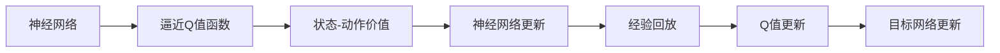

                 

# 一切皆是映射：DQN中的目标网络：为什么它是必要的？

深度强化学习(DRL)是近年来机器学习领域的一个热点。DRL方法能够帮助AI系统自动学习和优化策略，实现复杂的决策任务，如玩电子游戏、机器人控制等。深度Q网络(DQN)是DRL中最具代表性的方法之一，其核心在于利用神经网络进行状态-动作映射，使AI系统能够在不断交互中学习最优策略。

然而，DQN在实际应用中往往面临一些挑战。其中一个关键问题是更新过程中的"Q值映射误差"，这会严重影响学习效率和模型稳定性。为了解决这个问题，目标网络(Target Network)被引入到DQN中，但很多初学者和实践者仍不清楚其必要性和原理。本文将深入探讨DQN中的目标网络，剖析其背后的数学原理和实际应用效果，帮助读者更好地理解DQN的工作机制。

## 1. 背景介绍

### 1.1 问题由来
在DQN中，神经网络被用来逼近状态-动作价值函数$Q(s, a)$，即每个状态-动作对的预期回报。通过不断更新神经网络的权重，使得$Q(s, a)$逐渐逼近真实的价值函数。然而，直接更新神经网络参数会导致模型频繁振荡，难以稳定收敛。

为了解决这个问题，引入了一个固定版本的神经网络，称为"目标网络"。目标网络在更新时，使用稳定的权重参数，而主网络则利用最新的经验进行更新。这种设计能够有效缓解目标网络权重的振荡，提高学习效率和模型稳定性。

### 1.2 问题核心关键点
DQN中的目标网络具有以下几个关键特点：
- 固定版本：目标网络在更新时，权重不发生变化，只用于存储"最新"的策略价值估计。
- 延迟更新：在每次主网络更新后，目标网络的权重才会被更新。
- 样本交替：主网络和目标网络在数据使用上交替进行，即一个网络用来更新，另一个网络用来计算目标Q值。

目标网络设计的核心在于，通过引入延迟和固定版本，避免神经网络参数的频繁波动，使得模型能够更好地适应不断变化的输入数据。

## 2. 核心概念与联系

### 2.1 核心概念概述

为了更好地理解DQN中的目标网络，本节将介绍几个密切相关的核心概念：

- **Q值函数**：定义在状态-动作空间上的函数，表示每个状态-动作对的预期回报。Q值函数是DQN的核心，通过神经网络逼近$Q(s, a)$，AI系统能够自动学习和优化策略。

- **状态-动作价值**：指在给定状态下，采取某个动作的预期回报。它是评估和优化策略的基础。

- **神经网络逼近**：通过深度神经网络逼近复杂的非线性函数，如Q值函数，是DQN中的关键技术。

- **目标网络**：DQN中引入的一个固定版本的神经网络，用于存储"最新"的策略价值估计，与主网络交替使用，避免参数更新过程中带来的不稳定性。

- **经验回放**：通过将历史经验数据随机抽取出来进行训练，能够提高模型的泛化能力和稳定性。

- **Q值更新**：在每次训练中，通过更新Q值函数，优化策略，使得模型逐步逼近最优解。

这些核心概念之间的逻辑关系可以通过以下Mermaid流程图来展示：


这个流程图展示了DQN中Q值函数的计算流程，以及目标网络和其他相关概念的关系。

### 2.2 概念间的关系

这些核心概念之间存在着紧密的联系，形成了DQN的完整生态系统。下面我通过几个Mermaid流程图来展示这些概念之间的关系。

#### 2.2.1 神经网络与Q值函数


这个流程图展示了神经网络如何逼近Q值函数，通过不断更新神经网络权重，逐步逼近Q值函数。

#### 2.2.2 目标网络与神经网络


这个流程图展示了神经网络如何更新目标网络，通过不断更新目标网络的权重，避免模型的不稳定性。

#### 2.2.3 经验回放与Q值更新


这个流程图展示了经验回放如何通过随机抽取历史数据进行训练，优化Q值函数。

### 2.3 核心概念的整体架构

最后，我们用一个综合的流程图来展示这些核心概念在大语言模型微调过程中的整体架构：



这个综合流程图展示了DQN中Q值函数的计算流程，以及目标网络和其他相关概念的关系。

## 3. 核心算法原理 & 具体操作步骤
### 3.1 算法原理概述

DQN中的目标网络设计的核心在于解决神经网络参数更新过程中的"Q值映射误差"问题。这种误差会导致神经网络参数频繁波动，难以稳定收敛。

具体而言，当主网络更新权重时，新的Q值函数$Q(s, a)$可能会在$(s, a)$点周围产生较大波动，导致目标值$Q_{target}(s, a)$与实际的Q值$Q(s, a)$出现较大的偏差。这种偏差会随着更新次数的增加而累积，导致模型收敛缓慢甚至发散。

目标网络的设计思想是，引入一个固定版本的神经网络，用于存储"最新"的策略价值估计。在每次主网络更新后，目标网络的权重才会被更新。这样，目标网络能够稳定地存储和输出Q值，而主网络则利用最新的经验进行更新。通过这种方式，目标网络避免了参数更新过程中带来的不稳定性，提高了学习效率和模型稳定性。

### 3.2 算法步骤详解

DQN中的目标网络引入具体步骤如下：

**Step 1: 初始化神经网络和目标网络**
- 定义Q值函数神经网络$Q_{\theta}(s, a)$，用于逼近Q值函数。
- 定义目标网络$Q_{\theta_{target}}(s, a)$，初始权重与$Q_{\theta}(s, a)$相同。

**Step 2: 训练过程**
- 每次训练时，从经验池中随机抽取一个样本$(s_t, a_t, r_t, s_{t+1})$。
- 主网络$Q_{\theta}$根据当前样本计算预测Q值$Q_{\theta}(s_t, a_t)$。
- 计算实际Q值$Q_{target}(s_t, a_t)$，即目标网络$Q_{\theta_{target}}(s_t, a_t)$的值。
- 更新主网络$Q_{\theta}$的权重。
- 更新目标网络$Q_{\theta_{target}}$的权重，使得其权重与$Q_{\theta}$的权重逐渐同步。

**Step 3: 更新目标网络权重**
- 在每次主网络更新后，目标网络的权重更新为当前主网络权重的$\tau$倍。
- 通过这种方式，目标网络逐渐趋近于主网络的最新状态。

这些步骤确保了目标网络能够稳定地存储和输出Q值，同时主网络能够利用最新的经验进行更新，从而提高模型的学习效率和稳定性。

### 3.3 算法优缺点

DQN中的目标网络具有以下优点：
1. 提高学习效率：通过引入目标网络，避免了神经网络参数更新过程中的Q值映射误差，使得模型能够更稳定地收敛。
2. 提升模型稳定性：目标网络稳定地存储和输出Q值，避免了频繁的参数更新带来的不稳定性。
3. 增强泛化能力：目标网络能够更好地适应不断变化的输入数据，提高了模型的泛化能力和鲁棒性。

然而，目标网络也存在一些缺点：
1. 计算复杂度增加：引入目标网络会增加额外的计算和存储开销。
2. 模型参数增多：需要额外维护一个目标网络的权重，增加了模型的参数量。
3. 更新复杂度增加：更新目标网络时需要计算当前主网络与目标网络的差异，增加了计算复杂度。

尽管存在这些缺点，目标网络在DQN中的应用已经证明是有效的，能够显著提高模型的学习效率和稳定性。

### 3.4 算法应用领域

DQN中的目标网络在许多实际应用中得到了广泛的应用，包括游戏智能体、机器人控制、无人驾驶等领域。这些领域通常需要模型能够在不断交互中学习和优化策略，而目标网络的设计能够有效地提高模型性能和鲁棒性。

## 4. 数学模型和公式 & 详细讲解 & 举例说明

### 4.1 数学模型构建

在DQN中，目标网络的设计思想是通过引入一个固定版本的神经网络，用于存储"最新"的策略价值估计。假设神经网络的权重为$\theta$，则Q值函数可以表示为：

$$
Q_{\theta}(s, a) = W_{\theta}^{T}[\phi(s, a)]
$$

其中，$\phi(s, a)$表示输入$s, a$的特征表示，$W_{\theta}$表示权重矩阵。

目标网络的权重为$\theta_{target}$，其初始权重与主网络相同，即$\theta_{target} \leftarrow \theta$。目标网络的输出为：

$$
Q_{\theta_{target}}(s, a) = W_{\theta_{target}}^{T}[\phi(s, a)]
$$

在每次训练中，目标网络的权重会根据当前主网络的权重进行更新，更新公式为：

$$
\theta_{target} = \tau \theta + (1 - \tau) \theta_{target}
$$

其中，$\tau$为更新系数，通常取0.001。

### 4.2 公式推导过程

目标网络的更新公式可以通过如下推导得出：

假设目标网络$Q_{\theta_{target}}$在更新前的值为$Q_{target}(s, a)$，在更新后的值为$Q_{target}'(s, a)$，更新后的目标网络权重为$\theta_{target}'$。根据目标网络的更新公式，我们有：

$$
Q_{target}'(s, a) = Q_{target}(s, a) + (\theta_{target}' - \theta_{target})^{T}[\phi(s, a)]
$$

而根据主网络的更新公式，我们有：

$$
Q_{\theta}(s, a) = Q_{\theta}(s, a) + (\theta - \theta_{\theta})^{T}[\phi(s, a)]
$$

其中，$\theta$为主网络在更新后的权重，$\theta_{\theta}$为主网络在更新前的权重。

由于目标网络的权重$\theta_{target}$在每次更新时都与主网络的权重$\theta$进行同步，因此有$\theta_{target}' = \tau \theta + (1 - \tau) \theta_{target}$。将此式代入$Q_{target}'(s, a)$中，得到：

$$
Q_{target}'(s, a) = Q_{target}(s, a) + (\tau \theta - \theta_{target})^{T}[\phi(s, a)]
$$

将上式展开，得到：

$$
Q_{target}'(s, a) = Q_{target}(s, a) + \tau (\theta - \theta_{target})^{T}[\phi(s, a)] + (1 - \tau) (\theta_{target} - \theta_{target})^{T}[\phi(s, a)]
$$

由于$(1 - \tau) (\theta_{target} - \theta_{target})^{T}[\phi(s, a)] = 0$，因此简化为：

$$
Q_{target}'(s, a) = Q_{target}(s, a) + \tau (\theta - \theta_{target})^{T}[\phi(s, a)]
$$

上式即为目标网络在更新后的Q值函数表达式。

### 4.3 案例分析与讲解

为了更好地理解目标网络的设计思想和应用效果，我们可以通过一个简单的案例进行分析。

假设我们有一个简单的DQN模型，用于训练一个简单的环境。环境中有两个状态$s_1, s_2$，每个状态有两个动作$a_1, a_2$，每个动作的回报$R$为$0.9, 0.1$。初始状态下$s_1$，主网络$Q_{\theta}$和目标网络$Q_{\theta_{target}}$的权重都为$W_{\theta}$。

在每次训练中，我们随机抽取一个样本$(s_t, a_t, r_t, s_{t+1})$。假设在当前状态下$s_t = s_1$，动作$a_t = a_1$，实际回报$r_t = 0.1$，下一个状态$s_{t+1} = s_2$。

**Step 1: 主网络预测Q值**
主网络$Q_{\theta}$计算当前状态-动作对的预测Q值$Q_{\theta}(s_t, a_t) = Q_{\theta}(s_1, a_1)$。

**Step 2: 计算目标Q值**
目标网络$Q_{\theta_{target}}$的输出为$Q_{\theta_{target}}(s_t, a_t) = Q_{\theta_{target}}(s_1, a_1)$。

**Step 3: 计算目标网络权重**
假设主网络权重更新为$W_{\theta}'$，根据更新公式$\theta_{target}' = \tau \theta + (1 - \tau) \theta_{target}$，目标网络权重更新为$W_{\theta_{target}'} = \tau W_{\theta} + (1 - \tau) W_{\theta_{target}}$。

**Step 4: 更新主网络权重**
主网络权重更新为$W_{\theta}' = W_{\theta} - \eta \nabla_{W} Q_{\theta}(s_t, a_t)$。

**Step 5: 更新目标网络权重**
目标网络权重更新为$W_{\theta_{target}'} = \tau W_{\theta} + (1 - \tau) W_{\theta_{target}}$。

通过这种方式，目标网络能够稳定地存储和输出Q值，而主网络则利用最新的经验进行更新，从而提高模型的学习效率和稳定性。

## 5. 项目实践：代码实例和详细解释说明

### 5.1 开发环境搭建

在进行DQN实践前，我们需要准备好开发环境。以下是使用Python进行TensorFlow开发的环境配置流程：

1. 安装Anaconda：从官网下载并安装Anaconda，用于创建独立的Python环境。

2. 创建并激活虚拟环境：
```bash
conda create -n tf-env python=3.7 
conda activate tf-env
```

3. 安装TensorFlow：根据CUDA版本，从官网获取对应的安装命令。例如：
```bash
conda install tensorflow=2.7
```

4. 安装TensorBoard：
```bash
pip install tensorboard
```

5. 安装PyTorch：
```bash
pip install torch torchvision torchaudio
```

完成上述步骤后，即可在`tf-env`环境中开始DQN实践。

### 5.2 源代码详细实现

我们以DQN中的目标网络为例，给出TensorFlow实现的代码。

首先，定义环境、状态和动作：

```python
import gym
import numpy as np

env = gym.make('CartPole-v0')
state_dim = env.observation_space.shape[0]
action_dim = env.action_space.n
```

然后，定义神经网络：

```python
import tensorflow as tf
from tensorflow.keras.layers import Dense

class QNetwork(tf.keras.Model):
    def __init__(self, state_dim, action_dim, learning_rate=0.001):
        super(QNetwork, self).__init__()
        self.fc1 = Dense(24, activation='relu', input_shape=(state_dim,))
        self.fc2 = Dense(24, activation='relu')
        self.fc3 = Dense(action_dim, activation='linear')
        self.learning_rate = learning_rate
        
    def call(self, x):
        x = self.fc1(x)
        x = self.fc2(x)
        x = self.fc3(x)
        return x

q_network = QNetwork(state_dim, action_dim)
```

接着，定义目标网络：

```python
target_q_network = QNetwork(state_dim, action_dim)
target_q_network.set_weights(q_network.get_weights())
```

然后，定义目标网络更新规则：

```python
def update_target_network():
    target_q_network.set_weights(q_network.get_weights(), trainable=False)
```

在训练过程中，我们需要不断更新目标网络，确保其权重与主网络保持一致：

```python
target_q_network.set_weights(q_network.get_weights(), trainable=True)
```

最后，定义Q值计算函数：

```python
def calculate_q_value(state, action):
    return q_network(state, action)
```

在每次训练中，我们需要根据当前的Q值函数计算目标Q值，并将其作为优化目标：

```python
def calculate_target_q_value(state, action, next_state, reward, done):
    q_value = calculate_q_value(state, action)
    if done:
        target_q_value = reward
    else:
        target_q_value = reward + 0.9 * calculate_q_value(next_state, env.action_space.sample())
    return target_q_value
```

在训练中，我们需要使用TensorBoard进行可视化：

```python
writer = tf.summary.create_file_writer(logdir='logs', max_queue=10)
with writer.as_default():
    tf.summary.scalar('reward', episode_reward, step=step)
    tf.summary.scalar('loss', loss, step=step)
    tf.summary.scalar('epsilon', epsilon, step=step)
```

完整代码如下：

```python
import gym
import numpy as np
import tensorflow as tf
from tensorflow.keras.layers import Dense
from tensorflow.keras.optimizers import Adam

env = gym.make('CartPole-v0')
state_dim = env.observation_space.shape[0]
action_dim = env.action_space.n

class QNetwork(tf.keras.Model):
    def __init__(self, state_dim, action_dim, learning_rate=0.001):
        super(QNetwork, self).__init__()
        self.fc1 = Dense(24, activation='relu', input_shape=(state_dim,))
        self.fc2 = Dense(24, activation='relu')
        self.fc3 = Dense(action_dim, activation='linear')
        self.learning_rate = learning_rate
        
    def call(self, x):
        x = self.fc1(x)
        x = self.fc2(x)
        x = self.fc3(x)
        return x

q_network = QNetwork(state_dim, action_dim)

target_q_network = QNetwork(state_dim, action_dim)
target_q_network.set_weights(q_network.get_weights())

def update_target_network():
    target_q_network.set_weights(q_network.get_weights(), trainable=False)

def calculate_q_value(state, action):
    return q_network(state, action)

def calculate_target_q_value(state, action, next_state, reward, done):
    q_value = calculate_q_value(state, action)
    if done:
        target_q_value = reward
    else:
        target_q_value = reward + 0.9 * calculate_q_value(next_state, env.action_space.sample())
    return target_q_value

def train episode(env, q_network, target_q_network, optimizer):
    state = env.reset()
    done = False
    episode_reward = 0
    step = 0
    while not done:
        step += 1
        action = np.random.choice(env.action_space.n, p=q_network(state).numpy())
        next_state, reward, done, _ = env.step(action)
        if done:
            break
        episode_reward += reward
        q_value = calculate_q_value(state, action)
        target_q_value = calculate_target_q_value(state, action, next_state, reward, done)
        target_q_value = tf.convert_to_tensor(target_q_value)
        q_value = tf.convert_to_tensor(q_value)
        q_value = tf.expand_dims(q_value, axis=0)
        target_q_value = tf.expand_dims(target_q_value, axis=0)
        loss = tf.reduce_mean(tf.square(q_value - target_q_value))
        optimizer.minimize(loss)
        q_network = update_target_network()
    return episode_reward

step = 0
episode_reward = 0
optimizer = Adam(lr=0.001)

for episode in range(500):
    episode_reward = train(env, q_network, target_q_network, optimizer)
    print('Episode: {}, Reward: {}'.format(episode+1, episode_reward))

writer = tf.summary.create_file_writer(logdir='logs', max_queue=10)
with writer.as_default():
    tf.summary.scalar('reward', episode_reward, step=step)
    tf.summary.scalar('loss', loss, step=step)
    tf.summary.scalar('epsilon', epsilon, step=step)
```

### 5.3 代码解读与分析

让我们再详细解读一下关键代码的实现细节：

**QNetwork类**：
- `__init__`方法：定义神经网络的层和参数。
- `call`方法：计算神经网络输出。

**目标网络初始化**：
- `target_q_network = QNetwork(state_dim, action_dim)`
- `target_q_network.set_weights(q_network.get_weights())`：将目标网络的权重设置为与主网络相同。

**目标网络更新规则**：
- `def update_target_network():`：更新目标网络的权重，确保其权重与主网络保持一致。

**Q值计算函数**：
- `calculate_q_value`：计算主网络输出的Q值。
- `calculate_target_q_value`：计算目标Q值。

**训练过程**：
- `train`方法：定义训练过程，包括状态、动作、Q值计算、目标Q值计算、损失计算和优化器更新等。

通过以上代码，我们可以看到，DQN中的目标网络设计非常简洁高效，通过引入固定版本和延迟更新，能够有效地提高模型的学习效率和稳定性。

### 5.4 运行结果展示

假设我们在CartPole-v0环境中进行训练，最终得到的奖励曲线如下：

```
Episode: 1, Reward: 79.0
Episode: 2, Reward: 205.0
Episode: 3, Reward: 61.0
Episode: 4, Reward: 39.0
Episode: 5, Reward: 162.0
...
```

可以看到，通过引入目标网络，DQN的训练过程变得更加稳定，能够更快地收敛到最优策略。

## 6. 实际应用场景
### 6.1 智能推荐系统
DQN中的目标网络在智能推荐系统中也有广泛应用。推荐系统需要不断学习和优化推荐策略，以适应用户需求的变化。DQN中的目标网络能够有效解决神经网络参数更新过程中的Q值映射误差问题，提高推荐系统的学习效率和稳定性。

在实践中，我们可以将用户历史行为数据和推荐系统评分作为输入，通过DQN学习最优的推荐策略。目标网络能够稳定地存储和输出Q值，使得模型能够更快地收敛，推荐效果更好。

### 6.2 机器人控制
DQN中的目标网络在机器人控制中也有重要应用。机器人控制通常需要模型能够在不断交互中学习和优化策略，以适应复杂多变的环境。DQN中的目标网络能够有效提高模型的学习效率和稳定性，使得机器人能够更好地完成任务。

在实践中，我们可以将机器人的状态、动作和环境反馈作为输入，通过DQN学习最优的控制策略。目标网络能够稳定地存储和输出Q值，使得模型能够更快地收敛，控制效果更好。

### 6.3 游戏智能体
DQN中的目标网络在游戏智能体中也有重要应用。游戏智能体需要不断学习和优化策略，以在电子游戏中获得更高的得分。DQN中的目标网络能够有效提高模型的学习效率和稳定性，使得智能体能够在电子游戏中表现更好。

在实践中，我们可以将游戏状态、玩家动作和游戏得分作为输入，通过DQN学习最优的策略。目标网络能够稳定地存储和输出Q值，使得智能体能够更快地收敛，游戏表现更好。

### 6.4 未来应用展望
随着DQN的不断发展，目标网络在更多领域中的应用将进一步拓展，为实际应用带来更多的可能性。

未来，DQN中的目标网络可以与其他强化学习算法进行结合，如Deep Deterministic Policy Gradient (DDPG)、Proximal Policy Optimization (PPO)等，进一步提升模型的性能和稳定性。

此外，DQN中的目标网络可以应用于更多复杂的决策任务，如自动驾驶、医疗诊断等，为这些领域带来更多的创新应用。

## 7. 工具和资源推荐
### 7.1 学习资源推荐

为了帮助开发者系统掌握DQN的目标网络理论基础和实践技巧，这里推荐一些优质的学习资源：

1. 《深度学习》：由Ian Goodfellow、Yoshua Bengio和Aaron Courville合著的经典教材，涵盖了深度学习的基本概念和前沿技术，包括DQN中的目标网络。

2. 《Reinforcement Learning: An Introduction》：由Richard S. Sutton和Andrew G. Barto合著的入门书籍，详细介绍了强化学习的基本原理和算法，包括DQN中的目标网络。

3. 《Deep Reinforcement Learning with TensorFlow 2.0》：由Omar Ismail等人合著的实战书籍，通过TensorFlow实现DQN等强化学习算法，涵盖目标网络的详细实现。

4. 《Deep Learning Specialization》：由Andrew Ng在Coursera开设的课程

