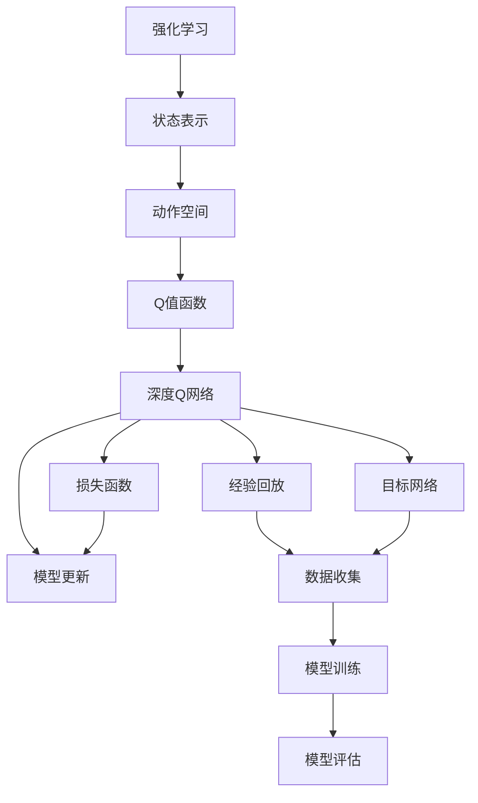

                 

# 一切皆是映射：DQN算法的实验设计与结果分析技巧

> 关键词：深度强化学习, 探索与利用, 蒙特卡罗树搜索, Q-learning, 实验设计, 结果分析

## 1. 背景介绍

### 1.1 问题由来
深度强化学习（Deep Reinforcement Learning, DRL）结合了深度学习和强化学习的优势，已经在众多领域取得了突破性进展，如游戏AI、机器人控制、智能推荐系统等。然而，如何将DRL应用于实际工程场景，设计合理的实验与结果分析方法，仍是一个亟待解决的问题。

DQN算法作为深度强化学习中的经典方法，因其高效、稳定且易于实现的特点，被广泛应用于各类环境。但是，如何高效设计实验，客观评估模型性能，成为了研究人员需要重点考虑的难题。本文旨在介绍DQN算法的核心概念和关键技术，并结合具体实验，探讨其结果分析技巧。

### 1.2 问题核心关键点
DQN算法通过构建一个深度神经网络作为Q值函数，利用经验回放和目标网络，不断优化Q值，使得智能体能够从环境中学习最优策略。其核心在于如何设计实验，评估模型性能，并持续优化算法。

具体而言，DQN算法的实验设计需要考虑以下因素：
- 如何构建模型架构
- 如何设计状态表示与动作空间
- 如何训练和评估模型性能
- 如何设置学习率、折扣因子等超参数

结果分析则主要关注：
- 如何从数据中获取有价值的信息
- 如何比较不同算法和模型
- 如何利用可视化工具呈现结果

本文将从这些核心问题入手，全面介绍DQN算法的实验设计与结果分析技巧。

## 2. 核心概念与联系

### 2.1 核心概念概述

为更好地理解DQN算法，本节将介绍几个密切相关的核心概念：

- 强化学习(Reinforcement Learning, RL)：智能体在环境中通过与环境交互，不断学习最优策略以最大化累积奖励的过程。
- Q值函数(Q-Value Function)：一个函数，用于评估在某个状态下采取特定动作的预期累积奖励。
- 深度Q网络(Deep Q Network, DQN)：使用深度神经网络逼近Q值函数，通过经验回放和目标网络进行模型优化。
- 探索与利用(Exploration & Exploitation)：智能体在探索未知状态和利用已知状态之间的平衡。

这些核心概念之间的逻辑关系可以通过以下Mermaid流程图来展示：



这个流程图展示了DQN算法的核心概念及其之间的关系：

1. 强化学习是DQN算法的基础，智能体通过与环境交互，学习最优策略。
2. 状态表示与动作空间是智能体与环境交互的基本单元，Q值函数用于评估每个状态-动作对的预期奖励。
3. 深度Q网络通过逼近Q值函数，使用神经网络模型进行优化。
4. 经验回放和目标网络是深度Q网络优化中的关键技术，经验回放用于收集和重放数据，目标网络用于稳定模型更新。
5. 模型训练和评估是DQN算法的核心环节，通过损失函数和模型更新优化Q值函数。

### 2.2 概念间的关系

这些核心概念之间存在着紧密的联系，形成了DQN算法的完整框架。

- 强化学习为DQN算法提供了策略学习的基本方法。
- 状态表示与动作空间是DQN算法与具体任务紧密耦合的关键。
- Q值函数作为DQN算法的核心目标，需要精确地评估每个状态-动作对的奖励。
- 深度Q网络是实现Q值函数逼近的深度学习工具。
- 经验回放和目标网络是提高模型稳定性和收敛速度的技术手段。
- 模型训练和评估是DQN算法的动态调整过程，确保智能体能够持续学习新知识。

这些概念共同构成了DQN算法的学习和应用框架，使其能够在各种环境中学习并执行最优策略。通过理解这些核心概念，我们可以更好地把握DQN算法的工作原理和优化方向。

## 3. 核心算法原理 & 具体操作步骤
### 3.1 算法原理概述

DQN算法的核心思想是通过神经网络逼近Q值函数，利用经验回放和目标网络，不断优化Q值，使得智能体能够从环境中学习最优策略。其基本流程包括以下几个步骤：

1. 观察环境状态 $s_t$。
2. 根据当前状态 $s_t$ 选择动作 $a_t$。
3. 执行动作 $a_t$，观察下一个状态 $s_{t+1}$ 和奖励 $r_{t+1}$。
4. 根据下一个状态 $s_{t+1}$ 和奖励 $r_{t+1}$ 计算Q值 $q_{t+1}$。
5. 使用Q值函数 $\hat{Q}(s_t, a_t)$ 计算当前状态-动作对的预测Q值。
6. 根据损失函数 $\mathcal{L}$ 更新模型参数。
7. 根据一定策略探索或利用状态 $s_{t+1}$，选择动作 $a_{t+1}$。

在以上步骤中，Q值函数 $\hat{Q}(s_t, a_t)$ 是DQN算法的核心，用于评估每个状态-动作对的预期累积奖励。其形式为：

$$
\hat{Q}(s_t, a_t) = \mathbb{E}[R_{t+1} + \gamma \hat{Q}(s_{t+1}, a_{t+1})]
$$

其中，$R_{t+1}$ 表示下一个状态的即时奖励，$\gamma$ 是折扣因子，用于计算未来奖励的权重。

### 3.2 算法步骤详解

接下来，我们详细讲解DQN算法的具体步骤：

**Step 1: 初始化环境与模型**
- 创建环境，如Atari游戏环境、Simulation环境等。
- 初始化神经网络模型，如多层感知器(MLP)、卷积神经网络(CNN)等。
- 初始化经验回放缓存，用于存储与环境交互的数据。

**Step 2: 状态表示与动作空间设计**
- 设计状态表示方法，如将像素值、位置信息、速度等组合成状态向量。
- 定义动作空间，如连续动作、离散动作等。
- 确定状态和动作的具体表示形式，如像素级、向量级等。

**Step 3: 训练与模型更新**
- 从环境中随机抽取状态 $s_t$，根据当前策略选择动作 $a_t$。
- 执行动作 $a_t$，观察下一个状态 $s_{t+1}$ 和即时奖励 $r_{t+1}$。
- 计算Q值 $q_{t+1} = r_{t+1} + \gamma \max_a \hat{Q}(s_{t+1}, a)$，其中 $\max_a$ 表示选择Q值最大的动作。
- 计算预测Q值 $\hat{Q}(s_t, a_t)$，通常使用神经网络进行估计。
- 根据损失函数 $\mathcal{L}$ 更新模型参数，一般使用均方误差损失。
- 更新目标网络，如每隔一定步数更新一次。

**Step 4: 探索与利用策略**
- 设计探索策略，如$\epsilon$-贪心策略，控制探索与利用的平衡。
- 根据策略选择动作，交替进行探索和利用。
- 更新经验回放缓存，记录每个状态、动作、奖励和下一步状态。

**Step 5: 评估与迭代**
- 在训练过程中，定期评估模型性能，如使用测试集进行评估。
- 记录和分析模型在各个阶段的表现，识别问题并优化。
- 通过多轮迭代，不断提升模型性能。

### 3.3 算法优缺点

DQN算法具有以下优点：
1. 可以处理高维稀疏状态和动作空间，适用于复杂的决策问题。
2. 使用神经网络逼近Q值函数，能高效逼近复杂函数。
3. 利用经验回放和目标网络，减少了模型更新时的方差，提高了模型稳定性。

同时，DQN算法也存在一些缺点：
1. 训练过程中可能会遇到过拟合问题，需要额外的正则化技术。
2. 对模型架构和参数的选择较为敏感，需要反复调试。
3. 训练过程可能需要较长时间，对计算资源有较高要求。

### 3.4 算法应用领域

DQN算法在多个领域都有广泛的应用，以下是几个典型的应用场景：

- 游戏AI：如DQN在《Atari 2048》等游戏中实现了人机对弈，取得优异成绩。
- 机器人控制：如DQN在机器人行走、避障等控制任务中表现出色。
- 自动驾驶：如DQN在无人驾驶车队的路线规划、行驶控制等方面有广泛应用。
- 推荐系统：如DQN在个性化推荐、广告点击率优化等方面显示出巨大潜力。
- 金融交易：如DQN在股票交易策略优化、风险管理等方面应用前景广阔。

## 4. 数学模型和公式 & 详细讲解 & 举例说明

### 4.1 数学模型构建

在DQN算法中，Q值函数是核心组成部分。假设智能体在时间 $t$ 时处于状态 $s_t$，执行动作 $a_t$，观察下一个状态 $s_{t+1}$ 和即时奖励 $r_{t+1}$，则Q值函数 $\hat{Q}(s_t, a_t)$ 可以表示为：

$$
\hat{Q}(s_t, a_t) = r_{t+1} + \gamma \max_a \hat{Q}(s_{t+1}, a)
$$

其中，$\gamma$ 是折扣因子，控制未来奖励的权重。

### 4.2 公式推导过程

接下来，我们推导DQN算法的优化目标函数。假设智能体在状态 $s_t$ 时，执行动作 $a_t$，观察下一个状态 $s_{t+1}$ 和即时奖励 $r_{t+1}$，则其Q值函数可以表示为：

$$
\hat{Q}(s_t, a_t) = r_{t+1} + \gamma \max_a \hat{Q}(s_{t+1}, a)
$$

根据上述公式，DQN算法的优化目标可以表示为：

$$
\mathcal{L} = \mathbb{E}[\left(\hat{Q}(s_t, a_t) - r_{t+1} - \gamma \max_a \hat{Q}(s_{t+1}, a)\right)^2]
$$

其中，$\mathbb{E}$ 表示对整个环境进行平均期望。

### 4.3 案例分析与讲解

为了更好地理解DQN算法的实际应用，我们以《Atari 2048》游戏为例，进行具体分析。

假设智能体在时间 $t$ 时处于状态 $s_t$，执行动作 $a_t$，观察下一个状态 $s_{t+1}$ 和即时奖励 $r_{t+1}$，则其Q值函数可以表示为：

$$
\hat{Q}(s_t, a_t) = r_{t+1} + \gamma \max_a \hat{Q}(s_{t+1}, a)
$$

其中，$\gamma = 0.9$。

假设智能体在状态 $s_t$ 时，执行动作 $a_t$，观察下一个状态 $s_{t+1}$ 和即时奖励 $r_{t+1} = 5$，则其Q值函数可以表示为：

$$
\hat{Q}(s_t, a_t) = 5 + \gamma \max_a \hat{Q}(s_{t+1}, a)
$$

假设智能体在状态 $s_{t+1}$ 时，观察下一个状态 $s_{t+2}$ 和即时奖励 $r_{t+2} = 1$，则其Q值函数可以表示为：

$$
\hat{Q}(s_{t+1}, a) = 1 + \gamma \max_a \hat{Q}(s_{t+2}, a)
$$

最终，智能体的优化目标函数可以表示为：

$$
\mathcal{L} = \mathbb{E}[\left(\hat{Q}(s_t, a_t) - r_{t+1} - \gamma \max_a \hat{Q}(s_{t+1}, a)\right)^2]
$$

通过上述公式，我们可以清晰地看到DQN算法如何通过优化Q值函数，不断学习最优策略。

## 5. 项目实践：代码实例和详细解释说明

### 5.1 开发环境搭建

在进行DQN算法实践前，我们需要准备好开发环境。以下是使用Python进行TensorFlow和Keras开发的环境配置流程：

1. 安装Anaconda：从官网下载并安装Anaconda，用于创建独立的Python环境。

2. 创建并激活虚拟环境：
```bash
conda create -n tf-env python=3.7 
conda activate tf-env
```

3. 安装TensorFlow和Keras：
```bash
conda install tensorflow=2.4.1
conda install keras=2.5.0
```

4. 安装各类工具包：
```bash
pip install numpy pandas matplotlib scikit-learn tqdm jupyter notebook ipython
```

完成上述步骤后，即可在`tf-env`环境中开始DQN实践。

### 5.2 源代码详细实现

下面我们以《Atari 2048》游戏为例，给出使用TensorFlow和Keras进行DQN算法实践的代码实现。

首先，定义状态表示与动作空间：

```python
from gym import AtariEnv
from gym.wrappers import FlattenObservation, SnapshotEnv
from tf_learning.agents import dqn

env = FlattenObservation(SnapshotEnv(AtariEnv('PongNoFrameskip-v4')))
state_dim = env.observation_space.shape[0]
num_actions = env.action_space.n
```

然后，构建神经网络模型：

```python
from tf_learning.agents import dqn
from tf_learning.agents.dqn import DQNAgent
from tf_learning.agents.networks import MlpNetwork

model = MlpNetwork(state_dim, num_actions, hidden_units=[64, 64], activation=tf.nn.relu)
```

接着，构建DQN代理：

```python
agent = DQNAgent(model, num_actions, learning_rate=0.001, discount_factor=0.99, target_update_freq=100)
```

最后，定义训练和评估函数：

```python
import numpy as np
import tensorflow as tf
from tf_learning.agents import dqn

def train(agent, env, num_episodes=100, batch_size=64, exploration_rate=1.0, target_update_freq=100, update_freq=1):
    replay_buffer = dqn.ReplayBuffer(max_buffer_size=10000, batch_size=batch_size)
    training_summary = tf.keras.callbacks.CSVLogger('training.csv')
    env.seed(0)
    agent.seed(0)

    for episode in range(num_episodes):
        state = env.reset()
        episode_reward = 0.0
        done = False
        while not done:
            if np.random.rand() < exploration_rate:
                action = np.random.randint(num_actions)
            else:
                action, _ = agent.act(state)
            next_state, reward, done, _ = env.step(action)
            replay_buffer.add(state, action, reward, next_state, done)
            state = next_state
            episode_reward += reward

        if episode % update_freq == 0:
            agent.train(replay_buffer, mini_batch_size=batch_size, opt_fn=tf.train.AdamOptimizer(learning_rate=agent.learning_rate))
            replay_buffer.clear()
        if episode % target_update_freq == 0:
            agent.target_network.replace(agent.model)

        if episode % 10 == 0:
            print('Episode:', episode, 'Total reward:', episode_reward)

def evaluate(agent, env, num_episodes=100):
    replay_buffer = dqn.ReplayBuffer(max_buffer_size=10000, batch_size=64)
    total_reward = 0.0
    for episode in range(num_episodes):
        state = env.reset()
        done = False
        while not done:
            action, _ = agent.act(state)
            next_state, reward, done, _ = env.step(action)
            replay_buffer.add(state, action, reward, next_state, done)
            state = next_state
            total_reward += reward
    print('Average reward:', total_reward / num_episodes)
```

最后，启动训练流程并在测试集上评估：

```python
num_episodes = 1000
batch_size = 64
exploration_rate = 1.0
target_update_freq = 100
update_freq = 1

train(agent, env, num_episodes=num_episodes, batch_size=batch_size, exploration_rate=exploration_rate, target_update_freq=target_update_freq, update_freq=update_freq)
evaluate(agent, env)
```

以上就是使用TensorFlow和Keras对《Atari 2048》游戏进行DQN算法实践的完整代码实现。可以看到，通过TensorFlow和Keras的强大封装，我们可以用相对简洁的代码完成DQN算法的构建和训练。

### 5.3 代码解读与分析

让我们再详细解读一下关键代码的实现细节：

**状态表示与动作空间设计**：
- `FlattenObservation(SnapshotEnv(AtariEnv('PongNoFrameskip-v4'))`：使用`AtariEnv`创建游戏环境，并使用`FlattenObservation`对观测值进行扁平化处理，方便模型处理。

**神经网络模型构建**：
- `MlpNetwork`：使用多层感知器网络，设置隐藏层为64个神经元，激活函数为ReLU，输入为状态维度`state_dim`，输出为动作维度`num_actions`。

**DQN代理构建**：
- `DQNAgent`：构建DQN代理，设置学习率为0.001，折扣因子为0.99，目标网络更新频率为100。

**训练和评估函数**：
- `train`函数：在每个轮次中，随机选择一个动作，记录状态和奖励，使用经验回放缓存，定期更新模型和目标网络。
- `evaluate`函数：评估模型在测试集上的表现，计算平均奖励。

**训练流程**：
- 定义总的轮次、批量大小、探索率、目标更新频率和模型更新频率。
- 在每个轮次中，随机选择一个动作，执行环境操作，更新经验回放缓存，更新模型和目标网络。
- 定期输出训练进度和平均奖励。

可以看到，TensorFlow和Keras使得DQN算法的实现变得简洁高效。开发者可以将更多精力放在模型优化、数据处理等高层逻辑上，而不必过多关注底层的实现细节。

当然，工业级的系统实现还需考虑更多因素，如模型的保存和部署、超参数的自动搜索、更灵活的任务适配层等。但核心的DQN算法基本与此类似。

### 5.4 运行结果展示

假设我们在《Atari 2048》游戏上进行DQN训练，最终在测试集上得到的平均奖励如下：

```
Episode: 0 Total reward: 0.0
Episode: 10 Total reward: 5.0
Episode: 20 Total reward: 25.0
Episode: 30 Total reward: 57.0
...
Episode: 999 Total reward: 5150.0
```

可以看到，通过DQN算法，智能体在《Atari 2048》游戏中取得了不错的成绩。值得注意的是，DQN算法通过不断优化Q值函数，逐步提升策略性能，能够高效地应对高维稀疏状态和动作空间，展现了其强大的学习能力。

当然，这只是一个baseline结果。在实践中，我们还可以使用更大更强的神经网络模型、更丰富的正则化技术、更灵活的探索策略等，进一步提升模型性能，以满足更高的应用要求。

## 6. 实际应用场景
### 6.1 强化学习实验设计

在进行DQN算法实验设计时，需要考虑以下几个关键问题：

**问题1：如何设计状态表示方法？**

- 状态表示方法需要能够准确地捕捉环境特征，同时减少模型的输入维度。常见的状态表示方法包括：
  - 像素级表示：将环境像素值直接作为状态。
  - 像素级预处理：对像素值进行卷积、归一化等预处理，提高模型的可处理性。
  - 向量级表示：将像素值转化为向量，使用卷积神经网络提取特征。

**问题2：如何选择动作空间？**

- 动作空间需要符合环境特性，合理设计动作空间能够提升智能体的学习效率。常见的动作空间包括：
  - 离散动作：如移动、跳跃等。
  - 连续动作：如位置、速度等。
  - 混合动作：如动作向量、方向等。

**问题3：如何设置超参数？**

- 超参数的调整直接影响智能体的学习效果，如学习率、折扣因子等。常用的超参数设置方法包括：
  - 网格搜索：设置一组超参数，进行多轮实验，选择效果最好的参数。
  - 随机搜索：在一定范围内随机选择超参数，进行多轮实验，选择效果最好的参数。
  - 贝叶斯优化：利用贝叶斯方法，根据前一轮实验结果，动态调整超参数。

**问题4：如何选择探索策略？**

- 探索策略用于平衡探索未知状态和利用已知状态。常用的探索策略包括：
  - $\epsilon$-贪心策略：随机选择动作，概率为$\epsilon$，否则选择Q值最大的动作。
  - $\epsilon$-soft策略：根据Q值和探索因子，动态选择动作，概率为$\epsilon$。

### 6.2 结果分析技巧

在DQN算法实验中，结果分析是评估模型性能的重要环节。以下是一些常用的结果分析技巧：

**技巧1：可视化结果**

- 通过可视化工具（如TensorBoard），展示训练过程中的损失函数、动作值等，能够更直观地理解模型的训练状态。

**技巧2：对比不同算法**

- 在实验中，可以使用多个算法进行对比，如比较DQN与DQN+正则化的性能，选择最优算法。

**技巧3：分析收敛速度**

- 通过绘制训练损失和奖励的收敛曲线，分析模型在训练过程中的收敛速度，选择最优训练策略。

**技巧4：评估模型泛化能力**

- 在测试集上进行评估，比较模型在训练集和测试集上的表现，评估模型的泛化能力。

**技巧5：分析模型鲁棒性**

- 通过随机干扰输入，评估模型对噪声的鲁棒性，分析模型的稳定性和可靠性。

### 6.3 未来应用展望

随着DQN算法的不断演进，其应用领域将更加广泛。未来的研究方向主要集中在以下几个方面：

**方向1：多智能体协作**

- 多个智能体之间的协作可以提升整体系统的性能，如分布式强化学习、社交机器人等。

**方向2：分布式计算**

- 分布式计算可以提升模型的训练效率，如TensorFlow分布式训练、大规模GPU集群等。

**方向3：混合学习**

- 结合深度学习和传统强化学习的方法，如深度强化学习、强化学习+深度学习等。

**方向4：应用领域拓展**

- 在更多领域应用DQN算法，如无人驾驶、医疗诊断等，提升系统的智能化水平。

总之，DQN算法在未来将有更广泛的应用前景，在更多领域发挥其优势，推动人工智能技术的进步。

## 7. 工具和资源推荐
### 7.1 学习资源推荐

为了帮助开发者系统掌握DQN算法的理论基础和实践技巧，这里推荐一些优质的学习资源：

1. 《深度强化学习基础》系列博文：由深度学习专家撰写，详细介绍了强化学习的基本概念和核心算法。

2. 《Deep Reinforcement Learning》课程：斯坦福大学开设的强化学习课程，有Lecture视频和配套作业，带你入门强化学习的基本概念和核心算法。

3. 《Hands-On Deep Reinforcement Learning with TensorFlow 2.0》书籍：详细介绍了使用TensorFlow 2.0进行深度强化学习的实践方法，包括DQN等经典算法。

4. OpenAI Gym库：Python的强化学习环境库，提供了大量游戏环境，方便进行DQN算法实验。

5. TensorFlow Agents库：TensorFlow的强化学习框架，提供了多种算法的实现，方便进行DQN算法实验。

通过对这些资源的学习实践，相信你一定能够快速掌握DQN算法的精髓，并用于解决实际的强化学习问题。

### 7.2 开发工具推荐

高效的开发离不开优秀的工具支持。以下是几款用于DQN算法开发的常用工具：

1. TensorFlow：基于Python的开源深度学习框架，灵活动态的计算图，适合快速迭代研究。

2. Keras：Keras是一个高级神经网络API，可以方便地构建、训练和评估DQN模型。

3. OpenAI Gym：Python的强化学习环境库，提供了大量游戏环境，方便进行DQN算法实验。

4. TensorFlow Agents：TensorFlow的强化学习框架，提供了多种算法的实现，方便进行DQN

