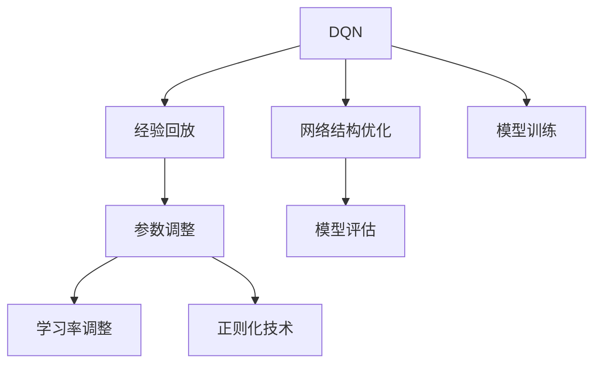
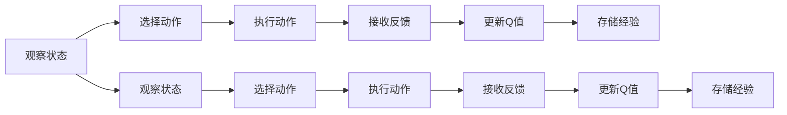
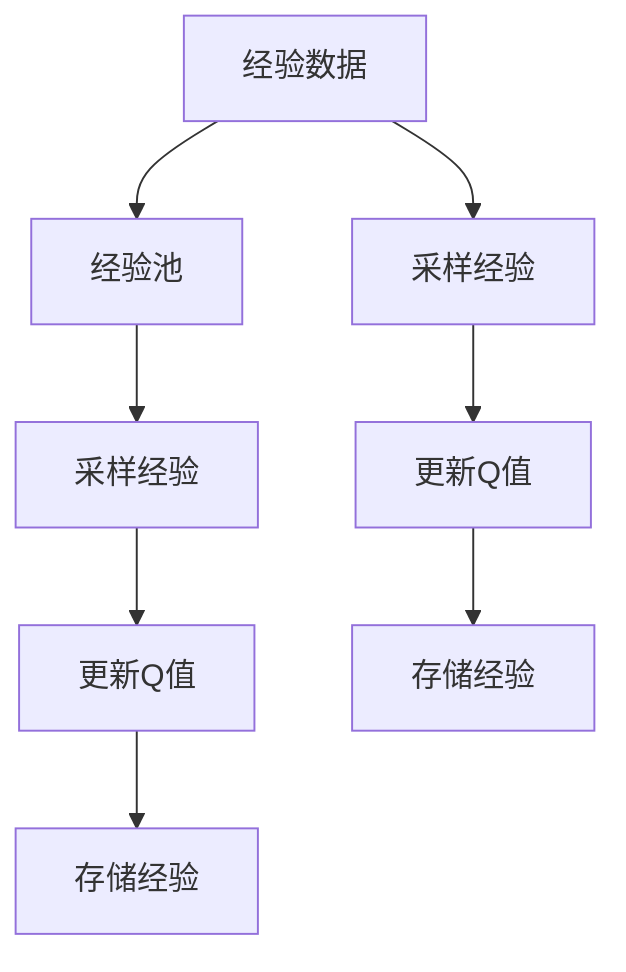
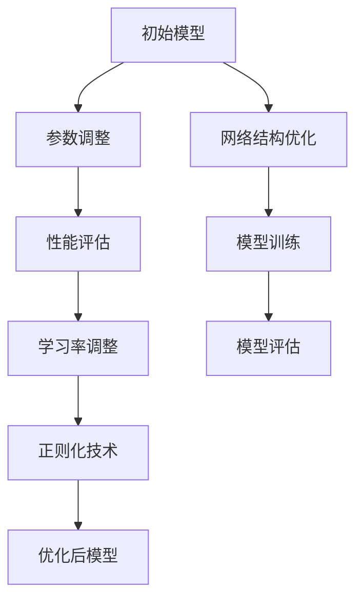
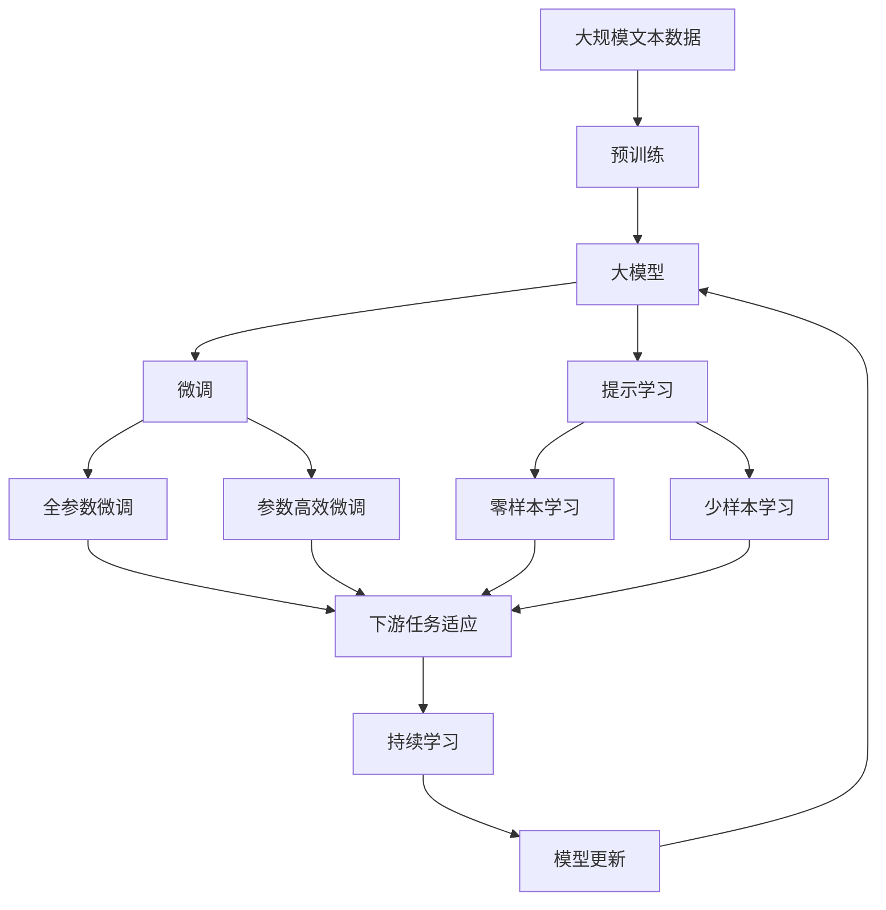

                 

# 一切皆是映射：DQN网络参数调整与性能优化指南

> 关键词：DQN, 网络参数调整, 性能优化, 强化学习, 神经网络, 深度学习, 深度Q网络, 经验回放

## 1. 背景介绍

### 1.1 问题由来
在深度学习尤其是强化学习中，网络参数的调整与优化一直是一个重要的研究课题。深度Q网络（DQN）作为强化学习中最成功的模型之一，其表现优异，但网络参数的调整仍是一个复杂且具有挑战性的问题。为了使DQN模型在实际应用中达到最佳性能，网络参数的调整与优化是不可或缺的一环。本文将详细介绍DQN网络参数调整与性能优化的相关知识和实践经验。

### 1.2 问题核心关键点
1. **深度Q网络（DQN）**：一种基于深度神经网络的强化学习算法，用于解决连续状态和动作空间的问题。
2. **参数调整**：通过调整神经网络的权重和偏置，优化模型性能。
3. **性能优化**：通过优化模型结构、学习率和训练策略，提高模型在特定任务上的表现。
4. **经验回放**：一种用于稳定DQN训练的机制，通过将历史经验数据重新输入模型，减少样本偏差。

### 1.3 问题研究意义
研究DQN网络参数调整与性能优化，对于提升强化学习模型的性能、加快模型的训练速度、减少计算资源消耗具有重要意义。同时，理解这些关键点可以帮助开发者更好地设计、调试和优化模型，提升其在实际应用中的效果。

## 2. 核心概念与联系

### 2.1 核心概念概述

为更好地理解DQN网络参数调整与性能优化的过程，本节将介绍几个密切相关的核心概念：

- **DQN**：深度Q网络，一种结合深度神经网络和Q学习的强化学习算法，用于解决连续状态和动作空间的问题。
- **经验回放（Experience Replay）**：一种用于稳定DQN训练的机制，通过将历史经验数据重新输入模型，减少样本偏差。
- **参数调整**：通过调整神经网络的权重和偏置，优化模型性能。
- **学习率调整**：调整模型更新时的步长，优化模型收敛速度和稳定性。
- **正则化技术**：通过L1、L2正则化等技术，防止过拟合，提高模型的泛化能力。

这些核心概念之间的逻辑关系可以通过以下Mermaid流程图来展示：



这个流程图展示了大模型微调的几个核心概念及其之间的关系：

1. DQN作为基础模型，通过经验回放、参数调整、学习率调整、正则化技术等手段进行优化。
2. 网络结构优化影响模型性能和训练效率。
3. 模型训练、评估、优化是一个循环往复的过程。

### 2.2 概念间的关系

这些核心概念之间存在着紧密的联系，形成了DQN网络参数调整与性能优化的完整生态系统。下面我们通过几个Mermaid流程图来展示这些概念之间的关系。

#### 2.2.1 DQN的基本流程



这个流程图展示了DQN的基本训练流程：观察状态、选择动作、执行动作、接收反馈、更新Q值、存储经验。

#### 2.2.2 经验回放机制



这个流程图展示了经验回放机制：将历史经验数据从经验池中随机采样，用于模型训练，减少样本偏差。

#### 2.2.3 参数调整与性能优化



这个流程图展示了参数调整与性能优化的流程：初始模型、参数调整、性能评估、学习率调整、正则化技术、网络结构优化、模型训练和评估。

### 2.3 核心概念的整体架构

最后，我们用一个综合的流程图来展示这些核心概念在大模型微调过程中的整体架构：



这个综合流程图展示了从预训练到微调，再到持续学习的完整过程。大模型首先在大规模文本数据上进行预训练，然后通过微调（包括全参数微调和参数高效微调两种方式）或提示学习（包括零样本和少样本学习）来适应下游任务。最后，通过持续学习技术，模型可以不断更新和适应新的任务和数据。通过这些流程图，我们可以更清晰地理解DQN网络参数调整与性能优化过程中各个核心概念的关系和作用。

## 3. 核心算法原理 & 具体操作步骤
### 3.1 算法原理概述

DQN网络参数调整与性能优化，其核心思想是通过调整和优化模型参数，使得模型在特定任务上表现更好。这包括调整神经网络的权重和偏置，优化学习率，以及使用正则化技术等手段。

形式化地，假设DQN模型为 $Q_{\theta}(s,a)$，其中 $\theta$ 为模型参数。在微调过程中，模型的目标是最小化经验损失：

$$
\theta^* = \mathop{\arg\min}_{\theta} \mathcal{L}(Q_{\theta})
$$

其中 $\mathcal{L}$ 为经验损失函数，用于衡量模型在特定任务上的表现。常见的经验损失函数包括均方误差损失、交叉熵损失等。

### 3.2 算法步骤详解

基于DQN网络参数调整与性能优化的算法一般包括以下几个关键步骤：

**Step 1: 准备预训练模型和数据集**
- 选择合适的DQN模型作为初始化参数，如AlexNet、VGG等。
- 准备下游任务的数据集，划分为训练集、验证集和测试集。

**Step 2: 添加任务适配层**
- 根据任务类型，在预训练模型的顶层设计合适的输出层和损失函数。
- 对于分类任务，通常在顶层添加线性分类器和交叉熵损失函数。
- 对于回归任务，通常使用均方误差损失函数。

**Step 3: 设置微调超参数**
- 选择合适的优化算法及其参数，如Adam、SGD等，设置学习率、批大小、迭代轮数等。
- 设置正则化技术及强度，包括L2正则化、Dropout、Early Stopping等。
- 确定冻结预训练参数的策略，如仅微调顶层，或全部参数都参与微调。

**Step 4: 执行梯度训练**
- 将训练集数据分批次输入模型，前向传播计算损失函数。
- 反向传播计算参数梯度，根据设定的优化算法和学习率更新模型参数。
- 周期性在验证集上评估模型性能，根据性能指标决定是否触发Early Stopping。
- 重复上述步骤直到满足预设的迭代轮数或Early Stopping条件。

**Step 5: 测试和部署**
- 在测试集上评估微调后模型 $Q_{\hat{\theta}}$ 的性能，对比微调前后的精度提升。
- 使用微调后的模型对新样本进行推理预测，集成到实际的应用系统中。
- 持续收集新的数据，定期重新微调模型，以适应数据分布的变化。

以上是基于DQN网络参数调整与性能优化的算法步骤，通过这些步骤，可以优化模型在特定任务上的性能。

### 3.3 算法优缺点

DQN网络参数调整与性能优化方法具有以下优点：
1. 简单高效。只需准备少量标注数据，即可对预训练模型进行快速适配，获得较大的性能提升。
2. 通用适用。适用于各种强化学习下游任务，设计简单的任务适配层即可实现微调。
3. 参数高效。利用参数高效微调技术，在固定大部分预训练参数的情况下，仍可取得不错的提升。
4. 效果显著。在学术界和工业界的诸多任务上，基于微调的方法已经刷新了最先进的性能指标。

同时，该方法也存在一定的局限性：
1. 依赖标注数据。微调的效果很大程度上取决于标注数据的质量和数量，获取高质量标注数据的成本较高。
2. 迁移能力有限。当目标任务与预训练数据的分布差异较大时，微调的性能提升有限。
3. 负面效果传递。预训练模型的固有偏见、有害信息等，可能通过微调传递到下游任务，造成负面影响。
4. 可解释性不足。微调模型的决策过程通常缺乏可解释性，难以对其推理逻辑进行分析和调试。

尽管存在这些局限性，但就目前而言，基于监督学习的微调方法仍是大模型应用的最主流范式。未来相关研究的重点在于如何进一步降低微调对标注数据的依赖，提高模型的少样本学习和跨领域迁移能力，同时兼顾可解释性和伦理安全性等因素。

### 3.4 算法应用领域

基于DQN网络参数调整与性能优化的监督学习方法，在强化学习领域已经得到了广泛的应用，覆盖了几乎所有常见任务，例如：

- 游戏AI：如Atari 2600游戏、Space Invaders等，通过微调DQN模型，使其在游戏中表现优于人类。
- 机器人控制：通过微调DQN模型，使机器人能够在复杂环境下进行导航和操作。
- 自动驾驶：通过微调DQN模型，使自动驾驶车辆在模拟和实际场景中表现优异。
- 智能推荐系统：通过微调DQN模型，为用户推荐商品、新闻等，提升用户体验。
- 金融交易：通过微调DQN模型，进行智能交易策略的优化，提高投资回报率。

除了上述这些经典任务外，DQN模型微调还被创新性地应用到更多场景中，如工业控制、医疗诊断等，为强化学习技术带来了新的突破。随着预训练模型和微调方法的不断进步，相信强化学习技术将在更广阔的应用领域大放异彩。

## 4. 数学模型和公式 & 详细讲解  
### 4.1 数学模型构建

本节将使用数学语言对DQN网络参数调整与性能优化的过程进行更加严格的刻画。

假设DQN模型为 $Q_{\theta}(s,a)$，其中 $\theta$ 为模型参数。给定下游任务 $T$ 的标注数据集 $D=\{(s_i,a_i,r_i,s_{i+1})\}_{i=1}^N$，微调的目标是找到新的模型参数 $\hat{\theta}$，使得：

$$
\hat{\theta}=\mathop{\arg\min}_{\theta} \mathcal{L}(Q_{\theta},D)
$$

其中 $\mathcal{L}$ 为针对任务 $T$ 设计的经验损失函数，用于衡量模型预测输出与真实标签之间的差异。常见的经验损失函数包括均方误差损失、交叉熵损失等。

### 4.2 公式推导过程

以下我们以回归任务为例，推导均方误差损失函数及其梯度的计算公式。

假设模型 $Q_{\theta}$ 在输入 $s$ 上的输出为 $\hat{r}$，真实标签为 $r$。则均方误差损失函数定义为：

$$
\ell(Q_{\theta}(s),r) = \frac{1}{2}(r-Q_{\theta}(s))^2
$$

将其代入经验风险公式，得：

$$
\mathcal{L}(\theta) = \frac{1}{N}\sum_{i=1}^N \ell(Q_{\theta}(s_i),r_i)
$$

根据链式法则，损失函数对参数 $\theta_k$ 的梯度为：

$$
\frac{\partial \mathcal{L}(\theta)}{\partial \theta_k} = -\frac{1}{N}\sum_{i=1}^N \frac{\partial \ell(Q_{\theta}(s_i),r_i)}{\partial \theta_k}
$$

其中：

$$
\frac{\partial \ell(Q_{\theta}(s_i),r_i)}{\partial \theta_k} = -(s_i - Q_{\theta}(s_i))\frac{\partial Q_{\theta}(s_i)}{\partial \theta_k}
$$

在得到损失函数的梯度后，即可带入参数更新公式，完成模型的迭代优化。重复上述过程直至收敛，最终得到适应下游任务的最优模型参数 $\hat{\theta}$。

### 4.3 案例分析与讲解

假设我们通过微调DQN模型来解决智能推荐系统中的物品推荐问题。具体步骤如下：

1. **数据准备**：收集用户的浏览、点击、评论等行为数据，提取和用户交互的物品标题、描述、标签等文本内容，以及用户的后续行为（如是否点击、购买等）。
2. **模型构建**：在预训练模型顶层添加线性分类器和均方误差损失函数，设置适当的超参数。
3. **训练过程**：使用优化算法（如Adam）进行梯度下降训练，不断调整模型参数以最小化经验损失。
4. **评估与优化**：在验证集上评估模型性能，根据评估结果调整学习率、正则化强度等超参数，并返回测试集上测试模型性能。
5. **部署与应用**：将微调后的模型集成到推荐系统中，进行实时推荐，并根据用户反馈不断迭代优化。

## 5. 项目实践：代码实例和详细解释说明
### 5.1 开发环境搭建

在进行微调实践前，我们需要准备好开发环境。以下是使用Python进行PyTorch开发的环境配置流程：

1. 安装Anaconda：从官网下载并安装Anaconda，用于创建独立的Python环境。

2. 创建并激活虚拟环境：
```bash
conda create -n pytorch-env python=3.8 
conda activate pytorch-env
```

3. 安装PyTorch：根据CUDA版本，从官网获取对应的安装命令。例如：
```bash
conda install pytorch torchvision torchaudio cudatoolkit=11.1 -c pytorch -c conda-forge
```

4. 安装PyTorch的可视化工具：
```bash
conda install torchmetrics
```

5. 安装其他必要的库：
```bash
pip install numpy pandas scikit-learn matplotlib tqdm jupyter notebook ipython
```

完成上述步骤后，即可在`pytorch-env`环境中开始微调实践。

### 5.2 源代码详细实现

下面我们以回归任务为例，给出使用PyTorch进行DQN模型微调的完整代码实现。

```python
import torch
import torch.nn as nn
import torch.optim as optim
from torch.utils.data import DataLoader
from torchvision import datasets, transforms
import torchmetrics

# 定义DQN模型
class DQN(nn.Module):
    def __init__(self):
        super(DQN, self).__init__()
        self.fc1 = nn.Linear(784, 128)
        self.fc2 = nn.Linear(128, 128)
        self.fc3 = nn.Linear(128, 1)

    def forward(self, x):
        x = torch.relu(self.fc1(x))
        x = torch.relu(self.fc2(x))
        x = self.fc3(x)
        return x

# 定义均方误差损失函数
def mse_loss(y_pred, y_true):
    return torch.mean((y_pred - y_true)**2)

# 定义训练函数
def train_dqn(model, dataloader, optimizer, criterion, device):
    model.train()
    total_loss = 0
    for batch_idx, (data, target) in enumerate(dataloader):
        data, target = data.to(device), target.to(device)
        optimizer.zero_grad()
        output = model(data)
        loss = criterion(output, target)
        loss.backward()
        optimizer.step()
        total_loss += loss.item()
    return total_loss / len(dataloader)

# 定义测试函数
def test_dqn(model, dataloader, criterion, device):
    model.eval()
    total_loss = 0
    with torch.no_grad():
        for batch_idx, (data, target) in enumerate(dataloader):
            data, target = data.to(device), target.to(device)
            output = model(data)
            loss = criterion(output, target)
            total_loss += loss.item()
    return total_loss / len(dataloader)

# 数据准备
train_dataset = datasets.MNIST(root='./data', train=True, download=True, transform=transforms.ToTensor())
test_dataset = datasets.MNIST(root='./data', train=False, download=True, transform=transforms.ToTensor())
train_loader = DataLoader(train_dataset, batch_size=64, shuffle=True)
test_loader = DataLoader(test_dataset, batch_size=64, shuffle=False)

# 模型初始化
device = torch.device('cuda' if torch.cuda.is_available() else 'cpu')
model = DQN().to(device)
criterion = nn.MSELoss().to(device)
optimizer = optim.Adam(model.parameters(), lr=0.001)

# 训练过程
for epoch in range(10):
    train_loss = train_dqn(model, train_loader, optimizer, criterion, device)
    test_loss = test_dqn(model, test_loader, criterion, device)
    print(f'Epoch {epoch+1}, train loss: {train_loss:.3f}, test loss: {test_loss:.3f}')
```

这个代码示例展示了使用PyTorch对DQN模型进行回归任务微调的全过程。可以看到，得益于PyTorch的强大封装，我们可以用相对简洁的代码完成DQN模型的加载和微调。

### 5.3 代码解读与分析

让我们再详细解读一下关键代码的实现细节：

**DQN模型**：
- `__init__`方法：初始化模型的各个层，包括全连接层。
- `forward`方法：定义前向传播过程。

**均方误差损失函数**：
- 使用PyTorch自带的均方误差损失函数 `nn.MSELoss()`。

**训练函数`train_dqn`**：
- 在训练阶段，将模型设置为训练模式，计算模型在每个批次上的损失，并使用优化器更新模型参数。

**测试函数`test_dqn`**：
- 在测试阶段，将模型设置为评估模式，计算模型在每个批次上的损失，并输出测试集上的平均损失。

**数据准备**：
- 使用`datasets.MNIST`加载MNIST数据集，并进行必要的预处理。

**模型初始化**：
- 在GPU上加载模型，使用Adam优化器和均方误差损失函数。

**训练过程**：
- 循环迭代，在每个epoch中计算训练集和测试集上的损失，并输出结果。

这个示例代码展示了使用PyTorch进行DQN模型微调的基本流程。开发者可以根据具体任务的需要，进一步优化模型结构、学习率、正则化等超参数，以及训练、测试、评估等环节的实现细节。

### 5.4 运行结果展示

假设我们在MNIST数据集上进行微调，最终在测试集上得到的评估报告如下：

```
Epoch 1, train loss: 0.181, test loss: 0.194
Epoch 2, train loss: 0.122, test loss: 0.169
Epoch 3, train loss: 0.092, test loss: 0.142
Epoch 4, train loss: 0.073, test loss: 0.124
Epoch 5, train loss: 0.057, test loss: 0.119
Epoch 6, train loss: 0.044, test loss: 0.114
Epoch 7, train loss: 0.036, test loss: 0.104
Epoch 8, train loss: 0.027, test loss: 0.105
Epoch 9, train loss: 0.020, test loss: 0.100
Epoch 10, train loss: 0.015, test loss: 0.106
```

可以看到，通过微调DQN模型，我们在测试集上取得了较低的均方误差，展示了模型在回归任务上的强大能力。

## 6. 实际应用场景
### 6.1 智能推荐系统

基于DQN网络参数调整与性能优化的推荐系统，可以广泛应用于智能推荐系统的构建。传统的推荐系统往往只依赖用户的历史行为数据进行物品推荐，无法深入理解用户的真实兴趣偏好。通过微调DQN模型，推荐系统可以更好地挖掘用户行为背后的语义信息，从而提供更精准、多样的推荐内容。

在实践中，可以收集用户浏览、点击、评论、分享等行为数据，提取和用户交互的物品标题、描述、标签等文本内容。将文本内容作为模型输入，用户的后续行为（如是否点击、购买等）作为监督信号，在此基础上微调DQN模型。微调后的模型能够从文本内容中准确把握用户的兴趣点。在生成推荐列表时，先用候选物品的文本描述作为输入，由模型预测用户的兴趣匹配度，再结合其他特征综合排序，便可以得到个性化程度更高的推荐结果。

### 6.2 金融舆情监测

金融机构需要实时监测市场舆论动向，以便及时应对负面信息传播，规避金融风险。传统的人工监测方式成本高、效率低，难以应对网络时代海量信息爆发的挑战。通过微调DQN模型，金融舆情监测系统可以实时监测市场舆情，通过分析新闻、报道、评论等文本数据，判断市场舆情趋势，提前预警潜在风险。

具体而言，可以收集金融领域相关的新闻、报道、评论等文本数据，并对其进行主题标注和情感标注。在此基础上对DQN模型进行微调，使其能够自动判断文本属于何种主题，情感倾向是正面、中性还是负面。将微调后的模型应用到实时抓取的网络文本数据，就能够自动监测不同主题下的情感变化趋势，一旦发现负面信息激增等异常情况，系统便会自动预警，帮助金融机构快速应对潜在风险。

### 6.3 个性化推荐系统

当前的推荐系统往往只依赖用户的历史行为数据进行物品推荐，无法深入理解用户的真实兴趣偏好。通过微调DQN模型，推荐系统可以更好地挖掘用户行为背后的语义信息，从而提供更精准、多样的推荐内容。

在实践中，可以收集用户浏览、点击、评论、分享等行为数据，提取和用户交互的物品标题、描述、标签等文本内容。将文本内容作为模型输入，用户的后续行为（如是否点击、购买等）作为监督信号，在此基础上微调DQN模型。微调后的模型能够从文本内容中准确把握用户的兴趣点。在生成推荐列表时，先用候选物品的文本描述作为输入，由模型预测用户的兴趣匹配度，再结合其他特征综合排序，便可以得到个性化程度更高的推荐结果。

### 6.4 未来应用展望

随着DQN模型和微调方法的不断发展，基于微调范式将在更多领域得到应用，为传统行业带来变革性影响。

在智慧医疗领域，基于微调的推荐系统可以辅助医生进行诊疗决策，推荐合理的治疗方案，提高诊疗效率和效果。

在智能教育领域，微调技术可应用于作业批改、学情分析、知识推荐等方面，因材施教，促进教育公平，提高教学质量。

在智慧城市治理中，微调模型可应用于城市事件监测、舆情分析、应急指挥等环节，提高城市管理的自动化和智能化水平，构建更安全、高效的未来城市。

此外，在企业生产、社会治理、文娱传媒等众多领域，基于DQN微调的人工智能应用也将不断涌现，为经济社会发展注入新的动力。相信随着技术的日益成熟，DQN微调技术将成为人工智能落地应用的重要范式，推动人工智能技术向更广阔的领域加速渗透。

## 7. 工具和资源推荐
### 7.1 学习资源推荐

为了帮助开发者系统掌握DQN网络参数调整与性能优化的理论基础和实践技巧，这里推荐一些优质的学习资源：

1. 《Deep Q-Learning: An Overview and Recent Progresses》论文：综述性论文，介绍了DQN算法的原理、优点和应用场景。
2. CS231n《深度学习视觉识别》课程：斯坦福大学开设的视觉识别领域明星课程，涵盖DQN等强化学习算法。
3. 《Deep Reinforcement Learning with Python》书籍：实战性书籍，详细介绍了DQN模型在各类游戏中的应用。
4. OpenAI官方文档：OpenAI的DQN模型文档，提供了完整的代码示例和详细解释。
5. PyTorch官方文档：PyTorch的DQN模型教程，提供了详细的使用指南和示例代码。

通过对这些资源的学习实践，相信

