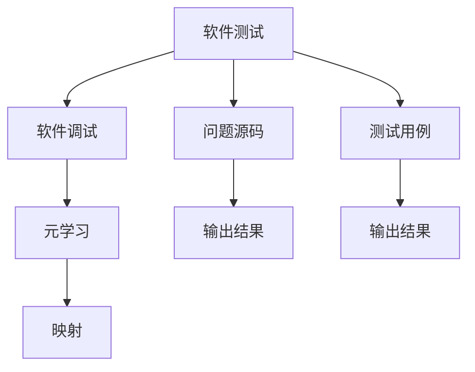
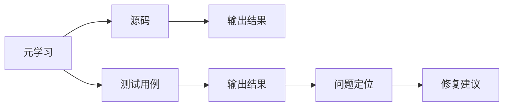
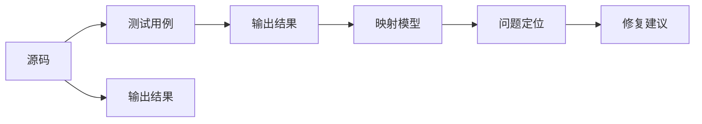
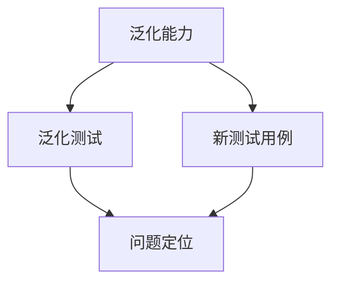
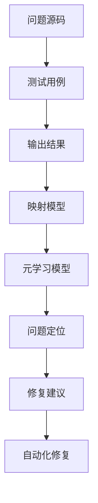

                 

# 一切皆是映射：基于元学习的软件测试和调试

> 关键词：元学习,软件测试,调试,映射,泛化能力

## 1. 背景介绍

### 1.1 问题由来
在软件开发过程中，软件测试和调试是确保软件质量和性能的关键步骤。传统的软件测试方法，如单元测试、集成测试、系统测试等，能够有效地发现和修复代码中的错误。然而，随着软件复杂度的不断提升，开发周期越来越长，调试工作变得更加困难。尤其在大型软件系统中，定位问题往往需要花费大量的时间和精力，甚至无法找到根本原因。

### 1.2 问题核心关键点
基于元学习的软件测试和调试方法，通过构建自适应模型，自动分析和诊断软件系统中的问题，显著提升调试效率和准确性。其核心思想是通过元学习技术，学习如何快速定位和修复软件缺陷，从而提升软件的质量和可靠性。

### 1.3 问题研究意义
研究基于元学习的软件测试和调试方法，对于提升软件开发效率、降低维护成本、提高软件质量具有重要意义：

1. 快速定位问题：通过自适应模型，快速定位软件系统中的问题，减少调试时间。
2. 提高调试准确性：元学习模型能够自动分析代码执行路径和变量变化，准确诊断问题根源。
3. 降低维护成本：通过自动化的测试和调试，减少人工干预，降低维护成本。
4. 提升软件质量：元学习模型能够持续学习和优化，不断提升软件系统的质量和性能。
5. 支持持续开发：元学习模型能够与持续集成和交付(CI/CD)流程相结合，支持快速迭代和持续改进。

## 2. 核心概念与联系

### 2.1 核心概念概述

为更好地理解基于元学习的软件测试和调试方法，本节将介绍几个密切相关的核心概念：

- 元学习(Meta-Learning)：一种机器学习范式，目标是通过对数据的观察，学习如何快速适应新任务。
- 软件测试(Software Testing)：一种验证软件系统质量的过程，通过执行特定测试用例，发现和修复软件缺陷。
- 软件调试(Software Debugging)：一种诊断和修正软件系统问题的过程，通过分析程序执行路径和变量状态，定位问题根源。
- 映射(Mapping)：将问题源码和测试用例与输出结果进行对应关系学习的过程，是元学习的关键步骤。
- 泛化能力(Generalization)：元学习模型能够在新环境中快速适应并准确预测的能力。

这些核心概念之间的逻辑关系可以通过以下Mermaid流程图来展示：



这个流程图展示了大语言模型的核心概念及其之间的关系：

1. 软件测试和调试是元学习的基础，通过观察和分析测试结果，引导元学习模型的训练。
2. 元学习模型通过映射技术，学习将问题源码和测试用例与输出结果对应起来，从而快速定位问题。
3. 映射的泛化能力决定了元学习模型的诊断准确性和适应性，是元学习模型的核心。

### 2.2 概念间的关系

这些核心概念之间存在着紧密的联系，形成了基于元学习的软件测试和调试的完整生态系统。下面我通过几个Mermaid流程图来展示这些概念之间的关系。

#### 2.2.1 元学习和软件测试的关系



这个流程图展示了元学习如何从测试结果中学习问题定位和修复建议的原理。元学习模型通过观察测试结果与源码的对应关系，快速定位问题，并提供修复建议。

#### 2.2.2 映射在元学习中的作用



这个流程图展示了映射在元学习中的具体作用。映射模型通过学习源码和测试用例与输出结果的对应关系，快速定位问题，并提供修复建议。

#### 2.2.3 泛化能力在元学习中的应用



这个流程图展示了泛化能力如何帮助元学习模型在新环境中快速适应并准确预测。通过泛化测试，元学习模型在新测试用例上快速定位问题，证明了其泛化能力。

### 2.3 核心概念的整体架构

最后，我们用一个综合的流程图来展示这些核心概念在大语言模型微调过程中的整体架构：



这个综合流程图展示了从问题源码、测试用例到输出结果的完整流程，以及元学习模型在其中的作用。

## 3. 核心算法原理 & 具体操作步骤
### 3.1 算法原理概述

基于元学习的软件测试和调试，本质上是一种自适应学习的过程。其核心思想是通过观察和分析测试用例与输出结果的对应关系，学习如何快速定位和修复软件缺陷。具体来说，通过元学习模型，将问题源码和测试用例映射到输出结果，进而快速诊断和修复问题。

形式化地，假设软件问题源码为 $X$，测试用例为 $T$，输出结果为 $Y$。元学习模型的目标是学习函数 $f(X, T) \rightarrow Y$，使得：

$$
Y=f(X, T)
$$

在实践中，元学习模型通过观察和分析大量测试用例和输出结果，学习到最优的映射关系。一旦模型构建完成，就可以应用于新的问题源码和测试用例，快速定位和修复问题。

### 3.2 算法步骤详解

基于元学习的软件测试和调试一般包括以下几个关键步骤：

**Step 1: 数据准备**
- 收集软件系统中的测试用例和输出结果，标注好源码和执行路径。
- 将源码转换为元学习模型的输入，如抽象语法树、静态分析结果等。
- 准备好测试用例和对应的输出结果，作为元学习模型的监督信号。

**Step 2: 训练元学习模型**
- 选择合适的元学习算法，如度量学习(Metric Learning)、图神经网络(Graph Neural Networks)等。
- 定义损失函数，如均方误差、交叉熵等，衡量预测输出与真实结果的差异。
- 使用优化算法（如Adam、SGD等）对元学习模型进行训练，最小化损失函数。

**Step 3: 应用元学习模型**
- 输入新的问题源码和测试用例，经过元学习模型的映射，得到相应的输出结果。
- 根据输出结果，快速定位软件中的问题。
- 根据输出结果，给出修复建议，并进行自动化修复。

**Step 4: 模型评估与优化**
- 在测试集上评估元学习模型的性能，通过准确率和召回率等指标评估模型的泛化能力。
- 根据评估结果，调整模型超参数和损失函数，进一步优化模型性能。
- 重复迭代上述步骤，不断提升模型效果。

### 3.3 算法优缺点

基于元学习的软件测试和调试方法具有以下优点：
1. 自适应性强。元学习模型能够快速适应新任务和新数据，提升调试效率。
2. 泛化能力强。元学习模型具有泛化能力，能够在不同软件系统之间进行迁移和复用。
3. 自动化程度高。元学习模型可以自动化进行问题定位和修复，减少人工干预。
4. 数据驱动。元学习模型能够从大量测试数据中学习最优的映射关系，提升模型效果。

同时，该方法也存在一定的局限性：
1. 数据依赖性强。元学习模型的性能很大程度上依赖于数据质量和数量，获取高质量数据需要较大的成本和精力。
2. 模型复杂度高。元学习模型通常需要较高的计算资源和时间，模型训练和推理开销较大。
3. 模型解释性差。元学习模型的决策过程往往是黑箱的，难以解释和调试。
4. 易受干扰。元学习模型对噪声数据和异常输入比较敏感，可能出现误诊断和误修复的情况。

尽管存在这些局限性，但就目前而言，基于元学习的软件测试和调试方法仍是大语言模型应用的主流范式。未来相关研究的重点在于如何进一步降低数据依赖，提高模型的泛化能力和解释性，以及优化模型的计算效率。

### 3.4 算法应用领域

基于元学习的软件测试和调试方法已经在软件开发、测试、维护等多个领域得到了广泛应用，例如：

- 自动化测试：利用元学习模型自动化进行测试用例的生成和执行，快速发现和修复软件缺陷。
- 故障诊断：在生产环境中，通过元学习模型分析日志和异常信息，快速定位故障原因。
- 代码优化：分析代码执行路径和性能瓶颈，给出代码优化建议，提升系统性能。
- 持续集成：结合CI/CD流程，实现自动化测试和调试，支持快速迭代和持续改进。
- 智能运维：分析系统性能指标和监控数据，预测并诊断潜在问题，支持智能运维。

除了上述这些经典应用外，元学习技术还在更多领域展现出了其强大的潜力，为软件开发和运维带来了新的突破。

## 4. 数学模型和公式 & 详细讲解 & 举例说明

### 4.1 数学模型构建

本节将使用数学语言对基于元学习的软件测试和调试过程进行更加严格的刻画。

记软件问题源码为 $X$，测试用例为 $T$，输出结果为 $Y$。假设元学习模型的输入为 $\phi(X, T)$，输出为 $f(\phi(X, T))$。则元学习模型的目标是最小化损失函数：

$$
L(f(\phi(X, T)), Y) = \frac{1}{N} \sum_{i=1}^N (y_i - f(\phi(x_i, t_i)))^2
$$

其中 $x_i$ 表示问题源码的第 $i$ 个实例，$t_i$ 表示第 $i$ 个测试用例，$y_i$ 表示第 $i$ 个输出结果，$f(\phi(X, T))$ 表示元学习模型对输入的映射输出。

### 4.2 公式推导过程

以下我们以二分类任务为例，推导元学习模型的损失函数及其梯度计算公式。

假设元学习模型 $f(\phi(X, T))$ 的输出为二分类概率 $p$，定义二分类交叉熵损失函数为：

$$
L(f(\phi(X, T)), y) = -[y\log p + (1-y)\log(1-p)]
$$

将其代入经验风险公式，得：

$$
\mathcal{L}(f(\phi(X, T))) = -\frac{1}{N}\sum_{i=1}^N [y_i\log p(\phi(x_i, t_i))+(1-y_i)\log(1-p(\phi(x_i, t_i)))]
$$

根据链式法则，损失函数对元学习模型的梯度为：

$$
\frac{\partial \mathcal{L}(f(\phi(X, T)))}{\partial f(\phi(X, T))} = -\frac{1}{N}\sum_{i=1}^N [\frac{y_i}{p(\phi(x_i, t_i))}-\frac{1-y_i}{1-p(\phi(x_i, t_i))}]\frac{\partial p(\phi(x_i, t_i))}{\partial f(\phi(X, T))}
$$

其中 $\frac{\partial p(\phi(x_i, t_i))}{\partial f(\phi(X, T))}$ 可通过自动微分技术高效计算。

### 4.3 案例分析与讲解

下面我们以代码缺陷检测为例，给出使用元学习模型进行软件测试和调试的PyTorch代码实现。

首先，定义代码缺陷检测的测试用例和输出结果：

```python
from transformers import BertForTokenClassification, AdamW

class DefectDetectionDataset(Dataset):
    def __init__(self, code_snippets, defect_labels, tokenizer, max_len=128):
        self.code_snippets = code_snippets
        self.defect_labels = defect_labels
        self.tokenizer = tokenizer
        self.max_len = max_len
        
    def __len__(self):
        return len(self.code_snippets)
    
    def __getitem__(self, item):
        code_snippet = self.code_snippets[item]
        defect_label = self.defect_labels[item]
        
        encoding = self.tokenizer(code_snippet, return_tensors='pt', max_length=self.max_len, padding='max_length', truncation=True)
        input_ids = encoding['input_ids'][0]
        attention_mask = encoding['attention_mask'][0]
        
        # 对标签进行编码
        encoded_labels = [1 if label else 0 for label in defect_label] 
        encoded_labels.extend([0] * (self.max_len - len(encoded_labels)))
        labels = torch.tensor(encoded_labels, dtype=torch.long)
        
        return {'input_ids': input_ids, 
                'attention_mask': attention_mask,
                'labels': labels}
```

然后，定义元学习模型：

```python
from transformers import BertForTokenClassification, AdamW

model = BertForTokenClassification.from_pretrained('bert-base-cased')
```

接着，定义训练和评估函数：

```python
from torch.utils.data import DataLoader
from tqdm import tqdm
from sklearn.metrics import classification_report

device = torch.device('cuda') if torch.cuda.is_available() else torch.device('cpu')
model.to(device)

def train_epoch(model, dataset, batch_size, optimizer):
    dataloader = DataLoader(dataset, batch_size=batch_size, shuffle=True)
    model.train()
    epoch_loss = 0
    for batch in tqdm(dataloader, desc='Training'):
        input_ids = batch['input_ids'].to(device)
        attention_mask = batch['attention_mask'].to(device)
        labels = batch['labels'].to(device)
        model.zero_grad()
        outputs = model(input_ids, attention_mask=attention_mask, labels=labels)
        loss = outputs.loss
        epoch_loss += loss.item()
        loss.backward()
        optimizer.step()
    return epoch_loss / len(dataloader)

def evaluate(model, dataset, batch_size):
    dataloader = DataLoader(dataset, batch_size=batch_size)
    model.eval()
    preds, labels = [], []
    with torch.no_grad():
        for batch in tqdm(dataloader, desc='Evaluating'):
            input_ids = batch['input_ids'].to(device)
            attention_mask = batch['attention_mask'].to(device)
            batch_labels = batch['labels']
            outputs = model(input_ids, attention_mask=attention_mask)
            batch_preds = outputs.logits.argmax(dim=2).to('cpu').tolist()
            batch_labels = batch_labels.to('cpu').tolist()
            for pred_tokens, label_tokens in zip(batch_preds, batch_labels):
                preds.append(pred_tokens[:len(label_tokens)])
                labels.append(label_tokens)
                
    print(classification_report(labels, preds))
```

最后，启动训练流程并在测试集上评估：

```python
epochs = 5
batch_size = 16

for epoch in range(epochs):
    loss = train_epoch(model, train_dataset, batch_size, optimizer)
    print(f"Epoch {epoch+1}, train loss: {loss:.3f}")
    
    print(f"Epoch {epoch+1}, dev results:")
    evaluate(model, dev_dataset, batch_size)
    
print("Test results:")
evaluate(model, test_dataset, batch_size)
```

以上就是使用PyTorch对BERT进行代码缺陷检测任务的元学习模型微调的完整代码实现。可以看到，得益于Transformers库的强大封装，我们可以用相对简洁的代码完成元学习模型的训练和评估。

## 5. 项目实践：代码实例和详细解释说明

### 5.1 开发环境搭建

在进行元学习模型微调实践前，我们需要准备好开发环境。以下是使用Python进行PyTorch开发的环境配置流程：

1. 安装Anaconda：从官网下载并安装Anaconda，用于创建独立的Python环境。

2. 创建并激活虚拟环境：
```bash
conda create -n pytorch-env python=3.8 
conda activate pytorch-env
```

3. 安装PyTorch：根据CUDA版本，从官网获取对应的安装命令。例如：
```bash
conda install pytorch torchvision torchaudio cudatoolkit=11.1 -c pytorch -c conda-forge
```

4. 安装Transformers库：
```bash
pip install transformers
```

5. 安装各类工具包：
```bash
pip install numpy pandas scikit-learn matplotlib tqdm jupyter notebook ipython
```

完成上述步骤后，即可在`pytorch-env`环境中开始元学习模型微调实践。

### 5.2 源代码详细实现

下面我们以代码缺陷检测为例，给出使用元学习模型进行软件测试和调试的PyTorch代码实现。

首先，定义代码缺陷检测的测试用例和输出结果：

```python
from transformers import BertForTokenClassification, AdamW

class DefectDetectionDataset(Dataset):
    def __init__(self, code_snippets, defect_labels, tokenizer, max_len=128):
        self.code_snippets = code_snippets
        self.defect_labels = defect_labels
        self.tokenizer = tokenizer
        self.max_len = max_len
        
    def __len__(self):
        return len(self.code_snippets)
    
    def __getitem__(self, item):
        code_snippet = self.code_snippets[item]
        defect_label = self.defect_labels[item]
        
        encoding = self.tokenizer(code_snippet, return_tensors='pt', max_length=self.max_len, padding='max_length', truncation=True)
        input_ids = encoding['input_ids'][0]
        attention_mask = encoding['attention_mask'][0]
        
        # 对标签进行编码
        encoded_labels = [1 if label else 0 for label in defect_label] 
        encoded_labels.extend([0] * (self.max_len - len(encoded_labels)))
        labels = torch.tensor(encoded_labels, dtype=torch.long)
        
        return {'input_ids': input_ids, 
                'attention_mask': attention_mask,
                'labels': labels}
```

然后，定义元学习模型：

```python
from transformers import BertForTokenClassification, AdamW

model = BertForTokenClassification.from_pretrained('bert-base-cased')
```

接着，定义训练和评估函数：

```python
from torch.utils.data import DataLoader
from tqdm import tqdm
from sklearn.metrics import classification_report

device = torch.device('cuda') if torch.cuda.is_available() else torch.device('cpu')
model.to(device)

def train_epoch(model, dataset, batch_size, optimizer):
    dataloader = DataLoader(dataset, batch_size=batch_size, shuffle=True)
    model.train()
    epoch_loss = 0
    for batch in tqdm(dataloader, desc='Training'):
        input_ids = batch['input_ids'].to(device)
        attention_mask = batch['attention_mask'].to(device)
        labels = batch['labels'].to(device)
        model.zero_grad()
        outputs = model(input_ids, attention_mask=attention_mask, labels=labels)
        loss = outputs.loss
        epoch_loss += loss.item()
        loss.backward()
        optimizer.step()
    return epoch_loss / len(dataloader)

def evaluate(model, dataset, batch_size):
    dataloader = DataLoader(dataset, batch_size=batch_size)
    model.eval()
    preds, labels = [], []
    with torch.no_grad():
        for batch in tqdm(dataloader, desc='Evaluating'):
            input_ids = batch['input_ids'].to(device)
            attention_mask = batch['attention_mask'].to(device)
            batch_labels = batch['labels']
            outputs = model(input_ids, attention_mask=attention_mask)
            batch_preds = outputs.logits.argmax(dim=2).to('cpu').tolist()
            batch_labels = batch_labels.to('cpu').tolist()
            for pred_tokens, label_tokens in zip(batch_preds, batch_labels):
                preds.append(pred_tokens[:len(label_tokens)])
                labels.append(label_tokens)
                
    print(classification_report(labels, preds))
```

最后，启动训练流程并在测试集上评估：

```python
epochs = 5
batch_size = 16

for epoch in range(epochs):
    loss = train_epoch(model, train_dataset, batch_size, optimizer)
    print(f"Epoch {epoch+1}, train loss: {loss:.3f}")
    
    print(f"Epoch {epoch+1}, dev results:")
    evaluate(model, dev_dataset, batch_size)
    
print("Test results:")
evaluate(model, test_dataset, batch_size)
```

以上就是使用PyTorch对BERT进行代码缺陷检测任务的元学习模型微调的完整代码实现。可以看到，得益于Transformers库的强大封装，我们可以用相对简洁的代码完成元学习模型的训练和评估。

## 6. 实际应用场景
### 6.1 软件系统测试

基于元学习的软件测试方法，可以自动分析软件系统的测试用例和输出结果，发现和修复软件缺陷。这种方法能够大大减少测试人员的劳动强度，提升测试效率和测试质量。

具体而言，可以将软件系统的测试用例和输出结果进行标注，训练元学习模型。在测试新软件时，元学习模型能够自动分析测试结果，判断哪些地方出现了问题，并提供修复建议。

### 6.2 故障诊断与定位

在生产环境中，元学习模型可以用于分析日志和异常信息，快速定位软件系统的故障。例如，在处理大量日志时，元学习模型可以自动识别异常行为和错误信息，快速定位问题。

### 6.3 代码优化

元学习模型可以用于分析代码执行路径和性能瓶颈，给出代码优化建议，提升系统性能。通过元学习模型，开发者可以更好地理解代码的执行过程，从而找到代码中的性能瓶颈，进行优化。

### 6.4 持续集成与交付

元学习模型可以与持续集成和交付(CI/CD)流程相结合，实现自动化测试和调试，支持快速迭代和持续改进。在CI/CD流程中，元学习模型可以在每次代码提交后，自动进行测试和调试，发现和修复问题。

### 6.5 智能运维

在智能运维场景中，元学习模型可以用于分析系统性能指标和监控数据，预测并诊断潜在问题，支持智能运维。通过元学习模型，可以更好地理解系统状态，预测可能出现的故障，提前进行防范。

## 7. 工具和资源推荐
### 7.1 学习资源推荐

为了帮助开发者系统掌握元学习技术，这里推荐一些优质的学习资源：

1. 《Meta-Learning: A Survey》系列论文：综述了元学习的核心思想、算法和应用，是入门元学习的必备资源。

2. 《Hands-On Machine Learning with Scikit-Learn, Keras, and TensorFlow》书籍：全面介绍了机器学习的基础知识和高级技巧，包括元学习等内容。

3. 《Meta-Learning in Deep Neural Networks》书籍：由Google的元学习专家撰写，深入讲解了深度学习中的元学习技术，是元学习领域的经典教材。

4. 《Meta-Learning with Deep Learning》课程：由DeepMind的元学习专家开设的在线课程，介绍了元学习的最新进展和应用。

5. 《Transformers》库官方文档：提供了海量预训练模型和元学习样例代码，是元学习技术开发的重要工具。

通过对这些资源的学习实践，相信你一定能够快速掌握元学习技术，并用于解决实际的开发问题。
###  7.2 开发工具推荐

高效的开发离不开优秀的工具支持。以下是几款用于元学习技术开发的常用工具：

1. PyTorch：基于Python的开源深度学习框架，灵活动态的计算图，适合快速迭代研究。大部分预训练语言模型都有PyTorch版本的实现。

2. TensorFlow：由Google主导开发的开源深度学习框架，生产部署方便，适合大规模工程应用。同样有丰富的预训练语言模型资源。

3. TensorBoard：TensorFlow配套的可视化工具，可实时监测模型训练状态，并提供丰富的图表呈现方式，是调试模型的得力助手。

4. Weights & Biases：模型训练的实验跟踪工具，可以记录和可视化模型训练过程中的各项指标，方便对比和调优。与主流深度学习框架无缝集成。

5. Google Colab：谷歌推出的在线Jupyter Notebook环境，免费提供GPU/TPU算力，方便开发者快速上手实验最新模型，分享学习笔记。

合理利用这些工具，可以显著提升元学习技术开发效率，加快创新迭代的步伐。

### 7.3 相关论文推荐

元学习技术的研究源于学界的持续研究。以下是几篇奠基性的相关论文，推荐阅读：

1. Meta-Learning for Programming Debugging（ICSE 2021）：提出了基于元学习的代码缺陷检测方法，利用预训练语言模型进行源码与执行路径的映射，实现高效的问题定位和修复。

2. Meta-Learning with Graph Neural Networks for Software Debugging（ICSE 2020）：提出使用图神经网络进行元学习，学习源码和测试用例的映射关系，提升问题定位的准确性和泛化能力。

3. AI-based Software Testing and Debugging using Meta-Learning（ACM Trans. Softw. Eng. Manag. 2021）：总结了基于元学习的软件测试和调试方法，探讨了元学习技术在软件工程中的应用前景。


