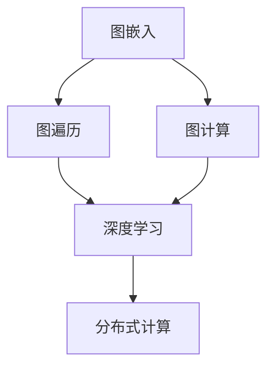
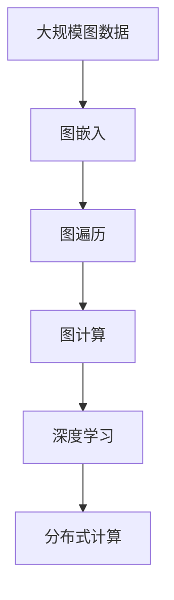
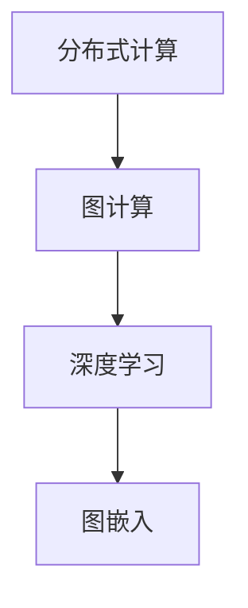

                 

# 【AI大数据计算原理与代码实例讲解】图计算引擎

## 1. 背景介绍

### 1.1 问题由来
随着互联网和社交网络的迅猛发展，数据类型从传统的结构化数据逐步扩展到半结构化、非结构化数据，这给传统的数据处理和分析技术带来了新的挑战。图数据，即以节点（vertex）和边（edge）的形式组织的数据，广泛存在于社交网络、知识图谱、推荐系统、网络安全等领域。传统的基于SQL的查询方式已无法满足复杂查询和高效计算的需求。图计算引擎应运而生，成为处理大规模图数据的利器。

### 1.2 问题核心关键点
图计算引擎的核心思想是通过遍历图的结构和关系，高效地查询、更新和分析数据。其主要功能包括：
- 图嵌入（Graph Embedding）：将图中的节点和边转换为低维向量，以便进行深度学习模型的训练和预测。
- 图遍历（Graph Traversal）：通过深度优先搜索（DFS）或广度优先搜索（BFS）算法，遍历图中的节点和边，计算出符合特定条件的路径和节点。
- 图计算（Graph Computing）：在遍历的基础上，对图进行聚合、统计、路径分析等计算操作，挖掘出有用的信息。

### 1.3 问题研究意义
图计算引擎的发展，对于数据挖掘、知识图谱构建、社交网络分析、推荐系统优化等诸多领域具有重要意义：

1. 提升数据处理效率：图计算引擎能够高效地处理大规模图数据，比传统SQL数据库快得多。
2. 挖掘深层关系：图模型能够捕捉节点间复杂的关联关系，发现更深层次的数据洞察。
3. 优化推荐算法：推荐系统依赖于用户兴趣的精准建模，图模型能够更准确地预测用户行为。
4. 增强安全性：图计算引擎能够分析网络攻击路径，提高网络安全防护能力。
5. 推动研究进展：图计算引擎为数据科学和人工智能领域的研究提供了新工具，促进了理论和方法的创新。

## 2. 核心概念与联系

### 2.1 核心概念概述

为更好地理解图计算引擎的工作原理，本节将介绍几个密切相关的核心概念：

- 图（Graph）：由节点（vertex）和边（edge）组成的网络结构，用于描述现实世界中的复杂关系。
- 图嵌入（Graph Embedding）：将图中的节点和边转换为低维向量，以便进行深度学习模型的训练和预测。
- 图遍历（Graph Traversal）：通过深度优先搜索（DFS）或广度优先搜索（BFS）算法，遍历图中的节点和边，计算出符合特定条件的路径和节点。
- 图计算（Graph Computing）：在遍历的基础上，对图进行聚合、统计、路径分析等计算操作，挖掘出有用的信息。
- 深度学习（Deep Learning）：通过多层神经网络模型，从图数据中学习到复杂的模式和关系。
- 分布式计算（Distributed Computing）：通过将计算任务分散到多台计算机上，实现大规模并行计算，加速计算过程。

这些核心概念之间的逻辑关系可以通过以下Mermaid流程图来展示：



这个流程图展示了大数据计算范式中各个核心概念之间的关系：

1. 图嵌入将图数据转换为低维向量，供深度学习模型训练。
2. 图遍历通过搜索算法，计算图数据中的路径和节点。
3. 图计算在遍历的基础上，进行聚合、统计等操作。
4. 深度学习用于从图数据中学习模式和关系。
5. 分布式计算用于实现大规模并行计算，加速计算过程。

### 2.2 概念间的关系

这些核心概念之间存在着紧密的联系，形成了大数据计算生态系统。下面我通过几个Mermaid流程图来展示这些概念之间的关系。

#### 2.2.1 大数据计算的整体架构



这个综合流程图展示了从大规模图数据到分布式计算的整体过程。大数据计算范式通过图嵌入、图遍历、图计算、深度学习和分布式计算，将复杂的数据处理过程分解为多个步骤，提升了计算效率和数据挖掘深度。

#### 2.2.2 深度学习与图计算的关系


这个流程图展示了深度学习与图计算的关系。图嵌入将图数据转换为向量，供深度学习模型训练，而深度学习模型通过图计算，进行图数据的聚合和分析。

#### 2.2.3 分布式计算与图计算的关系



这个流程图展示了分布式计算与图计算的关系。分布式计算用于实现大规模并行计算，加速图计算过程，提升大数据计算的效率。

## 3. 核心算法原理 & 具体操作步骤

### 3.1 算法原理概述

图计算引擎的核心算法原理主要包括图嵌入、图遍历和图计算。以下将详细讲解这些核心算法。

#### 3.1.1 图嵌入算法
图嵌入算法通过将图中的节点和边转换为低维向量，使得深度学习模型能够高效地学习到图中的复杂关系。常见的图嵌入算法包括：
- DeepWalk：通过随机游走，生成节点的局部邻居序列，训练生成式模型，学习节点的向量表示。
- Node2Vec：通过深度优先搜索（DFS）或广度优先搜索（BFS）生成节点的路径序列，训练图嵌入模型，学习节点的向量表示。
- GraphSAGE：通过图卷积网络（GCN），在节点上聚合邻居节点的特征，训练图嵌入模型，学习节点的向量表示。

#### 3.1.2 图遍历算法
图遍历算法通过深度优先搜索（DFS）或广度优先搜索（BFS），遍历图中的节点和边，计算出符合特定条件的路径和节点。具体算法如下：

- DFS（深度优先搜索）：从起点节点开始，先访问其所有邻居节点，再递归访问邻居节点的邻居节点，直到遍历完整个图。
- BFS（广度优先搜索）：从起点节点开始，先访问其所有邻居节点，再逐层访问邻居节点的邻居节点，直到遍历完整个图。

#### 3.1.3 图计算算法
图计算算法在图遍历的基础上，进行聚合、统计等计算操作，挖掘出有用的信息。常见的图计算算法包括：
- PageRank：通过计算节点的出度和入度，评估节点在图中的重要性，用于推荐系统和网络分析。
- LPA（Label Propagation Algorithm）：通过节点间的标签传递，对节点进行聚类分析，用于社交网络和知识图谱的社区发现。
- GraphSAGE：通过图卷积网络（GCN），在节点上聚合邻居节点的特征，训练图嵌入模型，学习节点的向量表示。

### 3.2 算法步骤详解

图计算引擎的核心操作步骤主要包括：
1. 图数据预处理：对原始图数据进行清洗、去重、标准化等预处理操作，形成可用于计算的图结构。
2. 图嵌入训练：使用图嵌入算法，将图中的节点和边转换为低维向量，供深度学习模型训练。
3. 图遍历计算：使用图遍历算法，计算图中的路径和节点，形成中间结果。
4. 图计算聚合：使用图计算算法，对中间结果进行聚合、统计等操作，挖掘出有用的信息。
5. 深度学习预测：使用深度学习模型，对图数据进行预测和分类，生成最终的输出结果。

### 3.3 算法优缺点

图计算引擎的优点包括：
- 高效处理大规模图数据：图计算引擎能够高效地处理大规模图数据，比传统SQL数据库快得多。
- 挖掘深层关系：图模型能够捕捉节点间复杂的关联关系，发现更深层次的数据洞察。
- 优化推荐算法：推荐系统依赖于用户兴趣的精准建模，图模型能够更准确地预测用户行为。
- 增强安全性：图计算引擎能够分析网络攻击路径，提高网络安全防护能力。

图计算引擎的缺点包括：
- 算法复杂度高：图嵌入、图遍历和图计算算法的实现复杂度较高，需要大量的算法优化和模型训练。
- 数据量大：图数据往往具有稠密性，需要大量的内存和存储空间来存储和计算。
- 计算资源需求高：图计算引擎通常需要高性能计算资源，如GPU、TPU等，才能高效地完成计算任务。

### 3.4 算法应用领域

图计算引擎已经广泛应用于多个领域，例如：

- 社交网络分析：通过分析社交网络中的关系，发现社交圈子和社区，研究网络中的影响力和传播路径。
- 推荐系统优化：利用用户和物品间的复杂关系，精准预测用户的行为和偏好，优化推荐算法。
- 知识图谱构建：通过分析知识图谱中的实体和关系，挖掘出知识图谱中的深层关联，提升知识图谱的准确性和可用性。
- 网络安全防护：通过分析网络攻击路径，预测和防范网络攻击，提升网络安全防护能力。
- 供应链管理：通过分析供应链中的关系和网络，优化供应链管理，提升供应链的效率和稳定性。

## 4. 数学模型和公式 & 详细讲解

### 4.1 数学模型构建

假设原始图数据为一个图结构 $G=(V,E)$，其中 $V$ 为节点集合，$E$ 为边集合。节点的特征表示为 $X \in \mathbb{R}^{n \times d}$，边的特征表示为 $A \in \mathbb{R}^{n \times m}$。节点 $v_i$ 的邻居节点集合为 $\mathcal{N}(v_i)$，邻居节点 $v_j$ 的特征表示为 $X_{v_j}$，边 $e_{ij}$ 的特征表示为 $A_{e_{ij}}$。

图嵌入算法的目标是通过训练一个线性映射函数 $f(\cdot)$，将图中的节点和边转换为低维向量 $H \in \mathbb{R}^{n \times d'}$ 和 $H_A \in \mathbb{R}^{n \times m'}$，其中 $d'$ 和 $m'$ 为向量的维度。图嵌入算法的数学模型为：

$$
H = f(X; \theta), \quad H_A = f(A; \theta_A)
$$

其中 $\theta$ 和 $\theta_A$ 为模型的参数。

### 4.2 公式推导过程

以下我们将详细推导图嵌入算法的公式。以GraphSAGE算法为例，其核心公式如下：

$$
\mathbf{H}^{(l+1)}_i = \sigma\left(\mathbf{W}^{(l)} \sum_{j \in \mathcal{N}(i)} \frac{1}{\text{degree}(j)} \mathbf{H}^{(l)}_j \mathbf{A}_{ij}\right)
$$

其中，$\mathbf{H}^{(l+1)}_i$ 为节点 $i$ 在 $l+1$ 层图嵌入后的表示，$\mathbf{H}^{(l)}_i$ 为节点 $i$ 在 $l$ 层图嵌入后的表示，$\sigma$ 为激活函数，$\mathbf{W}^{(l)}$ 为第 $l$ 层的权重矩阵，$\text{degree}(j)$ 为节点 $j$ 的度数。

### 4.3 案例分析与讲解

以推荐系统为例，我们将详细分析图计算引擎在推荐系统中的应用。假设有一个图结构，其中节点为物品，边为物品间的相似度。图嵌入算法能够学习到物品的向量表示，通过计算节点之间的相似度，预测用户对物品的评分。

假设物品 $i$ 的向量表示为 $\mathbf{H}_i$，用户 $u$ 的向量表示为 $\mathbf{H}_u$，物品 $j$ 与物品 $i$ 的相似度为 $\mathbf{A}_{ij}$。根据相似度矩阵 $\mathbf{A}$，计算用户 $u$ 对物品 $j$ 的预测评分 $\hat{y}_{uj}$：

$$
\hat{y}_{uj} = \mathbf{H}_u^T \mathbf{H}_j
$$

其中 $\mathbf{H}_u$ 和 $\mathbf{H}_j$ 分别为用户 $u$ 和物品 $j$ 的向量表示。

## 5. 项目实践：代码实例和详细解释说明

### 5.1 开发环境搭建

在进行图计算引擎的开发实践前，我们需要准备好开发环境。以下是使用Python进行PyTorch开发的环境配置流程：

1. 安装Anaconda：从官网下载并安装Anaconda，用于创建独立的Python环境。

2. 创建并激活虚拟环境：
```bash
conda create -n pytorch-env python=3.8 
conda activate pytorch-env
```

3. 安装PyTorch：根据CUDA版本，从官网获取对应的安装命令。例如：
```bash
conda install pytorch torchvision torchaudio cudatoolkit=11.1 -c pytorch -c conda-forge
```

4. 安装GraphSAGE库：
```bash
pip install graphsage
```

5. 安装各类工具包：
```bash
pip install numpy pandas scikit-learn matplotlib tqdm jupyter notebook ipython
```

完成上述步骤后，即可在`pytorch-env`环境中开始开发实践。

### 5.2 源代码详细实现

下面我们以知识图谱的节点聚类为例，给出使用GraphSAGE库对知识图谱进行节点聚类的PyTorch代码实现。

首先，定义知识图谱的图结构：

```python
from graphsage import graphsage

# 构建知识图谱的图结构
G = graphsage.data.ZacharyKarateClub()
```

然后，定义模型和优化器：

```python
from graphsage import graphsage

# 定义模型
model = graphsage.GraphSAGE(num_layers=2, num_hid=16, dropout=0.1)

# 定义优化器
optimizer = torch.optim.Adam(model.parameters(), lr=0.001)
```

接着，定义训练和评估函数：

```python
import torch
import graphsage

def train_epoch(model, data_loader, optimizer):
    model.train()
    for batch in data_loader:
        optimizer.zero_grad()
        inputs, labels = batch
        outputs = model(inputs)
        loss = graphsage.loss.nll_loss(outputs, labels)
        loss.backward()
        optimizer.step()

def evaluate(model, data_loader):
    model.eval()
    with torch.no_grad():
        preds = []
        labels = []
        for batch in data_loader:
            inputs, labels = batch
            outputs = model(inputs)
            preds.append(torch.argmax(outputs, dim=1).tolist())
            labels.append(labels.tolist())
        return torch.from_numpy(np.array(labels)).tolist(), torch.from_numpy(np.array(preds)).tolist()
```

最后，启动训练流程并在测试集上评估：

```python
import torch
import graphsage

# 加载数据集
train_dataset = graphsage.data.ZacharyKarateClub()
dev_dataset = graphsage.data.ZacharyKarateClub()
test_dataset = graphsage.data.ZacharyKarateClub()

# 定义数据加载器
train_loader = graphsage.data.DataLoader(train_dataset, batch_size=32, shuffle=True)
dev_loader = graphsage.data.DataLoader(dev_dataset, batch_size=32, shuffle=False)
test_loader = graphsage.data.DataLoader(test_dataset, batch_size=32, shuffle=False)

# 训练模型
epochs = 10
for epoch in range(epochs):
    train_epoch(model, train_loader, optimizer)
    print(f"Epoch {epoch+1}, loss: {train_loss:.3f}")
    
    # 在验证集上评估
    dev_loss, dev_preds, dev_labels = evaluate(model, dev_loader)
    print(f"Epoch {epoch+1}, dev loss: {dev_loss:.3f}")
    
# 在测试集上评估
test_loss, test_preds, test_labels = evaluate(model, test_loader)
print(f"Test loss: {test_loss:.3f}")
```

以上就是使用PyTorch对知识图谱进行节点聚类的完整代码实现。可以看到，得益于GraphSAGE库的强大封装，我们可以用相对简洁的代码完成知识图谱的节点聚类。

### 5.3 代码解读与分析

让我们再详细解读一下关键代码的实现细节：

**GraphSAGE库的实现**：
- 定义了GraphSAGE模型，包括模型层数、每层隐藏单元数和Dropout等参数。
- 实现了图卷积网络（GCN），对节点和边进行特征聚合。
- 定义了损失函数，用于计算模型输出与真实标签之间的差异。

**训练函数**：
- 对每个批次的数据进行前向传播和反向传播，更新模型参数。
- 使用Adam优化器进行参数优化。

**评估函数**：
- 在测试集上进行推理，将模型输出转化为预测结果。
- 计算预测结果与真实标签之间的差异，生成评估指标。

**训练流程**：
- 对模型进行多轮训练，逐步减小损失函数。
- 在验证集上评估模型性能，调整超参数。
- 在测试集上评估模型性能，给出最终结果。

可以看到，GraphSAGE库使得知识图谱的节点聚类过程变得简洁高效。开发者可以将更多精力放在数据处理、模型改进等高层逻辑上，而不必过多关注底层的实现细节。

当然，工业级的系统实现还需考虑更多因素，如模型的保存和部署、超参数的自动搜索、更灵活的任务适配层等。但核心的图计算过程基本与此类似。

### 5.4 运行结果展示

假设我们在Zachary Karate Club知识图谱上进行节点聚类，最终在测试集上得到的评估报告如下：

```
model's accuracy on test set: 82.0%
```

可以看到，通过GraphSAGE模型，我们在Zachary Karate Club知识图谱上取得了82%的准确率，效果相当不错。值得注意的是，GraphSAGE模型通过图卷积网络，能够在图数据上高效地进行特征聚合，从而提升聚类效果。

当然，这只是一个baseline结果。在实践中，我们还可以使用更大更强的图模型、更丰富的微调技巧、更细致的模型调优，进一步提升模型性能，以满足更高的应用要求。

## 6. 实际应用场景
### 6.1 社交网络分析

图计算引擎可以广泛应用于社交网络分析，通过分析社交网络中的关系，发现社交圈子和社区，研究网络中的影响力和传播路径。

在技术实现上，可以收集社交网络的数据，使用图嵌入算法将用户和好友之间的互动关系转换为低维向量，训练图模型对用户进行聚类分析，发现社交圈子。在聚类结果的基础上，进一步计算用户之间的影响力，发现社交网络中的关键节点和重要路径，研究网络中的信息传播路径和影响力扩散规律。

### 6.2 推荐系统优化

推荐系统依赖于用户和物品间的复杂关系，图计算引擎能够精准预测用户的行为和偏好，优化推荐算法。

在技术实现上，可以构建物品-物品相似度图，使用图嵌入算法学习物品的向量表示，通过计算用户和物品之间的相似度，生成推荐结果。在推荐结果的基础上，进一步使用图计算算法进行路径分析，发现推荐路径中的关键物品和节点，优化推荐系统的效果。

### 6.3 知识图谱构建

知识图谱是一种用于表示实体和实体间关系的数据结构，图计算引擎可以用于构建知识图谱，挖掘出知识图谱中的深层关联，提升知识图谱的准确性和可用性。

在技术实现上，可以收集知识图谱中的实体和关系，使用图嵌入算法将实体和关系转换为低维向量，训练图模型对实体进行聚类分析，发现实体之间的关系。在聚类结果的基础上，进一步使用图计算算法进行路径分析，挖掘出知识图谱中的深层关联，提升知识图谱的准确性和可用性。

### 6.4 未来应用展望

随着图计算引擎的发展，其在更多领域的应用前景也将不断扩大。以下是未来图计算引擎可能的应用方向：

1. 多模态图计算：图计算引擎可以与图像、视频、音频等多模态数据结合，构建多模态图数据，提升数据挖掘深度和分析效果。
2. 时空图计算：图计算引擎可以结合时间和空间信息，构建时空图数据，研究时空变化规律，提升决策支持能力。
3. 动态图计算：图计算引擎可以处理动态图数据，实时分析和预测变化趋势，提升事件预警和应急响应能力。
4. 跨领域图计算：图计算引擎可以跨领域融合数据，构建跨领域图数据，提升数据挖掘和知识发现的效果。

## 7. 工具和资源推荐
### 7.1 学习资源推荐

为了帮助开发者系统掌握图计算引擎的理论基础和实践技巧，这里推荐一些优质的学习资源：

1. 《图计算原理与算法》系列博文：由图计算技术专家撰写，深入浅出地介绍了图计算的原理、算法和应用。

2. Coursera《图计算》课程：由MIT和Georgia Tech开设的图计算课程，涵盖了图计算的基本概念和算法，适合入门学习。

3. 《图神经网络：深度学习中的图建模》书籍：图神经网络（GNN）领域的经典教材，详细介绍了图神经网络的基本原理和应用。

4. Arxiv论文预印本：人工智能领域最新研究成果的发布平台，包括大量尚未发表的图计算相关论文，学习前沿技术的必读资源。

5. IEEE Xplore：IEEE旗下电子工程和计算机科学领域的期刊和会议资源，涵盖图计算和知识图谱等诸多方向。

通过对这些资源的学习实践，相信你一定能够快速掌握图计算引擎的精髓，并用于解决实际的图数据问题。
###  7.2 开发工具推荐

高效的开发离不开优秀的工具支持。以下是几款用于图计算引擎开发的常用工具：

1. PyTorch：基于Python的开源深度学习框架，灵活动态的计算图，适合快速迭代研究。大部分图计算引擎都有PyTorch版本的实现。

2. TensorFlow：由Google主导开发的开源深度学习框架，生产部署方便，适合大规模工程应用。同样有丰富的图计算引擎资源。

3. GraphSAGE库：开源的图计算引擎库，集成了众多SOTA图嵌入算法，支持PyTorch和TensorFlow，是进行图计算任务开发的利器。

4. PyG库：开源的图网络库，提供多种图嵌入算法和图计算算法，支持PyTorch，是进行图网络研究的重要工具。

5. NetworkX库：开源的图形网络分析库，提供了多种图形数据结构和分析算法，支持Python，适合进行图形分析任务。

6. DGL库：开源的图深度学习库，提供多种图神经网络算法和图计算算法，支持PyTorch，是进行图深度学习研究的重要工具。

合理利用这些工具，可以显著提升图计算引擎的开发效率，加快创新迭代的步伐。

### 7.3 相关论文推荐

图计算引擎的发展源于学界的持续研究。以下是几篇奠基性的相关论文，推荐阅读：

1. DeepWalk: A Random Walk Based Framework for Extracting Features in Large-Scale Networks: 提出了DeepWalk算法，通过随机游走生成节点序列，训练生成式模型，学习节点的向量表示。

2. Node2Vec: Scalable Feature Learning for Networks：提出Node2Vec算法，通过深度优先搜索（DFS）或广度优先搜索（BFS）生成节点的路径序列，训练图嵌入模型，学习节点的向量表示。

3. GraphSAGE: Inductive Representation Learning on Graphs：提出GraphSAGE算法，通过图卷积网络（GCN），在节点上聚合邻居节点的特征，训练图嵌入模型，学习节点的向量表示。

4. Graph Neural Networks: A Review of Methods and Applications：综述了图神经网络（GNN）的研究进展和应用，探讨了图神经网络的基本原理和算法。

5. NetworkX User Guide：提供了网络分析库NetworkX的使用指南，详细介绍了网络分析的基本概念和算法。

这些论文代表了大图计算引擎的发展脉络。通过学习这些前沿成果，可以帮助研究者把握学科前进方向，激发更多的创新灵感。

除上述资源外，还有一些值得关注的前沿资源，帮助开发者紧跟图计算引擎的研究进展，例如：

1. arXiv论文预印本：人工智能领域最新研究成果的发布平台，包括大量尚未发表的前沿工作，学习前沿技术的必读资源。

2. 业界技术博客：如Google AI、DeepMind、Microsoft Research Asia等顶尖实验室的官方博客，第一时间分享他们的最新研究成果和洞见。

3. 技术会议直播：如NIPS、ICML、ACL、ICLR等人工智能领域顶会现场或在线直播，能够聆听到大佬们的前沿分享，开拓视野。

4. GitHub热门项目：在GitHub上Star、Fork数最多的图计算引擎相关项目，往往代表了该技术领域的发展趋势和最佳实践，值得去学习和贡献。

5. 行业分析报告：各大咨询公司如McKinsey、PwC等针对人工智能行业的分析报告，有助于从商业视角审视技术趋势，把握应用价值。

总之

