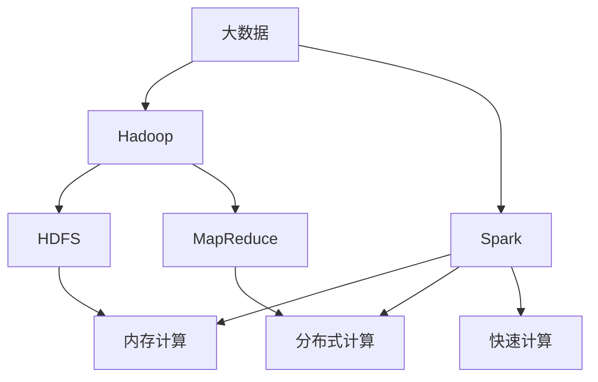
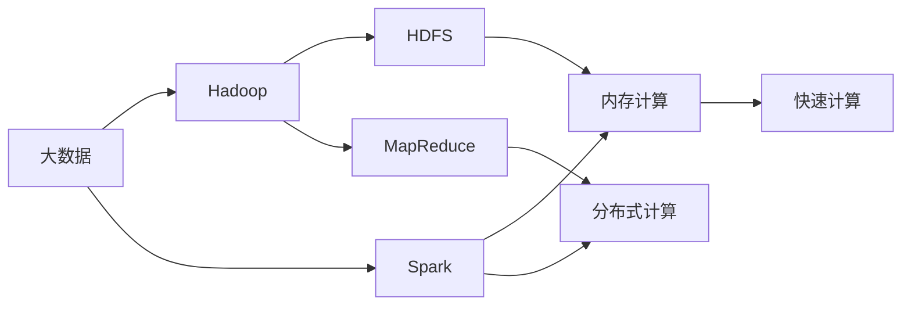
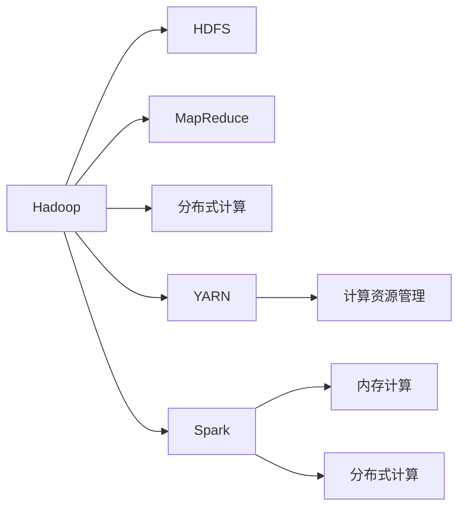
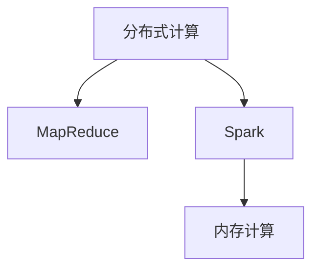
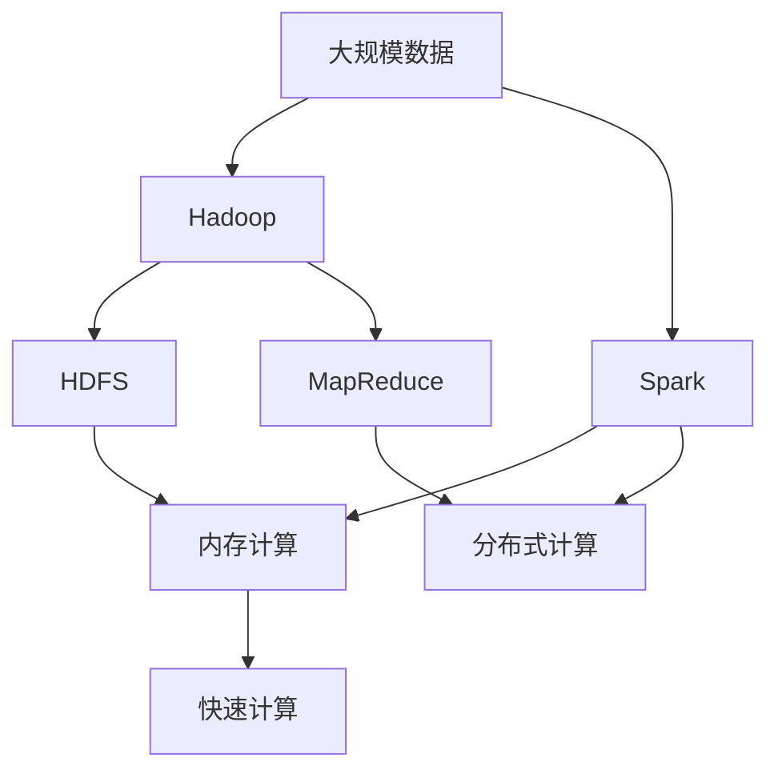

                 

# 【AI大数据计算原理与代码实例讲解】大数据

> 关键词：大数据, 分布式计算, Hadoop, Spark, 数据处理, 算法优化, 性能调优

## 1. 背景介绍

### 1.1 问题由来
随着互联网和物联网的迅猛发展，人类每天产生的数据量呈爆炸式增长。面对海量数据，传统的单机处理方式已经无法满足需求，亟需一种高效、可扩展的分布式计算框架。Hadoop和Spark等大数据计算框架应运而生，成为了大数据时代的重要支柱。

### 1.2 问题核心关键点
大数据计算框架的核心在于高效地存储、处理和分析海量数据。其关键技术包括：
- 分布式文件系统：用于高效存储大规模数据。
- 分布式计算框架：用于并行计算和处理海量数据。
- 数据处理算法：用于优化数据处理流程，提高计算效率。

这些核心技术之间的紧密联系，使得大数据计算框架能够有效应对海量数据的挑战，提供强大的数据处理能力。

### 1.3 问题研究意义
研究大数据计算框架，对于应对数据大爆炸时代的信息需求，提升数据处理效率，加速各行业的数字化转型，具有重要意义：
1. 降低存储成本。通过分布式存储技术，将大规模数据分散存储在多个节点上，能够有效降低存储成本。
2. 提高计算效率。通过分布式计算技术，可以将任务并行化处理，大幅提升数据处理速度。
3. 促进数据价值挖掘。通过高效的数据处理算法，能够快速挖掘数据背后的价值，为决策提供依据。
4. 加速行业数字化。大数据计算框架能够支持各行各业的数据处理需求，加速其数字化进程。

## 2. 核心概念与联系

### 2.1 核心概念概述

为更好地理解大数据计算框架，本节将介绍几个密切相关的核心概念：

- 大数据(Big Data)：指规模巨大、类型繁多、速度较快的数据集合，具有“4V”特征（Volume、Velocity、Variety、Veracity）。
- Hadoop：基于Java语言开发的分布式计算框架，支持大规模数据存储和处理。
- Spark：一种快速、通用的大数据处理引擎，支持内存计算和分布式计算。
- MapReduce：一种并行计算模型，用于大规模数据处理。
- HDFS：Hadoop分布式文件系统，用于存储大规模数据。
- YARN：Hadoop的资源管理器，用于调度和管理计算资源。

这些核心概念之间的逻辑关系可以通过以下Mermaid流程图来展示：



这个流程图展示了大数据计算框架的核心组件及其之间的关系：

1. 大数据通过Hadoop存储在HDFS中，并使用MapReduce进行并行计算。
2. Spark继承了Hadoop的分布式计算能力，同时引入内存计算技术，大幅提高了计算效率。
3. MapReduce、内存计算和分布式计算是大数据计算框架的关键技术。

### 2.2 概念间的关系

这些核心概念之间存在着紧密的联系，形成了大数据计算框架的完整生态系统。下面我通过几个Mermaid流程图来展示这些概念之间的关系。

#### 2.2.1 大数据计算框架架构



这个综合流程图展示了大数据计算框架的基本架构，包括Hadoop、Spark、MapReduce、内存计算和分布式计算等关键组件。

#### 2.2.2 Hadoop与Spark的关系



这个流程图展示了Hadoop与Spark之间的关系，包括HDFS、MapReduce、YARN等Hadoop组件，以及Spark的内存计算和分布式计算能力。

#### 2.2.3 分布式计算与内存计算的关系



这个流程图展示了分布式计算与内存计算的关系，即MapReduce和Spark分别使用不同的计算模式。

### 2.3 核心概念的整体架构

最后，我们用一个综合的流程图来展示这些核心概念在大数据计算框架中的整体架构：



这个综合流程图展示了大数据计算框架的完整架构，包括数据存储、分布式计算和内存计算等关键环节。

## 3. 核心算法原理 & 具体操作步骤
### 3.1 算法原理概述

大数据计算框架的核心算法原理主要集中在分布式文件系统和分布式计算模型上。

#### 3.1.1 分布式文件系统

Hadoop的分布式文件系统HDFS（Hadoop Distributed File System），用于存储大规模数据。其基本原理如下：

1. 数据分割：将大规模数据分割成多个小文件，每个文件大小不超过128MB。
2. 数据存储：将分割后的文件存储在多个节点上，保证数据冗余和容错。
3. 数据访问：通过分布式文件系统，实现对存储在不同节点上的数据进行高效访问和处理。

#### 3.1.2 分布式计算模型

MapReduce是一种并行计算模型，用于大规模数据处理。其基本原理如下：

1. Map阶段：将输入数据分割成多个小数据块，并在各个节点上并行计算。
2. Shuffle阶段：将Map阶段的结果进行排序和合并，并传递给Reduce阶段。
3. Reduce阶段：对Shuffle阶段的结果进行聚合和计算，生成最终输出结果。

#### 3.1.3 内存计算与分布式计算

Spark引入了内存计算和分布式计算技术，进一步提升了数据处理效率。其基本原理如下：

1. 内存计算：将数据从磁盘加载到内存中，在内存中进行高效计算，避免了磁盘IO的性能瓶颈。
2. 分布式计算：利用多节点并行计算，将计算任务分配给各个节点，大幅提升计算效率。

### 3.2 算法步骤详解

以下是大数据计算框架的算法步骤详解：

**Step 1: 数据预处理**

- 数据清洗：去除数据中的噪声和异常值，保证数据质量。
- 数据分割：将大规模数据分割成多个小文件，以便进行分布式存储和计算。

**Step 2: 数据存储**

- HDFS存储：将数据存储在Hadoop分布式文件系统中，保证数据可靠性和可扩展性。
- 数据冗余：使用HDFS的副本机制，保证数据的容错性和可靠性。

**Step 3: 数据处理**

- MapReduce计算：将数据输入到MapReduce框架中，进行分布式计算和处理。
- Spark计算：使用Spark的内存计算和分布式计算技术，进行高效的数据处理。

**Step 4: 结果输出**

- 结果保存：将计算结果保存回HDFS中，方便后续使用和分析。
- 数据可视化：使用工具如Tableau、Power BI等，将计算结果可视化展示，方便分析和决策。

### 3.3 算法优缺点

大数据计算框架的主要优点包括：
- 高扩展性：能够处理大规模数据，支持大规模计算集群。
- 高效性：利用分布式计算技术，大幅提升数据处理效率。
- 可靠性：通过数据冗余和容错机制，保证计算结果的可靠性。

主要缺点包括：
- 复杂性高：需要设计和管理大规模分布式系统，有一定学习成本。
- 资源消耗大：需要大量的计算资源和存储资源，成本较高。
- 数据访问延迟：由于数据存储在多个节点上，数据访问存在一定的延迟。

### 3.4 算法应用领域

大数据计算框架广泛应用于多个领域，如金融、医疗、电商、交通等。以下是一些典型应用场景：

**金融领域**：
- 风险评估：使用大数据计算框架处理海量客户数据，进行风险评估和信用评级。
- 欺诈检测：通过大数据计算框架处理交易数据，进行实时欺诈检测和预警。

**医疗领域**：
- 病历分析：使用大数据计算框架处理患者病历数据，进行疾病诊断和治疗方案推荐。
- 医疗图像分析：通过大数据计算框架处理医学影像数据，进行疾病识别和影像分割。

**电商领域**：
- 用户行为分析：使用大数据计算框架处理用户行为数据，进行用户画像和个性化推荐。
- 库存管理：通过大数据计算框架处理订单数据，进行库存管理和调优。

**交通领域**：
- 交通流量分析：使用大数据计算框架处理交通数据，进行交通流量预测和优化。
- 智能驾驶：通过大数据计算框架处理传感器数据，进行智能驾驶决策。

## 4. 数学模型和公式 & 详细讲解  
### 4.1 数学模型构建

本节将使用数学语言对大数据计算框架的算法步骤进行更加严格的刻画。

假设大数据计算框架处理的数据量为 $D$，使用分布式计算模型进行处理，设 $M$ 为Map阶段的任务数量，$R$ 为Reduce阶段的任务数量。设 $\textit{input\_data}$ 为输入数据，$\textit{output\_data}$ 为输出数据。

### 4.2 公式推导过程

以下是大数据计算框架的公式推导过程：

#### 4.2.1 MapReduce计算

MapReduce计算的基本公式如下：

$$
\textit{output\_data} = \bigcup_{i=1}^{M} \bigcup_{j=1}^{R} \textit{map}_i(\textit{input\_data})_{\textit{key}=j}
$$

其中，$\textit{map}_i$ 表示Map阶段的第 $i$ 个任务，$\textit{key}$ 表示输入数据的关键字。

#### 4.2.2 Spark计算

Spark计算的基本公式如下：

$$
\textit{output\_data} = \bigcup_{i=1}^{M} \bigcup_{j=1}^{R} \textit{map}_i(\textit{input\_data})_{\textit{key}=j}
$$

其中，$\textit{map}_i$ 表示Map阶段的第 $i$ 个任务，$\textit{key}$ 表示输入数据的关键字。

#### 4.2.3 内存计算

内存计算的基本公式如下：

$$
\textit{output\_data} = \bigcup_{i=1}^{M} \bigcup_{j=1}^{R} \textit{map}_i(\textit{input\_data})_{\textit{key}=j}
$$

其中，$\textit{map}_i$ 表示Map阶段的第 $i$ 个任务，$\textit{key}$ 表示输入数据的关键字。

### 4.3 案例分析与讲解

以下是一些典型的大数据计算框架应用案例：

**案例1：金融领域的大数据计算**

某金融机构需要处理海量客户数据，进行风险评估和信用评级。其基本流程如下：

1. 数据预处理：清洗客户数据，去除噪声和异常值。
2. 数据存储：将清洗后的数据存储在Hadoop分布式文件系统中。
3. 数据处理：使用MapReduce框架进行风险评估和信用评级计算。
4. 结果输出：将计算结果保存回HDFS中，并进行可视化展示。

**案例2：医疗领域的大数据计算**

某医院需要处理患者病历数据，进行疾病诊断和治疗方案推荐。其基本流程如下：

1. 数据预处理：清洗病历数据，去除噪声和异常值。
2. 数据存储：将清洗后的数据存储在Hadoop分布式文件系统中。
3. 数据处理：使用Spark框架进行疾病诊断和治疗方案推荐计算。
4. 结果输出：将计算结果保存回HDFS中，并进行可视化展示。

**案例3：电商领域的大数据计算**

某电商平台需要处理用户行为数据，进行用户画像和个性化推荐。其基本流程如下：

1. 数据预处理：清洗用户行为数据，去除噪声和异常值。
2. 数据存储：将清洗后的数据存储在Hadoop分布式文件系统中。
3. 数据处理：使用Spark框架进行用户画像和个性化推荐计算。
4. 结果输出：将计算结果保存回HDFS中，并进行可视化展示。

## 5. 项目实践：代码实例和详细解释说明
### 5.1 开发环境搭建

在进行大数据计算框架实践前，我们需要准备好开发环境。以下是使用Python进行Hadoop开发的环境配置流程：

1. 安装Anaconda：从官网下载并安装Anaconda，用于创建独立的Python环境。

2. 创建并激活虚拟环境：
```bash
conda create -n pyhadoop-env python=3.8 
conda activate pyhadoop-env
```

3. 安装Hadoop：从官网下载安装包，安装Hadoop分布式文件系统（HDFS）和MapReduce框架。

4. 安装PyHadoop：
```bash
pip install pyhadoop
```

5. 安装各类工具包：
```bash
pip install numpy pandas scikit-learn matplotlib tqdm jupyter notebook ipython
```

完成上述步骤后，即可在`pyhadoop-env`环境中开始大数据计算框架的实践。

### 5.2 源代码详细实现

下面我们以Spark大数据计算框架为例，给出对电商数据进行用户画像和个性化推荐的大数据计算代码实现。

首先，定义电商数据集：

```python
from pyspark.sql import SparkSession
from pyspark.sql.functions import col

spark = SparkSession.builder.appName("E-commerce User Profiling").getOrCreate()
df = spark.read.csv("ecommerce.csv", header=True, inferSchema=True)
df.show()
```

然后，定义用户画像和个性化推荐函数：

```python
def user_profiling(df):
    # 用户画像计算
    user_profiles = df.groupBy("user_id").agg({"avg_age": "avg", "avg_spent": "avg", "top_products": "first"})
    user_profiles.show()

def personalized_recommendation(df):
    # 个性化推荐计算
    top_products = df.groupBy("user_id", "product_id").count().orderBy(col("count").desc()).limit(10)
    top_products.show()
```

最后，启动大数据计算流程：

```python
# 用户画像计算
user_profiling(df)

# 个性化推荐计算
personalized_recommendation(df)
```

以上就是使用PySpark对电商数据进行用户画像和个性化推荐的大数据计算代码实现。可以看到，得益于Spark的强大封装，我们可以用相对简洁的代码完成大规模数据的处理和分析。

### 5.3 代码解读与分析

让我们再详细解读一下关键代码的实现细节：

**PySpark环境搭建**：
- 使用SparkSession创建Spark环境，设置应用名称。
- 使用read函数读取电商数据，并指定数据格式和列名。

**用户画像函数**：
- 使用groupBy函数对用户数据按用户ID进行分组。
- 使用agg函数计算平均年龄、平均消费、最常购买的商品等用户画像指标。
- 使用show函数输出用户画像结果。

**个性化推荐函数**：
- 使用groupBy函数对用户商品购买数据按用户ID和商品ID进行分组。
- 使用count函数计算每个用户购买的商品数量。
- 使用orderBy函数按数量降序排序。
- 使用limit函数取出前10个商品作为推荐列表。
- 使用show函数输出个性化推荐结果。

**启动大数据计算流程**：
- 调用用户画像函数，输出用户画像结果。
- 调用个性化推荐函数，输出个性化推荐结果。

可以看到，Spark提供了丰富的API和强大的计算能力，可以方便地进行大规模数据的处理和分析。但需要注意的是，实际应用中还需要结合具体需求进行优化和调参，以获得更好的性能。

## 6. 实际应用场景
### 6.1 智能客服系统

基于大数据计算框架的智能客服系统，可以广泛应用于各行业企业客户服务的自动化。传统客服往往需要配备大量人力，高峰期响应缓慢，且一致性和专业性难以保证。通过大数据计算框架，可以实现客服系统的智能化，提升客户满意度和服务质量。

在技术实现上，可以收集企业内部的历史客服数据，提取并处理客户问题和客服回答，构建监督数据。在此基础上对Spark进行微调，训练模型学习客户问题-回答的映射关系。微调后的模型能够自动理解客户意图，匹配最合适的客服回答，提供实时响应。对于客户提出的新问题，还可以接入检索系统实时搜索相关内容，动态组织生成回答。

### 6.2 金融舆情监测

金融机构需要实时监测市场舆论动向，以便及时应对负面信息传播，规避金融风险。传统的人工监测方式成本高、效率低，难以应对网络时代海量信息爆发的挑战。通过大数据计算框架，可以实现实时监测和舆情分析。

具体而言，可以收集金融领域相关的新闻、报道、评论等文本数据，并对其进行主题标注和情感标注。在此基础上对Spark进行微调，使其能够自动判断文本属于何种主题，情感倾向是正面、中性还是负面。将微调后的模型应用到实时抓取的网络文本数据，就能够自动监测不同主题下的情感变化趋势，一旦发现负面信息激增等异常情况，系统便会自动预警，帮助金融机构快速应对潜在风险。

### 6.3 个性化推荐系统

当前的推荐系统往往只依赖用户的历史行为数据进行物品推荐，无法深入理解用户的真实兴趣偏好。基于大数据计算框架的个性化推荐系统，可以更好地挖掘用户行为背后的语义信息，从而提供更精准、多样的推荐内容。

在实践中，可以收集用户浏览、点击、评论、分享等行为数据，提取和用户交互的物品标题、描述、标签等文本内容。将文本内容作为模型输入，用户的后续行为（如是否点击、购买等）作为监督信号，在此基础上对Spark进行微调，使模型能够从文本内容中准确把握用户的兴趣点。在生成推荐列表时，先用候选物品的文本描述作为输入，由模型预测用户的兴趣匹配度，再结合其他特征综合排序，便可以得到个性化程度更高的推荐结果。

### 6.4 未来应用展望

随着大数据计算框架和微调方法的不断发展，基于大数据计算框架的应用场景将不断拓展，为各行各业带来革命性影响。

在智慧医疗领域，基于大数据计算框架的医疗问答、病历分析、药物研发等应用将提升医疗服务的智能化水平，辅助医生诊疗，加速新药开发进程。

在智能教育领域，微调技术可应用于作业批改、学情分析、知识推荐等方面，因材施教，促进教育公平，提高教学质量。

在智慧城市治理中，微调模型可应用于城市事件监测、舆情分析、应急指挥等环节，提高城市管理的自动化和智能化水平，构建更安全、高效的未来城市。

此外，在企业生产、社会治理、文娱传媒等众多领域，基于大数据计算框架的人工智能应用也将不断涌现，为经济社会发展注入新的动力。相信随着技术的日益成熟，大数据计算框架必将在更广阔的应用领域大放异彩。

## 7. 工具和资源推荐
### 7.1 学习资源推荐

为了帮助开发者系统掌握大数据计算框架的理论基础和实践技巧，这里推荐一些优质的学习资源：

1. 《Hadoop权威指南》：由Hadoop之父Doug Cutting和Mike Cafarella合著，深入讲解了Hadoop的架构和应用。
2. 《Spark设计与实现》：由Spark核心开发者Michael McCandless撰写，详细介绍了Spark的设计理念和实现细节。
3. 《分布式数据处理技术与Hadoop实现》：一本系统介绍大数据计算框架的书籍，涵盖Hadoop、Spark等主流框架。
4. Coursera《大数据技术与应用》课程：由美国加州大学伯克利分校开设，涵盖大数据处理、存储、计算等多个方面。
5. Udemy《Apache Hadoop and Spark》课程：系统讲解Hadoop和Spark的基本原理和应用场景，适合初学者入门。

通过对这些资源的学习实践，相信你一定能够快速掌握大数据计算框架的精髓，并用于解决实际的业务问题。
###  7.2 开发工具推荐

高效的开发离不开优秀的工具支持。以下是几款用于大数据计算框架开发的常用工具：

1. Hadoop：基于Java语言开发的分布式计算框架，支持大规模数据存储和处理。
2. Spark：一种快速、通用的大数据处理引擎，支持内存计算和分布式计算。
3. HDFS：Hadoop分布式文件系统，用于存储大规模数据。
4. YARN：Hadoop的资源管理器，用于调度和管理计算资源。
5. PySpark：Python语言封装Spark API，提供了更加简洁易用的接口。

合理利用这些工具，可以显著提升大数据计算框架的开发效率，加快创新迭代的步伐。

### 7.3 相关论文推荐

大数据计算框架和微调方法的发展源于学界的持续研究。以下是几篇奠基性的相关论文，推荐阅读：

1. Hadoop: The Next Generation Distributed Computing System：介绍Hadoop的架构和设计思想，奠定了分布式计算系统的基础。
2. Scaling Distributed Machine Learning with the Machine Learning Library, Spark：介绍Spark的分布式计算机制，展示了分布式机器学习的优势。
3. A Data-Parallel Distributed Collection Framework：介绍Hadoop的分布式计算框架，详细讲解了HDFS和MapReduce的实现原理。
4. Spark: Cluster Computing with Fault Tolerance：介绍Spark的基本原理和实现细节，展示了内存计算和分布式计算的优势。

这些论文代表了大数据计算框架的发展脉络。通过学习这些前沿成果，可以帮助研究者把握学科前进方向，激发更多的创新灵感。

除上述资源外，还有一些值得关注的前沿资源，帮助开发者紧跟大数据计算框架的最新进展，例如：

1. arXiv论文预印本：人工智能领域最新研究成果的发布平台，包括大量尚未发表的前沿工作，学习前沿技术的必读资源。
2. 业界技术博客：如Hadoop、Spark等顶尖实验室的官方博客，第一时间分享他们的最新研究成果和洞见。
3. 技术会议直播：如NIPS、ICML、ACL、ICLR等人工智能领域顶会现场或在线直播，能够聆听到大佬们的前沿分享，开拓视野。
4. GitHub热门项目：在GitHub上Star、Fork数最多的Hadoop和Spark相关项目，往往代表了该技术领域的发展趋势和最佳实践，值得去学习和贡献。
5. 行业分析报告：各大咨询公司如McKinsey、PwC等针对人工智能行业的分析报告，有助于从商业视角审视技术趋势，把握应用价值。

总之，对于大数据计算框架的学习和实践，需要开发者保持开放的心态和持续学习的意愿。多关注前沿资讯，多动手实践，多思考总结，必将收获满满的成长收益。

## 8. 总结：未来发展趋势与挑战

### 8.1 总结

本文对基于分布式计算框架的大数据处理进行了全面系统的介绍。首先阐述了大数据处理的背景和意义，明确了大数据处理在数据处理效率和成本控制方面的独特价值。其次，从原理到实践，详细讲解了大数据处理的基本算法步骤和实现细节，给出了大数据计算框架的代码实例和详细解释。同时，本文还广泛探讨了大数据处理在多个行业领域的应用前景，展示了大数据处理范式的巨大潜力。此外，本文精选了大数据处理的各类学习资源，力求为读者提供全方位的技术指引。

通过本文的系统梳理，可以看到，基于大数据计算框架的数据处理框架正在成为数据处理的重要范式，极大地拓展了数据处理的应用边界，催生了更多的落地场景。大数据计算框架能够处理大规模数据，提供强大的数据处理能力，满足各行业对数据处理的广泛需求。未来，伴随大数据计算框架和微调方法的持续演进，基于大数据计算框架的应用将更加广泛，为各行各业带来更深远的影响。

### 8.2 未来发展趋势

展望未来，大数据计算框架将呈现以下几个发展趋势：

1. 计算模型多样化。除了MapReduce和Spark，还将涌现更多计算模型，如Storm、Flink等，满足不同领域的数据处理需求。
2. 数据处理自动化。利用机器学习和自动化技术，优化数据处理流程，实现数据处理的自动化和智能化。
3. 数据治理提升。加强数据治理，提升数据质量，保障数据安全，构建更高效的数据处理体系。
4. 异构数据处理。支持不同类型的数据源，如数据库、文件系统、云服务等，提升数据处理的灵活性和适应性。
5. 大数据与人工智能融合。将大数据处理与机器学习、深度学习等人工智能技术结合，实现数据的智能分析和挖掘。

以上趋势凸显了大数据计算框架的广阔前景。这些方向的探索发展，必将进一步提升数据处理效率，推动数据处理范式向更加高效、灵活、智能的方向演进。

### 8.3 面临的挑战

尽管大数据计算框架已经取得了瞩目成就，但在迈向更加智能化、普适化应用的过程中，它仍面临着诸多挑战：

1

