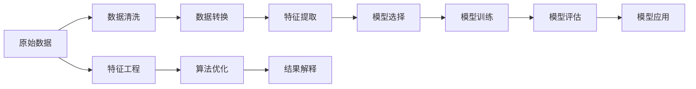
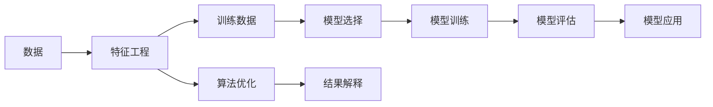

                 

# 【AI大数据计算原理与代码实例讲解】数据挖掘

> 关键词：数据挖掘, 大数据计算, 算法原理, 实际应用, 数学模型, 代码实现, 未来展望

## 1. 背景介绍

### 1.1 问题由来
在信息技术迅猛发展的今天，数据已经成为一种极具价值的资产。各行各业都希望能够通过分析海量数据，挖掘出有价值的信息，以辅助决策、优化流程、提升效率。然而，数据量巨大且结构复杂，传统的统计分析方法已经无法满足需求。数据挖掘（Data Mining），也称为知识发现（Knowledge Discovery in Databases, KDD），正是针对这一问题应运而生。它通过各种数据处理技术，自动分析数据，发现其中的模式和规律，从而为决策者提供支持。

### 1.2 问题核心关键点
数据挖掘的核心问题包括：
1. 如何从海量的数据中提取有用的信息。
2. 如何选择合适的模型和算法，高效地发现数据中的规律。
3. 如何评估和解释挖掘出的模型结果，以便进行合理的决策。
4. 如何处理缺失值、异常值等数据质量问题，提高数据的准确性和可用性。
5. 如何保证挖掘过程的透明性和可解释性，增强用户信任。

### 1.3 问题研究意义
数据挖掘在商业决策、金融分析、医疗诊断、市场营销等领域具有广泛的应用，其重要性不言而喻。它不仅能够帮助企业优化业务流程，提高经营效率，还能够为科学家提供新的研究思路，推动技术创新。因此，深入理解数据挖掘的原理和应用，对于企业和研究人员都有着重要的意义。

## 2. 核心概念与联系

### 2.1 核心概念概述

数据挖掘涉及多个关键概念，包括但不限于：

- **大数据**：指规模庞大、复杂多变的数据集，通常包括结构化数据、非结构化数据和半结构化数据。
- **数据预处理**：对原始数据进行清洗、转换和集成，以提高数据质量和可用性。
- **特征工程**：通过选择、构造和变换特征，提取对模型有利的输入信息。
- **算法选择**：根据问题类型选择合适的数据挖掘算法，如分类、聚类、关联规则挖掘等。
- **模型训练**：利用训练数据集对算法进行训练，得到用于预测或分类的模型。
- **模型评估**：使用测试数据集对模型进行评估，衡量其性能和泛化能力。
- **模型应用**：将训练好的模型应用于实际场景，实现对新数据的预测或分类。

这些概念相互联系，共同构成数据挖掘的基本框架。下图展示了数据挖掘的核心概念及其相互关系：


### 2.2 概念间的关系

数据挖掘的各个环节之间存在着紧密的联系，如下文所展示的流程图：

#### 2.2.1 数据挖掘的基本流程



这个流程图展示了数据挖掘的基本流程，包括数据清洗、特征提取、模型选择、训练、评估和应用等环节。在实际应用中，还需要考虑模型的优化和结果的解释，以提高数据挖掘的准确性和可靠性。

#### 2.2.2 数据挖掘与机器学习的联系

数据挖掘与机器学习密切相关，可以视为机器学习的一个子领域。机器学习通过各种算法对数据进行建模和预测，而数据挖掘则更侧重于发现数据中的隐含知识和模式。数据挖掘和机器学习的联系可以通过以下流程图展示：



这个流程图展示了数据挖掘与机器学习之间的联系。特征工程和模型选择是两个关键环节，既需要机器学习的指导，也需要数据挖掘的反馈。

## 3. 核心算法原理 & 具体操作步骤

### 3.1 算法原理概述

数据挖掘的算法原理主要基于统计学和机器学习理论。常见的数据挖掘算法包括：

- **分类算法**：如决策树、朴素贝叶斯、支持向量机等，用于将数据分成不同的类别。
- **聚类算法**：如K-means、层次聚类、DBSCAN等，用于将数据分成若干个相似簇。
- **关联规则挖掘算法**：如Apriori、FP-growth等，用于发现数据项之间的关联关系。
- **时间序列分析算法**：如ARIMA、指数平滑等，用于预测未来的趋势和模式。
- **异常检测算法**：如孤立森林、LOF等，用于识别异常数据。

这些算法通过不同的技术手段，对数据进行建模和分析，揭示出数据中的模式和规律。

### 3.2 算法步骤详解

数据挖掘的算法步骤一般包括以下几个环节：

1. **数据准备**：收集、清洗和预处理数据，准备用于挖掘的数据集。
2. **特征选择和构造**：选择合适的特征，构造新的特征，以提高模型的准确性和泛化能力。
3. **算法选择和训练**：选择合适的算法，使用训练数据对算法进行训练，得到模型。
4. **模型评估**：使用测试数据集对模型进行评估，衡量其性能和泛化能力。
5. **模型应用**：将训练好的模型应用于实际场景，进行预测或分类。

每个环节都需要精心设计和操作，以确保数据挖掘的准确性和可靠性。

### 3.3 算法优缺点

数据挖掘算法具有以下优点：
1. 自动化程度高：数据挖掘能够自动分析数据，发现其中的模式和规律，减少了人工干预。
2. 处理大数据能力强：数据挖掘算法能够处理大规模的数据集，挖掘出有价值的信息。
3. 适用性强：数据挖掘算法可以应用于多个领域，如商业决策、金融分析、医疗诊断等。

同时，数据挖掘算法也存在一些缺点：
1. 数据质量要求高：数据挖掘结果的准确性和可靠性很大程度上取决于数据的质量，如数据缺失、异常值等问题。
2. 算法复杂度高：一些高级的数据挖掘算法，如神经网络、随机森林等，其计算复杂度高，需要强大的计算资源。
3. 结果可解释性差：一些复杂的数据挖掘模型，如深度学习模型，其内部机制难以解释，增加了应用难度。

### 3.4 算法应用领域

数据挖掘算法广泛应用于多个领域，以下是几个典型的应用场景：

- **商业智能（Business Intelligence, BI）**：利用数据挖掘技术，分析客户行为和市场趋势，优化营销策略，提升销售业绩。
- **金融分析**：通过分析历史数据和市场数据，预测股票价格和市场波动，辅助投资决策。
- **医疗诊断**：利用患者历史数据和临床数据，挖掘出疾病风险因素和诊断模式，提高诊断准确性。
- **市场营销**：分析消费者行为和市场反馈，发现潜在客户和产品改进方向，优化营销效果。
- **供应链管理**：通过分析供应链数据，优化库存管理、降低成本、提升效率。

## 4. 数学模型和公式 & 详细讲解 & 举例说明

### 4.1 数学模型构建

数据挖掘的数学模型主要包括：

- **分类模型**：如决策树、朴素贝叶斯等，使用特征和标签训练模型，用于分类预测。
- **聚类模型**：如K-means、层次聚类等，使用特征训练模型，用于数据分组。
- **关联规则模型**：如Apriori、FP-growth等，使用交易数据训练模型，用于关联关系挖掘。
- **时间序列模型**：如ARIMA、指数平滑等，使用时间序列数据训练模型，用于趋势预测。
- **异常检测模型**：如孤立森林、LOF等，使用数据特征训练模型，用于异常检测。

### 4.2 公式推导过程

以下是几个经典数据挖掘算法的公式推导过程：

**决策树（Decision Tree）**

决策树是一种分类算法，通过构建树形结构，将数据分成不同的类别。决策树的构建过程包括：

1. 选择最佳特征：根据信息增益或信息增益比，选择最佳特征进行分割。
2. 分割数据集：根据最佳特征，将数据集分割成多个子集。
3. 递归构建子树：对每个子集重复上述步骤，构建子树。

决策树的公式推导如下：

$$
\begin{aligned}
    H(D|S) &= \sum_{i=1}^{n} \frac{|S_i|}{|S|} H(D|S_i) \\
    &= \sum_{i=1}^{n} \frac{|S_i|}{|S|} H(D|S_i) \\
    &= \sum_{i=1}^{n} \frac{|S_i|}{|S|} (-\sum_{y \in C} p(y|S_i) \log p(y|S_i)) \\
    &= - \frac{1}{|S|} \sum_{i=1}^{n} \sum_{y \in C} p(y|S_i) \log p(y|S_i) \\
    &= - \frac{1}{|S|} \sum_{i=1}^{n} \frac{|S_i|}{|S|} \log \frac{|S_i|}{|S|} \\
    &= - \frac{1}{|S|} \sum_{i=1}^{n} \frac{|S_i|}{|S|} ( \log |S_i| - \log |S| ) \\
    &= - \frac{1}{|S|} \sum_{i=1}^{n} |S_i| \log \frac{|S_i|}{|S|}
\end{aligned}
$$

其中，$S$ 为训练集，$S_i$ 为分割后的子集，$C$ 为类别集合，$H(D|S)$ 为信息熵，$p(y|S_i)$ 为条件概率。

**朴素贝叶斯（Naive Bayes）**

朴素贝叶斯是一种基于贝叶斯定理的分类算法，假设各个特征之间相互独立，利用训练集计算出每个类别的先验概率和条件概率，用于分类预测。

朴素贝叶斯的公式推导如下：

$$
P(y|x) = \frac{P(x|y)P(y)}{P(x)}
$$

其中，$y$ 为类别，$x$ 为特征向量，$P(y)$ 为先验概率，$P(x|y)$ 为条件概率，$P(x)$ 为先验概率。

**K-means聚类算法**

K-means是一种聚类算法，将数据集分成$k$个簇，每个簇的中心点由数据点的均值确定。K-means的公式推导如下：

1. 初始化$k$个簇的中心点
2. 对每个数据点，计算其到各簇中心的距离，分配到最近的簇中
3. 更新每个簇的中心点，为其分配的数据点求均值
4. 重复步骤2和3，直到收敛

K-means的公式推导如下：

$$
\begin{aligned}
    J(\mu) &= \frac{1}{2} \sum_{i=1}^{n} \sum_{j=1}^{k} x_i^j (z_i^j - \mu_j)^2 \\
    &= \frac{1}{2} \sum_{i=1}^{n} \sum_{j=1}^{k} \left( x_i^j - \frac{\sum_{z_i^j=1} x_i^j}{\sum_{z_i^j=1}} \right)^2 \\
    &= \frac{1}{2} \sum_{i=1}^{n} \sum_{j=1}^{k} \left( x_i^j - \frac{\sum_{z_i^j=1} x_i^j}{\sum_{z_i^j=1}} \right)^2
\end{aligned}
$$

其中，$\mu$ 为簇中心点，$x_i^j$ 为数据点的特征值，$z_i^j$ 为数据点分配的簇编号。

### 4.3 案例分析与讲解

以下是几个经典的数据挖掘案例分析：

**案例1：客户细分**

一家电子商务公司希望通过数据挖掘，将客户分成不同的细分市场，以便提供个性化的营销策略。使用K-means聚类算法，将客户分成多个细分市场，每个市场的客户具有相似的购买行为和偏好。

**案例2：异常检测**

一家金融机构希望通过数据挖掘，识别出潜在的欺诈行为。使用孤立森林算法，训练模型对每个客户的交易记录进行异常检测，发现异常行为，及时采取措施。

**案例3：市场趋势预测**

一家零售公司希望通过数据挖掘，预测未来的市场趋势和销售情况。使用ARIMA算法，利用历史销售数据和市场数据，预测未来的销售量和价格变化。

## 5. 项目实践：代码实例和详细解释说明

### 5.1 开发环境搭建

在进行数据挖掘实践前，我们需要准备好开发环境。以下是使用Python进行Scikit-learn开发的环境配置流程：

1. 安装Anaconda：从官网下载并安装Anaconda，用于创建独立的Python环境。

2. 创建并激活虚拟环境：
```bash
conda create -n scikit-learn-env python=3.8 
conda activate scikit-learn-env
```

3. 安装Scikit-learn：
```bash
pip install scikit-learn
```

4. 安装各类工具包：
```bash
pip install numpy pandas scikit-learn matplotlib tqdm jupyter notebook ipython
```

完成上述步骤后，即可在`scikit-learn-env`环境中开始数据挖掘实践。

### 5.2 源代码详细实现

以下是一个使用Scikit-learn库进行K-means聚类分析的Python代码实现。

```python
from sklearn.cluster import KMeans
from sklearn.datasets import make_blobs
import matplotlib.pyplot as plt

# 生成模拟数据
centers = [[1, 1], [-1, -1], [1, -1]]
X, y_true = make_blobs(n_samples=300, centers=centers, cluster_std=0.5, random_state=42)
y_pred = KMeans(n_clusters=3, random_state=42).fit(X).labels_

# 绘制聚类结果
plt.scatter(X[:, 0], X[:, 1], c=y_pred, cmap='viridis')
plt.scatter(centers, marker='^', s=200, linewidths=3)
plt.title('K-means Clustering')
plt.show()
```

### 5.3 代码解读与分析

这段代码实现了K-means聚类分析的过程，主要包括：

1. 生成模拟数据：使用Scikit-learn库中的make_blobs函数，生成包含三个簇的数据集，每个簇的中心点为[[1, 1], [-1, -1], [1, -1]]。
2. 训练K-means模型：使用Scikit-learn库中的KMeans函数，训练K-means模型，将数据集分成三个簇。
3. 绘制聚类结果：使用Matplotlib库绘制聚类结果，将每个数据点根据其所属的簇用不同的颜色表示，并用小三角标记每个簇的中心点。

通过这段代码，我们可以清晰地看到K-means聚类算法的效果，将数据分成三个簇，每个簇的中心点与原来的中心点基本一致。

## 6. 实际应用场景

### 6.1 智能推荐系统

智能推荐系统通过分析用户行为数据，为用户推荐感兴趣的物品。使用数据挖掘技术，可以从用户的浏览、点击、评分等行为数据中挖掘出用户的兴趣点，并根据这些信息进行推荐。

**实际应用**：
- 电商平台：分析用户的浏览记录和购买行为，为用户推荐相似的商品。
- 视频平台：分析用户的观看记录和评分数据，为用户推荐相关的视频内容。
- 社交网络：分析用户的互动数据，为用户推荐感兴趣的朋友和话题。

### 6.2 客户细分和营销策略

通过数据挖掘技术，可以将客户分成不同的细分市场，以便提供个性化的营销策略。

**实际应用**：
- 电商平台：将客户分成高、中、低价值客户，分别制定不同的营销策略。
- 金融行业：将客户分成不同信用等级的群体，制定不同的信贷政策。
- 旅游行业：将客户分成不同兴趣群体的细分市场，提供定制化的旅游产品。

### 6.3 信用风险评估

通过数据挖掘技术，可以分析客户的信用历史、收入情况、消费行为等数据，评估客户的信用风险。

**实际应用**：
- 银行：评估客户的信用风险，决定是否发放贷款。
- 保险公司：评估客户的健康状况，决定是否提供保险服务。
- 零售商：评估客户的支付能力，决定是否提供分期付款服务。

## 7. 工具和资源推荐

### 7.1 学习资源推荐

为了帮助开发者系统掌握数据挖掘的理论基础和实践技巧，这里推荐一些优质的学习资源：

1. 《数据挖掘导论》书籍：详细介绍了数据挖掘的基本概念和经典算法，适合初学者和中级开发者。
2. 《机器学习实战》书籍：介绍了Scikit-learn库的使用方法，包含多个实际案例，适合动手实践。
3. Coursera和Udacity的机器学习课程：由知名高校和专家授课，涵盖了数据挖掘和机器学习的理论基础和实践技巧。
4. Kaggle数据科学竞赛平台：提供丰富的数据集和竞赛任务，通过实践提升数据挖掘技能。
5. Kaggle官方博客和社区：分享了大量优秀的数据挖掘项目和案例分析，可以借鉴和学习。

### 7.2 开发工具推荐

高效的开发离不开优秀的工具支持。以下是几款用于数据挖掘开发的常用工具：

1. Scikit-learn：Python中最流行的机器学习库之一，提供了丰富的数据挖掘算法和工具。
2. Pandas：数据处理和分析的强大工具，支持多种数据格式和操作。
3. NumPy：用于高效处理数值计算，提供了数组和矩阵运算的支持。
4. Matplotlib和Seaborn：数据可视化工具，支持多种图表和绘图方法。
5. Jupyter Notebook：交互式开发环境，支持Python和其他语言，方便进行数据分析和可视化。

### 7.3 相关论文推荐

数据挖掘的研究进展日新月异，以下是几篇具有代表性的相关论文，推荐阅读：

1. "A Survey of Data Mining Techniques and Tools"：介绍数据挖掘的基本概念和常用工具。
2. "Data Mining for Marketing Analytics"：探讨数据挖掘在市场营销中的应用，提供多个实际案例。
3. "Ensemble Methods in Data Mining"：介绍数据挖掘中的集成方法，如随机森林和梯度提升树。
4. "Frequent Pattern Mining"：介绍关联规则挖掘算法，如Apriori和FP-growth。
5. "Time Series Analysis for Data Mining"：介绍时间序列分析算法，如ARIMA和指数平滑。

这些论文代表了数据挖掘领域的研究前沿，可以提供丰富的理论基础和技术指导。

## 8. 总结：未来发展趋势与挑战

### 8.1 研究成果总结

数据挖掘技术在商业决策、金融分析、医疗诊断等领域取得了显著成效，但其发展仍面临诸多挑战。主要挑战包括数据质量、算法复杂度、结果可解释性等。未来，数据挖掘技术需要在这些方面进行深入研究和改进。

### 8.2 未来发展趋势

展望未来，数据挖掘技术将呈现以下几个发展趋势：

1. 数据规模不断增大：随着互联网和物联网的发展，数据规模将不断增大，数据挖掘技术需要处理更大规模的数据。
2. 自动化程度不断提高：自动化的数据挖掘工具和算法将不断涌现，减少人工干预。
3. 算法复杂度逐步降低：新的算法模型将逐步简化，降低计算复杂度，提高应用效率。
4. 结果可解释性增强：数据挖掘的结果需要更加透明和可解释，增强用户信任。
5. 跨领域融合加强：数据挖掘将与其他人工智能技术进行更深入的融合，如自然语言处理和计算机视觉。

### 8.3 面临的挑战

尽管数据挖掘技术在多个领域取得了显著成效，但其发展仍面临以下挑战：

1. 数据质量问题：数据挖掘结果的准确性很大程度上取决于数据的质量，如数据缺失、异常值等。
2. 算法复杂度高：一些高级的数据挖掘算法，如神经网络和随机森林，其计算复杂度高，需要强大的计算资源。
3. 结果可解释性差：一些复杂的数据挖掘模型，如深度学习模型，其内部机制难以解释，增加了应用难度。

### 8.4 研究展望

为了应对未来发展中的挑战，未来的研究需要在以下几个方面进行突破：

1. 数据质量提升：通过数据清洗、异常值处理等技术，提高数据的准确性和可用性。
2. 算法优化：开发更加高效和易于理解的数据挖掘算法，降低计算复杂度。
3. 结果解释性增强：引入可解释性技术，如模型可视化和因果推理，提高模型的透明性。
4. 跨领域融合：将数据挖掘与其他人工智能技术进行融合，形成更加全面和高效的技术体系。

这些研究方向将推动数据挖掘技术迈向更加智能化和高效化的发展阶段，为各行各业提供更加强大的数据支持。

## 9. 附录：常见问题与解答

**Q1：数据挖掘与机器学习的区别是什么？**

A: 数据挖掘与机器学习密切相关，但又有明显的区别。机器学习侧重于基于数据的建模和预测，而数据挖掘侧重于发现数据中的模式和规律。数据挖掘通常需要更多的领域知识和领域专家参与，而机器学习则更注重算法的自动化和通用性。

**Q2：数据挖掘过程中如何处理缺失值和异常值？**

A: 数据挖掘过程中，缺失值和异常值是常见的问题。通常处理缺失值的方法包括删除缺失值、插值法、均值填充等；处理异常值的方法包括删除异常值、截断法、平滑法等。具体方法需要根据数据特点和问题需求进行选择。

**Q3：数据挖掘在实际应用中需要注意哪些问题？**

A: 数据挖掘在实际应用中需要注意以下几个问题：
1. 数据质量：确保数据质量和完整性，减少噪音和干扰。
2. 模型评估：选择适合的评估指标，如准确率、召回率、F1分数等，评估模型性能。
3. 模型优化：通过交叉验证、参数调优等方法，优化模型性能。
4. 结果解释：引入可视化工具和可解释性技术，解释模型输出结果。
5. 业务应用：将数据挖掘结果应用于实际场景，进行业务优化和改进。

**Q4：如何评估数据挖掘模型的性能？**

A: 数据挖掘模型的评估通常包括训练集和测试集两个步骤。使用测试集评估模型的性能，包括准确率、召回率、F1分数、AUC等指标。还可以使用交叉验证、ROC曲线等方法评估模型的泛化能力和稳定性。评估结果需要结合具体应用场景进行综合考虑，选择合适的模型。

**Q5：数据挖掘中的特征选择和构造方法有哪些？**

A: 数据挖掘中的特征选择和构造方法包括：
1. 过滤式特征选择：通过计算特征与目标变量之间的相关性，选择最有用的特征。
2. 包裹式特征选择：通过构建模型，选择能够提高模型性能的特征。
3. 嵌入式特征选择：在模型训练过程中选择特征，如LASSO、Ridge等线性模型。
4. 特征构造：通过组合和变换现有特征，构造新的特征，如交叉项、多项式特征等。

这些方法需要根据具体应用场景和问题需求进行选择，以提高数据挖掘的准确性和可解释性。

---

作者：禅与计算机程序设计艺术 / Zen and the Art of Computer Programming

